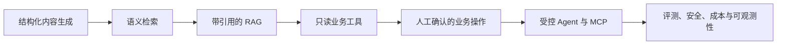
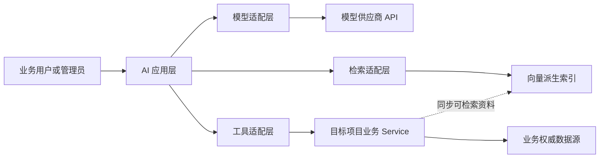
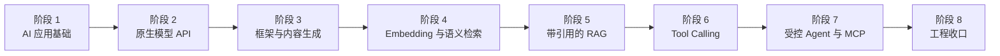

本文是 Java / Go 后端开发者进入 AI 应用开发的总路线。目标是通过可复现的小型实验和真实后端项目，逐步掌握模型调用、检索、工具编排、评测、安全与可观测性。

路线采用“概念 → 最小实验 → Java 验证 → Go 语义复刻 → 评测 → 记录”的推进方式。阶段完成由证据判定，不按固定周数推进。

具体的开源项目阅读方法见 [[GitHub AI 项目源码研读方法与清单]]，每次实验使用 [[AI 学习与实验记录模板]] 记录。

## 先明确目标与策略

这条路线培养的是 **AI 应用开发者**，不是模型训练或推理基础设施工程师。

AI 应用开发的核心工作，是把概率性的模型能力接入确定性的业务系统，并通过结构化输出、检索、工具调用、评测、安全约束和可观测性，使模型能够在真实业务中可靠工作。

“同一能力分别用 Java、Go 实现”是有价值的，但价值不能来自“两套后端都接入了聊天接口”，而要来自：

- 有完整、可信的确定性业务闭环作为底座。
- AI 能力解决真实、可验证的业务问题。
- Java 与 Go 共享产品语义和评测证据，而不是逐行翻译代码。
- 能说明质量、失败、安全、延迟和成本，而不是只展示一次成功调用。

学习与项目接入采用两条并行但不混淆的工作流：

1. **业务边界尚未稳定时**：在独立实验中学习模型 API、结构化输出、流式响应和评测，不向正式项目预埋空接口或框架依赖。
2. **业务边界稳定后**：再把已经通过固定评测的能力接入目标项目，并沿用原有鉴权、事务、状态机和幂等边界。

## 能力演进主线

这条主线最终应证明：

- 能识别适合与不适合交给模型的问题。
- 能分别用 Java 和 Go 实现相同的 AI 产品语义。
- 能处理模型输出不稳定、检索失真、工具越权、流式中断和成本失控。
- 能用固定数据和指标证明功能质量。
- 能说明 Java 与 Go 在框架、并发模型和工程实现上的取舍。

## 模型能力与业务事实的边界

大模型擅长理解自然语言、生成文本、归纳信息和提出工具调用意图，但它的输出具有概率性，不能成为业务事实来源。

各组件的责任必须保持清晰：

| 数据或能力 | 权威来源 | AI 可以做什么 | AI 不得做什么 |
| --- | --- | --- | --- |
| 内容草稿 | 经确认的业务数据 | 生成、改写、归纳、提出标签 | 未经确认直接发布 |
| 可检索业务资料 | 数据库与业务 Service | 检索、解释、推荐候选项 | 编造不存在的业务对象 |
| 数值与约束字段 | 确定性业务规则 | 查询并向用户解释 | 自行计算或覆盖权威值 |
| 业务状态 | 状态机与业务 Service | 查询、说明、提出下一步 | 直接修改或伪造执行结果 |
| 用户权限 | 认证与授权层 | 在已授权工具范围内工作 | 自行判断或扩大权限 |
| 向量与检索元数据 | 可重建派生索引 | 帮助召回相关资料 | 取代业务数据库成为事实源 |

模型只能生成草稿、答案或工具调用意图。权威数值、状态流转、事务、幂等和权限继续由确定性业务代码负责。

## 三档掌握标准

学习 AI 应用开发时，不需要把每个算法、框架和参数都当成必须背诵的内容。

| 层级 | 达成标准 | 学习方式 |
| --- | --- | --- |
| 必须熟练 | 能独立写出核心流程，能识别常见风险并设计验证 | 在固定实验和具体项目功能中反复实践 |
| 理解会查 | 知道概念解决什么问题，能沿官方文档和源码定位用法 | 结合真实问题查阅，不背低频参数 |
| 认识即可 | 看到时能判断用途、边界和是否值得继续投入 | 暂不实现，需要时再深入 |

总体分级如下：

- **必须熟练**：模型 API、结构化输出、流式响应、超时与错误处理、Prompt 版本化、Embedding 与检索主流程、RAG 引用、工具契约、鉴权、评测集、成本与日志。
- **理解会查**：向量相似度与索引参数、混合检索、重排、框架扩展点、MCP 协议细节、OpenTelemetry GenAI 语义约定。
- **认识即可**：模型训练、复杂数学推导、深度学习框架源码、分布式推理、复杂多 Agent 编排、在没有评测证据时进行微调。

掌握等级会随工作职责变化。例如，向量索引算法在语义检索阶段只需“理解会查”；如果以后负责大规模检索平台，再升级为“必须熟练”。

## Java、Go 与 Python 的职责

三种语言的职责不能混在一起：

| 语言 | 本路线中的职责 |
| --- | --- |
| Java | 每个核心能力的首个后端实现；验证业务边界、Spring 集成和生产工程方案 |
| Go | 在 Java 达到阶段退出标准后，复刻相同产品语义、数据和评测集；实现遵循 Go idiom |
| Python | 运行 Cookbook、Notebook、数据整理和离线评测脚本；不发展成第三套生产后端主栈 |

“Go 复刻”不表示逐行翻译 Java：

- 两端共享输入样例、输出结构、引用规则、工具语义和评测数据。
- Prompt 可以因 SDK 或框架差异调整，但必须实现相同产品要求。
- 包结构、异常处理、并发模型和依赖注入分别遵循 Java 与 Go 的惯用方式。
- Java 未通过阶段评测前，不开始同阶段的 Go 正式实现。
- Go 完成后增加差异记录，说明两端的实现取舍和行为一致性。

第 1 阶段允许使用一次性 Python Notebook 观察模型行为；从第 2 阶段开始，正式能力始终先由 Java 验证。

## 统一学习与实操闭环

除第 1 阶段外，每个阶段都按以下顺序进行：

1. 明确本阶段要解决的业务问题和不解决的问题。
2. 先建立概念模型，再阅读官方文档和选定的 GitHub 源码切片。
3. 跑通最小官方示例，但不把示例直接当成项目架构。
4. 在独立实验中用 Java 完成最小实现。
5. 加入固定输入、失败场景、用量和延迟记录。
6. Java 达到退出标准后，用 Go 复刻相同语义。
7. 使用同一评测集比较 Java 与 Go，不比较代码是否长得一样。
8. 将结论、失败和设计取舍写入学习记录或 ADR。
9. 满足目标项目的业务前置条件后，才把已验证能力接入正式代码。

每阶段真正开始时再建立对应主题笔记、项目阶段文档和 `执行记录/`。不提前创建未来阶段的空目录和占位文件。

## 阶段依赖与总览

评测、安全、成本和可观测性从阶段 1 开始积累。阶段 8 是统一收口，不是第一次考虑这些问题。

| 阶段 | 核心产物 | 项目接入通用条件 |
| --- | --- | --- |
| 1. AI 应用基础 | 固定输入、检查规则和首次行为评测 | 无；只做独立实验 |
| 2. 原生模型 API | Java / Go 可靠调用实验 | 无；继续与正式业务隔离 |
| 3. 框架与内容生成 | 可校验、需确认的结构化内容草稿 | 内容管理、校验、权限和确认边界稳定 |
| 4. Embedding 与语义检索 | 可重建索引和检索对比 | 业务对象标识、状态和更新语义稳定 |
| 5. 带引用 RAG | 有来源、会拒答的知识问答 | 资料来源、版本、更新时间和可见范围稳定 |
| 6. Tool Calling | 只读工具与受控业务操作 | 业务 Service、鉴权、事务和幂等闭环稳定 |
| 7. 受控 Agent 与 MCP | 有上限的业务助手和只读 MCP 适配面 | 工具、审计、取消、超时与审批稳定 |
| 8. 工程收口 | 评测、安全、观测与交付证据 | 前述能力可由固定数据完整复现 |

## 阶段 1：AI 应用基础与最小 Python 辅助

### 理论目标

理解 Token、上下文窗口、消息角色、Prompt、采样、Embedding、结构化输出、工具调用和概率性输出之间的关系。能够解释为什么同一个输入可能产生不同答案，以及为什么“语言流畅”不等于“业务正确”。

### 掌握重点

- **必须熟练**：区分模型输出与业务事实；为开放式输出定义可检查的成功条件；记录输入、输出和配置。
- **理解会查**：采样参数、上下文限制、Embedding 与工具调用的基本用途。
- **认识即可**：Transformer 数学细节、训练过程、显存优化和分布式推理。

### GitHub 源码

主线阅读 [OpenAI Cookbook](https://github.com/openai/openai-cookbook) 中与文本生成、结构化输出、Embedding 和评测有关的最小示例。当前目标是读懂示例的数据流，不追踪 Notebook 的全部辅助代码。

### 最小实验

准备一组标题、正文、事实字段和约束，在独立 Notebook 中：

1. 对同一输入运行多次摘要或标签生成。
2. 记录输出差异、Token 用量和失败样例。
3. 将预期检查项保存为 JSONL，例如“不得改变日期”“不得编造来源”。
4. 用最小 Python 脚本统计通过与失败项。

该 Notebook 是行为观察和数据处理工具，不作为生产能力实现。

### 项目接入前置条件

无。此阶段不修改正式 Java 或 Go 项目。

### Java 先行与 Go 复刻

本阶段不进行正式 Java / Go 集成。只需把实验数据设计为两种语言以后都能读取的 JSON 或 JSONL，并能把观察到的概率性行为解释给后续实现使用。

### 失败场景

重点观察重复请求结果变化、输入过长、约束遗漏、输入事实被改写、输出格式不稳定和模型拒绝回答。

### 评测证据

保存固定输入、检查规则、原始输出、失败分类和统计结果。不能只保留“效果最好”的一次输出。

### 退出标准

能够不借助框架解释一次模型调用的输入、上下文、输出和风险；能为至少一个开放式任务建立固定测试数据和可重复的检查方式；能明确 Python 在本路线中的辅助边界。

## 阶段 2：原生模型 API 与可靠调用

### 理论目标

掌握从后端发起模型请求的完整生命周期，包括同步响应、流式事件、结构化输出、超时、取消、重试、限流、用量、请求标识和错误分类。

以 OpenAI 官方 SDK 和 [Responses API](https://developers.openai.com/api/docs/guides/migrate-to-responses) 作为第一条云模型基线。阶段开始时根据官方文档和评测选择并固定具体模型版本，不在长期路线图中写死容易过期的模型名称。

### 掌握重点

- **必须熟练**：同步与流式调用、结构化输出、密钥隔离、超时、取消、重试边界、429 与 5xx 处理、用量和请求 ID 记录。
- **理解会查**：SDK 类型设计、流式事件种类、连接池和客户端配置。
- **认识即可**：旧 API 的兼容用法和 SDK 生成代码内部实现。

### GitHub 源码

- Java：[OpenAI Java](https://github.com/openai/openai-java) 的 Responses、Streaming、Structured Outputs、Function Calling 和 Error Handling 示例。
- Go：[OpenAI Go](https://github.com/openai/openai-go) 中对应的 Responses、Streaming、Structured Outputs 和错误处理示例。
- 辅助：[OpenAI Cookbook](https://github.com/openai/openai-cookbook) 的可靠调用与评测案例。

### 最小实验

先用 Java 实现一个独立 CLI 或最小服务：

- 输入一段结构化业务资料。
- 返回固定结构的摘要、分类标签和风险提示。
- 同时支持非流式与流式调用。
- 记录模型、Prompt 版本、请求 ID、Token、耗时和最终状态。
- 可主动触发超时、无效密钥、限流模拟、流中断和结构校验失败。

Java 达标后，用 Go 复刻相同输入输出和失败测试。

### 项目接入前置条件

无。实验继续与正式业务隔离，不把供应商 SDK 类型提前扩散到项目业务层。

### Java 先行与 Go 复刻

Java 官方 SDK 先行；Java 评测与失败注入通过后，再由 Go 官方 SDK 复刻。两端使用同一 JSON 输入、输出 Schema 和测试用例。

### 失败场景

无效凭据、429、5xx、网络超时、用户取消、流式响应中途断开、结构化输出无法解析、响应缺少预期内容，以及重试导致的重复请求。

### 评测证据

保存两端的结构校验结果、错误分类、重试次数、首 Token 延迟、总延迟、Token 用量和未完成流的最终状态。

### 退出标准

Java 与 Go 都能通过同一组正常和失败测试；调用代码位于独立模型适配边界；日志不泄露密钥和完整敏感输入；每次请求都能说明成功、失败、取消或部分完成的最终状态。

## 阶段 3：框架对照与结构化内容生成

### 理论目标

理解 AI 框架在模型客户端之上增加了哪些抽象，例如 Prompt 模板、结构化映射、拦截器、上下文、工具和观测集成；能够判断何时使用框架，何时保留原生 SDK。

### 掌握重点

- **必须熟练**：供应商适配边界、Prompt 版本、结构化校验、人工确认和框架替换边界。
- **理解会查**：Spring AI 与 Eino 的核心抽象、扩展点和流式处理。
- **认识即可**：LangChain4j、LangChainGo 等同类生态，不同时深入多套框架。

### GitHub 源码

- Java 主线：[Spring AI](https://github.com/spring-projects/spring-ai)。
- Java 对照：[LangChain4j](https://github.com/langchain4j/langchain4j)。
- Go 主线：[Eino](https://github.com/cloudwego/eino) 与 [Eino Examples](https://github.com/cloudwego/eino-examples)。
- Go 生态认识：[LangChainGo](https://github.com/tmc/langchaingo)。
- 原生基线继续使用 OpenAI Java / Go，避免只能依赖框架完成调用。

### 最小实验

对同一组业务内容样例完成结构化内容生成：

- 生成摘要、介绍、常见问答草稿、候选标签和信息缺口提示。
- 输出固定结构，并对时间、地点、数值约束等输入事实进行程序校验。
- 比较 Java 原生 SDK 与 Spring AI 的代码边界，再比较 Go 原生 SDK 与 Eino。
- 结果只进入草稿或预览状态，由业务用户确认后才能使用。

### 项目接入前置条件

内容创建、编辑、字段校验、权限、草稿和发布边界已经稳定。若目标项目尚未满足条件，只保留独立实验。

### Java 先行与 Go 复刻

Java 先比较原生 SDK 与 Spring AI 并确定主线；评测通过后，Go 使用官方 SDK 与 Eino 复刻产品语义。框架选择可以不同，输出契约和评测集必须一致。

Spring AI 与 Spring Boot 的兼容关系会变化，进入阶段时应按目标 Java 项目当前 Spring Boot 基线查阅官方兼容矩阵，不能因为仓库示例使用较新版本就直接升级项目。

### 失败场景

模型修改输入事实、编造来源、输出缺少必填字段、用户输入包含恶意指令、生成内容不适合发布、模型超时，以及草稿绕过确认被直接发布。

### 评测证据

记录结构通过率、事实字段一致性、人工接受或修改原因、生成延迟、Token 成本，以及所有被业务校验拒绝的输出。

### 退出标准

Java 与 Go 都能生成可校验草稿；任何模型结果都不能直接发布；能够用同一实验说明原生 SDK 与框架分别带来的收益和复杂度；形成框架选择 ADR。

## 阶段 4：Embedding、向量检索与语义搜索

### 理论目标

理解文本切分、Embedding、相似度、Top-K、元数据过滤、召回、排序、混合检索、增量更新和全量重建之间的数据流。

业务数据库继续保存权威事实，Qdrant 只保存可重建的向量和检索元数据。

### 掌握重点

- **必须熟练**：文档标识、切分、Embedding、元数据过滤、索引同步、删除和重建。
- **理解会查**：余弦相似度、Recall@K、MRR、混合检索和向量索引参数。
- **认识即可**：HNSW 等近似最近邻算法的底层实现和大规模分布式调优。

### GitHub 源码

- 服务端：[Qdrant](https://github.com/qdrant/qdrant)。
- Java：[Qdrant Java Client](https://github.com/qdrant/java-client)。
- Go：[Qdrant Go Client](https://github.com/qdrant/go-client)。
- 框架集成继续参考 Spring AI 与 Eino，但先理解 Qdrant 原生数据模型。

### 最小实验

建立一组包含标题、正文、类别、地区、时间和状态的业务资料：

1. 定义稳定的文档 ID、文本内容和过滤元数据。
2. 实现全量建索引、单条更新、删除和重建。
3. 准备自然语言查询及人工标注的相关资料。
4. 比较关键词、纯向量和混合检索结果。
5. Java 达标后，Go 读取同一数据和集合契约进行复刻。

### 项目接入前置条件

可检索业务对象拥有稳定标识、可见状态及更新时间；能够从数据库或业务 Service 导出完整资料；索引失败不会影响业务数据写入。

### Java 先行与 Go 复刻

Java 先确定集合结构、同步策略和评测集；Go 复刻同一检索语义。两端不能各自创建互不兼容的集合字段。

### 失败场景

索引滞后、重复文档、业务删除后向量残留、过滤条件漏传、空查询、Embedding 失败、向量维度不匹配、Qdrant 不可用，以及语义相近但强约束不符合的结果。

### 评测证据

保存查询集、人工相关性标注、关键词/向量/混合检索的 Recall@K 或排序对比、索引更新时间、重建结果和失败重试记录。

### 退出标准

可以从业务事实全量重建索引；更新和删除能得到验证；三种检索方案在同一数据集上有可比较结果；最终方案由评测和业务过滤要求决定，而不是由演示观感决定。

## 阶段 5：带引用的 RAG 知识问答

### 理论目标

理解 RAG 不是“把向量搜索结果拼到 Prompt”这么简单，而是检索、过滤、上下文组织、生成、引用和拒答共同组成的证据链。

### 掌握重点

- **必须熟练**：问题改写边界、检索上下文、来源标识、更新时间、引用映射和证据不足时拒答。
- **理解会查**：重排、上下文压缩、Chunk 粒度、检索评测与答案评测。
- **认识即可**：Graph RAG、复杂多阶段检索和未经需求证明的高级编排。

### GitHub 源码

- [OpenAI Cookbook](https://github.com/openai/openai-cookbook) 中检索与评测示例。
- [Spring AI](https://github.com/spring-projects/spring-ai) 的 RAG 相关抽象。
- [Eino Examples](https://github.com/cloudwego/eino-examples) 的检索与生成流程。
- Qdrant 及其 Java / Go 客户端继续作为检索主线。

### 最小实验

基于结构化业务事实、规则和说明文档回答用户问题：

- 每个答案返回正文、引用来源、来源更新时间和证据是否充分。
- 无可靠证据时明确拒答或引导用户查看确定性业务信息。
- 使用固定问题集覆盖可回答、不可回答、过期内容和多来源冲突。
- Java 达标后，Go 使用相同语料、引用契约和评测问题复刻。

### 项目接入前置条件

业务资料具有来源 ID、版本或更新时间及可见范围；能够区分权威事实、说明资料和已经失效的内容。

### Java 先行与 Go 复刻

Java 先确定引用结构、拒答规则和评测集；Go 不复制 Java 包结构，只复刻答案语义、引用完整性和拒答行为。

### 失败场景

召回内容不相关、引用与答案不匹配、使用过期资料、多个来源冲突、检索为空、上下文被恶意内容注入、回答超出证据，以及引用了用户无权查看的内容。

### 评测证据

分别记录检索命中、答案相关性、事实有据性、引用正确性、过期内容处理和无答案拒答结果。检索失败与生成失败必须分开统计。

### 退出标准

固定问题集能够重放；每个事实性答案都能追溯到来源；证据不足时不会编造答案；Java 与 Go 对相同问题遵守同一引用和拒答契约。

## 阶段 6：Tool Calling 与确定性业务工作流

### 理论目标

理解 Tool Calling 中模型只负责选择工具和生成候选参数，应用负责校验、鉴权、执行、审计和返回结果。工具不是模型绕过业务 Service 访问数据库的捷径。

### 掌握重点

- **必须熟练**：工具 Schema、参数校验、用户上下文、权限、幂等、审计、确认和执行结果回传。
- **理解会查**：多轮工具调用、并发工具、超时传播和错误分类。
- **认识即可**：无人监督的长期自动操作和允许模型自由选择写入范围。

### GitHub 源码

- [OpenAI Java](https://github.com/openai/openai-java) 的 Function Calling / Responses 示例。
- [OpenAI Go](https://github.com/openai/openai-go) 的工具调用示例。
- Spring AI 与 Eino 的工具抽象只在原生循环已经理解后使用。

### 最小实验

先开放只读工具：

- 搜索业务对象。
- 查询对象详情。
- 查询当前可用状态。
- 查询当前用户有权访问的数据。

之后增加一个受控业务操作实验：模型只能生成“待确认操作计划”；用户确认后，应用重新执行鉴权、参数校验、幂等检查并读取最新业务状态，再调用业务 Service。

### 项目接入前置条件

相关业务 Service、状态机、事务、鉴权和幂等闭环已经稳定；工具层不需要直接访问数据库。

### Java 先行与 Go 复刻

Java 先定义共享工具语义和测试数据；只读工具通过后再验证确认式业务操作；全部达标后由 Go 复刻。两端可使用不同代码结构，但工具名称、输入含义、错误类别和确认规则保持一致。

### 失败场景

选错工具、参数缺失、越权访问、重复调用有副作用的工具、确认后业务状态变化、工具超时、业务状态冲突、模型伪造工具结果，以及用户取消后仍继续执行。

### 评测证据

记录工具选择正确性、参数 Schema 通过情况、权限拒绝、幂等结果、确认链路、业务错误返回、工具耗时和审计日志关联标识。

### 退出标准

模型无法绕过业务 Service、权限和确认边界；只读与有副作用的工具有明确分级；重复请求不会产生重复业务效果；Java 与 Go 均通过相同的正常、越权、冲突和取消测试。

## 阶段 7：受控 Agent 与 MCP

### 理论目标

理解 Agent 是“模型在受控循环中根据状态选择下一步”，不是能够无限自主工作的魔法组件。先掌握单 Agent 的边界，再学习 MCP 如何标准化模型客户端与外部工具、资源之间的连接。

### 掌握重点

- **必须熟练**：最大步骤、工具白名单、超时、取消、预算、人工审批、审计和 MCP 信任边界。
- **理解会查**：MCP Client / Server、能力协商、传输方式、会话和错误传播。
- **认识即可**：多 Agent、长期自主运行、动态发现并执行未知的有副作用工具。

### GitHub 源码

- [MCP Java SDK](https://github.com/modelcontextprotocol/java-sdk)。
- [MCP Go SDK](https://github.com/modelcontextprotocol/go-sdk)。
- 现有 OpenAI SDK、Spring AI 与 Eino 继续承担模型调用和受控循环。

### 最小实验

实现一个有明确任务上限的业务助手：

1. 根据用户约束搜索候选对象。
2. 查询必要详情和实时状态。
3. 比较候选项并给出依据。
4. 涉及业务变更时只生成待确认计划。
5. 达到步骤、时间或成本上限时停止并返回可解释状态。

再将部分只读业务能力通过独立 MCP 适配面暴露，验证 Java 与 Go 客户端的调用和错误处理。

### 项目接入前置条件

阶段 6 的工具契约、权限、审计、取消和超时已经稳定。没有经过工具层验证的业务能力不能直接暴露给 Agent 或 MCP。

### Java 先行与 Go 复刻

Java 先完成单 Agent 和 MCP 最小适配；评测通过后，Go 复刻相同任务边界。MCP 只是新的适配面，不替换内部 Service 或现有 HTTP API。

### 失败场景

无限循环、重复工具调用、步骤爆炸、成本超限、取消失效、恶意 MCP Server、工具描述注入、权限扩大、工具返回不可信内容，以及 Agent 在确认前执行有副作用操作。

### 评测证据

保存任务成功情况、工具调用序列、总步骤、超时与取消结果、Token 和成本、审批结果、被白名单阻断的调用，以及 MCP 连接和协议错误。

### 退出标准

Agent 在固定步骤、工具、时间和预算内运行；任何影响用户可见业务状态的操作仍需人工确认；不可信 MCP 内容不能改变系统权限；Java 与 Go 对相同任务遵守一致的停止和审批规则。

## 阶段 8：评测、安全、可观测与工程交付

### 理论目标

把前七个阶段的零散证据收敛为可持续运行的工程闭环：版本化、离线评测、线上观测、安全测试、成本控制和可复现交付。

### 掌握重点

- **必须熟练**：Prompt、模型和评测集版本；端到端 Trace；敏感信息脱敏；质量、延迟与成本联合判断；安全回归。
- **理解会查**：OpenTelemetry GenAI 语义约定、Langfuse 数据模型和评测扩展方式。
- **认识即可**：只有现有评测无法解决问题时才考虑的微调、本地模型、多 Agent、多模态和推荐系统。

### GitHub 源码与规范

- 观测：[Langfuse](https://github.com/langfuse/langfuse)。
- 标准：[OpenTelemetry GenAI 语义约定](https://opentelemetry.io/docs/specs/semconv/)。
- 安全：[OWASP GenAI Top 10](https://genai.owasp.org/llm-top-10/)。
- MCP 安全：[MCP Security Best Practices](https://modelcontextprotocol.io/docs/tutorials/security/security_best_practices)。

### 最小实验

建立可重复运行的端到端评测：

- 结构化内容生成。
- 语义检索。
- 带引用问答。
- 只读工具。
- 确认式业务操作。
- Agent 步骤与停止条件。
- Prompt Injection、越权、恶意检索内容、模型不可用和成本异常。

每次运行统一记录模型、Prompt、数据集、检索结果、工具调用、Token、成本、首 Token 延迟、总延迟、错误和最终结果。

### 项目接入前置条件

前七阶段的目标能力和确定性业务闭环已经稳定，能够使用固定演示数据从头复现。

### Java 先行与 Go 复刻

先用 Java 链路建立完整端到端基线，再验证 Go 链路使用同一产品语义和评测数据。最后形成 Java / Go 对比，而不是宣布某种语言绝对更好。

### 失败场景

Prompt Injection、敏感信息泄露、越权工具调用、恶意检索内容、模型或向量库不可用、Trace 泄露原始隐私数据、成本突增、评测集污染和只展示成功案例。

### 评测证据

至少形成：

- 版本化评测集与运行结果。
- 质量、延迟、成本和错误对比。
- 安全测试及拦截证据。
- Java / Go 行为一致性与工程差异。
- 已知失败、暂不解决的问题和触发后续优化的条件。

### 退出标准

任意开发者都能按照文档启动系统、加载固定数据并重放主要场景；重要结论有评测或 Trace 支撑；模型和依赖不可用时系统能受控失败；工程材料能够独立解释设计价值和已知限制。

## 跨阶段接口原则

后续实现必须遵守以下长期原则：

1. 供应商 SDK 只存在于模型适配层，业务 Service 不直接依赖供应商请求或响应类型。
2. Java 与 Go 共享产品语义、结构化输出、引用规则、工具契约和评测数据，不共享语言内部实现。
3. 业务数据库是权威来源；向量数据库是可删除、可重建的派生索引。
4. 流式接口必须定义正常结束、用户取消、服务超时、错误结束和部分输出的语义。
5. 工具调用只能进入已有业务 Service，不能绕过鉴权、事务、状态机和幂等边界。
6. Prompt、模型选择、工具定义和评测集都要版本化。
7. 线上日志默认不保存密钥、完整个人信息和未经脱敏的原始上下文。
8. 新框架只有在解决已出现的问题并通过对照实验后才能成为主线。

本路线只固定这些长期语义，不提前冻结目标项目尚不存在业务模块的 HTTP 路径、包名、表名或具体接口类型。进入对应阶段时，再按实际边界设计接口。

## 阶段证据与记录要求

每个阶段的记录至少包含：

| 证据 | 要回答的问题 |
| --- | --- |
| 学习问题 | 本次源码阅读或实验要解决什么 |
| 来源版本 | 阅读了哪个仓库、提交或发布版本 |
| 输入与数据集 | 使用什么固定样例，如何重新生成 |
| 实现版本 | Java / Go 代码对应哪个 revision |
| 模型与 Prompt | 使用的模型、Prompt 和 Schema 版本 |
| 正常结果 | 哪些用例通过，依据是什么 |
| 失败结果 | 怎样触发，系统如何结束 |
| 评测结果 | 质量、延迟、成本或安全证据是什么 |
| 设计取舍 | 为什么采用当前方案，放弃了什么 |
| 可迁移结论 | 换项目、模型或框架后仍成立什么 |

“请求成功返回”“演示时看起来不错”和“Java / Go 中出现相似代码”都不能单独作为阶段完成证据。

## 暂不进入主线的内容

以下能力保留为可选支线，只有现有评测明确暴露问题时才启动：

- 微调：只有 Prompt、检索和工具约束仍无法稳定满足明确任务时再评估。
- 本地模型：只有隐私、离线、成本或延迟需求能够证明收益时再评估。
- 多模态：只有图像、音频、视频或其他模态数据成为真实需求时再加入。
- 多 Agent：只有单 Agent 无法清晰完成可分解任务时再设计。
- 推荐系统：先完成可解释的语义发现，再判断是否需要独立推荐能力。
- 预测模型：需要独立的数据、合规和评测体系，不与生成式助手混做。
- 模型训练、深度学习框架源码和分布式推理：不属于当前 AI 应用开发主线。

## 最终完成标准

路线完成不等于八个标题都读过，而是同时满足：

- 目标项目已经具备完整、可信的确定性业务闭环。
- AI 功能解决真实业务问题，而不是孤立聊天页面。
- Java 版本先验证，Go 版本完成语义复刻。
- 核心场景、失败场景和安全场景能够重复评测。
- 模型不能绕过权威字段、业务状态、事务、幂等和权限边界。
- 架构、数据、Prompt、评测与启动方式可复现。
- 能用评测结果说明当前方案的质量、成本和已知局限。
- 最终形成架构图、演示数据、评测报告、关键 ADR、失败案例、Java / Go 对比和启动说明。

满足这些条件后，项目才能证明：既具备 Java 和 Go 后端工程能力，也能把 AI 能力可靠地交付到真实业务系统中。

## 易变内容的核对规则

模型名称、价格、SDK 版本、框架兼容线、协议成熟度和安全建议都可能变化。进入每个阶段时：

1. 优先核对官方文档、官方 GitHub 仓库和发布说明。
2. 在学习或执行记录中保存核对日期、具体版本和源码提交。
3. 不把“最新版”当作兼容性结论，以目标项目实际使用的 Java、Go、Spring Boot 和其他运行时基线为约束。
4. 模型、SDK、Prompt 或检索配置发生变化后，重新运行固定评测集。

本路线中的来源清单于 2026-07-26 按官方页面核对；后续使用时仍需重新确认。
