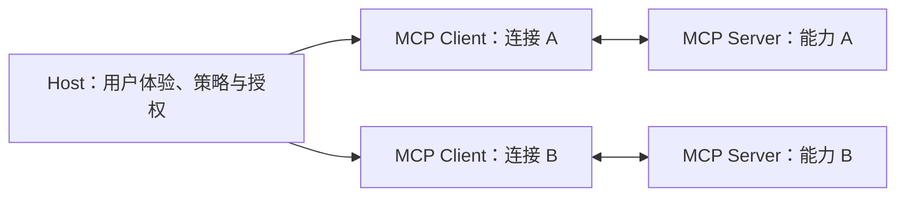
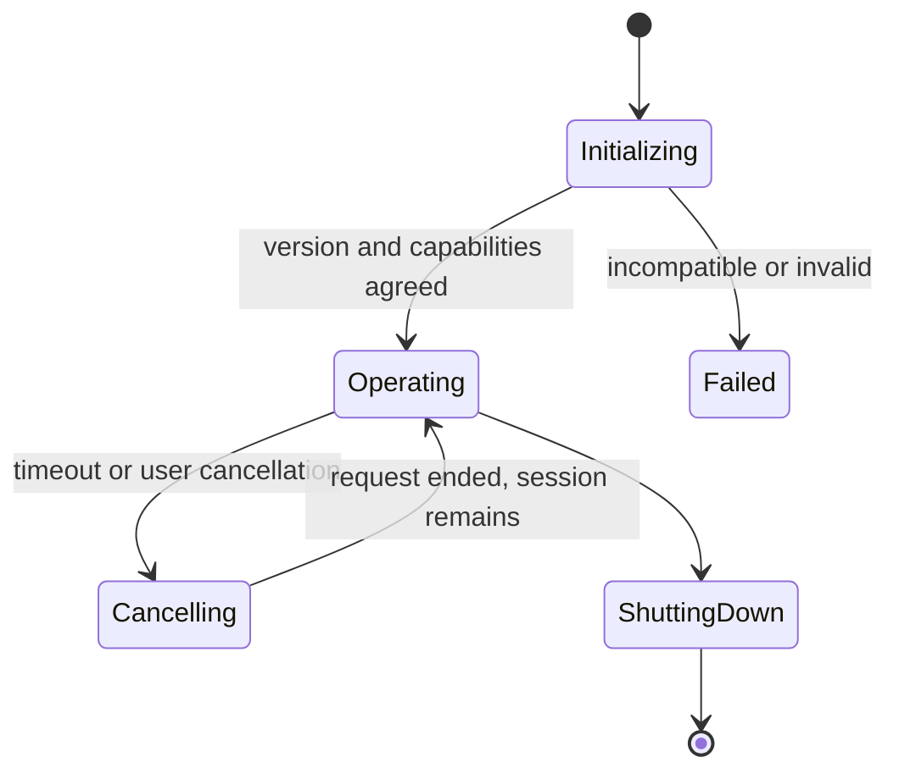

MCP（Model Context Protocol，模型上下文协议）定义 AI 应用如何用统一协议发现和调用外部上下文能力。它解决客户端与 Server 之间的协议适配，不替应用决定业务权限，也不自动让第三方 Server 变得可信。

截至 2026-07-27，MCP Versioning 页面把 `2025-11-25` 标为 current protocol version。版本以发生最后一次不兼容变化的日期表示；同一版本仍可能收到向后兼容更新，所以实际实现还要锁定 SDK release 或 commit。官方已公开 `2026-07-28` release candidate，并预告生命周期与 Tasks 等破坏性变化；它在本次核对日还不是正式版本，2026-07-28 之后进入实现前必须重新核对。

## Host、Client 与 Server

- **Host** 是承载模型、用户会话和安全策略的 AI 应用。它决定连接哪些 Server、向模型暴露哪些能力、如何确认操作。
- **Client** 代表 Host 管理一条 Server 连接，处理版本、能力、请求、通知、取消和传输。
- **Server** 暴露受协议描述的能力，但业务数据、身份和副作用仍属于其自身信任边界。

连接成功只证明双方能够通信，不证明 Server 输出正确、工具安全或用户已经授权。

## 消息与三类 Server 能力

MCP 基于 JSON-RPC 2.0 组织请求、响应、错误和通知。通知没有响应；需要结果的操作必须使用可关联请求 ID。重复传输与业务重复执行是不同问题，有副作用工具仍需业务幂等。

| 能力 | 主要用途 | 安全边界 |
| --- | --- | --- |
| Resources | 读取 URI 标识的上下文数据 | 可见范围、订阅和内容都需校验；资源文本是不可信数据 |
| Prompts | 提供可复用的 Prompt 模板和参数 | 模板不是更高优先级安全策略，Host 决定是否采用 |
| Tools | 暴露可调用操作及输入 Schema | 模型只提出调用意图，Server 仍做认证、授权、校验和幂等 |

Client 还可能声明 roots、sampling、elicitation 等能力。只有初始化时双方成功协商的能力才能在当前会话使用；未声明或实验性能力不能靠“试调用”当作兼容策略。

## 生命周期

### 初始化

Client 首先发送 `initialize`，包含支持的协议版本、Client 能力和实现信息；Server 返回选择的版本、Server 能力与实现信息。Client 接受后发送 `notifications/initialized`，才进入正常操作。

若 Server 返回的版本不被 Client 支持，Client 应断开。HTTP 后续请求还需携带协商后的协议版本头；不能仅依据 SDK 包版本猜测线上会话版本。

### 运行

双方只使用已协商能力。列表变化、进度、日志和取消等通知需要按能力和请求 ID 关联。每个请求应有可配置超时；收到进度可以延长局部等待，但仍应保留不可突破的总上限。

工具错误可分为协议错误和工具执行结果。前者表示方法、参数或连接层失败；后者表示工具被正常调用但业务没有成功。应用必须保留区别，不能都压成一段模型文本。

### 关闭

协议没有统一的 shutdown 消息，关闭由传输完成。stdio 通常先关闭子进程输入并等待退出，再按受控升级终止；HTTP 则关闭对应连接和会话资源。Host 还要清理在途请求、临时凭据与检查点。

## 传输不是权限模型

| 传输 | 典型场景 | 主要风险 |
| --- | --- | --- |
| stdio | Host 启动本地 Server 子进程，通过标准输入输出通信 | Server 继承本机进程权限、环境和可访问文件；启动命令本身是代码执行 |
| Streamable HTTP | 独立部署或远程 Server | TLS、认证、跨域、会话、重连、SSRF 和多租户隔离 |

stdio 减少网络暴露，但不会沙箱进程。远程 HTTP 便于服务化，也不表示 OAuth 已自动正确实现。传输适配层负责帧、连接和协议消息；业务层仍负责身份、资源与副作用。

## 鉴权与信任边界

当前规范中的 Authorization 面向 HTTP 传输，并且对 MCP 实现是可选能力；stdio 不应照搬该 HTTP 授权流程，通常从受控环境取得凭据。使用 HTTP Authorization 时至少要：

- 把 MCP Server 当作 OAuth 受保护资源，执行受保护资源与授权服务器发现。
- 请求最小 scope，并在运行时处理 scope challenge。
- 始终验证令牌有效性、audience 与 scope：JWT 还要校验签名、issuer 和有效期；opaque token 则向可信授权服务器执行 introspection，并检查返回的 active 状态及可用的 audience、scope 和到期信息。无法可靠确认这些约束时必须拒绝请求。
- 不接受并向下游转发并非为该 MCP Server 签发的令牌。
- 逐个请求认证；Session ID 不能充当用户身份。

业务 Tool 仍需要资源级授权。OAuth scope 表示令牌允许范围，不证明某个资源当前可写，也不取代人工确认。

## MCP 特有安全风险

### Confused deputy 与 Token passthrough

代理型 Server 可能替恶意 Client 使用自身对第三方服务的信任。应按 Client 和用户保存明确同意，绑定 redirect URI 与 scope，并防止 CSRF。Token passthrough 是官方安全资料明确禁止的反模式：Server 必须只接受为自身签发且已验证的令牌，再以适合下游的独立凭据调用。

### SSRF 与恶意发现地址

MCP Client 获取 OAuth 元数据或跟随重定向时可能被诱导访问内网、回环或云元数据地址。生产环境应要求 HTTPS，验证每次重定向、限制协议与地址范围、控制 DNS 解析和网络出口；不要把 Server 返回的 URL 交给 Shell 打开。

### 会话劫持与事件注入

Server 不能用 Session ID 认证。会话标识要不可预测、过期并与已认证用户绑定；每个入站请求重新授权。在多实例与可恢复流中，队列消息也要同时绑定用户和会话，避免攻击者向其他会话注入通知或工具变化。

### 本地 Server 供应链

安装或一键连接本地 Server 等同执行第三方代码。Host 应显示完整命令和参数、要求明确同意、核对来源和版本，并以最小文件、网络和进程权限沙箱运行。不能因为 Server 来自包管理器就默认可信。

## Java 与 Go 的工程落点

- Java SDK 适合通过显式 Client/Server 与同步或异步传输集成；Spring 生命周期只负责装配，业务权限和事务仍留在应用 Service。
- Go SDK 应让 `context.Context` 贯穿连接、请求和 Tool Handler，正确传播超时与取消；并发 Handler 不能共享未经保护的会话状态。
- 两端共享协议版本、能力清单、Tool/Resource Schema、认证策略、错误分类和 conformance 用例；不要共享框架内部类型。
- 进入实现前分别锁定 [[MCP Java SDK Client 与 Server 源码导读]] 和 [[MCP Go SDK Client 与 Server 源码导读]] 中记录的 SDK 版本，不能拿默认分支兼容性替代 release 证据。

## 验证与停止条件

- 不兼容协议版本会在初始化阶段明确失败并关闭连接。
- 未协商能力不能调用；列表变化和通知能关联正确会话。
- 正常 Tool、业务失败、协议错误、超时与取消语义可区分。
- stdio 子进程关闭后无孤儿进程，远程会话断开后无泄漏状态。
- HTTP Token 的 audience、scope 和资源级权限均有失败测试。
- Session ID 泄露不能单独完成认证或跨用户注入事件。
- 恶意 OAuth URL、重定向、Token passthrough 和本地启动命令均被相应控制阻断。
- 已用 Inspector、conformance 或集成测试保存客观结果后，再把具体实现写入实验记录；本笔记不宣称已完成这些实验。

## 相关笔记

- [[Tool Calling 生命周期与可靠业务边界]]
- [[受控 Agent 的执行、审批与恢复]]
- [[AI 应用安全威胁建模与防护]]
- [[AI 应用的成本、延迟、可观测性与降级]]
- [[OWASP GenAI 与 MCP Security 安全资料导读]]

## 官方资料

以下资料核对于 2026-07-27：

- [MCP Versioning](https://modelcontextprotocol.io/docs/learn/versioning)
- [MCP Lifecycle](https://modelcontextprotocol.io/specification/2025-11-25/basic/lifecycle)
- [MCP Transports](https://modelcontextprotocol.io/specification/2025-11-25/basic/transports)
- [MCP Server primitives](https://modelcontextprotocol.io/specification/2025-11-25/server/index)
- [MCP Authorization](https://modelcontextprotocol.io/specification/2025-11-25/basic/authorization)
- [RFC 7662 OAuth 2.0 Token Introspection](https://www.rfc-editor.org/rfc/rfc7662)
- [MCP Security Best Practices](https://modelcontextprotocol.io/docs/tutorials/security/security_best_practices)
- [MCP 2026-07-28 release candidate announcement](https://blog.modelcontextprotocol.io/posts/2026-07-28-release-candidate/)
