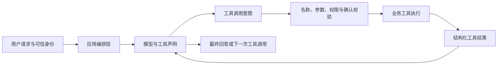

Tool Calling（工具调用）让模型返回“希望调用哪个工具以及参数是什么”，应用再决定是否执行。模型提出的是受约束的调用意图，不是已经发生的业务操作；鉴权、校验、事务、幂等和最终状态仍由确定性代码负责。

## 一次调用循环



一个完整循环包含：

1. 应用根据当前能力和用户权限构造工具白名单。
2. 模型在声明中选择工具并生成参数。
3. 应用解析调用意图，只接受白名单中的确切工具名。
4. 参数先过 JSON Schema，再过业务校验和资源级授权。
5. 写操作在执行前绑定人工确认、幂等键与当前资源版本。
6. 业务 Service 执行并返回结构化成功或失败结果。
7. 应用把结果与原 `call_id` 关联回传给模型。
8. 模型生成最终回答或提出下一次调用，直到达到停止条件。

任何一步都可能结束本轮。模型没有调用工具、参数无效、用户拒绝确认、工具超时或循环超预算，都必须有可识别的终态。

## 工具契约应描述能力，不暴露内部实现

一份工具声明至少需要：

- 稳定、具体且不歧义的名称。
- 说明工具能做什么、不能做什么，以及何时不应调用。
- 尽量窄的输入 Schema、必填字段、枚举和格式约束。
- 结构化结果与稳定错误分类。
- 读写性质、是否需要人工确认、超时和幂等策略。
- 契约版本以及与旧调用记录的兼容方式。

Schema 只能保证参数形状。资源是否存在、状态是否允许变化、数值是否满足业务规则、调用者是否有权操作，必须由业务层重新判断。不要把数据库表结构或供应商 SDK 类型直接当作 Tool Schema。

## 身份与权限只来自可信上下文

用户 ID、租户、角色、授权范围和审批人身份应由认证会话、服务端令牌或受控任务状态注入。即使模型参数中出现同名字段，也不能覆盖可信上下文。

```text
有效参数 = Schema 校验后的模型参数
可信上下文 = 服务端认证身份 + 当前租户 + 资源级授权 + 已确认操作
实际调用 = 业务 Service(可信上下文, 有效参数)
```

工具白名单要按请求和身份动态收窄。隐藏工具描述不是安全控制；服务端在每次执行时仍要做授权。

## 只读、写操作与确认

| 工具类型 | 默认控制 | 典型结果 |
| --- | --- | --- |
| 无副作用查询 | 最小权限、资源级过滤、超时 | 数据或“不可见/不存在”的统一语义 |
| 可重复计算 | 输入与版本固定、资源预算 | 计算结果与版本信息 |
| 状态写入 | 人工确认、事务、幂等、并发控制 | 已提交状态或明确未提交 |
| 外部消息或不可逆操作 | 精确预览、二次确认、审计和补偿方案 | 外部操作标识与可核对状态 |

人工确认必须绑定“工具名 + 规范化参数 + 目标资源版本 + 有效期”。用户确认后若模型改变参数，必须重新确认。笼统的“允许继续”不能授权后续任意写操作。

## 事务、幂等与重复副作用

网络超时只说明调用方没有拿到结果，不证明工具没有执行。写工具应使用由应用生成、与业务意图绑定的幂等键，并在业务数据库中记录首次结果。重试同一意图返回同一结果；新的用户意图使用新键。

以下做法不能替代业务幂等：

- 只依赖 HTTP 客户端“不重试”。
- 让模型生成幂等键。
- 用 Tool `call_id` 直接充当跨会话业务幂等键。
- 失败后无条件再次执行整个 Agent 步骤。

多工具操作若没有共享事务，不得向模型伪装成“全部成功”。应逐项记录成功、失败和未执行状态，并说明补偿或人工处理路径。

## 错误、超时和部分失败

工具结果应区分：

- 参数或业务校验失败：修正输入后才可能重试。
- 未认证或无权限：不得通过改写 Prompt 或重复调用绕过。
- 资源冲突：重新读取当前状态，必要时重新确认。
- 限流或临时不可用：在剩余时间和次数预算内退避重试。
- 超时且执行结果未知：先查询操作状态，不直接重复写入。
- 用户取消：停止启动新步骤，等待在途写操作得到确定结果。
- 部分成功：保存逐项状态，不让模型概括成整体成功。

返回给模型的错误信息只包含继续推理所需的安全摘要；堆栈、密钥、内部地址和未授权资源细节留在脱敏观测系统中。

## 调用循环必须有上限

至少限制：

- 最大模型轮次和最大工具调用数。
- 每个工具和整轮任务的截止时间。
- Token、费用和外部请求预算。
- 允许调用的工具集合及每个工具的频率。
- 写操作和人工审批次数。

达到上限时返回“预算耗尽”或“需要人工继续”，不要把停止包装为完成。更长的多步运行见 [[受控 Agent 的执行、审批与恢复]]。

## Java 与 Go 的工程实现

- Java 适合用接口和明确 DTO 表达工具契约，在适配层将模型调用对象转换为应用命令；写工具仍调用已有事务 Service，而不是在 Tool Handler 中复制业务规则。
- Go 适合以显式函数表注册工具，并让 `context.Context` 贯穿模型、校验和业务调用；错误用稳定类型分类，不通过字符串匹配决定是否重试。
- 两端共享工具语义、Schema、权限规则、幂等用例和失败状态，不逐行翻译注册方式或异常机制。

## 验证清单

- 未声明工具、未知字段和非法枚举会在执行前被拒绝。
- 模型传入的用户或租户字段不能覆盖服务端身份。
- 无权限与未确认写操作不会触发业务 Service。
- 相同幂等键重复提交只产生一次副作用。
- 超时后先查询最终状态，能区分未执行、已执行和未知。
- 多工具部分失败保留逐项结果，最终回答不会虚构全部成功。
- 用户取消和预算耗尽都有稳定终态并停止新工具调用。
- 日志与 Trace 不保存密钥、完整敏感参数或越权数据。

## 相关笔记

- [[结构化输出的 Schema 与业务校验]]
- [[模型调用的错误分类、限流与幂等重试]]
- [[受控 Agent 的执行、审批与恢复]]
- [[MCP 生命周期、能力协商与安全边界]]
- [[AI 应用安全威胁建模与防护]]
- [[AI 评测、版本化与发布门禁]]

## 官方资料

以下资料核对于 2026-07-27：

- [OpenAI Function calling](https://developers.openai.com/api/docs/guides/function-calling)
- [OpenAI Structured model outputs](https://developers.openai.com/api/docs/guides/structured-outputs)
- [Model Context Protocol — Tools](https://modelcontextprotocol.io/specification/2025-11-25/server/tools)

