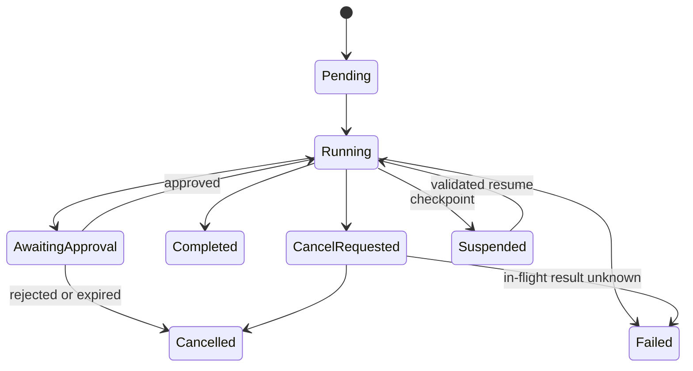

Agent 在这里指“模型能根据中间结果选择下一步，并在受限工具集合中循环执行”的应用组件。受控 Agent 不是一个拥有无限权限的数字员工，而是一台由确定性运行时约束的状态机：模型提出步骤，运行时决定步骤是否允许发生。

## 先判断是否需要 Agent

| 问题特征 | 优先选择 |
| --- | --- |
| 步骤、分支和顺序都能提前列出 | 确定性工作流 |
| 只需一次模型生成或一次工具选择 | 普通模型调用或单轮 Tool Calling |
| 需要基于未知中间结果动态选择有限步骤 | 受控 Agent |
| 要求跨越未定义工具、长期自主运行或无限探索 | 先收窄需求，不直接开放 Agent |

确定性工作流更容易测试、审计和恢复。只有动态决策确实带来价值，并且失败成本可以被边界控制时，Agent 才是合理选择。

## 运行时状态模型

状态至少要记录：任务 ID、能力合同版本、可信身份、当前步骤、允许工具、已用预算、截止时间、模型与 Prompt 版本、工具调用及结果、审批、检查点和最终原因。

“模型说任务完成”只是一个候选结束信号。运行时还要检查目标条件、必需输出、未决写操作和业务校验，才能进入 `Completed`。

## 步骤与预算

每个步骤都应具备：

- 单调递增的步骤编号和稳定调用标识。
- 输入来源及其版本，不能依赖不可追溯的隐式记忆。
- 工具名、规范化参数、权限判定和结果摘要。
- 开始、结束、超时、重试和 Token/费用用量。
- 成功、失败、取消、等待审批或结果未知的状态。

任务级预算包括最大步骤数、模型轮次、工具调用、墙钟时间、Token、费用、并发和写操作次数。步骤级限制不能取代任务总预算，否则大量“小调用”仍会失控。

## 工具白名单与可信上下文

白名单应按任务类型、用户身份和当前状态生成。只给当前步骤可能需要的最小能力；工具越多，误选、提示注入和权限配置错误的攻击面越大。

身份、租户、资源权限和审批结果来自运行时状态，不能由模型参数提供。所有工具仍按 [[Tool Calling 生命周期与可靠业务边界]] 执行 Schema、授权、事务和幂等检查。

## 人工审批边界

以下情况通常需要人工审批：

- 外部可见、不可逆或高成本写操作。
- 影响权限、身份、资金、数据删除或发布状态的变化。
- 模型发现原计划之外的新目标或资源。
- 风险、证据或参数与审批前预览不一致。

审批记录必须绑定动作摘要、目标、参数哈希、资源版本、审批人、时间和有效期。恢复任务时若这些内容发生变化，旧审批自动失效。

## 取消与超时

取消是一个协议，不是简单杀死线程：

1. 将任务状态设为 `CancelRequested`，阻止启动新步骤。
2. 向模型请求、流和支持取消的工具传播信号。
3. 等待在途只读调用结束或超时。
4. 对在途写操作查询最终状态；不能确认时标记“结果未知”。
5. 保存可审计的最后检查点和未决项。
6. 只有确认没有未说明副作用后才标记 `Cancelled`。

任务总截止时间应早于上游 HTTP 或作业平台的硬超时，以便留出持久化状态和清理资源的时间。

## 检查点与恢复

检查点保存的是可验证状态，不是把完整 Prompt 当作数据库。至少包括已确认的输入版本、已完成步骤、工具结果引用、剩余预算、未决审批和恢复兼容版本。

恢复前要检查：

- 用户和租户授权是否仍有效。
- Prompt、Tool Schema、模型或运行时版本是否兼容。
- 外部资源版本是否变化，旧计划是否仍成立。
- 已执行写操作是否可通过幂等键查询。
- 审批是否仍绑定当前动作。

不兼容时应从安全步骤重新规划或转人工，不能静默重放旧工具调用。

## 失败与部分完成

| 失败 | 运行时行为 |
| --- | --- |
| 模型输出无法解析 | 记录失败，可在模型重试预算内修复，不执行工具 |
| 工具临时不可用 | 在任务截止时间内退避；可选降级必须预先定义 |
| 权限或审批失败 | 终止相关分支，不通过换工具绕过 |
| 某个并行步骤失败 | 保存逐项状态，按策略补偿、跳过或整体失败 |
| 进程崩溃 | 从持久化检查点恢复，先核对写操作最终状态 |
| 达到预算或停止条件 | 返回明确原因，不伪装为完成 |

“部分完成”是正式状态语义。面向用户的结果应列出已完成、未完成、失败和需要人工处理的部分。

## Java 与 Go 的实现关注点

- Java 可将任务状态和审批作为持久化领域对象，工作流或 Agent 框架只负责调度；事务 Service 仍拥有写操作规则。
- Go 应以 `context.Context` 统一传播截止时间与取消，通过显式状态转换和持久化边界避免 goroutine 结束后任务状态丢失。
- Java 与 Go 共享状态名称、停止原因、预算字段、工具合同和恢复用例，不需要共享调度框架或并发实现。

## 验证与故障注入

- 达到最大步骤、Token、费用和墙钟时间时都能停止。
- 白名单外工具与越权资源在执行前被拒绝。
- 审批前后参数变化会使审批失效。
- 用户取消时不再启动新步骤，在途写操作能得到确定或“未知”结论。
- 进程在工具提交前后崩溃，都能通过幂等记录恢复而不重复副作用。
- 模型、工具或存储不可用时，任务状态和恢复入口仍可查询。
- Trace 能关联任务、步骤、模型调用和工具调用，但不泄露敏感内容。

## 相关笔记

- [[Tool Calling 生命周期与可靠业务边界]]
- [[MCP 生命周期、能力协商与安全边界]]
- [[AI 应用安全威胁建模与防护]]
- [[AI 应用的成本、延迟、可观测性与降级]]
- [[AI 评测、版本化与发布门禁]]

## 官方资料

以下资料核对于 2026-07-27：

- [OpenAI Agents](https://developers.openai.com/api/docs/guides/agents)
- [OpenAI Function calling](https://developers.openai.com/api/docs/guides/function-calling)
- [Model Context Protocol — Lifecycle](https://modelcontextprotocol.io/specification/2025-11-25/basic/lifecycle)

