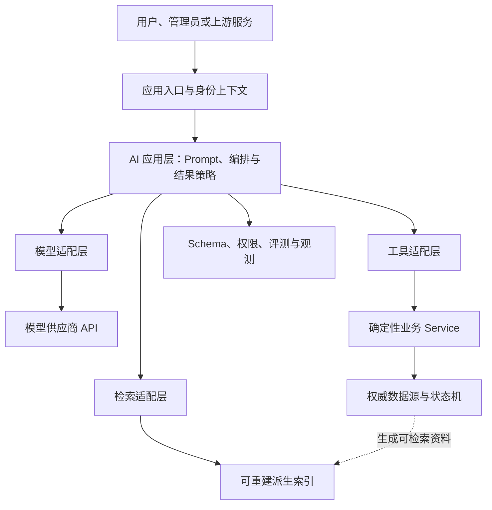

AI 应用开发的核心难点，不是让后端“能够调用模型”，而是把概率性的模型能力放进一个仍然可验证、可授权、可恢复的确定性系统。本笔记先建立系统分层，再说明每一层可以决定什么、不得决定什么。

## 先区分四类工程工作

“AI 开发”常把不同职责混在一起。进入应用开发前，应先区分以下对象：

| 工程对象 | 主要问题 | 典型产物 | 本路线的投入深度 |
| --- | --- | --- | --- |
| 模型训练 | 怎样从数据学习参数 | 训练数据、权重、训练评测 | 认识边界，不作为主线 |
| 推理基础设施 | 怎样高效加载和运行模型 | 推理服务、调度、显存与吞吐优化 | 理解依赖，不自行建设 |
| AI 应用层 | 怎样把模型、检索和工具组合成产品能力 | Prompt、Schema、适配层、编排、评测与观测 | 当前主线 |
| 确定性业务系统 | 怎样维护权威事实和受控状态变化 | 业务 Service、数据库、权限、事务与状态机 | AI 能力必须服从的底座 |

AI 应用层消费模型能力，但不拥有模型权重；它可以提出内容或行动候选，却不能取代业务系统维护事实、权限和事务。

## 一张系统分层图

这张图表达四条依赖方向：

1. 模型供应商类型到模型适配层为止，不进入业务 Service。
2. 检索索引来自权威资料，可以删除和重建，不能反过来成为业务事实源。
3. 工具调用只能进入已有业务能力，不能绕过鉴权、事务和状态机直写数据库。
4. Schema、安全、评测和观测是应用层的确定性护栏，不是要求模型“自觉遵守”的一句 Prompt。

## 每层负责什么

### 应用入口与可信身份上下文

入口层完成认证、限流、请求追踪和输入大小限制，并把已经验证的用户、租户、权限范围传给后续层。模型从自然语言中猜出的姓名、角色或权限不属于可信身份。

### AI 应用层

AI 应用层负责：

- 选择具体能力合同，而不是让调用方任意拼 Prompt。
- 组装指令、用户输入、检索资料和工具说明。
- 驱动模型、检索或工具调用，并限制步骤、时间和成本。
- 区分拒答、失败、取消、部分输出和正常完成。
- 把模型结果交给 Schema 与业务规则校验。

它不负责直接修改业务状态，也不应把“模型说执行成功了”当作执行证据。

### 模型适配层

模型适配层隔离供应商 SDK、请求参数、流式事件和错误类型，向应用层提供稳定的本地合同。具体设计见 [[模型 SDK、业务适配层与 AI 框架边界]] 和 [[模型 API 请求生命周期与流式状态]]。

### 检索适配层

检索适配层把业务资料转换为可搜索的派生数据，并处理过滤、排序、版本和可见范围。索引的数据边界见 [[Embedding、向量索引与派生数据边界]]，检索选择见 [[关键词、向量与混合检索及评测]]。

### 工具适配层

工具适配层把模型提出的工具意图转换为受控的应用调用。它负责参数校验、权限、确认、幂等和审计，具体见 [[Tool Calling 生命周期与可靠业务边界]]。

### 确定性业务层

确定性业务层继续拥有：

- 权威字段和值域。
- 用户身份与权限判断。
- 状态机、事务和并发控制。
- 幂等键、审计记录和最终执行结果。
- 数据库与外部系统的一致性。

如果一项决定需要“同样输入必须得到同样业务结果”，它通常应由确定性代码负责，而不是只交给模型生成。

## 概率性能力与确定性事实怎样协作

| 场景 | 模型适合承担 | 确定性代码必须承担 |
| --- | --- | --- |
| 内容生成 | 草稿、摘要、分类候选、缺口提示 | 必填字段、敏感词、权威事实与发布确认 |
| 知识问答 | 理解问题、组织有引用的回答 | 可见范围、来源版本、引用映射与拒答门槛 |
| 数据查询 | 选择只读工具、解释工具结果 | 鉴权、查询条件、真实返回值与审计 |
| 状态变更 | 生成待确认计划或候选参数 | 重新鉴权、读取最新状态、事务、幂等与执行 |
| 质量判断 | 提供模型评分作为辅助信号 | 固定断言、人工标注、阈值和发布门禁 |

模型输出可以参与决策，但不能单独证明事实。即使输出符合 JSON Schema，也仍需经过 [[结构化输出的 Schema 与业务校验]] 所描述的业务校验。

## 一次正常调用的主流程

1. 入口层认证调用方，并生成应用级请求标识。
2. 应用层选择已版本化的能力合同和 Prompt。
3. 确定性代码读取允许进入上下文的事实与权限范围。
4. 模型适配层发起调用；需要时由检索或工具适配层提供受控能力。
5. 应用层收集完整结果，识别完成、拒答、失败、取消或部分输出。
6. Schema 校验只确认结构；业务校验重新核对事实、状态和权限。
7. 结果作为草稿、建议或只读回答返回；写操作另走确认和业务 Service。
8. 记录版本、请求标识、耗时、用量和最终状态，不记录秘密与无必要的原始敏感上下文。

## Java 与 Go 的落地差异

两种语言共享分层语义，但不要求代码形状相同。

| 关注点 | Java | Go |
| --- | --- | --- |
| 依赖组织 | 常通过 Spring Bean、构造器注入和显式接口隔离适配层 | 常通过小接口、显式构造函数和组合组织依赖 |
| 数据合同 | record、不可变 DTO、Bean Validation 适合表达边界对象 | struct、显式校验函数和小型接口更符合 Go 习惯 |
| 并发与取消 | 同步调用、`CompletableFuture` 或响应式流需要统一终态 | `context.Context` 应贯穿调用链，取消和截止时间显式传播 |
| 错误边界 | 把 SDK 异常映射为应用异常或结果类型 | 包装并分类 `error`，优先保留 `context` 取消与超时原因 |
| 框架使用 | Spring AI 可提供配置、客户端、Advisor 和观测集成 | Eino 可提供组件与 Graph/Workflow 编排；简单调用仍可直接使用 SDK |

Java 和 Go 必须共享能力合同、Schema、引用规则、工具语义与评测数据；供应商类名、框架对象、异常层级和并发实现不需要一致。

## 常见架构失误与恢复

### 供应商类型扩散到业务层

**表现**：Controller、业务 Service 和数据库实体直接依赖供应商请求或响应类。

**后果**：升级 SDK、切换模型或增加第二供应商时，大量业务代码被迫改变。

**恢复**：先定义本地能力合同，用适配器完成双向映射；迁移期间对旧入口做契约测试，再逐步收回供应商类型。

### 把模型输出当成权威事实

**表现**：模型生成的数值、状态或权限判断直接写入数据库。

**恢复**：将输出降级为候选值；从权威数据源重新读取并校验，涉及状态变化时通过人工确认和已有业务 Service 执行。

### 把向量索引当成主数据库

**表现**：索引记录缺少来源 ID 和版本，无法从业务数据重建。

**恢复**：补齐稳定来源标识、版本和同步状态；以权威数据全量重建，并验证删除与可见范围。

### 用框架替代边界设计

**表现**：因为框架能自动调用工具，就把业务方法直接暴露给模型。

**恢复**：先在框架外写清工具合同、权限、确认和幂等规则，再决定哪些框架扩展点可以承载这些规则。

## 如何验证分层是否成立

- [ ] 去掉模型供应商 SDK 后，业务 Service 仍能独立编译或测试。
- [ ] 用 fake 模型适配器可以重放正常、拒答、超时和错误路径。
- [ ] 删除派生索引后，可以从权威数据完整重建。
- [ ] 模型无法直接访问数据库或自行构造可信身份。
- [ ] 所有写操作都能指出鉴权、确认、事务、幂等和审计位置。
- [ ] 结构正确但事实错误的输出会被业务校验拒绝。
- [ ] 模型、Prompt、Schema、工具和数据版本可以被一次运行记录定位。
- [ ] 模型或检索依赖不可用时，原有确定性业务主链路仍能受控运行。

跨层验证和发布门禁见 [[AI 评测、版本化与发布门禁]]；威胁模型见 [[AI 应用安全威胁建模与防护]]；成本、延迟与降级见 [[AI 应用的成本、延迟、可观测性与降级]]。

## 官方资料

以下页面于 2026-07-27 核对。模型、SDK 和框架能力会变化，使用时应按目标版本重新核对。

- [OpenAI Responses API](https://developers.openai.com/api/reference/resources/responses/methods/create)：模型调用的公开请求边界。
- [OpenAI Text generation：消息角色与指令](https://developers.openai.com/api/docs/guides/text#message-roles-and-instruction-following)：应用指令、用户输入和模型输出的角色边界。
- [OpenAI Structured Outputs](https://developers.openai.com/api/docs/guides/structured-outputs)：结构约束与模型输出的边界。
- [OpenAI Function Calling](https://developers.openai.com/api/docs/guides/function-calling)：模型提出工具调用、应用执行工具的公开流程。
- [OpenAI Java 官方仓库](https://github.com/openai/openai-java) 与 [OpenAI Go 官方仓库](https://github.com/openai/openai-go)：供应商 SDK 的公开入口和语言差异。

