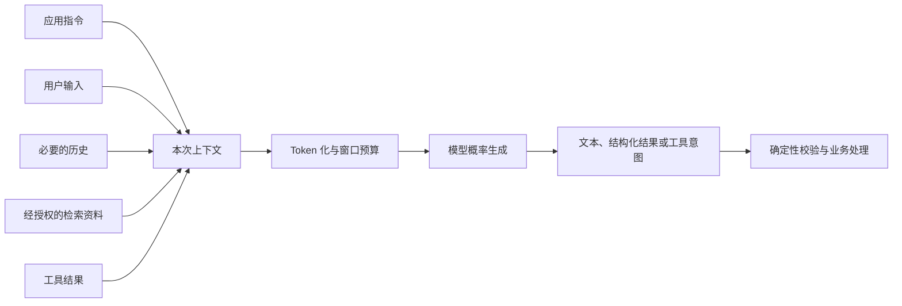

大模型并不是接收一句话后“查询正确答案”的函数。一次生成实际消费一组按规则组织的输入，在有限上下文中进行概率性生成，再由应用判断输出能否使用。本笔记建立输入、消息、Token、上下文窗口、采样和输出之间的整体关系。

## 六个基本概念

### 输入

输入（input）是应用本次交给模型处理的全部内容，可以包含指令、用户消息、历史消息、检索资料、工具结果和其他受支持的内容类型。用户刚输入的文本只是其中一部分。

### 消息与角色

消息（message）是带有角色和内容的输入单元。角色用来表达信息来源和指令优先级，而不是证明内容可信。

| 角色或来源 | 主要用途 | 不能据此假设 |
| --- | --- | --- |
| 应用指令 | 定义任务、边界、格式和行为要求 | 指令一定能抵抗所有恶意输入 |
| 用户消息 | 表达用户问题和本次参数 | 用户自述的身份、权限或事实已经验证 |
| 模型历史输出 | 为多轮交互提供先前回答 | 先前回答必然正确或仍然有效 |
| 检索资料 | 提供可引用的外部证据 | 被检索到就等于权威、最新且有权查看 |
| 工具结果 | 提供确定性系统返回值 | 任意工具文本都可以成为更高优先级指令 |

可信度来自应用对来源、权限、版本和签名的验证，不来自消息角色名称。

### Token

Token 是模型处理和计量内容的基本片段，不等同于字符、汉字或单词。输入、输出以及某些模型的内部推理都会消耗 Token。不能用字符串长度简单替代真实 Token 计数。

### 上下文窗口

上下文窗口（context window）是一次生成可使用的总 Token 容量。它通常同时容纳输入与输出；具体模型还可能计入推理 Token。窗口大小、最大输出和截断行为属于模型与接口的易变能力，必须查所选版本，长期笔记不写死数值。

### 采样

模型根据候选 Token 的概率分布逐步生成输出。采样配置会影响输出的集中或发散程度，但不同模型和接口支持的参数不同。降低随机性可以减小波动，不能把概率生成变成业务上的确定性函数，也不能替代事实校验。

### 概率性输出

即使输入相同，输出措辞、顺序、细节或工具选择仍可能变化。模型生成的是候选内容，不是数据库事务结果。可接受的变化范围必须由能力合同、Schema、业务规则和评测集共同定义。

## 它们在一次调用中的关系

这里最重要的边界是：模型看到的上下文不等于系统拥有的全部数据，模型输出也不等于系统最终接受的结果。

## 上下文不是自动记忆

一次无状态请求只包含应用本次提交的内容。多轮交互通常有三种状态来源：

1. 应用保存历史，再在下一次请求中选择性重放。
2. 供应商提供响应或会话标识，服务端帮助续接先前状态。
3. 应用把旧内容压缩、摘要或检索后重新加入上下文。

无论采用哪一种方式，应用都必须明确：

- 哪些历史仍然有效。
- 哪些内容属于用户可见范围。
- 旧工具结果是否需要重新查询。
- 哪些先前模型输出只能作为非权威参考。
- 指令是否需要在每次调用中重新提供。

以 OpenAI Responses API 为例，官方文档明确说明本次 `instructions` 只作用于当前生成；通过先前响应标识续接时，旧请求的 `instructions` 不会自动出现在新上下文中。其他供应商与框架的状态语义也必须单独核对。

## Token 预算应怎样分配

上下文预算不是“尽量塞满”，而是为不同内容预留可解释的份额：

| 预算部分 | 主要内容 | 过量风险 |
| --- | --- | --- |
| 固定指令 | 能力边界、输出合同、安全规则 | 重复、冲突，挤压任务资料 |
| 用户输入 | 当前问题与必要参数 | 超长输入、提示注入、无关内容 |
| 历史 | 与当前任务直接相关的轮次 | 陈旧事实和早期错误持续传播 |
| 检索上下文 | 可引用的证据片段 | 无关召回、过期资料和越权内容 |
| 工具结果 | 当前步骤需要的确定性结果 | 大对象、敏感字段和不可信文本 |
| 输出预留 | 模型完成回答所需空间 | 预留不足导致不完整输出 |

一个稳健的上下文构造器应在调用前完成长度估算、来源过滤、版本检查和输出预留；超过预算时应按明确策略裁剪、压缩或拒绝，而不是静默丢弃最前面的内容。

## Token、Embedding、结构化输出和工具调用不是同一层

这些概念经常被并列学习，但作用不同：

| 能力 | 处理什么 | 典型输出 | 确定性护栏 |
| --- | --- | --- | --- |
| Token 与上下文 | 一次生成能够看到多少内容 | 模型实际消费的上下文 | 预算、裁剪和来源控制 |
| Embedding | 把内容映射为便于比较的向量 | 向量 | 来源 ID、过滤、版本和重建 |
| 结构化输出 | 约束模型回答的形状 | 符合 Schema 的候选对象 | 解析、Schema 与业务校验 |
| Tool Calling | 让模型提出调用哪个工具及参数 | 工具调用意图 | 鉴权、参数校验、确认、事务和幂等 |

Embedding 用于召回资料，不能扩大模型的上下文窗口；结构化输出保证形状，不保证事实；工具调用给出意图，不代表工具已经执行。分别参见 [[Embedding、向量索引与派生数据边界]]、[[结构化输出的 Schema 与业务校验]] 和 [[Tool Calling 生命周期与可靠业务边界]]。

## 正常的数据流

1. 应用选择能力版本和对应 Prompt。
2. 认证层提供可信身份与可见范围。
3. 上下文构造器加入必要指令、当前输入、有效历史和经授权资料。
4. Token 预算器估算输入并为输出留出空间。
5. 模型生成文本、结构化结果或工具意图。
6. 应用等待明确终态，不能把中间增量当完整结果。
7. 确定性代码校验结构、事实、权限和业务规则。
8. 将本次输入版本、配置、最终状态和用量写入脱敏观测记录。

请求和流式终态见 [[模型 API 请求生命周期与流式状态]]；整个系统边界见 [[AI 应用开发的系统分层与职责边界]]。

## Java 与 Go 的应用方式

| 问题 | Java | Go |
| --- | --- | --- |
| 上下文对象 | 用不可变 DTO、record 或 Builder 表达不同来源，集中构造 | 用小型 struct 和纯函数构造，避免到处追加切片 |
| Token 预算 | 在适配层前统一估算并返回明确错误 | 在调用前计算预算，通过 `error` 返回裁剪或拒绝原因 |
| 历史状态 | 可由 Repository 管理，不能直接把 ORM 实体交给 SDK | 显式读取并映射为供应商无关消息，`context.Context` 不用于保存业务历史 |
| 取消 | 同步、Future 或响应式链路都要归一为应用终态 | `context.Context` 只传递截止时间、取消和请求级值，不作为可变业务数据容器 |
| 结果 | 先映射到本地候选结果，再做 Bean Validation 和业务校验 | 先解码到本地 struct，再做显式字段和跨字段校验 |

两端应共享固定输入、输出合同和允许波动的判断规则，而不是要求逐字输出一致。

## 常见失败与排查顺序

### 输入超出窗口或输出被截断

1. 记录真实输入 Token、输出 Token 和所选模型能力，不只记录字符数。
2. 检查是否重复注入系统指令、历史或检索片段。
3. 为输出保留预算，并定义明确的裁剪优先级。
4. 对不允许截断的任务，在调用前拒绝或拆分，而不是接受半个对象。

### 多轮回答受旧事实污染

1. 找到旧事实来自应用历史、供应商会话还是摘要。
2. 对易变工具结果重新查询，不把旧回答继续当事实。
3. 给历史和资料保存来源、版本与时间。
4. 将失效样例加入固定回归集。

### 相同输入仍产生不同输出

这通常不是传输故障。先判断差异是否落在允许波动内，再检查模型版本、Prompt、采样配置、上下文顺序和外部资料是否变化。需要完全确定的字段应移回业务代码计算。

### 用户内容改变了系统行为

把用户输入和检索资料视为不可信数据；使用清晰边界与角色组织内容，禁止它们生成可信身份，并配合 [[AI 应用安全威胁建模与防护]] 中的提示注入测试。仅靠“忽略恶意指令”一句 Prompt 不是完整防护。

## 如何验证理解与实现

- [ ] 能列出一次调用真正包含的全部上下文来源。
- [ ] 能解释 Token、上下文窗口和最大输出的区别。
- [ ] 能证明超长输入不会造成静默裁剪或半结构结果被接收。
- [ ] 对同一固定输入运行多次时，保存全部结果而不是只选最好的一次。
- [ ] 结构、事实和内容质量分别有自动或人工判断方法。
- [ ] 历史消息、检索资料和工具结果都有来源与可见范围。
- [ ] 模型输出不会直接成为权限、数值或业务状态的权威值。
- [ ] Java 与 Go 使用同一输入与评测规则，但允许内部实现和措辞不同。

版本与回归方法见 [[Prompt 模板版本化与回归]] 和 [[AI 评测、版本化与发布门禁]]。

## 官方资料

以下资料于 2026-07-27 核对。上下文大小、输出限制、采样支持和状态管理能力应按实际模型与接口版本重新确认。

- [OpenAI Conversation state：管理上下文窗口](https://developers.openai.com/api/docs/guides/conversation-state#managing-context-for-text-generation)：输入、输出、推理 Token 与上下文窗口的关系。
- [OpenAI Text generation：消息角色与指令](https://developers.openai.com/api/docs/guides/text#message-roles-and-instruction-following)：应用指令、用户输入和模型消息的角色。
- [OpenAI Responses Input Tokens](https://developers.openai.com/api/reference/resources/responses/subresources/input_tokens/methods/count)：调用前的输入 Token 计数入口。
- [OpenAI Prompt engineering：上下文规划](https://developers.openai.com/api/docs/guides/prompt-engineering#planning-for-the-context-window)：为任务选择相关上下文。
- [OpenAI Models](https://developers.openai.com/api/docs/models)：模型能力、上下文窗口和输出限制的当前事实来源。

