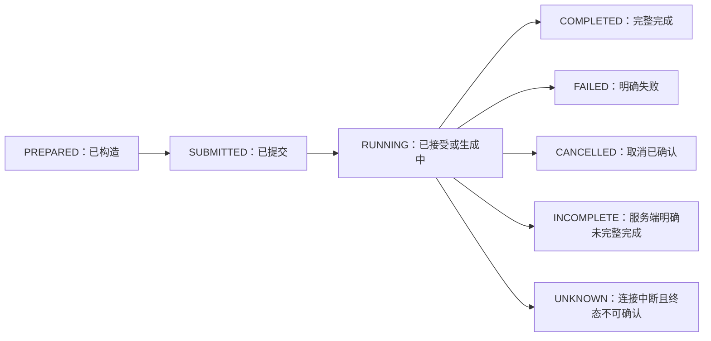
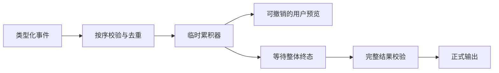

一次模型调用不能只用“成功或抛异常”描述。可靠应用需要同时区分执行方式、传输方式、服务端任务状态和应用最终状态，特别是在流式断开、取消、超时和部分输出出现时。

## 先拆开四个容易混淆的维度

| 维度 | 回答的问题 | 典型方式 |
| --- | --- | --- |
| 调用线程 | 调用方是否阻塞等待 | 同步调用、Future、goroutine |
| 结果传输 | 结果一次返回还是增量返回 | 普通 HTTP 响应、SSE 流、其他持续连接 |
| 服务端执行 | 连接断开后任务是否继续 | 前台请求、供应商后台任务 |
| 应用终态 | 业务最终怎样记录本次请求 | 完成、失败、取消、不完整、未知 |

“异步客户端”通常只表示应用线程不阻塞；它不自动让任务在应用进程退出后继续。“流式”只表示增量交付；它不保证可恢复，也不表示已经完成。只有供应商明确提供后台任务、查询和取消接口时，才存在独立于当前连接的服务端任务生命周期。

## 一个供应商无关的应用状态机

供应商事件名和状态值会变化，适配层应把它们映射为本地稳定语义，而不是让 Controller 直接判断字符串。

| 应用状态 | 可否作为完整结果 | 是否可能有部分输出 | 下一步 |
| --- | --- | --- | --- |
| `COMPLETED` | 可以，但仍需结构与业务校验 | 是 | 校验后交付 |
| `FAILED` | 不可以 | 可能 | 分类错误，判断是否重试 |
| `CANCELLED` | 不可以 | 可能 | 丢弃或明确标为草稿，不自动继续 |
| `INCOMPLETE` | 不可以 | 通常可能 | 读取原因，决定缩短、拆分或重试 |
| `UNKNOWN` | 不可以 | 可能 | 先查询或对账，不能直接假设失败后重发 |

部分输出是过程数据，不是第五种“成功”。除非产品明确允许并标注，业务层不得把它提交为完整内容。

## 同步、客户端异步、流式与后台任务

### 同步普通响应

调用方等待完整 HTTP 响应，处理最简单，适合短请求和只在完整结果上工作的接口。连接超时或断开时，客户端只知道没有收到完整响应，不一定知道服务端是否已经处理。

### 客户端异步

Java 的 Future/响应式调用和 Go 中运行于 goroutine 的请求，可以释放当前调用线程，但仍需要相同的超时、取消和终态处理。不要因为方法返回 Future 就省略请求截止时间。

### 流式响应

流式响应逐步交付有类型的事件或增量片段，主要收益是更早展示或处理输出。消费端必须识别：

- 建立或开始事件。
- 文本、拒答、工具参数等不同增量。
- 输出项或内容片段完成事件。
- 整体完成、失败或不完整事件。
- 传输层错误。

以 OpenAI Responses API 为例，官方流式指南列出的常见文本事件包括 `response.created`、`response.output_text.delta`、`response.completed` 和 `error`；完整参考还定义了 `response.failed` 与 `response.incomplete` 等语义事件。应用应按事件类型处理，不能把每一帧都当普通文本。

### 供应商后台任务

后台任务适合长时间生成：提交后获得任务标识，通过查询观察状态，并在接口允许时取消或重新连接流。它会引入额外的数据存储、轮询、过期、权限和对账问题，不能仅为“看起来异步”而默认启用。

OpenAI Background mode 在 2026-07-27 的官方说明中支持后台执行、轮询、取消和后台流，但具体模型支持、数据保存与恢复能力属于易变事实，使用前必须重新核对。

## 流式消费的正确边界

### 增量必须累积，终态必须单独确认

累积器要处理顺序、重复事件、不同内容类型和最终错误。流式结构化输出应先累积为完整文档，再解析和做业务校验，见 [[结构化输出的 Schema 与业务校验]]。

### 连接状态不等于任务状态

连接关闭可能表示：

- 正常终止事件已经消费完毕。
- 用户主动取消。
- 客户端超时或进程终止。
- 代理、网络或供应商中断。
- 后台任务仍在继续，但当前流断开。

只有看到可信终态，或通过任务查询确认，才能写入最终状态。否则应记录为 `UNKNOWN`，并由查询、幂等键或人工对账恢复。

### 用户取消要贯穿整条链路

取消不是“前端不再显示”。它应依次通知入口、应用编排、SDK/HTTP、检索和工具层。已经产生的外部副作用不能靠取消撤销，必须由 [[Tool Calling 生命周期与可靠业务边界]] 中的事务与补偿规则处理。

## 一次可靠调用的正常流程

1. 在调用前校验输入、模型能力、Token 预算和输出合同。
2. 生成应用逻辑请求 ID，并为本次尝试生成独立 attempt ID。
3. 设置总截止时间；流式调用再设置连接、首事件和空闲超时。
4. 提交请求并记录供应商请求 ID 或后台任务 ID。
5. 普通响应等待完整结果；流式响应按类型消费并临时累积。
6. 用户取消时传播取消信号，并等待关闭或查询确认。
7. 只有明确整体终态后才进入结构和业务校验。
8. 保存最终状态、用量、耗时和失败分类；对 `UNKNOWN` 安排查询或对账。

错误分类与重试见 [[模型调用的错误分类、限流与幂等重试]]。

## Java 与 Go 的实现差异

| 关注点 | Java | Go |
| --- | --- | --- |
| 同步与异步 | 官方 OpenAI Java SDK 提供同步客户端，并可切换异步客户端；异步方法通常返回 `CompletableFuture` | 调用方法接收 `context.Context`；是否放入 goroutine 由应用编排决定 |
| 流式资源 | 同步流应使用 try-with-resources 等方式关闭；异步订阅同时处理完成与错误 | 使用流迭代器读取，循环后检查 `Err()`，并按 SDK 合同关闭资源 |
| 取消 | Future 取消、线程中断和底层 HTTP 取消不是同一个概念，应测试实际传播 | `context.WithCancel` 或 `context.WithTimeout` 是主要传播机制，所有下游必须使用同一派生上下文 |
| 超时 | 区分 HTTP 客户端超时、Future 等待超时和业务总预算 | 区分整个 `context` 截止时间与每次 HTTP 尝试超时 |
| 背压 | 异步流或 Reactor 链需要明确消费速度和执行器 | 消费循环天然串行时较直观；跨 goroutine 传递仍要限制缓冲和退出条件 |

不要根据语言机制推断供应商任务状态。例如 Go 的 `context` 到期只证明客户端停止等待，不证明远端一定没有生成结果。

## 失败、恢复与用户语义

| 场景 | 对外语义 | 恢复方式 |
| --- | --- | --- |
| 首事件前超时 | 未获得结果 | 有幂等与重试预算时重新尝试 |
| 流中断且无查询接口 | 部分输出，终态未知 | 丢弃正式结果；按逻辑请求对账或有限重试 |
| 后台流断开 | 当前连接失败，任务可能继续 | 按任务 ID 查询；支持时按游标续接 |
| 用户取消 | 取消请求已发出，不提前宣称远端已停止 | 等待确认；副作用另行对账 |
| 结构化输出在流中截断 | 不完整结果 | 不解析为业务对象；重新请求或缩小任务 |
| 终态完成但业务校验失败 | 模型调用完成，业务结果拒绝 | 记录为业务校验失败，不伪装成传输错误 |

流式预览应在界面上明确“生成中”，失败后能够撤回或标记未完成。若产品不能接受撤回，就应等待完整结果后再展示。

## 验证清单

- [ ] 普通响应、客户端异步、流式和后台任务的语义没有混用。
- [ ] 每条流都处理整体完成、失败、不完整、取消和断连。
- [ ] 没有整体终态时，部分输出不会进入正式业务流程。
- [ ] Java 的同步流可以关闭，异步流会同时处理完成和异常。
- [ ] Go 在读取循环后检查流错误，取消通过 `context.Context` 传播。
- [ ] 用户取消后不会继续启动新工具或新的模型步骤。
- [ ] 超时后无法确认远端状态时记录 `UNKNOWN`，而不是直接记为失败。
- [ ] 固定测试能注入首事件超时、流中断、重复事件和终态失败。
- [ ] 日志能用逻辑请求 ID、attempt ID 和供应商请求 ID 关联全过程。

请求状态应进入 [[AI 应用的成本、延迟、可观测性与降级]] 的 Trace，并纳入 [[AI 评测、版本化与发布门禁]] 的失败回归。

## 官方资料

以下资料于 2026-07-27 核对。事件种类、后台模式和 SDK API 会变化，实际实现必须锁定版本。

- [OpenAI Streaming API responses](https://developers.openai.com/api/docs/guides/streaming-responses)：SSE、类型化事件和流式审核风险。
- [OpenAI Responses streaming events](https://developers.openai.com/api/reference/resources/responses/streaming-events)：完成、失败、不完整和各类增量事件的公开参考。
- [OpenAI Background mode](https://developers.openai.com/api/docs/guides/background)：后台提交、轮询、取消与流式恢复边界。
- [OpenAI Java 官方仓库](https://github.com/openai/openai-java)：同步、异步和流式客户端的公开用法。
- [OpenAI Go 官方仓库](https://github.com/openai/openai-go)：`context.Context`、Responses 流迭代与错误检查的公开用法。

