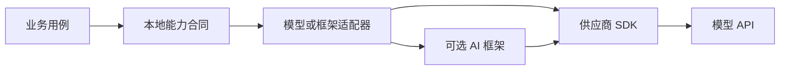

原生 SDK、业务适配层和 AI 框架解决的是不同问题。SDK 让应用访问供应商 API；适配层保护业务语义；框架复用模型、检索、工具和编排能力。可靠架构不应把其中任意一个当成“整个 AI 应用层”。

## 三层职责

| 层 | 主要职责 | 应该暴露 | 不应该暴露 |
| --- | --- | --- | --- |
| 供应商 SDK | 认证、HTTP、序列化、流式事件、供应商错误 | 官方请求/响应与客户端配置 | 业务状态、权限和产品语义 |
| 业务适配层 | 把供应商类型映射为本地能力合同 | 本地请求、结果、终态、错误和用量 | SDK DTO、供应商异常和易变事件名 |
| AI 框架 | 复用 Prompt、模型抽象、Advisor/Graph、检索、工具和观测扩展 | 框架内组合能力与扩展点 | 绕过业务 Service 的写权限或不可见魔法流程 |

业务 Service 只能依赖本地能力合同。选择 Spring AI、Eino 或另一个模型供应商时，业务字段、权限和事务不应跟着重写。

## 依赖方向



这不是要求所有调用同时经过框架和原生 SDK。框架通常自己依赖某种供应商适配；关键是业务用例只看到本地合同，而适配器可以选择“直接 SDK”或“框架实现”。

## 本地能力合同应表达什么

合同围绕产品语义设计，至少应包含：

- 能力名称和合同版本。
- 经过校验的输入与可信上下文引用。
- 非流式结果或类型化流事件。
- 完成、失败、取消、不完整和未知等最终语义。
- 本地错误分类，而非供应商异常类。
- 模型、Prompt、Schema、用量、请求标识和耗时元数据。
- 取消与截止时间传播方式。

概念草图如下，不是可直接编译的接口：

```text
Java
  ModelGateway.generate(GenerateCommand, CallBudget) -> GenerateResult
  ModelGateway.stream(GenerateCommand, CallBudget) -> ModelEventStream

Go
  ModelGateway.Generate(ctx, GenerateCommand) (GenerateResult, error)
  ModelGateway.Stream(ctx, GenerateCommand) (ModelEventStream, error)
```

`GenerateCommand` 不应包含供应商 SDK 的 Params，`GenerateResult` 也不应直接返回 SDK Response。流状态语义见 [[模型 API 请求生命周期与流式状态]]。

## 适配层内部要完成的映射

### 请求映射

- 本地能力名称映射到当前模型与供应商。
- [[Prompt 模板版本化与回归]] 生成的指令与输入映射到 SDK 请求。
- 本地 Schema 映射到供应商支持的结构化输出配置。
- 总截止时间、每次尝试和流式空闲超时映射到底层客户端。
- 密钥、组织或项目配置从安全配置源进入客户端，不作为业务参数传递。

### 响应映射

- 普通与流式供应商响应映射为同一本地结果语义。
- 拒答、不完整和部分输出不能伪装成正常空结果。
- 用量、请求 ID 和供应商状态进入元数据。
- SDK 错误映射到 [[模型调用的错误分类、限流与幂等重试]] 的本地类别。

### 能力探测

模型与供应商对结构化输出、工具、流式和采样参数的支持会变化。适配器应在配置或启动检查中验证所需能力，不要等到用户请求才发现某参数不支持。

## 何时直接使用原生 SDK

优先原生 SDK 的典型条件：

- 当前只需要一两个明确的模型调用。
- 必须精确控制供应商特有参数、事件或错误。
- 需要先理解真实请求生命周期和工具循环。
- 框架尚未支持所需 API，或抽象隐藏了关键终态。
- 希望以最少依赖建立可对照的基线。

直接使用 SDK 不等于让 SDK 类型扩散。即使只有一个供应商，也应保留薄而明确的适配层。

## 何时引入 AI 框架

框架更有价值的条件：

- 多个能力反复需要统一 Prompt、模型、检索、工具和观测扩展。
- Java 项目需要 Spring Boot 配置、`ChatClient`、Advisor 或已有 Spring 观测体系。
- Go 项目需要 Eino 的 Component、Chain、Graph 或 Workflow 组合能力。
- 已有固定实验可以证明框架减少重复工作，且没有掩盖必须控制的错误与取消语义。
- 团队能够锁定框架版本并维护兼容矩阵。

不应仅因为“以后可能做 Agent”提前引入完整框架。框架增加依赖、隐式执行顺序和升级面，必须由已出现的问题证明收益。

## 原生 SDK 与框架的对照维度

| 维度 | 需要比较的问题 |
| --- | --- |
| 请求控制 | 能否访问所需供应商参数，默认值是否透明 |
| 流式与取消 | 终态、错误、背压和取消怎样传播 |
| 结构化输出 | Schema 从哪里生成，拒答与校验失败怎样暴露 |
| 工具调用 | 框架是否自动执行工具，在哪里插入鉴权与确认 |
| 检索 | 过滤、来源、版本和可见范围是否保持可见 |
| 观测 | Trace 是否连续，是否默认采集敏感内容 |
| 测试 | 是否容易注入 fake、固定事件和失败场景 |
| 退出策略 | 能否回退到原生 SDK，业务层需要改多少代码 |

对照应使用同一输入、输出合同和失败 fixture，不能只比较代码行数。

## Java 的典型边界

Java 项目常见四层组织：

1. 业务用例依赖本地 `ModelGateway` 或更具体的能力接口。
2. 适配器负责 DTO、异常、流和配置映射。
3. 原生 SDK 客户端或 Spring AI `ChatClient` 作为基础设施依赖。
4. Spring Configuration 集中创建客户端、超时、重试与观测组件。

Spring AI 官方文档显示，`ChatClient` 同时提供同步和流式编程模型，Advisor 可以修改请求、上下文和响应。Advisor 的顺序、阻塞/响应式边界以及工具自动执行都是必须通过测试确认的控制点，不能假设框架抽象天然安全。

Java 中应特别注意：

- 不让自动配置生成多个含义不明的默认客户端。
- 不在单例 Bean 中保存请求级可变状态。
- 同步、`CompletableFuture` 和 Reactor 只选择项目真正需要的主线。
- 框架异常必须在适配层转换，业务测试不依赖框架异常类。
- Spring Boot 与 Spring AI 的兼容关系进入版本清单，不盲目跟随示例升级。

## Go 的典型边界

Go 项目通常用显式构造和小接口组织：

1. 业务用例持有最小 `ModelGateway` 接口。
2. 适配器显式接收客户端、配置、时钟和重试策略。
3. `context.Context` 从入口贯穿 SDK、框架节点和工具调用。
4. Eino 只在确有组合需求时承载 Component、Chain、Graph 或 Workflow。

Eino 官方将 `ChatModel`、`Embedding`、`Retriever` 等视为组件，把 Chain/Graph/Workflow 放在组件之上的编排层；其文档也强调编排应与业务逻辑分离。这与本地业务合同仍需独立存在并不冲突。

Go 中应特别注意：

- 不为模拟 Java 依赖注入创建庞大全局容器。
- 接口由消费者定义，避免一个接口覆盖供应商全部 API。
- 不把 `context.Context` 存入 struct 或用于承载可选业务参数。
- goroutine、channel 和流迭代器都必须有退出与关闭路径。
- 错误包装保留原因，适配层统一分类后再交给业务。

## 从一种实现迁移到另一种

### 原生 SDK 迁到框架

1. 冻结原生实现的合同、正常和失败 fixture。
2. 在本地接口后增加框架适配器，不改业务调用方。
3. 比较流式终态、错误、结构化输出、Token 与延迟。
4. 检查框架是否自动执行工具、重试或保存上下文。
5. 通过同一门禁后灰度切换，保留原生回退路径。

### 更换模型供应商

1. 先列出能力差异，不假设参数同名就同义。
2. 为不支持的能力明确拒绝、降级或替代，而不是静默忽略参数。
3. 使用同一产品评测集比较结果，不要求逐字一致。
4. 保留供应商专属元数据用于排障，但不扩散到业务合同。

### 框架升级

先阅读 release、迁移说明和兼容矩阵，在隔离实验中运行适配器契约测试；如果生成代码或默认配置改变，应明确记录。不要为了让示例编译而连带升级整个业务项目。

## 失败模式与恢复

| 失败模式 | 后果 | 恢复 |
| --- | --- | --- |
| SDK DTO 进入业务层 | 升级或切换供应商影响全项目 | 建本地 DTO 和映射层，先保护调用方 |
| 框架自动重试未知 | 重复成本或工具副作用 | 关闭或显式配置，统一到受控重试策略 |
| 框架自动保存上下文 | 陈旧或越权数据进入后续请求 | 明确状态所有者，禁用隐式记忆并加可见范围测试 |
| 流式抽象丢失终态 | 部分输出被当成功 | 适配为本地事件和整体终态 |
| 供应商参数被静默忽略 | 评测与生产行为不一致 | 启动时做能力校验，不支持就明确失败 |
| 观测默认采集原文 | Prompt、资料或工具参数泄露 | 默认关闭内容采集，只记录脱敏元数据 |

安全边界见 [[AI 应用安全威胁建模与防护]]，降级与观测见 [[AI 应用的成本、延迟、可观测性与降级]]。

## 验证清单

- [ ] 业务 Service 的方法签名中没有供应商 SDK 或框架类型。
- [ ] 原生 SDK 与框架实现都通过同一本地合同测试。
- [ ] fake 适配器可以产生完成、失败、取消、不完整和流中断。
- [ ] 适配层明确映射请求、响应、错误、用量和请求 ID。
- [ ] 取消和截止时间能穿过框架到达底层客户端。
- [ ] 框架没有绕过业务 Service 自动执行写操作。
- [ ] Java 与 Go 共享产品合同和 fixture，但保持语言惯用实现。
- [ ] 依赖升级前会核对 release、兼容矩阵、生成代码和默认行为。
- [ ] 能说明何时回退到原生 SDK，以及回退需要修改哪些文件。

## 官方资料

以下资料于 2026-07-27 核对。SDK、Spring AI 和 Eino 的公开 API 与兼容线变化较快，使用时必须锁定 release/tag/commit。

- [OpenAI Java 官方仓库](https://github.com/openai/openai-java)：同步、异步、流式、结构化输出和 Function Calling 的官方 SDK 入口。
- [OpenAI Go 官方仓库](https://github.com/openai/openai-go)：Responses、流式、`context.Context` 和超时的官方 SDK 入口。
- [OpenAI API Libraries](https://developers.openai.com/api/docs/libraries)：官方 SDK 清单和 API 文档入口。
- [Spring AI ChatClient](https://docs.spring.io/spring-ai/reference/api/chatclient.html)：同步/流式模型、Prompt、Advisor、工具和观测边界。
- [Spring AI API](https://docs.spring.io/spring-ai/reference/api/)：Model、Vector Store、Tool Calling、Advisor、MCP 和自动配置的模块定位。
- [Eino Core Modules](https://www.cloudwego.io/docs/eino/core_modules/)：Component、Chain/Graph 和 Agent 等模块职责。
- [Eino Chain、Graph 与 Workflow](https://www.cloudwego.io/docs/eino/core_modules/chain_and_graph_orchestration/)：组件之上的编排层及与业务逻辑的边界。

