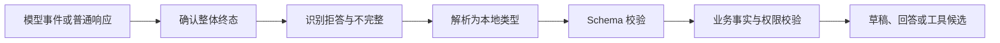

结构化输出解决“模型结果能否被程序稳定解析”，但不自动解决“内容是否真实、当前、合规并可执行”。可靠实现必须把语法、Schema、业务事实和状态校验分成不同层级。

## 四层校验模型

| 层级 | 要回答的问题 | 示例失败 | 主要负责人 |
| --- | --- | --- | --- |
| 传输与完整性 | 是否收到了完整终态和完整字节 | 流中断、响应不完整、编码错误 | SDK 与模型适配层 |
| 语法 | 是否能解析为目标格式 | 非法 JSON、截断字符串 | 序列化库 |
| Schema | 字段、类型、枚举和约束是否符合合同 | 缺少必填字段、未知枚举 | Schema 校验器 |
| 业务 | 值是否与权威事实、权限和状态一致 | 编造来源、过期状态、越权 ID | 业务 Service 与策略层 |

只有四层都通过，结果才可进入后续流程。即便供应商的 Structured Outputs 保证符合支持范围内的 JSON Schema，拒答、不完整响应、业务矛盾和陈旧事实仍需应用处理。

## Schema 是能力合同，不是数据库实体

面向模型的输出 Schema 应围绕一个具体能力设计，而不是直接暴露庞大的领域实体。

一个稳健的 Schema 通常包含：

- 明确的必填字段和类型。
- 小而稳定的枚举，不使用含义模糊的自由文本代替状态。
- 对“未知、无答案或不适用”的显式表达。
- 来源标识、证据充分性或需要人工确认等结果元数据。
- 合同版本，使消费者能够识别不兼容变化。
- 尽量关闭未知字段，避免模型生成的额外属性被静默接收。

不要把数据库主键、内部权限字段、乐观锁版本或可直接写入的状态字段全部交给模型生成。需要这些值时，应由业务代码查询或填充。

## 结构化回答与工具参数的区别

OpenAI 官方文档将两种场景分开：

- 模型向用户返回结构化回答时，使用结构化文本输出。
- 模型需要连接应用中的函数、数据或能力时，使用 Function Calling / Tool Calling。

两者都可能使用 JSON Schema，但执行语义不同。结构化回答是候选内容；工具参数是候选调用意图，必须进入 [[Tool Calling 生命周期与可靠业务边界]] 的鉴权、确认、事务和幂等流程。

## 一条可靠处理管线

处理顺序不能倒置：流式增量尚未构成完整 JSON 时，不应逐片反序列化为最终对象；模型明确拒答时，也不应强行把拒答文本塞入业务字段。

### 终态和拒答

先根据 [[模型 API 请求生命周期与流式状态]] 判断响应是否完整。供应商可能用独立字段表达拒答，拒答不一定符合原本的业务 Schema，应映射为本地 `REFUSED` 状态。

### 解析与 Schema

解析负责格式，Schema 负责形状。JSON mode 只保证生成可解析 JSON 时，不等于遵守某个具体 Schema；如果使用供应商原生结构化输出，也要核对支持的 JSON Schema 子集和所选模型兼容性。

### 业务校验

业务校验至少包括：

- 事实字段是否与本次权威输入一致。
- 来源 ID、版本和可见范围是否有效。
- 枚举组合和跨字段关系是否合法。
- 输入发生变化后结果是否已经过期。
- 当前用户是否有权看到或执行结果所指向的对象。
- 涉及写操作时是否需要重新查询、确认和幂等处理。

Schema 验证 `start <= end` 这类跨字段关系通常不如领域校验清晰；更不能验证某个 ID 是否存在或属于当前用户。

## Schema 设计与版本演进

### 从最小消费需求开始

每个字段都应有真实消费者。为“以后可能需要”增加字段，会扩大模型犯错面和兼容负担。

### 把缺失语义设计清楚

以下状态不能都用空字符串表达：

- 模型不知道。
- 来源中没有答案。
- 字段不适用于当前任务。
- 模型因安全原因拒答。
- 响应在生成中途停止。

可以用显式状态枚举配合可空值，但需要确认供应商支持的 Schema 子集。

### 由一个来源生成类型与 Schema

如果代码类型和 JSON Schema 分别手写，很容易发生漂移。可以从语言类型生成 Schema，或从 Schema 生成类型；无论选择哪一种，都应在 CI 中检测双方变化，并把生成器版本纳入锁定范围。

### 区分兼容与不兼容变化

| 变化 | 常见兼容性判断 | 建议 |
| --- | --- | --- |
| 增加可选字段 | 对宽松消费者可能兼容 | 仍需验证未知字段策略 |
| 增加必填字段 | 通常不兼容 | 发布新合同版本 |
| 删除枚举值 | 不兼容 | 先迁移生产者与消费者 |
| 扩展枚举值 | 对穷举消费者可能不兼容 | 增加未知值处理并回归 |
| 改变字段含义 | 即使类型相同也不兼容 | 新字段或新版本，不静默复用 |

Schema、Prompt、模型和评测集必须作为一组版本坐标记录，见 [[AI 评测、版本化与发布门禁]]。

## Java 与 Go 的实现差异

| 关注点 | Java | Go |
| --- | --- | --- |
| 本地类型 | record 或不可变 DTO 适合表达输出合同 | struct 与明确的 JSON tag 表达合同 |
| 字段校验 | Jakarta Bean Validation 适合单字段约束，跨字段仍写领域校验器 | 常用显式 `Validate` 函数；跨字段规则直接返回带分类的 `error` |
| 未知字段 | 配置反序列化器拒绝未知字段，避免静默吞掉漂移 | `json.Decoder.DisallowUnknownFields` 可用于严格入口；需要兼容时显式设计 |
| 枚举 | enum 反序列化失败要映射为合同错误 | 自定义字符串类型加校验，不能只依赖零值 |
| Schema 生成 | 反射或注解生成方便，但要锁定生成规则与依赖版本 | 代码生成可减少运行时反射；也需验证 JSON tag 与 Schema 一致 |
| 流式 | 先累积完整响应，再映射为类型 | 先完整收集并确认终态，再用 Decoder 解码 |

Java 与 Go 应共享 JSON Schema、示例 fixture 和业务规则语义；不要分别维护两份含义相近但字段名不同的合同。

## 失败分类与恢复

| 失败 | 是否直接重试 | 更合适的处理 |
| --- | --- | --- |
| 传输中断或服务端不完整 | 视错误分类与预算而定 | 丢弃正式结果，有限重试或缩小任务 |
| 安全拒答 | 否 | 返回明确拒答；检查任务是否允许改写 |
| JSON 解析失败 | 可能 | 先确认是否使用受支持的结构化输出；保留失败样例 |
| Schema 不匹配 | 可能，但必须限次 | 修正 Schema/Prompt 漂移；不能无限让模型“再试一次” |
| 事实不一致 | 通常否 | 从权威源重读，拒绝结果并加入回归 |
| 权限或状态过期 | 否 | 重新鉴权、读取最新状态，必要时要求用户确认 |
| 消费者版本不兼容 | 否 | 回滚合同或使用版本路由 |

重试会产生新的概率性输出和额外成本，也可能重复后续副作用。具体策略见 [[模型调用的错误分类、限流与幂等重试]]。

## 最小验证矩阵

至少准备以下固定用例：

1. 正常输入，所有字段与业务事实都正确。
2. 输入与任务无关，系统返回明确无答案而不是编造字段。
3. 模型拒答，应用不把拒答当解析异常。
4. 缺字段、未知字段、错误类型和未知枚举。
5. 单字段合法但跨字段冲突。
6. 来源 ID 存在但当前用户无权限。
7. 输出生成后业务数据发生变化。
8. 流式输出在 JSON 中间断开。
9. Java 与 Go 对同一 fixture 得出同一校验分类。

验证结果应分别记录“调用终态、解析结果、Schema 结果、业务结果”，不能只统计一个总通过率。

## 检查清单

- [ ] 文件名、代码类型和 Schema 指向同一个能力合同。
- [ ] Schema 没有直接复制数据库实体或供应商响应类型。
- [ ] 无答案、拒答、不适用和不完整具有不同语义。
- [ ] 流式结果在整体完成前不会进入反序列化与业务提交。
- [ ] Schema 校验后仍会重新核对事实、权限和最新状态。
- [ ] Java 与 Go 使用同一 Schema 与失败 fixture。
- [ ] 合同变化会触发消费者兼容测试和 Prompt 回归。
- [ ] 校验失败不会把秘密、完整敏感输入或原始上下文写入日志。

## 官方资料

以下资料于 2026-07-27 核对。模型兼容性和受支持的 JSON Schema 子集会变化，不能把当前支持范围写成永久结论。

- [OpenAI Structured Outputs](https://developers.openai.com/api/docs/guides/structured-outputs)：结构化输出、拒答、JSON mode 差异与 Schema 支持边界。
- [OpenAI Function Calling](https://developers.openai.com/api/docs/guides/function-calling)：工具参数 Schema 与调用循环。
- [JSON Schema 官方说明](https://json-schema.org/overview/what-is-jsonschema)：JSON Schema 的用途和规范入口。
- [OpenAI Java 官方仓库](https://github.com/openai/openai-java)：Java 类型生成 Schema、流式累积与结构化结果解析入口。
- [OpenAI Go 官方仓库](https://github.com/openai/openai-go)：Go 请求/响应类型和流式入口。

