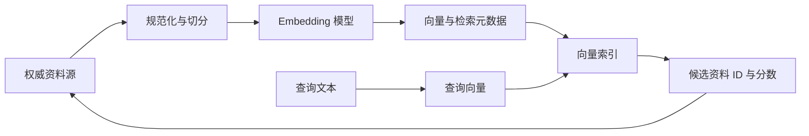

Embedding（嵌入）把文本映射为一组浮点数，使“含义接近”可以转化为“向量距离接近”。它适合召回候选资料，不负责证明事实，也不能代替保存权威业务状态的数据库。

本文解决三个问题：向量从哪里来、索引中应保存什么、业务资料变化后如何让索引可验证地更新或重建。

## 先建立数据流

检索结果最后应通过稳定 ID 回到权威资料或受控快照。向量数据库保存的是可重建的派生表示；标题、正文、可见状态、版本和权限的最终解释权仍在权威资料源。

## Embedding 能表达什么

一个向量通常只能表达“模型在当前版本下认为文本在语义空间中的位置”。它不直接表达：

- 资料是否真实、最新或允许当前用户查看。
- 两段文本为何相似，以及相似是否满足业务强约束。
- 原始文本变化后旧向量是否仍然有效。
- 不同 Embedding 模型产生的向量是否可以混用。

相似度分数是排序信号，不是概率，也不是跨模型、跨集合通用的质量阈值。阈值必须在固定查询集上校准。

## 索引数据模型

每个可检索切片至少需要以下字段；具体字段名可以不同，但语义必须稳定。

| 字段 | 作用 | 边界 |
| --- | --- | --- |
| `document_id` | 回到权威资料 | 不使用仅在单次导入中有效的行号 |
| `chunk_id` | 标识同一资料中的切片 | 切分策略变化时应能区分新旧版本 |
| `content` 或受控摘要 | 用于返回上下文 | 是否在向量库保存全文由隐私与恢复方案决定 |
| `embedding` | 参与相似度计算 | 维度与距离函数必须匹配集合配置 |
| `document_version` | 识别资料版本 | 不能只依赖“最近写入时间”猜测内容是否一致 |
| `embedding_version` | 标识模型与预处理契约 | 更换模型、维度或规范化方式时触发重建 |
| `visibility` | 检索前过滤候选 | 权限仍由业务层复核，不能只信模型传入值 |
| `source_updated_at` | 判断索引新鲜度 | 应来自权威资料源，而不是索引写入时间 |
| `content_hash` | 检测内容漂移与幂等写入 | 不包含不影响向量的易变字段 |

向量集合的核心契约还包括维度、距离函数、稠密或稀疏向量名称、租户隔离方式和 Payload（随向量保存、可用于过滤的元数据）Schema。任何一项不兼容变化都应创建新索引版本，而不是就地混写。

## 更新语义：先事实，后派生索引

资料写入与向量生成通常不能放进同一个跨系统事务。可靠主线是：

1. 业务事务先保存权威资料及其版本。
2. 事务内同时记录待索引事件，或由可重放的变更流产生事件。
3. 索引任务读取指定版本，规范化、切分并生成向量。
4. 以稳定 ID 和版本执行幂等 upsert（存在则更新，不存在则插入）。
5. 成功后记录索引水位；失败保留可重试状态。
6. 查询时执行可见范围过滤，并在返回前复核权威状态。

删除也必须有明确语义。软删除、不可见和物理删除不能都简化为“稍后自然消失”；索引消费者要能处理删除事件，并通过对账发现残留向量。

## 全量重建与切换

以下变化通常需要全量重建：

- 更换 Embedding 模型或向量维度。
- 修改会改变文本内容的规范化或切分策略。
- 改变集合距离函数、向量类型或租户隔离方式。
- 无法证明增量事件完整，或索引与权威数据已经明显漂移。

安全的重建流程是“新版本索引 → 完整导入 → 离线校验 → 小流量查询对比 → 原子切换读别名 → 保留旧版本恢复窗口”。不要清空当前索引后原地重建，否则重建失败会同时失去服务与恢复点。

## Java 与 Go 的应用边界

- Java 可把资料导出、切分、Embedding 和索引写入分成独立端口；使用批处理或消息消费者时，把外部 SDK 异常映射为稳定的索引任务状态。
- Go 应让 `context.Context` 贯穿 Embedding 和向量库调用，以便超时与取消及时停止；批量并发需要同时限制请求数、Token 和内存。
- 两端共享文档 ID、版本、集合 Schema、过滤字段和评测数据，不共享供应商 SDK 类型。
- Java 与 Go 都应能从权威资料重新生成整个索引；“本机已经有一个集合”不是可交付基线。

## 常见失败与定位顺序

| 现象 | 先检查 | 恢复方向 |
| --- | --- | --- |
| 写入提示维度不匹配 | 模型、维度、集合版本 | 停止混写，重建兼容集合 |
| 删除资料仍被召回 | 删除事件、过滤条件、对账任务 | 补发删除并全量扫描残留 ID |
| 结果语义接近但条件不符 | 权限、状态、地区等元数据过滤 | 将强约束放入确定性过滤 |
| 索引任务反复生成重复点 | ID 与内容哈希 | 修正幂等键，不以随机 ID 重试 |
| 新资料长期检索不到 | 事件积压、索引水位、Embedding 失败 | 重放事件并比较源版本与索引版本 |
| 切换模型后质量突变 | Embedding 版本与查询向量来源 | 保证文档与查询使用同一契约 |

## 如何验证实现

至少保存并自动检查：

1. 同一资料版本重复写入不会增加重复点。
2. 更新和删除后，旧切片不再可见。
3. 全量导出数量、索引文档数与缺失/重复 ID 对账一致。
4. 无权限、已失效和被删除资料不能通过只改查询文本绕过过滤。
5. 新旧索引可在同一查询集上比较，再决定是否切换。
6. Embedding 或向量库不可用时，权威业务写入仍有明确结果，索引任务可恢复。

检索效果本身继续用 [[关键词、向量与混合检索及评测]] 验证；把候选资料用于回答时，继续遵守 [[RAG 的证据链、引用与质量评测]]。

## 相关笔记

- [[AI 应用开发的系统分层与职责边界]]
- [[关键词、向量与混合检索及评测]]
- [[RAG 的证据链、引用与质量评测]]
- [[AI 评测、版本化与发布门禁]]
- [[AI 应用的成本、延迟、可观测性与降级]]

## 官方资料

以下资料核对于 2026-07-27：

- [OpenAI Vector embeddings](https://developers.openai.com/api/docs/guides/embeddings)
- [OpenAI Retrieval](https://developers.openai.com/api/docs/guides/retrieval)
- [Qdrant Collections](https://qdrant.tech/documentation/concepts/collections/)
- [Qdrant Points](https://qdrant.tech/documentation/concepts/points/)
- [Qdrant Payload](https://qdrant.tech/documentation/concepts/payload/)

