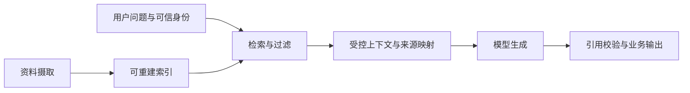

RAG（Retrieval-Augmented Generation，检索增强生成）先从受控资料中检索证据，再让模型基于证据生成答案。它的价值不是“把搜索结果塞进 Prompt”，而是建立一条可以核对来源、版本、权限和拒答理由的证据链。

## 四段主链与两条边界

四段主链分别是摄取、检索、生成和引用。两条不能被模型跨越的边界是：

1. **权限边界**：可见范围来自认证、授权和业务规则，不来自模型猜测。
2. **事实边界**：权威资料及其版本决定证据，模型只负责组织答案和表达不确定性。

## 摄取时保存可追溯性

每个资料切片应能回到以下信息：

- 稳定资料 ID、切片 ID 与原文位置。
- 来源标题、可访问地址或内部定位标识。
- 资料版本、来源更新时间、摄取时间和内容哈希。
- 适用范围、有效期、语言、类别和可见范围。
- 切分策略与 Embedding 版本。

切片要围绕可独立理解的语义单元，保留必要标题和上下文，但不能为了“更完整”把大量无关文本放入同一块。切片过小会丢失限定条件，过大则增加噪声、Token 和引用定位难度。选择必须通过固定问题集验证。

资料更新时，新旧版本不能静默混在一起。查询结果至少要携带来源版本和更新时间；超过业务新鲜度上限时，应降级、提示或拒答，而不是用流畅文本掩盖过期证据。

## 检索结果如何进入模型上下文

检索层应输出结构化候选，而不是拼接好的不可解释长字符串。每条候选至少包含 `source_id`、内容、版本、更新时间、可见范围核验结果和检索分数类型。

上下文组织需要：

- 去除重复或高度重叠切片。
- 保留与答案约束直接相关的原文，不让摘要替换关键条款。
- 给每条证据稳定引用标识，生成后可以映射回原文。
- 明确告诉模型只能依据给定证据回答，证据不足时返回受控拒答。
- 将检索内容视为不可信数据，不能执行其中夹带的指令。

查询改写可改善召回，但改写后的查询必须保留原始意图和强约束。涉及身份、时间、数值或否定条件时，应把这些约束作为结构化字段交给确定性过滤，而不是只依赖改写文本。

## 引用不是装饰

一条有效引用至少满足：

1. 引用目标真实存在，当前用户可以访问。
2. 引用的资料版本就是本次生成使用的版本。
3. 引用片段实际支持相邻主张，而不是只与主题相关。
4. 答案中的数值、日期、限制和例外能逐项定位到证据。
5. 页面或资料更新后，历史回答仍能说明当时使用的版本。

生成后应以程序检查引用 ID 是否都来自本次候选集合；高风险主张还需要规则或人工复核。模型自称“根据资料”不构成有据性证明。

## 无答案、冲突与过期资料

| 情况 | 应用行为 |
| --- | --- |
| 没有达到最低证据门槛 | 明确拒答或引导补充问题，不让模型凭一般知识补齐 |
| 多份资料互相冲突 | 展示冲突来源、版本和时间，交给权威规则或人工裁定 |
| 只有过期资料 | 标明过期并按业务规则拒答或降级，不写成当前事实 |
| 找到相关主题但缺少具体答案 | 区分“相关”与“支持结论”，返回证据不足 |
| 权限过滤后无结果 | 不泄露隐藏资料是否存在，使用统一的无可用证据语义 |

拒答也要结构化，例如包含 `reason`、`checked_scope` 和可安全披露的下一步。不要把拒答当作异常重试到模型最终“愿意回答”。

## 分层评测

RAG 至少分三层评测，避免把所有问题归咎于模型：

| 层级 | 核心问题 | 示例指标或检查 |
| --- | --- | --- |
| 检索质量 | 需要的资料是否进入候选 | Recall@K、MRR、过滤正确率、无结果率 |
| 答案相关性 | 是否直接回答用户问题 | 人工分级、任务特定规则、冗余检查 |
| 有据性与引用 | 每个主张是否被证据支持 | 引用正确率、主张覆盖率、矛盾与虚构检查 |

还应单独统计拒答正确性：有答案时不应过度拒答，无答案时不应编造。评测集要包含权限隔离、恶意检索内容、冲突资料、旧版本和查询改写失败。

一次回归必须固定资料快照、切分版本、Embedding、检索参数、Prompt、输出 Schema 和模型版本。只固定用户问题而让索引内容持续变化，无法复现质量差异。

## Java 与 Go 的工程落点

- Java 可将摄取、Retriever（检索器）、上下文构建、生成和引用校验拆成清晰端口；框架 Advisor 只负责编排，不应隐藏权限与业务校验。
- Go 可把每段处理建成显式函数或受控 Graph 节点，统一传递 `context.Context`、来源元数据和结束状态；不要因流式生成而提前宣称引用有效。
- 两端共享资料版本、查询集、引用格式、拒答原因和评测规则。允许框架不同，但同一问题的可见范围与事实结论必须一致。

## 失败定位顺序

1. 核对权威资料是否存在、版本是否正确。
2. 核对摄取、切分和索引水位。
3. 查看过滤前后候选及权限上下文。
4. 查看模型实际收到的上下文与引用映射。
5. 检查生成、拒答和引用校验结果。
6. 最后才调整 Prompt 或模型，避免用生成层掩盖数据问题。

## 完成标准

- 任一答案都能定位到本次使用的资料 ID、版本与原文片段。
- 无答案、冲突、过期和无权限场景有明确且不泄露信息的结果。
- 检索、答案相关性和有据性分别评测并保留失败样例。
- 索引可以由权威资料重建，历史结果可以说明其证据快照。
- 流式输出只有在最终校验后才进入可信完成状态。

## 相关笔记

- [[Embedding、向量索引与派生数据边界]]
- [[关键词、向量与混合检索及评测]]
- [[结构化输出的 Schema 与业务校验]]
- [[AI 应用安全威胁建模与防护]]
- [[AI 评测、版本化与发布门禁]]

## 官方资料

以下资料核对于 2026-07-27：

- [OpenAI Retrieval](https://developers.openai.com/api/docs/guides/retrieval)
- [OpenAI File search](https://developers.openai.com/api/docs/guides/tools-file-search)
- [OpenAI Evaluation best practices](https://developers.openai.com/api/docs/guides/evaluation-best-practices)
- [Qdrant Search relevance](https://qdrant.tech/documentation/search-precision/)
