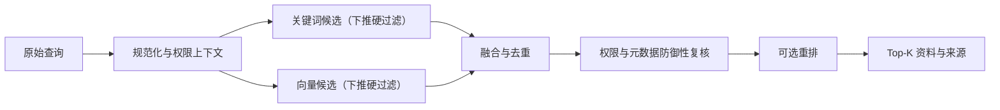

检索的目标不是返回“看起来相关”的文本，而是在权限和业务过滤约束内，把真正有用的资料尽量排在前面。关键词、向量与混合检索是三种候选策略，最终选择必须由固定查询集和人工相关性标注支撑。

## 三种检索分别擅长什么

| 策略 | 主要信号 | 擅长 | 常见盲点 |
| --- | --- | --- | --- |
| 关键词检索 | 词项、词频和字段权重 | 编号、专有名词、精确短语、可解释匹配 | 同义表达、口语改写和跨语言表达 |
| 纯向量检索 | Embedding 相似度 | 语义近似、自然语言问题和概念改写 | 精确标识、否定词、数值及强过滤条件 |
| 混合检索 | 关键词与向量两个候选集 | 同时保留精确匹配与语义召回 | 融合权重、去重和重排增加复杂度 |

不存在天然最优的策略。包含编号、版本、错误码的资料常从关键词信号受益；用户描述与文档措辞差异很大时，向量召回更有价值。混合检索只有在同一数据集上优于简单基线时才值得维护。

## 一条可解释的检索流水线

权限、租户、状态、时间范围等强约束应来自可信业务上下文，并同时下推到关键词与向量查询中，在产生候选时就确定性执行；融合后再做一次防御性复核。不能让越权资料先进入共享候选集、排序或日志，也不能让模型生成一个 `tenant_id` 后直接当作授权结果。若某个检索后端无法执行必要的硬过滤，应先建立隔离索引或改用能保证过滤的查询路径，而不是依赖融合后的补救。

融合可以采用加权分数、倒数排名融合等方法。由于不同检索器的原始分数通常不在同一尺度上，不要直接相加而不做归一化或排名级融合。重排器只处理受控数量的候选，不能替代前面的权限过滤。

## 评测集先于调参

一条最小检索评测记录包含：

- 稳定的查询 ID、查询文本和用户可见范围。
- 人工标注的相关资料 ID；必要时区分高度相关、部分相关和不相关。
- 数据快照、切分版本、Embedding 版本和索引版本。
- 候选策略及其参数，例如字段权重、Top-K、过滤和融合方法。
- 每次运行的排序结果、失败查询和核对人。

查询集应覆盖正常问题、同义改写、错别字、专有名词、编号、否定表达、无答案问题、权限隔离和过期资料。只选“容易命中”的演示问题会制造虚假的质量结论。

## Recall@K 与 MRR

Recall@K（前 K 个结果的召回率）回答：“人工标为相关的资料，有多少出现在前 K 个结果中？”

$$
Recall@K = \frac{|\text{Top-K 中的相关资料}|}{|\text{全部已标注相关资料}|}
$$

它适合一个问题可能对应多份相关资料的场景，但不关心相关结果在第 1 位还是第 K 位。

MRR（Mean Reciprocal Rank，平均倒数排名）先取每个查询的第一个相关结果排名 $rank_i$，再求倒数平均：

$$
MRR = \frac{1}{N}\sum_{i=1}^{N}\frac{1}{rank_i}
$$

它适合“尽快给出第一个正确入口”的场景，却忽略第二个及之后的相关结果。如果查询没有任何相关结果，该查询的倒数排名记为 0。

两个指标都依赖标注完整性，不等于最终答案正确率。RAG 仍需单独评估引用和有据性，见 [[RAG 的证据链、引用与质量评测]]。

## 对比实验顺序

1. 固定数据快照、查询集和相关性标注。
2. 建立最简单的关键词基线。
3. 在相同过滤条件下加入纯向量基线。
4. 仅当两者失败集合互补时，再实验混合融合。
5. 保存逐查询差异，而不只保存总平均数。
6. 对退化查询做原因分类：切分、词法、Embedding、过滤、融合还是标注问题。
7. 用预先声明的门槛决定发布，不在看到结果后临时改成功标准。

离线指标通过后，还要观察无结果率、点击或人工采纳、查询延迟和权限拦截等在线信号。在线行为受界面和用户群影响，不能反过来替代离线标注。

## Java 与 Go 的实现关注点

- Java 可用统一检索端口封装关键词与向量后端，通过明确 DTO 返回 `documentId`、来源、分数类型和版本；不要把某个客户端的结果类型扩散到业务层。
- Go 可并发获取两个候选集，但应使用同一 `context.Context`、共享截止时间和有上限的并发；某一路失败时要记录是降级为单路还是整体失败。
- 两端必须读取同一查询集、过滤字段和人工标注，允许采用不同内部库，但融合规则与产品语义应可对照。

## 常见误判与排障

| 现象 | 可能原因 | 验证方式 |
| --- | --- | --- |
| 平均 Recall 很高，关键问题仍失败 | 查询分布不均或平均数掩盖长尾 | 按类型和重要等级分组报告 |
| 向量结果很像但答非所问 | 强约束未过滤或切片缺少关键字段 | 查看候选元数据和原文，不只看分数 |
| 混合检索反而下降 | 分数直接相加、权重过拟合或重复候选 | 保存每一路排名并逐查询对比 |
| MRR 上升但 RAG 答案变差 | 第一条相关不代表证据充分 | 联合检查引用覆盖和答案有据性 |
| 新数据评测突然下降 | 索引或标注版本漂移 | 核对数据、Embedding 与索引版本 |

## 完成标准

- 能解释为什么当前场景选择关键词、向量或混合检索。
- 所有质量结论都能追溯到查询、标注、数据和索引版本。
- 至少保留一组失败查询，并能定位到具体流水线层级。
- 权限和状态过滤有独立测试，不能被相似度或重排覆盖。
- Java 与 Go 的结果以产品语义和同一评测集比较，而不是以代码形状比较。

## 相关笔记

- [[Embedding、向量索引与派生数据边界]]
- [[RAG 的证据链、引用与质量评测]]
- [[AI 评测、版本化与发布门禁]]
- [[AI 应用的成本、延迟、可观测性与降级]]

## 官方资料

以下资料核对于 2026-07-27：

- [OpenAI Retrieval](https://developers.openai.com/api/docs/guides/retrieval)
- [Qdrant Hybrid Queries](https://qdrant.tech/documentation/concepts/hybrid-queries/)
- [Qdrant Filtering](https://qdrant.tech/documentation/concepts/filtering/)
- [Qdrant Search relevance](https://qdrant.tech/documentation/search-precision/)
