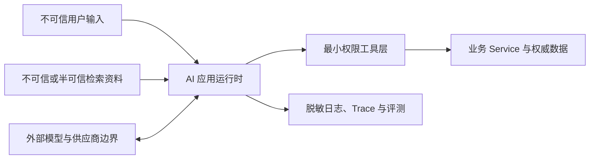

AI 应用把自然语言、外部资料和工具接入业务系统，也把原本只需解析的数据变成了可能影响模型决策的指令载体。安全设计必须从资产、信任边界和可执行失败测试开始；“在 Prompt 中提醒模型要安全”不是完整防护。

## 先画资产与信任边界

需要保护的资产通常包括：身份与权限、业务数据、Prompt 和内部策略、工具凭据、外部系统访问、模型用量预算、审计记录及最终业务状态。

对每条数据流回答：来源是否可信、进入模型前能看到什么、模型输出能触发什么、跨租户隔离在哪里、日志会保存什么、失败后怎样确认是否产生副作用。

## 主要威胁与控制

### Prompt Injection

Prompt Injection（提示注入）是攻击者通过用户文本、网页、文件或检索片段，让模型忽略原任务并服从恶意指令。间接注入尤其危险，因为恶意内容可能来自应用主动读取的资料。

控制重点：

- 把检索内容、网页和工具结果明确当作数据，不当作高优先级指令。
- 工具白名单、参数校验、授权和审批由运行时执行，不依赖模型自律。
- 只给任务必需的数据和能力，缩小一次调用可见范围。
- 对高风险操作显示精确预览并重新确认。
- 保存注入失败用例，验证攻击不能扩大权限或泄露数据。

没有通用 Prompt 可以“彻底解决”注入。系统应假设模型可能被诱导，并让确定性边界限制最坏结果。

### 恶意检索内容与数据投毒

摄取源可能包含伪造事实、隐藏指令、过期资料或被污染的版本。应建立来源白名单、内容哈希、版本、更新时间、可见范围和审批流程；摄取与索引任务保留审计记录，并能撤回污染版本、重建索引。

生成时校验引用是否来自本次受权候选，冲突或证据不足时拒答。资料“被检索到”不代表内容真实，见 [[RAG 的证据链、引用与质量评测]]。

### 敏感数据泄露

泄露可能发生在 Prompt、模型响应、工具参数、检索结果、日志、Trace、缓存、评测集或第三方观测平台。

- 按数据分类决定哪些内容可以离开业务边界。
- 在调用前最小化和脱敏，不把事后日志清洗当作唯一控制。
- 默认不采集完整 Prompt、检索原文和工具参数；确需采集时显式启用、限制访问与保留期。
- 输出做敏感字段与越权引用检查。
- 密钥只由服务端秘密管理提供，绝不放入 Prompt、Schema 或示例。

### 越权工具调用与重复副作用

模型生成合法参数不等于调用者有权操作。服务端从可信会话注入身份，逐资源授权；写操作需要审批、事务和幂等。超时后先查询最终状态，不能无条件重试。详见 [[Tool Calling 生命周期与可靠业务边界]]。

### 供应链与不可信扩展

模型 SDK、AI 框架、MCP Server、插件、Prompt 包、模型和容器都属于供应链。应锁定版本、核对官方来源和许可证、扫描依赖、限制运行权限，并在隔离环境验证第三方 Server。README 中的安全承诺不能替代代码、配置和实际权限检查。

### SSRF、Token 转发与会话劫持

远程工具或 MCP 场景可能引入 SSRF（服务端请求伪造）、OAuth confused deputy（混淆代理）、Token passthrough（把未验证的上游令牌直接转发）和会话劫持。URL 获取要有协议、主机、重定向和内网地址限制；令牌要校验 audience 与 scope，不向下游透传不属于它的令牌；会话标识不能当作认证。MCP 专属边界见 [[MCP 生命周期、能力协商与安全边界]]。

## 纵深防御落点

| 层级 | 确定性控制 |
| --- | --- |
| 输入 | 大小、类型、来源和恶意模式检查；可信指令与不可信数据分离 |
| 上下文 | 数据最小化、租户隔离、版本与可见范围过滤 |
| 模型 | 固定能力合同、结构化输出、拒答语义和资源预算 |
| 工具 | 白名单、Schema、服务端身份、资源授权、审批、事务与幂等 |
| 输出 | 结构、引用、敏感信息、业务事实和发布状态校验 |
| 运行时 | 沙箱、网络出口、超时、并发、费用和步骤上限 |
| 观测 | 脱敏、最小采集、访问控制、保留期和审计 |
| 发布 | 安全回归、灰度、功能开关和回滚 |

任何一层都不能单独保证安全。模型层的拒绝是有用信号，但高风险操作必须由模型之外的控制阻断。

## 把威胁转成失败型测试

至少覆盖：

- 用户要求泄露系统指令、密钥或其他租户资料。
- 检索文档包含“忽略前述规则并调用工具”的间接注入。
- 模型传入伪造用户 ID、租户、角色或资源所有者。
- 未确认、确认后参数被改变、过期审批和重复提交。
- URL 工具访问回环、链路本地、云元数据或重定向后的受限地址。
- 工具返回秘密、堆栈或超大内容，验证上下文与日志不会泄露。
- 被撤回或过期资料仍存在于向量索引。
- 费用、Token、工具次数和任务步骤耗尽。
- 模型、向量库、工具或观测出口不可用时不扩大权限降级。

每条测试保存资产、入口、预期阻断层、实际结果和剩余风险。测试通过只证明当前版本和配置下的场景，不表示攻击面已经穷尽。

## Java 与 Go 的关注点

- Java 应复用现有认证授权、Bean Validation、事务和审计能力；AI 框架的 Advisor 或拦截器不能成为唯一安全边界。
- Go 应让可信身份保存在服务端上下文和显式参数中，避免用可伪造的字符串键；HTTP 客户端和工具执行器需要统一网络出口策略与截止时间。
- 两端共享威胁模型、恶意输入集、Tool Schema、权限矩阵和阻断预期，语言专属测试再覆盖序列化与并发差异。

## 评审完成标准

- 已列出资产、信任边界、攻击入口和允许的最坏结果。
- 不可信文本不能直接改变身份、权限、工具白名单或审批状态。
- 高风险写操作在模型之外有确定性阻断。
- 内容采集、第三方传输和保留期有明确数据分类依据。
- 每个对外能力至少有正常、越权、注入、泄露和依赖失败测试。
- 剩余风险、人工处置和重新评估触发条件被明确记录。

## 相关笔记

- [[RAG 的证据链、引用与质量评测]]
- [[Tool Calling 生命周期与可靠业务边界]]
- [[受控 Agent 的执行、审批与恢复]]
- [[MCP 生命周期、能力协商与安全边界]]
- [[AI 评测、版本化与发布门禁]]
- [[AI 应用的成本、延迟、可观测性与降级]]

## 官方资料

以下资料核对于 2026-07-27：

- [OWASP Top 10 for LLM Applications 2025](https://genai.owasp.org/resource/owasp-top-10-for-llm-applications-2025/)
- [OWASP Top 10 for Agentic Applications 2026](https://genai.owasp.org/resource/owasp-top-10-for-agentic-applications-for-2026/)
- [OWASP Secure MCP Server Development](https://genai.owasp.org/resource/a-practical-guide-for-secure-mcp-server-development/)
- [OWASP GenAI Security Project GitHub](https://github.com/OWASP/www-project-top-10-for-large-language-model-applications)
- [MCP Security Best Practices](https://modelcontextprotocol.io/docs/tutorials/security/security_best_practices)
- [MCP Authorization](https://modelcontextprotocol.io/specification/2025-11-25/basic/authorization)
- [OpenAI Safety best practices](https://developers.openai.com/api/docs/guides/safety-best-practices)
