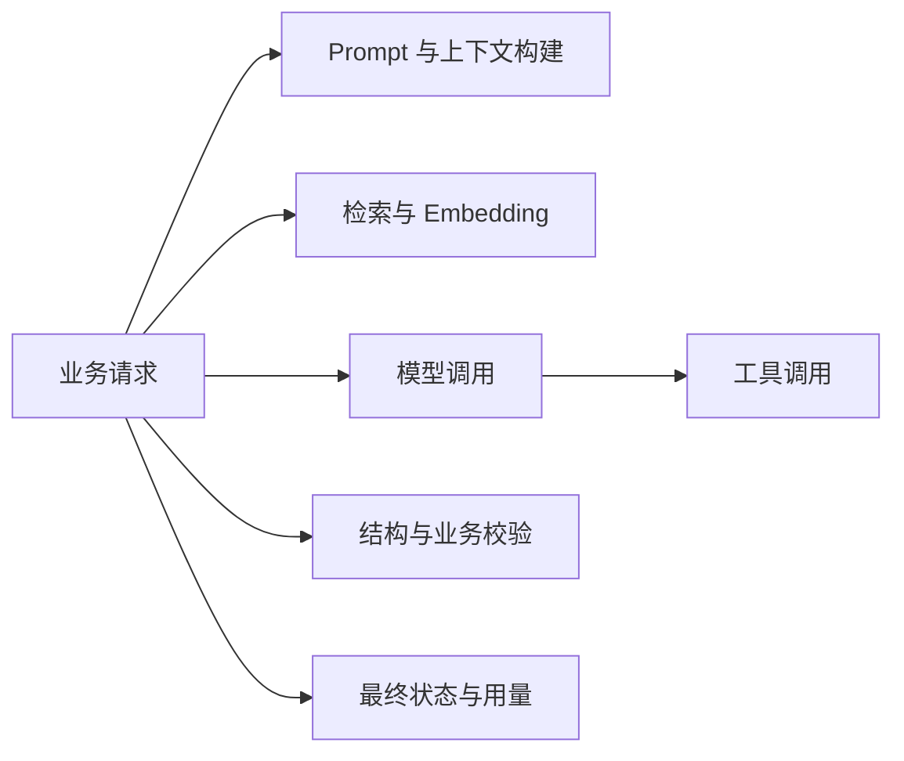

AI 应用的运行质量不只由模型回答决定，还取决于检索、工具、网络、流式传输和外部平台。可观测性的目标是把一次用户请求分解为可关联的步骤，回答“慢在哪里、贵在哪里、失败在哪里、是否产生部分结果”，并支撑受控降级和恢复。

## 一条 Trace 应能还原什么

Trace（分布式追踪）连接一次请求中的父子步骤；日志保存离散事件和诊断摘要；指标聚合大量请求的趋势和告警。三者共享请求、任务、步骤和版本标识，但不应默认复制完整内容。

## 最小观测字段

| 维度 | 建议字段 |
| --- | --- |
| 关联 | 业务请求 ID、Trace ID、任务/步骤 ID、供应商请求 ID |
| 版本 | 应用 revision、模型、Prompt、Schema、工具、数据集和索引版本 |
| 操作 | 模型生成、Embedding、检索、工具或评测等稳定操作类型 |
| 结果 | 成功、失败、取消、超时、部分完成、降级及原因 |
| 用量 | 输入、输出、缓存或其他供应商返回的 Token 类别 |
| 延迟 | 排队、首 Token、总生成、检索、工具和端到端耗时 |
| 质量 | 结构校验、引用、工具结果和安全门禁摘要 |
| 资源 | 重试次数、并发、候选数、步骤数和费用估算依据 |

属性名称和语义应优先对齐当前 OpenTelemetry GenAI Semantic Conventions（生成式 AI 语义约定），但必须记录使用的规范版本与稳定性状态。核对日的 GenAI 约定已迁到独立仓库，该仓库没有 release/tag，全部约定仍是 Development，Schema URL 尚未确定；流式 chunk 已有 `gen_ai.client.operation.time_to_first_chunk` 和 `gen_ai.client.operation.time_per_output_chunk` 指标定义，但同样尚未稳定。实现应固定 commit 并通过映射层升级，不能把实验性字段直接当作长期业务合同。详见 [[OpenTelemetry GenAI 语义约定导读]]。

## Token、成本与延迟

Token 是模型处理文本或其他内容时使用的计量单位之一。成本计算应使用供应商实际返回的用量类别和当次价格快照；长期指标保存用量与模型版本，价格变化后仍能重新解释历史数据。

至少区分：

- **首 Token 延迟**：从发起请求到收到第一个可展示增量，反映流式体感。
- **模型总延迟**：模型请求从开始到终态。
- **端到端总延迟**：包含排队、检索、工具、校验和网络输出。
- **取消响应时间**：用户取消到系统停止新工作并记录最终状态的时间。

流式输出可以改善首 Token 延迟，却不一定降低总延迟或成本。只记录成功请求的 P50 会掩盖长尾；应按场景和模型报告 P50、P95 或业务需要的分位数，并单独统计超时、取消和失败。

成本预算可分为单请求、单任务、租户和全局层级。达到软阈值时减少候选、缩短非必要上下文或转人工；达到硬阈值时停止新步骤。降级规则要预先评测，不能在事故时临时切换到未知行为。

## 内容采集默认最小化

Prompt、模型输出、检索原文和工具参数可能包含个人信息、业务秘密或攻击载荷。默认只记录长度、哈希、版本、分类和安全摘要；需要内容级调试时：

1. 明确采集目的、数据分类和责任人。
2. 先脱敏，再发送到观测后端。
3. 限制环境、采样率、访问权限和保留期。
4. 让启用状态可审计并能及时关闭。
5. 不在异常堆栈或标签中附加完整内容。

高基数字段也不应作为指标标签，否则会使观测系统成本和可用性失控；请求 ID 等放在 Trace 或日志中。

## 降级矩阵

| 不可用依赖 | 可选降级 | 禁止做法 | 恢复检查 |
| --- | --- | --- | --- |
| 模型 | 返回确定性功能、排队或人工处理 | 静默换到未评测模型并宣称同等质量 | 模型健康、回归样例和路由版本 |
| Embedding/向量库 | 退回已评测关键词检索或暂停售用 | 跳过权限过滤、使用过期未知索引 | 索引水位、对账和查询回归 |
| 检索资料源 | 使用有版本的缓存并标明时间，或拒答 | 让模型凭训练记忆补业务事实 | 来源版本、新鲜度和冲突检查 |
| 业务工具 | 只返回查询结果或明确稍后重试 | 伪造工具执行成功、重复写操作 | 幂等状态、事务和外部结果 |
| 观测出口 | 本地有界缓冲、采样或丢弃非关键遥测 | 阻塞核心业务、无限堆积内存 | 出口健康、积压与丢弃计数 |
| 评测/安全服务 | 阻断高风险发布或操作 | 因门禁不可用而默认放行 | 服务恢复后重跑门禁 |

任何降级都不能扩大权限、降低必要业务校验或把不确定结果写成确定事实。用户需要知道能力已降级以及哪些结果未验证。

## 重试、熔断与恢复

- 只对明确的临时失败、在剩余截止时间内退避重试，并记录每次尝试。
- 写工具超时先查最终状态，不能由基础设施层盲目重放。
- 持续失败时熔断，保护线程、连接、Token 和下游配额。
- 半开探测使用最小、无副作用请求，不拿用户高风险操作试探恢复。
- 恢复后先运行健康检查和代表性回归，再逐步恢复流量。
- 事故记录包含版本、影响、降级、丢弃遥测、恢复证据和待补回任务。

## Java 与 Go 的落点

- Java 可通过统一客户端拦截器和 Micrometer/OpenTelemetry 集成采集公共字段，同时在适配层补充模型、检索和工具语义；避免每个业务 Service 自定义一套名称。
- Go 让 `context.Context` 携带截止时间和 Trace 上下文，确保 goroutine、HTTP 请求和流读取可取消；指标标签保持低基数。
- 两端共享终态、操作名、版本字段、延迟定义和脱敏规则，使同一产品语义可在一个仪表盘比较。

## 验证清单

- 一个正常请求、流式请求、取消和工具失败都能关联完整 Trace。
- 首 Token、模型总延迟与端到端延迟定义不同且有测试。
- Token 和费用能回到模型、版本、租户和能力，但不泄露内容。
- 日志、Trace、指标和评测数据经过秘密与个人信息抽查。
- 观测出口断开不会拖垮业务，请求能说明遥测是否丢失。
- 每种核心依赖都有预先验证的降级、停止和恢复条件。
- 回滚后能比较新旧版本的错误、延迟、成本与质量门禁。

## 相关笔记

- [[模型 API 请求生命周期与流式状态]]
- [[模型调用的错误分类、限流与幂等重试]]
- [[Embedding、向量索引与派生数据边界]]
- [[受控 Agent 的执行、审批与恢复]]
- [[AI 评测、版本化与发布门禁]]
- [[AI 应用安全威胁建模与防护]]
- [[OpenTelemetry GenAI 语义约定导读]]
- [[Langfuse Trace 与评测数据模型源码导读]]

## 官方资料

以下资料核对于 2026-07-27：

- [OpenTelemetry GenAI Semantic Conventions repository](https://github.com/open-telemetry/semantic-conventions-genai)
- [OpenAI Streaming API responses](https://developers.openai.com/api/docs/guides/streaming-responses)
- [OpenAI Production best practices](https://developers.openai.com/api/docs/guides/production-best-practices)
- [OpenAI Rate limits](https://developers.openai.com/api/docs/guides/rate-limits)
