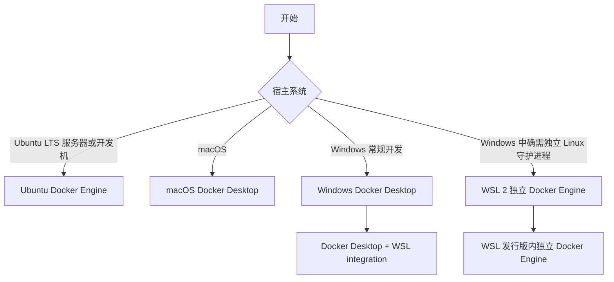

Docker 的安装方案取决于宿主操作系统和使用场景，而不是只取决于“能否运行 `docker` 命令”。后端开发中最常见的目标是运行 Linux 容器、使用 `docker compose` 编排本地依赖，并让命令行、镜像缓存、端口映射和 IDE 集成保持在同一套运行时上。

先选对安装路线，再执行平台笔记中的命令。尤其在 Windows 上，不要把 Docker Desktop 的 WSL integration 与 WSL 发行版中的独立 Docker Engine 混在一起；两者都会提供 Docker 守护进程，混用会带来 socket、镜像缓存、端口和权限上的冲突。

## 适用范围与选择建议

下面的路径默认面向日常后端开发和本地集成测试，重点是 Linux Containers。



| 你的环境或目标 | 首选方案 | 继续阅读 |
| --- | --- | --- |
| Ubuntu LTS 上开发、CI Runner 或服务器运行容器 | Docker Engine | [[Ubuntu 安装 Docker]] |
| Apple Silicon 或 Intel Mac 本地开发 | Docker Desktop for Mac | [[macOS 安装 Docker Desktop]] |
| Windows 主机上的常规后端开发 | Docker Desktop 的 WSL 2 后端 | [[Windows 安装 Docker Desktop]] |
| 必须让守护进程完全运行在某个 WSL 发行版内 | WSL 2 + 独立 Docker Engine | [[WSL 2 中安装 Docker Engine]] |

> [!important] Windows 的默认选择
> 对大多数 Windows 开发者，`Docker Desktop + WSL 2 integration` 是一套完整、维护成本较低的方案：Docker Desktop 管理 Engine，选中的 WSL 发行版只获得 Docker CLI 访问能力。[[WSL 2 中安装 Docker Engine]] 是另一条独立路线，适合有明确需求的人，不应与 Desktop integration 同时部署。

## Docker Engine、Docker Desktop 与 WSL 2 的关系

| 名称 | 它是什么 | 典型职责 | 不是什么 |
| --- | --- | --- | --- |
| Docker Engine | Linux 上的容器运行时，包含 `dockerd`、CLI、containerd 等组件 | 拉取镜像、构建镜像、创建和运行容器 | 不是图形化桌面应用 |
| Docker Desktop | 面向 macOS、Windows 等桌面系统的开发产品 | 提供 Engine、CLI、Compose、图形界面、更新和平台集成 | 不是“直接在 macOS 或 Windows 内核上运行 Linux 容器” |
| WSL 2 | Windows 上运行 Linux 发行版的轻量虚拟化环境 | 提供 Linux 内核、发行版和 Linux 开发终端 | 不是 Docker 运行时，也不会自动提供 Docker 守护进程 |

在 Ubuntu 上，通常直接安装 Docker Engine。在 macOS 上，Docker Desktop 使用 Linux 虚拟化环境承载 Linux 容器。在 Windows 上，Docker Desktop 可使用 WSL 2 后端，并将 CLI 集成到选定的 WSL 发行版中；该发行版本身不需要也不应再启动另一套 `dockerd`。

## 开始前的共同检查

无论选择哪条路线，先确认以下事项：

- 宿主机有足够的可用内存、磁盘和 CPU 资源；运行数据库、消息队列等容器时，磁盘与内存通常比 Docker CLI 本身更早成为瓶颈。
- 记录现有 Docker 运行时、镜像、卷和项目配置。切换 Docker Desktop、重装 Docker Engine 或更改 data root 前，先确认是否需要保留本地数据。
- 企业设备先确认镜像仓库、代理、证书、终端安全软件和许可证政策；不要把个人网络配置直接复制到受管设备。
- 后端项目优先运行 Linux Containers。Windows Containers 只在确实依赖 Windows 内核、Windows API 或特定 Windows 基础镜像时再选择。

## 安装后的最小验证

各平台笔记会给出对应的安装和服务管理步骤。安装完成后，可用这组命令确认 CLI、守护进程和 Compose 插件都可用：

```bash
docker version
docker info
docker run --rm hello-world
docker compose version
```

`docker run --rm hello-world` 会完成一次真实的镜像拉取和容器启动；它失败时，应先区分“守护进程未启动”“权限不足”“代理或 DNS 不可用”“镜像仓库访问被阻断”四类问题，而不是立刻更换安装方案。

## 中国大陆网络环境提示

> [!tip] 在中国大陆网络环境下
> 下载 Docker Desktop、拉取 Docker Hub 镜像、访问私有仓库或解析 DNS 可能受网络路径影响。优先使用组织批准的内部镜像仓库、受信任的企业代理或当时仍可用的官方服务；不要把来源不明的第三方镜像加速地址写进团队配置。
>
> 完成网络配置后，分别验证 `docker pull hello-world`、项目实际使用的镜像拉取和一次 `docker compose pull`。若使用代理，确认代理配置同时覆盖 Docker Desktop 或独立 `dockerd`，并记录 `NO_PROXY` 规则；仅浏览器能打开网页不代表守护进程也能访问镜像仓库。

## 常见问题

### 为什么终端能找到 `docker`，但无法连接守护进程？

先运行 `docker version`。如果 Client 有输出、Server 报错，通常是 Docker Desktop 尚未启动、Linux 服务未启动，或当前 WSL 发行版没有启用 Desktop integration。按对应平台笔记检查服务状态和当前 Docker context。

### 为什么镜像、容器或卷“消失”了？

最常见原因是切换了不同的运行时：例如从 Docker Desktop 切到 WSL 独立 Engine，或在多个 Docker context 之间切换。先用 `docker context ls` 和 `docker info` 确认自己连到哪一个守护进程，再决定是否迁移数据。

### 是否需要把 Docker daemon 暴露到 TCP 端口？

一般不需要。默认 Unix socket 或 Docker Desktop 集成已经足够本地开发。未加 TLS 认证地暴露 Docker daemon 等同于把宿主机高权限控制面暴露到网络，应只按组织安全方案配置。

## 官方参考资料

- [Docker Engine 安装总览](https://docs.docker.com/engine/install/)
- [Docker Desktop 文档](https://docs.docker.com/desktop/)
- [Docker Desktop 设置与资源配置](https://docs.docker.com/desktop/settings-and-maintenance/settings/)
- [Microsoft：安装 WSL](https://learn.microsoft.com/windows/wsl/install)
