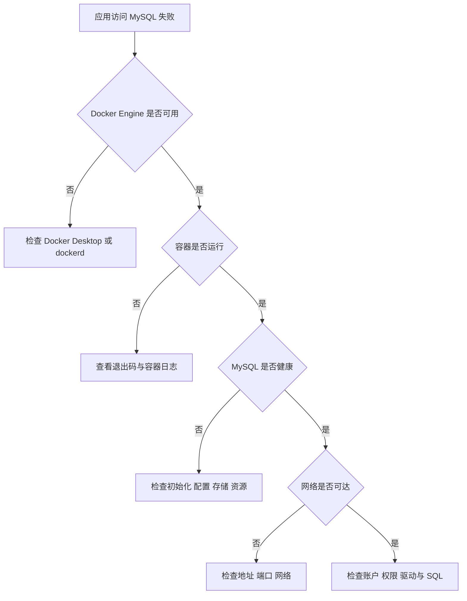

排查 MySQL 容器时，应先区分 Docker Engine、容器进程、MySQL 服务、网络、存储和应用连接六个层次。不要看到连接失败就删除卷，也不要看到容器退出就立刻更换镜像版本。

## 推荐排查顺序



先收集证据，再改变状态。删除容器、删除卷、修改权限和降级镜像都可能破坏现场。

## 第一组：确认 Docker Engine

```bash
docker version
docker info
docker context show
docker context ls
```

如果 `docker version` 只有 Client、没有 Server，问题还没有到 MySQL 层：

- Docker Desktop 可能尚未启动。
- Linux 上的 `docker.service` 可能停止。
- 当前 Docker context 可能指向错误或离线的远端 Engine。
- Shell 权限、socket 或环境变量可能指向另一套运行时。

先按对应平台的安装笔记恢复 Docker：[[Ubuntu 安装 Docker]]、[[macOS 安装 Docker Desktop]]、[[Windows 安装 Docker Desktop]] 或 [[WSL 2 中安装 Docker Engine]]。

## 第二组：确认容器状态

```bash
docker compose ps -a
docker compose logs --tail 200 db
docker inspect "$(docker compose ps -q db)" \
  --format 'status={{.State.Status}} exit={{.State.ExitCode}} error={{.State.Error}} oom={{.State.OOMKilled}}'
```

| 现象 | 优先检查 |
| --- | --- |
| `Created` 后未运行 | Compose 创建错误、依赖或启动命令 |
| `Exited (1)` | MySQL 日志中的配置、初始化、权限或版本错误 |
| 不断 `Restarting` | 重启策略掩盖了真实启动失败，应查看第一次错误 |
| `OOMKilled=true` | 容器或 Docker Desktop 内存不足 |
| `Up` 但连接失败 | 健康状态、初始化进度、网络和账户 |

不要只看 `docker ps` 的 `Up`。MySQL 第一次初始化期间，容器已经运行，但数据库可能尚未接受连接。

## 第三组：查看健康状态与日志

```bash
container_id="$(docker compose ps -q db)"

docker inspect "$container_id" \
  --format '{{json .State.Health}}'

docker compose logs --since 10m db
```

健康检查失败时，分别验证：

- 健康检查命令是否存在。
- Compose 中 `$` 是否正确写成 `$$` 后再传入容器。
- Secret 文件路径是否正确授予给服务。
- `start_period` 是否覆盖首次初始化时间。
- 检查的是 MySQL 响应，还是误把业务迁移完成也假设为健康。

常见日志关键词包括：

- `Access denied`
- `ready for connections`
- `Permission denied`
- `No space left on device`
- `unknown variable`
- `Data Dictionary initialization failed`
- `InnoDB`

保留错误前后的完整上下文，不要只复制最后一行。

## 第四组：检查端口与网络

### 宿主机连接

```bash
docker compose port db 3306
docker ps --format 'table {{.Names}}\t{{.Ports}}'
```

宿主机应连接 `127.0.0.1:<发布端口>`。

### 应用容器连接

应用应连接 Compose 服务名 `db:3306`。检查两个服务的网络：

```bash
docker inspect "$(docker compose ps -q app)" \
  --format '{{json .NetworkSettings.Networks}}'

docker inspect "$(docker compose ps -q db)" \
  --format '{{json .NetworkSettings.Networks}}'
```

如果应用容器中配置的是 `localhost:3306`，它正在连接应用容器自身。完整说明见 [[MySQL 容器网络与应用连接]]。

## 第五组：检查挂载与磁盘

```bash
docker inspect "$(docker compose ps -q db)" \
  --format '{{range .Mounts}}{{println .Type .Name .Source "->" .Destination}}{{end}}'

docker volume ls
docker system df
```

确认 `/var/lib/mysql` 挂载到预期卷。若 Compose 项目名或目录名改变，可能创建了新卷，表现为“数据消失”或初始化重新执行。

在 Linux 宿主机上还应检查：

```bash
df -h
df -i
```

磁盘块或 inode 用尽都会导致写入失败。不要在磁盘已满时直接删除未知卷或 MySQL 文件；先识别最大占用和可安全清理对象。

## 第六组：从 MySQL 内部检查

```bash
docker compose exec db mysql -u root -p
```

```sql
SELECT VERSION();
SELECT NOW(), @@global.time_zone, @@session.time_zone;
SHOW DATABASES;
SHOW PROCESSLIST;
SHOW VARIABLES LIKE 'character_set_server';
SHOW VARIABLES LIKE 'collation_server';
SHOW VARIABLES LIKE 'max_connections';
```

查看用户和授权时，避免把认证信息复制到公开日志：

```sql
SELECT USER(), CURRENT_USER();
SHOW GRANTS FOR CURRENT_USER();
```

业务查询慢、锁等待、连接耗尽和容器无法启动属于不同问题。MySQL 已健康但业务变慢时，应进一步使用慢查询日志、Performance Schema、执行计划和应用连接池指标，而不是重建容器。

## 常见故障

### 容器启动后立即退出

按以下顺序检查：

1. `docker compose logs db` 中的第一处错误。
2. root 初始化密码或 Secret 是否存在。
3. 自定义 `.cnf` 是否包含目标版本不支持的参数。
4. `/var/lib/mysql` 是否可写。
5. 数据目录是否来自不兼容的 MySQL 版本。
6. 磁盘空间和内存是否充足。

不要在唯一数据卷上反复切换多个 MySQL 版本尝试启动。

### 初始化脚本没有执行

最常见原因是数据卷已经包含数据库。运行：

```bash
docker compose volumes
docker volume ls
docker compose logs db
```

初始化脚本只在空数据目录首次启动时自动执行。保留数据时使用数据库迁移，允许清空的开发环境才在备份后删除卷。详见 [[MySQL 容器配置与初始化]]。

### 修改密码后仍然 `Access denied`

如果只是修改 Compose 的 `MYSQL_PASSWORD` 或 Secret 文件，旧卷中的 MySQL 账户不会自动改密。连接数据库后执行受控的 `ALTER USER`，再同步应用凭据。

同时确认应用连接的账户来源和实际授权：

```sql
SELECT USER(), CURRENT_USER();
SHOW GRANTS FOR CURRENT_USER();
```

### 端口 `3306` 被占用

```bash
docker ps --format 'table {{.Names}}\t{{.Ports}}'
```

在 macOS 或 Linux 上还可以检查宿主端口监听进程：

```bash
lsof -nP -iTCP:3306 -sTCP:LISTEN
```

如果宿主机已有 MySQL，改为发布 `127.0.0.1:3307:3306`。其他容器仍使用 `db:3306`。

### 容器被 OOM Kill

```bash
docker inspect "$(docker compose ps -q db)" \
  --format 'oom={{.State.OOMKilled}} exit={{.State.ExitCode}}'

docker stats --no-stream
```

检查 Docker Desktop 内存上限、Compose 内存限制、MySQL buffer 配置、并发连接和同机其他容器。不要只无限增加内存；先确认实际工作集和配置。

### 数据目录权限错误

命名卷通常由 Docker 和镜像入口脚本管理权限。Bind mount 更容易受到宿主目录所有者、SELinux、文件共享和 UID/GID 影响。

不要直接使用 `chmod -R 777`。先检查：

```bash
docker compose logs --tail 200 db
docker inspect "$(docker compose ps -q db)" \
  --format '{{json .Mounts}}'
```

然后根据宿主系统和镜像运行用户修复最小必要权限。

### Apple Silicon 上镜像架构问题

MySQL Official Image 支持 `amd64` 和 `arm64v8`。检查本机和镜像：

```bash
uname -m
docker image inspect mysql:8.4.10 \
  --format '{{.Os}}/{{.Architecture}}'
```

优先使用官方多架构镜像，不要长期依赖 `platform: linux/amd64` 模拟来掩盖不兼容的第三方镜像。

### 字符集或排序结果不一致

```sql
SHOW VARIABLES LIKE 'character_set%';
SHOW VARIABLES LIKE 'collation%';
SHOW CREATE DATABASE app_db;
SHOW CREATE TABLE <表名>;
```

服务器默认值、数据库默认值、表和列定义、连接字符集都可能不同。修改服务器启动参数不会自动转换已有列。

### 时间相差八小时

分别检查宿主机、容器、MySQL 全局与会话时区、应用连接参数和字段类型。不要仅通过挂载 `/etc/localtime` 解决所有时间语义问题。

## 日常维护清单

### 每次启动或配置变更后

- [ ] `docker compose config --quiet` 通过。
- [ ] `docker compose ps` 显示 MySQL 健康。
- [ ] 日志没有持续重复的错误或警告。
- [ ] 应用使用普通用户连接。
- [ ] `/var/lib/mysql` 挂载到预期卷。
- [ ] 端口仅暴露到所需接口。

### 定期检查

- [ ] 查看磁盘、卷和镜像占用。
- [ ] 查看容器内存、CPU 和重启次数。
- [ ] 检查备份任务是否真正生成有效文件。
- [ ] 将备份恢复到隔离环境并执行关键查询。
- [ ] 检查官方镜像和 MySQL 安全更新，但不自动跨版本升级。
- [ ] 检查慢查询、连接池、锁等待和容量趋势。
- [ ] 更新维护记录、恢复时间和责任人。

### 升级前

- [ ] 阅读 [[MySQL 容器备份恢复与版本升级]]。
- [ ] 确认官方支持的升级路径。
- [ ] 完成可恢复备份和应用兼容性测试。
- [ ] 保留独立回滚数据副本。
- [ ] 设定验收查询和停止升级的条件。

## 不要在未确认前执行的命令

```bash
docker compose down -v
docker volume prune
docker system prune --volumes
docker volume rm "$CONFIRMED_VOLUME_NAME"
rm -rf "$CONFIRMED_MYSQL_DATA_DIRECTORY"
```

这些命令可能永久删除 MySQL 数据。排障阶段优先收集 `ps`、`logs`、`inspect`、网络、挂载和磁盘信息。

## 相关笔记

- [[使用 Docker 运行 MySQL 概览]]
- [[使用 Docker Compose 编排 MySQL]]
- [[MySQL 容器配置与初始化]]
- [[MySQL 容器数据持久化]]
- [[MySQL 容器网络与应用连接]]
- [[MySQL 容器备份恢复与版本升级]]

## 官方参考资料

- [Docker：View container logs](https://docs.docker.com/engine/logging/)
- [Docker：docker container inspect](https://docs.docker.com/reference/cli/docker/container/inspect/)
- [Docker：Runtime metrics](https://docs.docker.com/engine/containers/runmetrics/)
- [Docker Hub：MySQL Official Image](https://hub.docker.com/_/mysql)
- [MySQL 8.4：Problems and Common Errors](https://dev.mysql.com/doc/refman/8.4/en/problems.html)
