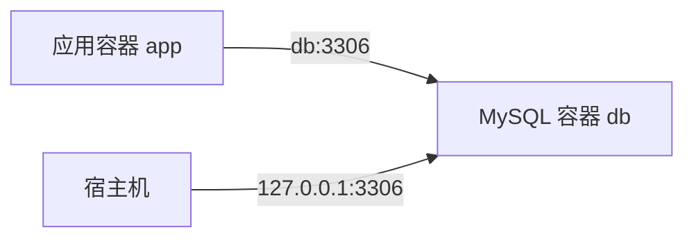

连接 MySQL 容器时，最容易混淆的是“命令从哪里发起”。宿主机、同一 Compose 网络中的应用容器、另一个 Docker 项目和远程主机使用的地址并不相同。

## 先判断连接发起位置

| 客户端位置 | MySQL 主机名 | 端口 | 是否需要发布端口 |
| --- | --- | --- | --- |
| MySQL 容器内部 | `localhost` | `3306` | 否 |
| 同一 Compose 网络的应用容器 | MySQL 服务名，例如 `db` | `3306` | 否 |
| Docker 宿主机 | `127.0.0.1` | 宿主机发布端口，例如 `3306` | 是 |
| 局域网或远程主机 | Docker 宿主机地址 | 对外发布端口 | 是，并需额外安全控制 |

> [!important] `localhost` 永远指当前网络命名空间
> 在应用容器中，`localhost` 指应用容器自身，不是 MySQL 容器，也不是宿主机。应用与 MySQL 位于同一 Compose 网络时，应连接 `db:3306`。

## Compose 默认网络

下面配置没有显式声明网络：

```yaml
services:
  app:
    image: example/app:1.0.0

  db:
    image: mysql:8.4.10
```

Compose 会为项目创建默认网络，并让两个服务加入该网络。服务名会成为可解析的 DNS 名称，因此 `app` 可以访问 `db:3306`。



查看网络：

```bash
docker compose ps
docker network ls
docker inspect "$(docker compose ps -q app)"
docker inspect "$(docker compose ps -q db)"
```

两个服务必须至少共享一个网络，才能通过服务名通信。

## 宿主机连接 MySQL

Compose 中发布端口：

```yaml
services:
  db:
    ports:
      - "127.0.0.1:3306:3306"
```

宿主机客户端连接：

```bash
mysql \
  --host=127.0.0.1 \
  --port=3306 \
  --user=app_user \
  --password \
  app_db
```

使用 `127.0.0.1` 可以明确走 TCP。部分 MySQL 客户端在使用 `localhost` 时可能优先尝试本地 Unix socket，而该 socket 不属于容器中的 MySQL。

如果宿主机端口改为 `3307`：

```yaml
ports:
  - "127.0.0.1:3307:3306"
```

宿主机连接 `127.0.0.1:3307`；其他容器仍连接 `db:3306`。端口映射不会修改 MySQL 在容器内监听的端口。

## 应用容器连接 MySQL

```yaml
services:
  app:
    image: example/app:1.0.0
    environment:
      DB_HOST: db
      DB_PORT: "3306"
      DB_NAME: app_db
      DB_USER: app_user
    depends_on:
      db:
        condition: service_healthy

  db:
    image: mysql:8.4.10
    healthcheck:
      test: ["CMD-SHELL", "mysqladmin ping -h localhost -u root -p\"$${MYSQL_ROOT_PASSWORD}\""]
      interval: 10s
      timeout: 5s
      retries: 10
      start_period: 30s
```

完整的 Secret 健康检查写法见 [[使用 Docker Compose 编排 MySQL]]。即使使用 `service_healthy`，应用仍应实现有限次数、带退避的连接重试，因为 MySQL 可能在应用运行后重启。

### Java JDBC 示例

```text
jdbc:mysql://db:3306/app_db?useUnicode=true&characterEncoding=utf8&serverTimezone=Asia/Shanghai
```

具体参数应与项目使用的 MySQL Connector/J 版本、数据库字符集和时间语义一致。不要为了消除时区报错而盲目复制连接参数。

### Go DSN 示例

```text
app_user:password@tcp(db:3306)/app_db?parseTime=true&loc=Asia%2FShanghai
```

真实密码不应直接写入源码或提交到 Compose 文件。应用应从 Secret、受保护的环境变量或组织的配置系统读取凭据，再构造连接配置。

## 不需要宿主机访问时不要发布端口

如果数据库只供同一 Compose 项目的应用容器使用：

```yaml
services:
  db:
    image: mysql:8.4.10
    # 不配置 ports
```

MySQL 仍可被共享网络中的容器访问，但宿主机不能通过 `127.0.0.1:3306` 直接连接。需要临时执行 SQL 时可以使用：

```bash
docker compose exec db mysql -u app_user -p app_db
```

`expose` 也不会把端口发布到宿主机。镜像声明的端口或 Compose 的 `expose` 主要描述容器网络可用端口；真正的宿主机发布由 `ports` 控制。

## 使用显式网络隔离服务

复杂项目可将数据库放在内部网络，同时让网关或前端只加入对外网络：

```yaml
services:
  app:
    image: example/app:1.0.0
    networks:
      - frontend
      - backend

  db:
    image: mysql:8.4.10
    networks:
      - backend

networks:
  frontend:
  backend:
    internal: true
```

此时 `app` 能访问 `db`，只加入 `frontend` 的其他服务不能访问数据库。`internal: true` 会限制该网络的外部连通性，但不能替代 MySQL 用户权限、Secret 和宿主机安全策略。

## 用户与权限

业务应用不应使用 root。初始化阶段可以用 `MYSQL_DATABASE`、`MYSQL_USER` 和 `MYSQL_PASSWORD` 创建单库用户；更复杂的权限应通过受控 SQL 管理。

连接后检查实际身份：

```sql
SELECT USER(), CURRENT_USER();
SHOW GRANTS FOR CURRENT_USER();
```

其中：

- `USER()` 反映客户端提供的用户和来源。
- `CURRENT_USER()` 反映 MySQL 实际用于权限检查的账户。

只授予应用必需的数据库和操作权限。管理、备份、迁移和监控可以使用职责不同的账户，不要共享一个高权限密码。

## 密码与 Secret

Compose 示例优先使用文件型 Secret：

```yaml
services:
  db:
    environment:
      MYSQL_PASSWORD_FILE: /run/secrets/mysql_app_password
    secrets:
      - mysql_app_password

secrets:
  mysql_app_password:
    file: ./secrets/mysql_app_password.txt
```

注意：

- 初始化变量只在空数据目录首次启动时创建账户。
- 更新 Secret 文件不会自动修改 MySQL 内已有用户密码。
- 改密时要同时更新数据库账户和应用配置，并设计短暂的切换窗口。
- 不要把密码放进 URL、日志、异常信息或 Shell 历史。

## 远程访问边界

将端口写成 `3306:3306` 或 `0.0.0.0:3306:3306`，可能在宿主机所有网络接口上监听。若确实需要远程连接，应同时处理：

- 宿主机防火墙和来源地址限制。
- MySQL 账户允许的来源主机和最小权限。
- TLS 加密和证书验证。
- 密码与证书的安全分发。
- 审计、失败登录监控和暴力破解防护。
- 云环境中的安全组、负载均衡和公网暴露策略。

本地开发默认保持 `127.0.0.1:3306:3306`。生产环境不应仅靠一个公开的 `3306` 端口和密码保护数据库。

## 连接排查顺序

### 1. MySQL 是否健康

```bash
docker compose ps
docker compose logs --tail 100 db
```

### 2. 客户端是否使用正确地址

- 宿主机：`127.0.0.1:<发布端口>`。
- 同网络容器：`db:3306`。
- 不要在应用容器中使用 `localhost` 代指 MySQL。

### 3. 服务是否共享网络

```bash
docker inspect "$(docker compose ps -q app)" --format '{{json .NetworkSettings.Networks}}'
docker inspect "$(docker compose ps -q db)" --format '{{json .NetworkSettings.Networks}}'
```

### 4. 端口是否正确发布

```bash
docker compose port db 3306
docker ps --format 'table {{.Names}}\t{{.Ports}}'
```

### 5. 用户与授权是否正确

从 MySQL 容器内先验证凭据，再检查 `SHOW GRANTS`。若容器内可以连接、应用仍失败，再检查应用驱动、连接串、TLS、字符集和时区参数。

## 常见问题

### `Connection refused`

常见原因是 MySQL 尚未完成初始化、地址写错、端口未发布或容器不在同一网络。先检查健康状态，不要先修改用户权限。

### `Access denied`

说明服务端通常已经可达，但账户、密码、来源主机或授权不匹配。修改 Compose 环境变量不会重置旧卷中的用户，详见 [[MySQL 容器配置与初始化]]。

### 宿主机可以连接，应用容器不能连接

应用很可能使用了 `127.0.0.1` 或宿主机发布端口。改成 Compose 服务名 `db` 和容器端口 `3306`，并确认共享网络。

### 应用偶尔在启动阶段连接失败

为 MySQL 添加健康检查和 `depends_on.condition: service_healthy`，同时让应用实现连接重试。只增加固定 `sleep` 会让快机器浪费时间、慢机器仍然失败。

## 相关笔记

- [[使用 Docker Compose 编排 MySQL]]
- [[MySQL 容器配置与初始化]]
- [[MySQL 容器数据持久化]]
- [[MySQL 容器日常维护与故障排查]]

## 官方参考资料

- [Docker：Networking in Compose](https://docs.docker.com/compose/how-tos/networking/)
- [Docker：Port publishing and mapping](https://docs.docker.com/get-started/docker-concepts/running-containers/publishing-ports/)
- [Docker：Compose service dependencies](https://docs.docker.com/reference/compose-file/services/#depends_on)
- [MySQL：Access Control and Account Management](https://dev.mysql.com/doc/refman/8.4/en/access-control.html)
