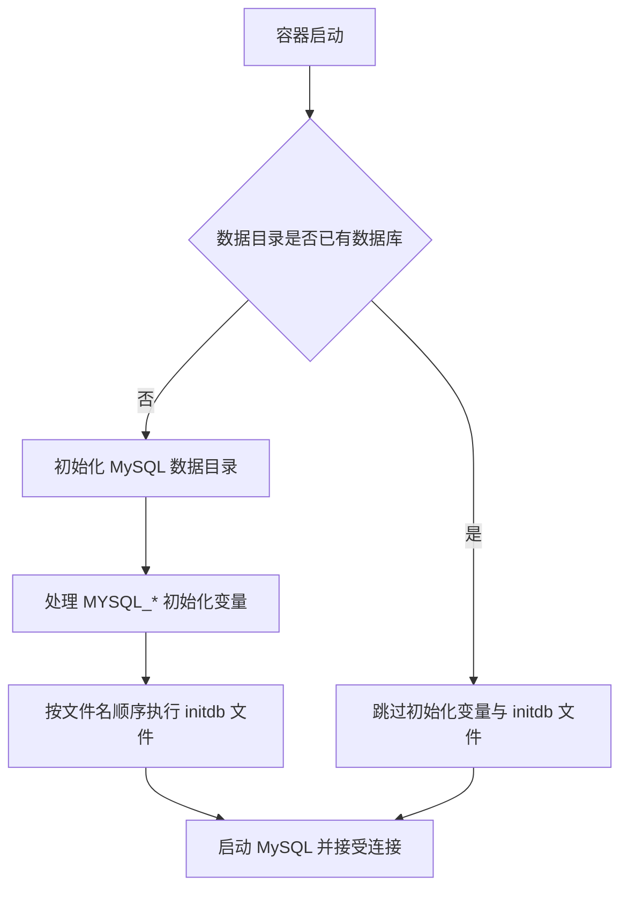

MySQL Official Image 提供三类主要配置入口：首次初始化环境变量、`/docker-entrypoint-initdb.d` 初始化文件，以及传给 `mysqld` 的运行时配置。三者发生在不同阶段，不能互相替代。

> [!important] 最关键的规则
> 当 `/var/lib/mysql` 已经包含数据库时，镜像会保留现有数据。修改 `MYSQL_ROOT_PASSWORD`、`MYSQL_DATABASE`、`MYSQL_USER` 或 `MYSQL_PASSWORD` 不会重置旧库、旧用户或旧密码。

## 初始化与启动过程



因此，同一份 Compose 配置在“新卷”和“旧卷”上可能表现不同。排查初始化问题时，必须先确认实际挂载的数据卷。

## 常用初始化环境变量

| 变量 | 是否必需 | 首次初始化时的作用 |
| --- | --- | --- |
| `MYSQL_ROOT_PASSWORD` | 通常必需 | 设置 root 账户密码 |
| `MYSQL_DATABASE` | 可选 | 创建指定数据库 |
| `MYSQL_USER` | 与 `MYSQL_PASSWORD` 成对 | 创建普通用户 |
| `MYSQL_PASSWORD` | 与 `MYSQL_USER` 成对 | 设置普通用户密码，并授权到 `MYSQL_DATABASE` |
| `MYSQL_RANDOM_ROOT_PASSWORD` | 可选 | 生成随机 root 初始密码并输出到日志 |
| `MYSQL_ONETIME_PASSWORD` | 可选 | 将 root 密码标记为首次登录后必须修改 |
| `MYSQL_ALLOW_EMPTY_PASSWORD` | 不推荐 | 允许 root 空密码，风险极高 |
| `MYSQL_INITDB_SKIP_TZINFO` | 可选 | 跳过时区表加载 |

不要将 `MYSQL_USER` 设置为 `root`。root 账户由镜像入口脚本单独管理，业务应用应使用普通用户。

### 使用 `_FILE` 读取敏感值

支持的初始化变量可以改成 `_FILE` 形式，例如：

```yaml
environment:
  MYSQL_ROOT_PASSWORD_FILE: /run/secrets/mysql_root_password
  MYSQL_DATABASE: app_db
  MYSQL_USER: app_user
  MYSQL_PASSWORD_FILE: /run/secrets/mysql_app_password
```

MySQL Official Image 当前支持 `MYSQL_ROOT_PASSWORD`、`MYSQL_ROOT_HOST`、`MYSQL_DATABASE`、`MYSQL_USER` 和 `MYSQL_PASSWORD` 的 `_FILE` 形式。Compose Secret 示例见 [[使用 Docker Compose 编排 MySQL]]。

## 初始化文件目录

空数据目录首次初始化时，镜像会读取 `/docker-entrypoint-initdb.d`，并按文件名的字典顺序处理支持的文件。

常见支持类型包括：

- `.sh`
- `.sql`
- `.sql.gz`
- `.sql.bz2`
- `.sql.xz`
- `.sql.zst`

推荐显式编号：

```text
initdb/
├── 001-schema.sql
├── 010-reference-data.sql
└── 020-development-data.sql
```

在 Compose 中只读挂载：

```yaml
services:
  db:
    volumes:
      - ./initdb:/docker-entrypoint-initdb.d:ro
```

### 示例初始化 SQL

```sql
CREATE TABLE IF NOT EXISTS app_db.product_category (
    id BIGINT PRIMARY KEY AUTO_INCREMENT,
    code VARCHAR(50) NOT NULL UNIQUE,
    name VARCHAR(100) NOT NULL
);

INSERT IGNORE INTO app_db.product_category (code, name)
VALUES ('DEFAULT', '默认分类');
```

使用 `IF NOT EXISTS`、唯一键和可重复执行的写法，可以降低脚本被人工再次执行时的风险。不过入口脚本本身仍只保证在首次初始化阶段自动执行一次。

## 初始化脚本与数据库迁移的边界

| 需求 | 推荐机制 |
| --- | --- |
| 为一次性本地实验创建初始表 | `docker-entrypoint-initdb.d` |
| 导入固定的演示或测试数据 | 初始化 SQL，且保持幂等 |
| 随应用版本持续演进表结构 | Flyway、Liquibase、Goose 等迁移工具 |
| 修改已有生产数据库 | 经过评审、备份和回滚设计的迁移流程 |
| 修改旧库用户密码 | 连接 MySQL 后执行受控的账户管理 SQL |

不要把业务迁移完全依赖在初始化目录上。只要数据卷存在，后续发布的新初始化脚本就不会自动执行。

## 使用自定义 MySQL 配置

### 通过 `mysqld` 参数覆盖

MySQL Official Image 会把镜像名之后的参数传给 `mysqld`。例如：

```yaml
services:
  db:
    image: mysql:8.4.10
    command:
      - --character-set-server=utf8mb4
      - --collation-server=utf8mb4_0900_ai_ci
```

适合少量、清晰的参数。查看当前镜像支持的完整参数：

```bash
docker run --rm mysql:8.4.10 --verbose --help
```

### 挂载 `.cnf` 文件

建立 `mysql-config/custom.cnf`：

```ini
[mysqld]
character-set-server=utf8mb4
collation-server=utf8mb4_0900_ai_ci
default-time-zone=+08:00
```

在 Compose 中挂载整个配置目录：

```yaml
services:
  db:
    volumes:
      - ./mysql-config:/etc/mysql/conf.d:ro
```

MySQL 镜像的基础系统可能不同，主配置文件位置也可能不同；官方镜像会从 `/etc/mysql/conf.d` 等包含目录加载附加配置。修改后应从运行中的服务确认实际值，而不是只检查宿主机文件。

```sql
SHOW VARIABLES LIKE 'character_set_server';
SHOW VARIABLES LIKE 'collation_server';
SHOW VARIABLES LIKE 'time_zone';
```

## 字符集、排序规则与时区

### 字符集

新项目通常使用 `utf8mb4`。排序规则会影响比较、排序、大小写和重音处理，应根据 MySQL 版本和业务规则选择，不要只因为复制了旧项目配置就沿用旧排序规则。

数据库或表已经创建后，修改服务器默认值不会自动转换已有列。已有数据的字符集迁移必须单独设计和验证。

### 时区

需要区分：

- 容器操作系统时区。
- MySQL `system_time_zone`。
- MySQL 会话或全局 `time_zone`。
- 应用连接设置的时区。
- 数据字段保存的是绝对时间、当地时间还是业务日期。

不要只挂载 `/etc/localtime` 就认为所有时间语义已经统一。应用、数据库会话和字段类型仍需明确约定。

## 如何重新初始化开发数据库

### 允许丢弃全部数据时

1. 确认这是本地或可重建环境。
2. 按 [[MySQL 容器备份恢复与版本升级]] 导出需要的数据。
3. 明确当前 Compose 项目和卷名。
4. 删除旧卷。
5. 重新启动并观察完整初始化日志。

```bash
docker compose down -v
docker compose up -d
docker compose logs -f db
```

> [!danger] `down -v` 会删除数据
> 它不是“让 SQL 再运行一次”的无害开关。执行前必须确认没有误删其他环境数据的可能。

### 必须保留数据时

不要删除卷。将变更写成显式迁移，通过应用的迁移工具或受控 SQL 执行，并记录版本、备份、验证与回滚步骤。

## 验证初始化结果

```bash
docker compose ps
docker compose logs --tail 200 db
docker compose exec db mysql -u app_user -p app_db
```

```sql
SELECT VERSION();
SELECT CURRENT_USER();
SHOW CREATE DATABASE app_db;
SHOW TABLES;
```

同时检查实际挂载：

```bash
docker inspect \
  --format '{{json .Mounts}}' \
  "$(docker compose ps -q db)"
```

如果脚本没有执行，优先确认是否复用了旧卷，而不是反复修改文件名或重启容器。

## 常见问题

### 修改密码文件后仍然使用旧密码

密码文件只参与空数据目录的首次初始化。已有数据库应通过 `ALTER USER` 修改账户密码，并同步更新应用 Secret。

### 初始化 SQL 执行到一半失败

查看首次初始化日志，定位具体 SQL。不要假设入口脚本会把所有已执行操作完整回滚。对开发环境可以修复脚本后清理卷并重新初始化；对需要保留的数据，应评估已执行语句和当前数据库状态。

### 自定义配置导致容器无法启动

先查看日志，再用当前镜像验证配置项是否存在：

```bash
docker compose logs --tail 200 db
docker run --rm mysql:8.4.10 --verbose --help
```

将新配置分批加入，避免一次修改多个与内存、字符集、日志或复制相关的选项。

## 相关笔记

- [[使用 Docker Compose 编排 MySQL]]
- [[MySQL 容器数据持久化]]
- [[MySQL 容器网络与应用连接]]
- [[MySQL 容器日常维护与故障排查]]

## 官方参考资料

- [Docker Hub：MySQL Official Image](https://hub.docker.com/_/mysql)
- [Docker：Compose Secrets](https://docs.docker.com/reference/compose-file/secrets/)
- [MySQL：Server System Variables](https://dev.mysql.com/doc/refman/8.4/en/server-system-variables.html)
- [MySQL：Character Sets and Collations](https://dev.mysql.com/doc/refman/8.4/en/charset.html)
