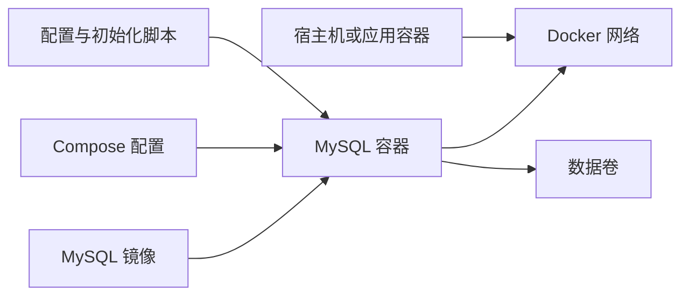

使用 Docker 运行 MySQL，核心并不是记住一条 `docker run` 命令，而是理解镜像、容器、端口、网络、配置和数据卷如何共同组成一个可重复创建、可连接、可维护的数据库环境。

本文是整个专题的入口，面向本地开发、自动化测试、学习实验和单机部署场景。尚未安装 Docker 时，先根据宿主系统完成 [[Docker 安装概览]] 中的安装与验证。

> [!important] 先明确生产环境边界
> Docker 可以稳定运行 MySQL，但“放进容器”不会自动获得高可用、异地备份、故障切换、监控告警和容量规划。生产数据库仍需要独立的数据保护、升级、恢复演练和运维方案。本文提供的示例以本地开发和受控的单机环境为主，不能直接替代生产架构设计。

## 学完后能够做什么

- 使用明确版本的 MySQL 官方镜像启动数据库。
- 从宿主机或其他容器连接 MySQL。
- 使用 Docker Compose 保存和复用运行配置。
- 使用命名卷持久化 `/var/lib/mysql` 中的数据。
- 使用初始化脚本创建数据库结构和基础数据。
- 区分初始化变量、运行时配置与业务迁移脚本。
- 备份、恢复并验证 MySQL 数据。
- 在升级镜像前识别版本路径和数据风险。
- 根据容器日志、健康状态、网络和存储信息排查问题。

## 六个核心对象

| 对象 | 作用 | MySQL 场景中的例子 |
| --- | --- | --- |
| 镜像 | 只读运行模板 | `mysql:8.4.10` |
| 容器 | 镜像的一次运行实例 | `dev-mysql` |
| 端口发布 | 让宿主机访问容器端口 | `127.0.0.1:3306:3306` |
| 网络 | 让容器按服务名互相发现 | 应用连接 `db:3306` |
| 数据卷 | 让数据独立于容器生命周期 | 挂载到 `/var/lib/mysql` |
| Compose | 声明并统一管理上述配置 | `compose.yaml` |

容器可以删除和重建，数据库数据则应存放在容器外部的数据卷中。只要新容器仍挂载同一个兼容的数据卷，数据就不会因为旧容器被删除而自动消失。

## 镜像版本选择

Docker Hub 上的 `mysql` 是 Docker Official Image，由 Docker 社区与 MySQL 团队共同维护。本文示例固定使用 `mysql:8.4.10`，这是编写本文时官方提供的明确版本标签。

| 标签形式 | 示例 | 特点 | 适用场景 |
| --- | --- | --- | --- |
| 精确补丁版本 | `mysql:8.4.10` | 重建时版本可预期 | 教程复现、测试和需要稳定基线的项目 |
| 系列版本 | `mysql:8.4` | 拉取时可能获得该系列的新补丁 | 已建立升级验证流程的项目 |
| 浮动标签 | `mysql:latest` | 可能跨越系列或重大版本 | 不建议作为数据库的长期默认值 |

> [!warning] 镜像标签不是升级方案
> 修改标签并重建容器，只是更换了 MySQL 二进制版本。数据字典、系统表、配置兼容性和应用兼容性仍需按 MySQL 官方升级路径检查。升级前必须阅读 [[MySQL 容器备份恢复与版本升级]]。

## `docker run` 与 Docker Compose 如何选择

### 使用 `docker run`

适合：

- 第一次理解参数如何映射到容器。
- 临时验证一个 MySQL 版本。
- 创建短生命周期的实验数据库。
- 排查 Compose 之外的镜像问题。

从 [[使用 docker run 启动 MySQL]] 开始，可以直观看到镜像、环境变量、端口和数据卷如何组合。

### 使用 Docker Compose

适合：

- 项目需要稳定复现数据库环境。
- 需要同时运行应用、MySQL、Redis 等服务。
- 需要保存健康检查、网络、数据卷和初始化脚本配置。
- 团队成员需要通过同一组命令启动环境。

日常项目优先阅读 [[使用 Docker Compose 编排 MySQL]]。Compose 并没有替代 Docker Engine，而是把多条运行参数写进可审查、可复用的 YAML 文件。

## 推荐学习顺序

1. [[使用 docker run 启动 MySQL]]：掌握单个 MySQL 容器的完整生命周期。
2. [[使用 Docker Compose 编排 MySQL]]：建立适合项目使用的声明式配置。
3. [[MySQL 容器配置与初始化]]：理解环境变量、配置文件和首次初始化脚本。
4. [[MySQL 容器数据持久化]]：确认删除容器后数据仍能保留，并识别危险清理命令。
5. [[MySQL 容器网络与应用连接]]：掌握宿主机连接与容器间连接的地址差异。
6. [[MySQL 容器备份恢复与版本升级]]：完成可验证的数据保护和升级准备。
7. [[MySQL 容器日常维护与故障排查]]：按日志、状态、网络、存储和资源顺序排查。

## 本地开发的推荐基线

一个可维护的本地 MySQL 环境至少应满足：

- 使用官方镜像和明确版本标签。
- 使用普通应用用户，不让业务长期使用 `root`。
- 使用命名卷持久化数据。
- 只向本机发布端口，例如 `127.0.0.1:3306:3306`。
- 使用健康检查判断服务是否开始响应。
- 密码不提交到 Git 仓库。
- 初始化脚本保持幂等，并与业务数据库迁移职责分离。
- 删除数据卷前先备份，并实际验证恢复结果。

## 常见误区速查

| 误区 | 实际情况 |
| --- | --- |
| 删除容器一定会删除数据库 | 使用命名卷时，容器和卷具有独立生命周期 |
| 修改 `MYSQL_ROOT_PASSWORD` 就能重置旧库密码 | 初始化变量对已有数据库目录通常不再生效 |
| 应用容器连接 `localhost:3306` | `localhost` 指应用容器自身，应连接 Compose 服务名，例如 `db:3306` |
| `depends_on` 表示 MySQL 已可执行 SQL | 短语法只控制启动顺序，应结合健康检查和应用重试 |
| 使用 `latest` 就等于自动安全升级 | 浮动标签可能带来未经验证的版本变化 |
| 复制 Docker Volume 目录就是可靠备份 | 运行中的数据库需要数据库一致性；优先使用 MySQL 备份工具并验证恢复 |

## 官方参考资料

- [Docker：使用容器化数据库](https://docs.docker.com/guides/databases/)
- [Docker Hub：MySQL Official Image](https://hub.docker.com/_/mysql)
- [Docker：Volumes](https://docs.docker.com/engine/storage/volumes/)
- [MySQL 8.4 Reference Manual](https://dev.mysql.com/doc/refman/8.4/en/)
