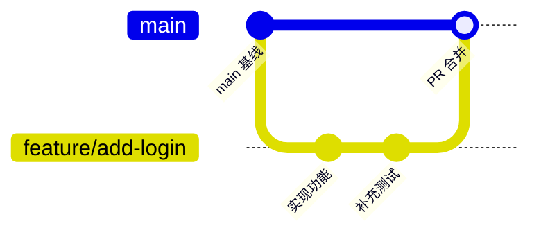

适用于日常功能开发：从最新的 `main` 切出一个短生命周期分支，完成开发和验证后提交 Pull Request（PR），经检查和评审后合并回 `main`。本文假定远程仓库名为 `origin`、主分支名为 `main`；如果项目不同，请替换命令中的名称。



## 一览

| 阶段 | 目标 | 关键动作 |
| --- | --- | --- |
| 准备 | 确认本地工作区安全且主线最新 | `git status`、`git fetch`、`git pull --ff-only` |
| 开发 | 从主线隔离地实现一个需求 | `git switch -c`、小步提交、运行检查 |
| 同步 | 降低与 `main` 的合并冲突 | 开发期间定期 rebase 或 merge `origin/main` |
| 提 PR | 让改动可审阅、可验证 | 推送分支、填写 PR 描述、等待 CI/评审 |
| 合并与清理 | 安全回到主线并删除短期分支 | 合并 PR、更新本地 `main`、删除已合并分支 |

## 0. 先确认仓库状态

在任何切分支、拉取或 rebase 前，先查看当前分支及工作区：

```bash
git status
git branch --show-current
git remote -v
```

理想状态是 `git status` 显示 *working tree clean*。若有尚未提交的改动，先判断它们是否属于当前工作：

- 属于当前工作：提交到当前分支，或至少先暂存；不要把不相关改动带入新功能分支。
- 暂时不想提交：使用 `git stash push -u -m "wip: <说明>"` 保存（`-u` 会一并保存未跟踪文件）。之后可通过 `git stash list` 查看，用 `git stash pop` 恢复。
- 不确定改动来源：先用 `git diff` 和 `git diff --staged` 查看；不要直接执行会丢弃内容的命令。

> [!warning] 不要用强制命令掩盖问题
> `git reset --hard` 会丢弃未提交修改；`git push --force` 可能覆盖远程历史。在明确理解影响前，不应把它们作为“解决报错”的默认手段。

## 1. 将本地 main 更新到远程最新版本

先获取远程引用，再切换到本地 `main` 并以快进方式更新：

```bash
git fetch origin
git switch main
git pull --ff-only origin main
```

`git pull --ff-only` 只允许快进更新：当本地 `main` 意外出现未推送提交时，它会停止而不是自动创建一次合并提交。此时先确认本地提交的来源和去向，不要强行继续。

可用下列命令确认本地 `main` 与远程一致：

```bash
git status
git log --oneline -5
git log --oneline main..origin/main
git log --oneline origin/main..main
```

后两条命令均无输出时，说明两者没有各自独有的提交。

## 2. 从最新 main 创建功能分支

分支名应表达改动类型和主题，通常使用小写英文及短横线。例如：

| 类型 | 分支示例 | 适用场景 |
| --- | --- | --- |
| `feature/` | `feature/user-login` | 新功能 |
| `fix/` | `fix/order-total-rounding` | 缺陷修复 |
| `refactor/` | `refactor/cache-client` | 不改变外部行为的重构 |
| `docs/` | `docs/api-authentication` | 文档改动 |
| `chore/` | `chore/upgrade-go-version` | 构建、依赖或杂项维护 |

从已更新的 `main` 创建并切换分支：

```bash
git switch -c feature/<简短主题>
```

也可以显式指定远程主线作为起点，特别适用于本地没有 `main` 或不确定其是否最新时：

```bash
git fetch origin
git switch -c feature/<简短主题> origin/main
```

旧版 Git 没有 `git switch` 时，可使用等价命令：

```bash
git checkout -b feature/<简短主题> origin/main
```

创建后立即核对起点和当前分支：

```bash
git branch --show-current
git status
git log --oneline --decorate -3
```

## 3. 开发、检查并进行小而清晰的提交

只在该功能分支上修改与当前需求相关的文件。完成一个可独立理解的小单元后，按下面的节奏提交：

```bash
git status
git diff
git add <文件或目录>
git diff --staged
git commit -m "feat: add <功能描述>"
```

`git add` 尽量指定文件或目录，避免习惯性使用 `git add .` 将日志、IDE 配置或其他无关文件混入提交。提交前至少检查：

```bash
git diff --check
git status
```

`git diff --check` 可发现行尾空格等常见格式问题。然后运行本项目约定的格式化、静态检查和测试命令，例如：

```bash
# 按项目实际技术栈选择命令；以下仅为示例
npm test
go test ./...
mvn test
```

### 提交信息建议

推荐使用“类型: 简短祈使描述”的风格，标题尽量在一行内说明结果：

```text
feat: add email login endpoint
fix: handle empty order items
refactor: extract token validation service
test: cover expired refresh token
docs: explain local startup steps
```

一次提交最好只承载一个可说明、可回滚的意图。若一次开发产生了代码、测试和文档，可以视项目习惯将它们拆分；但测试若只为支撑同一次行为变更，也可以与实现一起提交。

## 4. 开发期间同步 main

当开发持续较久、`main` 变化频繁，或提 PR 前，先将功能分支同步到最新主线。先获取远程状态：

```bash
git fetch origin
git log --oneline HEAD..origin/main
```

第二条命令有输出时，表示 `main` 出现了本分支尚未包含的新提交。团队若偏好线性历史，可在功能分支上 rebase：

```bash
git rebase origin/main
```

若发生冲突，按以下流程处理：

```bash
git status
# 手工编辑冲突文件，移除 <<<<<<<、=======、>>>>>>> 标记并保留正确内容
git add <已解决的文件>
git rebase --continue
```

如需放弃本次同步并恢复到 rebase 前：

```bash
git rebase --abort
```

如果该分支已经推送过，rebase 会改写该分支的提交 ID。确认它是自己负责的功能分支后，使用带保护的强推：

```bash
git push --force-with-lease
```

不要用裸 `git push --force`。`--force-with-lease` 会在远程分支出现自己未获取的新提交时拒绝推送，减少覆盖同事工作的风险。

> [!tip] rebase 还是 merge？
> 若团队规定 PR 保持线性历史，使用 rebase；若团队明确保留合并节点或该分支由多人共同维护，使用 `git merge origin/main` 并正常推送更稳妥。始终以仓库的 CONTRIBUTING 文档和团队约定为准。

## 5. 推送分支并创建 PR

首次推送时加 `-u`，建立本地分支与远程分支的跟踪关系：

```bash
git push -u origin feature/<简短主题>
```

后续推送通常只需：

```bash
git push
```

创建 PR 前，核对“将要合入 main 的实际内容”，不要只看最后一次提交：

```bash
git log --oneline origin/main..HEAD
git diff --stat origin/main...HEAD
git diff --check origin/main...HEAD
```

在 GitHub/GitLab 网页中创建 PR，或使用 GitHub CLI：

```bash
gh pr create --base main --head feature/<简短主题> --fill
```

PR 至少应包含以下信息：

| 项目 | 要写清楚的内容 |
| --- | --- |
| 改动目的 | 解决什么问题、面向谁、预期行为是什么 |
| 实现概要 | 关键设计或主要改动点；避免逐行复述代码 |
| 验证方式 | 运行过哪些测试、手工验证了什么、结果如何 |
| 风险与影响 | 数据迁移、配置变更、兼容性、发布或回滚要求 |
| 关联事项 | 需求、Issue、设计文档或相关 PR 的链接 |

如果 PR 尚未准备好评审，可先标为 Draft；准备好后再请求审阅。评审意见修改后，提交并推送到同一分支，PR 会自动更新：

```bash
git add <文件>
git commit -m "fix: address review feedback"
git push
```

## 6. 合并前的最后检查

在点击合并前确认：

- PR 的目标分支是 `main`，源分支是当前功能分支。
- 自动化检查（CI）全部通过，或每个例外都有明确且被认可的原因。
- 所有需要的评审已完成，未解决评论已处理。
- 分支已同步近期的 `main`，且没有未处理的冲突。
- PR 描述与最终代码一致，包含必要的测试和发布说明。

仓库可能允许 Merge commit、Squash merge 或 Rebase merge。除非团队另有规定，优先选择项目既有的默认策略：

| 合并方式 | 结果 | 常见适用情况 |
| --- | --- | --- |
| Merge commit | 保留该分支的全部提交和一个合并节点 | 希望完整保留分支历史 |
| Squash merge | 将 PR 压成 `main` 上的一个提交 | 小而独立的功能，主线希望简洁 |
| Rebase merge | 将分支提交线性地接到 `main` 后 | 要求线性历史且提交质量较高 |

通过网页完成合并最直观。若已获得合并权限，也可使用 GitHub CLI（请先确认 PR 编号和策略）：

```bash
gh pr merge <PR 编号> --merge --delete-branch
```

上例使用 merge commit；如团队要求 squash，可改用 `--squash`。`--delete-branch` 会删除远程功能分支，只有在确认合并成功且分支不再需要时才使用。

## 7. PR 合并后的本地清理

PR 已合并后，不要继续在旧功能分支上开发。更新本地 `main` 并删除已合并的本地分支：

```bash
git switch main
git pull --ff-only origin main
git branch -d feature/<简短主题>
git fetch --prune origin
```

`git branch -d` 只会删除已被合并的本地分支，因此比 `-D` 更安全。若它拒绝删除，先确认该分支的提交是否已经真正进入 `main`，而不是直接强删。

最后检查状态：

```bash
git status
git branch -vv
```

## 可直接复用的最短流程

下面是一条常规功能开发的最短命令路径。执行前仍应先理解每条命令，并把占位内容替换为实际分支名和项目检查命令：

```bash
# 1. 以最新 main 为起点
git status
git fetch origin
git switch main
git pull --ff-only origin main
git switch -c feature/<简短主题>

# 2. 开发后提交
git add <文件>
git diff --staged
git commit -m "feat: <功能描述>"
git diff --check
# 运行项目测试/检查

# 3. 推送并提 PR
git push -u origin feature/<简短主题>
gh pr create --base main --head feature/<简短主题> --fill

# 4. PR 合并后清理
git switch main
git pull --ff-only origin main
git branch -d feature/<简短主题>
git fetch --prune origin
```

## 常见问题

### `git pull --ff-only` 失败怎么办？

这通常表示本地 `main` 有远程没有的提交，或本地与远程历史发生分叉。先查看差异：

```bash
git log --oneline origin/main..main
git log --oneline main..origin/main
```

确认本地提交是否应保留、推送到其他分支或由维护者处理后，再决定下一步。不要为了“拉下来”而在 `main` 上随意 rebase、merge 或强推。

### 推送时被拒绝怎么办？

先执行 `git fetch origin`，再用 `git log --oneline HEAD..origin/<分支名>` 确认远程是否新增了提交。若分支由多人协作，应先沟通并整合改动；若是自己独自维护且刚完成 rebase，则使用 `git push --force-with-lease`。

### rebase 冲突解决后，为什么还不能继续？

每个冲突文件必须编辑完成并执行 `git add <文件>`，之后才能运行 `git rebase --continue`。使用 `git status` 可以看到尚未解决的文件和 Git 建议的下一步。

### PR 合并后，为什么本地还看到远程分支？

本地保存的是上次获取到的远程引用。运行 `git fetch --prune origin` 会清理远程已经删除的分支引用；之后可用 `git branch -r` 查看。

## 习惯清单

- 从 `main` 创建前，先更新 `main`。
- 一个分支只做一个可描述的目标，避免“顺手”夹带无关改动。
- 提交前审阅暂存区，提 PR 前审阅整个 `origin/main...HEAD` 差异。
- 开发较久时主动同步 `main`，在自己分支上尽早处理冲突。
- 已推送分支若 rebase，只使用 `git push --force-with-lease`。
- 合并后更新本地 `main`，再删除已经合并的短生命周期分支。
