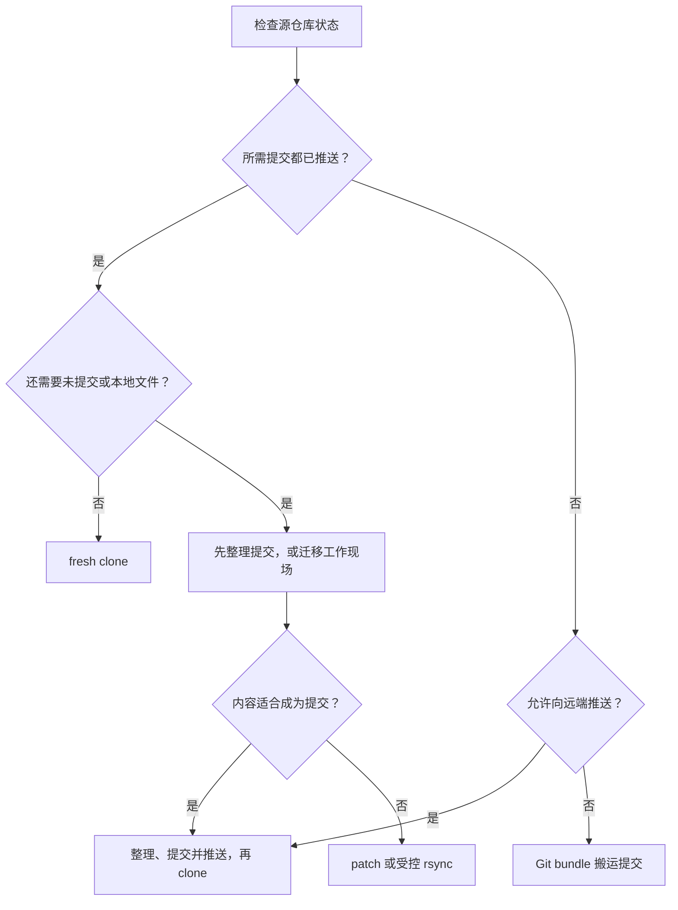

把 Git 项目迁移到另一台机器之前，先回答一个问题：**需要迁移的是远端已经保存的提交，还是当前机器上的完整工作现场？**

`git clone` 只会复制远端仓库可达的提交和引用。未推送提交、未提交修改、未跟踪文件、被忽略文件和仓库本地配置，都不会凭空出现在新机器上。迁移方法必须由源仓库的真实状态决定，不能只看“目录里文件似乎都在”。

本文讲通用迁移方法。某个项目的目标目录、版本约束和质量门禁，应记录在对应工程实践笔记中。

## 1. 先认识需要迁移的四层内容

| 内容层 | 典型内容 | `git clone` 是否包含 |
| --- | --- | --- |
| 已推送提交 | 远端分支、标签及其历史 | 是 |
| 未推送提交 | 只存在于本地分支的 commit | 否 |
| 工作区与暂存区修改 | 已修改、已暂存但未 commit 的内容 | 否 |
| Git 之外的本地内容 | 未跟踪文件、被忽略配置、缓存、密钥、IDE 状态 | 否 |

`.gitignore` 只能决定文件是否默认参与 Git 跟踪，不是备份策略。尤其不要假设 `.env`、私钥、数据库文件或本地工具配置会跟随仓库迁移。

## 2. 在源机器建立只读事实快照

**执行位置：源机器（任意目录）**

```bash
printf '请输入源仓库绝对路径：'
IFS= read -r SOURCE_REPO

if ! git -C "$SOURCE_REPO" rev-parse --is-inside-work-tree >/dev/null 2>&1; then
  printf '停止：不是可访问的 Git 工作树：%s\n' "$SOURCE_REPO" >&2
  exit 1
fi

git -C "$SOURCE_REPO" status --short --branch
git -C "$SOURCE_REPO" branch --show-current
git -C "$SOURCE_REPO" remote -v
git -C "$SOURCE_REPO" rev-parse HEAD
git -C "$SOURCE_REPO" branch -vv
git -C "$SOURCE_REPO" diff --check
git -C "$SOURCE_REPO" ls-files --others --exclude-standard
```

这一步解决的是“迁移方案选择”，不会修改仓库。重点观察：

- 当前分支是否为空；detached HEAD 不能被误记成普通分支。
- 工作区是否有 `M`、`A`、`D`、`??` 等状态。
- `origin` 是否指向预期仓库。
- 当前提交是否已有上游分支。
- 是否存在未跟踪文件。

如果当前分支配置了上游，再核对领先和落后数量。

**执行位置：源机器（任意目录，沿用上一代码块变量）**

```bash
if git -C "$SOURCE_REPO" rev-parse '@{upstream}' >/dev/null 2>&1; then
  git -C "$SOURCE_REPO" rev-parse '@{upstream}'
  git -C "$SOURCE_REPO" rev-list --left-right --count '@{upstream}...HEAD'
else
  printf '%s\n' '当前分支没有配置上游；请根据 branch -vv 和团队约定判断。'
fi
```

对 `上游...HEAD` 而言，输出左侧是上游独有提交数，右侧是本地独有提交数。不要在不知道分支语义时随意设置上游。

## 3. 迁移路线决策



推荐优先级：

1. 能整理为正常提交并推送时，优先 `commit + push + clone`。
2. 不能推送但要完整保留提交历史时，使用 Git bundle。
3. 只迁移可审查的文本修改时，使用 patch。
4. 必须保留 `.git`、未跟踪文件和完整现场时，使用受控 `rsync`，并先复制到暂存目录。

## 4. 情况一：已提交并推送后 fresh clone

### 4.1 在源机器记录身份

**执行位置：源机器（任意目录）**

```bash
printf '请输入源仓库绝对路径：'
IFS= read -r SOURCE_REPO

REPO_URL="$(git -C "$SOURCE_REPO" remote get-url origin)"
BRANCH_NAME="$(git -C "$SOURCE_REPO" branch --show-current)"
EXPECTED_SHA="$(git -C "$SOURCE_REPO" rev-parse HEAD)"

if [ -z "$BRANCH_NAME" ]; then
  printf '%s\n' '停止：当前处于 detached HEAD，请先明确要迁移的分支。' >&2
  exit 1
fi

git -C "$SOURCE_REPO" status --short --branch
printf 'repo_url=%s\nbranch=%s\nsha=%s\n' \
  "$REPO_URL" "$BRANCH_NAME" "$EXPECTED_SHA"
```

只有当所需提交已存在于该远端，且不需要额外工作区内容时，才进入 clone。

### 4.2 在目标机器 clone 到不存在的目录

**执行位置：目标机器（任意目录）**

```bash
printf '请输入已核对的远程地址：'
IFS= read -r REPO_URL
printf '请输入要检出的分支：'
IFS= read -r BRANCH_NAME
printf '请输入目标项目目录名：'
IFS= read -r PROJECT_NAME

case "$PROJECT_NAME" in
  ''|.|..|*[!A-Za-z0-9._-]*)
    printf '%s\n' '停止：项目目录名格式不符合本文保护规则。' >&2
    exit 1
    ;;
esac

TARGET_REPO="$HOME/src/$PROJECT_NAME"
mkdir -p "$HOME/src"

if [ -e "$TARGET_REPO" ]; then
  printf '停止：目标已经存在：%s\n' "$TARGET_REPO" >&2
  exit 1
fi

git clone --branch "$BRANCH_NAME" --single-branch "$REPO_URL" "$TARGET_REPO"
```

### 4.3 核对 clone 结果

**执行位置：目标机器（任意目录）**

```bash
printf '请输入目标项目目录名：'
IFS= read -r PROJECT_NAME
printf '请输入源机器记录的完整提交 SHA：'
IFS= read -r EXPECTED_SHA

case "$PROJECT_NAME" in
  ''|.|..|*[!A-Za-z0-9._-]*)
    printf '%s\n' '停止：项目目录名格式不符合本文保护规则。' >&2
    exit 1
    ;;
esac

TARGET_REPO="$HOME/src/$PROJECT_NAME"
ACTUAL_SHA="$(git -C "$TARGET_REPO" rev-parse HEAD)"

git -C "$TARGET_REPO" remote -v
git -C "$TARGET_REPO" status --short --branch
printf 'actual_sha=%s\n' "$ACTUAL_SHA"

if [ "$ACTUAL_SHA" != "$EXPECTED_SHA" ]; then
  printf '%s\n' '失败：目标 HEAD 与源机器记录不一致。' >&2
  exit 1
fi
```

SHA 一致只证明提交身份一致。还要按项目文档重新生成本地配置、下载依赖并运行质量门禁。

## 5. 情况二：存在未推送提交

### 5.1 最清晰的路线：提交并推送

先判断这些改动是否已经达到可提交状态。迁移不是把半成品强行伪装成正式提交的理由；但长期有价值的源码与工程配置通常应通过正常提交保存。

常规流程是：

1. 审查 `git diff` 与 `git diff --cached`。
2. 运行项目要求的测试。
3. 创建语义明确的提交。
4. 推送到有权限且用途明确的远端分支。
5. 在目标机器 fresh clone。

Git 的提交、分支和协作规范应遵守项目自身约定。

### 5.2 不允许推送时：使用 Git bundle

Git bundle 是一个可校验的 Git 对象容器，适合离线搬运分支和标签。它能保留提交历史，但不会包含未提交工作区或被忽略文件。

**执行位置：源机器（任意目录）**

```bash
printf '请输入源仓库绝对路径：'
IFS= read -r SOURCE_REPO

BUNDLE_DIR="$HOME/git-transfer"
BUNDLE_FILE="$BUNDLE_DIR/repository-$(date +%Y%m%d%H%M%S).bundle"
mkdir -p "$BUNDLE_DIR"

git -C "$SOURCE_REPO" bundle create "$BUNDLE_FILE" --all
git -C "$SOURCE_REPO" bundle verify "$BUNDLE_FILE"
printf 'bundle=%s\n' "$BUNDLE_FILE"
```

将 bundle 通过可信渠道复制到目标机器后再恢复。

**执行位置：目标机器（任意目录）**

```bash
printf '请输入 bundle 的绝对路径：'
IFS= read -r BUNDLE_FILE
printf '请输入目标项目目录名：'
IFS= read -r PROJECT_NAME

case "$PROJECT_NAME" in
  ''|.|..|*[!A-Za-z0-9._-]*)
    printf '%s\n' '停止：项目目录名格式不符合本文保护规则。' >&2
    exit 1
    ;;
esac

TARGET_REPO="$HOME/src/$PROJECT_NAME"
mkdir -p "$HOME/src"

if [ -e "$TARGET_REPO" ]; then
  printf '停止：目标已经存在：%s\n' "$TARGET_REPO" >&2
  exit 1
fi

git bundle list-heads "$BUNDLE_FILE"
git clone "$BUNDLE_FILE" "$TARGET_REPO"
git -C "$TARGET_REPO" bundle verify "$BUNDLE_FILE"
git -C "$TARGET_REPO" branch -a
git -C "$TARGET_REPO" status --short --branch
```

bundle clone 后的 `origin` 可能指向 bundle 文件。确认内容无误后，再显式设置真正的远端地址：

**执行位置：目标机器（目标仓库）**

```bash
printf '请输入已核对的正式远程地址：'
IFS= read -r REPO_URL

git remote set-url origin "$REPO_URL"
git remote -v
```

不要删除 bundle，直到目标仓库历史、分支和构建都验证完成，并且已有另一份可靠备份。

## 6. 情况三：迁移未提交修改

### 6.1 文本提交序列：`format-patch`

`git format-patch` 适合搬运已经形成 commit、但暂时不能直接推送的提交序列；目标端用 `git am` 应用，能保留作者和提交信息。

**执行位置：源机器（源仓库）**

```bash
PATCH_DIR="$HOME/git-transfer/commit-series"
mkdir -p "$PATCH_DIR"

git log --oneline --decorate '@{upstream}..HEAD'
git format-patch --output-directory "$PATCH_DIR" '@{upstream}..HEAD'
```

如果没有上游，必须先明确正确的基线提交，再用 `BASE_SHA..HEAD`，不能随意猜测基线。

**执行位置：目标机器（目标仓库）**

```bash
printf '请输入补丁目录绝对路径：'
IFS= read -r PATCH_DIR

git status --short --branch
git am "$PATCH_DIR"/*.patch
git status --short --branch
```

若发生冲突，先阅读 `git status`。解决后执行 `git am --continue`；决定放弃整次应用时执行 `git am --abort`，它会回到开始 `git am` 前的状态。

### 6.2 未提交的已跟踪修改：二进制安全 diff

`git diff --binary HEAD` 可以记录已跟踪文件相对 `HEAD` 的工作区与暂存区合并差异，包括二进制补丁，但仍不包含未跟踪文件，也不会保留“哪些改动原来已暂存”的边界。若暂存区语义本身重要，应分别保存 `git diff --cached --binary` 和普通 `git diff --binary`。

**执行位置：源机器（源仓库）**

```bash
PATCH_DIR="$HOME/git-transfer/worktree"
PATCH_FILE="$PATCH_DIR/worktree-$(date +%Y%m%d%H%M%S).patch"
mkdir -p "$PATCH_DIR"

git diff --binary HEAD >"$PATCH_FILE"

if [ ! -s "$PATCH_FILE" ]; then
  printf '%s\n' '没有相对 HEAD 的已跟踪修改，未生成有效补丁。' >&2
  exit 1
fi

git apply --reverse --check "$PATCH_FILE"
printf 'patch=%s\n' "$PATCH_FILE"
```

如果 `PATCH_FILE` 为空，说明相对 `HEAD` 没有已跟踪修改。目标仓库必须先处于相同基线提交。

**执行位置：目标机器（目标仓库）**

```bash
printf '请输入工作区补丁绝对路径：'
IFS= read -r PATCH_FILE

git status --short --branch
git apply --check "$PATCH_FILE"
git apply "$PATCH_FILE"
git status --short
```

`git apply --check` 先验证能否应用，不会修改文件。若实际应用后需要撤销，且应用前工作区确实干净，可运行：

**执行位置：目标机器（目标仓库，沿用上一代码块变量）**

```bash
git apply --reverse --check "$PATCH_FILE"
git apply --reverse "$PATCH_FILE"
```

不要在已有其他未提交修改的目标工作区中直接应用补丁。

### 6.3 完整工作现场：受控 `rsync`

当必须保留 `.git`、隐藏文件、未跟踪内容和工作区状态时，可以复制完整目录。此方法也可能带上缓存、密钥、平台专属文件和大体积数据，所以必须先审查，再复制到新的暂存目录。

> [!warning] 首次复制不要使用 `--delete`
> `--delete` 会删除目标端源目录中不存在的文件。第一次迁移不需要它，也不应把目标设为已有工作目录。

**执行位置：源机器（任意目录；通过 SSH 访问目标机器）**

```bash
printf '请输入源仓库绝对路径：'
IFS= read -r SOURCE_REPO
printf '请输入 SSH 配置中的目标主机名：'
IFS= read -r SSH_TARGET
printf '请输入目标项目目录名：'
IFS= read -r PROJECT_NAME

case "$SSH_TARGET" in
  ''|*[!A-Za-z0-9._-]*)
    printf '%s\n' '停止：SSH 主机名格式不符合本文保护规则。' >&2
    exit 1
    ;;
esac

case "$PROJECT_NAME" in
  ''|.|..|*[!A-Za-z0-9._-]*)
    printf '%s\n' '停止：项目目录名格式不符合本文保护规则。' >&2
    exit 1
    ;;
esac

REMOTE_RELATIVE_DIR="src/${PROJECT_NAME}-staging"

if ! git -C "$SOURCE_REPO" rev-parse --is-inside-work-tree >/dev/null 2>&1; then
  printf '停止：源路径不是 Git 工作树。\n' >&2
  exit 1
fi

if ! ssh "$SSH_TARGET" "test ! -e \"\$HOME/$REMOTE_RELATIVE_DIR\""; then
  printf '停止：目标暂存目录已经存在或无法检查。\n' >&2
  exit 1
fi

SOURCE_HEAD_BEFORE="$(git -C "$SOURCE_REPO" rev-parse HEAD)"
SOURCE_STATUS_BEFORE="$(
  git -C "$SOURCE_REPO" status --porcelain=v1 --untracked-files=all
)"

ssh "$SSH_TARGET" "mkdir -p \"\$HOME/$REMOTE_RELATIVE_DIR\""

if ! rsync -a --no-owner --no-group \
  --dry-run --itemize-changes \
  "$SOURCE_REPO/" "$SSH_TARGET:$REMOTE_RELATIVE_DIR/"; then
  printf '%s\n' '停止：rsync dry-run 失败。' >&2
  exit 1
fi

printf '确认源工作区已暂停写入，并执行复制？输入 COPY：'
IFS= read -r COPY_CONFIRM

if [ "$COPY_CONFIRM" != 'COPY' ]; then
  printf '%s\n' '已取消，没有复制文件。'
  exit 0
fi

if [ "$(git -C "$SOURCE_REPO" rev-parse HEAD)" != "$SOURCE_HEAD_BEFORE" ] \
  || [ "$(
    git -C "$SOURCE_REPO" status --porcelain=v1 --untracked-files=all
  )" != "$SOURCE_STATUS_BEFORE" ]; then
  printf '%s\n' '停止：源仓库在审计后发生变化。' >&2
  exit 1
fi

if ! rsync -a --no-owner --no-group --itemize-changes \
  "$SOURCE_REPO/" "$SSH_TARGET:$REMOTE_RELATIVE_DIR/"; then
  printf '%s\n' '复制失败；远端暂存目录是未验证半成品。' >&2
  exit 1
fi

POSTCHECK="$(mktemp /tmp/rsync-postcheck.XXXXXX)"
trap 'rm -f -- "$POSTCHECK"' EXIT

if ! rsync -a --no-owner --no-group --checksum --delete \
  --dry-run --itemize-changes \
  "$SOURCE_REPO/" "$SSH_TARGET:$REMOTE_RELATIVE_DIR/" \
  >"$POSTCHECK"; then
  printf '%s\n' '复制后复核命令失败。' >&2
  exit 1
fi

if [ -s "$POSTCHECK" ]; then
  printf '%s\n' '复制后仍有差异；不要切换为正式目录。' >&2
  cat "$POSTCHECK" >&2
  exit 1
fi
```

尾部 `/` 表示复制目录内容；因为没有使用 Shell 通配符，`.git` 和其他隐藏文件也会被包含。`rsync -a` 会保留目录结构、符号链接、时间戳和可表达的权限，`--no-owner --no-group` 避免把源机器的 UID/GID 语义强行带到目标用户。不同操作系统间的 ACL、扩展属性和大小写语义仍未必完全一致。

第二次 dry-run 使用 `--checksum` 比较内容，并用仅在 dry-run 中生效的 `--delete` 显示目标多余项；它不会实际删除文件。若源工作区无法暂停写入，应改用不可变归档、bundle 或 patch。

复制后先在目标端暂存目录验证：

**执行位置：目标机器（任意目录）**

```bash
printf '请输入项目目录名，不含 -staging 后缀：'
IFS= read -r PROJECT_NAME

case "$PROJECT_NAME" in
  ''|.|..|*[!A-Za-z0-9._-]*)
    printf '%s\n' '停止：项目目录名格式不符合本文保护规则。' >&2
    exit 1
    ;;
esac

STAGING_REPO="$HOME/src/${PROJECT_NAME}-staging"
git -C "$STAGING_REPO" fsck --full
git -C "$STAGING_REPO" status --short --branch
git -C "$STAGING_REPO" remote -v
git -C "$STAGING_REPO" rev-parse HEAD
git -C "$STAGING_REPO" diff --check
find "$STAGING_REPO" -maxdepth 1 -mindepth 1 -printf '%f\n' | sort
```

还应检查是否误带密钥、数据库、构建产物或平台缓存。验证通过后，再把不存在的正式目标目录作为切换目标：

**执行位置：目标机器（任意目录）**

```bash
printf '请输入项目目录名：'
IFS= read -r PROJECT_NAME

case "$PROJECT_NAME" in
  ''|.|..|*[!A-Za-z0-9._-]*)
    printf '%s\n' '停止：项目目录名格式不符合本文保护规则。' >&2
    exit 1
    ;;
esac

STAGING_REPO="$HOME/src/${PROJECT_NAME}-staging"
TARGET_REPO="$HOME/src/$PROJECT_NAME"

if [ ! -d "$STAGING_REPO/.git" ]; then
  printf '停止：暂存目录不是预期 Git 仓库。\n' >&2
  exit 1
fi

if [ -e "$TARGET_REPO" ]; then
  printf '停止：正式目标已经存在：%s\n' "$TARGET_REPO" >&2
  exit 1
fi

mv "$STAGING_REPO" "$TARGET_REPO"
git -C "$TARGET_REPO" status --short --branch
```

源机器目录应保留到目标项目完整构建、测试和备份完成。不要把“复制成功”当成“迁移成功”。

## 7. 迁移后必须完成的验证

| 验证 | 目的 |
| --- | --- |
| `git remote -v` | 确认没有指向错误仓库或临时 bundle |
| `git branch --show-current` | 确认工作分支 |
| `git rev-parse HEAD` | 核对提交身份 |
| `git status --short --branch` | 核对工作区与上游关系 |
| `git diff --check` | 检查迁移后的文本差异 |
| `git ls-files --others --exclude-standard` | 识别未跟踪内容 |
| 项目质量门禁 | 证明新机器上的工具链和工程入口可复现 |

迁移后出现权限异常时，不要直接对整个目录执行 `sudo chown -R`。先核对真实目标、所有者和挂载类型，再参考 [[Linux 用户、用户组、sudo 与文件权限]]。

## 8. 常见失败与恢复

| 现象 | 常见原因 | 安全处理 |
| --- | --- | --- |
| clone 后缺少本地工具文件 | 文件未提交或被忽略 | 回源机器确认 Git 状态，选择提交、patch 或受控复制 |
| clone 后 HEAD 不一致 | 分支、远端或提交尚未推送 | 停止构建，重新核对完整 SHA 和上游 |
| `git am` 冲突 | 目标基线不同或补丁重叠 | 解决后继续，或 `git am --abort` |
| `git apply --check` 失败 | 基线不同、目标已有改动 | 不要强制应用；先恢复干净基线 |
| `rsync` 后所有权异常 | 跨系统权限映射或曾使用 `sudo` | 先核对挂载和所有者，再做最小范围修复 |
| 复制时带入密钥或数据库 | 未先审查完整工作区 | 隔离暂存目录，删除目标副本并重新制定清单 |

## 9. 完成标准

- [ ] 已记录源仓库远程、分支、完整 SHA 和工作区状态。
- [ ] 能说明为什么选择 clone、bundle、patch 或 `rsync`。
- [ ] 目标仓库位于目标系统的本地文件系统。
- [ ] 目标端远程、分支、SHA 和工作区状态符合预期。
- [ ] 未把密钥、令牌或未知数据库文件当作普通源码迁移。
- [ ] 已运行项目当前 revision 要求的构建、测试和质量门禁。
- [ ] 源目录和迁移介质保留到目标验证与备份完成。

## 官方参考资料

- [Git：git-clone](https://git-scm.com/docs/git-clone)
- [Git：git-bundle](https://git-scm.com/docs/git-bundle)
- [Git：git-format-patch](https://git-scm.com/docs/git-format-patch)
- [Git：git-am](https://git-scm.com/docs/git-am)
- [Git：git-apply](https://git-scm.com/docs/git-apply)
- [rsync 官方文档](https://rsync.samba.org/documentation.html)
