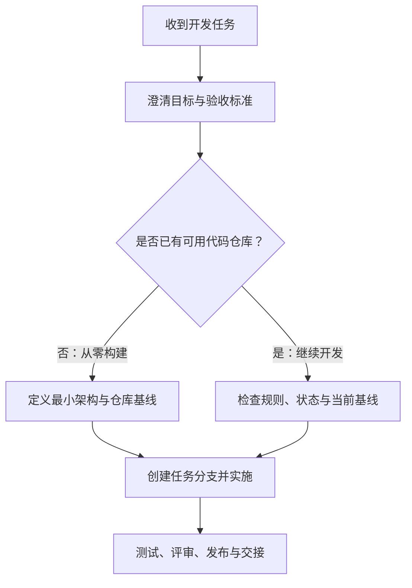

接到一个新的开发任务时，最重要的不是立刻开始写代码，而是先建立一个**可追溯、可验证、可交付**的工作闭环。任务可能是“什么都没有，需要从零构建”，也可能是“已有代码仓库，需要在现有基础上继续开发”；两种情况的起点不同，但都应经过：确认目标、建立或核对基线、隔离改动、实施、验证、评审与交付。

本文将 Git 操作嵌入完整工程流程中。默认远程仓库名为 `origin`、主分支名为 `main`；实际项目使用 `master`、`develop` 或其他名称时，应以仓库约定替换。日常的分支与 PR 细节可继续参考 [[Git 分支与 PR 工作流]]；本文重点回答“一个新任务从收到到交付，先后该做什么”。

## 一、先判断任务所处的起点

开始任何命令前，先确认自己面对的是哪一种情形。不要把“已有一个目录”误判为“已有可安全继续开发的项目”。

| 情形 | 典型特征 | 首要目标 | 不能跳过的动作 |
| --- | --- | --- | --- |
| 从零构建 | 没有仓库，或只有需求文档、原型、空目录 | 定义可交付的最小项目基线，并建立仓库 | 澄清范围、选定技术与运行方式、初始化版本控制 |
| 接手既有仓库 | 已有远程仓库、分支、代码、CI 或文档 | 先理解现状，再在正确基线上隔离本次改动 | 阅读项目规则、检查工作区、拉取远程引用、运行基线验证 |
| 在同事未合入的分支上继续 | 当前需求依赖另一条功能分支 | 明确分支依赖和 PR 顺序 | 从依赖分支创建自己的分支，并让 PR 先指向依赖分支 |
| 仅验证、排查或阅读另一分支 | 不需要把对方代码带入自己的功能分支 | 保护当前开发现场 | 用独立 `worktree` 验证，不在当前分支执行跨分支 `pull` |

后两种情形是“接手既有仓库”的特殊分支：依赖同事代码时见 [[Git 依赖远程协作分支的开发与 PR 工作流]]；未完成当前任务却要验证其他分支时见 [[Git 未完成开发时安全验证其他分支代码]]。

## 二、所有任务共用的第 0 步：把需求变成可验证的约定

无论是否已有代码，先用文字把任务边界写清楚。口头需求、聊天记录或 Issue 可以是来源，但不应是唯一的执行依据。至少记录在 Issue、任务卡、设计文档或 PR 描述草稿中。

| 要确认的内容 | 需要回答的问题 | 产出示例 |
| --- | --- | --- |
| 目标与用户价值 | 谁在什么场景下使用？问题是什么？成功后有什么可观察变化？ | “运营可导入 CSV，并获得逐行错误提示” |
| 范围 | 本次必须做什么？明确不做什么？ | 包含单文件导入；不包含历史数据回填 |
| 验收标准 | 如何判定完成？正常、边界、失败路径分别是什么？ | 合法文件导入成功；第 3 行格式错误时返回行号；无部分写入 |
| 接口与数据 | 是否新增 API、事件、表、配置、权限或迁移？ | `POST /imports`、导入记录表、对象存储配置 |
| 非功能要求 | 性能、并发、安全、审计、可观测性、兼容性、发布窗口有什么要求？ | 10 MB 限制；管理员权限；保留审计日志 |
| 依赖与风险 | 依赖谁、何时可用、失败时如何降级或回滚？ | 等待认证服务的角色字段；迁移必须可回滚 |

把验收标准改写为可以执行或检查的条目，例如测试用例、接口示例、页面操作步骤或监控指标。没有可验证的完成条件时，不应承诺完成日期，更不应把“代码写完”当作完成。

> [!important] 先问清“谁决定”
> 技术实现可以由开发者提出，但业务规则、优先级、兼容性承诺、上线窗口与数据保留策略通常需要产品、业务负责人或运维方确认。存在多个合理方案时，记录选项、取舍和最终决策，避免在开发中反复猜测。

## 三、建立开发基线：两条起点，两种检查单



### 情形 A：从零构建

从零构建的第一份代码不应直接等于完整产品。先确定一个可启动、可测试、可部署或至少可重复运行的最小骨架。技术选型应服务于约束：团队经验、现有平台、交付时间、部署环境、维护成本及合规要求；不要因为“新”而引入未经验证的框架。

建议按以下顺序建立基线：

1. 明确系统边界：服务负责什么、不负责什么；外部系统、数据所有者、认证方式和部署位置是什么。
2. 定义最小架构：模块边界、主要数据流、错误处理方式、配置与密钥来源，以及日志、指标和追踪的最低要求。
3. 选定运行与构建方式：语言和版本、包管理器、格式化工具、静态检查、测试框架、启动命令和环境变量。
4. 初始化仓库与协作约定：`.gitignore`、`README`、许可证（如适用）、提交约定、分支策略、CI 和代码所有者规则。
5. 实现“冒烟路径”：从启动到最小业务能力，再到自动化测试或健康检查，确认项目不是只能在一台机器上运行的样例。

若尚未存在远程仓库，在本地初始化前先确认代码托管组织、可见性、默认分支、访问控制和是否需要模板仓库。之后创建仓库并进行第一笔有意义的基线提交：

```bash
mkdir <project-name>
cd <project-name>
git init -b main
git status

# 创建项目实际需要的 README、.gitignore、构建配置和最小源码后
git add README.md .gitignore <构建配置> <源码目录>
git diff --staged
git commit -m "chore: initialize project baseline"

git remote add origin <远程仓库地址>
git push -u origin main
```

初始提交应只包含可解释的基础设施与最小骨架；不要把本机密钥、真实生产数据、构建产物、IDE 私人配置或“先放进去再说”的大文件一并提交。添加文件前先检查：

```bash
git status
git diff --staged
git diff --check --staged
```

> [!warning] 密钥与配置不能靠“以后再清理”
> 密码、Token、私钥、生产导出的数据一旦提交并推送，就可能进入远程历史、克隆和缓存。应使用环境变量、密钥管理服务或未纳入版本控制的本地配置文件；同时提交脱敏的 `.env.example` 或等价配置说明，方便其他人复现环境。

### 情形 B：接手既有代码仓库

已有仓库不表示可以直接修改。先确认它的规则、健康状态和当前基线，避免把历史问题、他人的未提交内容或错误分支带进本次需求。

#### 1. 阅读项目约定和交付路径

优先阅读仓库根目录与相关子目录中的项目说明，例如 `README`、`CONTRIBUTING`、`AGENTS.md`、`docs/`、构建脚本、CI 配置、部署清单和最近的 PR。需要回答的问题包括：

- 默认目标分支是什么，是否使用 `main`、`develop`、发布分支或短生命周期分支？
- 本地如何安装依赖、启动服务、执行格式化、静态检查、单元测试、集成测试和端到端测试？
- 哪些目录属于生成文件、迁移文件、接口契约、基础设施或敏感配置？
- 是否有提交信息、分支命名、代码审查、合并方式、发布或回滚的硬性规定？
- 本次需求触及哪些模块、API、数据表、配置、权限、消费者和部署环境？

不要凭文件名猜测命令。以 `package.json`、`Makefile`、`pom.xml`、`go.mod`、`pyproject.toml`、CI 工作流或项目文档中实际定义的命令为准。

#### 2. 先检查本地现场，再同步远程信息

在仓库根目录执行：

```bash
git status
git branch --show-current
git remote -v
git log --oneline --decorate -5
git fetch origin --prune
```

`git fetch origin --prune` 只更新本地的远程引用，不会合并代码或改动工作区，因此适合作为初始同步动作。若 `git status` 不是干净状态，应先确认改动来源：

- 改动属于自己正在进行的其他任务：回到对应分支提交，或用带说明的 `git stash push -u -m "wip: <说明>"` 保存。
- 改动属于同事或来源不明：不要覆盖、提交或清理，先核对负责人和工作目录。
- 需要同时保留当前现场并验证另一个分支：使用 [[Git 未完成开发时安全验证其他分支代码]] 中的 `git worktree` 流程。

不要把 `git reset --hard`、`git clean -fd` 或强制切换分支当作“开始前清理”的默认动作。这些命令可能使尚未备份的修改不可恢复。

#### 3. 确认主线与基线可用

确认本地工作区安全后，再将目标基线更新到远程主线。以下命令假定目标是 `main`：

```bash
git switch main
git pull --ff-only origin main
git status
git log --oneline main..origin/main
git log --oneline origin/main..main
```

两条比较日志都没有输出时，本地 `main` 与 `origin/main` 没有各自独有的提交。`--ff-only` 会在本地 `main` 存在意外提交时停止，避免悄悄创建合并提交；遇到这种情况应先调查提交来源，而不是强行拉取。

接着运行一轮项目规定的基线检查。按实际技术栈选择命令，而不是全部照抄：

```bash
# 以下仅为示例，选择项目真实存在的命令
npm ci && npm test
go test ./...
mvn test
```

如果基线失败，先记录失败命令、完整错误、环境信息和当前提交 ID。然后区分：问题本来就存在、环境缺失、文档过期，还是本次同步导致的变化。未确认前不要把历史失败当成本次需求的“顺手修复”；若必须修复，应获得确认并将范围写入任务或独立提交。

## 四、为本次任务创建可追溯的改动单元

无论是新项目的第二个需求，还是既有项目的新功能，都应从已确认的基线切出独立分支。分支名表明改动意图，避免使用含糊的 `test`、`new` 或个人姓名。

| 改动类型 | 分支示例 | 常见提交前缀 |
| --- | --- | --- |
| 新功能 | `feature/csv-import` | `feat:` |
| 缺陷修复 | `fix/duplicate-payment` | `fix:` |
| 重构 | `refactor/token-parser` | `refactor:` |
| 文档 | `docs/local-setup` | `docs:` |
| 构建或维护 | `chore/upgrade-runtime` | `chore:` |

从已更新的主线创建分支：

```bash
git switch -c feature/<简短主题>
git branch --show-current
git status
git log --oneline --decorate -3
```

若任务依赖同事尚未合入的功能，不应从 `main` 创建后再随意 `pull` 对方分支，而应按 [[Git 依赖远程协作分支的开发与 PR 工作流]] 建立堆叠分支与对应 PR。若只是验证对方实现，则不要把它合入当前分支。

## 五、实施前先做影响分析和小型设计

即使任务很小，也应先找到“改动从哪里进、经过哪里、会影响谁、如何失败”。阅读相邻实现、测试、接口契约和调用方，而不是只搜索到第一个匹配文件就开始修改。

对于会改变接口、数据、权限、异步流程或发布方式的任务，至少形成一页设计记录，说明：

1. 当前行为和目标行为分别是什么。
2. 涉及的模块、数据模型、接口、配置、依赖和调用方。
3. 正常路径、失败路径、幂等性、并发和权限边界如何处理。
4. 数据迁移、兼容性、灰度、监控和回滚是否需要，以及由谁执行。
5. 测试策略：哪些层级自动化，哪些需要手工或环境验证。

复杂改动可把设计与实现拆为多个可独立审阅的提交或 PR。不要为了“提交小”而把不可运行的半个数据迁移、半个接口契约和半个调用方分散到不能独立验证的提交中。

## 六、开发时保持小步、可审查、可恢复

每完成一个逻辑单元，就检查实际变更并只暂存相关文件：

```bash
git status
git diff
git add <文件或目录>
git diff --staged
git diff --check --staged
git commit -m "feat: add <功能描述>"
```

推荐的节奏是“实现一项可描述的行为 → 添加或更新其测试与文档 → 执行相应检查 → 提交”。提交应能回答“它改变了什么、为什么需要、如何回滚”；不应混入无关格式化、个人配置、临时调试语句或其他需求的修改。

开发过程中持续检查以下边界：

- API：输入校验、错误码或错误体、认证授权、分页/排序、向后兼容与调用方影响。
- 数据：迁移顺序、默认值、空值、唯一性、索引、事务、失败重试与回滚方案。
- 配置：默认值是否安全，新增环境变量是否写入示例和部署配置，密钥是否避免进入日志和仓库。
- 异步与外部依赖：超时、重试、幂等键、重复投递、降级和可观测性。
- 运行质量：日志是否足以定位问题，指标和告警是否覆盖关键失败，资源使用是否符合预期。
- 文档：README、接口文档、运行手册、迁移说明和变更日志是否需要同步。

当主线持续变化时，开发期间和提 PR 前都应先 `git fetch origin --prune`，再确认是否需要同步。自己独占的功能分支且团队偏好线性历史时，可 `git rebase origin/main`；多人共享分支或团队保留合并历史时，可 `git merge origin/main`。完整的冲突处理和安全推送说明见 [[Git 分支与 PR 工作流]]。已推送且经过 rebase 的个人分支只能使用 `git push --force-with-lease`，不要使用裸 `git push --force`。

## 七、按风险分层验证，而非只运行一次测试

验证应回到第 0 步的验收标准，覆盖成功与失败路径。不同项目的命令不一样，但验证层次通常相同：

| 层次 | 要验证什么 | 常见方式 |
| --- | --- | --- |
| 静态质量 | 格式、类型、依赖、常见缺陷 | formatter、linter、类型检查、依赖扫描 |
| 单元测试 | 单个函数或模块的业务规则、边界条件 | 项目测试命令与针对性测试用例 |
| 集成测试 | 数据库、消息队列、外部服务、配置的协作 | 容器化依赖、测试环境、契约测试 |
| 接口与端到端 | 从真实入口到可见结果的关键流程 | API 调用、浏览器或客户端操作、冒烟脚本 |
| 回归与非功能 | 旧功能、权限、性能、安全、并发与可观测性 | 回归集、压测、安全检查、日志/指标核验 |

提交 PR 前至少应执行项目要求的检查，并保留“运行了什么、结果如何、哪些未运行及原因”的记录。对有数据库迁移、异步消费者、权限策略或生产配置变更的任务，单元测试通过并不足以证明可发布；需要单独验证升级路径和失败时的恢复路径。

可使用下面的提交前核对：

```bash
git status
git diff --check origin/main...HEAD
git log --oneline origin/main..HEAD
git diff --stat origin/main...HEAD
# 再执行项目实际规定的格式化、检查、构建与测试命令
```

这里的 `origin/main...HEAD` 适用于功能分支以 `main` 为基线的常见场景；若 PR 基线是发布分支或同事分支，应替换为实际目标分支。不要只检查最后一个提交，因为 PR 审阅的是相对目标分支的全部差异。

## 八、通过 PR 完成评审、集成和发布准备

首次推送分支时建立跟踪关系：

```bash
git push -u origin feature/<简短主题>
```

创建 PR 前，确认目标分支、比较范围和 CI 触发方式正确。PR 描述应让不了解上下文的审阅者也能判断风险和验证状态。

| PR 内容 | 需要写清楚的内容 |
| --- | --- |
| 背景与目标 | 解决什么问题，验收标准是什么 |
| 实现概要 | 关键设计、模块和接口/数据变化；不逐行复述代码 |
| 验证结果 | 运行过的命令、手工验证步骤、CI 状态及未覆盖项 |
| 风险与发布 | 兼容性、迁移、配置、开关、监控、灰度和回滚要求 |
| 关联事项 | Issue、设计记录、依赖 PR、变更单或运行手册 |

评审意见应先判断其是否影响需求、设计或风险，再修改代码、测试和文档。每次回应后重新运行受影响的检查并推送更新。不要为了尽快合并而关闭未解决的技术或业务问题；若意见超出本次范围，记录为后续任务并由相关负责人确认。

合并前的最低检查：

- PR 的目标分支和源分支正确，比较范围不包含无关提交。
- 必需的 CI、评审和安全检查已通过，例外有明确批准和风险记录。
- 分支已按团队规则同步主线，冲突已解决，PR 描述仍与最终代码一致。
- 数据迁移、配置、密钥、权限、部署步骤、监控和回滚已有人负责。
- 选择仓库既有的合并策略（squash、merge commit 或 rebase merge），而不是个人偏好覆盖团队约定。

## 九、合并后不等于结束：发布、观察与交接

合并代码与上线交付是两个不同的状态。没有发布权限时，也应明确把发布前置条件和责任交给正确的人，而不是只说“已经合并”。

| 阶段 | 核对内容 |
| --- | --- |
| 发布前 | 环境变量和密钥已配置；迁移顺序正确；开关、权限、依赖版本与回滚步骤可执行 |
| 发布中 | 使用正确制品和版本；记录时间、操作者、变更范围；按计划灰度或全量发布 |
| 发布后 | 健康检查、关键业务指标、错误率、日志、队列积压和告警状态符合预期 |
| 交接 | 更新运行手册、接口说明和已知限制；告知支持/业务方验收入口与异常处理方式 |
| 收尾 | 关闭或更新任务状态，关联 PR/发布记录；删除已合并的短期分支，更新本地主线 |

合并后可安全清理自己的短生命周期分支：

```bash
git switch main
git pull --ff-only origin main
git branch -d feature/<简短主题>
git push origin --delete feature/<简短主题>
```

远程分支是否自动删除、是否保留发布分支或是否允许删除，均以团队规则为准。生产异常时优先遵循既定事故处理和回滚流程：先止损、保存证据、通知负责人，再修复；不要在高压下对共享分支执行破坏性 Git 操作。

## 十、可复用的最小清单

每次接到任务可按下列顺序快速自检：

1. 我能用一句话说清目标、非目标和验收标准吗？
2. 这是从零构建、接手现有仓库、依赖协作分支，还是仅验证其他分支？
3. 项目规则、目标分支、构建测试命令、发布要求和当前风险都已确认吗？
4. 本地工作区干净或已有可恢复的说明性快照吗？`git status` 的每一项我都知道来源吗？
5. 我是否从正确、最新、已验证的基线创建了独立分支？
6. 设计是否覆盖接口、数据、权限、配置、失败路径、兼容性与回滚？
7. 每个提交是否小而可解释，并且只包含本次任务的内容？
8. 测试是否覆盖验收标准、失败路径和本次改动的风险层级？
9. PR 是否写明目标、验证、风险、发布/回滚和依赖关系？
10. 合并后谁负责发布、观察、验收、文档更新和任务关闭？

这套流程的核心不是增加仪式感，而是尽早发现不确定性，把每次修改限制在可理解的范围内，并让任何接手者都能复现“为什么这样改、如何验证、出问题如何恢复”。
