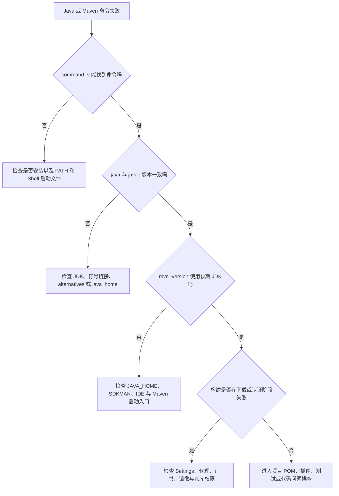

Java 与 Maven 的环境问题通常来自四个层次：命令搜索路径、JDK 选择、Maven 配置、网络与仓库。排障时应先记录真实状态，再逐层缩小范围；不要一遇到错误就重装全部工具或删除整个 Maven 本地仓库。

安装步骤见 [[Ubuntu 安装 Java 与 Maven]]、[[macOS 安装 Java 与 Maven]]；多 JDK 选择见 [[Java 版本管理与环境变量配置]]；Maven 配置结构见 [[Maven 常用配置与仓库管理]]。

## 1. 先判断问题属于哪一层



## 2. 收集最小诊断信息

下面命令只读取状态，适用于 Ubuntu 和 macOS：

```bash
printf 'date=' && date
printf 'shell=%s\n' "$SHELL"
printf 'current process=' && ps -p $$ -o comm=
printf 'JAVA_HOME=%s\n' "${JAVA_HOME:-<未设置>}"

uname -a
type -a java 2>/dev/null || true
type -a javac 2>/dev/null || true
type -a mvn 2>/dev/null || true

java -version 2>&1 || true
javac -version 2>&1 || true
mvn -version 2>&1 || true
```

再查看 JVM 自报路径：

```bash
java -XshowSettings:properties -version 2>&1 \
  | grep -E 'java.home|java.version|java.vendor|os.arch'
```

Ubuntu 追加：

```bash
readlink -f "$(command -v java)" 2>/dev/null || true
readlink -f "$(command -v javac)" 2>/dev/null || true
update-alternatives --list java 2>/dev/null || true
update-alternatives --list javac 2>/dev/null || true
```

macOS 追加：

```bash
sw_vers
uname -m
/usr/libexec/java_home -V 2>&1 || true
```

> [!warning] 分享日志前先脱敏
> `mvn -X`、`help:effective-settings`、Shell 环境和仓库错误可能暴露用户名、内部域名、代理地址、绝对路径和凭据。不要直接把完整配置或调试日志发布到公开渠道。

## 3. 常见现象速查

| 现象 | 常见原因 | 首要检查 |
| --- | --- | --- |
| `java: command not found` | JDK 未安装，或 `PATH` 没有 Java | `command -v java`、包管理器状态 |
| `javac: command not found` | 只安装了 JRE | `command -v javac`、JDK 包 |
| `JAVA_HOME is not defined correctly` | `JAVA_HOME` 指到 `bin`、`java` 文件或已删除目录 | `test -x "$JAVA_HOME/bin/java"` |
| `java -version` 与 `javac -version` 不同 | `PATH`、alternatives 或多套安装混用 | `type -a`、真实路径 |
| `mvn -version` 使用另一个 JDK | Maven 读取了不同 `JAVA_HOME` 或由 IDE、SDKMAN 启动 | Maven 输出的 `Java home` |
| IDE 能编译、终端不能 | IDE 使用独立 JDK 或 Maven | IDE Project SDK、Runner JDK |
| 终端能构建、IDE 不能 | IDE Importer、Runner 或代理配置不同 | IDE Maven 设置和日志 |
| `UnsupportedClassVersionError` | 运行 JDK 比编译字节码版本旧 | 异常中的 class file version、两端 JDK |
| `invalid target release` | 编译器 JDK 不支持目标 release | `javac -version`、Toolchains |
| `PKIX path building failed` | JDK 信任库不信任远端证书或代理证书 | 目标 URL、证书链、Maven 使用的 JDK |
| HTTP 401 或 403 | 凭据错误或没有仓库权限 | `<server><id>` 与仓库 ID |
| HTTP 407 | 代理要求认证 | `<proxy>` 配置 |
| 依赖反复下载失败 | 镜像、代理、TLS、本地 `.lastUpdated` 或仓库状态 | `settings.xml`、目标制品路径 |
| `Permission denied: ./mvnw` | Wrapper 没有 Unix 执行位 | `ls -l mvnw`、Git mode |
| Apple Silicon 出现本地库错误 | JDK、终端或本地依赖架构不一致 | `uname -m`、`file` |

## 4. 命令找不到或执行了旧版本

### 确认是否真的安装

Ubuntu：

```bash
dpkg -l | grep -E 'openjdk|default-jdk|maven'
apt-cache policy default-jdk maven
```

macOS Homebrew：

```bash
brew list --versions | grep -E 'openjdk|maven' || true
brew info maven
```

macOS JDK：

```bash
/usr/libexec/java_home -V
ls -la /Library/Java/JavaVirtualMachines/
```

### 检查 PATH 顺序

```bash
printf '%s\n' "$PATH" | tr ':' '\n'
type -a java
type -a javac
type -a mvn
```

如果 `/usr/bin`、Homebrew、SDKMAN 或手工安装目录同时提供命令，最靠前的候选生效。搜索重复 Shell 配置：

```bash
grep -nE 'JAVA_HOME|MAVEN_HOME|sdkman|java_home|openjdk|apache-maven' \
  "$HOME/.profile" "$HOME/.bashrc" "$HOME/.zprofile" "$HOME/.zshrc" \
  2>/dev/null || true
```

修改后开新终端，或者刷新命令缓存：

```bash
hash -r
```

Zsh 也可以执行：

```zsh
rehash
```

## 5. `JAVA_HOME` 错误

先验证当前值：

```bash
printf 'JAVA_HOME=%s\n' "${JAVA_HOME:-<未设置>}"
test -d "${JAVA_HOME:-/path/that/does/not/exist}"
test -x "${JAVA_HOME:-/path/that/does/not/exist}/bin/java"
test -x "${JAVA_HOME:-/path/that/does/not/exist}/bin/javac"
```

正确的 `JAVA_HOME` 是 JDK 根目录，不包含尾部 `/bin`，也不指向 `java` 文件。

Ubuntu 可从 `javac` 计算：

```bash
export JAVA_HOME="$(dirname "$(dirname "$(readlink -f "$(command -v javac)")")")"
```

macOS 可按版本选择：

```bash
export JAVA_HOME="$(/usr/libexec/java_home -v 21)"
```

再统一调整 PATH：

```bash
export PATH="$JAVA_HOME/bin:$PATH"
java -version
javac -version
mvn -version
```

## 6. Java 与字节码版本不兼容

### `UnsupportedClassVersionError`

这表示某个 `.class` 文件由更高版本 JDK 编译，而当前运行时太旧。异常通常会同时给出“class file version”和当前支持上限。

不要只把运行服务器升级到最新。先确认：

1. 项目声明的 JDK 和 `maven.compiler.release`。
2. CI 实际编译 JDK。
3. 生产运行 JDK。
4. 是否有某个模块或依赖由不同 JDK 构建。

查看 class 版本可使用：

```bash
javap -verbose path/to/SomeClass.class | grep 'major version'
```

### `invalid target release`

例如构建声明 `release=21`，但 Maven 编译插件实际使用 JDK 17。检查：

```bash
javac -version
mvn -version
mvn help:effective-pom
```

如果项目使用 Toolchains，再检查 `~/.m2/toolchains.xml` 和 POM 的 Toolchains Plugin。参见 [[Java 版本管理与环境变量配置]]。

## 7. Maven 使用了错误 JDK

对比三个入口：

```bash
java -XshowSettings:properties -version 2>&1 | grep 'java.home'
printf 'JAVA_HOME=%s\n' "${JAVA_HOME:-<未设置>}"
mvn -version
```

常见原因：

- `JAVA_HOME` 与 `PATH` 指向不同 JDK。
- SDKMAN 初始化发生在另一段 Shell 配置之后，重新覆盖 PATH。
- Homebrew 安装 Maven 时同时安装了新的非版本化 OpenJDK。
- IDE Maven Runner 使用 IDE 自带或单独配置的 JDK。
- 项目 Wrapper 和全局 `mvn` 使用了不同 Maven，但真正差异来自各自启动环境。

处理后同时验证：

```bash
mvn -version
./mvnw -version 2>/dev/null || true
```

## 8. IDE 与终端不一致

IDE 中分别检查：

- Project SDK。
- Module SDK。
- Maven Importer JDK。
- Maven Runner JDK。
- Run/Debug Configuration 使用的 JRE。
- IDE 内置终端的 Shell。

图形界面启动的 IDE 不一定读取 `~/.zshrc` 或 `~/.bashrc`。不要通过在多个启动文件中重复追加变量来碰运气；应在 IDE 的明确设置中选择 JDK，并让项目通过 Maven Wrapper、Enforcer 和 Toolchains 声明要求。

## 9. Apple Silicon 与 Intel 架构问题

在 macOS 检查当前终端、Java 与 Homebrew：

```bash
uname -m
file "$(command -v java)"
file "$(command -v brew)"
brew --prefix
```

Apple Silicon 原生终端通常是 `arm64`，Homebrew 默认前缀通常是 `/opt/homebrew`；Intel Homebrew 常见前缀是 `/usr/local`。不要把这些路径直接写死到共享脚本，使用 `brew --prefix` 获取。

出现 `UnsatisfiedLinkError`、`Bad CPU type in executable` 或本地库加载失败时，还要检查 JNI、数据库驱动附带的本地库、测试容器辅助程序等二进制的架构。

## 10. Maven 网络、代理与证书问题

### 先测试基础网络

```bash
curl -I https://repo.maven.apache.org/maven2/
curl -I https://maven.apache.org/
```

`curl` 成功但 Maven 失败，说明问题可能在 Maven `settings.xml`、JDK 信任库、JVM 代理或仓库认证，而不是整台机器没有网络。

### 查看生效配置

```bash
mvn help:effective-settings
mvn help:active-profiles
```

需要调试时：

```bash
mvn -X -U test
```

调试日志可能包含内部信息，分享前脱敏。

### `PKIX path building failed`

该错误表示 Maven 使用的 JDK 无法建立目标 HTTPS 证书的可信链。不要通过关闭 TLS 校验解决。依次确认：

1. `mvn -version` 使用哪个 JDK。
2. 错误中的真实主机名，是 Central、企业仓库还是代理。
3. 浏览器或 `curl` 是否经过企业 HTTPS 解密代理。
4. 组织是否提供受信任根证书和标准导入流程。
5. IDE 和命令行是否使用不同 JDK 信任库。

证书应由组织安全流程安装到正确的 JDK 或系统信任存储。不要从错误页面、聊天附件或不可信网站导出证书后直接导入。

### HTTP 401、403 与 407

| 状态 | 常见含义 | 检查重点 |
| --- | --- | --- |
| 401 Unauthorized | 未认证或凭据无效 | `<server><id>`、用户名、令牌是否过期 |
| 403 Forbidden | 已识别但没有访问权限，或策略阻止 | 仓库权限、路径、制品类型、IP 策略 |
| 407 Proxy Authentication Required | 代理需要认证 | `<proxy>`、代理账号和 `nonProxyHosts` |

仓库 ID 必须与 POM、Mirror 或 `distributionManagement` 中对应 ID 精确匹配。完整配置见 [[Maven 常用配置与仓库管理]]。

## 11. 本地仓库损坏或 `.lastUpdated` 问题

先从 Maven 错误中提取准确坐标，再定位目录。例如：

```text
com.example:example-library:jar:1.2.3
```

对应默认目录：

```text
~/.m2/repository/com/example/example-library/1.2.3/
```

检查内容：

```bash
ls -la "$HOME/.m2/repository/com/example/example-library/1.2.3/"
```

停止其他 Maven 构建，只备份或删除这个明确版本目录，再运行：

```bash
mvn -U test
```

不要默认执行：

```bash
rm -rf "$HOME/.m2/repository"
```

删除整个仓库会让所有依赖重新下载，还可能掩盖真正的镜像、代理或认证问题。

## 12. Maven Wrapper 问题

### `Permission denied`

```bash
ls -l mvnw
chmod +x mvnw
git add --chmod=+x mvnw
./mvnw -version
```

### Wrapper 下载失败

检查：

```bash
sed -n '1,160p' .mvn/wrapper/maven-wrapper.properties
```

确认 `distributionUrl` 指向 Apache Maven 官方分发或组织批准的仓库，版本存在，网络代理覆盖 Wrapper 下载路径。如果项目配置了 `distributionSha256Sum`，校验失败时不要删除校验值绕过，应重新确认下载文件和官方哈希。

### `mvn` 成功但 `./mvnw` 失败

两者使用不同 Maven 分发版本和缓存。比较：

```bash
mvn -version
./mvnw -version
```

再检查 `~/.m2/wrapper/dists` 的权限和磁盘空间，但不要在其他构建运行时删除其缓存。

## 13. 磁盘、权限与文件系统

```bash
df -h
du -sh "$HOME/.m2" 2>/dev/null || true
ls -ld "$HOME/.m2" "$HOME/.m2/repository" 2>/dev/null || true
```

常见问题包括：

- 曾经用 `sudo mvn`，导致 `~/.m2` 中部分文件属于 root。
- 本地仓库位于只读、网络或同步文件系统。
- 磁盘已满，下载只留下部分文件。
- 杀毒、备份或同步工具锁定 Maven 临时文件。

个人开发机上，如果确认 `~/.m2` 全部属于当前用户且没有其他账号共享，可以修复属主：

```bash
sudo chown -R "$USER" "$HOME/.m2"
```

执行前必须先用 `ls -la` 确认范围。共享服务器和 CI 缓存不能套用这条个人开发机命令。

## 14. 升级、回退与卸载原则

升级前记录：

```bash
java -version 2>&1
javac -version 2>&1
mvn -version
```

并在关键项目执行：

```bash
./mvnw verify
```

升级后用同一组命令复测。出现问题时，优先回退到项目此前明确支持的 JDK 或 Maven 版本，而不是同时修改 JDK、Maven、插件和依赖。

卸载顺序：

1. 盘点项目、IDE、CI、服务和 Shell 配置引用。
2. 让默认版本切换到仍保留的 JDK。
3. 使用原安装方式卸载，例如 apt、Homebrew、SDKMAN 或官方卸载说明。
4. 清理已经无效的 `JAVA_HOME`、`MAVEN_HOME` 和 PATH 项。
5. 新开终端并重新运行诊断基线。
6. 保留或单独备份 `~/.m2/settings.xml`、`toolchains.xml` 等用户配置。

## 15. 何时说明问题已经不在环境层

满足以下条件后，问题通常已经进入项目层：

- `java`、`javac` 和 `mvn`/`mvnw` 版本符合项目要求。
- Maven 使用的 Java home 正确。
- `help:effective-settings` 中仓库和代理正确。
- 可以从同一环境构建另一个最小 Maven 项目。
- 当前项目仍在特定插件、测试、代码或依赖解析阶段失败。

此时应保留完整错误堆栈，查看 `pom.xml`、父 POM、插件版本、依赖树和测试报告，不要继续反复重装本机 Java。

## 官方参考资料

- [Apache Maven：安装](https://maven.apache.org/install.html)
- [Apache Maven Settings Reference](https://maven.apache.org/settings.html)
- [Apache Maven：配置代理](https://maven.apache.org/guides/mini/guide-proxies.html)
- [Apache Maven：Mirror 配置](https://maven.apache.org/guides/mini/guide-mirror-settings.html)
- [Apache Maven Wrapper](https://maven.apache.org/tools/wrapper/)
- [Apache Maven Toolchains Plugin](https://maven.apache.org/plugins/maven-toolchains-plugin/)
- [SDKMAN：使用](https://sdkman.io/usage/)
- [Eclipse Adoptium：安装](https://adoptium.net/installation/)
