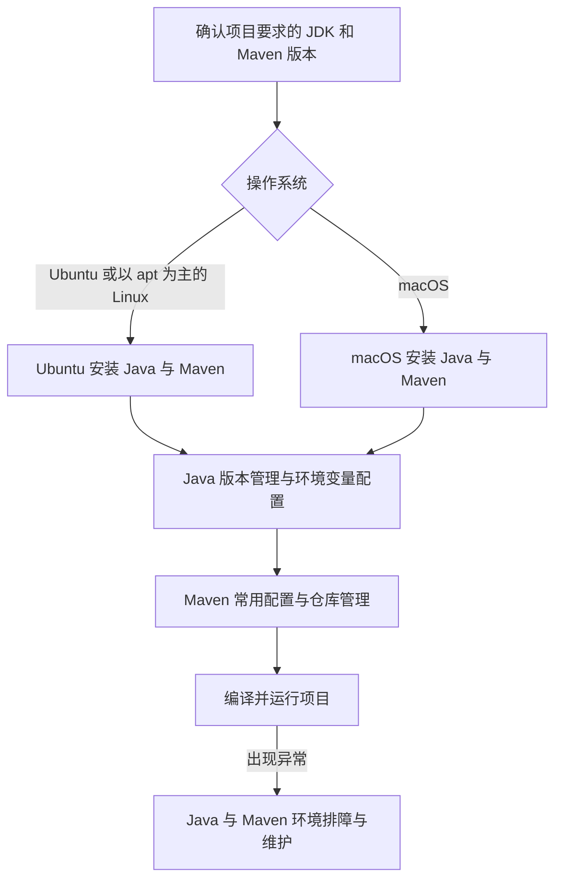

搭建 Java 开发环境，不只是让终端能够执行 `java`。一个可维护的环境还需要同时解决 JDK 版本、`JAVA_HOME`、命令搜索路径、Maven 版本、依赖仓库、IDE 使用的 JDK，以及项目如何固定构建工具版本等问题。

本文是整组笔记的入口，面向第一次在 Ubuntu 或 macOS 上配置 Java 开发环境的开发者。先确定项目需要的 JDK，再选择对应平台的安装路线；安装完成后，再处理多版本管理和 Maven 的用户级配置。

## 阅读路线



推荐按下面顺序阅读：

1. Ubuntu 用户阅读 [[Ubuntu 安装 Java 与 Maven]]，macOS 用户阅读 [[macOS 安装 Java 与 Maven]]。
2. 需要同时维护多个 JDK，或者终端、Maven、IDE 使用了不同版本时，阅读 [[Java 版本管理与环境变量配置]]。
3. 需要设置 Maven 本地仓库、企业仓库、代理、认证、Wrapper 或 Toolchains 时，阅读 [[Maven 常用配置与仓库管理]]。
4. 遇到命令找不到、版本错乱、TLS、代理或依赖下载问题时，阅读 [[Java 与 Maven 环境排障与维护]]。

## 先理解 JVM、JRE、JDK 与 Maven

| 名称 | 主要职责 | 开发机是否需要 |
| --- | --- | --- |
| JVM | 执行 Java 字节码，是 Java 程序运行时的核心 | 会随 JDK 或运行时一起提供 |
| JRE | JVM 加运行 Java 程序所需的标准库和支持文件 | 只运行程序时可能够用，但现代开发通常直接安装 JDK |
| JDK | 包含运行时以及 `javac`、`javadoc`、`jar`、`jcmd` 等开发工具 | 是，开发和构建应安装 JDK |
| Maven | 读取 `pom.xml`，解析依赖并执行编译、测试、打包等构建生命周期 | Maven 项目需要；它本身仍要由一个 JDK 运行 |
| Maven Wrapper | 随项目提交的 `mvnw`、`mvnw.cmd` 和 `.mvn/` 配置，用于固定项目使用的 Maven 版本 | 已提供 Wrapper 的项目应优先使用 |

> [!important] 安装 JRE 不能替代安装 JDK
> `java -version` 成功只说明可以启动 Java 运行时，不代表系统存在编译器。Java 开发环境至少还要让 `javac -version` 成功，并确认 Maven 使用的是预期 JDK。

## 版本选择原则

版本选择的优先级应当是：

1. 项目的 `README`、`pom.xml`、Maven Enforcer、Maven Toolchains、CI 配置或团队基线。
2. 框架和插件明确支持的 JDK 范围。
3. 组织批准的 JDK 发行版和安全更新策略。
4. 在没有项目约束的新项目中，再选择当前仍受支持的长期维护版本。

截至 2026-07-14，Eclipse Temurin 将 Java 25 标为最新 LTS，Apache Maven 当前稳定版为 3.9.16；Maven 4.0 仍处于候选版本阶段。版本会继续变化，因此安装命令中的具体版本只是示例，执行前应重新查看官方发布页。已有项目不要仅因为出现了更新版本就直接升级。

| 场景 | 建议 |
| --- | --- |
| 已有项目明确要求 JDK 17、21 或 25 | 安装项目要求的版本，不擅自改成“最新” |
| 项目包含 `mvnw` | 优先执行 `./mvnw`，不要以全局 `mvn` 版本代替项目约束 |
| 同时维护多个项目和多个 JDK | 使用系统版本选择器、SDKMAN 或 Maven Toolchains，参见 [[Java 版本管理与环境变量配置]] |
| CI、生产或受管设备 | 使用组织批准且可重复的安装方式，固定版本并记录升级流程 |
| 只想学习 Java，没有既有项目约束 | 选择仍受支持的 LTS JDK，并使用稳定版 Maven |

## JDK 发行版如何选择

OpenJDK 是 Java SE 的开源实现。Eclipse Temurin、Oracle JDK、Amazon Corretto、Azul Zulu、Microsoft Build of OpenJDK 等发行版，都是在 OpenJDK 基础上提供二进制构建、更新和支持策略。

学习和普通后端开发不需要同时安装所有发行版。选择时重点确认：

- 项目或公司是否指定了供应商。
- 目标 JDK 主版本和 CPU 架构是否匹配。
- 是否提供当前操作系统需要的安装包。
- 安全更新、支持期限和许可证是否满足使用场景。
- 开发机、CI 和生产环境是否需要保持同一发行版。

本组笔记在 Ubuntu 上以发行版提供的 OpenJDK 包为主，在 macOS 上介绍 Eclipse Temurin 安装包和 Homebrew OpenJDK。SDKMAN 作为需要多版本切换时的可选方案，而不是所有机器必须安装的前置工具。

## 平台安装路线

| 平台与目标 | 首选路线 | 适合的替代路线 |
| --- | --- | --- |
| Ubuntu 个人开发机，只需要一个稳定 JDK | apt 安装 `default-jdk` 或项目指定的 `openjdk-<版本>-jdk` | SDKMAN 管理多个 JDK；官方归档用于必须固定 Maven 版本的场景 |
| Ubuntu CI 或服务器 | 发行版包、受管镜像或组织统一的软件仓库 | 固定并校验的官方二进制归档 |
| macOS 第一次安装 JDK | Eclipse Temurin `.pkg`，或 Homebrew 的版本化 OpenJDK Formula | SDKMAN 管理多个 JDK |
| macOS 安装 Maven | Homebrew、SDKMAN 或项目 Maven Wrapper | Apache Maven 官方二进制归档 |

> [!tip] 平台安装与项目构建是两个层次
> 操作系统负责提供至少一个可运行的 JDK；项目则应通过 `pom.xml`、Maven Wrapper、Maven Enforcer、Toolchains 和 CI 配置声明自己的构建要求。不要只依靠某位开发者本机的全局默认版本。

## `JAVA_HOME`、`PATH` 与 Maven 的关系

Shell 执行 `java` 时，会按照 `PATH` 从左到右寻找同名可执行文件。`JAVA_HOME` 则应指向 JDK 根目录，而不是 `bin/java` 文件，也不是 JDK 根目录下的 `bin` 目录。

假设 JDK 根目录是 `/path/to/jdk`，正确关系如下：

```text
JAVA_HOME=/path/to/jdk
java=$JAVA_HOME/bin/java
javac=$JAVA_HOME/bin/javac
PATH=$JAVA_HOME/bin:...
```

Maven 启动时会选择一个 Java 运行时。仅查看 `java -version` 不足以确认 Maven 的实际选择；必须同时运行：

```bash
java -version
javac -version
mvn -version
```

`mvn -version` 输出中的 `Java version` 和 `Java home` 才是 Maven 当前实际使用的 JDK。完整的定位方法见 [[Java 版本管理与环境变量配置]]。

## 安装完成标准

一个基本可用的环境应同时满足以下条件：

- `java -version` 与 `javac -version` 主版本符合项目要求。
- `JAVA_HOME` 指向真实 JDK 根目录，且 `$JAVA_HOME/bin/java` 可以执行。
- `mvn -version` 或 `./mvnw -version` 成功，并显示预期的 Java home。
- 一个最小 `.java` 文件能够完成编译和运行。
- 一个 Maven 项目能够完成依赖解析、测试和打包。
- IDE 的 Project SDK、Maven Runner JDK 和终端结果一致，或差异是有意配置的。
- Maven 用户配置没有把明文凭据提交进 Git。

可先执行下面的只读检查：

```bash
printf 'JAVA_HOME=%s\n' "${JAVA_HOME:-<未设置>}"
command -v java || true
command -v javac || true
command -v mvn || true
java -version 2>&1 || true
javac -version 2>&1 || true
mvn -version 2>&1 || true
```

如果仓库根目录有 `mvnw`，再执行：

```bash
./mvnw -version
```

## 安全、网络与可重复性原则

- 只从操作系统官方仓库、JDK 发行商、Apache Maven、Homebrew 或组织批准的软件仓库获取安装包。
- 手工下载压缩包时校验官方提供的 SHA-512 或签名，不把“下载成功”等同于“文件可信”。
- 不在共享 `pom.xml` 中写个人代理、私服密码或本机绝对路径。
- 不把真实令牌、密码、私钥或内部仓库凭据写入公开笔记、Shell 历史或 Git 仓库。
- Maven 依赖下载慢时，先确认 DNS、代理、证书和组织仓库；不要随意粘贴来源不明的公共镜像地址。
- 开发机可以使用包管理器保持更新；CI 和生产环境应固定版本，并在升级前验证兼容性。

## 后续目录规划

当前笔记集中在 `Java/安装与配置/`。以后出现实际内容时，可以再增加 `Java/语言基础/`、`Java/JVM/`、`Java/并发/`、`Java/构建与测试/`、`Java/框架与生态/` 和 `Java/排障与性能/`，无需提前创建空目录。

## 官方参考资料

- [Ubuntu：配置 Java 开发环境](https://ubuntu.com/developers/docs/howto/java-setup/)
- [OpenJDK 项目](https://openjdk.org/)
- [Eclipse Adoptium：安装 Eclipse Temurin](https://adoptium.net/installation/)
- [Eclipse Temurin 发布下载](https://adoptium.net/temurin/releases/)
- [Apache Maven：安装](https://maven.apache.org/install.html)
- [Apache Maven：下载](https://maven.apache.org/download.cgi)
- [Apache Maven Wrapper](https://maven.apache.org/tools/wrapper/)
- [SDKMAN：安装](https://sdkman.io/install/)
