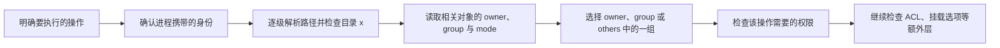

Linux 文件权限解决的是：**一个进程以什么身份，对某个文件系统对象执行某项操作时，系统是否允许**。

因此，只背 `rwx`、几个 `chmod` 示例或“权限不足就加 `sudo`”并不能真正判断权限问题。需要把操作类型、进程身份、路径中的目录、目标对象元数据以及其他访问控制层放在同一条判断链中理解。

> [!abstract] 本篇掌握目标
> - **必须熟练**：使用 `id` 确认当前进程身份，读懂 `ls -l` 与 `stat` 中的符号权限和数字权限，区分文件与目录的 `rwx`，安全使用 `sudo` 与常见 `chmod` 操作。
> - **理解会查**：解释主组、补充组和登录会话的关系，判断 owner、group、others 中哪一组生效，区分 `chmod`、`chown`、`chgrp` 与 `umask`，按操作类型和路径逐级排查权限问题。
> - **认识即可**：ACL、setuid、setgid、sticky bit、Linux capabilities、挂载选项和安全模块；遇到对应现象时知道继续查哪一层。
>
> 命令行如何拆解及怎样查参数见 [[Linux 命令行学习路线与命令地图]] 与 [[Shell 命令结构、类型与帮助系统]]；文件和目录操作见 [[Linux 文件与目录常用命令]]；重定向由谁执行见 [[Shell 标准流、管道、重定向与退出状态]]。

## 1. 先建立完整的权限判断模型

### 1.1 先问清楚正在执行什么操作

“能否访问一个路径”不是单一问题。不同操作可能检查不同对象：

| 操作 | 主要检查对象 | 基础权限重点 |
| --- | --- | --- |
| 读取文件内容 | 路径中的目录和目标文件 | 目录 `x`，文件 `r` |
| 修改或截断已有文件 | 路径中的目录和目标文件 | 目录 `x`，文件 `w` |
| 执行文件 | 路径中的目录和目标文件 | 目录 `x`，文件 `x`，以及格式、解释器和挂载限制 |
| 创建新文件或目录 | 路径中的目录和目标父目录 | 路径目录 `x`，父目录通常需要 `w+x` |
| 删除目录项 | 路径中的目录和目标父目录 | 父目录通常需要 `w+x`，还可能受 sticky bit 限制 |
| 重命名或移动目录项 | 源路径、目标路径及两边父目录 | 相关父目录通常需要 `w+x`，并受文件系统边界等条件影响 |

这意味着“文件不可写”和“文件不可删除”不是同一个判断。排查前必须先明确：要读内容、改内容、执行、创建、删除，还是重命名。

### 1.2 把进程身份、路径和对象元数据放在一起

在终端中运行一条命令时，Shell 会启动一个进程。这个进程携带用户和用户组身份；文件系统对象则保存所有者、所属组和 mode。系统结合操作类型、路径中的目录以及目标对象状态，判断本次操作是否允许。



这里的“相关对象”不一定只是路径末尾的文件。创建、删除和重命名主要修改父目录中的目录项，因此必须检查父目录。

### 1.3 分清账号数据、进程状态和文件元数据

| 状态 | 保存在哪里 | 何时生效 | 持续到何时 |
| --- | --- | --- | --- |
| 用户名与 UID、组名与 GID 的映射 | 本地账号数据库或系统身份源（NSS） | 账号数据修改后可被新查询看到 | 直到账号数据再次修改 |
| 当前进程的有效 UID、有效 GID 与补充组 | 进程凭据，也就是进程携带的身份数据 | 登录或启动进程时取得 | 进程结束；子进程继承一份 |
| 文件的 owner、group 与 mode | 文件系统对象的元数据 | `chown`、`chgrp`、`chmod` 成功后立即生效 | 直到再次修改或对象被删除、替换 |
| `sudo` 命令的目标身份 | `sudo` 启动的目标进程 | 该命令启动时 | 目标进程及其子进程结束 |
| `sudo` 的认证状态 | sudo 实现与本机策略维护的记录 | 认证成功或执行 `sudo -v` 后 | 由实现和本机策略决定，也可用 `sudo -k` 请求失效 |
| `umask` | 当前进程 | 当前 Shell 执行 `umask` 后 | 再次修改或进程退出；子进程继承 |

后文所有命令都应回到这张表判断：它修改的是账号数据、进程身份、已有文件元数据，还是以后创建对象时使用的进程状态。

## 2. 用户、用户组与进程身份

### 2.1 名称是给人看的，UID/GID 才参与判断

Linux 使用数字 UID 标识用户，使用数字 GID 标识用户组。用户名和组名是便于人类使用的映射；同名用户在不同机器上可能拥有不同 UID，因此复制文件、迁移磁盘或使用容器时不能只看名称。

用户和组也不一定只来自 `/etc/passwd` 与 `/etc/group`。Name Service Switch（NSS）可以把本地文件、LDAP、SSSD 等身份源统一提供给系统查询，所以通用查询优先使用 `getent`。

**执行位置：Linux 主机（任意目录，只读）**

```bash
whoami
id
id -u
id -g
id -Gn
groups
getent passwd "$(id -un)"
getent group "$(id -gn)"
```

- `whoami` 输出当前进程的有效用户名。
- `id` 显示当前进程的 UID、GID 和可用组；普通登录会话中，账号主 GID 与当前有效 GID 通常相同。
- `id -u`、`id -g` 分别只输出当前进程的有效 UID 和有效 GID。
- `-n` 需要与 `-u`、`-g` 或 `-G` 配合，把数字标识改为对应名称；因此 `id -un` 和 `id -gn` 分别输出当前进程的有效用户名和有效组名。
- `id -Gn` 与不带用户名的 `groups` 都显示当前进程可使用的组名，通常包含当前有效组和补充组，不能把它们简单称为“补充组列表”。
- `getent passwd` 和 `getent group` 查询 NSS 看到的账号数据，不等同于直接读取本地文件。

`getent group GROUP_NAME` 最后一列主要记录显式加入该组的成员。用户的主组记录在用户账号条目中，因此不能只根据这一列断言某个用户是否属于该组；需要结合 `id USER_NAME` 判断。

### 2.2 主组与补充组分别是什么

用户账号记录一个主 GID。登录流程通常用它初始化新会话进程的有效 GID，并同时加载该用户的补充组；`newgrp`、`sudo` 等工具可以改变某个进程的组身份，而不必修改账号记录中的主组。

从日常文件访问角度，可以先把进程身份理解为：

- 一个当前有效 GID：普通登录会话中通常等于账号主 GID，新建文件在普通情况下会以它作为所属组。
- 零个或多个补充 GID：让同一个用户能够访问多个组拥有的资源。

父目录设置了 setgid 等特殊规则时，新对象可能继承父目录的所属组，而不是使用创建进程的有效 GID。该机制常用于共享目录，后文只做认识级说明。

> [!note] Linux 还有文件系统 UID/GID
> Linux 内核在文件访问检查中使用 filesystem UID/GID，并结合补充组。它们在普通进程中通常与有效 UID/GID 相同。日常排查先使用 `id` 理解当前身份即可，只有在特殊程序主动调整身份时才需要继续追查这一区别。

### 2.3 为什么加入新组后旧终端没有变化

账号数据库与当前进程凭据是两份不同状态。管理员把用户加入新组后，账号查询可以立即看到新配置，但已经运行的 Shell 仍携带登录时取得的旧组列表；它启动的普通子进程也会继承这份旧列表。

可以对比：

```text
id                  # 查看当前 Shell 进程实际携带的身份
id USER_NAME        # 查询该用户按当前账号数据应拥有的身份
```

最可靠的生效方式是退出并建立新的控制台或 SSH 登录会话，再用不带用户名的 `id` 验证。`newgrp` 可以启动一个使用新组身份的子 Shell，但会引入有效组和嵌套 Shell 变化，不应代替最终的新会话验证。

## 3. root 与 sudo：改变目标进程身份

### 3.1 root 是特殊身份，sudo 是受策略控制的执行入口

root 是 UID 为 `0` 的用户身份。在 Linux 中，root 进程通常携带能够绕过多种普通权限检查的 capabilities，因此不应使用 root 的访问结果证明普通用户也有权限。

Ubuntu 通常禁用 root 账号的直接密码登录，但 root 身份仍然存在。`sudo` 让被策略授权的用户以另一个目标用户身份运行命令；默认目标通常是 root，但 `sudo` 并不等同于“给当前 Shell 永久升级”。

在常见配置中，`sudo` 验证发起者的凭据，并结合本机策略决定允许哪些操作。即使认证成功，策略仍可能拒绝不在授权范围内的命令。

### 3.2 先确认本机实现，再理解 -l、-v 与 -k

Ubuntu 25.10 和 26.04 默认可能由 `sudo-rs` 提供 `sudo`，其他系统可能使用 sudo.ws 或不同实现。常用操作大体一致，但选项和认证缓存细节应以目标主机实际安装的版本为准。

**执行位置：Linux 主机（普通用户会话）**

```bash
sudo --version
sudo -l
sudo -v
sudo -k
```

- `sudo --version` 用于确认当前实现和版本；再结合 `sudo --help` 与 `man sudo` 查询本机支持的选项。
- `sudo -l` 列出当前身份在本机被允许的操作。
- `sudo -v` 验证或刷新认证状态，不执行目标管理命令，也不会扩大策略本身的授权范围。
- `sudo -k` 请求让当前会话的缓存认证状态失效；下一次需要认证的 sudo 操作应重新验证。

sudo 认证状态没有适用于所有 Linux 主机的固定时长。实现、策略和管理员配置都可能改变其范围与生命周期，学习时不应背一个绝对分钟数。

可以观察 `sudo` 只改变它启动的目标进程：

```bash
id
sudo id
id
```

中间的 `sudo id` 通常显示目标身份为 root；命令结束后，最后一次 `id` 仍显示普通用户，因为当前 Shell 并没有被替换。

### 3.3 sudo 不会自动提升 Shell 处理的重定向

下面的结构中，`>` 由当前 Shell 在启动 `sudo` 前打开目标文件：

```text
sudo some-command > /root/result.txt
```

因此，即使 `some-command` 以 root 身份运行，当前 Shell 仍可能因为无权打开 `/root/result.txt` 而失败。需要修改系统配置时，应先确认目标、备份和恢复方法，再优先使用针对编辑场景设计的 `sudoedit`：

```text
sudoedit /etc/example.conf
```

重定向、管道与 `sudo tee` 的执行边界详见 [[Shell 标准流、管道、重定向与退出状态]]。

### 3.4 不要用 sudo 运行日常开发工具

不要习惯性运行 `sudo git`、`sudo go`、`sudo mvn`、`sudo npm` 或以 root 身份启动 IDE。构建产物、缓存和配置会由 root 创建，普通用户随后就会遇到所有权问题。

`sudo -i` 会启动目标用户的登录 Shell，影响范围持续到该 Shell 退出。它适合明确需要连续管理操作的场景，但初学阶段优先使用单条 sudo 命令，避免忘记当前身份。

修改 sudoers 策略属于高风险管理任务，应使用与本机实现配套的 `visudo` 进行语法检查；不要直接用普通编辑器盲改 `/etc/sudoers`。

## 4. 读懂对象元数据与权限表示

### 4.1 owner、group 与 mode 保存在哪里

路径中的名称是父目录保存的目录项，它指向实际文件系统对象；owner、group 与 mode 属于对象元数据，通常由 inode 等文件系统结构保存。

- owner：所有者 UID。
- group：所属组 GID。
- mode：文件类型、特殊权限位以及 owner、group、others 三组 `rwx` 权限位。
- others：既不匹配 owner，也没有命中文件所属组的其余访问身份。

**执行位置：Linux 主机（任意目录，只读）**

```bash
stat -c 'type=%F owner=%U(%u) group=%G(%g) symbolic=%A numeric=%a path=%n' "$HOME"
```

这条命令把名称和数字身份、符号权限和数字权限放在同一行，便于确认系统实际保存的元数据。

### 4.2 先拆开 ls -l 的权限字段

假设看到：

```text
drwxr-x--- 5 alice developers 4096 Jul 25 17:00 src
```

权限字段可以拆成：

```text
d | rwx | r-x | ---
│   │     │     └─ others
│   │     └─────── group
│   └───────────── owner
└───────────────── 文件类型：d 表示目录，- 表示普通文件
```

`ls -l` 的第一个字符不是 owner 权限的一部分。后面九个字符才是三组 `rwx`。

**执行位置：Linux 主机（任意目录，只读）**

```bash
ls -ld "$HOME"
stat -c 'symbolic=%A numeric=%a owner=%U group=%G path=%n' "$HOME"
```

GNU `stat` 的 `%A` 显示符号形式，`%a` 显示八进制数字形式。两者描述的是同一组 mode 位。

### 4.3 每组三位 rwx 对应一个八进制数字

一组 `rwx` 由三个“允许或不允许”的二进制位组成，可以表示从 `0` 到 `7` 的八种组合，所以 mode 使用八进制：每个数字对应一组三位权限。

- `r=4`
- `w=2`
- `x=1`

同一组中把已有权限相加：

| 数字 | 符号 | 含义 |
| --- | --- | --- |
| `0` | `---` | 无权限 |
| `1` | `--x` | 仅执行或穿过 |
| `2` | `-w-` | 仅写 |
| `3` | `-wx` | 写加执行 |
| `4` | `r--` | 仅读 |
| `5` | `r-x` | 读加执行 |
| `6` | `rw-` | 读加写 |
| `7` | `rwx` | 读、写、执行 |

后三位依次对应 owner、group、others：

```text
rwx  r-x  ---  →  7 5 0
owner group others
```

因此，`750` 表示 owner 为 `rwx`、group 为 `r-x`、others 为 `---`。

### 4.4 0750 前面的 0 是什么

完整 mode 常写成四位八进制数：

```text
0 7 5 0
│ │ │ └─ others
│ │ └─── group
│ └───── owner
└─────── 特殊权限位
```

`0750` 的第一位是 `0`，表示没有设置 setuid、setgid 或 sticky bit；后三位仍是 `rwxr-x---`。在 `chmod`、`install -m` 等接受 mode 的命令中，`750` 与 `0750` 表示相同的普通权限，四位写法把特殊位位置表达得更明确。

`stat -c %a` 常输出不带前导 `0` 的 `750`，这只是显示形式不同。特殊权限位的具体含义放在第 8 节认识，不在这里打断普通 `rwx` 主线。

### 4.5 常见 mode 必须结合对象类型理解

| mode | 普通文件的常见含义 | 目录的常见含义 |
| --- | --- | --- |
| `0600` / `0700` | `0600`：仅 owner 可读写 | `0700`：仅 owner 可读、写、进入 |
| `0640` / `0750` | `0640`：owner 读写、group 只读 | `0750`：owner 全部、group 可读和进入 |
| `0644` / `0755` | `0644`：所有人可读，只有 owner 可写 | `0755`：所有人可读和进入，只有 owner 可写 |

这些是解释示例，不是所有场景的统一推荐值。配置文件、密钥、可执行程序、共享目录和 Web 内容的需求不同。

## 5. 判断一次操作是否允许

### 5.1 文件与目录的 rwx 含义不同

`r`、`w`、`x` 的名称相同，但作用取决于对象类型：

| 权限 | 普通文件 | 目录 |
| --- | --- | --- |
| `r` | 读取文件内容 | 读取目录项名称，也就是列出其中有哪些名字 |
| `w` | 修改、截断文件内容 | 创建、删除、重命名目录项，通常还需要 `x` 配合 |
| `x` | 尝试把文件作为程序执行 | 搜索或穿过目录，并访问其中已知名称对应的对象 |

### 5.2 owner、group、others 只选择一组

忽略 ACL 等额外机制时，系统按以下顺序选择**唯一一组**权限：

1. 如果进程用于文件访问的 UID 等于文件 owner UID，只检查 owner 权限。
2. 否则，如果文件 GID 命中进程用于文件访问的 GID 或任一补充 GID，只检查 group 权限。
3. 否则，只检查 others 权限。

三组权限不会叠加，也不会在前一组拒绝后继续尝试下一组。

例如，文件属于 `alice:developers`，owner 权限是 `---`、group 权限是 `r--`、others 权限是 `---`：

- `alice` 匹配 owner，只能使用 owner 的 `---`；即使 `alice` 也属于 `developers`，也不能退回使用 group 的 `r--`。
- 不是 owner、但属于 `developers` 的 `bob` 使用 group 的 `r--`。
- 既不是 owner、也不属于该组的用户使用 others 的 `---`。

> [!note] 这是基础 mode 位的主线
> ACL 会扩展基础选择算法；capabilities 可能绕过部分传统权限检查；安全模块还可能施加额外限制。基础 mode 与实际结果不符时，再进入第 8、9 节。

### 5.3 目录的 x 是整条路径能否通过的门槛

访问 `/home/alice/src/app/config.yml` 时，进程需要对路径中的 `/home`、`/home/alice`、`src` 和 `app` 都拥有目录 `x` 权限。任一级缺少 `x`，即使最终文件为当前身份提供了 `r`，也可能得到 `Permission denied`。

`namei -l` 可以逐级展开路径：

```bash
namei -l "$HOME/src"
```

`namei -l` 展示每一级组件的类型、owner、group 和 mode；读者仍需结合 `id` 选择每一级实际生效的权限组。不要只检查最终目标的 `ls -l` 输出。

### 5.4 创建、删除和重命名主要检查父目录

几种容易误解的目录组合：

- 目录只有 `r`、没有 `x`：可能看到部分名称，却不能正常访问名称对应的元数据或内容。
- 目录只有 `x`、没有 `r`：知道准确名称时可能访问该对象，但不能正常列出目录内容。
- 目录有 `w`、没有 `x`：通常仍不能完成创建、删除或重命名。
- 删除文件主要修改父目录中的目录项，因此通常取决于父目录的 `w+x`，不要求文件本身可写。
- 跨目录移动通常需要同时修改源目录和目标目录中的目录项，因此要检查两边父目录。

共享目录还可能使用 sticky bit 限制删除或重命名：即使目录可写，普通用户也不能随意处理其他用户拥有的条目。`/tmp` 是常见例子。

### 5.5 文件有 x 不代表一定能成功执行

文件 `x` 只通过基础权限这一层。成功执行还可能要求：

- 文件格式有效，或首行指定了可用的解释器。
- 文件所在文件系统没有使用 `noexec` 等限制。
- 路径中的目录可以穿过。
- ACL 和安全模块没有继续拒绝。
- 解释器、动态链接器和程序依赖可用。

因此，看到 `x` 位或得到一次快速的可执行性判断，都不能单独证明程序一定能成功运行。

## 6. 修改已有对象与控制新对象

这些命令修改的状态不同：

| 命令 | 修改什么 | 是否影响已有对象 | 是否决定未来新对象的默认权限 |
| --- | --- | --- | --- |
| `chmod` | mode 权限位 | 是 | 否 |
| `chown` | owner，可同时改 group | 是 | 否 |
| `chgrp` | group | 是 | 否 |
| `umask` | 当前进程的创建权限屏蔽规则 | 否 | 是，只影响该进程以后创建的对象 |
| `install -m` | 创建或安装对象，并为本次处理显式设置 mode | 取决于目标和选项 | 只针对这次命令处理的对象 |

### 6.1 chmod 的符号模式与数字模式

结构示例：

```text
chmod u+x script.sh
chmod g-w shared.txt
chmod o= config.ini
chmod 0640 config.ini
```

- `u`、`g`、`o`、`a` 分别表示 owner、group、others、全部三组。
- `+` 增加指定权限，`-` 移除指定权限，`=` 把指定组精确设为给出的组合。
- 符号模式适合表达相对变化，例如“只给 owner 增加执行权限”。
- 数字模式表达目标组合；例如 `0640` 会把普通 `rwx` 位设置为 `rw-r-----`，原先存在但目标中没有的 `x` 会被移除。

通常只有文件 owner 或具有相应特权的进程可以修改 mode。数字模式虽然简短，但执行前必须先把每一位翻译回 `rwx`。

### 6.2 chown 与 chgrp 不会自动修复权限位

结构示例：

```text
chown USER_NAME FILE
chown USER_NAME:GROUP_NAME FILE
chgrp GROUP_NAME FILE
```

`chown` 修改文件 owner，也可以同时修改 group；`chgrp` 只修改 group。它们不会自动把 `0600` 改成 `0640`，也不会因为 owner 改变而重新计算 `rwx`。

普通用户通常不能把文件所有者转给任意用户，因此修改 owner 往往需要管理员权限。文件 owner 在系统规则允许时，可以把文件 group 改为自己所属的组；实际限制还可能受文件系统和挂载方式影响。

### 6.3 先决定操作符号链接还是其指向对象

在 GNU/Linux 上，以下命令的默认观察或操作对象并不完全相同：

- `stat PATH` 默认观察命令行参数所指的符号链接本身。
- `stat -L PATH` 观察符号链接指向的对象。
- `realpath -e PATH` 返回所有组件都存在时的规范化路径。
- `chmod PATH` 面对命令行参数中的符号链接时，通常修改链接指向对象的 mode。
- 非递归 `chown PATH` 和 `chgrp PATH` 通常也操作链接指向对象；`-h` 才表示修改链接本身的 owner/group。

因此，不能先记录链接本身的 `stat`，再误以为该记录能够恢复随后被 `chmod` 修改的目标对象。

对真实目标执行修改时，按以下顺序处理：

1. 使用 `test -L`、`stat` 和 `realpath -e` 判断输入路径是否包含或本身就是符号链接。
2. 明确本次要修改的是链接本身，还是链接指向的对象；不能把两者混为一谈。
3. 对**实际将被修改的对象**记录数字 UID、GID、符号 mode 和数字 mode；需要观察引用对象时使用 `stat -L` 或规范化后的路径。
4. 把操作限制到明确的单个对象或已审查清单。
5. 执行满足需求的最小变更。
6. 再次检查同一个对象，并以实际访问身份验证所需操作。
7. 失败时使用修改前记录恢复，不凭印象猜测用户名或 mode。

不要把 `chmod -R 777` 或无边界的 `chown -R` 当作通用修复：

- `777` 会把本不需要的写权限和执行权限开放给所有人。
- 同一棵目录树中的普通文件与目录通常不应使用同一个 mode。
- 递归操作还涉及符号链接遍历规则、挂载点和可能变化的目录树。
- 权限错误也可能来自父目录、ACL、只读挂载或错误进程身份，递归修改未必触及根因。

### 6.4 umask：新建对象权限的进程级屏蔽规则

#### umask 不是最终权限

`umask` 只能从创建程序请求的 mode 中移除权限，不能添加程序没有请求的权限，也不会追溯修改已有文件。

关系可以写成：

```text
最终权限 = 程序请求的权限 & ~umask
```

这里是按位屏蔽，不应把“直接做十进制减法”当作通用规则。

常见情况下：

- 创建普通文件的程序请求 `0666`，不默认请求执行位。
- 创建目录的程序请求 `0777`，因为目录需要 `x` 才能正常穿过。

程序可以主动请求更严格的 mode，所以 umask 决定的是上限，不保证每个程序都得到表中恰好相同的结果。

| umask | 普通文件常见结果 | 目录常见结果 | 被屏蔽的主要权限 |
| --- | --- | --- | --- |
| `0022` | `0644` | `0755` | group 和 others 的写权限 |
| `0027` | `0640` | `0750` | group 的写权限，以及 others 的全部权限 |
| `0077` | `0600` | `0700` | group 和 others 的全部权限 |

例如：

```text
普通文件：0666 & ~0027 = 0640
目录：    0777 & ~0027 = 0750
```

#### 022 与 0022 表示相同的 mask

在 Bash 的 `umask` 命令中，以数字开头的 mode 按八进制解释，因此：

```text
umask 022
umask 0022
```

两者设置相同的 mask，权限效果没有区别。`0022` 是常见的四位对齐写法；最前面的 `0` 不是多出一组用户权限。

这里不要机械套用 `chmod 0750` 的解释：

- 对完整文件 mode，四位写法的第一位可以表示特殊权限位。
- 对普通 umask，真正参与屏蔽的是 owner、group、others 对应的后三位；开头的 `0` 是显示和书写上的补齐。

#### 查看当前 umask

**执行位置：Linux 主机（任意目录，只读）**

```bash
umask
umask -S
```

- `umask` 通常输出四位八进制形式，例如 `0022`。
- `umask -S` 使用符号形式显示没有被屏蔽的权限，例如 `u=rwx,g=rx,o=rx`。这不是某个已有文件的实际 mode，而是当前创建屏蔽规则的另一种表达。

#### umask 的生效周期

在交互式 Shell 中，`umask` 是 Shell 内建命令，因为外部子进程无法反过来修改父 Shell 的进程状态。

- 在当前 Shell 执行 `umask 0027` 后，立即影响该 Shell 以后启动的创建操作。
- 子进程继承父进程的 umask，并在执行其他程序后继续保留。
- 子进程修改自己的 umask，不会改变父进程。
- 当前 Shell 再次执行 `umask` 或退出后，原来的进程状态结束。
- 在 `(umask 0077; ...)` 子 Shell 中修改，只影响括号内部及其子进程。
- 新终端或新 SSH 登录是新的进程树，会从登录流程、Shell 启动文件或系统策略取得自己的值，不自动继承另一个终端的临时修改。
- systemd 服务可以通过服务配置中的 `UMask=` 设置自己的值；不能假定它与交互式 Shell 相同。

因此，`umask` 没有“生效五分钟”或“重启前有效”这样的统一周期。必须先问：**是哪一个进程设置的，创建对象的程序是不是它的后代**。

#### 结果与简单推导不一致时查什么

看到结果与 `0666/0777 & ~umask` 不一致时，按以下顺序考虑：

1. 程序是否主动请求了更严格的 mode。
2. 创建后程序是否又调用 `chmod` 调整权限。
3. 是否使用 `install -m` 等显式 mode。
4. 创建对象的实际进程是否来自另一个 Shell、sudo、服务或容器，因而使用不同 umask。
5. 父目录是否设置了默认 ACL。在 Linux 中，如果父目录存在默认 ACL，创建过程会使用该 ACL 进行继承，再由程序请求的 mode 移除未请求的权限。

不要为了追求某个数字结果，直接把 `umask` 写入所有 Shell 配置。需要持久化时，先确认目标是登录 Shell、交互式 Shell、单个服务还是应用程序，再选择对应配置边界并建立新会话验证。

### 6.5 install -d -m 0750 在做什么

开发工作区中可能看到：

```text
install -d -m 0750 "$HOME/src"
```

- `-d` 表示创建缺少的目录层级并处理目标目录。
- `-m 0750` 表示为这次命令处理的目标显式设置 mode。
- `0750` 不是 umask，而是目标目录权限 `rwxr-x---`。

它与普通“程序请求 mode，再由 umask 屏蔽”的创建主线不同：`install` 会按显式目标 mode 处理此次对象。实际建立 `$HOME/src` 的流程见 [[Linux 开发工作区与本地文件系统规划]]。

## 7. 在临时目录完成一次基础权限闭环

下面的练习只在 `/tmp` 下创建临时对象，并把所有变更限制在外层子 Shell 中。练习顺序是：确认身份 → 创建对象 → 检查路径与元数据 → 预测权限 → 实际访问 → 修改 → 再验证 → 清理。

**执行位置：Ubuntu/Linux 主机（任意目录）**

```bash
printf '%s\n' 'current identity:'
id
printf 'parent umask before=%s\n' "$(umask)"

(
  lab_dir=$(mktemp -d /tmp/permission-lab.XXXXXX) || exit 1
  readonly lab_dir
  trap 'rm -rf -- "$lab_dir"' EXIT

  project_dir="$lab_dir/project"
  sample_file="$project_dir/sample.txt"
  delete_file="$project_dir/delete-me.txt"
  readonly project_dir sample_file delete_file

  umask 022
  printf '022 normalized=%s\n' "$(umask)"

  umask 0027
  printf 'inside mask=%s\n' "$(umask)"

  mkdir "$project_dir"
  printf 'first line\n' > "$sample_file"

  stat -c 'created owner=%U(%u) group=%G(%g) symbolic=%A numeric=%a path=%n' \
    "$project_dir" "$sample_file"
  namei -l "$sample_file"

  printf 'second line\n' >> "$sample_file"
  sed -n '1,5p' "$sample_file"

  chmod g-r "$sample_file"
  stat -c 'after g-r symbolic=%A numeric=%a path=%n' "$sample_file"
  printf 'owner can still append\n' >> "$sample_file"

  chmod 0640 "$sample_file"
  stat -c 'restored symbolic=%A numeric=%a path=%n' "$sample_file"

  touch "$delete_file"
  chmod 0400 "$delete_file"
  rm -- "$delete_file"

  if test ! -e "$delete_file"; then
    printf '%s\n' 'deleted read-only file through writable parent directory'
  fi
)

printf 'parent umask after=%s\n' "$(umask)"
```

预期观察：

- `id` 显示的当前 UID 应与练习对象的 owner UID 对应，因此访问时选择 owner 权限。
- 设置 `022` 后，`umask` 通常规范化输出为 `0022`，证明两种写法等价。
- `0027` 下的新普通文件通常为 `0640`，新目录通常为 `0750`。
- `namei -l` 展示从 `/` 到目标文件的整条路径；`/tmp` 通常还会显示 sticky bit。
- 从 `0640` 移除 group 的 `r` 后得到 `0600`，但当前 owner 仍能追加内容，说明系统不会把 owner 与 group 权限相加。
- `delete-me.txt` 自身只有 `0400`，仍可通过拥有 `w+x` 的父目录删除，说明删除主要修改父目录项。
- 外层子 Shell 结束后，`parent umask before` 与 `parent umask after` 相同。
- `trap` 只注册在子 Shell 中，结束时清理它创建的临时目录。

如果某项结果不同，不要立即修改系统配置；先按第 9 节检查程序行为、默认 ACL、挂载选项和实际执行身份。

## 8. 认识基础 mode 之外的访问控制层

### 8.1 特殊权限位

四位 mode 的第一位可以表示特殊权限位：

| 第一位数值 | 名称 | 常见作用 |
| --- | --- | --- |
| `4` | setuid | 执行特定程序时改变有效用户身份 |
| `2` | setgid | 程序执行时改变有效组；目录中常用于让新对象继承所属组 |
| `1` | sticky bit | 可写共享目录中限制删除或重命名其他用户的条目 |
| `0` | 无特殊位 | `0750`、`0644` 等普通示例 |

多个特殊位同样可以相加。不要在不了解对象类型和安全影响时照抄 `4755`、`2770` 或 `1777`。

对已经带有特殊位的对象，不要只凭普通三位数字猜测它们会被保留还是清除；对象类型、调用者身份和工具规则可能影响结果。修改前记录完整 mode，查询目标主机的 `chmod` 手册，再验证修改后状态。

### 8.2 其他机制

| 机制 | 它可能改变什么 | 初步观察方式 |
| --- | --- | --- |
| ACL | 为额外用户或组定义权限；ACL mask 会限制组类条目的有效权限；默认 ACL 影响新对象 | `ls -l` 的 `+`、`getfacl` |
| setuid、setgid、sticky bit | 程序执行身份、共享目录组继承、共享目录删除限制 | 四位 mode 的第一位、`ls -l` 中的 `s`/`t` |
| Linux capabilities | 让进程获得部分传统 root 能力，并可能绕过部分基础权限检查 | `getcap`、进程身份与服务配置 |
| 挂载选项 | 只读、禁止执行等文件系统级限制 | `findmnt --target PATH` |
| 文件扩展属性 | `immutable` 等属性可能阻止修改或删除 | `lsattr`，再结合文件系统支持情况判断 |
| AppArmor、SELinux 等安全模块 | 在基础权限之外施加额外策略，可能继续拒绝已经通过基础 mode 的操作 | 系统状态、审计日志、服务日志 |
| 网络文件系统与容器映射 | UID/GID 在不同命名空间或服务器上的含义变化 | 挂载类型、容器配置、服务端身份映射 |

这些机制不是为了在初学阶段一次性配置。这里的目标是：基础权限解释不了实际行为时，知道问题未必应继续用 `chmod` 处理。

## 9. 权限问题的排查顺序

遇到 `Permission denied` 时，不要直接执行 `sudo` 或 `chmod -R`。按“操作 → 身份 → 路径 → 对象 → 额外层 → 实际验证”的顺序收集证据。

### 9.1 明确操作、报错和真正需要检查的对象

先完整记录：

- 执行了哪条命令。
- 要读、写、执行、创建、删除还是重命名。
- 报错中的原始路径和完整错误信息。
- 目标当前是否存在。
- 操作是否涉及源目录、目标目录或符号链接。

如果要创建不存在的文件，应检查父目录；如果要删除文件，也应重点检查父目录；如果要跨目录移动，则需要检查两边父目录。

### 9.2 确认实际身份和实际路径

```text
id
realpath -e -- EXISTING_PATH
realpath -e -- PARENT_DIRECTORY
```

- `id` 回答“发起访问的当前进程是谁、携带哪些组”。
- 对已有对象，`realpath -e` 用于确认输入最终解析到哪里。
- 对尚不存在的新对象，`realpath -e` 无法解析目标本身，应解析并检查它的父目录。
- 如果输入可能是符号链接，应同时区分原始链接与规范化后的引用对象。

另一个终端、服务、容器或 sudo 目标进程可能携带不同身份，不能用当前 Shell 的 `id` 代替它们。

### 9.3 检查路径链和目标元数据

```text
namei -l TARGET_PATH
stat -c 'type=%F owner=%U(%u) group=%G(%g) symbolic=%A numeric=%a path=%n' TARGET_PATH
stat -L -c 'referent type=%F owner=%U(%u) group=%G(%g) symbolic=%A numeric=%a path=%n' TARGET_PATH
```

- `namei -l` 展开路径中的每一级目录；需要结合 `id` 判断每一级是否提供 `x`。
- `stat` 检查输入对象本身的类型、owner、group 和 mode。
- 只有目标可能是符号链接且确实要检查引用对象时，才使用 `stat -L`；不要把链接本身与引用对象的记录混用。
- 根据第 5.2 节的顺序，选择 owner、group、others 中实际生效的一组。

### 9.4 基础 mode 解释不了时再进入其他层

```text
getfacl -- TARGET_PATH
findmnt -no TARGET,FSTYPE,OPTIONS --target TARGET_PATH
lsattr TARGET_PATH
```

- `getfacl` 查看访问 ACL 和默认 ACL；命令由 `acl` 工具包提供，系统可能尚未安装。
- `findmnt` 检查目标所在文件系统是否只读，以及是否存在 `noexec` 等挂载限制。
- `lsattr` 检查 `immutable` 等扩展属性；命令和属性是否可用取决于文件系统。
- AppArmor、SELinux 等安全模块需要结合本机启用状态、审计日志和服务日志判断。

`test -r`、`test -w`、`test -x` 可以快速询问当前身份在当前时刻是否满足一种访问条件，但不能回答删除、重命名等操作特有的问题，也不能消除检查和实际操作之间的竞态。实际操作或安全、等价的验证仍然是最终判据。

### 9.5 只修复根因，并验证实际操作

确认根因后：

1. 记录将被修改对象的完整状态。
2. 选择能够满足需求的最小变更。
3. 避免无边界递归和 `777`。
4. 以真正需要访问资源的身份重新执行原操作或安全验证。
5. 再次检查对象状态，确认没有扩大无关权限。
6. 失败时使用修改前记录恢复。

`stat` 证明元数据发生了变化，但不能代替实际访问验证；命令退出码成功也不能证明另一个登录会话、服务或容器使用了相同身份。

## 10. 常见权限故障

### 10.1 构建生成不属于当前用户的对象

先只读查找范围：

```bash
find "$HOME/src" -xdev -not -uid "$(id -u)" \
  -printf '%u:%g %m %p\n' | sed -n '1,80p'
```

根因通常是曾经运行 `sudo go`、`sudo mvn`、`sudo npm`、root 容器写入挂载目录，或以 root 身份启动 IDE。先停止继续产生同类文件，再根据来源、共享需求和修改前记录处理明确目标。

### 10.2 新组权限没有生效

在旧会话运行不带用户名的 `id`，再在新登录会话运行一次。只有新会话实际携带目标 GID，group mode 才会参与访问判断。不要只看 `getent group` 或管理员命令退出码。

### 10.3 目录能列出但不能进入

目录可能有 `r` 而缺少 `x`，或者更早的父目录缺少 `x`。使用 `namei -l` 检查整条路径，而不是只对最后一级运行 `ls -ld`。

### 10.4 文件不可写却仍能被删除

删除修改的是父目录中的目录项。只要父目录权限和 sticky bit 等规则允许，文件本身没有 `w` 也可能被删除。

### 10.5 umask 与新文件结果不一致

先确认创建文件的实际进程和它的 umask，再检查程序请求 mode、创建后的 `chmod`、显式 `install -m` 和父目录默认 ACL。另一个终端中执行的 `umask` 不能证明服务进程使用相同值。

### 10.6 chmod 777 仍然不能解决问题

`777` 只改变目标对象的基础 mode。它不能修复错误路径、父目录缺少 `x`、只读挂载、`noexec`、ACL、安全模块、不可变属性、符号链接目标误判或错误进程身份，同时还会制造过宽权限。

## 11. 附录：按需创建 Ubuntu 管理用户

创建账号会修改系统状态，不是理解权限模型的必做练习。只有确实需要独立账号时才执行，并始终保留一个已验证可用的管理会话作为恢复入口。

Ubuntu 常见操作骨架：

```text
sudo adduser USER_NAME
sudo adduser USER_NAME sudo
id USER_NAME
```

- 第一条交互式创建用户、主组和主目录。
- 第二条把用户加入 Ubuntu 的 `sudo` 管理组；其他发行版的管理组和授权策略可能不同。
- `id USER_NAME` 查询账号数据当前记录的组关系，不代表既有登录会话已经刷新。

也可能看到通用写法：

```text
sudo usermod -aG sudo USER_NAME
```

其中 `-G` 指定补充组，`-a` 表示追加。遗漏 `-a` 可能用新列表替换用户原有的补充组，因此不能把 `usermod -G` 当成等价写法。

完成后不要只看命令退出码。应从新的控制台或 SSH 会话实际登录，再运行：

```bash
id
sudo -l
sudo -v
```

确认新会话携带预期组，且 sudo 策略与认证都可用后，才能关闭原管理会话。账号删除、主目录清理和 UID/GID 复用涉及数据保留风险，不在本篇展开。

## 12. 完成标准

- [ ] 能先区分读取、修改、执行、创建、删除和重命名分别检查哪些对象。
- [ ] 能说明访问判断包含“进程身份、路径中的目录、相关对象元数据和额外控制层”。
- [ ] 能区分账号数据中的组成员关系与当前进程实际携带的组。
- [ ] 能解释为什么加入新组后通常需要新登录会话。
- [ ] 能说明 `sudo` 启动目标进程，而不是永久提升当前 Shell。
- [ ] 能分别解释普通文件和目录的 `r`、`w`、`x`。
- [ ] 能按顺序判断 owner、group、others 中哪一组生效，并知道三组不会叠加或回退。
- [ ] 能解释为什么父目录缺少 `x` 会阻止访问，以及为什么删除文件主要取决于父目录。
- [ ] 能在符号权限和数字权限之间转换，并完整解释 `0640` 与 `0750`。
- [ ] 能区分 `chmod`、`chown`、`chgrp`、`sudo`、`umask` 和 `install -m` 修改的状态。
- [ ] 面对符号链接时，能区分链接本身与其指向对象，并记录实际被修改对象的状态。
- [ ] 能说明 `umask` 没有固定倒计时，并解释当前 Shell、子 Shell、子进程和新登录会话的生效边界。
- [ ] 能解释 `022` 与 `0022` 为什么等价，并推导 `0027` 下常见文件和目录结果。
- [ ] 能使用 `sudo -l`、`sudo -v`、`sudo -k`，且会先确认本机 sudo 实现和帮助。
- [ ] 遇到权限问题时按操作、身份、路径、对象和额外层排查，不会直接使用 `chmod -R 777`。

## 官方参考资料

以下资料于 **2026-07-25** 核对：

- [Ubuntu Server：用户管理](https://ubuntu.com/server/docs/how-to/security/user-management/)
- [Ubuntu Server：sudo-rs 差异说明](https://ubuntu.com/server/docs/reference/other-tools/sudo-rs/)
- [Linux man-pages：credentials(7)](https://man7.org/linux/man-pages/man7/credentials.7.html)
- [Linux man-pages：inode(7)](https://man7.org/linux/man-pages/man7/inode.7.html)
- [Linux man-pages：path_resolution(7)](https://man7.org/linux/man-pages/man7/path_resolution.7.html)
- [Linux man-pages：umask(2)](https://man7.org/linux/man-pages/man2/umask.2.html)
- [Linux man-pages：acl(5)](https://man7.org/linux/man-pages/man5/acl.5.html)
- [Linux man-pages：capabilities(7)](https://man7.org/linux/man-pages/man7/capabilities.7.html)
- [GNU Coreutils：File permissions](https://www.gnu.org/software/coreutils/manual/html_node/File-permissions.html)
- [GNU Coreutils：stat invocation](https://www.gnu.org/software/coreutils/manual/html_node/stat-invocation.html)
- [GNU Coreutils：chmod invocation](https://www.gnu.org/software/coreutils/manual/html_node/chmod-invocation.html)
- [GNU Coreutils：chown invocation](https://www.gnu.org/software/coreutils/manual/html_node/chown-invocation.html)
- [GNU Bash：Bourne Shell Builtins（umask）](https://www.gnu.org/software/bash/manual/bash.html#index-umask)
- [Sudo 官方手册](https://www.sudo.ws/docs/man/sudo.man/)
- [systemd.exec：UMask=](https://www.freedesktop.org/software/systemd/man/latest/systemd.exec.html#UMask=)

也可以在目标 Linux 主机上按需查询：

```bash
man 1 chmod
man 1 chown
man 1 stat
man 1 namei
man 2 umask
man 5 acl
man 7 capabilities
man 7 credentials
man 7 inode
man 7 path_resolution
man 8 sudo
```
