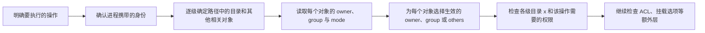

Linux 文件权限解决的是：**一个进程以什么身份，对某个文件系统对象执行某项操作时，系统是否允许**。进程是程序一次运行形成的执行实例；进程、程序和服务的区别见 [[Linux 进程与系统资源常用命令]]。

因此，只背 `rwx`（读、写、执行或穿过）、几个用于修改权限模式的 `chmod` 示例，或把 `sudo`（经过检查后，以目标身份启动命令）简化成“权限不足时就加上它”，都不能真正判断权限问题。需要把操作类型、进程身份、路径中的目录、目标对象元数据（对象保存的属性信息）以及其他访问控制层放在同一条判断链中理解。

> [!abstract] 本篇掌握目标
> - **必须熟练**：使用 `id` 查看当前进程身份，读懂 `ls -l` 与 `stat` 显示的符号权限和数字权限，区分文件与目录的 `rwx`，安全使用 `sudo` 与修改权限模式的 `chmod`。
> - **理解会查**：解释主组、补充组和登录会话的关系，判断所有者（owner）、所属组匹配者（group）、其他身份（others）中哪一组生效；区分修改 owner 的 `chown`、修改 group 的 `chgrp` 与限制新对象初始权限的 `umask`，按操作类型和路径逐级排查权限问题。
> - **认识即可**：访问控制列表（Access Control List，ACL）、特殊权限位、Linux capabilities（能力机制）、挂载选项和安全模块；遇到对应现象时知道继续查哪一层。
>
> 命令行如何拆解及怎样查参数见 [[Linux 命令行学习路线与命令地图]] 与 [[Shell 命令结构、类型与帮助系统]]；文件和目录操作见 [[Linux 文件与目录常用命令]]；重定向由谁执行见 [[Shell 标准流、管道、重定向与退出状态]]。

> [!tip] 建议阅读方式
> - 首次学习按第 1～7 节建立“模型 → 身份 → 权限表示 → 判断 → 修改 → 验证”主线，不必同时记住所有命令选项。
> - 第 8 节只需认识基础权限模式（mode）之外还存在哪些控制层；第 9、10 节用于形成排障顺序并按现象查阅。
> - 第 11 节只在确实需要创建 Ubuntu 管理用户时阅读，最后使用第 12 节自测，不把“读完”直接当作“已掌握”。

## 1. 先建立完整的权限判断模型

### 1.1 先问清楚正在执行什么操作

“能否访问一个路径”不是单一问题。不同操作可能检查不同对象。下表先用中文说明能力，再在括号中标出对应符号：`r` 表示读，`w` 表示写；`x` 对普通文件表示执行，对目录表示搜索或穿过。完整差异在第 4.3 节展开。

| 操作 | 主要检查对象 | 基础权限重点 |
| --- | --- | --- |
| 读取文件内容 | 路径中的目录和目标文件 | 目录可穿过（`x`），文件可读（`r`） |
| 修改或截断已有文件 | 路径中的目录和目标文件 | 目录可穿过（`x`），文件可写（`w`） |
| 执行文件 | 路径中的目录和目标文件 | 目录可穿过（`x`），文件可执行（`x`），并满足格式、解释器和挂载限制 |
| 创建新文件或目录 | 路径中的目录和目标父目录 | 路径目录可穿过（`x`），父目录通常可写且可穿过（`w+x`） |
| 删除目录项 | 路径中的目录和目标父目录 | 路径前缀中的各级目录均可穿过（`x`），目标父目录通常还需可写（因此通常需要 `w+x`）；共享目录还可能限制删除其他用户的条目 |
| 重命名或移动目录项 | 源路径、目标路径及两边父目录 | 源、目标路径前缀中的各级目录均可穿过（`x`），相关父目录通常还需可写（因此通常需要 `w+x`）；跨文件系统移动需再按复制与删除分别判断 |

这意味着“文件不可写”和“文件不可删除”不是同一个判断。排查前必须先明确：要读内容、改内容、执行、创建、删除，还是重命名。

### 1.2 把进程身份、路径和对象元数据放在一起

在终端中运行一条命令时，Shell（命令解释器）会解析输入并启动进程。这个进程携带用户和用户组身份；普通文件、目录、符号链接（保存另一段路径引用的对象）等文件系统对象则保存或关联各自的元数据，具体对象类型见 [[Linux 文件与目录常用命令#1. 先理解路径与文件对象]]。

本篇使用以下三个英文标签描述对象元数据：owner 是所有者，group 是所属组，mode 是包含文件类型和权限位的权限模式。others 不是对象上保存的第三个所有者，而是访问时既不匹配 owner、也没有命中 group 的其余身份。系统结合操作类型、进程身份、路径中的目录以及相关对象状态，判断本次操作是否允许。



这里的“相关对象”不一定只是路径末尾的文件。目录项是父目录保存的“名称与对象”对应记录；创建、删除和重命名主要修改父目录中的目录项，因此必须检查父目录。

### 1.3 分清账号数据、进程状态和文件元数据

首次阅读时，只需先看清这些状态分别保存在哪里、由谁携带以及何时变化，不必一次记住统一身份查询、sudo 记住密码验证的方式或 `umask` 的全部细节。下表是一张导航图，不要求此时已经会使用其中所有命令；后文会逐项展开。

本篇所说的“当前进程”，是指此刻正在执行操作、其状态正被读取或将参与权限判断的那个进程，不固定等同于登录账号或当前 Shell。在交互式终端中，直接执行 Shell 内建命令时通常是当前 Shell 进程；运行外部命令时通常是 Shell 启动的命令进程。普通子进程会从父进程继承身份和 `umask` 的初始值，但两者仍是独立进程；子进程随后改变自己的状态，不会反向改变父进程。

| 状态 | 保存在哪里 | 何时生效 | 持续到何时 |
| --- | --- | --- | --- |
| 用户名与用户数字标识（UID）、组名与组数字标识（GID）的映射 | 本地账号数据库或系统统一查询的身份来源 | 账号数据修改后可被新查询看到 | 直到账号数据再次修改 |
| 当前进程用于日常访问判断的用户、组与补充组身份 | 进程凭据，也就是进程携带的身份数据 | 登录或启动进程时取得 | 进程结束；子进程继承一份 |
| 文件的所有者、所属组与权限模式（owner、group、mode） | 文件系统对象的元数据 | `chown`、`chgrp`、`chmod` 成功后立即生效 | 直到再次修改或对象被删除、替换 |
| `sudo` 命令的目标身份 | `sudo` 启动的目标进程 | 该命令启动时 | 目标进程及其子进程结束 |
| `sudo` 记住的密码验证状态 | sudo 实现与本机设置维护的记录 | 密码验证成功或执行 `sudo -v` 后 | 由实现和本机设置决定，也可用 `sudo -k` 请求失效 |
| `umask` | 每个进程携带的创建权限屏蔽状态 | 进程启动时从父进程继承，或该进程主动修改后 | 该进程再次修改或结束；子进程继承当时的值 |

后文遇到命令时，都应回到这张表判断：它读取或修改的是账号数据、进程身份、已有文件元数据，还是影响以后创建对象的进程状态。

## 2. 用户、用户组与进程身份

第 1.3 节已经区分了账号数据与进程状态。本节只展开这两层：先认识用户和组的数字标识，再理解登录过程如何根据账号数据初始化进程身份，最后分别观察两层状态及其生效周期。

### 2.1 名称是给人看的，UID/GID 才参与判断

Linux 使用用户数字标识（User Identifier，UID）表示用户身份，使用组数字标识（Group Identifier，GID）表示用户组。用户名和组名是便于人类识别的名称映射；真正保存到进程凭据和文件元数据中的是数字标识。

用户与用户组是两类不同对象：一个 UID 标识一个用户身份，一个 GID 标识一个组身份；同一个用户可以与多个组建立关系。同名用户在不同机器上可能拥有不同 UID，因此复制文件、迁移磁盘或使用容器时不能只比较名称。

先用一条命令观察当前身份的整体形状：

**执行位置：Linux 主机（任意目录，只读）**

```bash
id
```

普通登录会话中，`id` 的常见输出包含 `uid=...`、`gid=...` 和 `groups=...` 三部分。首次阅读先辨认它们分别是当前用户身份、一个当前组身份和组身份总览；为什么一个进程会同时出现一个与多个组标识，下一节再解释。这里仅把完整输出作为身份结构地图，具体选项和输出含义统一放在 2.3 节展开。

### 2.2 账号记录如何成为进程身份

账号数据描述系统知道哪些用户和组，以及它们之间的成员关系；进程凭据描述一个正在运行的进程此刻携带什么身份。登录流程会读取账号数据并据此初始化新会话的进程凭据，但进程凭据不是对账号记录的实时引用，而是进程持有的状态。

从日常文件访问角度，可以先建立下面的对应关系：

| 账号层信息 | 新登录会话中的进程状态 | 日常作用 |
| --- | --- | --- |
| 用户 UID | 当前用于访问判断的用户身份 | 与文件系统对象的 owner UID 比较 |
| 账号主 GID | 通常初始化为进程的当前有效 GID | 普通情况下作为新建对象的所属组 |
| 补充组成员关系 | 初始化为进程携带的补充 GID 列表 | 让进程可以匹配多个组拥有的资源 |

因此，一个普通进程通常同时携带：

- 一个当前有效 GID：普通登录会话中通常等于账号主 GID，新建文件在普通情况下会以它作为所属组。
- 零个或多个补充 GID：让同一个用户能够访问多个组拥有的资源。

判断基础 group 权限时，对象的 group GID 只要匹配进程的当前有效 GID 或补充 GID 之一，就属于 group 匹配；系统不会因为一个用户属于多个组而把多组权限相加。

普通子进程会继承父进程当时的身份状态。特殊程序可以改变自身或其子进程的身份，而不必修改账号数据。

以上描述的是普通情况。共享目录还可能设置组继承规则，使新对象继承父目录的所属组，而不是使用创建进程的有效 GID；对应机制在后文认识特殊权限位时再展开。

### 2.3 用 id 与 getent 分别观察两层状态

先问清楚需要观察的是“当前进程实际携带的身份”，还是“账号来源目前记录的身份”。两者在普通登录后通常一致，但含义和生命周期不同。

#### 观察当前进程继承的身份

**执行位置：Linux 主机（任意目录，只读）**

```bash
whoami
id
id -u
id -un
id -g
id -gn
id -Gn
groups
```

这些命令通常由当前 Shell 启动，因此会读取命令进程从 Shell 继承的身份：

- `whoami` 输出命令进程当前有效 UID 对应的用户名；在普通情况下等价于 `id -un`。
- 不带用户名的 `id` 显示命令进程的用户和组身份总览。
- `id -u` 只输出当前有效 UID；追加 `-n` 后，`id -un` 把数字标识显示为当前用户名。
- `id -g` 只输出当前有效 GID；追加 `-n` 后，`id -gn` 把数字标识显示为当前有效组名。
- `id -Gn` 与不带用户名的 `groups` 都用于查看当前命令报告的组名；在普通登录会话中，可以把结果理解为当前有效组与补充组的整体视图。

#### 查询账号来源记录的身份

用户和组不一定只来自 `/etc/passwd` 与 `/etc/group`。Name Service Switch（名称服务切换机制，NSS）可以把本地文件、网络目录和集中身份服务等来源提供给统一查询，因此通用查询优先使用 `getent`。

下面以当前用户名为查询键，对比按名称解析的账号信息：

**执行位置：Linux 主机（任意目录，只读）**

```bash
account_name="$(id -un)"
id "$account_name"
getent passwd "$account_name"
getent group "$(id -gn "$account_name")"
```

- 为 `id` 指定用户名时，它查询该账号当前可解析到的用户与组信息，不是在读取某个同名运行进程。
- `getent passwd` 和 `getent group` 查询 NSS 当前能够解析的账号数据，不等同于直接读取本地文件。
- `getent group GROUP_NAME` 的成员列表主要记录显式加入该组的成员；用户的主 GID 位于用户账号条目中，因此不能只看这份成员列表判断用户是否属于该组，应结合 `id USER_NAME` 核对。

#### 实测：主组关系不依赖 group 条目的成员列表

以下结果由用户于 **2026-08-21** 在 Linux 虚拟机中执行后提供。为保持通用笔记的项目中立和隐私边界，用户名及其家目录已泛化为 `devuser`；UID、GID、字段结构和 group 条目末尾为空这一结果保持不变。

```text
$ account_name='devuser'
$ getent passwd "$account_name"
devuser:x:1000:1000:devuser:/home/devuser:/bin/bash

$ getent group "$(id -gn "$account_name")"
devuser:x:1000:
```

- `passwd` 结果依次表示用户名、密码占位字段、UID、主 GID、备注、家目录和登录 Shell。这里的 UID 与主 GID 都是 `1000`；`x` 是密码占位标记，不是真实密码。
- `group` 结果表示组名、密码占位字段、GID 和显式成员列表。末尾冒号后没有内容，说明这条 group 记录没有列出显式成员。
- 用户账号的主 GID `1000` 与该组的 GID `1000` 相同，因此 `devuser` 仍以主组关系属于该组。这个结果直接说明：**group 条目的成员列表为空，不等于用户不属于该组**。

### 2.4 为什么加入新组后旧终端没有变化

管理员把用户加入新组后，身份源及其缓存更新完成，按用户名进行的新查询可以看到新的账号关系；已经运行的 Shell 仍携带登录时取得的旧补充组列表，它启动的普通子进程也会继续继承这份旧状态。

可以对比：

```bash
account_name="$(id -un)"
id                   # 查看命令进程从当前 Shell 继承的身份
id "$account_name"   # 按用户名查询当前可解析的账号信息
```

两次结果不一致时，不应把账号配置已经更新误判为旧会话已经获得新组身份。

最可靠的生效方式是退出并建立新的控制台或 SSH 登录会话，再用不带用户名的 `id` 验证。`newgrp` 可以启动一个使用新组身份的子 Shell，但会引入有效组和嵌套 Shell 变化，不应代替最终的新会话验证。

到这里，第 3 节的 `sudo` 就可以理解为：它检查当前账号是否被允许后，启动一个具有目标身份的新进程；它不会修改账号数据，也不会让当前 Shell 永久改变身份。

## 3. root 与 sudo：改变目标进程身份

### 3.1 root 是特殊身份，sudo 只为目标命令切换身份

root 是 UID 为 `0` 的用户身份。在现代 Linux 中，capabilities（能力机制）把传统 root 权力拆分成更小的能力单元；root 进程通常仍携带能够绕过多种普通权限检查的能力。因此，不应使用 root 的访问结果证明普通用户也有权限。

Ubuntu 通常禁用 root 账号的直接密码登录，但 root 身份仍然存在。`sudo` 会先检查当前账号是否被允许，再以另一个目标用户身份运行指定命令；默认目标通常是 root，但 `sudo` 并不等同于“给当前 Shell 永久升级”。

先用一个完整例子观察它的边界：

```bash
id
sudo id
id
```

这三条命令通常经历以下过程：

1. 第一次 `id` 由当前普通用户身份运行，因此显示当前用户和组。
2. `sudo id` 请求以默认目标用户 root 运行 `id`。sudo 先检查当前账号是否允许这样做；如果本机要求且当前没有可用的密码验证记录，还会提示输入当前用户的密码。
3. 检查通过后，sudo 启动一个具有目标身份的新 `id` 进程，因此中间结果通常显示 UID 为 `0`。
4. 中间的 `id` 结束后，sudo 启动的目标进程也随之结束。最后一次 `id` 仍显示普通用户，因为原来的 Shell 从未变成 root。

这里必须分清两个问题：**密码正确只确认当前操作者的身份；本机的授权规则才决定这个用户可以通过 sudo 运行哪些命令、使用什么目标身份**。密码正确不等于所有命令都会获准；某些授权也可以配置成不要求密码。初学阶段先记住这一区别，不需要先学习 sudo 的插件结构和规则文件格式。

sudo 允许命令运行后，目标进程访问文件时仍要继续检查文件 mode、ACL、挂载选项和安全模块等。sudo 解决的是“能否以目标身份启动这条命令”，不是替代本篇其他权限判断。

### 3.2 读懂 --version、-l、-v 与 -k

先用 `sudo --version` 确认本机实现，再用 `sudo -l` 查看当前用户被允许做什么；`sudo -v` 与 `sudo -k` 只处理密码验证记录。不同实现和版本的选项、输出与记录方式可能不同；本机的 `sudo --help` 与 `man sudo` 是最终依据。

#### 先用 sudo --version 确认版本

**执行位置：Linux 主机（普通用户会话）**

```bash
sudo --version
```

以下结果由用户于 **2026-08-21** 在 Linux 虚拟机中执行后提供。用户名和主机名与这条命令无关，因此没有写入输出；版本号及各组件名称保持不变。

```text
$ sudo --version
Sudo version 1.9.15p5
Sudoers policy plugin version 1.9.15p5
Sudoers file grammar version 50
Sudoers I/O plugin version 1.9.15p5
Sudoers audit plugin version 1.9.15p5
```

首次阅读只需抓住两点：

- 第一行说明当前命令是原始 sudo 项目的 `1.9.15p5`，不是 sudo-rs。
- 后四行是 sudoers 相关组件及其版本。第二行中的 `policy plugin` 可以直接理解为“负责检查授权规则的组件”；`grammar`、`I/O` 和 `audit` 分别与规则语法、输入输出和审计有关。它们都不表示当前用户的权限大小，初学阶段不需要继续展开。

因此，`sudo --version` 回答“本机在使用什么实现”，不回答“当前用户能运行什么”。后一个问题要使用 `sudo -l`。

#### 用 sudo -l 读取当前主机的有效授权

**执行位置：Linux 主机（普通用户会话）**

```bash
sudo -l
```

`sudo -l` 中的 `l` 表示 list（列出）。不附带目标命令时，它列出当前用户在当前主机上被允许执行的 sudo 操作；它不会执行输出中列出的管理命令，但本机可能要求先验证密码。

以下结果同样由用户于 **2026-08-21** 在 Linux 虚拟机中执行后提供。为保持通用笔记的项目中立和隐私边界，用户名与主机名分别泛化为 `devuser` 和 `linux-vm`；Defaults、路径和授权规则保持不变。

```text
$ sudo -l
[sudo] password for devuser:
Matching Defaults entries for devuser on linux-vm:
    env_reset, mail_badpass,
    secure_path=/usr/local/sbin\:/usr/local/bin\:/usr/sbin\:/usr/bin\:/sbin\:/bin\:/snap/bin, use_pty

User devuser may run the following commands on linux-vm:
    (ALL : ALL) ALL
```

先把输出分成密码提示、匹配到的 Defaults 和允许的命令三部分：

| 输出片段 | 含义 |
| --- | --- |
| `[sudo] password for devuser:` | 这次列出权限前需要验证当前用户的密码；密码正确不等于自动获得所有 sudo 权限 |
| `Matching Defaults entries ...` | 下面列出的是对该用户和当前主机实际匹配到的默认执行设置，不是允许的命令清单 |
| `env_reset` | 以受控制的基础环境启动目标命令，再按规则保留或加入部分环境变量；它不表示环境完全为空 |
| `mail_badpass` | 当前用户没有输入正确密码时，请求向配置的收件人发送邮件；能否实际送达还取决于本机邮件配置 |
| `secure_path=...` | 使用列出的值替换目标命令的 `PATH`，避免直接沿用发起者的路径搜索顺序；显示中的 `\:` 是转义形式，实际仍是用冒号分隔的路径列表 |
| `use_pty` | sudo 自身连接到终端时，在新的伪终端（pseudo-terminal，PTY）中运行目标命令 |
| `User ... may run ...` | 从这里开始才是当前用户在当前主机上被允许执行的命令 |

最后一行中，括号内说明可以选择的目标身份，括号外说明允许的命令范围：

```text
( ALL : ALL ) ALL
  │     │     └─ 允许的命令：所有命令
  │     └─────── 允许选择的目标组：所有组
  └───────────── 允许选择的目标用户：所有用户
```

- 第一个 `ALL` 表示可以通过 `sudo -u` 选择任意目标用户；省略 `-u` 时，默认目标通常是 root。
- 冒号后的第二个 `ALL` 表示可以通过 `sudo -g` 选择任意目标组。
- 括号外的最后一个 `ALL` 表示 sudoers 命令范围为所有命令。

因此，这位用户在该主机上拥有范围很宽的 sudo 管理授权，可以通过 sudo 以任意目标用户和组运行任意命令。它不表示当前 Shell 已经成为 root，也不表示不写 `sudo` 就能获得目标身份；目标进程还可能受到只读挂载、安全模块和程序自身规则等限制。

密码提示只说明这一次 `sudo -l` 需要验证密码。sudo 可能暂时记住一次成功验证，因此后续命令不一定立刻再次询问；不能从这一行推出“每条命令每次都会询问密码”。

#### 再用 sudo -v 与 sudo -k 处理认证状态

**执行位置：Linux 主机（普通用户会话）**

```bash
sudo -v
sudo -k
```

- `sudo -v` 在需要时验证密码，并刷新 sudo 记住的验证记录；它不执行目标管理命令，也不会增加允许运行的命令。
- `sudo -k` 请求让当前会话中记住的验证记录失效；下一次需要密码的 sudo 操作应重新验证。

sudo 记住密码验证的时间没有适用于所有 Linux 主机的固定值。实现和管理员设置都可能改变其范围与持续时间，学习时不应背一个绝对分钟数。

> [!note] Ubuntu 的默认 sudo 提供者发生过变化
> Ubuntu 25.10 起默认由 Rust 实现的 `sudo-rs` 提供 `sudo`；原始 sudo 在这些版本中仍以 `sudo.ws`、`visudo.ws` 等名称保留。更早的 Ubuntu 或其他发行版可能直接把原始实现安装为 `sudo`，目标主机也可能调整默认提供者。因此，本机的 `sudo --version`、`sudo --help` 和手册仍是最终依据。该版本信息于 **2026-08-21** 根据 [Ubuntu 25.10 发布说明](https://documentation.ubuntu.com/release-notes/25.10/) 与 [Ubuntu Server sudo-rs 差异说明](https://ubuntu.com/server/docs/reference/other-tools/sudo-rs/) 重新核对。

### 3.3 sudo 不会自动提升 Shell 处理的重定向

下面的结构中，`>` 由当前 Shell 在启动 `sudo` 前打开目标文件：

```text
sudo some-command > /root/result.txt
```

因此，即使 `some-command` 以 root 身份运行，当前 Shell 仍可能因为无权打开 `/root/result.txt` 而失败。需要修改系统配置时，应先确认目标、备份和恢复方法，再优先使用针对编辑场景设计的 `sudoedit`：

```text
sudoedit /etc/example.conf
```

重定向、管道与 `sudo tee` 的执行边界详见 [[Shell 标准流、管道、重定向与退出状态]]。

### 3.4 sudo -i：启动目标用户的登录 Shell

前面的 `sudo id` 只把 `id` 作为目标命令；第 3.3 节的重定向示例则说明，外层普通用户 Shell 仍负责解析 `>`。`sudo -i` 请求的是另一种边界：让 sudo 启动目标用户的登录 Shell，之后在这个 Shell 中输入的命令都会继承目标身份，直到该 Shell 退出。

`-i` 是 `--login` 的短选项。没有同时指定 `-u` 时，默认目标通常是 root；获得相应授权后，也可以使用下面的结构进入其他目标用户的登录 Shell：

```text
sudo -u USER_NAME -i
```

这不是使用 root 密码直接登录。sudo 仍会先按本机规则检查当前用户是否获准以目标身份启动该登录 Shell，并在需要时验证密码；检查通过后，它才启动新的目标 Shell。外层 Shell 仍然存在，只是在等待这个子 Shell 结束。

登录 Shell 是以登录模式启动的 Shell。它使用目标账号记录中的登录 Shell，并读取该 Shell 的登录启动文件。原始 sudo 还会尝试先切换到目标用户的家目录，并建立与登录时相似的环境；具体会读取哪些文件、保留哪些变量，还会受到 sudo 实现、授权规则、PAM（可插拔认证模块）和目标 Shell 的影响，不能把它理解为与控制台或 SSH 登录完全相同。本机的 `sudo --help` 与 `man sudo` 仍是最终依据。

| 对比点 | `sudo COMMAND` | `sudo -i` |
| --- | --- | --- |
| 直接启动的目标 | 指定命令 | 目标用户的登录 Shell |
| 身份影响范围 | 该目标命令及其子进程 | 登录 Shell，以及从中启动的命令 |
| 工作目录与环境 | 不主动请求完整登录环境；仍由实现和本机规则控制 | 通常进入目标用户家目录，使用类似登录时的环境并读取登录启动文件 |
| 外层 Shell | 等待目标命令结束后继续 | 在目标登录 Shell 运行期间保持等待，执行 `exit` 后继续 |

#### 用只读观察确认进入和退出边界

下面显式执行的查询命令不修改文件或系统配置，但 `sudo -i` 可能刷新 sudo 记住的密码验证记录，并会读取目标用户的登录启动文件。应在登录配置来源明确的 Linux 学习环境中逐步执行，并只输入本节列出的查询命令。

先在普通用户 Shell 中读取 root 的账号记录，并记录当前身份、目录与家目录：

**执行位置：Linux 学习主机（具有相应 sudo 授权的普通用户会话，任意目录）**

```bash
getent passwd root
id
pwd
printf 'HOME=%s\n' "$HOME"
sudo -i
```

`getent passwd root` 的第六、第七个字段分别给出 root 的家目录和登录 Shell。`sudo -i` 检查通过后，当前终端进入新启动的目标登录 Shell；此时只执行以下查询，然后立即退出：

```bash
id
pwd
printf 'HOME=%s\n' "$HOME"
exit
```

默认目标为 root 时，`id` 通常显示 UID 为 `0`，`pwd` 与 `HOME` 通常对应 root 账号记录中的家目录。Shell 提示符可能变化，但提示符可以被配置，不能代替 `id` 作为身份依据。

`exit` 只结束刚才的目标登录 Shell。回到外层 Shell 后再次检查：

```bash
id
pwd
printf 'HOME=%s\n' "$HOME"
```

这些结果应恢复为进入前的普通用户身份、工作目录和家目录，因为外层 Shell 从未被原地替换。`exit` 不保证同时清除 sudo 记住的密码验证记录；需要请求让该记录失效时，仍使用第 3.2 节介绍的 `sudo -k`。

`sudo -i` 后也可以指定命令，原始 sudo 会把该命令交给目标登录 Shell 处理。单条操作如果不需要目标用户的登录环境，仍优先使用 `sudo COMMAND`，避免额外引入登录启动文件、环境和 Shell 解析差异。

只有确实需要目标用户的登录环境，或需要在同一目标环境中完成一组短小、边界明确的管理检查时，才考虑 `sudo -i`。即使某条 `sudo COMMAND` 已获允许，`sudo -i` 仍可能因授权范围不包含目标 Shell 而被拒绝；此时应使用 `sudo -l` 核对现有授权，不要为了进入 root Shell 而擅自扩大 sudoers 规则。

### 3.5 把 sudo 限制在明确的管理操作中

无论使用单条 sudo 命令还是目标登录 Shell，都应先说明为什么该操作需要目标身份，并把命令、对象和持续时间限制在实际管理需求内。不要把 `sudo` 当作绕过 `Permission denied` 的默认前缀；权限错误仍应按第 9 节先收集证据。

不要习惯性运行 `sudo git`、`sudo go`、`sudo mvn`、`sudo npm`，也不要在 `sudo -i` 启动的 Shell 中运行这些日常开发工具或以 root 身份启动 IDE。构建产物、缓存和配置会由 root 创建，普通用户随后就会遇到所有权问题。

修改 sudoers 授权规则属于高风险管理任务，应使用与本机实现配套的 `visudo` 进行语法检查；不要直接用普通编辑器盲改 `/etc/sudoers`。

## 4. 读懂对象元数据与权限表示

### 4.1 owner、group 与 mode 保存在哪里

路径中的名称是父目录保存的目录项，它指向实际文件系统对象；owner、group 与 mode 属于对象元数据。许多 Linux 文件系统使用 inode（index node，索引节点）记录这类对象信息；inode 与文件系统对象记录的进一步说明见 [[Linux 文件与目录常用命令#4.4 检查目录占用与文件系统容量]]。

- owner：所有者 UID。
- group：所属组 GID。
- mode：文件类型、特殊权限位以及 owner、group、others 三组 `rwx` 权限位。
- others：既不匹配 owner，也没有命中文件所属组的其余访问身份。

**执行位置：Linux 主机（任意目录，只读）**

```bash
stat -c 'type=%F owner=%U(%u) group=%G(%g) symbolic=%A numeric=%a path=%n' "$HOME"
```

这条命令把名称和数字身份、符号权限和数字权限放在同一行，便于确认系统实际保存的元数据。其中 `%A` 显示符号形式，`%a` 显示八进制数字形式。两者描述的是同一组 mode 位。

### 4.2 先拆开 ls -l 的权限字段

假设看到：

```text
drwxr-x--- 5 alice developers 4096 Jul 25 17:00 src
```

权限字段可以拆成：

```text
d | rwx | r-x | ---
│   │     │     └─ others
│   │     └─────── group
│   └───────────── owner
└───────────────── 文件类型：d 表示目录，- 表示普通文件
```

`ls -l` 的第一个字符代表文件类型，与权限无关。后面三组 `rwx` 分别代表 owner、group、others 三种身份的访问权限。

### 4.3 文件与目录的 rwx 含义不同

`r`、`w`、`x` 使用相同的字母表示，但实际允许的操作取决于对象类型。这里先介绍这些权限位对文件和目录分别意味着什么：

| 权限 | 普通文件 | 目录 |
| --- | --- | --- |
| `r` | 读取文件内容 | 读取目录项名称，也就是列出其中有哪些名字 |
| `w` | 修改、截断文件内容 | 创建、删除、重命名目录项，通常还需要 `x` 配合 |
| `x` | 尝试把文件作为程序执行 | 搜索或穿过目录，并访问其中已知名称对应的对象 |

### 4.4 每组三位 rwx 对应一个八进制数字

一组 `rwx` 由三个“允许或不允许”的二进制位组成，可以表示从 `0` 到 `7` 的八种组合，所以 mode 使用八进制：每个数字对应一组三位权限。

- `r=4`
- `w=2`
- `x=1`

同一组中把已有权限相加：

| 数字 | 符号 | 含义 |
| --- | --- | --- |
| `0` | `---` | 无权限 |
| `1` | `--x` | 仅执行或穿过 |
| `2` | `-w-` | 仅写 |
| `3` | `-wx` | 写加执行 |
| `4` | `r--` | 仅读 |
| `5` | `r-x` | 读加执行 |
| `6` | `rw-` | 读加写 |
| `7` | `rwx` | 读、写、执行 |

后三位依次对应 owner、group、others：

```text
rwx  r-x  ---  →  7 5 0
owner group others
```

因此，`750` 表示 owner 为 `rwx`、group 为 `r-x`、others 为 `---`。

### 4.5 0750 前面的 0 是什么

完整 mode 常写成四位八进制数：

```text
0 7 5 0
│ │ │ └─ others
│ │ └─── group
│ └───── owner
└─────── 特殊权限位
```

`0750` 的第一位是 `0`，表示没有设置 setuid、setgid 或 sticky bit；后三位仍是 `rwxr-x---`。在 `chmod`、`install -m` 等接受 mode 的命令中，`750` 与 `0750` 表示相同的普通权限，四位写法把特殊位位置表达得更明确。

`stat -c %a` 常输出不带前导 `0` 的 `750`，这只是显示形式不同。特殊权限位的具体含义放在第 8 节认识，不在这里打断普通 `rwx` 主线。

### 4.6 常见 mode 必须结合对象类型理解

| mode | 普通文件的常见含义 | 目录的常见含义 |
| --- | --- | --- |
| `0600` / `0700` | `0600`：仅 owner 可读写 | `0700`：仅 owner 可读、写、进入 |
| `0640` / `0750` | `0640`：owner 读写、group 只读 | `0750`：owner 全部、group 可读和进入 |
| `0644` / `0755` | `0644`：所有人可读，只有 owner 可写 | `0755`：所有人可读和进入，只有 owner 可写 |

这些是解释示例，不是所有场景的统一推荐值。配置文件、密钥、可执行程序、共享目录和 Web 内容的需求不同。

## 5. 判断一次操作是否允许

### 5.1 按同一顺序完成一次权限判断

面对一个具体操作时，不要从某个 mode 数字或 `chmod` 命令直接开始。把第 1 节的完整模型落实为以下顺序：

1. 明确要读取、修改、执行、创建、删除还是重命名，并找出真正相关的对象。
2. 确认发起操作的进程实际携带哪些用户和组身份。
3. 沿路径逐级确定需要检查的目录，并读取各级目录、目标对象或父目录的元数据。
4. 对每个对象选择 owner、group、others 中唯一生效的一组权限。
5. 检查该操作需要的权限；基础 mode 无法解释结果时，再进入其他访问控制层。
6. 使用实际操作或安全的等价方式验证，而不是只看元数据或命令退出码。

后续小节分别展开权限组选择、路径中的目录、父目录操作和文件执行条件。

### 5.2 owner、group、others 只选择一组

忽略 ACL 等额外机制时，系统按以下顺序选择**唯一一组**权限：

1. 如果进程用于文件访问的 UID 等于文件 owner UID，只检查 owner 权限。
2. 否则，如果文件 GID 命中进程用于文件访问的 GID 或任一补充 GID，只检查 group 权限。
3. 否则，只检查 others 权限。

三组权限不会叠加，也不会在前一组拒绝后继续尝试下一组。

例如，文件属于 `alice:developers`，owner 权限是 `---`、group 权限是 `r--`、others 权限是 `---`：

- `alice` 匹配 owner，只能使用 owner 的 `---`；即使 `alice` 也属于 `developers`，也不能退回使用 group 的 `r--`。
- 不是 owner、但属于 `developers` 的 `bob` 使用 group 的 `r--`。
- 既不是 owner、也不属于该组的用户使用 others 的 `---`。

> [!note] 这是基础 mode 位的主线
> ACL 会扩展基础选择算法；capabilities 可能绕过部分传统权限检查；安全模块还可能施加额外限制。基础 mode 与实际结果不符时，再进入第 8、9 节。

### 5.3 目录的 x 是整条路径能否通过的门槛

访问 `/home/alice/src/app/config.yml` 时，进程需要对路径中的 `/home`、`/home/alice`、`src` 和 `app` 都拥有目录 `x` 权限。任一级缺少 `x`，即使最终文件为当前身份提供了 `r`，也可能得到 `Permission denied`。

`namei -l` 可以逐级展开路径：

```bash
namei -l "$HOME/src"
```

`namei -l` 展示每一级组件的类型、owner、group 和 mode；读者仍需结合 `id` 选择每一级实际生效的权限组。不要只检查最终目标的 `ls -l` 输出。

### 5.4 创建、删除和重命名主要检查父目录

几种容易误解的目录组合：

- 目录只有 `r`、没有 `x`：通常可以读取目录项名称，却不能正常访问名称对应的元数据或内容。
- 目录只有 `x`、没有 `r`：知道准确名称时可能访问该对象，但不能正常列出目录内容。
- 目录有 `w`、没有 `x`：通常仍不能完成创建、删除或重命名。
- 删除文件主要修改父目录中的目录项，因此通常取决于父目录的 `w+x`，不要求文件本身可写。
- 跨目录移动通常需要同时修改源目录和目标目录中的目录项，因此要检查两边父目录。

共享目录还可能使用 sticky bit 限制删除或重命名：即使目录可写，普通用户也不能随意处理其他用户拥有的条目。`/tmp` 是常见例子。

### 5.5 文件有 x 不代表一定能成功执行

文件 `x` 只通过基础权限这一层。成功执行还可能要求：

- 文件格式有效，或脚本首行通过 `#!` 指定了可用的解释器。
- 文件所在文件系统没有使用 `noexec`（禁止从该挂载点直接执行程序）等挂载限制；文件系统和挂载点的关系见 [[Linux 磁盘、分区、文件系统与 LVM 基础]]。
- 路径中的目录可以穿过。
- ACL 和安全模块没有继续拒绝。
- 解释器、负责装载共享库的动态链接器以及程序依赖可用。

因此，看到 `x` 位或得到一次快速的可执行性判断，都不能单独证明程序一定能成功运行。

## 6. 修改已有对象与控制新对象

这些命令修改的状态不同：

| 命令 | 修改什么 | 是否影响已有对象 | 是否决定未来新对象的默认权限 |
| --- | --- | --- | --- |
| `chmod` | mode 权限位 | 是 | 否 |
| `chown` | owner，可同时改 group | 是 | 否 |
| `chgrp` | group | 是 | 否 |
| `umask` | 当前进程的创建权限屏蔽规则 | 否 | 是，只影响该进程以后创建的对象 |
| `install -m` | 创建或安装对象，并为本次处理显式设置 mode | 取决于目标和选项 | 只针对这次命令处理的对象 |

### 6.1 chmod 的符号模式与数字模式

结构示例：

```text
chmod u+x script.sh
chmod g-w shared.txt
chmod o= config.ini    # 无 rwx 表示设置为空权限
chmod 0640 config.ini
```

- `u`、`g`、`o`、`a` 分别表示 owner、group、others、全部三组。
- `+` 增加指定权限，`-` 移除指定权限，`=` 把指定组精确设为给出的组合。
- 符号模式适合表达相对变化，例如“只给 owner 增加执行权限”。
- 数字模式表达目标组合；例如 `0640` 会把普通 `rwx` 位设置为 `rw-r-----`，原先存在但目标中没有的 `x` 会被移除。

通常只有文件 owner 或具有相应特权的进程可以修改 mode。数字模式虽然简短，但执行前必须先把每一位翻译回 `rwx`。

#### `-R` 会把修改范围扩展到整棵目录树

对目录执行不带 `-R` 的 `chmod`，只修改这个目录对象自身的 mode，不会自动修改其中的后代。GNU Coreutils 的 `-R` 是 `--recursive`（递归）的短选项：它不是另一条命令，而是让 `chmod` 从指定目录开始，继续进入各级子目录，对这个目录及其内容应用同一条 mode 变更规则。

以下只是需要替换占位符的语法骨架，不能原样执行：

```text
chmod -R --preserve-root MODE DIRECTORY
```

- `MODE` 可以是数字模式或符号模式；数字模式会把每个处理对象的普通 `rwx` 位设置为同一个目标组合，符号模式则根据每个对象原来的 mode 应用同一条增、减或精确设置规则。
- `DIRECTORY` 必须替换为已经核对的明确目录。命令行只写出一个目录，不代表只修改一个对象；实际对象数量取决于整棵目录树。

递归处理时，普通文件和目录对 `x` 的需求不同，不能假设同一个数字 mode 总是适合二者：

- `chmod -R 0644 DIRECTORY` 会移除目录的 `x`，使目录无法被正常穿过。
- `chmod -R 0755 DIRECTORY` 会给普通文件也设置执行权限，即使它们并不是程序或脚本。

符号模式中的大写 `X` 表示“有条件地设置执行或搜索权限”：对象是目录，或者普通文件原本已有任一执行位时，`X` 才会影响它。例如，`u+rwX` 会给 owner 增加读写权限，并只给目录或原本可执行的文件增加 owner 的 `x`。这只是避免把所有普通文件一律变成可执行文件的一种表达能力，不代表任何目录树都应该使用这组权限。

> [!warning] 递归修改没有通用安全值
> - 执行前应先按 [[Linux 文件与目录常用命令#3.1 执行前核对|递归操作前的范围核对]] 确认目标目录及其后代，并额外识别符号链接和挂载点。
> - `--preserve-root` 只拒绝把 `/` 当作递归目标，不能防止选错其他目录，也不能阻止命令进入目标目录树内的挂载点。
> - 一棵目录树原本可能包含多种 mode；执行后再使用一次 `chmod -R OLD_MODE DIRECTORY`，通常无法恢复每个对象各自原来的权限。因此，修改重要目录树前必须准备能够保留原始元数据的备份、快照或清单。
> - 修改后既要复查实际对象的 mode，也要以真正需要访问它们的用户、服务或容器验证目标操作。符号链接本身、指向对象和递归遍历策略的区别在第 6.3 节继续说明。

### 6.2 用 chown 与 chgrp 修改 owner 和 group

`chown` 修改对象的 owner，也可以同时修改 group；`chgrp` 只修改 group。命令行可以使用用户和组的名称，但文件系统对象实际保存的是数字 UID 与 GID，名称只是系统查询后显示的映射。

日常需要识别以下写法；其中 `FILE...` 表示一个或多个已经核对的明确路径：

| 目的 | 语法骨架 | 实际变化 |
| --- | --- | --- |
| 只修改 owner | `chown USER_NAME FILE...` | owner 改变，group 保持不变 |
| 同时修改 owner 和 group | `chown USER_NAME:GROUP_NAME FILE...` | owner 与 group 同时改变 |
| 只修改 group | `chgrp GROUP_NAME FILE...` | group 改变，owner 保持不变 |
| 使用 `chown` 只修改 group | `chown :GROUP_NAME FILE...` | 在 GNU/Linux 上与相应的 `chgrp` 用法作用相同 |

这些命令不会重新计算普通 `rwx` 位，也不会自动把 `0600` 改成 `0640`。但是，归属变化可能改变后续访问结果，因为进程会根据新的 owner 和 group 重新选择实际生效的 owner、group 或 others 权限。

例如，一个对象的 mode 始终为 `0640`，也就是 owner 为 `rw-`、group 为 `r--`、others 没有权限。把对象的 group 从 `ops` 改为 `developers` 后，`r--` 本身没有变化，但它开始可能对 `developers` 组成员生效；只属于 `ops`、又不匹配 owner 的进程则不再因为原 group 获得读取权限。

普通用户通常不能把文件所有者转给任意用户，因此修改 owner 往往需要管理员权限。以文件 owner 身份运行的进程在系统规则允许时，可以把 group 改为自己所属的组；实际限制还可能受文件系统和挂载方式影响。是否使用 `sudo` 应由目标归属和所需权限决定，不能因为 `chown` 执行失败就直接把它当作固定前缀。

对单个对象，日常操作应形成“确认身份与对象 → 修改 → 复查 → 实际验证”的闭环。以下是需要替换占位符的语法骨架，不能原样执行：

```text
id
getent passwd USER_NAME
getent group GROUP_NAME
stat -c 'owner=%U(%u) group=%G(%g) symbolic=%A numeric=%a path=%n' -- TARGET_PATH

chown -- USER_NAME:GROUP_NAME TARGET_PATH
stat -c 'owner=%U(%u) group=%G(%g) symbolic=%A numeric=%a path=%n' -- TARGET_PATH
```

- `id` 确认当前进程身份；`getent` 确认目标名称能够解析到预期的账号记录。
- 如果 `TARGET_PATH` 可能是符号链接，应先按下一节确定要修改链接本身还是指向对象，并让修改前记录、变更命令和修改后验证始终针对同一个对象。
- 第一次 `stat` 保存修改前的名称、数字 UID/GID 和 mode；需要只改 group 时，把变更命令换成 `chgrp -- GROUP_NAME TARGET_PATH`。
- `--` 表示选项到此结束，使后面的 owner、group 和路径按操作数处理。
- 第二次 `stat` 只能证明元数据已经变化；仍应以真正需要访问该对象的用户、服务或容器重新验证目标操作。
- 如果结果不符合预期，应根据修改前记录恢复 owner 和 group，不凭印象猜测名称或数字 ID。

对目录执行普通 `chown` 或 `chgrp` 只修改目录对象本身，不会自动修改其中的后代。确实需要处理整棵目录树时，GNU Coreutils 使用 `-R` 表示递归：

```text
chown -R --preserve-root -- USER_NAME:GROUP_NAME DIRECTORY
chgrp -R --preserve-root -- GROUP_NAME DIRECTORY
```

递归前必须先确认目录树、符号链接和挂载点，并把目标限制为已审查的明确目录。`--preserve-root` 只拒绝把 `/` 当作递归目标，不能防止选错其他目录；符号链接本身与指向对象的选择、递归遍历风险和恢复顺序在下一节集中说明。

### 6.3 先决定操作符号链接还是其指向对象

符号链接（symbolic link）是一类保存另一段路径引用的文件系统对象。命令可以操作链接这条目录项，也可能沿着引用操作最终对象；链接目标不存在时，链接本身仍可能存在。对象模型和失效符号链接见 [[Linux 文件与目录常用命令#1. 先理解路径与文件对象]]。

#### 链接自身和指向对象拥有各自的元数据

链接自身与指向对象各自拥有 owner、group 和 mode，但这些属性在 Linux 上并不具有完全相同的作用：

- 普通符号链接自身的 owner 和 group 可以修改。在带有 sticky bit 的共享目录中判断谁能删除或重命名链接，以及启用了受保护符号链接规则时，链接 owner 都可能参与系统判断。
- Linux 普通符号链接自身的权限固定显示为 `0777`，不参与普通访问检查，也不能修改。链接指向对象的 mode 则会按普通文件或目录规则生效。

因此，“修改链接自身”对 `chmod` 与 `chown`、`chgrp` 不是同一件事：Linux 可以修改链接自身的 owner/group，却没有一组可供 `chmod` 修改并生效的普通符号链接权限位。

先使用与目标对象一致的观察方式：

- `stat PATH` 默认观察命令行参数所指的符号链接本身。
- `stat -L PATH` 观察符号链接指向的对象。
- `realpath -e PATH` 返回所有组件都存在时的规范化路径。

#### 非递归模式只需决定操作哪个对象

非递归是指没有使用 `-R`，命令只处理明确列出的路径，不继续遍历目录树。在 GNU Coreutils 中，命令行参数本身是符号链接时：

| 语法骨架 | 操作对象 | Linux 上的结果 |
| --- | --- | --- |
| `chmod MODE LINK_PATH` | 默认解引用，操作链接指向对象 | 修改指向对象的 mode |
| `chmod -h MODE LINK_PATH` | 请求操作链接自身 | 普通符号链接的 mode 不能修改；不得把这条语法当作 Linux 上有效的权限修改方法 |
| `chown USER_NAME:GROUP_NAME LINK_PATH` | 默认解引用，操作链接指向对象 | 修改指向对象的 owner/group |
| `chown -h USER_NAME:GROUP_NAME LINK_PATH` | 不解引用，操作链接自身 | 修改链接自身的 owner/group |
| `chgrp GROUP_NAME LINK_PATH` | 默认解引用，操作链接指向对象 | 修改指向对象的 group |
| `chgrp -h GROUP_NAME LINK_PATH` | 不解引用，操作链接自身 | 修改链接自身的 group |

这里的小写 `-h` 是 `--no-dereference`（不解引用）的短选项。GNU Coreutils 从 9.5 起才为 `chmod` 增加 `-h`、`-H`、`-L`、`-P` 和 `--dereference`；较旧的 GNU Coreutils 或其他实现可能不认识这些 `chmod` 选项。即使当前 `chmod` 支持 `-h`，底层系统不能修改链接 mode 时也可能不报告错误，因此必须使用 `chmod --version`、`chmod --help`、`man chmod` 和修改后的 `stat` 结果共同判断，不能只看退出码。

#### 递归模式还要决定是否沿链接进入目录树

使用 `-R` 后，需要分别回答两个问题：

1. **遇到一个符号链接时改谁**：`--dereference` 表示操作指向对象，小写 `-h` / `--no-dereference` 表示操作链接自身。
2. **符号链接指向目录时是否进入其中**：大写 `-H`、`-L`、`-P` 控制目录树的遍历边界，只在递归场景中有意义。

这里的“进入目录链接”是指沿着符号链接到达目标目录，再继续递归处理目标目录中的后代。

先固定一个目录树：

```text
project-link -> project/
project/
├── src/
└── shared-link -> /srv/shared/
```

- `project-link` 直接作为命令行中的路径参数，是递归起点，因此属于“命令行直接列出的目录链接”。
- `shared-link` 没有直接写在命令行中；命令进入 `project/` 后才会发现它，因此属于“递归途中遇到的目录链接”。

假设递归命令以 `project-link` 为起点，三个选项的区别是：

| 选项 | 是否进入起点链接 `project-link` 指向的 `project/` | 是否进入途中链接 `shared-link` 指向的 `/srv/shared/` | 最简记忆 |
| --- | --- | --- | --- |
| `-H`（half-logical，半逻辑） | **进入** | **不进入** | 只跟随命令行直接列出的目录链接 |
| `-L`（logical，逻辑） | **进入** | **进入** | 跟随所有遇到的目录链接，范围最大 |
| `-P`（physical，物理） | **不进入** | **不进入** | 不沿目录链接跨入另一棵目录树 |

如果命令行起点直接写真实目录 `project/`，而不是目录链接 `project-link`，那么三个选项都会正常进入 `project/`。此时 `-H` 与 `-P` 都不会进入里面的 `shared-link`，只有 `-L` 会进入；因此，就这里讨论的目录遍历而言，`-H` 只在“命令行递归起点本身是目录链接”时才与 `-P` 表现不同。

表中的“进入”只描述是否继续处理目标目录的后代，“不进入”不等于已经决定如何处理链接这个对象。三者也只对**指向目录的符号链接**有递归遍历意义；指向普通文件的符号链接没有可进入的后代，只需要判断修改链接还是其指向文件。

大写 `-H` 与小写 `-h` 只相差大小写，但职责完全不同：前者控制是否遍历命令行参数中的目录链接，后者控制修改链接自身还是指向对象。遍历选项与作用对象选项是两个维度，不能用其中一组选项推断另一组行为。

以下默认行为以 **GNU Coreutils 9.11** 为准，并于 **2026-08-22** 核对：

| 命令 | 未显式选择链接选项时的递归行为 |
| --- | --- |
| `chmod -R MODE PATH` | 默认遍历策略是 `-H`。命令行直接列出的链接按指向对象处理；如果它指向目录，还会进入该目录。递归途中遇到的符号链接默认不会继续遍历，也不会修改链接自身或其指向对象的 mode |
| `chown -R USER_NAME:GROUP_NAME PATH` | 默认使用 `-P` 且不解引用：不沿符号链接进入目录树；遇到符号链接时修改链接自身的 owner/group，不修改指向对象 |
| `chgrp -R GROUP_NAME PATH` | 默认使用 `-P` 且不解引用：不沿符号链接进入目录树；遇到符号链接时修改链接自身的 group，不修改指向对象 |

> [!warning] 不要把 `-L` 或 `--dereference` 当作递归修复的固定搭配
> `-L` 可能让命令越过原目录树，进入链接指向的其他位置；递归过程中目录内容还可能变化，解引用也会带来符号链接替换竞态。GNU Coreutils 要求递归的 `--dereference` 与 `-H` 或 `-L` 配合，而不能与 `-P` 的“不遍历链接”边界同时使用。只有在已经核对链接来源、指向位置和并发写入风险时，才应选择这些行为。

#### 让记录、修改和验证始终针对同一个对象

不能先记录链接自身的 `stat`，再误以为该记录能够恢复随后被 `chmod`、`chown` 或 `chgrp` 修改的指向对象；反过来也不能用指向对象的记录恢复链接自身的 owner/group。

`test` 是通过退出状态表达条件真假的 Shell 命令；`test -L PATH` 在参数指定的目录项本身是符号链接时返回成功。完整条件语法见 [[Shell 脚本阅读基础#6. 使用 test 表达条件|test 条件判断]]。

对真实目标执行修改时，按以下顺序处理：

1. 先确认是否使用 `-R`，区分单个路径操作与目录树遍历。
2. 使用 `namei -l -- PATH` 检查每层路径组件，使用 `test -L PATH` 判断末端目录项本身是否为符号链接，再用 `stat` 与 `realpath -e` 区分链接和最终对象。
3. 明确本次要修改的是链接自身，还是链接指向对象；递归时再明确使用 `-H`、`-L` 还是 `-P`，不要依赖记忆猜默认值。
4. 对**实际将被修改的对象**记录数字 UID、GID、符号 mode 和数字 mode；观察指向对象时使用 `stat -L` 或规范化后的路径，观察链接自身时使用不解引用的 `stat`。
5. 把操作限制到明确的单个对象或已审查清单，并执行满足需求的最小变更。
6. 使用与修改前相同的观察方式再次检查同一个对象，再以实际访问身份验证所需操作。
7. 失败时使用修改前记录恢复；递归操作必须按每个对象原来的元数据恢复，不能用一个统一值覆盖整棵目录树。

不要把 `chmod -R 777` 或无边界的 `chown -R` 当作通用修复：

- `777` 会把本不需要的写权限和执行权限开放给所有人。
- 同一棵目录树中的普通文件与目录通常不应使用同一个 mode。
- 递归操作还涉及符号链接遍历规则、挂载点和可能变化的目录树。
- 权限错误也可能来自父目录、ACL、只读挂载或错误进程身份，递归修改未必触及根因。

### 6.4 umask：新建对象权限的进程级屏蔽规则

#### umask 不是最终权限

`umask` 只能从创建程序请求的 mode 中移除权限，不能添加程序没有请求的权限，也不会追溯修改已有文件。

关系可以写成：

```text
最终权限 = 程序请求的权限 & ~umask
```

这里的 `~` 表示在相关权限位中把 mask 取反，得到“允许保留的位置”；`&` 表示按位与，只保留程序原本请求且没有被 mask 屏蔽的权限。它是按位屏蔽，不应把“直接做十进制减法”当作通用规则。

例如，只看 group 这一组三位：程序请求的 `6` 是 `rw-`，二进制为 `110`；mask 的 `2` 是 `-w-`，二进制为 `010`。在这三位中对 mask 取反得到 `101`，再计算 `110 & 101 = 100`，结果是 `r--`，也就是数字 `4`。同一个规则分别应用到 owner、group、others 三组，才得到完整 mode。

常见情况下：

- 创建普通文件的程序请求 `0666`，不默认请求执行位。
- 创建目录的程序请求 `0777`，因为目录需要 `x` 才能正常穿过。

程序可以主动请求更严格的 mode，所以 umask 决定的是上限，不保证每个程序都得到表中恰好相同的结果。

| umask | 普通文件常见结果 | 目录常见结果 | 被屏蔽的主要权限 |
| --- | --- | --- | --- |
| `0022` | `0644` | `0755` | group 和 others 的写权限 |
| `0027` | `0640` | `0750` | group 的写权限，以及 others 的全部权限 |
| `0077` | `0600` | `0700` | group 和 others 的全部权限 |

例如：

```text
普通文件：0666 & ~0027 = 0640
目录：    0777 & ~0027 = 0750
```

#### 022 与 0022 表示相同的 mask

在 Bash 的 `umask` 命令中，以数字开头的 mode 按八进制解释，因此：

```text
umask 022
umask 0022
```

两者设置相同的 mask，权限效果没有区别。`0022` 是常见的四位对齐写法；最前面的 `0` 不是多出一组用户权限。

`chmod` 和 `umask` 都可能写成四位八进制数，但不能把 `chmod` 第一位的含义套到 `umask` 上：

- `chmod 0750` 应读作 `0 | 7 | 5 | 0`：第一位 `0` 对应特殊权限位，表示没有设置 setuid、setgid 或 sticky bit；后三位分别是 owner、group、others 的权限。
- `umask 0022` 应读作 `补齐用的 0 | owner 0 | group 2 | others 2`：真正参与屏蔽的是后三位 `022`；最前面的 `0` 只用于四位对齐，不表示特殊权限位，也不参与屏蔽。

所以，这里不能套用的只是**第一位的含义**；后三位依然都按 owner、group、others 解读。

#### 查看当前 umask

**执行位置：Linux 主机（任意目录，只读）**

```bash
umask
umask -S
```

- `umask` 通常输出四位八进制形式，例如 `0022`。
- `umask -S` 使用符号形式显示没有被屏蔽的权限，例如 `u=rwx,g=rx,o=rx`。这不是某个已有文件的实际 mode，而是当前创建屏蔽规则的另一种表达。

#### umask 的生效周期

在交互式 Shell 中，`umask` 是 Shell 内建命令，因为外部子进程无法反过来修改父 Shell 的进程状态。

- 在当前 Shell 执行 `umask 0027` 后，立即影响该 Shell 以后启动的创建操作。
- 子进程继承父进程的 umask，并在执行其他程序后继续保留。
- 子进程修改自己的 umask，不会改变父进程。
- 当前 Shell 再次执行 `umask` 或退出后，原来的进程状态结束。
- 在 `(umask 0077; ...)` 子 Shell 中修改，只影响括号内部及其子进程。
- 新终端或新 SSH 登录是新的进程树，会从登录流程、Shell 启动文件或系统策略取得自己的值，不自动继承另一个终端的临时修改。
- systemd（系统与服务管理器）服务可以通过服务配置中的 `UMask=` 设置自己的值；不能假定它与交互式 Shell 相同。服务与进程的管理边界见 [[systemd 服务与日志基础]]。

因此，`umask` 没有“生效五分钟”或“重启前有效”这样的统一周期。必须先问：**是哪一个进程设置的，创建对象的程序是不是它的后代**。

#### 结果与简单推导不一致时查什么

看到结果与 `0666/0777 & ~umask` 不一致时，按以下顺序考虑：

1. 程序是否主动请求了更严格的 mode。
2. 创建后程序是否又调用 `chmod` 调整权限。
3. 是否使用 `install -m` 等显式 mode。
4. 创建对象的实际进程是否来自另一个 Shell、sudo、服务或容器，因而使用不同 umask。
5. 父目录是否设置了默认 ACL。在 Linux 中，如果父目录存在默认 ACL，创建过程会使用该 ACL 进行继承，再由程序请求的 mode 移除未请求的权限。

这里的 ACL mask（ACL 掩码）与 `umask` 不是同一个概念：`umask` 是创建进程用于限制新对象初始权限的状态；ACL mask 是一份 ACL 内部对组类条目有效权限施加的上限。ACL 的认识级边界放在第 8.2 节。

不要为了追求某个数字结果，直接把 `umask` 写入所有 Shell 配置。需要持久化时，先确认目标是登录 Shell、交互式 Shell、单个服务还是应用程序，再选择对应配置边界并建立新会话验证。

### 6.5 install -d -m 0750 在做什么

开发工作区中可能看到：

```text
install -d -m 0750 "$HOME/src"
```

- `-d` 把命令行中显式给出的每个路径作为目标目录；目标尚不存在时创建它，并自动补齐缺少的父目录。
- `-m 0750` 只作用于命令行中显式给出的目标目录，不作用于为补齐路径而自动创建的父目录。即使目标目录已经存在，这条命令也会把它现有的普通 `rwx` 位改为 `0750`，而不是只在新建目录时设置一次。因此，需要保留已有目标目录的权限时，应在执行前先检查它是否存在。
- GNU Coreutils 9.11 会把自动补齐的父目录创建为 `0755`，即 `rwxr-xr-x`，不受这次 `-m 0750` 或当前 `umask` 影响；已经存在的父目录不会被这条命令改成 `0755`。
- `0750` 不是 umask，而是显式目标目录的 mode，对应 `rwxr-x---`。

**必须注意：GNU `install` 通过 `-m` 为显式目标目录设置的 mode 不受当前进程 `umask` 影响。**

在上面的命令中，`$HOME` 通常已经存在，`$HOME/src` 是唯一显式给出的目标，因此新建的 `src` 会得到 `0750`，没有需要自动补齐的中间目录。再看一个嵌套路径；假设 `$HOME` 已存在，而 `work`、`backend` 和 `src` 都不存在：

```text
install -d -m 0750 "$HOME/work/backend/src"
```

| 路径 | 在这次命令中的角色 | 普通 `rwx` mode |
| --- | --- | --- |
| `$HOME` | 已存在的父目录 | 保持原值 |
| `$HOME/work` | 自动补齐的父目录 | `0755` |
| `$HOME/work/backend` | 自动补齐的父目录 | `0755` |
| `$HOME/work/backend/src` | 命令行显式给出的目标目录 | `0750` |

它与普通“程序请求 mode，再由 umask 屏蔽”的创建主线不同：GNU `install` 会按上述规则处理显式目标和缺失父目录。这里的数字只说明普通 `rwx` 位；父目录的 setgid 继承、默认 ACL 或其他机制仍可能影响完整元数据，需要按第 8 节继续检查。实际建立 `$HOME/src` 的流程见 [[Linux 开发工作区与本地文件系统规划]]。

## 7. 在临时目录完成一次基础权限闭环

下面的练习只在 `/tmp` 下创建临时对象，并把所有变更限制在子 Shell 中。不要把它当作一段只需复制运行的脚本；先预测关键结果，再执行并逐项解释输出。

> [!important] 先确认能够读懂练习的 Shell 边界
> 本节直接使用变量、引用和命令替换，相关规则见 [[Shell 路径、变量、引用与展开]]；条件、子 Shell 与退出清理见 [[Shell 脚本阅读基础#6. 使用 test 表达条件|test 条件判断]]、[[Shell 脚本阅读基础#10.2 圆括号分组可以限制部分会话影响|子 Shell 边界]] 与 [[Shell 脚本阅读基础#11. trap 为退出安排清理|trap 退出清理]]。如果还不能解释下面这些结构的作用，应先完成链接笔记的对应小节，再运行整段练习。

| 结构 | 在本练习中的职责 |
| --- | --- |
| `( ... )` | 在子 Shell 中执行一组命令，使其中的 `umask` 和 `trap` 不残留到外层登录 Shell |
| `$(...)` | 执行括号内命令，并把输出放回当前位置 |
| `mktemp -d` | 在 `/tmp` 下创建名称唯一的临时目录，并返回真实路径 |
| `readonly` | 防止保存练习路径的变量在后续步骤中被意外改写 |
| `trap ... EXIT` | 在当前子 Shell 退出时尝试删除本练习创建的临时目录；它不是通用事务回滚 |
| `test` 与 `if` | 根据命令退出状态判断对象是否已经删除，再决定是否输出成功说明 |

### 7.1 运行前先预测

先根据前文写下自己的判断：

1. `umask 0027` 下，新普通文件和新目录通常分别得到什么 mode？
2. 当前用户是练习对象的 owner。移除 group 的 `r` 后，owner 是否仍能追加文件内容？
3. 一个 mode 为 `0400` 的文件，能否从当前用户拥有 `w+x` 的父目录中删除？
4. 子 Shell 内修改 `umask` 后，外层 Shell 的 `umask` 是否变化？

如果暂时无法判断，可以回看第 4.3、5.2、5.4 和 6.4 节；运行结果用于验证推理，不代替运行前的判断。

### 7.2 把练习代码作为一个整体执行

**执行位置：Ubuntu/Linux 主机（任意目录）**

下面的代码必须作为一个整体运行。外层先记录当前身份和 `umask`；括号内是独立的子 Shell，`trap` 会在它结束时清理本次创建的临时目录。

```bash
# 记录外层 Shell 的身份和 umask。
printf '%s\n' 'current identity:'
id
printf 'parent umask before=%s\n' "$(umask)"

(
  # 创建仅供本次练习使用的临时目录，并注册退出清理。
  lab_dir=$(mktemp -d /tmp/permission-lab.XXXXXX) || exit 1
  readonly lab_dir
  trap 'rm -rf -- "$lab_dir"' EXIT

  project_dir="$lab_dir/project"
  sample_file="$project_dir/sample.txt"
  delete_file="$project_dir/delete-me.txt"
  readonly project_dir sample_file delete_file

  # 对比 022 与 0022，再为后续创建操作设置 0027。
  umask 022
  printf '022 normalized=%s\n' "$(umask)"

  umask 0027
  printf 'inside mask=%s\n' "$(umask)"

  # 创建对象，并检查 mode、owner、group 与整条路径。
  mkdir "$project_dir"
  printf 'first line\n' > "$sample_file"

  stat -c 'created owner=%U(%u) group=%G(%g) symbolic=%A numeric=%a path=%n' \
    "$project_dir" "$sample_file"
  namei -l "$sample_file"

  # 验证 owner 权限与 group 权限不会叠加或回退。
  printf 'second line\n' >> "$sample_file"
  cat -- "$sample_file"

  chmod g-r "$sample_file"
  stat -c 'after g-r symbolic=%A numeric=%a path=%n' "$sample_file"
  printf 'owner can still append\n' >> "$sample_file"

  chmod 0640 "$sample_file"
  stat -c 'restored symbolic=%A numeric=%a path=%n' "$sample_file"

  # 验证删除主要修改父目录项，而不是文件内容。
  touch "$delete_file"
  chmod 0400 "$delete_file"
  rm -- "$delete_file"

  if test ! -e "$delete_file"; then
    printf '%s\n' 'deleted read-only file through writable parent directory'
  fi
)

# 子 Shell 已结束，再次读取外层 Shell 的 umask。
printf 'parent umask after=%s\n' "$(umask)"
```

### 7.3 对照输出解释结果

运行后，把输出逐项与 7.1 节的预测对照：

- `id` 显示的当前 UID 应与练习对象的 owner UID 对应，因此访问时选择 owner 权限。
- 设置 `022` 后，`umask` 通常规范化输出为 `0022`，证明两种写法等价。
- `0027` 下的新普通文件通常为 `0640`，新目录通常为 `0750`。
- `namei -l` 展示从 `/` 到目标文件的整条路径；`/tmp` 通常还会显示 sticky bit，其中符号权限末尾的 `t` 在第 8.1 节解释。
- 从 `0640` 移除 group 的 `r` 后得到 `0600`，但当前 owner 仍能追加内容，说明系统不会把 owner 与 group 权限相加。
- `delete-me.txt` 自身只有 `0400`，仍可通过拥有 `w+x` 的父目录删除，说明删除主要修改父目录项。
- 括号内的子 Shell 结束后，`parent umask before` 与 `parent umask after` 相同。
- `trap` 只注册在子 Shell 中，结束时清理它创建的临时目录。

如果某项结果与预测不同，先保留完整输出，不要立即修改系统配置；按第 9 节检查实际身份、程序行为、默认 ACL、挂载选项和其他访问控制层，再解释差异。

## 8. 认识基础 mode 之外的访问控制层

### 8.1 特殊权限位

四位 mode 的第一位可以表示特殊权限位：

| 第一位数值 | 名称 | 常见作用 |
| --- | --- | --- |
| `4` | setuid（set-user-ID） | 执行特定程序时改变有效用户身份 |
| `2` | setgid（set-group-ID） | 程序执行时改变有效组；目录中常用于让新对象继承所属组 |
| `1` | sticky bit（粘滞位） | 可写共享目录中限制删除或重命名其他用户的条目 |
| `0` | 无特殊位 | `0750`、`0644` 等普通示例 |

多个特殊位同样可以相加。不要在不了解对象类型和安全影响时照抄 `4755`、`2770` 或 `1777`。

对已经带有特殊位的对象，不要只凭普通三位数字猜测它们会被保留还是清除；对象类型、调用者身份和工具规则可能影响结果。修改前记录完整 mode，查询目标主机的 `chmod` 手册，再验证修改后状态。

### 8.2 其他机制

| 机制 | 它可能改变什么 | 初步观察方式 |
| --- | --- | --- |
| 访问控制列表（ACL） | 为额外用户或组定义权限；ACL mask 会限制组类条目的有效权限；默认 ACL 影响新对象 | `ls -l` 的 `+`、`getfacl` |
| setuid、setgid、sticky bit | 程序执行身份、共享目录组继承、共享目录删除限制 | 四位 mode 的第一位、`ls -l` 中的 `s`/`t` |
| Linux capabilities（能力机制） | 把传统 root 权力拆成更小单元授予进程，并可能绕过部分基础权限检查 | `getcap`、进程身份与服务配置 |
| 挂载选项 | 施加只读、禁止执行等文件系统级限制；挂载基础见 [[Linux 磁盘、分区、文件系统与 LVM 基础]] | `findmnt --target PATH` |
| 文件扩展属性 | `immutable`（不可变）等属性可能阻止修改或删除 | `lsattr`，再结合文件系统支持情况判断 |
| AppArmor、SELinux 等安全模块 | AppArmor 与 SELinux（Security-Enhanced Linux，安全增强型 Linux）可在基础权限之外继续施加策略 | 系统状态、审计日志、服务日志 |
| 网络文件系统与容器映射 | UID/GID 在不同命名空间（隔离的系统视图）或服务器上的含义可能变化 | 挂载类型、容器配置、服务端身份映射 |

ACL mask（ACL 掩码）与 `umask` 名称相似但职责不同：ACL mask 限制一份 ACL 中组类条目的有效权限，`umask` 则属于创建进程，用于限制新对象的初始权限。

> [!note] 特殊程序还可能调整用于文件访问的 UID/GID
> Linux 内核在文件访问检查中使用文件系统 UID/GID（filesystem UID/GID），并结合补充组。它们在普通进程中通常与有效 UID/GID 相同；日常排查先使用 `id` 理解当前身份即可。只有程序主动改变凭据、基础身份无法解释行为时，才需要继续追查这一区别。

这些机制不是为了在初学阶段一次性配置。这里的目标是：基础权限解释不了实际行为时，知道问题未必应继续用 `chmod` 处理。

## 9. 权限问题的排查顺序

遇到 `Permission denied` 时，不要直接执行 `sudo` 或 `chmod -R`。按“操作 → 身份 → 路径 → 对象 → 额外层 → 实际验证”的顺序收集证据。

### 9.1 明确操作、报错和真正需要检查的对象

先完整记录：

- 执行了哪条命令。
- 要读、写、执行、创建、删除还是重命名。
- 报错中的原始路径和完整错误信息。
- 目标当前是否存在。
- 操作是否涉及源目录、目标目录或符号链接。

如果要创建不存在的文件，应检查父目录；如果要删除文件，也应重点检查父目录；如果要跨目录移动，则需要检查两边父目录。

### 9.2 确认实际身份和实际路径

```text
id
realpath -e -- EXISTING_PATH
realpath -e -- PARENT_DIRECTORY
```

- `id` 回答“发起访问的当前进程是谁、携带哪些组”。
- 对已有对象，`realpath -e` 用于确认输入最终解析到哪里。
- 对尚不存在的新对象，`realpath -e` 无法解析目标本身，应解析并检查它的父目录。
- 如果输入可能是符号链接，应同时区分原始链接与规范化后的引用对象。

另一个终端、服务、容器或 sudo 目标进程可能携带不同身份，不能用当前 Shell 的 `id` 代替它们。

### 9.3 检查路径链和目标元数据

```text
namei -l TARGET_PATH
stat -c 'type=%F owner=%U(%u) group=%G(%g) symbolic=%A numeric=%a path=%n' TARGET_PATH
stat -L -c 'referent type=%F owner=%U(%u) group=%G(%g) symbolic=%A numeric=%a path=%n' TARGET_PATH
```

- `namei -l` 展开路径中的每一级目录；需要结合 `id` 判断每一级是否提供 `x`。
- `stat` 检查输入对象本身的类型、owner、group 和 mode。
- 只有目标可能是符号链接且确实要检查引用对象时，才使用 `stat -L`；不要把链接本身与引用对象的记录混用。
- 根据第 5.2 节的顺序，选择 owner、group、others 中实际生效的一组。

### 9.4 基础 mode 解释不了时再进入其他层

```text
getfacl -- TARGET_PATH
findmnt -no TARGET,FSTYPE,OPTIONS --target TARGET_PATH
lsattr TARGET_PATH
```

- `getfacl` 查看访问 ACL 和默认 ACL；命令由 `acl` 工具包提供，系统可能尚未安装。
- `findmnt` 检查目标所在文件系统是否只读，以及是否存在 `noexec` 等挂载限制。
- `lsattr` 检查 `immutable`（不可变）等扩展属性；命令和属性是否可用取决于文件系统。
- AppArmor、SELinux 等安全模块需要结合本机启用状态、审计日志和服务日志判断。

`test -r`、`test -w`、`test -x` 可以快速询问当前身份在当前时刻是否满足一种访问条件，但不能回答删除、重命名等操作特有的问题，也不能消除检查和实际操作之间的竞态，也就是“检查完成后、实际操作前，对象状态可能已经变化”。实际操作或安全、等价的验证仍然是最终判据。

### 9.5 只修复根因，并验证实际操作

确认根因后：

1. 记录将被修改对象的完整状态。
2. 选择能够满足需求的最小变更。
3. 避免无边界递归和 `777`。
4. 以真正需要访问资源的身份重新执行原操作或安全验证。
5. 再次检查对象状态，确认没有扩大无关权限。
6. 失败时使用修改前记录恢复。

`stat` 证明元数据发生了变化，但不能代替实际访问验证；命令退出码成功也不能证明另一个登录会话、服务或容器使用了相同身份。

## 10. 常见权限故障

### 10.1 构建生成不属于当前用户的对象

先只读查找范围：

```bash
find "$HOME/src" -xdev -not -uid "$(id -u)" \
  -printf '%u:%g %m %p\n' | sed -n '1,80p'
```

根因通常是曾经运行 `sudo go`、`sudo mvn`、`sudo npm`、root 容器写入挂载目录，或以 root 身份启动 IDE。先停止继续产生同类文件，再根据来源、共享需求和修改前记录处理明确目标。

### 10.2 新组权限没有生效

在旧会话运行不带用户名的 `id`，再在新登录会话运行一次。只有新会话实际携带目标 GID，group mode 才会参与访问判断。不要只看 `getent group` 或管理员命令退出码。

### 10.3 目录能列出但不能进入

目录可能有 `r` 而缺少 `x`，或者更早的父目录缺少 `x`。使用 `namei -l` 检查整条路径，而不是只对最后一级运行 `ls -ld`。

### 10.4 文件不可写却仍能被删除

删除修改的是父目录中的目录项。只要父目录权限和 sticky bit 等规则允许，文件本身没有 `w` 也可能被删除。

### 10.5 umask 与新文件结果不一致

先确认创建文件的实际进程和它的 umask，再检查程序请求 mode、创建后的 `chmod`、显式 `install -m` 和父目录默认 ACL。另一个终端中执行的 `umask` 不能证明服务进程使用相同值。

### 10.6 chmod 777 仍然不能解决问题

`777` 只改变目标对象的基础 mode。它不能修复错误路径、父目录缺少 `x`、只读挂载、`noexec`、ACL、安全模块、不可变属性、符号链接目标误判或错误进程身份，同时还会制造过宽权限。

## 11. 附录：按需创建 Ubuntu 管理用户

创建账号会修改系统状态，不是理解权限模型的必做练习。只有确实需要独立账号时才执行，并始终保留一个已验证可用的管理会话作为恢复入口。

Ubuntu 常见操作骨架：

```text
sudo adduser USER_NAME
sudo adduser USER_NAME sudo
id USER_NAME
```

- 第一条交互式创建用户、主组和主目录。
- 第二条把用户加入 Ubuntu 的 `sudo` 管理组；其他发行版的管理组和授权方式可能不同。
- `id USER_NAME` 查询账号数据当前记录的组关系，不代表既有登录会话已经刷新。

也可能看到通用写法：

```text
sudo usermod -aG sudo USER_NAME
```

其中 `-G` 指定补充组，`-a` 表示追加。遗漏 `-a` 可能用新列表替换用户原有的补充组，因此不能把 `usermod -G` 当成等价写法。

完成后不要只看命令退出码。应从新的控制台或 SSH 会话实际登录，再运行：

```bash
id
sudo -l
sudo -v
```

确认新会话携带预期组，且 sudo 授权与密码验证都可用后，才能关闭原管理会话。账号删除、主目录清理和 UID/GID 复用涉及数据保留风险，不在本篇展开。

## 12. 完成标准

### 必须熟练

- [ ] 能先区分读取、修改、执行、创建、删除和重命名分别检查哪些对象。
- [ ] 能说明访问判断包含“进程身份、路径中的目录、相关对象元数据和额外控制层”。
- [ ] 能说明 sudo 会先检查当前用户是否获准以目标身份运行请求的命令或 Shell，并在需要时验证密码；它启动新的目标进程，不会把外层 Shell 原地变成 root。
- [ ] 能区分 `sudo COMMAND` 与 `sudo -i`：前者运行明确的目标命令，后者启动持续到 `exit` 的目标用户登录 Shell；进入和退出时会使用 `id` 核对实际身份。
- [ ] 能分别解释普通文件和目录的 `r`、`w`、`x`。
- [ ] 能按顺序判断 owner、group、others 中哪一组生效，并知道三组不会叠加或回退。
- [ ] 能解释为什么父目录缺少 `x` 会阻止访问，以及为什么删除文件主要取决于父目录。
- [ ] 能在符号权限和数字权限之间转换，并完整解释 `0640` 与 `0750`。
- [ ] 遇到权限问题时会先使用 `id`、`namei`、`stat` 等只读证据按操作、身份、路径和对象排查，不会直接使用 `chmod -R 777`。

### 理解会查

- [ ] 能区分账号数据中的组成员关系与当前进程实际携带的组。
- [ ] 能解释为什么加入新组后通常需要新登录会话。
- [ ] 能区分 `chmod`、`chown`、`chgrp`、`sudo`、`umask` 和 `install -m` 修改的状态。
- [ ] 面对符号链接时，能区分“修改链接还是指向对象”与“递归时是否沿链接进入目录树”两个问题，知道小写 `-h` 与大写 `-H`、`-L`、`-P` 的职责不同，并记录实际被修改对象的状态。
- [ ] 能说明 `umask` 没有固定倒计时，并解释当前 Shell、子 Shell、子进程和新登录会话的生效边界。
- [ ] 能解释 `022` 与 `0022` 为什么等价，并推导 `0027` 下常见文件和目录结果。
- [ ] 能读懂 `sudo -l` 中的匹配 Defaults 与 `(ALL : ALL) ALL`，并说明它们分别描述执行设置和命令授权。
- [ ] 能使用 `sudo --version`、`sudo -l`、`sudo -v`、`sudo -k`，且会先确认本机实现和帮助。
- [ ] 能说明 `sudo -i` 为什么通常进入目标用户家目录并读取登录启动文件，知道 `exit` 与 `sudo -k` 结束的是不同状态，也知道只有获得授权后才能通过 `-u` 选择其他目标用户。

### 认识即可

- [ ] 基础 mode 无法解释结果时，知道继续检查特殊权限位、ACL、capabilities、挂载选项、扩展属性、安全模块以及身份映射，而不是继续盲目放宽权限。

## 官方参考资料

以下通用资料于 **2026-07-25** 核对；`sudo -i` 的登录 Shell 语义、Ubuntu 25.10 起的 sudo 默认提供者与 sudoers 授权规则于 **2026-08-21** 重新核对；Linux 普通符号链接的元数据边界、GNU Coreutils 9.5 的 `chmod` 链接选项、9.11 的递归默认行为以及 `install -d` 的父目录 mode 于 **2026-08-22** 核对：

- [Ubuntu Server：用户管理](https://ubuntu.com/server/docs/how-to/security/user-management/)
- [Ubuntu 25.10 发布说明：sudo-rs and sudo](https://documentation.ubuntu.com/release-notes/25.10/)
- [Ubuntu Server：sudo-rs 差异说明](https://ubuntu.com/server/docs/reference/other-tools/sudo-rs/)
- [Linux man-pages：credentials(7)](https://man7.org/linux/man-pages/man7/credentials.7.html)
- [Linux man-pages：inode(7)](https://man7.org/linux/man-pages/man7/inode.7.html)
- [Linux man-pages：path_resolution(7)](https://man7.org/linux/man-pages/man7/path_resolution.7.html)
- [Linux man-pages：symlink(7)](https://man7.org/linux/man-pages/man7/symlink.7.html)
- [Linux man-pages：umask(2)](https://man7.org/linux/man-pages/man2/umask.2.html)
- [Linux man-pages：acl(5)](https://man7.org/linux/man-pages/man5/acl.5.html)
- [Linux man-pages：capabilities(7)](https://man7.org/linux/man-pages/man7/capabilities.7.html)
- [GNU Coreutils：File permissions](https://www.gnu.org/software/coreutils/manual/html_node/File-permissions.html)
- [GNU Coreutils：install invocation](https://www.gnu.org/software/coreutils/manual/html_node/install-invocation.html)
- [GNU Coreutils：stat invocation](https://www.gnu.org/software/coreutils/manual/html_node/stat-invocation.html)
- [GNU Coreutils：chmod invocation](https://www.gnu.org/software/coreutils/manual/html_node/chmod-invocation.html)
- [GNU Coreutils：chown invocation](https://www.gnu.org/software/coreutils/manual/html_node/chown-invocation.html)
- [GNU Coreutils：chgrp invocation](https://www.gnu.org/software/coreutils/manual/html_node/chgrp-invocation.html)
- [GNU Coreutils：Traversing symlinks](https://www.gnu.org/software/coreutils/manual/html_node/Traversing-symlinks.html)
- [GNU Coreutils 9.5 发布说明](https://lists.gnu.org/archive/html/coreutils-announce/2024-03/msg00000.html)
- [GNU Bash：Bourne Shell Builtins（umask）](https://www.gnu.org/software/bash/manual/bash.html#index-umask)
- [Sudo 官方手册](https://www.sudo.ws/docs/man/sudo.man/)
- [Sudo 官方 sudoers 规则手册](https://www.sudo.ws/docs/man/sudoers.man/)
- [systemd.exec：UMask=](https://www.freedesktop.org/software/systemd/man/latest/systemd.exec.html#UMask=)

也可以在目标 Linux 主机上按需查询：

```bash
man 1 chmod
man 1 chown
man 1 chgrp
man 1 stat
man 1 namei
man 2 umask
man 5 acl
man 7 capabilities
man 7 credentials
man 7 inode
man 7 path_resolution
man 7 symlink
man 5 sudoers
man 8 sudo
```
