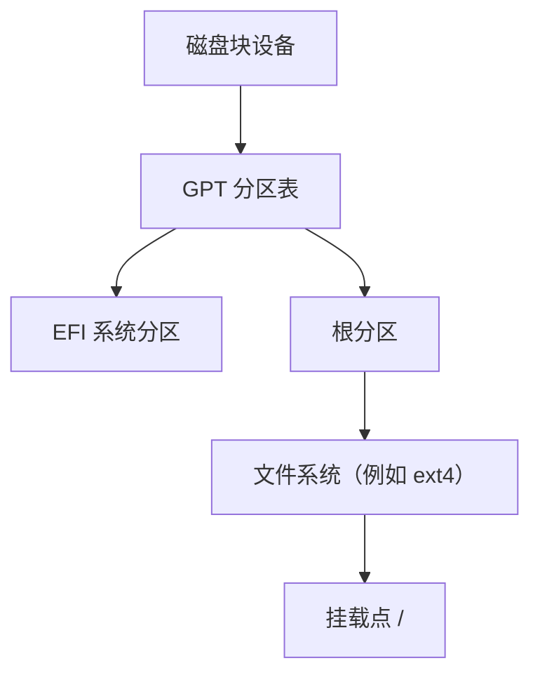
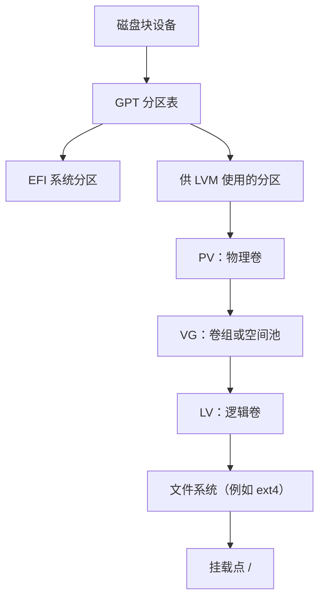

本文建立 Linux 本地存储的基础模型，解释块设备、分区、LVM、文件系统和挂载点之间的关系，并说明 Ubuntu Server 安装器中的整盘、LVM 与 LUKS 选项分别解决什么问题。重点是看懂现有布局、作出安装选择和识别容量所在层次，不提供未经核对即可执行的缩容、迁移或删除命令。

> [!info] 资料核对日期
> 本文涉及 Ubuntu Server 安装器和默认 LVM 容量策略的信息于 **2026-07-18** 根据 Canonical 官方文档核对。安装器版本和默认策略会变化，实际安装时应以当前界面生成的存储摘要为准。

## 完成标准

完成本文后，应能够：

- 区分块设备、分区、文件系统和挂载点。
- 解释 PV、VG 与 LV 的关系，知道 LVM 不是文件系统。
- 区分“引导式还是自定义布局”“是否使用 LVM”“是否使用 LUKS”三个独立决策。
- 看懂 `lsblk`、`findmnt`、`df`、`pvs`、`vgs` 和 `lvs` 的基本结果。
- 区分磁盘未分配空间、VG 空闲空间和文件系统可用空间。
- 知道扩大虚拟磁盘后，根文件系统不一定自动获得新增容量。
- 知道 LVM 快照、虚拟机快照和独立备份不能相互替代。

## 1. 先建立完整的存储分层

Linux 将物理磁盘、虚拟磁盘、分区和 LVM 逻辑卷都以块设备的形式提供。文件系统创建在某个块设备上，再通过挂载点接入统一的目录树。

在 UTM 虚拟机中，macOS 上的虚拟磁盘镜像与 Ubuntu 中看到的块设备属于不同层次：

```text
macOS 宿主机
└── UTM 虚拟磁盘镜像
    └── Ubuntu 客户机看到的磁盘块设备
        └── 分区或 LVM 逻辑卷
            └── 文件系统
                └── /、/boot、/home 等挂载点
```

各层职责如下：

| 层次 | 解决的问题 | 常见观察方式 |
| --- | --- | --- |
| 虚拟或物理磁盘 | 向 Linux 提供一段可寻址的块空间 | `lsblk` 中的 `TYPE=disk` |
| 分区表 | 记录一块磁盘如何划分 | `fdisk -l`、`parted -l` |
| 分区 | 从磁盘中划出连续区域，可承载文件系统或 LVM | `lsblk` 中的 `TYPE=part` |
| LVM | 把一个或多个底层块设备组织为空间池，再划出逻辑卷 | `pvs`、`vgs`、`lvs` |
| 文件系统 | 组织目录、文件、权限和空闲块 | `lsblk -f`、`df -hT` |
| 挂载点 | 把文件系统接入 Linux 目录树 | `findmnt` |

`/dev/vda`、`/dev/sda`、`/dev/nvme0n1` 等名称会随虚拟硬件、驱动和平台变化，不应照抄某个示例作为固定设备名。

## 2. 传统分区布局

不使用 LVM 时，文件系统通常直接创建在普通分区上。



这种布局层次较少，容易理解。需要调整容量时，目标分区通常必须拥有合适的相邻空间；实际能否在线扩展或缩小，还取决于分区位置和文件系统能力。

“传统分区”不等于“必须手动配置”。安装器可以自动生成普通分区布局，用户也可以在自定义布局中手动创建 LVM。

## 3. LVM 布局

LVM 是 Logical Volume Manager，即逻辑卷管理器。它在底层磁盘或分区与文件系统之间增加一层可调整的块设备抽象。



图中的 EFI 或其他启动分区通常位于 LVM 之外；具体分区数量和用途应以安装器的最终摘要为准。

### 3.1 PV：物理卷

PV（Physical Volume）是已经初始化并交给 LVM 管理的底层块设备。它可以建立在整个磁盘上，也可以建立在普通分区上。Ubuntu Server 的常见安装布局会先创建一个分区，再把该分区作为 PV。

### 3.2 VG：卷组

VG（Volume Group）由一个或多个 PV 组成，是 LVM 的空间池。VG 中尚未分配给任何 LV 的容量称为 VG 空闲空间。

以后加入新的磁盘时，可以在经过规划后把新的 PV 加入现有 VG。LV 扩容时不必只依赖原分区紧邻位置的空闲空间。

### 3.3 LV：逻辑卷

LV（Logical Volume）是从 VG 中划出的虚拟块设备，作用类似普通分区。LV 上仍然需要创建 ext4、XFS 等文件系统，再挂载到 `/`、`/home` 或其他目录。

因此，LVM 管理的是块空间，不负责替代文件系统：

```text
PV 提供底层容量 → VG 汇总容量 → LV 获得容量 → 文件系统管理文件
```

## 4. LVM 与传统分区的取舍

| 维度 | 普通分区 | LVM |
| --- | --- | --- |
| 存储层次 | 较少 | 增加 PV、VG、LV 三个概念 |
| 初次理解 | 更直接 | 需要先理解空间池与逻辑卷 |
| 扩展逻辑 | 受分区位置和文件系统能力影响 | 可从 VG 的任意空闲空间扩展 LV |
| 多磁盘组合 | 通常需要其他机制 | VG 可以包含多个 PV |
| 快照 | 取决于文件系统或其他层 | LVM 可创建块级快照，但必须规划容量 |
| 故障排查 | 设备链较短 | 需要同时检查 PV、VG、LV 和文件系统 |

单磁盘系统也可以使用 LVM。即使初始只有一个 PV、一个 VG 和一个 LV，仍可保留未来扩展或新增逻辑卷的空间；如果系统是短期、可随时重建的实验机，并且只追求最短存储链，不使用 LVM 也完全有效。

## 5. 看懂 Ubuntu Server 安装器

Ubuntu Server 的引导式存储页面同时呈现了三个不同决策，不应把它们理解为同一个“自动或手动”开关。

| 界面选项 | 实际含义 | 不代表什么 |
| --- | --- | --- |
| `Use an entire disk` | 让安装器为所选磁盘生成整盘布局 | 不等于必然使用 LVM |
| `Set up this disk as an LVM group` | 在底层磁盘与文件系统之间加入 LVM | 不等于磁盘加密 |
| `Encrypt the LVM group with LUKS` | 为存储布局增加 LUKS 加密和启动解锁要求 | 不负责弹性分配容量 |
| `Custom storage layout` | 不套用引导式布局，由用户设计存储结构 | 不等于只能使用普通分区 |

Canonical 的安装器文档说明：整盘方案会替换目标磁盘上的现有分区和数据；选择 LVM 后还可以决定是否使用 LUKS 加密；自定义布局则进入主要存储配置界面。具体见 [Ubuntu installation documentation：Configuring storage](https://canonical-subiquity.readthedocs-hosted.com/en/latest/howto/configure-storage.html)。

### 5.1 单用途开发虚拟机的主线选择

对于新建、单磁盘、单用途的 UTM 开发虚拟机，可以采用：

1. 选择 **Use an entire disk**。
2. 确认目标是 UTM 提供的空虚拟磁盘，不是安装 ISO 或额外数据盘。
3. 保留 **Set up this disk as an LVM group**，接受增加一层存储抽象，以便保留后续扩展空间。
4. 没有明确的客户机磁盘加密需求和恢复方案时，不勾选 LUKS。
5. 进入下一页后检查实际生成的分区、VG、LV、文件系统和挂载点，再提交最终写入确认。

这是一条合理主线，不是所有 Linux 系统的唯一正确选择。如果明确只需要最简单的磁盘结构，也不计划练习或使用 LVM，可以取消 LVM；如果是多磁盘、双系统、既有数据或有独立挂载点要求，则应先完成专门规划，再使用自定义布局。

### 5.2 LUKS 与 LVM 解决的问题不同

LUKS 用于块设备加密，LVM 用于容量组织。勾选 LUKS 后，系统通常需要在启动阶段解锁加密设备，这会影响无人值守重启和恢复流程。

启用前至少应明确：

- 要防范的威胁是什么。
- 启动口令由谁保管。
- 恢复密钥如何离线保存和验证。
- 虚拟机导出、备份或迁移后如何解锁。
- 无法通过 SSH 登录的启动阶段如何访问控制台。

不要因为 LUKS 显示在 LVM 下面，就把“使用 LVM”和“必须加密”绑定在一起。

## 6. 为什么磁盘是 180 GB，根目录可能只有约一半

Canonical 当前的引导式 `lvm` 布局默认使用 `scaled` 容量策略，目的是为快照、后续扩展或新逻辑卷保留 VG 空闲空间。官方文档概括的默认规则如下：

| VG 可用空间 | 默认分给根 LV 的空间 |
| --- | --- |
| 小于 10 GiB | 使用全部剩余空间 |
| 约 10～20 GiB | 使用 10 GiB |
| 约 20～200 GiB | 使用约一半 |
| 大于 200 GiB | 使用 100 GiB |

边界值和最终容量还会受到启动分区、对齐、LVM 元数据与当前安装器版本影响，应以安装器摘要为准。规则来源见 [Ubuntu installation documentation：LVM sizing policy](https://canonical-subiquity.readthedocs-hosted.com/en/latest/reference/autoinstall-reference.html#sizing-policy)。

例如，UTM 提供 180 GB 虚拟磁盘时，安装器还会创建启动所需分区；剩余空间进入 VG 后，根 LV 可能只获得其中约一半。此时：

- `df -h /` 只显示根文件系统当前拥有的容量。
- `vgs` 中的 `VFree` 显示尚未分配给 LV 的 VG 空间。
- 未分配的 VG 空间没有丢失，也不会被 `df` 计入根文件系统。

如果希望根文件系统一开始使用更多容量，应在提交写入前检查并调整安装器生成的布局；已经安装后再扩展，则必须先识别当前设备链并建立可恢复备份。

## 7. 安装后的只读检查

登录 Ubuntu 后，先观察真实布局，不根据教程猜测设备名。

**执行位置：Ubuntu 主机（任意目录，只读）**

```bash
printf '%s\n' 'Block devices and filesystems:'
lsblk -o NAME,PATH,SIZE,TYPE,FSTYPE,MOUNTPOINTS

printf '\n%s\n' 'Root mount:'
findmnt /
df -hT /

if command -v pvs >/dev/null 2>&1; then
  printf '\n%s\n' 'LVM physical volumes:'
  sudo pvs

  printf '\n%s\n' 'LVM volume groups:'
  sudo vgs

  printf '\n%s\n' 'LVM logical volumes:'
  sudo lvs -a -o lv_name,vg_name,lv_size,lv_attr,devices
else
  printf '\n%s\n' '未检测到 LVM 命令；当前系统可能没有安装或使用 LVM。'
fi
```

常见结果：

- `lsblk` 中 `TYPE=disk` 是整块磁盘，`TYPE=part` 是分区，`TYPE=lvm` 是逻辑卷。
- 根挂载来源可能显示为 `/dev/mapper/...` 或 `/dev/<卷组>/<逻辑卷>`。
- `pvs` 显示哪些底层设备属于 LVM。
- `vgs` 的 `VSize` 是 VG 总容量，`VFree` 是尚未分配给 LV 的容量。
- `lvs` 显示每个 LV 的大小及其所在 VG。
- `df` 显示文件系统内部的已用与可用空间，不显示 VG 尚未分配的空间。

如果 `lsblk` 没有 `TYPE=lvm`，且根文件系统直接来自普通分区，这通常表示系统未使用 LVM，不是检查失败。

## 8. 必须区分三种“空闲空间”

| 空闲空间所在层 | 表示什么 | 常见观察方式 | 能否直接存文件 |
| --- | --- | --- | --- |
| 磁盘未分配空间 | 尚未属于任何分区或底层设备 | 分区工具、`lsblk` | 不能 |
| VG 空闲空间 | 已属于 LVM，但尚未分给任何 LV | `vgs`、`pvs` | 不能 |
| 文件系统可用空间 | 已属于某个文件系统，可分配给文件 | `df -hT` | 可以 |

容量处在上层，并不意味着下层自动获得它。例如 VG 有 80 GiB 空闲空间时，根文件系统不会自动增长；必须先扩展根 LV，再扩展其上的文件系统。

同样，UTM 扩大虚拟磁盘只增加了客户机块设备的上限。完整扩展链可能包含：

```text
扩大 UTM 虚拟磁盘
→ 扩展承载 PV 的分区
→ 让 PV 识别新增空间
→ 扩展目标 LV
→ 扩展 LV 上的文件系统
```

实际链路取决于 PV 建在整盘还是分区上、文件系统类型以及当前分区布局。不要在未识别这些条件时照抄扩容命令。宿主容量与客户机容量的区别见 [[虚拟磁盘的逻辑容量与实际占用]]。

## 9. 快照、加密与备份的边界

| 机制 | 主要用途 | 不能替代什么 |
| --- | --- | --- |
| LVM 快照 | 在块设备层保留某一时刻的视图，辅助一致性操作或短期回退 | 独立故障域中的备份 |
| UTM 虚拟机快照 | 保存虚拟机在特定时刻的虚拟硬件与磁盘状态 | 虚拟机之外的独立备份 |
| LUKS | 保护静态存储内容，未解锁时阻止直接读取 | 容量管理、备份与访问控制设计 |
| 独立备份 | 在源虚拟机损坏、误删或丢失后恢复数据 | 日常版本控制和系统安全配置 |

LVM 快照通常仍依赖同一 VG 和底层磁盘；底层磁盘或整个虚拟机丢失时，原 LV 与快照可能一起丢失。具体虚拟机副本与恢复验证见 [[UTM 虚拟机快照、备份与恢复]]。

## 10. 常见误解

### LVM 是一种文件系统

不是。LVM 提供逻辑块设备，ext4、XFS 等文件系统创建在 LV 上。

### 使用 LVM 就不再需要分区

不一定。PV 可以建立在整盘上，也可以建立在普通分区上；Ubuntu 的常见 UEFI 安装还需要单独的 EFI 系统分区。

### 手动分区与 LVM 二选一

不是。引导式安装可以使用或不使用 LVM，自定义布局也可以手动创建 LVM。

### `df` 没显示整块磁盘，空间就是丢了

不一定。空间可能位于未分配磁盘区域、VG 的 `VFree`，或其他未挂载文件系统中，需要逐层检查。

### LVM 能让虚拟磁盘自动扩容

不能。LVM 只负责其管理范围内的容量；UTM 虚拟磁盘、分区、PV、LV 和文件系统仍是不同层次。

### LVM 快照就是备份

不是。快照与原卷通常共享同一底层故障域，不能替代独立副本和恢复验证。

## 相关笔记

- [[使用 UTM 创建 Ubuntu Server 虚拟机]]
- [[虚拟磁盘的逻辑容量与实际占用]]
- [[UTM 虚拟机资源规划]]
- [[UTM 虚拟机快照、备份与恢复]]
- [[Linux 开发工作区与本地文件系统规划]]

## 官方参考资料

以下资料于 **2026-07-18** 核对：

- [Ubuntu installation documentation：Configuring storage](https://canonical-subiquity.readthedocs-hosted.com/en/latest/howto/configure-storage.html)
- [Ubuntu Server：About Logical Volume Management](https://ubuntu.com/server/docs/explanation/storage/about-lvm/)
- [Ubuntu Server：How to manage logical volumes](https://ubuntu.com/server/docs/how-to/storage/manage-logical-volumes/)
- [Ubuntu installation documentation：Autoinstall configuration reference](https://canonical-subiquity.readthedocs-hosted.com/en/latest/reference/autoinstall-reference.html#sizing-policy)
- [Ubuntu Manpages：lvm](https://manpages.ubuntu.com/manpages/noble/man8/lvm.8.html)
