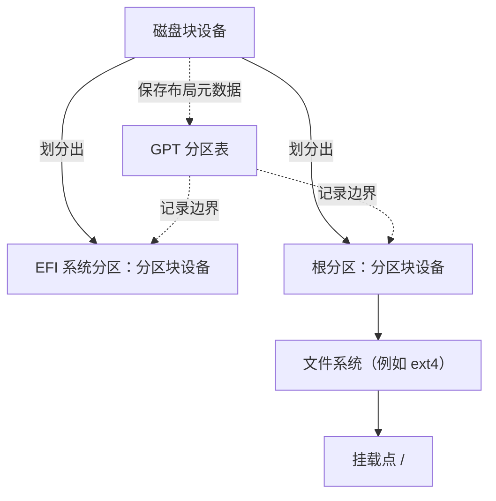
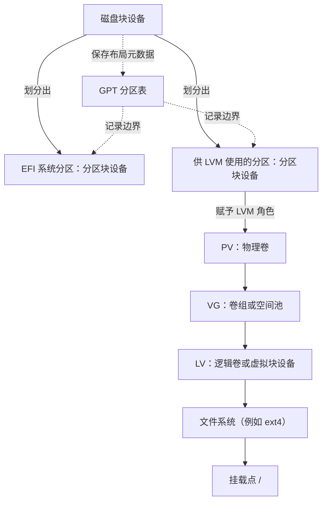

本文建立 Linux 本地存储的基础模型，解释块设备、分区、LVM（Logical Volume Manager，逻辑卷管理器）、文件系统和挂载点之间的关系。主线是先识别存储层次，再通过只读命令观察布局和定位容量，最后把这些概念映射到 Ubuntu Server 安装器。

本文不提供未经核对即可执行的分区、扩容、缩容、迁移或删除命令。这些操作依赖真实设备链、文件系统类型和可恢复备份，不能从示例设备名直接推导。

> [!abstract] 本篇掌握目标
> - **必须熟练**：解释磁盘、分区、块设备、文件系统和挂载点如何组成一条最小存储链，并用 `findmnt`、`df` 和 `lsblk` 逐层观察。
> - **理解会查**：说明 LVM 为什么在底层容量与文件系统之间加入空间池和逻辑卷，并继续使用 LVM 工具追溯容量。
> - **认识即可**：块设备加密、快照与完整扩容链；没有备份和已核对的真实布局时不执行变更命令。
>
> 命令结构和参数查询见 [[Linux 命令行学习路线与命令地图]] 与 [[Shell 命令结构、类型与帮助系统]]；路径、目录和挂载点相关的通用操作见 [[Linux 文件与目录常用命令]]。

> [!info] 资料核对日期
> 本文涉及 GNU `df` 的路径参数、容量字段和选项于 **2026-08-20** 根据 GNU Coreutils 与 Ubuntu 24.04 手册核对；Linux 块设备和 `lsblk` 的信息于 **2026-08-19** 根据 Linux 内核文档与 util-linux 上游手册核对；Ubuntu Server 安装器和默认 LVM 容量策略的信息于 **2026-08-18** 根据 Canonical 官方文档与官方仓库核对。安装器版本和默认策略会变化，实际安装时应以当前界面生成的存储摘要为准。

## 1. 先建立最简单的存储链

先用一块只包含普通分区的数据盘建立最小模型。下面先展示完整结果，再按从底层容量到文件路径的顺序逐层解释：

```text
一块数据盘
└── 一个普通分区
    └── 一个文件系统
        └── 挂载到 /data
            └── 文件 /data/report.txt
```

### 1.1 磁盘提供容量，分区划定范围

磁盘是存储容量的来源。它可以是计算机中的物理硬盘或固态硬盘，也可以是虚拟机中的虚拟磁盘；从 Linux 系统的视角看，两者都提供一段可读写的磁盘容量。

分区是从一块磁盘中划出的一段连续范围。一块磁盘可以只有一个主要数据分区，也可以按启动、系统和数据等用途划出多个分区。每个分区只使用自己边界内的容量；磁盘上负责保存这些边界和用途的布局记录称为分区表。

### 1.2 块设备提供统一访问接口

块设备是 Linux 为一段可以按位置读写的存储空间提供的统一访问接口。Linux 把整块磁盘作为一个块设备，也把磁盘中的每个分区分别作为块设备，因此同一块磁盘会同时对应整盘和分区两个层次的块设备。

“磁盘”和“分区”说明容量来自哪里、范围如何划分；“块设备”说明 Linux 以什么接口访问这段容量。在最简单的布局中，可以这样标注：

```text
磁盘（Linux 以整盘块设备访问）
└── 分区（Linux 以分区块设备访问）
```

块设备向上提供容量边界、可寻址的位置范围和读写能力。Linux 使用路径形式引用具体的块设备，这种用于指向某个设备的路径称为设备路径。

例如，在某些虚拟机中，`/dev/vda` 可以表示整盘块设备，`/dev/vda1` 可以表示其中的第一个分区块设备。不同系统中的名称可能不同，应在第 4 节使用 `lsblk` 查看当前系统的真实设备路径。

### 1.3 文件系统组织文件，挂载点接入目录树

文件系统使用块设备提供的容量，负责组织文件名、目录、所有者、权限、文件内容和可用空间。ext4、XFS 是常见的 Linux 本地文件系统类型。在本节的数据盘示例中，文件系统直接创建在分区块设备上。

挂载点是 Linux 目录树中的一个目录，用于把文件系统接入统一路径。文件系统挂载到 `/data` 后，应用才能通过 `/data/report.txt` 这样的路径访问其中的文件。

因此，从底层准备容量时，顺序是“磁盘 → 分区 → 文件系统 → 挂载点”；从一个文件路径向底层追溯时，顺序正好相反：

```text
/data/report.txt
→ 挂载点 /data
→ 文件系统
→ 分区块设备
→ 整盘块设备
```

## 2. 两种常见布局

第 1 节建立的是文件系统直接使用普通分区的最小模型。实际系统还可能在分区与文件系统之间加入 LVM。下面先看普通系统盘布局，再按容量进入、汇总和重新划出的顺序理解 LVM。

### 2.1 文件系统直接建在普通分区上

GPT（GUID Partition Table，GUID 分区表）是一种常见分区表格式，负责记录每个分区的边界和类型。使用 UEFI（Unified Extensible Firmware Interface，统一可扩展固件接口）引导时，系统通常还会创建 EFI 系统分区（EFI System Partition，ESP）保存引导文件。

系统启动后，挂载到 `/` 的文件系统称为根文件系统；在普通分区布局中，直接承载它的分区可以称为根分区。

> [!note] 如何阅读布局图
> 实线表示容量如何被划分、组织并交给上层使用，虚线表示 GPT 元数据对分区边界的描述关系。图用于建立布局和容量依赖，不表示每次读写都先经过 GPT。


```mermaid
flowchart TB
    Disk["磁盘块设备"] -. "保存布局元数据" .-> GPT["GPT 分区表"]
    Disk -->|"划分出"| ESP["EFI 系统分区：分区块设备"]
    Disk -->|"划分出"| RootPartition["根分区：分区块设备"]
    GPT -. "记录边界" .-> ESP
    GPT -. "记录边界" .-> RootPartition
    RootPartition --> FileSystem["文件系统（例如 ext4）"]
    FileSystem --> RootMount["挂载点 /"]
```

图中的 GPT 负责描述布局，真正向文件系统提供容量的是根分区块设备。EFI 系统分区承载引导文件，根分区则承载根文件系统；具体分区数量和用途应以真实布局为准。

普通分区布局的层次较少，容易理解。调整容量时，目标分区通常需要拥有合适的相邻空间；实际能否在线扩展或缩小，还取决于分区位置和文件系统能力。

“普通分区”只描述存储结构，不表示必须手动配置。安装器可以自动生成普通分区布局，用户也可以在自定义布局中手动创建 LVM。

### 2.2 在分区与文件系统之间加入 LVM

LVM（Logical Volume Manager，逻辑卷管理器）在底层块设备与文件系统之间增加容量管理层。它先接收底层块设备提供的容量，再把这些容量汇总成可统一分配的空间池，最后从空间池中划出新的块设备供文件系统使用。下面沿这个顺序逐层说明。

#### PV：把底层块设备交给 LVM

PV（Physical Volume，物理卷）是已经初始化并交给 LVM 管理的底层块设备。它可以使用整块磁盘，也可以使用普通分区。把一个分区作为 PV，是让 LVM 开始管理该分区提供的容量，不会复制出另一份容量。

Ubuntu Server 的常见安装布局会先创建分区，再把该分区作为 PV。

#### VG：把一个或多个 PV 汇总成空间池

VG（Volume Group，卷组）由一个或多个 PV 组成，是 LVM 汇总容量后形成的空间池。所有 PV 交给 VG 的容量构成这个空间池的总容量；其中尚未向上层划出的部分称为 VG 空闲空间。

以后加入新磁盘时，可以在经过规划后把新的 PV 加入现有 VG，从而扩大这个空间池。VG 如何把池中的容量继续交给上层，在下一小节说明。

#### LV：从 VG 划出新的块设备

LV（Logical Volume，逻辑卷）是 LVM 从 VG 中划出的一段容量，并以虚拟块设备的形式提供给上层，作用类似普通分区。文件系统可以创建在 LV 上，再挂载到 `/`、`/home` 或其他目录。

一个 VG 可以划出多个 LV。LV 需要扩容时，可以使用 VG 中尚未分配的空间，而不必只依赖原分区紧邻位置的空闲空间。

到这里，块设备出现了第三种常见形态：整盘块设备、分区块设备和 LV 块设备。整盘或分区块设备可以把底层容量交给 LVM，LV 则把重新组织后的容量提供给文件系统。

完整布局如下：


```mermaid
flowchart TB
    Disk["磁盘块设备"] -. "保存布局元数据" .-> GPT["GPT 分区表"]
    Disk -->|"划分出"| ESP["EFI 系统分区：分区块设备"]
    Disk -->|"划分出"| LVMPartition["供 LVM 使用的分区：分区块设备"]
    GPT -. "记录边界" .-> ESP
    GPT -. "记录边界" .-> LVMPartition
    LVMPartition -->|"赋予 LVM 角色"| PV["PV：物理卷"]
    PV --> VG["VG：卷组或空间池"]
    VG --> LV["LV：逻辑卷或虚拟块设备"]
    LV --> FileSystem["文件系统（例如 ext4）"]
    FileSystem --> RootMount["挂载点 /"]
```

图中的 EFI 或其他启动分区通常位于 LVM 之外。LVM 从底层块设备接收容量，再通过 LV 向上提供新的块设备；它管理的是块空间，文件系统负责管理文件：

```text
底层块设备被赋予 PV 角色 → VG 汇总容量 → LV 提供上层块设备 → 文件系统管理文件
```

### 2.3 回看各对象与块设备的关系

| 对象 | 与块设备的关系 | 主要职责 |
| --- | --- | --- |
| Linux 看到的物理或虚拟磁盘 | 提供整盘块设备 | 向系统提供一段底层容量 |
| GPT 分区表 | 作为磁盘布局元数据 | 记录分区的起止位置和类型 |
| 分区 | 由整盘划出的块设备 | 限定一段连续容量，可供文件系统或 LVM 使用 |
| PV | 底层块设备被赋予的 LVM 角色 | 把该设备的容量交给 LVM 管理 |
| VG | 作为 LVM 空间池 | 汇总一个或多个 PV |
| LV | LVM 向上提供的虚拟块设备 | 从 VG 获得容量，供文件系统等上层使用 |
| 文件系统 | 使用块设备提供的容量 | 组织文件、目录、权限、元数据和可用空间 |
| 挂载点 | 作为文件系统接入目录树的位置 | 让应用通过统一路径访问文件系统 |

一个普通分区既具有“磁盘中的一段范围”这一布局角色，也以块设备形式供 Linux 访问；LV 既是 LVM 对象，也是可以承载文件系统的虚拟块设备。

## 3. LVM 与普通分区的取舍

| 维度 | 普通分区 | LVM |
| --- | --- | --- |
| 存储层次 | 较少 | 增加 PV、VG、LV 三个概念 |
| 初次理解 | 更直接 | 需要先理解空间池与逻辑卷 |
| 扩展逻辑 | 受分区位置和文件系统能力影响 | 可从 VG 的任意空闲空间扩展 LV |
| 多磁盘组合 | 通常需要其他机制 | VG 可以包含多个 PV |
| 快照 | 取决于文件系统或其他层 | LVM 可创建块级快照，但必须规划容量 |
| 故障排查 | 设备链较短 | 需要同时检查 PV、VG、LV 和文件系统 |

表中的 LVM 快照是在块设备层保留某一时刻视图的机制，具体用途和备份边界见第 7 节。

单磁盘系统也可以使用 LVM。即使初始只有一个 PV、一个 VG 和一个 LV，仍可保留未来扩展或新增逻辑卷的空间。如果系统是短期、可随时重建的实验机，并且只追求最短存储链，不使用 LVM 也完全有效。

## 4. 安装后的只读检查

登录 Linux 后，从目标路径向底层逐层观察真实布局，不根据教程猜测设备名。以下检查均在 Linux 主机的任意目录执行，并且只读取状态。

### 4.1 先确认路径属于哪个文件系统

```bash
findmnt /
df -hT /
```

`findmnt /` 从挂载关系出发，确认根挂载点对应的来源、文件系统类型和挂载选项。`df -hT /` 从文件系统出发，显示该文件系统的类型、总容量、已用容量和可用容量。

以下输出于 2026-08-19 取自一台 Ubuntu Server 虚拟机的实际只读检查。终端提示符和主机信息已省略，并且只调整了列对齐：

`findmnt /` 的输出：

```text
TARGET SOURCE                            FSTYPE OPTIONS
/      /dev/mapper/ubuntu--vg-ubuntu--lv ext4   rw,relatime
```

从左到右读取这组结果：

- `TARGET` 是挂载点。这里是 `/`，因此这一行描述根文件系统。
- `SOURCE` 是根文件系统使用的来源设备路径，这里是 `/dev/mapper/ubuntu--vg-ubuntu--lv`。
- `FSTYPE` 是文件系统类型，这里是 ext4。
- `OPTIONS` 是挂载选项。`rw` 表示可以读写，`relatime` 表示系统采用相对访问时间更新策略。

`df -hT /` 的输出：

```text
Filesystem                         Type  Size  Used Avail Use% Mounted on
/dev/mapper/ubuntu--vg-ubuntu--lv  ext4   87G  7.5G   75G  10% /
```

这组结果继续说明：

- `Filesystem` 与前一条命令的 `SOURCE` 相同，说明两条命令观察的是同一个根文件系统。
- `Type` 再次确认文件系统类型是 ext4，`Mounted on` 再次确认挂载点是 `/`。
- `Size`、`Used`、`Avail` 和 `Use%` 表示这个 ext4 文件系统约有 87 GiB 总容量，已使用 7.5 GiB，可用 75 GiB，使用率为 10%。这些人类可读数值经过取整，并且文件系统还会占用元数据或保留空间，因此不应要求 `Size - Used` 与 `Avail` 精确相等。

到这一步可以确认：根路径 `/` 位于一个 ext4 文件系统中，该文件系统使用 `/dev/mapper/ubuntu--vg-ubuntu--lv` 作为来源。这个路径没有直接显示为普通分区；它与分区、LVM 和整块磁盘的关系，还需要在 4.2、4.3 节使用 `lsblk` 和 `lvs` 继续确认。

`df` 回答的是文件系统内部还有多少可用空间。这里的 87 GiB 是根文件系统的容量，不代表整块磁盘或整个 VG 的容量；`df` 也不显示磁盘中未分配的区域，以及 VG 中尚未分配给 LV 的容量。

文件系统除了提供保存内容的空间，还要为每个新文件或目录保存一条对象记录；许多 Linux 文件系统把这种记录称为 inode（index node，索引节点）。因此，`df -hT /` 显示 `Avail` 仍有空间时，也不能单独证明一定可以创建新对象；还可以使用 `df -i /` 检查 inode 使用情况，并继续检查写入权限和文件系统是否只允许读取。怎样用 `du` 定位目录占用以及比较两条命令的统计边界，见 [[Linux 文件与目录常用命令#4.4 检查目录占用与文件系统容量|du 与 df 的组合诊断]]。

### 4.2 再用 `lsblk` 连回分区和磁盘

`/dev/vda`、`/dev/vda3` 和 `/dev/mapper/system-root` 这类路径用于标识块设备。实际路径可能直接指向块特殊文件（block special file，也常称为设备节点），也可能是指向设备节点的符号链接。这些路径用于访问对应设备，不保存一份磁盘内容副本。

设备路径会随虚拟硬件、驱动、平台和发现顺序变化，应从当前系统读取。`lsblk` 的含义是 list block devices，即列出块设备：

```bash
lsblk -o NAME,PATH,SIZE,TYPE,FSTYPE,MOUNTPOINTS
```

以下是同一台虚拟机的实际只读输出，终端提示符和主机信息已省略：

```text
NAME                      PATH                                SIZE TYPE FSTYPE      MOUNTPOINTS
sr0                       /dev/sr0                           1024M rom
vda                       /dev/vda                            180G disk
├─vda1                    /dev/vda1                             1G part vfat        /boot/efi
├─vda2                    /dev/vda2                             2G part ext4        /boot
└─vda3                    /dev/vda3                         176.9G part LVM2_member
  └─ubuntu--vg-ubuntu--lv /dev/mapper/ubuntu--vg-ubuntu--lv  88.5G lvm  ext4        /
```

先沿树形层级识别每个对象：

- `sr0` 的 `TYPE` 是 `rom`，表示一个光驱类块设备。它没有挂载点，也不属于本例的根文件系统设备链。
- `vda` 的 `TYPE` 是 `disk`，表示这台虚拟机看到的整盘块设备，容量为 180 GiB。
- `vda1`、`vda2` 和 `vda3` 的 `TYPE` 都是 `part`，表示它们是从 `vda` 划出的三个分区。`vda1` 使用 vfat 文件系统并挂载到 `/boot/efi`，`vda2` 使用 ext4 并挂载到 `/boot`。
- `vda3` 的 `FSTYPE` 是 `LVM2_member`。这里的 `FSTYPE` 显示的是 LVM 成员签名，不是可以直接挂载和保存文件的文件系统；该分区把 176.9 GiB 容量交给 LVM 管理。
- `ubuntu--vg-ubuntu--lv` 的 `TYPE` 是 `lvm`，表示 LVM 提供的逻辑卷块设备。它使用 ext4 文件系统并挂载到 `/`，其设备路径与 4.1 节两条命令显示的来源一致。

因此，可以把根路径向下追溯为：

```text
/（挂载点）
→ ext4（df 显示约 87 GiB）
→ /dev/mapper/ubuntu--vg-ubuntu--lv（LV 块设备，88.5 GiB）
→ /dev/vda3（LVM 成员分区，176.9 GiB）
→ /dev/vda（整盘块设备，180 GiB）
```

这组结果也说明了各列的用途：

- `TYPE=disk` 表示整盘块设备，`TYPE=part` 表示分区块设备，`TYPE=lvm` 表示 LVM 逻辑卷。
- `PATH` 是当前系统中的设备路径，`SIZE` 是该层拥有的容量。
- `FSTYPE` 显示已识别的文件系统或其他签名，`MOUNTPOINTS` 显示相关挂载点。
- `lsblk` 的树形关系把 `findmnt` 显示的来源连回 LV、分区和整块磁盘。

根 LV 的 88.5 GiB 是块设备容量，`df` 显示的约 87 GiB 是其中 ext4 文件系统报告的容量，两者属于不同层次，不要求数值完全相同。`vda3` 的 176.9 GiB 又明显大于根 LV，但仅凭 `lsblk` 不能判断差额是否全部属于 VG 空闲空间；还需要在 4.3 节通过 `pvs`、`vgs` 和 `lvs` 核对。

根挂载来源可能显示为 `/dev/mapper/...` 或 `/dev/<卷组>/<逻辑卷>` 形式的路径；这里的尖括号只表示路径结构，不是可执行 Shell 命令。组合名称中的连续连字符也不适合用来猜测真实的 VG 和 LV 名称，应以 `lvs` 的分列结果为准。

### 4.3 只在设备链使用 LVM 时继续检查

如果 `lsblk` 中出现 `TYPE=lvm`，先确认当前系统安装了 LVM 查询命令：

```bash
command -v pvs
command -v vgs
command -v lvs
```

三条命令都输出可执行文件路径后，再运行：

```bash
sudo pvs
sudo vgs
sudo lvs -a -o lv_name,vg_name,lv_size,lv_attr,devices
```

这些查询可能需要 `sudo` 读取完整的 LVM 元数据，但不会修改 PV、VG 或 LV。

- `pvs` 显示哪些底层块设备被作为 PV，以及它们属于哪个 VG。
- `vgs` 的 `VSize` 是 VG 总容量，`VFree` 是尚未分配给 LV 的容量。
- `lvs` 显示每个 LV 的大小、所在 VG 和使用的底层设备。

以下是同一台虚拟机的实际只读输出。终端提示符、主机信息和 `sudo` 密码提示已省略。

`pvs` 的输出：

```text
PV         VG        Fmt  Attr PSize    PFree
/dev/vda3  ubuntu-vg lvm2 a--  <176.95g 88.47g
```

这说明 `/dev/vda3` 已被作为一个 LVM2 格式的 PV，并且属于 `ubuntu-vg`。`PSize` 表示 PV 总容量略小于 176.95 GiB，数值前的 `<` 表示真实值略小于经过取整显示的数值；`PFree` 表示其中还有 88.47 GiB 没有分配给任何 LV。`Attr` 中的 `a` 表示这个 PV 可以分配容量。

`vgs` 的输出：

```text
VG        #PV #LV #SN Attr   VSize    VFree
ubuntu-vg   1   1   0 wz--n- <176.95g 88.47g
```

这说明 `ubuntu-vg` 只包含 1 个 PV、1 个 LV，并且当前没有 LVM 快照。VG 总容量略小于 176.95 GiB，其中 88.47 GiB 是尚未分给任何 LV 的 `VFree`。因为这个 VG 只有一个 PV，所以这里的 `VFree` 与前一条命令中的 `PFree` 相同。

`lvs` 的输出：

```text
LV        VG        LSize  Attr       Devices
ubuntu-lv ubuntu-vg 88.47g -wi-ao---- /dev/vda3(0)
```

这说明 `ubuntu-vg` 中唯一的 LV 名为 `ubuntu-lv`，容量为 88.47 GiB。`Devices` 表明这个 LV 的底层容量来自 `/dev/vda3`。括号中的 `(0)` 和 `Attr` 是用于深入排障的内部位置与状态信息，日常确认存储链时可以暂时忽略。

三组结果把 4.2 节留下的容量问题核对清楚了：`vda3` 的容量已经全部进入 `ubuntu-vg`，其中约一半分给根 LV，另外 88.47 GiB 仍停留在 VG 空闲空间。完整关系是：

```text
/dev/vda3（PV，略小于 176.95 GiB）
└── ubuntu-vg（VG，略小于 176.95 GiB）
    ├── ubuntu-lv（LV，88.47 GiB）→ ext4 → /
    └── VG 空闲空间（88.47 GiB，尚未分给任何 LV）
```

因此，`df` 显示根文件系统仍有 75 GiB 可用空间，与 VG 另有 88.47 GiB 空闲空间是两件事：前者已经位于根 LV 上的 ext4 文件系统内部，可以直接用于保存文件；后者还没有分给根 LV，不能通过 `/` 直接使用。

如果 `lsblk` 没有 `TYPE=lvm`，且根文件系统直接来自普通分区，这通常表示系统未使用 LVM，不是检查失败，也不需要继续运行 LVM 查询命令。

### 4.4 把结果串成一条检查顺序

不要把这些命令看成孤立查询。检查根文件系统时，按下面的顺序从当前路径追溯到底层容量：

1. `findmnt /` 确认根挂载点来自哪个文件系统或设备。
2. `df -hT /` 查看根文件系统自己拥有多少容量、已用多少和还可分配多少。
3. `lsblk` 把该来源连回 LV、分区和整块磁盘，同时观察各层的 `SIZE`、`TYPE`、`FSTYPE` 和挂载点。
4. 如果设备链中出现 `TYPE=lvm`，再用 `lvs`、`vgs` 和 `pvs` 分别核对 LV、VG 和 PV。
5. 对比各层容量，判断差额属于其他分区或 LV、VG 空闲空间，还是文件系统内部的可用空间。

## 5. 容量可能停在哪一层

“磁盘有多大”、“根 LV 有多大”和“根目录还能保存多少文件”是不同问题。容量差额可能停留在设备链的任意一层，不能只比较磁盘大小和 `df` 结果。

| 容量所在位置 | 表示什么 | 主要观察方式 | 能否通过当前挂载点直接存文件 |
| --- | --- | --- | --- |
| 磁盘中未划入分区的空间 | 块设备已经变大，但分区布局尚未使用这部分容量 | 对比分区工具与 `lsblk` 中的磁盘、分区容量 | 不能 |
| 分区中尚未被 PV 识别的新增空间 | 承载 PV 的分区可能已经扩大，但 PV 仍记录旧容量 | 对比 `lsblk` 的分区容量与 `pvs` 的 PV 容量 | 不能 |
| VG 空闲空间 | 容量已经属于 LVM，但尚未分给任何 LV | `vgs` 的 `VFree`、`pvs` 的空闲容量 | 不能 |
| LV 已获得但文件系统尚未使用的容量 | LV 可能已扩大，但其上的文件系统尚未扩展 | 对比 `lvs`、`lsblk` 与 `df -hT` 显示的容量 | 不能 |
| 其他分区、LV 或未挂载文件系统拥有的容量 | 容量已分配给另一个存储对象，不属于当前根文件系统 | `lsblk -f`、`lvs`、`findmnt` | 不能通过当前挂载点使用 |
| 文件系统可用空间 | 容量已经由文件系统管理，可以继续分配给文件 | `df -hT` | 已挂载且权限允许时可以 |

容量位于设备链的前一层，不意味着后续层自动获得它。例如 VG 有 80 GiB 空闲空间时，根文件系统不会自动增长；必须先扩展目标 LV，再让其上的文件系统使用新容量。

同样，扩大虚拟磁盘只会先增加 Linux 客户机块设备的容量上限。完整扩展链可能包含：

```text
扩大虚拟磁盘
→ 扩展承载 PV 的分区
→ 让 PV 识别新增空间
→ 扩展目标 LV
→ 扩展 LV 上的文件系统
```

实际链路取决于 PV 建在整盘还是分区上、是否使用 LVM、文件系统类型以及当前分区布局。某些链路会略过其中的分区、PV 或 LV 步骤，不要在未识别真实布局时照抄扩容命令。宿主容量与客户机容量的区别见 [[虚拟磁盘的逻辑容量与实际占用]]。

## 6. 把存储概念映射到 Ubuntu Server 安装器

Ubuntu Server 的引导式存储页面同时呈现了三个不同决策，不应把它们理解为同一个“自动或手动”开关。

LUKS（Linux Unified Key Setup，Linux 统一密钥设置）是 Linux 常用的块设备加密格式，用于保存加密元数据和解锁所需信息。这里先把加密与容量管理区分开，启动解锁和恢复边界由第 7 节继续说明。

| 界面选项 | 实际含义 | 不代表什么 |
| --- | --- | --- |
| `Use an entire disk` | 让安装器为所选磁盘生成整盘布局 | 不等于必然使用 LVM |
| `Set up this disk as an LVM group` | 在底层磁盘与文件系统之间加入 LVM | 不等于磁盘加密 |
| `Encrypt the LVM group with LUKS` | 为存储布局增加 LUKS 加密和启动解锁要求 | 不负责弹性分配容量 |
| `Custom storage layout` | 不套用引导式布局，由用户设计存储结构 | 不等于只能使用普通分区 |

选择时应依次回答：

1. 目标磁盘是否可以被重新分区，已有数据是否存在可恢复备份。
2. 需求能否由引导式布局满足，还是存在多磁盘、双系统、已有数据或独立挂载点等自定义要求。
3. 是否需要 LVM 的空间池、逻辑卷和后续调整能力，并接受额外存储层次。
4. 是否存在明确的静态数据加密需求，以及启动解锁、口令保管和恢复方案。
5. 安装器最终生成的分区、PV、VG、LV、文件系统和挂载点是否符合预期。

Canonical 的安装器文档说明：整盘方案会替换目标磁盘上的现有分区和数据；选择 LVM 后还可以决定是否使用 LUKS 加密；自定义布局则进入主要存储配置界面。具体见 [Ubuntu installation documentation：Configuring storage](https://canonical-subiquity.readthedocs-hosted.com/en/latest/howto/configure-storage.html)。

使用 UTM 安装单磁盘开发虚拟机时的具体主线选择、目标磁盘确认和最终摘要检查，由 [[使用 UTM 创建 Ubuntu Server 虚拟机#5.2 存储|UTM 安装笔记]] 负责；本文只保留可迁移的概念和判断依据。

### 6.1 为什么根文件系统可能小于磁盘

Canonical 当前的引导式 `lvm` 布局默认使用 `scaled` 容量策略，目的是为快照、后续扩展或新逻辑卷保留 VG 空闲空间。官方文档概括的默认规则如下：

| VG 可用空间 | 默认分给根 LV 的空间 |
| --- | --- |
| 小于 10 GiB | 使用全部剩余空间 |
| 10～20 GiB | 使用 10 GiB |
| 20～200 GiB | 使用剩余空间的一半 |
| 大于 200 GiB | 使用 100 GiB |

边界值和最终容量还会受到启动分区、对齐、LVM 元数据与当前安装器版本影响，应以安装器摘要为准。规则来源见 [Ubuntu installation documentation：LVM sizing policy](https://canonical-subiquity.readthedocs-hosted.com/en/latest/reference/autoinstall-reference.html#sizing-policy)。

例如，安装器处理一块约 180 GB 的磁盘时，还会创建启动所需分区；剩余空间进入 VG 后，根 LV 可能只获得其中约一半。此时：

- `df -h /` 只显示根文件系统当前拥有的容量。
- `vgs` 中的 `VFree` 显示尚未分配给 LV 的 VG 空间。
- 未分配的 VG 空间没有丢失，也不会被 `df` 计入根文件系统。

这只是根文件系统小于磁盘的一种可能原因。在真实主机上，应先按本文第 4、5 节排除其他分区或 LV、未挂载文件系统，以及容量尚未传递到 PV、LV 或文件系统的情况。

## 7. 快照、加密与备份的边界

| 机制 | 主要用途 | 不能替代什么 |
| --- | --- | --- |
| LVM 快照 | 在块设备层保留某一时刻的视图，辅助一致性操作或短期回退 | 独立故障域中的备份；也不会自动让应用程序内部状态达到一致 |
| 虚拟机快照 | 保存虚拟机在特定时刻的虚拟硬件与磁盘状态 | 虚拟机之外的独立备份 |
| LUKS | 保护静态存储内容，未解锁时阻止直接读取 | 容量管理、备份与访问控制设计 |
| 独立备份 | 在源主机或虚拟机损坏、误删或丢失后恢复数据 | 日常版本控制和系统安全配置 |

LVM 快照通常仍依赖同一 VG 和底层磁盘；底层磁盘或整个虚拟机丢失时，原 LV 与快照可能一起丢失。具体虚拟机副本与恢复验证见 [[UTM 虚拟机快照、备份与恢复]]。

LUKS 用于块设备加密，LVM 用于容量组织。在 Ubuntu Server 引导式布局中启用 LUKS 后，系统通常需要在启动阶段解锁加密设备，这会影响无人值守重启和恢复流程。启用前至少应明确：

- 要防范的威胁是什么。
- 启动口令由谁保管。
- 恢复密钥如何离线保存和验证。
- 主机或虚拟机导出、备份或迁移后如何解锁。
- 无法通过 SSH 登录的启动阶段如何访问本地或虚拟机控制台。

## 8. 按现象定位所在层

| 现象 | 不应直接得出的结论 | 检查顺序 |
| --- | --- | --- |
| `df` 显示的根文件系统明显小于整块磁盘 | “空间丢失了” | `findmnt /` → `df -hT /` → `lsblk` → `lvs` → `vgs` → `pvs` |
| `vgs` 显示较大 `VFree`，但根文件系统仍空间不足 | “`df` 统计错误” | 先确认目标 LV 和文件系统；`VFree` 未分给 LV 前不能直接存文件 |
| 扩大虚拟磁盘后 `/` 的容量没变 | “LVM 没有生效” | 沿磁盘、分区、PV、VG、LV、文件系统逐层比较容量 |
| `lsblk` 没有 `TYPE=lvm` | “存储检查失败” | 确认根文件系统是否直接来自普通分区 |
| 启用 LUKS 后重启时 SSH 暂时不可用 | “LVM 或 SSH 必然损坏” | 先通过本地或虚拟机控制台确认是否正在等待加密设备解锁 |

还应保留三条基本边界：LVM 不是文件系统；自定义分区与 LVM 不是二选一；LVM 快照与虚拟机快照都不是独立备份。

## 完成标准

完成本文后，应能够：

- 解释磁盘、分区、块设备、文件系统和挂载点在最小存储链中的职责。
- 说明整盘、分区和 LV 为什么都可以表现为块设备。
- 解释 PV、VG 与 LV 的关系，知道 LVM 管理块空间，文件系统管理文件。
- 按挂载点、文件系统、LV、VG、PV、分区和磁盘的顺序追溯容量。
- 看懂 `findmnt`、`df`、`lsblk`、`pvs`、`vgs` 和 `lvs` 的基本结果。
- 区分“如何生成布局”“是否使用 LVM”“是否使用 LUKS”三个独立决策。
- 知道扩大虚拟或物理磁盘后，根文件系统不一定自动获得新增容量。
- 知道 LVM 快照、虚拟机快照、LUKS 加密和独立备份不能相互替代。

## 相关笔记

- [[使用 UTM 创建 Ubuntu Server 虚拟机]]
- [[虚拟磁盘的逻辑容量与实际占用]]
- [[UTM 虚拟机资源规划]]
- [[UTM 虚拟机快照、备份与恢复]]
- [[Linux 开发工作区与本地文件系统规划]]
- [[Linux 文件与目录常用命令]]

## 官方参考资料

以下 GNU `df` 资料于 **2026-08-20** 核对：

- [GNU Coreutils Manual：df](https://www.gnu.org/software/coreutils/manual/html_node/df-invocation.html)
- [Ubuntu Manpage：df](https://manpages.ubuntu.com/manpages/noble/man1/df.1.html)

以下块设备与设备关系资料于 **2026-08-19** 核对：

- [Linux Kernel documentation：Multi-Queue Block IO Queueing Mechanism](https://docs.kernel.org/block/blk-mq.html)
- [Linux Kernel documentation：dm-linear](https://docs.kernel.org/admin-guide/device-mapper/linear.html)
- [util-linux manual：lsblk](https://man7.org/linux/man-pages/man8/lsblk.8.html)
- [util-linux manual：fstab](https://man7.org/linux/man-pages/man5/fstab.5.html)

以下 Ubuntu Server 安装器与 LVM 资料于 **2026-08-18** 核对：

- [Ubuntu installation documentation：Configuring storage](https://canonical-subiquity.readthedocs-hosted.com/en/latest/howto/configure-storage.html)
- [Ubuntu Server：About Logical Volume Management](https://ubuntu.com/server/docs/explanation/storage/about-lvm/)
- [Ubuntu Server：How to manage logical volumes](https://ubuntu.com/server/docs/how-to/storage/manage-logical-volumes/)
- [Ubuntu installation documentation：Autoinstall configuration reference](https://canonical-subiquity.readthedocs-hosted.com/en/latest/reference/autoinstall-reference.html#sizing-policy)
- [Ubuntu Manpages：lvm](https://manpages.ubuntu.com/manpages/noble/man8/lvm.8.html)
