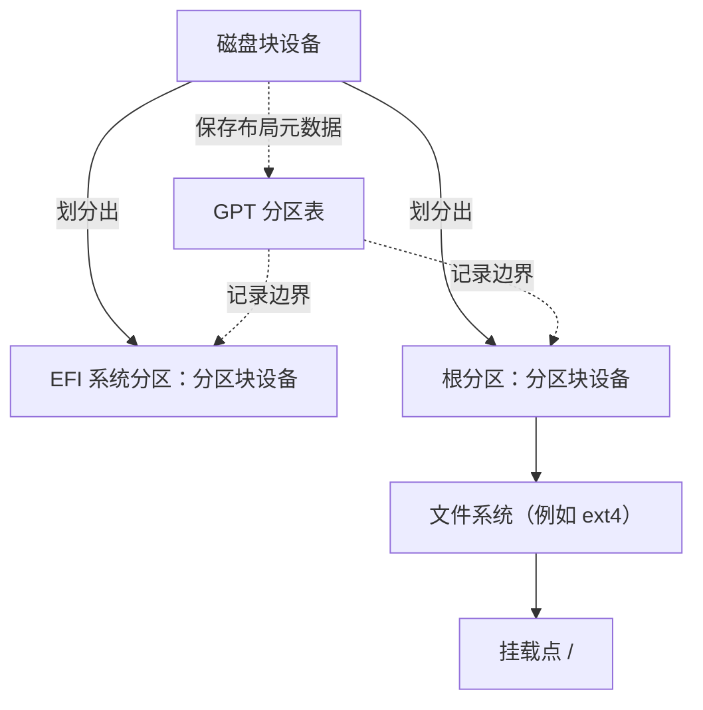
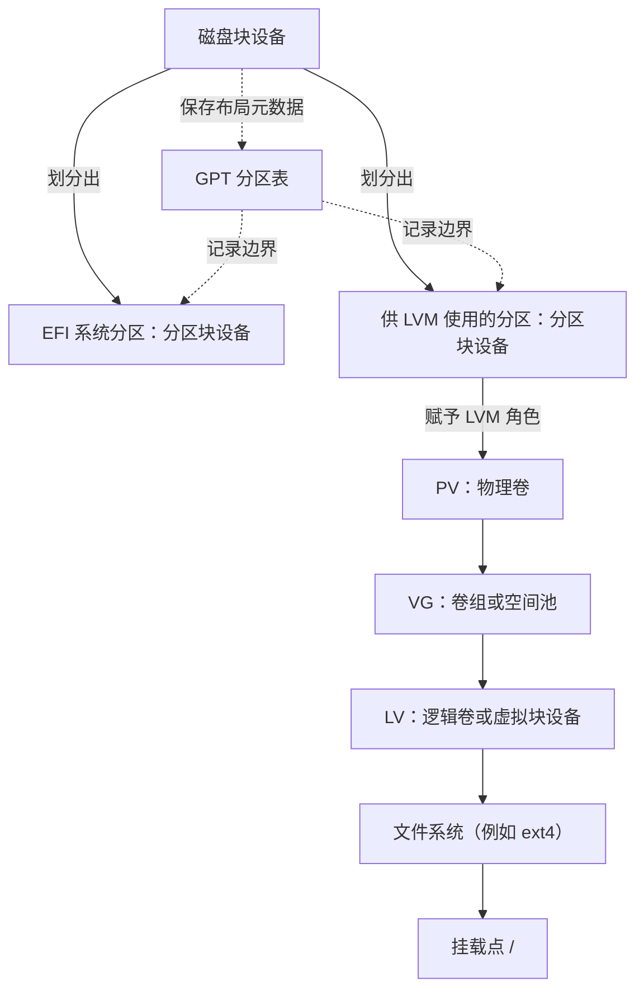

本文建立 Linux 本地存储的基础模型，解释块设备、分区、LVM（Logical Volume Manager，逻辑卷管理器）、文件系统和挂载点之间的关系。主线是先识别存储层次，再通过只读命令观察布局和定位容量，最后把这些概念映射到 Ubuntu Server 安装器。

本文不提供未经核对即可执行的分区、扩容、缩容、迁移或删除命令。这些操作依赖真实设备链、文件系统类型和可恢复备份，不能从示例设备名直接推导。

> [!abstract] 本篇掌握目标
> - **必须熟练**：区分磁盘、分区、文件系统与挂载点，按固定顺序读懂 `lsblk`、`findmnt` 和 `df` 的基本结果。
> - **理解会查**：识别物理卷（PV）、卷组（VG）和逻辑卷（LV），沿设备链判断容量实际停留在哪一层。
> - **认识即可**：LUKS（Linux Unified Key Setup，Linux 统一密钥设置）、LVM 快照与完整扩容链；没有备份和已核对的真实布局时不执行变更命令。
>
> 命令结构和参数查询见 [[Linux 命令行学习路线与命令地图]] 与 [[Shell 命令结构、类型与帮助系统]]；路径、目录和挂载点相关的通用操作见 [[Linux 文件与目录常用命令]]。

> [!info] 资料核对日期
> 本文涉及 Linux 块设备、块 I/O 层和 `lsblk` 的信息于 **2026-08-19** 根据 Linux 内核文档与 util-linux 上游手册核对；Ubuntu Server 安装器和默认 LVM 容量策略的信息于 **2026-08-18** 根据 Canonical 官方文档与官方仓库核对。安装器版本和默认策略会变化，实际安装时应以当前界面生成的存储摘要为准。

## 完成标准

完成本文后，应能够：

- 区分块设备、分区、文件系统和挂载点。
- 解释 PV、VG 与 LV 的关系，知道 LVM 不是文件系统。
- 按挂载点、文件系统、LV、VG、PV、分区和磁盘的顺序追溯容量。
- 区分“引导式还是自定义布局”“是否使用 LVM”“是否使用 LUKS”三个独立决策。
- 看懂 `lsblk`、`findmnt`、`df`、`pvs`、`vgs` 和 `lvs` 的基本结果。
- 知道扩大虚拟或物理磁盘后，根文件系统不一定自动获得新增容量。
- 知道 LVM 快照、虚拟机快照、LUKS 加密和独立备份不能相互替代。

## 1. 先理解块设备，再看完整存储链

块设备不是磁盘与文件系统之间额外增加的某一个固定层，而是 Linux 对“可以按位置读写的一段存储空间”提供的统一接口。Linux 看到的整块磁盘、从磁盘划出的分区和 LVM 逻辑卷都能提供这种接口，因此它们都可以表现为块设备。

块设备向上提供容量边界、可寻址的位置范围和读写能力，但不理解文件名、目录、所有者或权限。本文所说的“块”可以先理解为设备上一段有编号的位置范围；设备逻辑扇区、物理扇区和文件系统块是不同层次的单位，大小不一定相同，不应仅凭“块”这个词把它们视为同一概念。

物理磁盘或虚拟磁盘回答“底层容量从哪里来”，块设备回答“Linux 通过什么统一接口访问这段容量”。两者不是同义词：一块磁盘可以向 Linux 提供一个整盘块设备，其中的每个分区又分别表现为块设备；LVM 还可以基于底层块设备继续提供新的 LV 块设备。

### 1.1 从一次文件写入理解它的位置

假设 `/var` 没有单独挂载，根文件系统使用 ext4，并且创建在 LVM 逻辑卷上。应用写入 `/var/log/app.log` 时，可以先用下面这条简化路径理解各层分工：

```text
应用写入 /var/log/app.log
→ 路径经过挂载点 / 落到根文件系统
→ ext4 把文件及其偏移位置转换为块 I/O
→ LV 块设备接收读写请求
→ 作为 PV 使用的分区块设备提供底层容量
→ 整盘块设备把请求交给磁盘驱动
→ 物理存储，或虚拟机宿主侧的虚拟磁盘后端
```

这条路径中，文件系统负责把“文件世界”翻译成“块 I/O 世界”；块设备负责按位置承接读写请求；更低层的块设备或存储后端最终保存数据。如果根文件系统直接创建在普通分区上，路径会跳过 LV、VG 和 PV；如果 Linux 直接运行在物理机上，路径也不会经过虚拟磁盘后端。

在虚拟机场景中，宿主机上的虚拟磁盘镜像或其他存储后端，与 Linux 客户机看到的磁盘块设备属于不同边界。扩大宿主侧虚拟磁盘的容量，通常只是先让客户机的整盘块设备看到更大的容量上限，不代表分区、LV 或文件系统已经同步扩大。

### 1.2 `/dev` 下的名称是什么

`/dev/vda`、`/dev/vda3` 和 `/dev/mapper/system-root` 这类路径用于标识块设备。实际路径可能直接指向块特殊文件（block special file，也常称为设备节点），也可能是指向设备节点的符号链接。它们都是用户空间命名和访问内核块设备的入口，不保存一份磁盘内容副本，也不会在存储链中额外增加一层。

设备节点自身仍有 Linux 所有者、用户组和权限模式，用于限制谁能直接访问整个设备；这与文件系统内部每个文件的所有者和权限不是同一层含义。

路径名称会随虚拟硬件、驱动、平台和设备发现顺序变化，不应照抄示例作为固定设备名。`lsblk` 的含义是 list block devices，即列出块设备；它读取系统中的设备信息，并以树形结构帮助观察整盘、分区和上层虚拟块设备之间的依赖关系。

### 1.3 各对象与块设备的关系

| 对象 | 与块设备的关系 | 主要职责 |
| --- | --- | --- |
| Linux 看到的物理或虚拟磁盘 | 提供整盘块设备 | 向系统提供一段底层容量 |
| 分区表 | 不是块设备，而是磁盘上的布局元数据 | 记录分区的起止位置和类型 |
| 分区 | 由整盘划出的块设备 | 限定一段连续容量，可供文件系统、LVM 或其他机制使用 |
| PV | 现有底层块设备被赋予的 LVM 角色，不是自动新增的一份块设备 | 把该设备的容量交给 LVM 管理 |
| VG | 不是块设备 | 汇总一个或多个 PV，形成容量池 |
| LV | LVM 向上提供的虚拟块设备 | 从 VG 获得一段容量，供文件系统等上层使用 |
| 文件系统 | 不是块设备；本文讨论的 ext4、XFS 等本地磁盘文件系统通常使用块设备 | 组织文件、目录、权限、元数据和可用空间 |
| 挂载点 | 不是块设备 | 把文件系统接入统一的 Linux 目录树 |

因此，“`/dev/vda3` 是分区还是块设备”并不是二选一：分区说明它的来源和布局角色，块设备说明它向 Linux 提供的访问接口。同理，LV 既是 LVM 对象，也是一个可以承载文件系统的虚拟块设备。

## 2. 两种常见布局

本文讨论的本地磁盘文件系统通常沿普通分区或 LVM 两类常见存储链建立。两者最终都需要文件系统和挂载点，区别在于文件系统与底层磁盘之间是否加入 LVM。

> [!note] 如何阅读下面的布局图
> 实线表示容量如何被划分、组织并交给上层使用，虚线表示 GPT 元数据对分区边界的描述关系。图用于建立布局和容量依赖，不表示每次 I/O 都先“经过 GPT”；GPT 记录布局，但本身不是块设备。

### 2.1 文件系统直接建在普通分区上


```mermaid
flowchart TB
    Disk["磁盘块设备"] -. "保存布局元数据" .-> GPT["GPT 分区表"]
    Disk -->|"划分出"| ESP["EFI 系统分区：分区块设备"]
    Disk -->|"划分出"| RootPartition["根分区：分区块设备"]
    GPT -. "记录边界" .-> ESP
    GPT -. "记录边界" .-> RootPartition
    RootPartition --> FileSystem["文件系统（例如 ext4）"]
    FileSystem --> RootMount["挂载点 /"]
```

GPT（GUID Partition Table，全局唯一标识分区表）保存在磁盘上，记录分区的边界和类型；图中从磁盘到分区的实线才表示整盘容量被划出不同区域。UEFI（Unified Extensible Firmware Interface，统一可扩展固件接口）引导的系统通常还会使用 EFI 系统分区（ESP）保存引导所需文件。

普通分区布局的层次较少，容易理解。调整容量时，目标分区通常需要拥有合适的相邻空间；实际能否在线扩展或缩小，还取决于分区位置和文件系统能力。

“普通分区”不等于“必须手动配置”。安装器可以自动生成普通分区布局，用户也可以在自定义布局中手动创建 LVM。

### 2.2 文件系统建在 LVM 逻辑卷上


```mermaid
flowchart TB
    Disk["磁盘块设备"] -. "保存布局元数据" .-> GPT["GPT 分区表"]
    Disk -->|"划分出"| ESP["EFI 系统分区：分区块设备"]
    Disk -->|"划分出"| LVMPartition["供 LVM 使用的分区：分区块设备"]
    GPT -. "记录边界" .-> ESP
    GPT -. "记录边界" .-> LVMPartition
    LVMPartition -->|"赋予 LVM 角色"| PV["PV：物理卷"]
    PV --> VG["VG：卷组或空间池"]
    VG --> LV["LV：逻辑卷或虚拟块设备"]
    LV --> FileSystem["文件系统（例如 ext4）"]
    FileSystem --> RootMount["挂载点 /"]
```

图中的 EFI 或其他启动分区通常位于 LVM 之外；具体分区数量和用途应以真实布局为准。

#### PV：物理卷

PV（Physical Volume）是已经初始化并交给 LVM 管理的底层块设备。它可以建立在整块磁盘上，也可以建立在普通分区上。把一个分区作为 PV，不会复制其容量或自动创建新的上层块设备，而是让 LVM 开始管理这个分区块设备提供的容量。Ubuntu Server 的常见安装布局会先创建分区，再把该分区作为 PV。

#### VG：卷组

VG（Volume Group）由一个或多个 PV 组成，是 LVM 的空间池。VG 中尚未分配给任何 LV 的容量称为 VG 空闲空间。

以后加入新磁盘时，可以在经过规划后把新的 PV 加入现有 VG。LV 扩容时不必只依赖原分区紧邻位置的空闲空间。

#### LV：逻辑卷

LV（Logical Volume）是从 VG 中划出的虚拟块设备，作用类似普通分区。LV 上仍然需要创建 ext4、XFS 等文件系统，再挂载到 `/`、`/home` 或其他目录。

因此，LVM 从底层块设备接收容量，再通过 LV 向上提供新的块设备；它管理的是块空间，不负责替代文件系统：

```text
底层块设备被赋予 PV 角色 → VG 汇总容量 → LV 提供上层块设备 → 文件系统管理文件
```

## 3. LVM 与普通分区的取舍

| 维度 | 普通分区 | LVM |
| --- | --- | --- |
| 存储层次 | 较少 | 增加 PV、VG、LV 三个概念 |
| 初次理解 | 更直接 | 需要先理解空间池与逻辑卷 |
| 扩展逻辑 | 受分区位置和文件系统能力影响 | 可从 VG 的任意空闲空间扩展 LV |
| 多磁盘组合 | 通常需要其他机制 | VG 可以包含多个 PV |
| 快照 | 取决于文件系统或其他层 | LVM 可创建块级快照，但必须规划容量 |
| 故障排查 | 设备链较短 | 需要同时检查 PV、VG、LV 和文件系统 |

单磁盘系统也可以使用 LVM。即使初始只有一个 PV、一个 VG 和一个 LV，仍可保留未来扩展或新增逻辑卷的空间。如果系统是短期、可随时重建的实验机，并且只追求最短存储链，不使用 LVM 也完全有效。

## 4. 安装后的只读检查

登录 Linux 后，先观察真实布局，不根据教程猜测设备名。

**执行位置：Linux 主机（任意目录，全部为只读检查）**

```bash
printf '%s\n' 'Block devices and filesystems:'
lsblk -o NAME,PATH,SIZE,TYPE,FSTYPE,MOUNTPOINTS

printf '\n%s\n' 'Root mount:'
findmnt /
df -hT /

if command -v pvs >/dev/null 2>&1; then
  printf '\n%s\n' 'LVM physical volumes:'
  sudo pvs

  printf '\n%s\n' 'LVM volume groups:'
  sudo vgs

  printf '\n%s\n' 'LVM logical volumes:'
  sudo lvs -a -o lv_name,vg_name,lv_size,lv_attr,devices
else
  printf '\n%s\n' '未检测到 LVM 命令；当前系统可能没有安装或使用 LVM。'
fi
```

不要把这些命令看成六个孤立查询。阅读时可以从目标路径向底层追溯：

1. `findmnt /` 确认根挂载点来自哪个文件系统或设备。
2. `df -hT /` 查看根文件系统自己拥有多少容量、已用多少和还可分配多少。
3. `lsblk` 把该来源连回 LV、分区和整块磁盘，同时观察各层的 `SIZE`、`TYPE`、`FSTYPE` 和挂载点。
4. 如果设备链中出现 `TYPE=lvm`，再用 `lvs`、`vgs` 和 `pvs` 分别核对 LV、VG 和 PV。
5. 对比各层容量，判断差额属于其他分区或 LV、VG 空闲空间，还是文件系统内部的可用空间。

常见结果：

- `lsblk` 中 `TYPE=disk` 是整块磁盘，`TYPE=part` 是分区，`TYPE=lvm` 是逻辑卷。
- 根挂载来源可能显示为 `/dev/mapper/...` 或 `/dev/<卷组>/<逻辑卷>` 形式的路径；这里的尖括号只表示路径结构，不是可执行 Shell 命令。
- `pvs` 显示哪些底层设备属于 LVM。
- `vgs` 的 `VSize` 是 VG 总容量，`VFree` 是尚未分配给 LV 的容量。
- `lvs` 显示每个 LV 的大小及其所在 VG。
- `df` 显示文件系统内部的已用与可用空间，不显示 VG 尚未分配的空间。

如果 `lsblk` 没有 `TYPE=lvm`，且根文件系统直接来自普通分区，这通常表示系统未使用 LVM，不是检查失败。

## 5. 容量可能停在哪一层

“磁盘有多大”、“根 LV 有多大”和“根目录还能保存多少文件”是不同问题。容量差额可能停留在设备链的任意一层，不能只比较磁盘大小和 `df` 结果。

| 容量所在位置 | 表示什么 | 主要观察方式 | 能否通过当前挂载点直接存文件 |
| --- | --- | --- | --- |
| 磁盘中未划入分区的空间 | 块设备已经变大，但分区布局尚未使用这部分容量 | 对比分区工具与 `lsblk` 中的磁盘、分区容量 | 不能 |
| 分区中尚未被 PV 识别的新增空间 | 承载 PV 的分区可能已经扩大，但 PV 仍记录旧容量 | 对比 `lsblk` 的分区容量与 `pvs` 的 PV 容量 | 不能 |
| VG 空闲空间 | 容量已经属于 LVM，但尚未分给任何 LV | `vgs` 的 `VFree`、`pvs` 的空闲容量 | 不能 |
| LV 已获得但文件系统尚未使用的容量 | LV 可能已扩大，但其上的文件系统尚未扩展 | 对比 `lvs`、`lsblk` 与 `df -hT` 显示的容量 | 不能 |
| 其他分区、LV 或未挂载文件系统拥有的容量 | 容量已分配给另一个存储对象，不属于当前根文件系统 | `lsblk -f`、`lvs`、`findmnt` | 不能通过当前挂载点使用 |
| 文件系统可用空间 | 容量已经由文件系统管理，可以继续分配给文件 | `df -hT` | 已挂载且权限允许时可以 |

容量位于设备链的前一层，不意味着后续层自动获得它。例如 VG 有 80 GiB 空闲空间时，根文件系统不会自动增长；必须先扩展目标 LV，再让其上的文件系统使用新容量。

同样，扩大虚拟磁盘只会先增加 Linux 客户机块设备的容量上限。完整扩展链可能包含：

```text
扩大虚拟磁盘
→ 扩展承载 PV 的分区
→ 让 PV 识别新增空间
→ 扩展目标 LV
→ 扩展 LV 上的文件系统
```

实际链路取决于 PV 建在整盘还是分区上、是否使用 LVM、文件系统类型以及当前分区布局。某些链路会略过其中的分区、PV 或 LV 步骤，不要在未识别真实布局时照抄扩容命令。宿主容量与客户机容量的区别见 [[虚拟磁盘的逻辑容量与实际占用]]。

## 6. 把存储概念映射到 Ubuntu Server 安装器

Ubuntu Server 的引导式存储页面同时呈现了三个不同决策，不应把它们理解为同一个“自动或手动”开关。

| 界面选项 | 实际含义 | 不代表什么 |
| --- | --- | --- |
| `Use an entire disk` | 让安装器为所选磁盘生成整盘布局 | 不等于必然使用 LVM |
| `Set up this disk as an LVM group` | 在底层磁盘与文件系统之间加入 LVM | 不等于磁盘加密 |
| `Encrypt the LVM group with LUKS` | 为存储布局增加 LUKS 加密和启动解锁要求 | 不负责弹性分配容量 |
| `Custom storage layout` | 不套用引导式布局，由用户设计存储结构 | 不等于只能使用普通分区 |

选择时应依次回答：

1. 目标磁盘是否可以被重新分区，已有数据是否存在可恢复备份。
2. 需求能否由引导式布局满足，还是存在多磁盘、双系统、已有数据或独立挂载点等自定义要求。
3. 是否需要 LVM 的空间池、逻辑卷和后续调整能力，并接受额外存储层次。
4. 是否存在明确的静态数据加密需求，以及启动解锁、口令保管和恢复方案。
5. 安装器最终生成的分区、PV、VG、LV、文件系统和挂载点是否符合预期。

Canonical 的安装器文档说明：整盘方案会替换目标磁盘上的现有分区和数据；选择 LVM 后还可以决定是否使用 LUKS 加密；自定义布局则进入主要存储配置界面。具体见 [Ubuntu installation documentation：Configuring storage](https://canonical-subiquity.readthedocs-hosted.com/en/latest/howto/configure-storage.html)。

使用 UTM 安装单磁盘开发虚拟机时的具体主线选择、目标磁盘确认和最终摘要检查，由 [[使用 UTM 创建 Ubuntu Server 虚拟机#5.2 存储|UTM 安装笔记]] 负责；本文只保留可迁移的概念和判断依据。

### 6.1 为什么根文件系统可能小于磁盘

Canonical 当前的引导式 `lvm` 布局默认使用 `scaled` 容量策略，目的是为快照、后续扩展或新逻辑卷保留 VG 空闲空间。官方文档概括的默认规则如下：

| VG 可用空间 | 默认分给根 LV 的空间 |
| --- | --- |
| 小于 10 GiB | 使用全部剩余空间 |
| 10～20 GiB | 使用 10 GiB |
| 20～200 GiB | 使用剩余空间的一半 |
| 大于 200 GiB | 使用 100 GiB |

边界值和最终容量还会受到启动分区、对齐、LVM 元数据与当前安装器版本影响，应以安装器摘要为准。规则来源见 [Ubuntu installation documentation：LVM sizing policy](https://canonical-subiquity.readthedocs-hosted.com/en/latest/reference/autoinstall-reference.html#sizing-policy)。

例如，安装器处理一块约 180 GB 的磁盘时，还会创建启动所需分区；剩余空间进入 VG 后，根 LV 可能只获得其中约一半。此时：

- `df -h /` 只显示根文件系统当前拥有的容量。
- `vgs` 中的 `VFree` 显示尚未分配给 LV 的 VG 空间。
- 未分配的 VG 空间没有丢失，也不会被 `df` 计入根文件系统。

这只是根文件系统小于磁盘的一种可能原因。在真实主机上，应先按本文第 4、5 节排除其他分区或 LV、未挂载文件系统，以及容量尚未传递到 PV、LV 或文件系统的情况。

## 7. 快照、加密与备份的边界

| 机制 | 主要用途 | 不能替代什么 |
| --- | --- | --- |
| LVM 快照 | 在块设备层保留某一时刻的视图，辅助一致性操作或短期回退 | 独立故障域中的备份；也不会自动让应用程序内部状态达到一致 |
| 虚拟机快照 | 保存虚拟机在特定时刻的虚拟硬件与磁盘状态 | 虚拟机之外的独立备份 |
| LUKS | 保护静态存储内容，未解锁时阻止直接读取 | 容量管理、备份与访问控制设计 |
| 独立备份 | 在源主机或虚拟机损坏、误删或丢失后恢复数据 | 日常版本控制和系统安全配置 |

LVM 快照通常仍依赖同一 VG 和底层磁盘；底层磁盘或整个虚拟机丢失时，原 LV 与快照可能一起丢失。具体虚拟机副本与恢复验证见 [[UTM 虚拟机快照、备份与恢复]]。

LUKS 用于块设备加密，LVM 用于容量组织。在 Ubuntu Server 引导式布局中启用 LUKS 后，系统通常需要在启动阶段解锁加密设备，这会影响无人值守重启和恢复流程。启用前至少应明确：

- 要防范的威胁是什么。
- 启动口令由谁保管。
- 恢复密钥如何离线保存和验证。
- 主机或虚拟机导出、备份或迁移后如何解锁。
- 无法通过 SSH 登录的启动阶段如何访问本地或虚拟机控制台。

## 8. 按现象定位所在层

| 现象 | 不应直接得出的结论 | 检查顺序 |
| --- | --- | --- |
| `df` 显示的根文件系统明显小于整块磁盘 | “空间丢失了” | `findmnt /` → `df -hT /` → `lsblk` → `lvs` → `vgs` → `pvs` |
| `vgs` 显示较大 `VFree`，但根文件系统仍空间不足 | “`df` 统计错误” | 先确认目标 LV 和文件系统；`VFree` 未分给 LV 前不能直接存文件 |
| 扩大虚拟磁盘后 `/` 的容量没变 | “LVM 没有生效” | 沿磁盘、分区、PV、VG、LV、文件系统逐层比较容量 |
| `lsblk` 没有 `TYPE=lvm` | “存储检查失败” | 确认根文件系统是否直接来自普通分区 |
| 启用 LUKS 后重启时 SSH 暂时不可用 | “LVM 或 SSH 必然损坏” | 先通过本地或虚拟机控制台确认是否正在等待加密设备解锁 |

还应保留三条基本边界：LVM 不是文件系统；自定义分区与 LVM 不是二选一；LVM 快照与虚拟机快照都不是独立备份。

## 相关笔记

- [[使用 UTM 创建 Ubuntu Server 虚拟机]]
- [[虚拟磁盘的逻辑容量与实际占用]]
- [[UTM 虚拟机资源规划]]
- [[UTM 虚拟机快照、备份与恢复]]
- [[Linux 开发工作区与本地文件系统规划]]

## 官方参考资料

以下块设备与设备关系资料于 **2026-08-19** 核对：

- [Linux Kernel documentation：Multi-Queue Block IO Queueing Mechanism](https://docs.kernel.org/block/blk-mq.html)
- [Linux Kernel documentation：dm-linear](https://docs.kernel.org/admin-guide/device-mapper/linear.html)
- [util-linux manual：lsblk](https://man7.org/linux/man-pages/man8/lsblk.8.html)

以下 Ubuntu Server 安装器与 LVM 资料于 **2026-08-18** 核对：

- [Ubuntu installation documentation：Configuring storage](https://canonical-subiquity.readthedocs-hosted.com/en/latest/howto/configure-storage.html)
- [Ubuntu Server：About Logical Volume Management](https://ubuntu.com/server/docs/explanation/storage/about-lvm/)
- [Ubuntu Server：How to manage logical volumes](https://ubuntu.com/server/docs/how-to/storage/manage-logical-volumes/)
- [Ubuntu installation documentation：Autoinstall configuration reference](https://canonical-subiquity.readthedocs-hosted.com/en/latest/reference/autoinstall-reference.html#sizing-policy)
- [Ubuntu Manpages：lvm](https://manpages.ubuntu.com/manpages/noble/man8/lvm.8.html)
