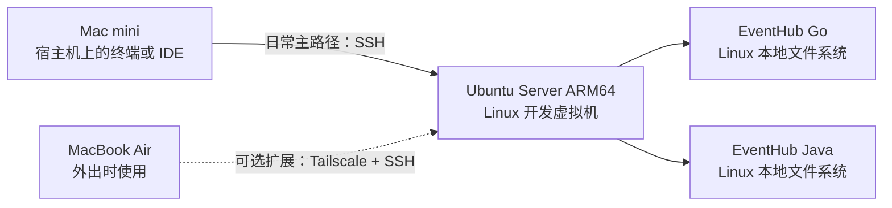

本组笔记完成“第 1 阶段：建立 Linux 开发环境并让 Go、Java 两个 EventHub 项目完成首次构建验证”。它既是一条可以照着执行的主线，也是一组帮助初学者理解虚拟化、Linux、SSH、工具链和项目迁移边界的学习材料。

第 1 阶段的交付物不是云服务器，也不是生产部署平台，而是一台可重复恢复、能够承载真实后端开发工作的 Ubuntu Server 虚拟机。所有“预期结果”都必须由读者在实际创建虚拟机后亲自验证；本文记录的本机信息只是 2026-07-16 的只读案例核对，不代表虚拟机已经创建或项目已经构建成功。

## 本阶段的两条访问路径



日常必需路径是：

```text
Mac mini 上的终端或 IDE
    -> SSH
    -> Mac mini 内运行的 Ubuntu Server 虚拟机
```

外出时的可选路径是：

```text
MacBook Air
    -> Tailscale 网络
    -> Ubuntu Server 虚拟机上的 SSH 服务
```

> [!important] 本机连内部虚拟机也是真实 SSH
> Mac mini 上运行的是 SSH 客户端，Ubuntu 虚拟机内运行的是 `sshd` 服务端。双方仍会进行主机身份确认、密钥认证、加密协商、远程 Shell 创建和 Linux 用户权限检查，因此可以完整练习 SSH 的核心机制。
>
> MacBook Air 通过 Tailscale 访问时，传统 OpenSSH 的核心流程可以保持不变，变化主要发生在“客户端怎样找到并到达服务端”的网络层。本机到内部虚拟机暂时不会覆盖公网路由、跨地域延迟、运营商 NAT、家庭路由器端口映射和云安全组；这些属于以后真实远程部署时再学习的范围。

[[使用 Tailscale 远程访问 Linux 开发机]] 是扩展能力，不是通过第 1 阶段验收的前置条件。先让 Mac mini 到虚拟机的 SSH 稳定可用，再决定是否配置外出访问。

## 先建立共同概念

| 概念 | 在本次案例中是什么 | 需要记住的边界 |
| --- | --- | --- |
| 宿主机（host） | 运行 macOS 的 Mac mini | 提供真实 CPU、内存、磁盘和网络，也运行 UTM |
| Hypervisor / 虚拟化层 | UTM 使用的 Apple Virtualization 或 QEMU 虚拟化能力 | 在宿主硬件与客户机之间分配和隔离资源 |
| 虚拟机（VM） | 一组虚拟 CPU、内存、磁盘、网卡与固件配置 | 是软件定义的计算机，不等于一个终端窗口 |
| 客户机（guest） | 安装在虚拟机内的 Ubuntu Server | 有自己的内核、用户、文件系统、服务和 IP 地址 |
| ARM64 / AArch64 | Apple Silicon 与本次 Ubuntu 客户机采用的 64 位 ARM 架构 | 下载 ISO、Go、JDK 和容器镜像时必须选择兼容架构 |
| AMD64 / x86_64 | Intel、AMD 常见的 64 位 x86 架构 | 与 ARM64 不是同一指令集，不能把二进制包混用 |
| SSH 客户端 | macOS 的 `ssh` 命令或 IDE Remote SSH | 主动发起连接并保管用户私钥 |
| SSH 服务端 | Ubuntu 的 `sshd` | 监听连接、证明主机身份并认证登录用户 |

### 虚拟化与模拟不是同一件事

Apple Silicon 宿主机与 Ubuntu ARM64 客户机采用相同 CPU 架构时，优先选择 **Virtualize**。客户机大部分指令可以借助硬件虚拟化执行，性能和能效更适合日常开发。

如果为了运行 AMD64 客户机而让 UTM 翻译不同指令集，则属于 **Emulate**。模拟的兼容范围更广，但通常更慢，也会增加排障变量。本阶段没有使用 AMD64 Ubuntu 的必要，主线固定为 ARM64 客户机。

> [!note] 容器镜像也有架构
> Docker 可以拉取多架构镜像中匹配 `linux/arm64` 的变体；只有 `linux/amd64` 变体的镜像可能需要模拟，甚至无法运行。项目首次验证时要把“CPU 架构不匹配”与“应用代码错误”分开排查。

## 本次案例基线与如何迁移到其他机器

**核对日期：2026-07-16。** 下表是对当前 macOS 宿主机和两个项目的只读观察，不是普遍要求，也不是已完成结果。

| 项目 | 本次只读观察 | 使用方式 |
| --- | --- | --- |
| 宿主机 | Apple M4、24GB 内存 | 说明为什么选择 ARM64 客户机；不写入任何设备唯一标识 |
| 根卷可用空间 | 约 347GiB | 创建前仍要重查，因为可用空间会变化 |
| UTM | 未安装 | 本组只写安装与创建步骤，不实际安装 |
| OrbStack | 已安装，版本 2.2.1 | 仅用于解释边界；本阶段不把它作为完整 VM 主线 |
| 虚拟机候选配置 | 6 vCPU、12GB 内存、180GB 稀疏磁盘 | 适合同时运行 IDE 远程服务、Go/Java 构建和开发数据库的案例起点，不是唯一正确值 |
| 客户机候选系统 | Ubuntu Server 24.04 LTS ARM64 | 执行时从 Ubuntu 官方页面选择仍受支持的 24.04 最新点版本并校验镜像 |
| Go 项目约束 | `go.mod` 声明 Go 1.24.0 | 项目声明优先于“安装最新版” |
| Java 项目约束 | `pom.xml` 声明 JDK 21 | Maven、Wrapper 和门禁入口还要以迁移后的实际 revision 为准 |

**执行位置：macOS 宿主机（任意目录，只读检查）**

```bash
uname -m
system_profiler SPHardwareDataType | sed -n '/Chip:/p;/Total Number of Cores:/p;/Memory:/p'
df -h /
test -d /Applications/UTM.app && printf 'UTM installed\n' || printf 'UTM not installed\n'
test -d /Applications/OrbStack.app && printf 'OrbStack installed\n' || printf 'OrbStack not installed\n'
```

`uname -m` 在 Apple Silicon 上应输出 `arm64`。`df -h /` 的 `Avail` 才是此刻可用空间；虚拟磁盘标称上限不能超过你愿意长期留给虚拟机的空间与备份空间。

### 资源不是越多越好

| 资源 | 本次案例 | 调整依据 |
| --- | --- | --- |
| vCPU | 6 | 给 macOS 保留调度余量；并行 Go 测试、Maven 编译和容器构建越多，需求越高 |
| 内存 | 12GB | 24GB 宿主机仍保留约一半给 macOS、IDE 和浏览器；不要让宿主机持续内存压力过高 |
| 稀疏磁盘上限 | 180GB | 能容纳源码、Maven/Go 缓存、Docker 镜像与数据库；稀疏只表示按需占用，不表示永远不增长 |

配置后应同时观察 macOS Activity Monitor、Ubuntu 的 `free -h`、`df -h` 和 Docker 磁盘使用。若宿主机频繁交换内存，先减少虚拟机内存或并发；若虚拟机磁盘增长过快，清点构建缓存、镜像、卷和日志，不要直接删除未知数据。

## 网络模式的最小选择

| 网络方式 | 客户机如何联网 | 适合本阶段什么场景 | 主要限制 |
| --- | --- | --- | --- |
| UTM Shared Network | 由宿主机路由，通常表现为 NAT/共享网络 | 默认主线；宿主机与客户机互通，配置少 | 局域网其他设备不一定能直接到达客户机 |
| 桥接网络 | 客户机像独立设备一样接入局域网 | 明确需要被同一 LAN 的其他设备访问时 | Wi-Fi 桥接可能受系统和网络限制，暴露面更大 |
| 端口转发 | 把宿主机某端口转到客户机端口 | Shared 模式下无法直接到达客户机时的备用方案 | 需要管理端口冲突与监听地址 |
| Tailscale | 在已安装客户端的设备间建立受控覆盖网络 | MacBook Air 外出访问 | 需要额外账号、设备授权和访问控制，不是本阶段必需 |

先用 Shared Network 完成 Mac mini 到 VM 的 SSH。只有遇到明确需求时才切换桥接或增加 Tailscale，不要一次同时改变多个网络层。

## 推荐阅读与执行顺序

| 顺序 | 笔记 | 完成标志 |
| --- | --- | --- |
| 1 | [[使用 UTM 创建 Ubuntu Server 开发虚拟机]] | Ubuntu Server 能启动，架构、CPU、内存、磁盘和网络符合预期 |
| 2 | [[Ubuntu Server 开发机初始化与安全基线]] | 用户、`sudo`、主机名、时区、更新、目录、服务与基础防火墙已验证 |
| 3 | [[从 macOS 使用 SSH 连接 Linux 虚拟机]] | Mac mini 能用密钥登录，新开会话仍正常，并能解释主机指纹 |
| 4 | [[Linux 后端开发目录与工具链规划]] | `$HOME/src` 已建立，Git、Go、JDK、Docker 和 Compose 满足项目约束 |
| 5 | [[在 Linux 中迁移并验证 EventHub Go 与 Java 项目]] | 两个仓库身份已核对，并按实际 revision 完成首次构建与门禁 |
| 6 | [[Linux 开发虚拟机备份恢复与常见问题]] | 已建立关机基线副本、源码备份策略和恢复记录 |
| 可选 | [[使用 Tailscale 远程访问 Linux 开发机]] | 只有确有外出需求时才配置，并保留本地 SSH 主路径 |

Git、Docker 和 Java 已有详细安装专题，本组不重复整篇教程：

- Git：[[Git 安装与初始配置概览]]、[[Ubuntu 从零安装 Git]]、[[Git 常用配置与本地验证]]、[[Git 凭据、SSH 与常见问题排查]]。
- Docker：[[Docker 安装概览]]、[[Ubuntu 安装 Docker]]。
- Java：[[Java 与 Maven 环境搭建概览]]、[[Ubuntu 安装 Java 与 Maven]]、[[Java 版本管理与环境变量配置]]、[[Maven 常用配置与仓库管理]]、[[Java 与 Maven 环境排障与维护]]。
- Go：[[Ubuntu 安装 Go]]。

## 第 1 阶段的范围

| 本阶段要完成 | 本阶段明确不做 |
| --- | --- |
| 完整 Ubuntu Server 开发虚拟机 | 云服务器部署与公网暴露 |
| Linux 用户、权限、服务与 SSH 基础 | 正式 CI/CD 流水线建设 |
| Git、Go、JDK、Maven、Docker、Compose 工具链 | 生产监控、告警与值班体系 |
| 两个 EventHub 项目的首次构建、测试和当前门禁 | Kubernetes、服务编排平台或微服务拆分 |
| 开发 VM 的快照或冷备、源码备份与恢复基线 | 正式发布、灰度、流量切换与生产回滚 |

“能在开发虚拟机中构建镜像”不等于“已经部署”；“Compose 能静态解析”不等于“服务已健康运行”；“虚拟机能恢复”也不等于“源码、数据库和密钥都有独立备份”。这些边界会在后续笔记中反复验证。

## 阶段完成清单

> [!warning] 下面是验收清单，不是当前成功记录
> 只有在真实虚拟机上执行并保存了验证结果后才能勾选。笔记创建时 UTM 尚未安装，因此当前不能把任何虚拟机或项目构建项写成“已通过”。

- [ ] Ubuntu Server 能正常启动，`uname -m` 显示预期的 ARM64 架构。
- [ ] 虚拟机能访问网络、解析 DNS，并确认系统时间已经同步。
- [ ] Mac mini 能通过传统 SSH 密钥登录虚拟机。
- [ ] 关闭当前连接后，新开 SSH 会话仍然正常。
- [ ] 能说明客户端私钥、服务端 `authorized_keys`、主机指纹和 `known_hosts` 的职责。
- [ ] 日常用户、`sudo`、`$HOME/src` 目录与文件所有权符合预期。
- [ ] Git、Go、Java、Maven 或 Maven Wrapper、Docker Engine 与 Compose plugin 的版本符合迁移后项目约束。
- [ ] EventHub Go 和 EventHub Java 都位于 Linux 本地文件系统，而不是 UTM 共享挂载或 iCloud 路径。
- [ ] 两个仓库的远程地址、当前分支、本地 `HEAD`、远端目标 SHA 和工作区状态已经核对。
- [ ] Go 项目完成当前 revision 要求的依赖下载、编译、测试与质量门禁。
- [ ] Go 的 MySQL 集成测试确认实际执行，没有因为 Docker provider 不健康而被跳过。
- [ ] Java 项目完成当前 revision 实际提供的构建、测试与质量门禁。
- [ ] Docker daemon 正常，`docker run --rm hello-world` 成功。
- [ ] 两个项目实际存在的 Compose 配置都通过 `docker compose config --quiet` 静态验证。
- [ ] 已记录 UTM 后端与版本提供的快照或复制能力，并建立至少一个关机状态基线副本。
- [ ] 已建立独立源码备份方法；若有本地数据库，也已记录其独立备份和恢复方法。
- [ ] 已做一次恢复演练或至少完成恢复步骤核对，而不只是“创建了备份”。
- [ ] 能明确指出云部署、正式 CI/CD、监控、发布、生产回滚和 Kubernetes 属于后续阶段。

## 记录验证证据

建议在个人、非公开的执行记录中保存日期、命令、退出码、关键版本和失败处理，不要保存密码、令牌、私钥或内部地址。一个完成项至少应回答：

1. 在哪台机器、哪个目录执行。
2. 使用哪个版本和 Git 提交。
3. 命令退出码是否为 0。
4. 测试是否真实执行，是否存在 `SKIP`。
5. 执行前后 `git status --short` 是否符合预期。
6. 失败后做了什么恢复，是否改变了系统或源码。

## 官方参考资料

- [UTM：Ubuntu 安装指南](https://docs.getutm.app/guides/ubuntu/)
- [UTM：Apple 虚拟机网络设置](https://docs.getutm.app/settings-apple/devices/network/)
- [Ubuntu Server：基础安装](https://ubuntu.com/server/docs/tutorial/basic-installation/)
- [Ubuntu：ARM Server 下载](https://ubuntu.com/download/server/arm)
- [Ubuntu Server：ARM64 默认与 64K 页内核的选择](https://documentation.ubuntu.com/server/how-to/installation/choosing-between-the-arm64-and-arm64-largemem-installer-options/)
- [OpenBSD：ssh 手册](https://man.openbsd.org/ssh.1)
- [Tailscale：Linux 安装](https://tailscale.com/docs/install/linux)
- [Go：下载与安装](https://go.dev/doc/install)
- [Docker：在 Ubuntu 安装 Docker Engine](https://docs.docker.com/engine/install/ubuntu/)
- [Apache Maven Wrapper](https://maven.apache.org/tools/wrapper/)
