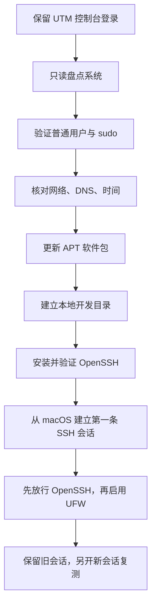

本文用于初始化一台刚安装完成的 Ubuntu Server 开发虚拟机：核对用户与权限，设置主机名和时区，验证网络、DNS 与时间同步，更新系统软件包，建立开发目录，理解 systemd 与日志，并以不会轻易锁死远程访问的顺序启用 OpenSSH 和 UFW。

开始前应先完成 [[使用 UTM 创建 Ubuntu Server 开发虚拟机]]，并确保仍能通过 UTM 控制台登录。初始化结束后，继续 [[从 macOS 使用 SSH 连接 Linux 虚拟机]]；整组笔记的阶段边界和完成清单见 [[Linux 后端开发虚拟机搭建概览]]。

> [!info] 核对日期与适用范围
> 本文以 Ubuntu Server 24.04 LTS 为主，并于 **2026-07-16** 核对 Ubuntu Server、OpenSSH、UFW 与 systemd 官方资料。这里建立的是个人 Linux 开发机基线，不是互联网生产服务器的完整加固标准。

## 完成标准

完成后，应满足：

- 当前登录用户是普通用户，确实拥有经过验证的 `sudo` 权限；root 账号没有被设置为日常直接登录账号。
- 主机名中性、可识别，时区符合使用场景，系统时间已同步。
- 虚拟机能获得 IP、存在默认路由、能解析 DNS 并访问 Ubuntu 官方软件源。
- APT 软件包索引已更新，已审查并安装当前安全与常规更新。
- `$HOME/src` 等开发目录位于 Linux 本地文件系统，属主和权限符合预期。
- 能解释 Linux 用户、组、`rwx` 权限、`sudo` 和 `umask` 的边界。
- 能使用 `systemctl` 查看服务状态，使用 `journalctl` 定位当前启动和具体服务日志。
- `ssh.service` 正常运行，`sshd` 配置语法通过，22/TCP 正在监听。
- UFW 启用前已放行 OpenSSH，并通过新的 SSH 会话验证没有锁死访问。
- 已保存一份不含密码、令牌和私钥的基线记录。

## 1. 安全操作顺序

不要一登录就同时修改 SSH、网络和防火墙。推荐顺序是：



> [!warning] 在 SSH 验证完成前不要关闭 UTM 控制台
> 控制台是不依赖网络的恢复入口。如果网络、`sshd` 或 UFW 配置错误，可在控制台中修复。只保留一个远程会话并立刻重启 SSH 或启用防火墙，最容易把自己锁在系统外。

## 2. 用户、组、权限与 sudo

### 2.1 基本概念

| 概念 | 作用 | 常见误解 |
| --- | --- | --- |
| 用户 | 进程和文件的身份主体，有 UID、主组、附加组与家目录 | 用户名不是权限本身，系统最终依据 UID/GID 和规则判断 |
| 用户组 | 为多个用户授予一组文件或能力边界 | 加入组后，现有登录会话不一定立即获得新组身份 |
| root | UID 为 0 的超级用户 | 不应把 root 直接登录当作日常开发方式 |
| `sudo` | 让被授权普通用户临时以高权限执行特定命令 | `sudo` 不是“关闭权限检查”，错误命令仍会造成系统级破坏 |
| 文件权限 | 所有者、组、其他用户分别拥有读、写、执行能力 | 对目录而言，执行权限表示能否进入和访问其内部路径 |
| `umask` | 影响新建文件和目录默认权限的掩码 | 不会追溯修改已经存在的文件，也不是访问控制列表的替代品 |

Ubuntu 默认禁用 root 密码直接登录，并让安装器创建的首个用户加入 `sudo` 组。日常做法是以普通用户登录，仅在安装软件或修改系统配置时使用 `sudo`。

### 2.2 先只读盘点当前身份

**执行位置：Ubuntu 虚拟机（UTM 控制台，任意目录）**

```bash
printf '%s\n' '--- identity ---'
whoami
id
groups

printf '%s\n' '--- account database ---'
getent passwd "$USER"
getent group sudo

printf '%s\n' '--- home directory ---'
printf 'HOME=%s\n' "$HOME"
stat -c 'mode=%A numeric=%a owner=%U group=%G path=%n' "$HOME"

printf '%s\n' '--- current umask ---'
umask
umask -S
```

预期结果：

- `whoami` 与 `$USER` 对应安装时创建的普通账号；
- `id` 输出的附加组包含 `sudo`；
- 家目录属主是当前用户，而不是 root；
- 常见 `umask` 是 `0022`，但实际值应以输出为准。

### 2.3 验证 sudo，而不是只看组名

**执行位置：Ubuntu 虚拟机（UTM 控制台，任意目录）**

```bash
sudo -v
sudo -l
sudo id
```

输入的是当前普通用户自己的密码。预期 `sudo id` 显示 `uid=0(root)`，随后命令结束并回到普通用户 Shell。

如果提示当前用户不在 sudoers 中，不要尝试启用 root 远程登录或复制来历不明的 sudoers 文件。使用仍可用的安装控制台和安装时的管理员账号核对用户组；若没有任何管理员入口，恢复或重建这台尚未承载数据的练习虚拟机通常比绕过权限更安全。

### 2.4 是否需要再创建一个用户

个人开发虚拟机通常直接使用安装器创建的普通用户，不需要为了“初始化”重复创建账号。只有明确需要把日常账号与管理账号分开时才新增用户。

以下示例使用中性示例账号 `backenddev`。执行前先用 `getent passwd backenddev` 确认没有同名账号。

**执行位置：Ubuntu 虚拟机（UTM 控制台，任意目录，仅在确需新账号时）**

```bash
new_user="backenddev"

if getent passwd "$new_user" >/dev/null; then
  printf '用户已存在：%s\n' "$new_user"
else
  sudo adduser "$new_user"
  sudo usermod -aG sudo "$new_user"
fi

id "$new_user"
sudo -l -U "$new_user"
```

`adduser` 会交互式要求设置密码，不要把密码写在命令、公开笔记或 Shell 脚本中。加入 `sudo` 组后，应通过新的控制台登录会话验证；不要在新账号尚未验证前删除原管理员账号。

撤销新建测试账号前，先确认其中没有源码、密钥或未备份文件：

**执行位置：Ubuntu 虚拟机（UTM 控制台，任意目录，仅在确认可删除时）**

```bash
new_user="backenddev"
sudo passwd -l "$new_user"
sudo deluser "$new_user"
```

这会删除账号定义但默认保留家目录。不要直接追加 `--remove-home`；是否删除数据应在单独检查和备份后决定。

## 3. 第一次系统盘点

在改配置前保存真实状态。以下命令只读：

**执行位置：Ubuntu 虚拟机（UTM 控制台，任意目录）**

```bash
printf '%s\n' '--- release and architecture ---'
cat /etc/os-release
uname -a
dpkg --print-architecture

printf '%s\n' '--- hostname and time ---'
hostnamectl
timedatectl status

printf '%s\n' '--- storage ---'
lsblk -o NAME,SIZE,TYPE,FSTYPE,MOUNTPOINTS
df -hT

printf '%s\n' '--- network ---'
ip -brief address
ip route
resolvectl status

printf '%s\n' '--- failed services ---'
systemctl --failed --no-pager
```

重点核对：

- `/etc/os-release` 属于 Ubuntu 24.04 LTS 系列；
- `dpkg --print-architecture` 是 `arm64`；
- 根文件系统位于虚拟磁盘；
- 存在非回环 IP 和默认路由；
- `systemctl --failed` 没有未知失败服务。空列表是理想结果，但某服务失败时应先看日志，不要直接禁用。

## 4. 设置主机名

主机名用于 Shell 提示符、日志、SSH 识别和局域网名称解析。使用小写字母、数字与连字符，避免空格、下划线、真实姓名和设备序列号。本文示例使用 `ubuntu-dev`；它不是所有人的固定要求。

如果安装器已经设置了合适名称，可以只验证而不修改：

**执行位置：Ubuntu 虚拟机（UTM 控制台，任意目录）**

```bash
hostnamectl --static
hostnamectl status
getent hosts "$(hostnamectl --static)" || true
```

确需修改时，先记录旧值：

**执行位置：Ubuntu 虚拟机（UTM 控制台，任意目录）**

```bash
old_hostname="$(hostnamectl --static)"
new_hostname="ubuntu-dev"

printf 'old=%s\nnew=%s\n' "$old_hostname" "$new_hostname"
sudo hostnamectl set-hostname "$new_hostname"
hostnamectl status
```

`hostnamectl` 修改系统静态主机名。随后检查 `/etc/hosts`：

**执行位置：Ubuntu 虚拟机（UTM 控制台，任意目录）**

```bash
grep -nE '^(127\.0\.0\.1|127\.0\.1\.1|::1)[[:space:]]' /etc/hosts
```

若 `127.0.1.1` 行仍写旧主机名，先备份再编辑：

**执行位置：Ubuntu 虚拟机（UTM 控制台，任意目录）**

```bash
hosts_backup="/etc/hosts.before-hostname.$(date +%Y%m%d-%H%M%S)"
sudo cp -a /etc/hosts "$hosts_backup"
printf 'backup=%s\n' "$hosts_backup"
sudoedit /etc/hosts
```

在编辑器中把 `127.0.1.1` 对应的旧名称改为 `ubuntu-dev`，不要删除 `localhost` 与 IPv6 行。保存后验证：

**执行位置：Ubuntu 虚拟机（UTM 控制台，任意目录）**

```bash
hostnamectl --static
getent hosts "$(hostnamectl --static)"
```

如需回退 `/etc/hosts`，从控制台选择最近备份并恢复，再把主机名改回记录的旧值：

**执行位置：Ubuntu 虚拟机（UTM 控制台，任意目录，仅在回退时）**

```bash
latest_hosts_backup="$(ls -1t /etc/hosts.before-hostname.* 2>/dev/null | head -n 1)"
if [ -n "$latest_hosts_backup" ]; then
  sudo cp -a "$latest_hosts_backup" /etc/hosts
  printf '已恢复：%s\n' "$latest_hosts_backup"
else
  printf '%s\n' '没有找到 hosts 备份，请不要继续自动覆盖。'
fi
```

主机名本身可用之前记录的真实旧值执行 `sudo hostnamectl set-hostname`。不要把示例字符串当成未知旧值。

## 5. 设置时区并验证时间同步

系统内部通常以 UTC 记录时间，时区决定命令和日志如何显示本地时间。日志、TLS 证书、Git 提交、构建缓存和认证令牌都依赖正确时钟。

先检查：

**执行位置：Ubuntu 虚拟机（UTM 控制台，任意目录）**

```bash
date --iso-8601=seconds
timedatectl status
timedatectl show -p Timezone -p NTPSynchronized -p NTP
```

本次案例位于 Asia/Shanghai，可按下面方式设置；其他地区先用 `timedatectl list-timezones` 选择真实时区。

**执行位置：Ubuntu 虚拟机（UTM 控制台，任意目录）**

```bash
old_timezone="$(timedatectl show -p Timezone --value)"
target_timezone="Asia/Shanghai"

timedatectl list-timezones | grep -Fx "$target_timezone"
sudo timedatectl set-timezone "$target_timezone"

printf 'old_timezone=%s\n' "$old_timezone"
timedatectl status
```

如果只是时区选错，使用记录的 `old_timezone` 再执行 `sudo timedatectl set-timezone` 即可恢复；改变时区不会改写真实 UTC 时刻。

Ubuntu 24.04 默认通常由 `systemd-timesyncd` 提供时间同步。先查看现状，不要同时启用多个 NTP 客户端：

**执行位置：Ubuntu 虚拟机（UTM 控制台，任意目录）**

```bash
systemctl is-enabled systemd-timesyncd.service || true
systemctl is-active systemd-timesyncd.service || true
timedatectl timesync-status || true
sudo journalctl -u systemd-timesyncd.service -b --no-pager -n 50
```

若服务已安装但 NTP 被关闭，可启用系统时间同步：

**执行位置：Ubuntu 虚拟机（UTM 控制台，任意目录）**

```bash
sudo timedatectl set-ntp true
timedatectl status
```

预期最终显示系统时钟已同步。若未同步，先检查网络、DNS 和 UDP 123 的网络策略，不要手工反复修改系统时间掩盖根因。

## 6. 验证网络、DNS 与 HTTPS

### 6.1 分层检查

**执行位置：Ubuntu 虚拟机（UTM 控制台，任意目录）**

```bash
printf '%s\n' '--- interfaces ---'
ip -brief link
ip -brief address

printf '%s\n' '--- routes ---'
ip route

printf '%s\n' '--- resolver ---'
resolvectl status
getent ahosts archive.ubuntu.com | sed -n '1,5p'

printf '%s\n' '--- connectivity ---'
ping -c 3 1.1.1.1
ping -c 3 archive.ubuntu.com
```

按层判断：

1. 没有非回环地址：检查 UTM 网卡和 DHCP。
2. 有地址但无默认路由：检查 Netplan/DHCP，而不是先改 DNS。
3. IP 可达但 `getent` 失败：检查 `resolvectl status` 和 `systemd-resolved`。
4. DNS 正常但 APT/HTTPS 失败：检查代理、证书、系统时间和目标服务。

Ubuntu 使用 `systemd-resolved` 管理解析器时，应通过 `resolvectl` 和 Netplan理解配置，不要把 `/etc/resolv.conf` 当作永久静态文件直接覆盖。它通常是指向 systemd-resolved 生成文件的符号链接。

### 6.2 检查解析服务和网络日志

**执行位置：Ubuntu 虚拟机（UTM 控制台，任意目录）**

```bash
systemctl status systemd-resolved.service --no-pager
readlink -f /etc/resolv.conf
sudo journalctl -u systemd-resolved.service -b --no-pager -n 100
sudo journalctl -u systemd-networkd.service -b --no-pager -n 100
```

不要在未备份 `/etc/netplan/` 的情况下照抄静态 IP 示例。第一阶段使用 UTM Shared Network 与 DHCP，动态地址变化是正常现象。

## 7. 使用 APT 更新系统

### 7.1 先理解 `update` 与 `upgrade`

- `apt update` 更新本地软件包索引，不等于升级系统软件。
- `apt list --upgradable` 显示候选更新。
- `apt upgrade` 审查并安装可升级软件包。
- Ubuntu 大版本升级是另一个流程，不属于这里的首次常规更新。

先检查软件源。Ubuntu 24.04 默认使用 deb822 格式的 `/etc/apt/sources.list.d/ubuntu.sources`：

**执行位置：Ubuntu 虚拟机（UTM 控制台，任意目录）**

```bash
printf '%s\n' '--- Ubuntu sources ---'
sudo sed -n '1,200p' /etc/apt/sources.list.d/ubuntu.sources

printf '%s\n' '--- additional source files ---'
find /etc/apt/sources.list.d -maxdepth 1 -type f -printf '%f\n' | sort
```

全新开发机此时不需要添加 PPA 或未知第三方镜像。中国大陆网络环境下如果官方源访问不稳定，优先使用组织提供的可信代理或正式镜像，并记录来源；不要把临时、来源不明的加速地址写入共享笔记。

更新索引并查看候选更新：

**执行位置：Ubuntu 虚拟机（UTM 控制台，任意目录）**

```bash
sudo apt update
apt list --upgradable
```

确认输出没有签名、TLS、DNS 或发行版代号错误后，再交互式升级：

**执行位置：Ubuntu 虚拟机（UTM 控制台，任意目录）**

```bash
sudo apt upgrade
```

先阅读 APT 将安装、保留或删除的内容，再确认。初学阶段不使用 `-y` 跳过审查，也不要为了消除“kept back”提示关闭 phased updates。

升级后检查是否需要重启：

**执行位置：Ubuntu 虚拟机（UTM 控制台，任意目录）**

```bash
if [ -f /run/reboot-required ]; then
  printf '%s\n' '系统提示需要重启：'
  cat /run/reboot-required
  cat /run/reboot-required.pkgs 2>/dev/null || true
else
  printf '%s\n' '当前没有 reboot-required 标记。'
fi
```

需要重启时，先确保没有 APT、文件复制或构建任务运行，再执行：

**执行位置：Ubuntu 虚拟机（UTM 控制台，任意目录）**

```bash
sudo systemctl reboot
```

重启后重新登录并复查 `systemctl --failed`、网络和时间。APT 更新通常不能像文本配置一样简单撤销；升级前的虚拟机快照、软件包日志和恢复演练更可靠，见 [[Linux 开发虚拟机备份恢复与常见问题]]。

### 7.2 安装少量基础工具

只安装后续确实会用到的基础工具：

**执行位置：Ubuntu 虚拟机（UTM 控制台，任意目录）**

```bash
sudo apt install ca-certificates curl gnupg unzip zip rsync
```

Git、Go、JDK、Maven 与 Docker 有单独的项目约束和验证流程，不在这里重复：

- Git：[[Git 安装与初始配置概览]]、[[Ubuntu 从零安装 Git]]、[[Git 常用配置与本地验证]]。
- Go：[[Ubuntu 安装 Go]]。
- Java：[[Java 与 Maven 环境搭建概览]]、[[Ubuntu 安装 Java 与 Maven]]。
- Docker：[[Docker 安装概览]]、[[Ubuntu 安装 Docker]]。
- 总体顺序：[[Linux 后端开发目录与工具链规划]]。

## 8. 建立 Linux 本地开发目录

项目应位于 Ubuntu 的本地文件系统，而不是 macOS 共享目录、iCloud 或 UTM 可移动介质。建议目录：

```text
$HOME/
├── src/
│   ├── eventhub-go/
│   └── eventhub/
└── backups/
```

创建根目录并显式设置权限：

**执行位置：Ubuntu 虚拟机（当前普通用户家目录）**

```bash
install -d -m 0750 "$HOME/src"
install -d -m 0700 "$HOME/backups"

stat -c 'mode=%A numeric=%a owner=%U group=%G path=%n' \
  "$HOME" "$HOME/src" "$HOME/backups"
```

预期 `$HOME/src` 属于当前用户且模式为 `0750`，`$HOME/backups` 为 `0700`。不要用 `sudo` 创建个人项目目录，否则容易留下 root 属主；也不要习惯性执行 `sudo chown -R` 覆盖整个家目录。

### 8.1 如何理解 rwx 与数字权限

| 权限 | 数值 | 文件含义 | 目录含义 |
| --- | --- | --- | --- |
| `r` | 4 | 读取内容 | 列出目录项名称 |
| `w` | 2 | 修改内容 | 创建、删除或重命名目录项 |
| `x` | 1 | 执行文件 | 进入目录并访问内部路径 |

`0750` 表示所有者拥有 `rwx`，同组用户拥有 `r-x`，其他用户无权限。`0700` 只允许所有者访问。

### 8.2 umask 不等于 chmod

`umask` 只影响当前 Shell 及其子进程以后创建的对象。常见 `0022` 会让普通新文件倾向于 `0644`、新目录倾向于 `0755`；较严格的 `0027` 倾向于文件 `0640`、目录 `0750`。

个人单用户开发机可以保留发行版默认值，并对敏感目录显式使用 `0700`。多用户机器需要更严格默认值时，先在当前 Shell 临时验证：

**执行位置：Ubuntu 虚拟机（当前普通用户，临时测试目录）**

```bash
(
  test_dir="$(mktemp -d "$HOME/umask-check.XXXXXX")" || exit 1
  trap 'rm -f "$test_dir/sample-file"; rmdir "$test_dir/sample-dir" 2>/dev/null || true; rmdir "$test_dir" 2>/dev/null || true' EXIT
  cd "$test_dir" || exit 1

  old_umask="$(umask)"
  umask 027
  touch sample-file
  mkdir sample-dir

  stat -c 'mode=%A numeric=%a path=%n' sample-file sample-dir
  umask "$old_umask"
)
```

预期测试文件为 `0640`、目录为 `0750`，最后恢复原 umask 并只删除本次创建的测试目录。不要直接把 `umask 077` 写入所有系统配置；某些团队共享目录、构建工具或服务可能因此无法访问文件。

### 8.3 检查家目录是否过宽

**执行位置：Ubuntu 虚拟机（当前普通用户家目录）**

```bash
home_mode="$(stat -c '%a' "$HOME")"
printf 'current_home_mode=%s\n' "$home_mode"

case "$home_mode" in
  755)
    chmod 0750 "$HOME"
    printf '%s\n' '家目录已从 0755 收紧为 0750。'
    ;;
  750|700)
    printf '%s\n' '家目录已是常见的受限权限，未修改。'
    ;;
  *)
    printf '%s\n' '权限不是预期常见值，请先理解现有 ACL 和共享需求，未自动修改。'
    ;;
esac

stat -c 'mode=%A numeric=%a owner=%U group=%G path=%n' "$HOME"
```

如果确实需要恢复到先前记录的模式，应使用实际旧值执行 `chmod`；不要用示例值覆盖未知权限或 ACL。

## 9. 理解 systemd、服务与日志

Ubuntu Server 使用 systemd 作为系统与服务管理器。常见概念：

| 概念 | 含义 |
| --- | --- |
| unit | systemd 管理对象的统一名称，可能是 service、socket、timer、mount 等 |
| service | 长期运行或一次性执行的后台服务单元 |
| active | 当前是否正在运行或已成功完成 |
| enabled | 是否配置为在相应启动目标中自动拉起 |
| failed | 本次启动或最近操作中进入失败状态 |
| journal | systemd-journald 收集的结构化日志 |

只读检查常用命令：

**执行位置：Ubuntu 虚拟机（任意目录）**

```bash
systemctl --failed --no-pager
systemctl list-units --type=service --state=running --no-pager | sed -n '1,40p'
journalctl -b -p warning --no-pager -n 100
journalctl --disk-usage
```

- `-b` 只查看本次启动。
- `-u ssh.service` 只查看指定服务。
- `-f` 持续跟随新日志，按 `Ctrl+C` 退出。
- `--no-pager` 避免输出进入分页器，适合复制诊断结果。

不要看到一条 warning 就立即删除服务。先确认时间、unit 名、上下文以及问题是否仍然存在。

## 10. 安装并验证 OpenSSH Server

OpenSSH 的 `sshd` 是持续监听连接的服务端进程；macOS 的 `ssh` 是客户端。安装服务端：

**执行位置：Ubuntu 虚拟机（UTM 控制台，任意目录）**

```bash
sudo apt update
sudo apt install openssh-server
sudo systemctl enable --now ssh.service
```

Ubuntu 中 systemd unit 名通常是 `ssh.service`，进程名和配置检查命令则是 `sshd`。

### 10.1 验证服务、端口和配置

**执行位置：Ubuntu 虚拟机（UTM 控制台，任意目录）**

```bash
systemctl is-enabled ssh.service
systemctl is-active ssh.service
sudo systemctl status ssh.service --no-pager
sudo sshd -t
sudo ss -lntp | grep -E ':[0-9]+.*sshd|:22 +'
```

预期：

- `is-enabled` 输出 `enabled`；
- `is-active` 输出 `active`；
- `sshd -t` 没有输出并返回成功；
- `ss` 显示 `sshd` 正在监听 TCP 端口，默认通常是 22。

查看实际生效的关键配置，而不是只搜索配置文件：

**执行位置：Ubuntu 虚拟机（UTM 控制台，任意目录）**

```bash
sudo sshd -T | grep -E \
  '^(port|permitrootlogin|passwordauthentication|pubkeyauthentication|authorizedkeysfile) +'
```

Ubuntu 的 `/etc/ssh/sshd_config` 通常包含 `/etc/ssh/sshd_config.d/*.conf`。OpenSSH 对许多指令采用首次获得的值，因此应以 `sshd -T` 的最终结果为准。

### 10.2 此时不要急着关闭密码认证

本阶段先保证服务可达。接下来按 [[从 macOS 使用 SSH 连接 Linux 虚拟机]]：

1. 在 macOS 生成或选择专用密钥。
2. 核验虚拟机主机指纹。
3. 安装公钥并验证密钥登录。
4. 保持一个已登录会话，再开第二个新会话复测。
5. 只有密钥路径稳定后，才评估是否关闭密码认证。

GitHub、GitLab 等代码平台的 SSH 密钥认证与登录 Linux 都使用 SSH 公钥原理，但目标服务、账号、主机指纹和授权文件不同。代码平台认证见 [[Git 凭据、SSH 与常见问题排查]]，不要把 Git 平台连接成功误当成 Linux `sshd` 已配置完成。

### 10.3 修改 sshd 前的固定安全流程

任何修改前先备份：

**执行位置：Ubuntu 虚拟机（UTM 控制台，任意目录）**

```bash
sshd_backup="/etc/ssh/sshd_config.before-local.$(date +%Y%m%d-%H%M%S)"
sudo cp -a /etc/ssh/sshd_config "$sshd_backup"
printf 'backup=%s\n' "$sshd_backup"
```

自定义配置优先放独立 snippet，并遵循：

1. 保持 UTM 控制台和当前 SSH 会话。
2. 编辑 `/etc/ssh/sshd_config.d/` 下的本地配置。
3. 运行 `sudo sshd -t`；有任何输出都先修复，不 reload。
4. 使用 `sudo systemctl reload ssh.service`，尽量不直接中断现有会话。
5. 从新的终端窗口建立全新 SSH 会话。
6. 新会话成功后再关闭旧会话。

若配置导致服务无法启动，在 UTM 控制台查看日志：

**执行位置：Ubuntu 虚拟机（UTM 控制台，任意目录）**

```bash
sudo sshd -t
sudo systemctl status ssh.service --no-pager
sudo journalctl -u ssh.service -b --no-pager -n 100
```

恢复最近主配置备份时，先找到备份、复制回来、再次通过语法检查，最后启动服务。不要在未确认文件的情况下使用通配符覆盖。

## 11. 以安全顺序启用 UFW

UFW 是 Ubuntu 默认的主机防火墙前端。Shared Network 降低了客户机直接出现在局域网中的程度，但不替代客户机自身的入站策略；改用桥接或 Tailscale 后，可达范围还会变化。

### 11.1 启用前检查点

只有同时满足以下条件才继续：

- UTM 控制台仍可操作。
- `ssh.service` 是 active。
- `sudo sshd -t` 通过。
- Ubuntu 有正常 IP 和默认路由。
- 已按 [[从 macOS 使用 SSH 连接 Linux 虚拟机]] 从 Mac mini 建立至少一个工作会话，并暂时保持它。

安装并检查 UFW：

**执行位置：Ubuntu 虚拟机（UTM 控制台，任意目录）**

```bash
sudo apt install ufw
sudo ufw status verbose
sudo ufw app list
sudo ufw app info OpenSSH
```

预期应用列表中存在 `OpenSSH`，其定义包含 SSH 使用的 TCP 端口。如果已经自定义 SSH 端口，不能继续套用默认 profile；必须按实际生效端口设计规则。

### 11.2 先允许 SSH，再启用防火墙

先做 dry-run：

**执行位置：Ubuntu 虚拟机（UTM 控制台，任意目录）**

```bash
sudo ufw --dry-run allow OpenSSH
```

确认规则指向预期 SSH 端口后执行：

**执行位置：Ubuntu 虚拟机（UTM 控制台，任意目录）**

```bash
sudo ufw default deny incoming
sudo ufw default allow outgoing
sudo ufw allow OpenSSH
sudo ufw enable
sudo ufw status verbose
sudo ufw status numbered
```

预期状态为 active，默认入站拒绝、出站允许，并存在 OpenSSH allow 规则。

> [!important] 立即从新的 macOS 终端再连一次
> 不要只看旧 SSH 会话仍然存活。旧连接可能被状态跟踪继续允许，而新连接已经被防火墙阻断。新会话成功后，才能说明 OpenSSH 规则真正有效。

### 11.3 回退 UFW

如果新 SSH 会话失败，保持旧会话，并从 UTM 控制台检查规则、服务和端口。确需恢复连通性时可临时禁用 UFW：

**执行位置：Ubuntu 虚拟机（UTM 控制台，任意目录，仅在恢复时）**

```bash
sudo ufw disable
sudo ufw status verbose
```

修正规则后再按前述顺序启用。`sudo ufw reset` 会删除全部用户规则，应视为破坏性操作，不作为普通排障第一步。

如果只想删除先前添加的 OpenSSH 规则，必须确保 UFW 已禁用或另有可靠管理入口：

**执行位置：Ubuntu 虚拟机（UTM 控制台，任意目录，仅在确认不会锁死时）**

```bash
sudo ufw delete allow OpenSSH
sudo ufw status numbered
```

## 12. 基础安全检查

第一阶段不追求生产级加固，但应确认几个边界：

**执行位置：Ubuntu 虚拟机（UTM 控制台，任意目录）**

```bash
printf '%s\n' '--- root password state ---'
sudo passwd -S root

printf '%s\n' '--- listening sockets ---'
sudo ss -lntup

printf '%s\n' '--- firewall ---'
sudo ufw status verbose

printf '%s\n' '--- failed units ---'
systemctl --failed --no-pager

printf '%s\n' '--- automatic update package ---'
dpkg-query -W -f='${Status} ${Package}\n' unattended-upgrades 2>/dev/null || true

printf '%s\n' '--- AppArmor ---'
sudo aa-status 2>/dev/null || true
```

判断原则：

- root 密码应处于锁定状态，不要为方便而设置 root SSH 登录。
- 监听端口应能说明来源；刚初始化时通常不需要开放大量服务。
- 自动安全更新的默认行为应先理解再调整，不要未经评估关闭。
- AppArmor 是额外限制层；不应因某次权限问题就整体禁用。

生产服务器还需要账号生命周期、审计、最小开放端口、备份、漏洞管理、集中日志和入侵响应等能力，不属于本阶段范围。

## 13. 保存初始化基线

将非敏感状态保存到当前用户家目录，便于之后比较。不要把 `/etc/shadow`、私钥、token、完整环境变量或内部代理密码写入记录。

**执行位置：Ubuntu 虚拟机（当前普通用户家目录）**

```bash
baseline_file="$HOME/setup-baseline-$(date +%Y%m%d-%H%M%S).txt"

{
  printf 'captured_at=%s\n' "$(date --iso-8601=seconds)"
  printf '\n[os]\n'
  sed -n '1,20p' /etc/os-release
  printf '\n[architecture]\n'
  uname -m
  dpkg --print-architecture
  printf '\n[identity]\n'
  id
  printf '\n[hostname]\n'
  hostnamectl
  printf '\n[time]\n'
  timedatectl status
  printf '\n[storage]\n'
  lsblk -o NAME,SIZE,TYPE,FSTYPE,MOUNTPOINTS
  df -hT /
  printf '\n[network]\n'
  ip -brief address
  ip route
  printf '\n[failed-units]\n'
  systemctl --failed --no-pager
  printf '\n[ssh]\n'
  systemctl is-enabled ssh.service 2>&1
  systemctl is-active ssh.service 2>&1
  printf '\n[ufw]\n'
  sudo ufw status verbose
} | tee "$baseline_file"

chmod 0600 "$baseline_file"
printf 'baseline=%s\n' "$baseline_file"
```

检查文件权限和内容：

**执行位置：Ubuntu 虚拟机（当前普通用户家目录）**

```bash
latest_baseline="$(ls -1t "$HOME"/setup-baseline-*.txt 2>/dev/null | head -n 1)"
if [ -n "$latest_baseline" ]; then
  stat -c 'mode=%A numeric=%a owner=%U group=%G path=%n' "$latest_baseline"
  sed -n '1,220p' "$latest_baseline"
fi
```

确认无敏感信息后，才能决定是否把摘要放进个人私有备份。该文件不是虚拟机备份，也不能恢复系统。

## 14. 常见问题与恢复方向

### `sudo` 提示无权限

先用 `id` 和 `getent group sudo` 确认用户组，再确认是否是旧登录会话。新加入组后应退出并重新登录。不要直接编辑 `/etc/sudoers`；确需修改时只能用 `visudo` 做语法保护。

### `apt update` 无法解析域名

先检查 `ip route`、`resolvectl status`、`getent ahosts archive.ubuntu.com`。如果 IP 可达而域名失败，问题在 DNS 层；不要通过关闭 HTTPS 校验或随机替换软件源掩盖问题。

### APT 提示锁被占用

检查是否有安装器、自动更新或另一个 APT 正在运行：

**执行位置：Ubuntu 虚拟机（UTM 控制台，任意目录）**

```bash
ps -ef | grep -E '[a]pt|[d]pkg|unattended'
systemctl status apt-daily.service apt-daily-upgrade.service --no-pager || true
```

等待正常任务结束。不要直接删除 `/var/lib/dpkg/lock*`；锁文件不是根因，强删可能破坏软件包数据库一致性。

### 修改主机名后 `sudo` 提示无法解析主机

通常是 `/etc/hosts` 中 `127.0.1.1` 仍指向旧主机名。通过 UTM 控制台恢复备份或修正该行，再用 `getent hosts "$(hostname)"` 验证。

### 时间一直不同步

确认网络和 DNS，检查 `systemd-timesyncd` 日志，并确认没有同时运行另一个 NTP 客户端。虚拟机从暂停恢复后可能短暂校时，先等待并观察日志。

### SSH 显示 `Connection refused`

这通常表示目标地址可达，但没有服务监听对应端口。检查：

**执行位置：Ubuntu 虚拟机（UTM 控制台，任意目录）**

```bash
systemctl is-active ssh.service
sudo sshd -t
sudo ss -lntp | grep sshd || true
sudo journalctl -u ssh.service -b --no-pager -n 100
```

### 启用 UFW 后新 SSH 会话超时

从 UTM 控制台执行 `sudo ufw status numbered`，确认 OpenSSH allow 规则与 `sshd -T` 显示的端口一致。需要先恢复访问时执行 `sudo ufw disable`，修正后再启用。

### 项目目录出现 root 属主

通常是曾使用 `sudo git clone`、`sudo mvn` 或 `sudo go`。开发命令应以普通用户运行。修复前先用 `find` 只读定位，不要直接递归改整个家目录：

**执行位置：Ubuntu 虚拟机（当前普通用户，`$HOME/src`）**

```bash
find "$HOME/src" -xdev -maxdepth 4 ! -user "$USER" -printf '%u:%g %m %p\n'
```

确认异常文件确实属于自己的项目后，再针对具体目录修复；不要把系统文件或容器卷一并 `chown -R`。

## 15. 阶段边界与下一步

初始化只建立开发机基础，不在本阶段实施生产部署、正式 CI/CD、云安全组、Kubernetes 或生产监控。

推荐继续：

1. 回到 [[Linux 后端开发虚拟机搭建概览]] 核对整体进度。
2. 按 [[从 macOS 使用 SSH 连接 Linux 虚拟机]] 完成主机指纹、密钥和 `~/.ssh/config`。
3. 外出确有需要时再按 [[使用 Tailscale 远程访问 Linux 开发机]] 扩展访问路径。
4. 按 [[Linux 后端开发目录与工具链规划]] 安装并验证工具；Go 见 [[Ubuntu 安装 Go]]。
5. 按 [[在 Linux 中迁移并验证 EventHub Go 与 Java 项目]] 迁移代码并运行真实质量门禁。
6. 按 [[Linux 开发虚拟机备份恢复与常见问题]] 建立快照、源码备份和恢复演练。

## 初始化完成清单

- [ ] UTM 控制台仍能登录。
- [ ] 当前用户是普通用户，`sudo -v`、`sudo -l` 和 `sudo id` 均符合预期。
- [ ] root 密码保持锁定，不用于日常直接登录。
- [ ] 主机名、`/etc/hosts`、时区和系统时间符合预期。
- [ ] 虚拟机有 IP、默认路由、DNS 解析和时间同步。
- [ ] `apt update` 成功，已审查并安装需要的更新。
- [ ] `$HOME/src` 与 `$HOME/backups` 位于 Linux 本地文件系统，权限正确。
- [ ] `systemctl --failed` 的每一项都已理解或处理。
- [ ] `ssh.service` 已启用并运行，`sudo sshd -t` 通过。
- [ ] Mac mini 已建立工作 SSH 会话。
- [ ] UFW 已先放行 OpenSSH，再启用；新的 SSH 会话验证通过。
- [ ] 已保存并检查不含敏感信息的初始化基线。

## 官方参考资料

- [Ubuntu Server：用户管理](https://documentation.ubuntu.com/server/how-to/security/user-management/)
- [Ubuntu Server：软件包管理](https://documentation.ubuntu.com/server/how-to/software/package-management/)
- [Ubuntu Server：APT upgrade 与 phased updates](https://documentation.ubuntu.com/server/explanation/software/about-apt-upgrade-and-phased-updates/)
- [Ubuntu Server：网络配置与 DNS 解析](https://documentation.ubuntu.com/server/explanation/networking/configuring-networks/)
- [Ubuntu Server：使用 timedatectl 与 timesyncd 同步时间](https://documentation.ubuntu.com/server/how-to/networking/timedatectl-and-timesyncd/)
- [Ubuntu Server：OpenSSH Server](https://documentation.ubuntu.com/server/how-to/security/openssh-server/)
- [Ubuntu Server：UFW 防火墙](https://documentation.ubuntu.com/server/how-to/security/firewalls/)
- [systemd：systemctl](https://www.freedesktop.org/software/systemd/man/latest/systemctl.html)
- [systemd：journalctl](https://www.freedesktop.org/software/systemd/man/latest/journalctl.html)
- [systemd：hostnamectl](https://www.freedesktop.org/software/systemd/man/latest/hostnamectl.html)
- [systemd：timedatectl](https://www.freedesktop.org/software/systemd/man/latest/timedatectl.html)
- [GNU Bash：umask 内建命令](https://www.gnu.org/software/bash/manual/bash.html#index-umask)
