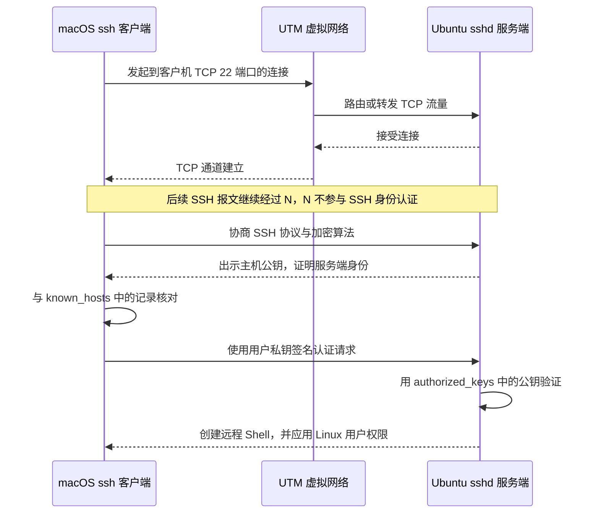

本文建立第 1 阶段的日常主路径：从 macOS 宿主机使用 OpenSSH 登录 Ubuntu Server 虚拟机。目标不只是“连上一次”，而是理解客户端、`sshd`、主机指纹、用户密钥、`known_hosts`、`authorized_keys` 和 `~/.ssh/config` 各自解决什么问题，并保留不会把自己锁在门外的恢复路径。

先完成 [[使用 UTM 创建 Ubuntu Server 开发虚拟机]] 与 [[Ubuntu Server 开发机初始化与安全基线]]。如果 Mac mini 尚不能稳定访问虚拟机，不要先引入 Tailscale；外出路径见 [[使用 Tailscale 远程访问 Linux 开发机]]。

## 这条连接为什么是真实 SSH



Mac mini 与虚拟机位于同一物理设备内部，并不会省略这些步骤。它与 MacBook Air 远程连接使用相同的 SSH 核心协议；区别只是网络路径较短，暂时没有跨地域、公网 NAT、云安全组和运营商网络等变量。

## 先区分两类身份

| 身份 | 由谁保存 | 证明什么 | 常见文件 |
| --- | --- | --- | --- |
| SSH 主机身份 | Ubuntu `sshd` | “我确实是你原来连接过的那台服务端” | `/etc/ssh/ssh_host_*_key` 及其 `.pub` 文件 |
| SSH 用户身份 | macOS 客户端与 Ubuntu 用户账号 | “我有权以这个 Linux 用户登录” | 客户端私钥、公钥；服务端 `~/.ssh/authorized_keys` |

客户端第一次连接时还不认识服务端，会要求核对主机指纹。接受后，主机公钥记录进入 macOS 的 `~/.ssh/known_hosts`。以后同一地址突然出示不同主机公钥时，SSH 会阻止连接，帮助发现虚拟机重装、地址被复用或中间人攻击。

> [!danger] 私钥永远留在客户端
> 只把以 `.pub` 结尾的公钥内容放到 Ubuntu 的 `authorized_keys`。不要通过聊天、笔记、Git、共享目录或 `scp` 把私钥传给虚拟机，也不要用 `sudo` 创建属于当前 macOS 用户的密钥。

## Git SSH 与登录 Linux 不是同一个场景

两者都使用 SSH，但连接对象和授权目标不同：

| 场景 | 服务端 | 服务端用公钥授权什么 | 成功后得到什么 |
| --- | --- | --- | --- |
| 登录 Linux 虚拟机 | Ubuntu 的 `sshd` | 某个 Linux 用户账号 | 远程 Shell、文件和该用户权限 |
| 通过 SSH 访问 Git 远程 | GitHub、GitLab 或代码平台 | 平台账号与仓库权限 | Git 协议操作，通常没有通用 Shell |

本篇只处理第一种。代码托管平台认证见 [[Git 凭据、SSH 与常见问题排查]]。为了便于撤销和识别，可以为 Linux 虚拟机与 GitHub 使用不同密钥文件。

## 前置检查

### 1. 确认 `sshd` 在 Ubuntu 上运行

**执行位置：Ubuntu 虚拟机（UTM 控制台，任意目录）**

```bash
sudo systemctl status ssh --no-pager
sudo systemctl is-enabled ssh
sudo ss -ltnp | grep ':22 '
```

预期 `ssh.service` 为 `active (running)`，并有进程监听 TCP 22。若命令提示 unit 不存在，先安装服务端组件：

**执行位置：Ubuntu 虚拟机（UTM 控制台，任意目录）**

```bash
sudo apt update
sudo apt install openssh-server
sudo systemctl enable --now ssh
```

撤销服务自启动可运行 `sudo systemctl disable --now ssh`，但这会中断远程入口；只在 UTM 控制台仍可用时操作。

### 2. 获取当前地址而不是写死动态 IP

**执行位置：Ubuntu 虚拟机（UTM 控制台，任意目录）**

```bash
hostnamectl
ip -brief address
ip route
```

选择 UTM 虚拟网卡上与 Mac mini 可互通的地址。不要记录回环地址 `127.0.0.1`，也不要把一次 DHCP 分配的地址写成永久事实。以后可以在 `~/.ssh/config` 中只修改 `HostName`，保留稳定别名。

### 3. 从 macOS 验证网络与端口

**执行位置：macOS 宿主机（任意目录）**

```bash
printf 'Ubuntu 虚拟机的当前 IP 或可解析主机名: '
IFS= read -r VM_HOST
ping -c 3 "$VM_HOST"
nc -vz "$VM_HOST" 22
```

`ping` 失败不一定代表 SSH 不可用，因为 ICMP 可能被过滤；`nc` 能连接 TCP 22 才是更直接的检查。若超时，先检查 UTM 网络模式、Ubuntu 地址和防火墙；若立即显示 `Connection refused`，通常是地址可达但 `sshd` 没有监听。

## 第一次连接前核验主机指纹

在可信的 UTM 控制台直接读取服务端 Ed25519 主机公钥指纹：

**执行位置：Ubuntu 虚拟机（UTM 控制台，任意目录）**

```bash
sudo ssh-keygen -lf /etc/ssh/ssh_host_ed25519_key.pub
```

记录屏幕上的 `SHA256:` 指纹，不记录私钥内容。随后从 macOS 发起首次连接：

**执行位置：macOS 宿主机（任意目录）**

```bash
printf 'Ubuntu 登录用户名: '
IFS= read -r VM_USER
printf 'Ubuntu 虚拟机的当前 IP 或可解析主机名: '
IFS= read -r VM_HOST
ssh "$VM_USER@$VM_HOST"
```

终端显示的 Ed25519 指纹必须与 UTM 控制台结果一致，核对后才输入 `yes`。首次可使用安装 Ubuntu 时创建的用户密码登录。成功后运行：

**执行位置：Ubuntu 虚拟机（首次 SSH 会话）**

```bash
whoami
hostnamectl --static
printf 'SSH_CONNECTION=%s\n' "$SSH_CONNECTION"
pwd
```

预期 `whoami` 是目标 Linux 用户，`SSH_CONNECTION` 非空，HOME 目录属于该用户。退出命令是 `exit`；它只关闭当前远程 Shell，不会关闭虚拟机。

> [!note] `ssh-keyscan` 不能替代可信核验
> `ssh-keyscan` 可以收集某个地址当前提供的主机公钥，但它没有证明网络上的响应者就是目标虚拟机。首次信任仍应通过 UTM 控制台或其他独立可信通道比较指纹。

## 创建专用于开发虚拟机的用户密钥

先检查目标文件是否已经存在，避免覆盖：

**执行位置：macOS 宿主机（任意目录）**

```bash
KEY_PATH="$HOME/.ssh/id_ed25519_eventhub_vm"
mkdir -p "$HOME/.ssh"
chmod 700 "$HOME/.ssh"
test ! -e "$KEY_PATH" && test ! -e "$KEY_PATH.pub"
```

只有最后一条退出码为 0 时才创建。若文件已存在，应先确认用途并选择新的清晰文件名，不要覆盖现有私钥。

**执行位置：macOS 宿主机（任意目录）**

```bash
KEY_PATH="$HOME/.ssh/id_ed25519_eventhub_vm"
ssh-keygen -t ed25519 -a 64 -f "$KEY_PATH" -C 'eventhub-development-vm'
chmod 600 "$KEY_PATH"
chmod 644 "$KEY_PATH.pub"
ssh-keygen -lf "$KEY_PATH.pub"
```

建议为私钥设置口令。`-a 64` 增加口令派生轮次，不改变服务端使用公钥的方式。生成成功后会得到私钥和同名 `.pub` 公钥。

## 把公钥安全加入 Ubuntu 用户

macOS 不一定自带 `ssh-copy-id`。下面的标准输入方式只传输公钥，并让远端以安全权限创建目录：

**执行位置：macOS 宿主机（任意目录）**

```bash
KEY_PATH="$HOME/.ssh/id_ed25519_eventhub_vm"
printf 'Ubuntu 登录用户名: '
IFS= read -r VM_USER
printf 'Ubuntu 虚拟机的当前 IP 或可解析主机名: '
IFS= read -r VM_HOST
cat "$KEY_PATH.pub" | ssh "$VM_USER@$VM_HOST" \
  'umask 077; mkdir -p "$HOME/.ssh"; cat >> "$HOME/.ssh/authorized_keys"'
```

这一步仍会要求当前可用的密码或旧密钥。随后在服务端核对权限：

**执行位置：Ubuntu 虚拟机（当前 SSH 会话）**

```bash
chmod 700 "$HOME/.ssh"
chmod 600 "$HOME/.ssh/authorized_keys"
ls -ld "$HOME/.ssh"
ls -l "$HOME/.ssh/authorized_keys"
```

如果误追加同一公钥多次，不会破坏认证，但应先备份 `authorized_keys`，再在文本编辑器中只删除完全重复的公钥行；不要删除仍被其他客户端使用的未知密钥。

## 在新会话中验证密钥登录

不要关闭仍可用的密码会话。另开一个 macOS 终端执行：

**执行位置：macOS 宿主机（新终端，任意目录）**

```bash
KEY_PATH="$HOME/.ssh/id_ed25519_eventhub_vm"
printf 'Ubuntu 登录用户名: '
IFS= read -r VM_USER
printf 'Ubuntu 虚拟机的当前 IP 或可解析主机名: '
IFS= read -r VM_HOST
ssh -o IdentitiesOnly=yes -i "$KEY_PATH" "$VM_USER@$VM_HOST"
```

预期只询问私钥口令，不再询问 Ubuntu 账号密码。登录后再次运行 `whoami` 与 `printf '%s\n' "$SSH_CONNECTION"`。只有新会话成功，才继续收紧密码认证。

需要减少私钥口令重复输入时，可以将密钥加入当前 macOS agent：

**执行位置：macOS 宿主机（任意目录）**

```bash
KEY_PATH="$HOME/.ssh/id_ed25519_eventhub_vm"
eval "$(ssh-agent -s)"
ssh-add --apple-use-keychain "$KEY_PATH"
ssh-add -l
```

`--apple-use-keychain` 是 macOS 系统 OpenSSH 的扩展，不要复制到 Ubuntu。

## 用 `~/.ssh/config` 建立稳定别名

配置文件把会变化的地址、用户名和密钥路径集中起来。先备份再编辑：

**执行位置：macOS 宿主机（任意目录）**

```bash
mkdir -p "$HOME/.ssh"
chmod 700 "$HOME/.ssh"
touch "$HOME/.ssh/config"
chmod 600 "$HOME/.ssh/config"
cp "$HOME/.ssh/config" "$HOME/.ssh/config.backup.$(date +%Y%m%d%H%M%S)"
```

在 `~/.ssh/config` 中加入一段；将示例文字替换为本次终端刚核对的值，不要照抄动态地址：

```sshconfig
Host eventhub-dev-vm
    HostName vm-current-address-or-resolvable-name
    User vm-login-user
    IdentityFile ~/.ssh/id_ed25519_eventhub_vm
    IdentitiesOnly yes
    ServerAliveInterval 30
    ServerAliveCountMax 3
```

验证最终生效配置与连接：

**执行位置：macOS 宿主机（任意目录）**

```bash
ssh -G eventhub-dev-vm | grep -E '^(hostname|user|identityfile) '
ssh eventhub-dev-vm
```

以后 DHCP 地址变化时只更新 `HostName`。IDE 的 Remote SSH 也应选择 `eventhub-dev-vm` 这个别名，使终端和 IDE 共用同一套连接定义。

## 可选：验证密钥后关闭密码登录

> [!danger] 先保留 UTM 控制台与已成功的新密钥会话
> 配置错误会导致远程锁定。必须先确认新开会话可以使用密钥登录，并确保 UTM 控制台仍能以本地用户登录。任何修改后先执行 `sshd -t`，不要直接重启整台虚拟机碰运气。

用一个排序靠前的本地 drop-in 明确配置，并保留备份：

**执行位置：Ubuntu 虚拟机（已验证的 SSH 会话）**

```bash
config_file=/etc/ssh/sshd_config.d/00-eventhub-development.conf
backup_file="${config_file}.before-stage1"
candidate_file=$(mktemp)
had_original=no
backup_ready=yes
configure_ok=no

if sudo test -e "$backup_file"; then
  printf '停止：固定备份已经存在，请先核对：%s\n' "$backup_file" >&2
  backup_ready=no
elif sudo test -e "$config_file"; then
  if sudo cp -a -- "$config_file" "$backup_file"; then
    had_original=yes
  else
    printf '停止：无法备份原配置。\n' >&2
    backup_ready=no
  fi
fi

cat >"$candidate_file" <<'EOF'
PubkeyAuthentication yes
PasswordAuthentication no
KbdInteractiveAuthentication no
PermitRootLogin no
EOF

check_stage1_sshd_values() {
  local effective_config expected
  effective_config=$(sudo sshd -T) || return 1
  for expected in \
    'pubkeyauthentication yes' \
    'passwordauthentication no' \
    'kbdinteractiveauthentication no' \
    'permitrootlogin no'; do
    if ! printf '%s\n' "$effective_config" | grep -qxF -- "$expected"; then
      printf '生效值不符合预期：%s\n' "$expected" >&2
      printf '%s\n' "$effective_config" | \
        grep -E '^(pubkeyauthentication|passwordauthentication|kbdinteractiveauthentication|permitrootlogin) ' >&2
      return 1
    fi
  done
}

if [ "$backup_ready" != yes ]; then
  printf '未修改 sshd 配置。\n' >&2
elif sudo install -o root -g root -m 0644 "$candidate_file" "$config_file" && \
     sudo sshd -t && \
     check_stage1_sshd_values && \
     sudo systemctl reload ssh.service && \
     check_stage1_sshd_values; then
  sudo sshd -T | grep -E '^(pubkeyauthentication|passwordauthentication|kbdinteractiveauthentication|permitrootlogin) '
  if [ "$had_original" = yes ]; then
    printf '原配置备份：%s\n' "$backup_file"
  else
    printf '原先没有同名配置；回滚时应删除本次新建文件。\n'
  fi
  configure_ok=yes
else
  printf '配置未通过完整验证，正在恢复修改前状态。\n' >&2
  restore_ok=yes
  if [ "$had_original" = yes ]; then
    sudo cp -a -- "$backup_file" "$config_file" || restore_ok=no
  else
    sudo rm -f -- "$config_file" || restore_ok=no
  fi
  if [ "$restore_ok" = yes ] && sudo sshd -t; then
    sudo systemctl reload ssh.service || \
      printf '警告：原配置已写回，但 reload 失败；请留在控制台排查。\n' >&2
  else
    printf '紧急：未能完整恢复修改前配置；请保持 UTM 控制台并检查备份。\n' >&2
  fi
fi

rm -f -- "$candidate_file"
unset -f check_stage1_sshd_values
test "$configure_ok" = yes
```

再从 macOS 新开第三个会话执行 `ssh eventhub-dev-vm`。确认成功后才关闭旧会话。

恢复时在 UTM 控制台区分两种情况：原文件存在就恢复固定备份；本次是新建文件才删除。先把当前 stage-1 配置另存为带时间戳的回滚副本，恢复失败时还能放回：

**执行位置：Ubuntu 虚拟机（UTM 控制台）**

```bash
config_file=/etc/ssh/sshd_config.d/00-eventhub-development.conf
backup_file="${config_file}.before-stage1"
rollback_copy="${config_file}.disabled.$(date +%Y%m%d%H%M%S)"
rollback_ok=no

if ! sudo test -e "$config_file"; then
  printf '停止：当前 stage-1 配置不存在，请人工检查。\n' >&2
elif ! sudo cp -a -- "$config_file" "$rollback_copy"; then
  printf '停止：无法保存当前配置。\n' >&2
else
  restore_ready=yes
  if sudo test -e "$backup_file"; then
    if sudo cp -a -- "$backup_file" "$config_file"; then
      restore_action="恢复原文件"
    else
      restore_ready=no
    fi
  else
    if sudo rm -- "$config_file"; then
      restore_action="恢复原先不存在的状态"
    else
      restore_ready=no
    fi
  fi

  if [ "$restore_ready" != yes ]; then
    printf '停止：无法写入待恢复状态；当前配置未通过 reload。\n' >&2
  elif sudo sshd -t && sudo systemctl reload ssh.service; then
    printf '%s；当前 stage-1 配置保留在：%s\n' "$restore_action" "$rollback_copy"
    rollback_ok=yes
  else
    printf '恢复结果未通过验证，放回操作前配置。\n' >&2
    sudo cp -a -- "$rollback_copy" "$config_file"
    if sudo sshd -t; then
      sudo systemctl reload ssh.service
    fi
  fi
fi

test "$rollback_ok" = yes
```

只有确认新会话正常且不再需要反向恢复后，才人工清理 `.before-stage1` 或 `.disabled.*`；不要用通配符批量删除 `/etc/ssh/sshd_config.d/` 下的文件。

## 主机指纹变化怎么处理

虚拟机重装会生成新的 SSH 主机密钥；DHCP 也可能把旧地址分配给另一台机器。此时 SSH 的警告是保护机制，不能用关闭检查来绕过。

先通过 UTM 控制台重新读取新指纹，确认确实是这台已重装的虚拟机。然后只移除对应旧记录：

**执行位置：macOS 宿主机（任意目录）**

```bash
printf '已经通过控制台核对的新主机地址: '
IFS= read -r VM_HOST
cp "$HOME/.ssh/known_hosts" "$HOME/.ssh/known_hosts.backup.$(date +%Y%m%d%H%M%S)"
ssh-keygen -F "$VM_HOST"
ssh-keygen -R "$VM_HOST"
```

再次连接时重新比较指纹。不要删除整个 `known_hosts`，也不要设置 `StrictHostKeyChecking no`；这会同时丢掉其他主机的身份保护。

## 防火墙检查

若使用 UFW，必须先允许 SSH 再启用防火墙。完整基线见 [[Ubuntu Server 开发机初始化与安全基线]]。

**执行位置：Ubuntu 虚拟机（UTM 控制台或仍可用的 SSH 会话）**

```bash
sudo ufw status verbose
sudo ufw allow OpenSSH
sudo ufw enable
sudo ufw status numbered
```

撤销规则前确认还有其他管理入口。可以先用 `sudo ufw status numbered` 找到规则，再运行 `sudo ufw delete allow OpenSSH`；远程执行后会失去 SSH 入口，因此通常只应在 UTM 控制台进行。

## 排查顺序

| 现象 | 优先检查 | 服务端命令 |
| --- | --- | --- |
| 连接超时 | 地址、UTM 网络、路由、UFW | `ip -brief address`、`ip route`、`sudo ufw status` |
| `Connection refused` | `sshd` 是否运行和监听 | `systemctl status ssh`、`ss -ltnp` |
| `Permission denied (publickey)` | 用户名、客户端密钥、服务端权限 | `ls -ld ~/.ssh`、`ls -l ~/.ssh/authorized_keys` |
| 主机密钥警告 | 是否重装、地址是否被复用 | 控制台运行 `ssh-keygen -lf` |
| 登录后立即断开 | Shell、HOME 权限、服务日志 | `getent passwd "$USER"`、`journalctl -u ssh` |
| IDE 能连而终端不能连 | 两者是否读取相同 config 和密钥 | macOS 运行 `ssh -G eventhub-dev-vm` |

客户端调试：

**执行位置：macOS 宿主机（任意目录）**

```bash
ssh -vvv eventhub-dev-vm
```

调试输出可能包含用户名、主机名、地址和公钥指纹，分享前要脱敏；它不会主动打印私钥内容。

服务端日志：

**执行位置：Ubuntu 虚拟机（UTM 控制台）**

```bash
sudo journalctl -u ssh.service -n 100 --no-pager
sudo sshd -t
sudo sshd -T | grep -E '^(port|pubkeyauthentication|passwordauthentication|permitrootlogin) '
```

## 完成标准

- [ ] 能从 UTM 控制台确认 `ssh.service` 与 TCP 22。
- [ ] 首次连接前通过独立控制台核对过主机指纹。
- [ ] macOS 私钥权限为 600，公钥已经写入正确 Ubuntu 用户的 `authorized_keys`。
- [ ] 新开终端能使用密钥登录，不依赖仍打开的旧连接。
- [ ] `ssh eventhub-dev-vm` 与 IDE 使用同一 `~/.ssh/config` 别名。
- [ ] 能解释 `known_hosts` 与 `authorized_keys` 的区别。
- [ ] 知道如何通过 UTM 控制台回滚错误的 `sshd` 配置。
- [ ] 知道 Git 远程 SSH 认证应继续阅读 [[Git 凭据、SSH 与常见问题排查]]。

完成后继续 [[Linux 后端开发目录与工具链规划]]；项目迁移与构建见 [[在 Linux 中迁移并验证 EventHub Go 与 Java 项目]]。

## 官方参考资料

以下 OpenSSH、Ubuntu 与 UFW 资料于 **2026-07-16** 核对；变更服务端认证策略前，应重新阅读当前系统安装版本对应的手册并以 `sshd -T` 验证最终生效值。

- [Ubuntu Server：OpenSSH server](https://ubuntu.com/server/docs/how-to/security/openssh-server/)
- [OpenBSD：ssh 客户端手册](https://man.openbsd.org/ssh.1)
- [OpenBSD：sshd 服务端手册](https://man.openbsd.org/sshd.8)
- [OpenBSD：ssh-keygen 手册](https://man.openbsd.org/ssh-keygen.1)
- [OpenBSD：ssh_config 手册](https://man.openbsd.org/ssh_config)
- [OpenBSD：sshd_config 手册](https://man.openbsd.org/sshd_config)
- [Ubuntu Server：UFW 防火墙](https://ubuntu.com/server/docs/how-to/security/firewalls/)
