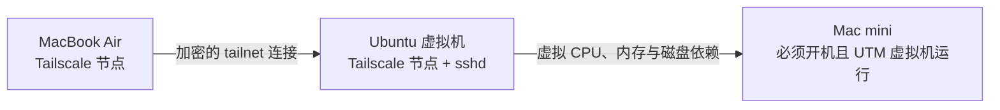

本文为第 1 阶段增加一条可选外出路径：MacBook Air 通过 Tailscale 到达运行在 Mac mini 内部的 Ubuntu Server 虚拟机，再使用 SSH 登录。它解决的是跨网络“怎样到达虚拟机”，不会替代 Ubuntu 用户、OpenSSH 密钥、文件权限或项目工具链。

先完整通过 [[从 macOS 使用 SSH 连接 Linux 虚拟机]] 的本地验收。Mac mini 到虚拟机的 SSH 才是第 1 阶段必需路径；Tailscale 配置失败不能阻止本阶段继续完成项目构建。

## 使用场景与依赖条件



外出访问同时依赖：

1. Mac mini 没有关机或进入会停止虚拟机的休眠状态。
2. UTM 中的 Ubuntu 虚拟机正在运行。
3. Ubuntu 能访问互联网，`tailscaled` 与 `sshd` 都在运行。
4. MacBook Air 与 Ubuntu 节点属于同一个受控 tailnet，并被访问策略允许互通。
5. MacBook Air 仍具备传统 SSH 所需的用户私钥，或另行采用经过设计的 Tailscale SSH。

> [!important] Tailscale 不会让已关机的开发机自动上线
> Tailscale 只提供网络连接能力。它不会替你启动 Mac mini、唤醒 UTM 虚拟机或修复虚拟机内已经停止的 `sshd`。远程前要先设计宿主机供电、睡眠和虚拟机启动策略；本阶段不修改这些 macOS 系统设置。

## 为什么把 Tailscale 直接装在 Ubuntu 虚拟机

UTM Shared Network 通常由宿主机进行路由或 NAT。局域网内的 Mac mini 可以访问客户机，但外部设备未必能直接路由到这个内部地址。

将 Tailscale 直接安装在 Ubuntu 虚拟机后，虚拟机自身成为 tailnet 节点，通过出站连接建立覆盖网络。MacBook Air 不需要知道 UTM 内部 DHCP 地址，也不需要在家庭路由器上暴露公网 SSH 端口。

只在 Mac mini 上安装 Tailscale、再让它转发到虚拟机，需要额外配置子网路由或转发规则，故障面和权限边界更复杂，不作为本阶段主线。

## 本阶段选择：Tailscale 网络加传统 OpenSSH

Tailscale 官方还提供名为 **Tailscale SSH** 的功能。两种方式不要混为一谈：

| 方式 | 网络层 | SSH 用户认证 | 本阶段建议 |
| --- | --- | --- | --- |
| 传统 OpenSSH over Tailscale | Tailscale 负责设备互通 | `sshd`、客户端私钥、`authorized_keys` | 采用；与本地路径保持同一核心原理 |
| Tailscale SSH | Tailscale 同时接管 tailnet 入站 22 端口的认证与授权 | tailnet 身份和访问控制策略 | 后续可评估，本阶段不启用 |

Tailscale SSH 不会修改 `/etc/ssh/sshd_config` 或 `authorized_keys`，但它会改变从 tailnet 进入时的认证模型。第 1 阶段需要亲手练习主机指纹、用户密钥和 `sshd`，因此主线只把 Tailscale 当作网络层，不执行 `tailscale set --ssh`。

## 安装前记录基线

**执行位置：Ubuntu 虚拟机（任意目录，只读检查）**

```bash
. /etc/os-release
printf 'system=%s\n' "$PRETTY_NAME"
uname -m
systemctl is-active ssh
ip -brief address
```

预期 Ubuntu 与本地 SSH 已正常工作。若 `sshd` 本身有问题，先按 [[从 macOS 使用 SSH 连接 Linux 虚拟机]] 修复，不要用 Tailscale 掩盖服务端故障。

**执行位置：MacBook Air（任意目录，只读检查）**

```bash
uname -m
command -v tailscale || true
command -v ssh
```

macOS 与 Ubuntu 的 Tailscale 安装方式会变化，执行时应重新查看 [Tailscale 官方安装页](https://tailscale.com/docs/install)。不要从来源不明的下载站获取客户端。

## 在 Ubuntu 虚拟机安装并加入 tailnet

Tailscale 官方 Linux 文档提供官方安装脚本，也提供发行版软件包仓库的手工方式。如果不接受 `curl | sh`，应按同一官方页面选择 Ubuntu 软件包仓库步骤；不要改用第三方脚本。

**执行位置：Ubuntu 虚拟机（任意目录）**

```bash
curl -fsSL https://tailscale.com/install.sh -o /tmp/tailscale-install.sh
less /tmp/tailscale-install.sh
sudo sh /tmp/tailscale-install.sh
rm /tmp/tailscale-install.sh
```

先保存并查看脚本再以 `sudo` 执行，便于理解将要添加的软件源和软件包。安装后确认服务：

**执行位置：Ubuntu 虚拟机（任意目录）**

```bash
sudo systemctl status tailscaled --no-pager
sudo systemctl is-enabled tailscaled
sudo tailscale up
```

`tailscale up` 会输出一个登录 URL。只在可信浏览器中完成认证，不把 URL、一次性认证信息或 auth key 写入笔记和 Shell 脚本。认证后运行：

**执行位置：Ubuntu 虚拟机（任意目录）**

```bash
tailscale status
tailscale ip -4
ip -brief address show tailscale0
```

预期能看到本机 tailnet 名称或地址、`tailscale0` 接口以及其他获准节点。Tailscale 地址通常比 UTM DHCP 地址稳定，但仍应优先使用 MagicDNS 名称或 SSH 别名，不把某次地址写成永久配置。

## 在 MacBook Air 安装并加入同一 tailnet

按照 Tailscale 官方 macOS 安装说明选择 App Store 或官方安装包，并使用同一组织允许的登录方式。完成后检查：

**执行位置：MacBook Air（任意目录）**

```bash
tailscale status
tailscale netcheck
```

如果 `tailscale` CLI 没有进入 `PATH`，先按当前 Tailscale macOS 官方文档处理 CLI，而不是创建指向未知应用位置的固定软链接。

在 Tailscale 管理后台确认两台设备：

- 设备名称与所有者正确，没有误加入个人或其他组织的 tailnet。
- 设备审批、标签和访问控制符合当前 tailnet 策略。
- 没有为了方便长期关闭所有设备的 key expiry。
- 丢失或不再使用的设备能够及时撤销。

## 先验证 Tailscale 网络，再验证 SSH

从 Ubuntu 的 `tailscale status` 或管理后台取得虚拟机的 MagicDNS 名称。不要猜测地址。

**执行位置：MacBook Air（任意目录）**

```bash
printf 'Ubuntu 虚拟机的 MagicDNS 名称或 Tailscale 地址: '
IFS= read -r TS_HOST
tailscale ping "$TS_HOST"
nc -vz "$TS_HOST" 22
```

判断顺序：

1. `tailscale ping` 成功说明两个 Tailscale 节点与访问策略基本可达。
2. TCP 22 成功说明网络能到达 `sshd`。
3. 只有前两层成功后，SSH 用户认证错误才应从密钥和 Linux 用户排查。

## 为 MacBook Air 使用独立 SSH 密钥

Tailscale 网络不会自动把 Mac mini 上的 SSH 私钥复制到 MacBook Air。不要通过聊天、邮件、Git 或公共共享目录传输私钥。更容易审计的方式是在 MacBook Air 生成独立密钥，把它的公钥加入同一个 Ubuntu 用户。

**执行位置：MacBook Air（任意目录）**

```bash
KEY_PATH="$HOME/.ssh/id_ed25519_eventhub_vm_air"
mkdir -p "$HOME/.ssh"
chmod 700 "$HOME/.ssh"
if test -e "$KEY_PATH" || test -e "$KEY_PATH.pub"; then
  printf '密钥路径已存在，请先确认用途并改用新的文件名：%s\n' "$KEY_PATH" >&2
else
  ssh-keygen -t ed25519 -a 64 -f "$KEY_PATH" -C 'eventhub-development-vm-from-air'
  chmod 600 "$KEY_PATH"
  chmod 644 "$KEY_PATH.pub"
fi
```

若脚本发现文件已存在，它不会调用 `ssh-keygen`；应先识别用途并改用新的清晰文件名。接着通过已经可达的 Tailscale 地址，把 **公钥** 加到 Ubuntu：

**执行位置：MacBook Air（任意目录）**

```bash
KEY_PATH="$HOME/.ssh/id_ed25519_eventhub_vm_air"
printf 'Ubuntu 登录用户名: '
IFS= read -r VM_USER
printf 'Ubuntu 虚拟机的 MagicDNS 名称或 Tailscale 地址: '
IFS= read -r TS_HOST
cat "$KEY_PATH.pub" | ssh "$VM_USER@$TS_HOST" \
  'umask 077; mkdir -p "$HOME/.ssh"; cat >> "$HOME/.ssh/authorized_keys"'
```

这一步需要服务端仍允许一种已有认证方式。更稳妥的做法是在出门前通过 Mac mini 本地路径或 UTM 控制台提前登记 MacBook Air 公钥并测试。

另开终端验证：

**执行位置：MacBook Air（新终端，任意目录）**

```bash
KEY_PATH="$HOME/.ssh/id_ed25519_eventhub_vm_air"
printf 'Ubuntu 登录用户名: '
IFS= read -r VM_USER
printf 'Ubuntu 虚拟机的 MagicDNS 名称或 Tailscale 地址: '
IFS= read -r TS_HOST
ssh -o IdentitiesOnly=yes -i "$KEY_PATH" "$VM_USER@$TS_HOST"
```

首次连接仍要核对主机指纹。虽然网络经过 Tailscale，传统 OpenSSH 的 `known_hosts` 检查没有消失。

## 为外出路径配置单独别名

在 MacBook Air 的 `~/.ssh/config` 中使用单独别名，避免与 Mac mini 本地 UTM 地址混淆：

```sshconfig
Host eventhub-dev-vm-away
    HostName vm-tailnet-magicdns-name
    User vm-login-user
    IdentityFile ~/.ssh/id_ed25519_eventhub_vm_air
    IdentitiesOnly yes
    ServerAliveInterval 30
    ServerAliveCountMax 3
```

**执行位置：MacBook Air（任意目录）**

```bash
chmod 700 "$HOME/.ssh"
chmod 600 "$HOME/.ssh/config"
ssh -G eventhub-dev-vm-away | grep -E '^(hostname|user|identityfile) '
ssh eventhub-dev-vm-away
```

IDE Remote SSH 也可使用 `eventhub-dev-vm-away`。本地路径与外出路径使用不同别名，便于明确自己正在经过哪一张网络。

## 防火墙与访问控制边界

Tailscale 访问至少受三层控制：

| 层次 | 负责什么 | 典型检查 |
| --- | --- | --- |
| tailnet 访问控制 | 哪个用户或设备可以连接哪个节点和端口 | 管理后台策略与测试 |
| Ubuntu 防火墙 | 数据包到达虚拟机后是否允许进入 | `sudo ufw status verbose` |
| OpenSSH 用户认证 | 能否以指定 Linux 用户建立会话 | `authorized_keys`、`sshd -T`、SSH 日志 |

不要因为已经使用 Tailscale 就关闭 SSH 主机指纹验证，也不要把 UFW 和 tailnet 策略当成互相替代。若需要把 SSH 限制到 `tailscale0`，先设计怎样保留 Mac mini 本地救援路径；本阶段不做这种收紧。

## 常见问题与定位

### Tailscale 中看不到 Ubuntu 节点

**执行位置：Ubuntu 虚拟机（UTM 控制台）**

```bash
systemctl is-active tailscaled
sudo journalctl -u tailscaled.service -n 100 --no-pager
tailscale status
tailscale netcheck
```

检查虚拟机是否联网、设备认证是否过期、系统时间是否正确，以及节点是否加入了预期 tailnet。

### `tailscale ping` 成功但 SSH 拒绝

**执行位置：Ubuntu 虚拟机（UTM 控制台）**

```bash
systemctl is-active ssh
sudo ss -ltnp | grep ':22 '
sudo ufw status verbose
sudo journalctl -u ssh.service -n 100 --no-pager
```

Tailscale 网络成功不等于 `sshd` 正常。`Connection refused` 优先查服务监听；`Permission denied` 优先查用户名、密钥和 `authorized_keys` 权限。

### 外出时完全离线

先确认 Mac mini 是否开机、UTM 虚拟机是否运行。若宿主机或 VM 已关机，tailnet 管理页面可能只显示最后在线时间，任何 SSH 调试都无法让关机设备恢复。

### 连接走了中继

`tailscale ping` 或 `tailscale status` 可能显示直接连接或 DERP 中继。中继仍能提供连接，只是延迟和带宽可能不同。本阶段不为追求“必须直连”而修改家庭路由器、开放公网端口或关闭安全策略；先记录现象，再按 Tailscale 官方连接排障文档分层检查。

## 暂停、退出与撤销

临时断开 tailnet：

**执行位置：Ubuntu 虚拟机（任意目录）**

```bash
sudo tailscale down
```

重新连接可运行 `sudo tailscale up`。彻底把本机退出当前 tailnet：

**执行位置：Ubuntu 虚拟机（任意目录）**

```bash
sudo tailscale logout
```

`logout` 会使该节点需要重新认证。卸载前还应在管理后台撤销或删除不再使用的设备记录。不要在确认 Mac mini 本地 SSH 仍正常之前删除 Ubuntu 的 SSH 公钥或关闭 `sshd`。

如果需要卸载，先查看当前官方 Linux 卸载说明和实际安装包，再由 APT 移除；不要直接删除 `/var/lib/tailscale`，其中包含节点状态，清理属于不可逆步骤，必须先确认设备已经从管理面撤销且不需要恢复身份。

## 可选完成清单

- [ ] Mac mini 到虚拟机的本地 SSH 已先独立通过验收。
- [ ] MacBook Air 与 Ubuntu 虚拟机位于正确的 tailnet。
- [ ] `tailscale ping` 与 TCP 22 都能从 MacBook Air 验证。
- [ ] MacBook Air 使用自己的 SSH 私钥，私钥没有跨设备明文传输。
- [ ] 首次 OpenSSH 连接仍核对了主机指纹。
- [ ] `ssh eventhub-dev-vm-away` 能新开会话，并能解释它与本地别名的网络路径差异。
- [ ] 设备审批、key expiry 与访问控制没有为了省事被全部关闭。
- [ ] 知道 Mac mini 或 VM 关机时 Tailscale 无法替代供电与启动能力。

项目目录与工具链见 [[Linux 后端开发目录与工具链规划]]；环境恢复基线见 [[Linux 开发虚拟机备份恢复与常见问题]]。

## 官方参考资料

以下 Tailscale 与 OpenSSH 资料于 **2026-07-16** 核对；客户端界面、节点密钥策略和访问控制模型可能演进，实际启用前应重新查看官方文档与当前 tailnet 策略。

- [Tailscale：安装入口](https://tailscale.com/docs/install)
- [Tailscale：在 Linux 安装](https://tailscale.com/docs/install/linux)
- [Tailscale：MagicDNS](https://tailscale.com/docs/features/magicdns)
- [Tailscale：连接类型](https://tailscale.com/docs/reference/connection-types)
- [Tailscale：Tailscale SSH](https://tailscale.com/docs/features/tailscale-ssh)
- [Tailscale：保护 tailnet 的最佳实践与节点密钥过期](https://tailscale.com/docs/reference/best-practices/security)
- [Tailscale：访问控制](https://tailscale.com/docs/features/access-control)
- [Ubuntu Server：OpenSSH server](https://ubuntu.com/server/docs/how-to/security/openssh-server/)
