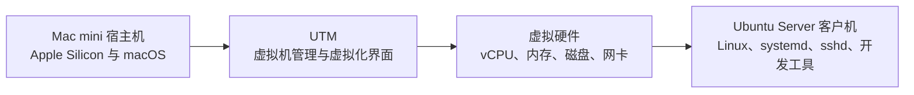
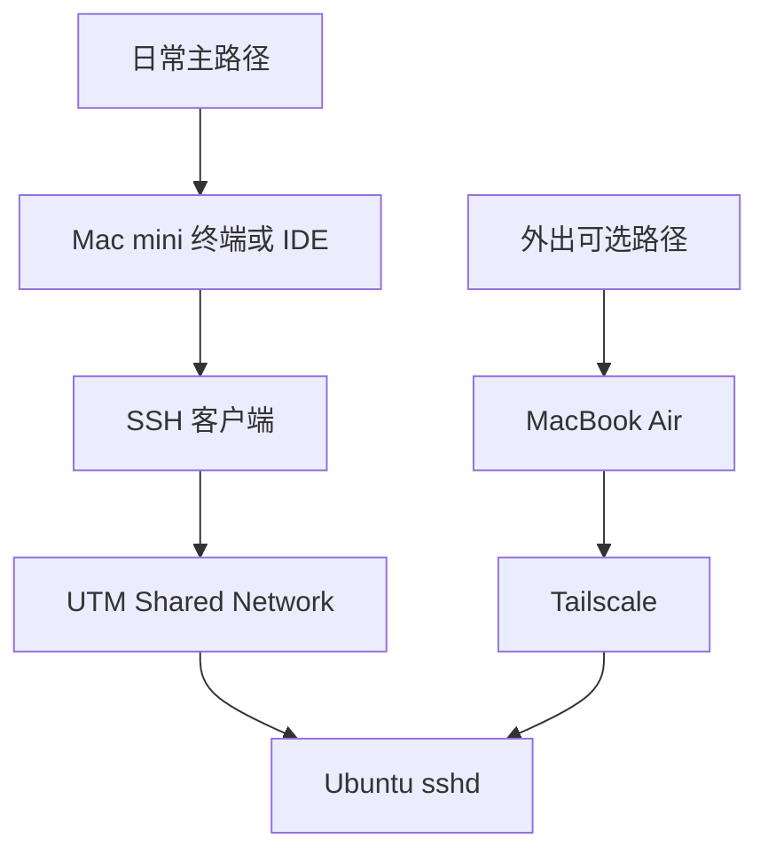

本文说明如何在 Apple Silicon Mac 上使用 UTM 创建一台 Ubuntu Server ARM64 开发虚拟机。目标不是只让 Ubuntu 启动，而是理解宿主机、虚拟机、CPU 架构、虚拟磁盘和虚拟网络之间的关系，并为后续 SSH、Go、Java、Docker 与 EventHub 项目验证建立稳定基础。

本文只提供操作说明，不会自动安装 UTM、创建虚拟机或修改 macOS。完成虚拟机安装后，继续 [[Ubuntu Server 开发机初始化与安全基线]]；整组笔记的入口与阶段完成标准见 [[Linux 后端开发虚拟机搭建概览]]。

> [!info] 核对日期与本次实操案例
> 本文涉及 UTM、Ubuntu 下载页面和安装界面的信息于 **2026-07-16** 核对。版本与界面会变化，执行时以 UTM 和 Ubuntu 官方页面为准。
>
> 本次只读检查确认：案例宿主机是 Apple M4、24GB 内存，根卷约有 347GiB 可用空间；`/Applications/UTM.app` 当前不存在。计划中的 6 vCPU、12GB 内存、180GB 虚拟磁盘只是适合本次 Go、Java 与 Docker 学习负载的起点，不是所有机器的固定答案。

## 完成标准

完成本文后，应满足：

- 能解释宿主机、Hypervisor、虚拟机和客户机操作系统分别承担什么职责。
- 知道 Apple Silicon 应优先使用 ARM64 客户机，并能解释 ARM64 与 AMD64 不可混用的原因。
- 能解释 UTM 中“虚拟化”和“模拟”的性能与适用场景差异。
- 已从 Ubuntu 官方来源取得 Ubuntu Server 24.04 LTS ARM64 ISO，并完成校验。
- 已按宿主机资源为虚拟机分配合理的 vCPU、内存和稀疏磁盘上限。
- 已使用 Shared Network 作为第一阶段主线网络，并理解桥接网络的额外暴露面。
- Ubuntu Server 能从虚拟磁盘启动，安装 ISO 已卸载。
- 客户机内确认体系结构为 `aarch64` / `arm64`，系统属于 Ubuntu 24.04 LTS 系列。
- 项目准备长期存放在 Linux 本地文件系统，而不是 UTM 共享目录或 iCloud 路径。

## 1. 先理解四个角色



| 名称 | 本文中的对象 | 主要职责 |
| --- | --- | --- |
| 宿主机 Host | 运行 macOS 的 Mac mini | 提供真实 CPU、内存、磁盘、网络与电源状态 |
| Hypervisor | Apple 的虚拟化能力，由 UTM 调用 | 隔离并调度客户机使用的 CPU、内存和设备 |
| 虚拟机 VM | UTM 中保存的一组配置和虚拟磁盘 | 表示一台可启动、关机、备份和恢复的虚拟计算机 |
| 客户机 Guest | 安装在虚拟机内的 Ubuntu Server | 像独立 Linux 主机一样管理用户、服务、文件与网络 |

UTM 是 macOS 应用，不是客户机操作系统。Ubuntu 安装在虚拟磁盘中；虚拟机里的 `sudo`、`systemctl`、`sshd` 和文件权限都由 Ubuntu 管理，不会因为宿主机也是自己的电脑而被绕过。

Mac mini 终端通过 SSH 连接其内部虚拟机时，仍然是完整的 SSH 客户端—服务端流程：macOS 上的 `ssh` 是客户端，Ubuntu 中的 `sshd` 是服务端。它与 MacBook Air 经 Tailscale 连接使用相同的核心协议和身份验证机制，只是本机路径暂时没有覆盖跨地域、公网运营商 NAT 和云安全组等问题。详细流程见 [[从 macOS 使用 SSH 连接 Linux 虚拟机]]，外出扩展路径见 [[使用 Tailscale 远程访问 Linux 开发机]]。

## 2. ARM64 与 AMD64 为什么必须先选对

CPU 架构决定操作系统镜像和程序机器码面向哪类处理器：

| 常见名称 | 另一种常见写法 | 典型硬件 |
| --- | --- | --- |
| ARM64 | AArch64、`arm64`、`aarch64` | Apple Silicon、许多 ARM 服务器 |
| AMD64 | x86_64、`amd64` | Intel 64 位和 AMD 64 位处理器 |

Apple M 系列属于 ARM64。第一阶段应选择文件名含 `arm64` 的 Ubuntu Server ISO，并使用 UTM 的 **Virtualize** 路线。文件名含 `amd64` 的 ISO 面向 x86_64；即使 UTM 可以通过模拟运行，性能、功耗和排障复杂度都不适合作为本阶段主线。

> [!warning] 不要用 `64-bit` 三个字猜架构
> ARM64 和 AMD64 都是 64 位，但指令集不同。下载前同时核对宿主机芯片、ISO 文件名和 UTM 创建模式。

## 3. 虚拟化与模拟的区别

| 方式 | CPU 架构关系 | 本次用途 | 特点 |
| --- | --- | --- | --- |
| 虚拟化 Virtualize | 宿主与客户机架构一致，例如 ARM64 运行 ARM64 | 本阶段主线 | 大部分客户机指令可直接由真实 CPU 执行，性能接近原生 |
| 模拟 Emulate | 宿主与客户机架构可以不同，例如 ARM64 模拟 x86_64 | 仅在必须运行其他架构时使用 | QEMU 需要翻译指令，通常更慢、耗能更多，设备兼容问题也更多 |

UTM 官方说明其在 Apple Silicon 上可通过 Apple Hypervisor 运行 ARM64 操作系统，同时也能用较低性能的模拟方式运行 x86/x64。对于 Go、Java、Docker 和常规后端构建，使用 ARM64 Ubuntu 可减少无意义的架构转换；以后真正遇到只提供 AMD64 的二进制或镜像时，再单独评估多架构镜像、Rosetta 或模拟方案。

## 4. 根据宿主机和负载配置资源

### 4.1 本次案例起点

| 资源 | 本次案例 | 选择理由 | 调整原则 |
| --- | --- | --- | --- |
| vCPU | 6 | 能并行编译 Go、Java，又为 10 核宿主机保留响应空间 | 轻量学习可从 4 开始；不要把全部宿主核心都分给虚拟机 |
| 内存 | 12GB | 可同时容纳 Ubuntu、IDE 远程进程、Maven、Go 测试和少量 Docker 容器 | 8GB 可完成较轻任务；多个数据库或并行构建再观察后增大 |
| 虚拟磁盘上限 | 180GB | 为两个仓库、依赖缓存、Docker 镜像与后续实验留空间 | 宿主剩余空间较少时可从 80–120GB 开始，确认增长需求后再扩容 |
| 系统 | Ubuntu Server 24.04 LTS ARM64 | 与 Apple Silicon 架构一致，且符合本次阶段计划 | 项目约束优先；下载当前 24.04.x ARM64 安装镜像 |

vCPU 不是把某六个物理核心永久交给 Ubuntu。Hypervisor 仍由宿主调度真实 CPU 时间。分配过多 vCPU 可能增加调度开销，也可能让 macOS、IDE 和虚拟机同时繁忙时互相争抢。

内存与 CPU 通常可以在虚拟机完全关机后调整。先使用能完成任务的配置，再根据客户机内 `free -h`、构建时间和宿主机内存压力调整，不要为了“规格更高”一次分配全部资源。

### 4.2 180GB 稀疏磁盘不是立即占用 180GB

UTM 的磁盘设置表示客户机可见的容量上限。根据 UTM 后端和磁盘格式，APFS 上的 raw 稀疏文件或 QCOW2 文件会随着客户机实际写入而增长，而不是创建时立刻写满上限。

这不代表可以忽略宿主空间：

- Ubuntu、APT 缓存、Maven 与 Go 缓存、Docker 镜像和卷会持续占用真实空间。
- 快照、复制 `.utm` 包或导出备份可能需要额外空间。
- 客户机删除文件后，宿主磁盘映像不一定立即缩小；回收空间需要 TRIM、关机和 UTM 支持的回收流程。
- 虚拟磁盘通常容易扩容但不容易安全缩小，因此初始值要留余量但不宜夸张。

> [!warning] 稀疏不是无限空间
> 当宿主机真实可用空间耗尽时，客户机仍可能写入失败或文件系统损坏。后续应同时观察 macOS 与 Ubuntu 的剩余空间，并按 [[Linux 开发虚拟机备份恢复与常见问题]] 建立备份和恢复基线。

## 5. 选择虚拟网络

### 5.1 第一阶段使用 Shared Network

UTM 的 Shared Network 由宿主机路由客户机流量，是本次主线。它通常能让 Ubuntu：

- 通过宿主机网络访问互联网和 Ubuntu 软件仓库；
- 通过 DHCP 获得虚拟网络中的动态地址；
- 与 Mac mini 宿主机互相访问，从而练习真实 SSH；
- 避免一开始就把客户机直接暴露到整个家庭局域网。

Shared Network 在概念上属于 NAT/共享网络：客户机的外发连接由宿主网络能力承载，客户机地址不是需要写死的长期资产。每次启动后都应通过 Ubuntu 内的 `ip address` 或后续 SSH 配置重新确认，而不是把某次动态 IP 写进公开笔记。

### 5.2 什么时候才考虑 Bridged Network

桥接模式把虚拟网卡接到选定的宿主网络接口，使虚拟机更像局域网中的独立设备。它适合需要让同一局域网其他设备直接访问客户机、测试局域网广播或必须从局域网 DHCP 获得地址的场景。

桥接不是第一阶段必需项，原因包括：

- 客户机的服务可能被同一局域网的其他设备发现和访问；
- Wi-Fi 桥接可能需要额外配置或受接入点限制；
- 公司、校园或酒店网络可能限制额外 MAC 地址；
- 防火墙、DHCP、路由和排障面会扩大。

先用 Shared Network 完成 Mac mini 到虚拟机的 SSH。外出时使用 [[使用 Tailscale 远程访问 Linux 开发机]]，不需要为了远程访问而先改成桥接网络。

### 5.3 路径对比



## 6. 下载 Ubuntu Server 24.04 LTS ARM64

### 6.1 选择正确镜像

从 Ubuntu 官方下载页进入“Alternative downloads”，选择当前仍提供的 **Ubuntu Server 24.04.x LTS / ARM 64-bit architecture**。普通后端开发使用默认 ARM64 4K 页大小镜像即可，不需要面向大内存、高性能计算场景的 `arm64+largemem` 镜像。

下载后，文件名应同时包含：

- `ubuntu-24.04`：属于计划中的 LTS 系列；
- `live-server`：Ubuntu Server 安装介质；
- `arm64`：面向 Apple Silicon 的 ARM64 架构；
- `.iso`：光盘映像。

同一官方发布目录还应提供 `SHA256SUMS` 和 `SHA256SUMS.gpg`。不要从普通博客、网盘或来源不明的镜像获取安装介质。

### 6.2 在 macOS 核对文件类型和 SHA-256

先把 ISO 与同一发布目录的 `SHA256SUMS` 放在 `~/Downloads`。下面命令自动寻找该目录中名称匹配的 24.04 ARM64 Server ISO，不需要把动态点版本写死。

**执行位置：macOS 宿主机（`$HOME/Downloads`）**

```bash
(
  cd "$HOME/Downloads" || exit 1

  iso_file="$(find . -maxdepth 1 -type f -name 'ubuntu-24.04*-live-server-arm64.iso' -print | sort | tail -n 1)"
  if [ -z "$iso_file" ]; then
    printf '%s\n' '未找到 Ubuntu 24.04 ARM64 Server ISO，请先核对下载目录和文件名。'
    exit 1
  fi

  printf 'ISO=%s\n' "${iso_file#./}"
  file "$iso_file"
  shasum -a 256 "$iso_file"
)
```

预期结果：

- `file` 将其识别为 ISO 9660 或可启动光盘映像；
- `shasum -a 256` 输出 64 位十六进制摘要与文件名；
- 文件名包含 `arm64`，而不是 `amd64`。

再将实际摘要与官方 `SHA256SUMS` 对应行比较：

**执行位置：macOS 宿主机（`$HOME/Downloads`）**

```bash
(
  cd "$HOME/Downloads" || exit 1

  iso_file="$(find . -maxdepth 1 -type f -name 'ubuntu-24.04*-live-server-arm64.iso' -print | sort | tail -n 1)"
  if [ -z "$iso_file" ] || [ ! -f SHA256SUMS ]; then
    printf '%s\n' '缺少 ISO 或 SHA256SUMS。'
    exit 1
  fi

  iso_name="${iso_file#./}"
  expected_hash="$(awk -v name="$iso_name" '$2 == name || $2 == "*" name { print $1; exit }' SHA256SUMS)"
  actual_hash="$(shasum -a 256 "$iso_file" | awk '{ print $1 }')"

  printf 'expected=%s\nactual=%s\n' "$expected_hash" "$actual_hash"
  if [ -n "$expected_hash" ] && [ "$actual_hash" = "$expected_hash" ]; then
    printf '%s\n' 'SHA-256 校验通过。'
  else
    printf '%s\n' 'SHA-256 校验失败：不要挂载或启动该 ISO。'
    exit 1
  fi
)
```

预期看到 `SHA-256 校验通过。`。如果 `expected` 为空，通常是 ISO 与 `SHA256SUMS` 不属于同一发布目录，或文件被重命名；重新从同一 Ubuntu 官方目录下载，不要手工伪造摘要行。

SHA-256 对比能发现文件损坏或与校验清单不一致；要进一步验证校验清单本身的真实性，应按 Ubuntu 官方“Image integrity verification”文档验证 `SHA256SUMS.gpg`。不要从报错信息中临时复制未知 GPG 密钥并直接信任。

## 7. 安装 UTM：本次只写步骤，不实际执行

当前案例尚未安装 UTM。执行实操时，应从以下官方渠道二选一：

1. UTM 官网提供的下载版本。
2. Mac App Store 中的 UTM 版本。

下载后通过 macOS 图形界面完成安装，并在首次打开时检查应用名称和发布者。本文不提供第三方下载站、修改版或破解版本。

安装后可用只读方式确认应用是否存在：

**执行位置：macOS 宿主机（任意目录）**

```bash
if [ -d /Applications/UTM.app ]; then
  printf '%s\n' 'UTM 已位于 /Applications。'
else
  printf '%s\n' '未在 /Applications 找到 UTM.app。'
fi
```

这条命令不会安装或启动 UTM。若通过其他受控位置安装，应在 Finder 中确认真实应用路径，不要为通过检查而随意移动应用包。

## 8. 用 UTM 创建虚拟机

UTM 版本升级后按钮文字和设置位置可能略有变化，但核心步骤不变。

### 8.1 创建向导

1. 打开 UTM，点击新增虚拟机按钮。
2. 选择 **Virtualize**，不要选择 Emulate。
3. 选择 **Linux**。
4. 浏览并选择已经校验通过的 Ubuntu Server 24.04 LTS ARM64 ISO。
5. 设置 CPU 和内存：本次案例先用 6 vCPU、12GB；若界面使用 MiB，12GiB 对应 12288MiB。
6. 设置虚拟磁盘容量上限：本次案例为 180GB。
7. 共享目录步骤先跳过。项目稍后放到 Linux 本地的 `$HOME/src`。
8. 将网络保留为 Shared Network。
9. 使用中性、易识别的名称，例如 `ubuntu-dev`，保存虚拟机。
10. 启动前再次检查：模式是虚拟化、ISO 是 ARM64、磁盘是新建虚拟盘、网络是 Shared。

> [!warning] 安装目标必须是虚拟磁盘
> Ubuntu 安装器中的“使用整个磁盘”只应指向这台新虚拟机的虚拟磁盘。不要把宿主机外接盘、共享目录或其他已有磁盘映像误设为安装目标。

### 8.2 为什么暂不配置共享目录

UTM 支持 VirtioFS、VirtFS 或 SPICE WebDAV 等共享方式，具体取决于后端。共享目录适合短期传递文件，但不作为本阶段项目主目录，原因包括：

- Linux 权限、UID/GID 与 macOS 权限模型可能映射不同；
- 文件监听、符号链接、大小写敏感性和构建性能可能与本地 Linux 文件系统不同；
- 宿主目录移动、iCloud 同步或共享挂载失败会影响项目可用性；
- 很难区分问题来自项目、Linux，还是跨系统文件共享层。

长期工作目录应使用 `$HOME/src/eventhub-go` 和 `$HOME/src/eventhub`。迁移方法见 [[在 Linux 中迁移并验证 EventHub Go 与 Java 项目]]，目录和工具链规划见 [[Linux 后端开发目录与工具链规划]]，Go 安装见 [[Ubuntu 安装 Go]]。

## 9. 完成 Ubuntu Server 安装

启动虚拟机后，按 Ubuntu Server 安装器操作：

1. 选择语言和键盘布局。
2. 若安装器询问是否更新自身，可在网络稳定时更新；网络异常时可使用当前安装器继续，系统安装后再更新软件包。
3. 网络先使用 DHCP，不手工写死地址。
4. 代理保持为空，除非当前网络明确提供了受信任代理。
5. 软件源优先使用安装器提供的 Ubuntu 官方默认值或组织正式提供的镜像，不粘贴来源不明的加速地址。
6. 存储选择新建的虚拟磁盘。第一台学习机可使用安装器的引导式布局，不在此阶段增加复杂 RAID 或自定义分区。
7. 创建普通用户和强密码；不要启用 root 直接登录，也不要把真实用户名和密码记录在公开笔记中。
8. 设置中性主机名，例如 `ubuntu-dev`。后续可在 [[Ubuntu Server 开发机初始化与安全基线]] 中核对或调整。
9. 可以在安装器中勾选 OpenSSH Server，也可以安装后再装；无论哪条路线，后续都必须验证 `ssh.service` 和防火墙顺序。
10. 第一次安装不额外选择与本阶段无关的推荐 snap，减少变量。
11. 等待安装完成并选择重启。

### 9.1 重启前卸载 ISO

安装完成后，如果重启仍回到安装器或停在黑屏：

1. 完全停止虚拟机。
2. 在 UTM 的可移动 CD/DVD 驱动器中弹出 Ubuntu ISO。
3. 确认虚拟磁盘的启动顺序位于可移动介质之前。
4. 再次启动虚拟机。

UTM 官方 Ubuntu 指南也提示，安装结束后的第一次重启可能需要手动卸载 ISO。不要因为一次黑屏就删除虚拟机或重新下载所有工具。

## 10. 第一次启动后的只读验证

登录 Ubuntu 控制台后，先确认系统、架构、磁盘和网络。以下命令不会修改配置。

**执行位置：Ubuntu 虚拟机（任意目录）**

```bash
printf '%s\n' '--- operating system ---'
cat /etc/os-release

printf '%s\n' '--- architecture ---'
uname -m
dpkg --print-architecture

printf '%s\n' '--- cpu and memory ---'
nproc
free -h

printf '%s\n' '--- disks and filesystems ---'
lsblk -o NAME,SIZE,TYPE,FSTYPE,MOUNTPOINTS
df -hT /

printf '%s\n' '--- network ---'
ip -brief address
ip route
```

预期结果：

- `/etc/os-release` 显示 Ubuntu 24.04 LTS 系列；
- `uname -m` 为 `aarch64`，`dpkg --print-architecture` 为 `arm64`；
- `nproc` 接近配置的 6 vCPU，`free -h` 显示约 12GiB 总内存但会有少量显示差异；
- 根文件系统位于虚拟磁盘，不是 macOS 共享挂载；
- 至少一个非回环网卡获得地址，并存在默认路由。

再分层验证互联网、DNS 与时间：

**执行位置：Ubuntu 虚拟机（任意目录）**

```bash
ping -c 3 1.1.1.1
getent ahosts archive.ubuntu.com | sed -n '1,5p'
ping -c 3 archive.ubuntu.com
timedatectl status
```

判断方式：

- IP 能通、域名不能解析：优先检查 DNS，而不是反复重启虚拟机。
- IP 和域名都不能通：检查 UTM 是否为 Shared Network、Ubuntu 是否拿到地址和默认路由。
- 网络正常但时间未同步：进入 [[Ubuntu Server 开发机初始化与安全基线]] 检查时间服务。
- 某些网络会丢弃 ICMP；此时可结合后续 `apt update` 或 HTTPS 请求判断，不能只凭一次 `ping` 下结论。

## 11. OrbStack 与 UTM 的边界

OrbStack 已经适合快速运行 Docker 容器和轻量 Linux machines，并提供文件、网络、SSH 等深度集成。它可以继续作为日常容器工具，但本阶段主线仍选择 UTM 完整虚拟机：

| 学习目标 | UTM 完整虚拟机 | OrbStack |
| --- | --- | --- |
| 亲手经历 ISO、引导、虚拟磁盘和系统安装 | 适合 | 不是主要定位 |
| 练习独立 Ubuntu 的 systemd、sshd、用户和防火墙 | 边界清晰 | 可运行 Linux，但许多集成被产品简化 |
| 快速运行 Docker/Compose | 可以在客户机内安装 Engine | OrbStack 更轻、更方便 |
| 建立可快照、可恢复的完整学习机 | 适合 | 使用其自身机器与数据管理方式 |

两者不是非此即彼。第一阶段用 UTM 学习完整 Linux 主机边界；以后可根据速度、资源和容器工作流决定哪些日常任务继续使用 OrbStack。本文不展开 OrbStack 安装或配置。

## 12. 安全关机、调整与撤销

### 正常关闭客户机

优先让 Ubuntu 自己完成文件系统同步和服务停止：

**执行位置：Ubuntu 虚拟机（任意目录）**

```bash
sudo systemctl poweroff
```

预期虚拟机窗口停止运行。只有客户机完全无响应、且已接受可能的数据损坏风险时，才使用 UTM 强制停止。

### 调整资源

1. 在 Ubuntu 中正常关机。
2. 确认 UTM 显示虚拟机已停止，而不是暂停。
3. 修改 vCPU 或内存。
4. 启动后重新运行 `nproc` 和 `free -h`。

磁盘扩容还需要客户机分区和文件系统同步扩展；不要只在 UTM 中调大数值后假设 Ubuntu 已经使用新空间。缩小磁盘风险更高，不作为日常调整方式。

### 放弃尚未使用的练习虚拟机

删除虚拟机可能同时删除其非可移动虚拟磁盘和全部客户机数据。执行前先确认：

- 选中的是练习虚拟机；
- 项目、数据库、SSH 密钥和配置已经另行备份；
- UTM 快照或 `.utm` 包是否仍需要保留；
- 删除对象不是 Ubuntu ISO 原文件或其他虚拟机。

不要直接在 Finder 中进入 `.utm` 包并删除单个磁盘文件。完整备份、快照和恢复流程见 [[Linux 开发虚拟机备份恢复与常见问题]]。

## 13. 常见问题

### 启动后进入 EFI Shell 或提示找不到启动项

按顺序检查：

1. ISO 是否仍挂载在可移动 CD/DVD 设备上。
2. ISO 是否为 `arm64`，且 SHA-256 校验通过。
3. 创建模式是否为 Virtualize Linux。
4. 可移动驱动器与虚拟磁盘的启动顺序是否合理。

UTM 官方 Ubuntu 指南给出了从 ARM64 EFI 启动文件进入安装器的高级排障方法；初学者应先修正 ISO、驱动器和架构，而不是在 EFI Shell 中反复输入未知命令。

### 安装后再次进入安装器

说明 ISO 仍然挂载或启动顺序仍优先可移动介质。关闭虚拟机、弹出 ISO、再启动。不要重新执行安装覆盖已有虚拟磁盘。

### Ubuntu 没有 IP 地址

**执行位置：Ubuntu 虚拟机（任意目录）**

```bash
ip -brief link
ip -brief address
ip route
networkctl status --no-pager
sudo journalctl -b -u systemd-networkd --no-pager -n 100
```

先在 UTM 核对网卡存在且使用 Shared Network，再看 Ubuntu 是否识别网卡和 DHCP。设备名可能因虚拟硬件枚举变化而改变；不要在未检查现有 Netplan 配置和备份的情况下直接复制网上的静态网卡名。

### 宿主机变卡或频繁交换内存

完全关闭虚拟机后降低内存或 vCPU。先关闭客户机内不需要的 Docker 容器和并行构建，再判断是否真的需要加资源。

### 客户机显示 180GB，但 macOS 没少 180GB

这是稀疏磁盘按实际写入增长的正常表现。继续同时监控两侧：

**执行位置：Ubuntu 虚拟机（任意目录）**

```bash
df -hT /
sudo du -xhd1 /var 2>/dev/null | sort -h
```

**执行位置：macOS 宿主机（任意目录）**

```bash
df -h /
```

不要在 Ubuntu 仍运行时移动、压缩或直接修改 UTM 虚拟磁盘。

## 14. 下一步与完整阅读路线

建议依次完成：

1. 回到 [[Linux 后端开发虚拟机搭建概览]] 核对阶段路线。
2. 当前笔记完成 UTM 与 Ubuntu 安装。
3. 进入 [[Ubuntu Server 开发机初始化与安全基线]] 完成系统基线。
4. 按 [[从 macOS 使用 SSH 连接 Linux 虚拟机]] 建立密钥登录。
5. 外出确有需要时再完成 [[使用 Tailscale 远程访问 Linux 开发机]]。
6. 按 [[Linux 后端开发目录与工具链规划]] 安装并核对 Git、Go、Java 和 Docker；Go 细节见 [[Ubuntu 安装 Go]]。
7. 按 [[在 Linux 中迁移并验证 EventHub Go 与 Java 项目]] 完成首次构建和质量门禁。
8. 最后按 [[Linux 开发虚拟机备份恢复与常见问题]] 建立快照、备份和恢复基线。

## 官方参考资料

- [UTM 官方网站与下载](https://mac.getutm.app/)
- [UTM：Ubuntu 安装指南](https://docs.getutm.app/guides/ubuntu/)
- [UTM：Apple Virtualization 网络设置](https://docs.getutm.app/settings-apple/devices/network/)
- [UTM：QEMU 网络设置](https://docs.getutm.app/settings-qemu/devices/network/network/)
- [UTM：Apple Virtualization 磁盘设置](https://docs.getutm.app/settings-apple/drive/)
- [UTM：QEMU 磁盘设置](https://docs.getutm.app/settings-qemu/drive/drive/)
- [UTM：Linux 客户机与目录共享](https://docs.getutm.app/guest-support/linux/)
- [Ubuntu：Alternative downloads](https://ubuntu.com/download/alternative-downloads)
- [Ubuntu Server：安装教程](https://documentation.ubuntu.com/server/tutorial/basic-installation/)
- [Ubuntu Security：安装镜像完整性验证](https://documentation.ubuntu.com/security/software-integrity/image-verification/)
- [Ubuntu Server：ARM64 与 ARM64 largemem 的选择](https://documentation.ubuntu.com/server/how-to/installation/choosing-between-the-arm64-and-arm64-largemem-installer-options/)
- [OrbStack 官方文档](https://docs.orbstack.dev/)
