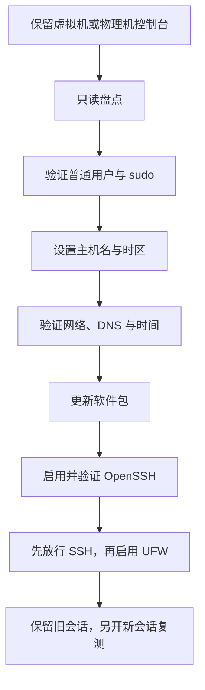

本文给出一台新装 Ubuntu Server 的通用初始化顺序：先保留控制台恢复入口，再核对身份、主机名、时区、网络、DNS、时间和软件包，最后建立 OpenSSH、UFW 与服务基线。

这里的目标是得到一台可维护的学习或开发主机，不是直接套用生产服务器的加固清单。用户与权限详见 [[Linux 用户、用户组、sudo 与文件权限]]，服务和日志详见 [[systemd 服务与日志基础]]，远程登录详见 [[OpenSSH 连接、密钥与主机指纹]]。

> [!info] 核对日期与适用范围
> 本文于 **2026-07-17** 核对 Ubuntu Server 和 systemd 官方资料。不同 Ubuntu 版本、镜像预装组件和网络环境可能不同，执行时应以 `/etc/os-release`、本机手册和当前官方文档为准。

## 完成标准

- 普通用户能够登录，并已实际验证需要的 `sudo` 权限。
- 主机名与时区符合用途，系统时间已同步。
- 主机拥有预期地址和默认路由，DNS 与 HTTPS 访问正常。
- APT 索引可更新，待升级项目已经过审查。
- `systemctl --failed` 中没有未解释的失败单元。
- OpenSSH 已按需启用，UFW 启用前已经保留控制台和可验证的 SSH 入口。
- 已保存一份不含密码、令牌、私钥和完整环境变量的基线记录。

## 1. 先保留恢复入口

初始化期间不要同时修改网络、SSH 和防火墙。推荐顺序如下：



> [!warning] 控制台是网络配置失败时的恢复入口
> 在新的 SSH 会话通过验证前，不要关闭控制台和当前可用会话。远程修改网络、`sshd` 或 UFW 后立刻断开唯一连接，可能把自己锁在主机外。

## 2. 只读盘点当前系统

**执行位置：Ubuntu Server（控制台，任意目录）**

```bash
printf '%s\n' '--- system ---'
cat /etc/os-release
uname -a
dpkg --print-architecture

printf '%s\n' '--- identity ---'
whoami
id
groups
printf 'HOME=%s\n' "$HOME"

printf '%s\n' '--- hostname and time ---'
hostnamectl
timedatectl status

printf '%s\n' '--- storage ---'
lsblk -o NAME,SIZE,TYPE,FSTYPE,MOUNTPOINTS
df -hT

printf '%s\n' '--- network ---'
ip -brief address
ip route
resolvectl status

printf '%s\n' '--- failed units ---'
systemctl --failed --no-pager
```

重点确认：

- 当前用户不是 root，家目录与预期一致。
- 系统版本和 CPU 架构符合将要安装的软件。
- 根文件系统空间充足。
- 存在非回环地址和默认路由。
- 失败单元能够逐一解释；不要看到失败就直接禁用服务。

## 3. 验证普通用户与 sudo

**执行位置：Ubuntu Server（控制台，任意目录）**

```bash
sudo -v
sudo -l
sudo id
```

`sudo id` 预期显示 `uid=0(root)`，命令结束后仍回到普通用户 Shell。`sudo` 是临时提升某条命令的权限，不应把 root 直接登录当作日常工作方式。

用户、组、目录权限、`umask`、新增账号和安全修复方式见 [[Linux 用户、用户组、sudo 与文件权限]]。如果当前用户没有管理权限，应使用安装时创建的管理员账号或控制台恢复，不要复制来源不明的 sudoers 配置。

## 4. 设置主机名

主机名用于 Shell 提示符、日志和远程识别。建议使用小写字母、数字和连字符，避免空格、真实姓名、设备序列号和可能变化的 IP。

先记录旧值，再输入新值：

**执行位置：Ubuntu Server（控制台，任意目录）**

```bash
old_hostname="$(hostnamectl --static)"
printf '当前主机名：%s\n' "$old_hostname"
printf '请输入新的主机名；不修改则按 Ctrl-C：'
IFS= read -r new_hostname

case "$new_hostname" in
  ''|*[!a-z0-9-]*|-*|*-) printf '主机名格式不符合本文约束。\n' >&2; exit 1 ;;
esac

sudo hostnamectl set-hostname "$new_hostname"
hostnamectl status
```

随后检查 `/etc/hosts`：

**执行位置：Ubuntu Server（控制台，任意目录）**

```bash
grep -nE '^(127\.0\.0\.1|127\.0\.1\.1|::1)[[:space:]]' /etc/hosts
getent hosts "$(hostnamectl --static)" || true
```

Ubuntu 常用 `127.0.1.1` 映射本机主机名。如果该行仍是旧名称，先备份，再用 `sudoedit` 精确修改：

**执行位置：Ubuntu Server（控制台，任意目录）**

```bash
sudo cp -a /etc/hosts "/etc/hosts.before-hostname-$(date +%Y%m%d%H%M%S)"
sudoedit /etc/hosts
```

不要用不受约束的全局替换修改 `/etc/hosts`。如修改后 `sudo` 提示无法解析本机名，可从控制台恢复刚创建的备份，或修正 `127.0.1.1` 对应项。

## 5. 设置时区并验证时间同步

列出可用时区，输入目标值：

**执行位置：Ubuntu Server（控制台，任意目录）**

```bash
timedatectl list-timezones
printf '请输入 timedatectl 列表中的时区：'
IFS= read -r target_timezone

if ! timedatectl list-timezones | grep -qxF "$target_timezone"; then
  printf '停止：不是 timedatectl 列出的时区：%s\n' "$target_timezone" >&2
  exit 1
fi

sudo timedatectl set-timezone "$target_timezone"
timedatectl status
```

预期 `Time zone` 为所选值，`System clock synchronized` 最终为 `yes`。查看同步服务与日志：

**执行位置：Ubuntu Server（控制台，任意目录）**

```bash
systemctl status systemd-timesyncd.service --no-pager
journalctl -u systemd-timesyncd.service -b --no-pager -n 80
```

如果镜像使用其他 NTP 客户端，应以实际启用的服务为准，不要同时运行多个未经协调的时间同步服务。

## 6. 分层验证网络、DNS 与 HTTPS

**执行位置：Ubuntu Server（控制台，任意目录）**

```bash
ip -brief address
ip route
resolvectl status
getent ahosts archive.ubuntu.com
curl -I --max-time 15 https://archive.ubuntu.com/
```

判断顺序：

1. 网卡是否有预期地址。
2. 是否存在默认路由。
3. DNS 是否能解析官方域名。
4. HTTPS 是否能完成连接和证书校验。

`curl -I` 返回 HTTP 响应即说明网络路径基本成立，不要求状态码一定是 `200`。如果 DNS 失败，不要通过关闭 TLS 校验或随意替换来源不明的软件源来掩盖问题。

Ubuntu Server 常由 Netplan 管理持久网络配置。修改 `/etc/netplan/*.yaml` 前必须保留控制台；远程环境优先使用带自动回滚窗口的 `sudo netplan try`，确认连通后再接受配置。

## 7. 更新 APT 软件包

先更新索引并审查升级内容：

**执行位置：Ubuntu Server（控制台，任意目录）**

```bash
sudo apt update
apt list --upgradable
```

确认来源、磁盘空间和变更范围后再升级：

**执行位置：Ubuntu Server（控制台，任意目录）**

```bash
sudo apt upgrade
```

`apt upgrade` 可能需要交互确认。内核、OpenSSH、网络组件或需要重启的更新，应在仍有控制台恢复路径时进行。检查是否建议重启：

**执行位置：Ubuntu Server（控制台，任意目录）**

```bash
if test -f /var/run/reboot-required; then
  cat /var/run/reboot-required
  cat /var/run/reboot-required.pkgs 2>/dev/null || true
else
  printf '%s\n' '当前未检测到 reboot-required 标记。'
fi
```

不要直接删除 `/var/lib/dpkg/lock*` 处理锁冲突。先检查是否有正常更新任务：

**执行位置：Ubuntu Server（控制台，任意目录）**

```bash
ps -ef | grep -E '[a]pt|[d]pkg|[u]nattended'
systemctl status apt-daily.service apt-daily-upgrade.service --no-pager || true
```

## 8. 建立 OpenSSH 入口

如果需要远程管理，安装并启动 OpenSSH 服务端：

**执行位置：Ubuntu Server（控制台，任意目录）**

```bash
sudo apt install openssh-server
sudo systemctl enable --now ssh.service
sudo sshd -t
systemctl is-active ssh.service
sudo ss -lntp | grep sshd
```

预期配置语法通过、服务状态为 `active`，并存在监听端口。首次指纹核验、用户密钥、`known_hosts`、`authorized_keys`、客户端配置和安全收紧必须继续按 [[OpenSSH 连接、密钥与主机指纹]] 操作。

## 9. 安全启用 UFW

UFW 是主机防火墙管理工具。启用前先确认：

- 控制台仍可登录。
- `sshd` 已运行。
- SSH 实际端口与将要放行的规则一致。
- 至少一个新的 SSH 会话已经成功。

如果使用默认 OpenSSH 服务定义：

**执行位置：Ubuntu Server（控制台或仍可用的 SSH 会话）**

```bash
sudo apt install ufw
sudo ufw status verbose
sudo ufw app info OpenSSH
sudo ufw allow OpenSSH
sudo ufw enable
sudo ufw status numbered
```

启用后保留当前会话，从另一终端重新登录。新会话失败时，从控制台暂时恢复：

**执行位置：Ubuntu Server（控制台）**

```bash
sudo ufw disable
sudo ufw status verbose
```

修正规则并复测后再启用。若 `sshd` 使用自定义端口，不能假设 `OpenSSH` 应用配置仍匹配，应先比较 `sudo sshd -T | grep '^port '` 与 UFW 规则。

## 10. 检查服务与日志基线

**执行位置：Ubuntu Server（控制台或 SSH 会话，任意目录）**

```bash
systemctl --failed --no-pager
systemctl list-unit-files --state=enabled --no-pager
journalctl -p warning -b --no-pager
```

`enabled` 只表示服务被配置为随相应目标启动，不代表当前一定在运行；`active` 也不代表已启用自启动。进一步理解单元、依赖、状态和日志过滤见 [[systemd 服务与日志基础]]。

## 11. 保存非敏感基线

**执行位置：Ubuntu Server（当前普通用户家目录）**

```bash
baseline_file="$HOME/system-baseline-$(date +%Y%m%d-%H%M%S).txt"

{
  printf 'captured_at=%s\n' "$(date --iso-8601=seconds)"
  printf '\n[os]\n'
  sed -n '1,20p' /etc/os-release
  printf '\n[architecture]\n'
  uname -m
  dpkg --print-architecture
  printf '\n[identity]\n'
  id
  printf '\n[hostname]\n'
  hostnamectl
  printf '\n[time]\n'
  timedatectl status
  printf '\n[storage]\n'
  df -hT /
  printf '\n[network]\n'
  ip -brief address
  ip route
  printf '\n[failed-units]\n'
  systemctl --failed --no-pager
  printf '\n[ssh]\n'
  systemctl is-enabled ssh.service 2>&1
  systemctl is-active ssh.service 2>&1
  printf '\n[ufw]\n'
  sudo ufw status verbose
} | tee "$baseline_file"

chmod 0600 "$baseline_file"
stat -c 'mode=%A owner=%U group=%G path=%n' "$baseline_file"
```

保存前检查内容，不要加入密码、令牌、私钥、`/etc/shadow` 或完整环境变量。该文本只用于比较状态，不是系统备份。

## 常见问题

### 主机能获得地址，但不能解析域名

按 `ip route`、`resolvectl status`、`getent ahosts` 的顺序排查。先区分路由与 DNS，再修改配置。

### 时间一直不同步

确认网络和 DNS，检查实际 NTP 服务日志，并确认没有多个时间服务争用。虚拟机暂停恢复后可能需要短暂重新校时。

### UFW 启用后 SSH 超时

从控制台运行 `sudo ufw status numbered`，比较防火墙规则与 `sudo sshd -T | grep '^port '`。必要时先 `sudo ufw disable` 恢复入口。

### `systemctl --failed` 出现服务

先运行 `systemctl status` 和 `journalctl -u` 理解失败原因。不要为了得到空列表就盲目 `disable` 或删除单元。

## 初始化检查清单

- [ ] 控制台恢复入口在整个初始化期间保持可用。
- [ ] 普通用户与 `sudo` 权限已经实际验证。
- [ ] 主机名、`/etc/hosts` 和时区符合预期。
- [ ] 地址、默认路由、DNS、HTTPS 和时间同步均正常。
- [ ] APT 索引已更新，升级内容经过审查。
- [ ] OpenSSH 语法和服务状态已验证。
- [ ] UFW 先放行管理入口，再启用并用新会话复测。
- [ ] 失败服务与重要警告日志均已解释。
- [ ] 非敏感基线记录已检查并妥善保存。

## 官方参考资料

- [Ubuntu Server：用户管理](https://documentation.ubuntu.com/server/how-to/security/user-management/)
- [Ubuntu Server：软件包管理](https://documentation.ubuntu.com/server/how-to/software/package-management/)
- [Ubuntu Server：网络配置](https://documentation.ubuntu.com/server/explanation/networking/configuring-networks/)
- [Ubuntu Server：使用 timedatectl 与 timesyncd](https://documentation.ubuntu.com/server/how-to/networking/timedatectl-and-timesyncd/)
- [Ubuntu Server：OpenSSH Server](https://documentation.ubuntu.com/server/how-to/security/openssh-server/)
- [Ubuntu Server：UFW 防火墙](https://documentation.ubuntu.com/server/how-to/security/firewalls/)
- [Netplan：安全应用配置](https://netplan.readthedocs.io/en/stable/netplan-try/)
- [systemd：hostnamectl](https://www.freedesktop.org/software/systemd/man/latest/hostnamectl.html)
- [systemd：timedatectl](https://www.freedesktop.org/software/systemd/man/latest/timedatectl.html)
