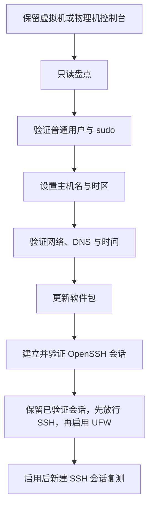

本文给出一台新装 Ubuntu Server 的通用初始化顺序：先保留控制台恢复入口，再核对身份、主机名、时区、网络、DNS、时间和软件包，最后核对或建立 OpenSSH 入口、UFW 与服务基线。

这里的目标是得到一台可维护的学习或开发主机，不是直接套用生产服务器的加固清单。命令行的通用阅读方法见 [[Linux 命令行学习路线与命令地图]]，用户与权限详见 [[Linux 用户、用户组、sudo 与文件权限]]，软件包管理详见 [[APT 软件包管理基础]]，服务和日志详见 [[systemd 服务与日志基础]]，网络字段与验证命令详见 [[Linux 网络接口、IP 地址、路由与 DNS 基础]]，远程登录详见 [[OpenSSH 连接、密钥与主机指纹]]，主机防火墙原理与规则管理详见 [[Linux 主机防火墙与 UFW 基础]]。

> [!info] 核对日期与适用范围
> 本文于 **2026-07-20** 核对 Ubuntu Server、UFW 和 systemd 官方资料。不同 Ubuntu 版本、镜像预装组件和网络环境可能不同，执行时应以 `/etc/os-release`、本机手册和当前官方文档为准。

## 本篇掌握目标

- **必须熟练**：执行前分清只读检查与系统变更，理解 `sudo` 只提升其后单条命令的权限；能拆出变量、引用、管道、重定向、条件和退出状态，并根据输出验证结果。
- **理解会查**：知道 `uname`、`id`、`hostnamectl`、`timedatectl`、`lsblk`、`df`、`ip`、`systemctl`、`journalctl`、`apt` 和 `ss` 分别回答什么问题，具体字段和低频参数可随时查手册。
- **认识即可**：复杂 `grep`、`dpkg-query`、`systemctl show` 选项和发行版差异；用到时回到对应专题或当前系统手册核对。

## 完成标准

- 普通用户能够登录，并已实际验证需要的 `sudo` 权限。
- 主机名与时区符合用途，系统时间已同步。
- 主机拥有预期地址和默认路由，DNS 与 HTTPS 访问正常。
- APT 索引可更新，待升级项目已经过审查。
- `systemctl --failed` 中没有未解释的失败单元。
- OpenSSH 已按需安装并核对激活路径，UFW 启用前已经保留控制台和可验证的 SSH 入口。
- 已保存一份不含密码、令牌、私钥和完整环境变量的基线记录。

## 1. 先保留恢复入口

初始化期间不要同时修改网络、SSH 和防火墙。推荐顺序如下：



> [!warning] 控制台是网络配置失败时的恢复入口
> 在 UFW 启用后的新 SSH 会话通过验证前，不要关闭控制台和原有可用会话。远程修改网络、`sshd` 或 UFW 后立刻断开唯一连接，可能把自己锁在主机外。

## 2. 只读盘点当前系统

**执行位置：Ubuntu Server（控制台，任意目录）**

```bash
printf '%s\n' '--- system ---'
# 显示系统发行版、版本和标识信息。
cat /etc/os-release
# 显示内核、主机和硬件架构等完整系统信息。
uname -a
# 显示 Debian 软件包体系使用的主 CPU 架构。
dpkg --print-architecture

printf '%s\n' '--- identity ---'
# 显示当前 Shell 所属的用户名。
whoami
# 显示当前用户的 UID、GID 及附属组编号。
id
# 显示当前用户所属的用户组名称。
groups
printf 'HOME=%s\n' "$HOME"

printf '%s\n' '--- hostname and time ---'
# 显示主机名及其静态、瞬态和美化名称等信息。
hostnamectl
# 显示本地时间、时区和时间同步状态。
timedatectl status

printf '%s\n' '--- storage ---'
# 按指定列列出块设备、文件系统类型和挂载点。
lsblk -o NAME,SIZE,TYPE,FSTYPE,MOUNTPOINTS
# 以易读单位显示已挂载文件系统的类型、容量和使用情况。
df -hT

printf '%s\n' '--- network ---'
# 以精简格式显示各网络接口的状态和已配置地址。
ip -brief address
# 显示内核路由表，重点核对默认路由。
ip route
# 显示 systemd-resolved 的 DNS 配置和当前解析状态。
resolvectl status

printf '%s\n' '--- failed units ---'
# 列出状态为失败的 systemd 单元，不使用分页器。
systemctl --failed --no-pager
```

重点确认：

- 当前用户不是 root，家目录与预期一致。
- 系统版本和 CPU 架构符合将要安装的软件。
- 根文件系统空间充足。
- 存在非回环地址和默认路由。
- 失败单元能够逐一解释；不要看到失败就直接禁用服务。

## 3. 验证普通用户与 sudo

**执行位置：Ubuntu Server（控制台，任意目录）**

```bash
# 刷新 sudo 的认证缓存；必要时会提示输入当前用户密码。
sudo -v
# 列出当前用户可通过 sudo 执行的命令及其限制。
sudo -l
# 以 root 身份执行 id，确认 sudo 提权是否生效。
sudo id
```

`sudo id` 预期显示 `uid=0(root)`，命令结束后仍回到普通用户 Shell。`sudo` 是临时提升某条命令的权限，不应把 root 直接登录当作日常工作方式。

用户、组、目录权限、`umask`、新增账号和安全修复方式见 [[Linux 用户、用户组、sudo 与文件权限]]。如果当前用户没有管理权限，应使用安装时创建的管理员账号或控制台恢复，不要复制来源不明的 sudoers 配置。

## 4. 设置主机名

主机名用于 Shell 提示符、日志和远程识别。建议使用小写字母、数字和连字符，避免空格、真实姓名、设备序列号和可能变化的 IP。

先记录旧值，再输入新值：

**执行位置：Ubuntu Server（控制台，任意目录）**

```bash
(
old_hostname="$(hostnamectl --static)"
printf '当前主机名：%s\n' "$old_hostname"
printf '请输入新的主机名；不修改则按 Ctrl-C：'
IFS= read -r new_hostname

case "$new_hostname" in
  ''|*[!a-z0-9-]*|-*|*-) printf '主机名格式不符合本文约束。\n' >&2; exit 1 ;;
esac

sudo hostnamectl set-hostname "$new_hostname"
hostnamectl status
)
```

随后检查 `/etc/hosts`：

**执行位置：Ubuntu Server（控制台，任意目录）**

```bash
# `-n` 输出匹配行的行号；`-E` 启用扩展正则，以便匹配以本机回环地址开头的 hosts 条目。
grep -nE '^(127\.0\.0\.1|127\.0\.1\.1|::1)[[:space:]]' /etc/hosts
# 用当前静态主机名查询系统名称解析结果（如 `/etc/hosts`）；未解析到时由 `|| true` 忽略非零退出码。
getent hosts "$(hostnamectl --static)" || true
```

Ubuntu 常用 `127.0.1.1` 映射本机主机名。如果该行仍是旧名称，先备份，再用 `sudoedit` 精确修改：

**执行位置：Ubuntu Server（控制台，任意目录）**

```bash
(
if ! hosts_backup="$(sudo mktemp /etc/hosts.before-hostname.XXXXXX)"; then
  printf '%s\n' '停止：无法创建 /etc/hosts 备份路径。' >&2
  exit 1
fi
if sudo cp -a -- /etc/hosts "$hosts_backup"; then
  printf 'hosts_backup=%s\n' "$hosts_backup"
  sudoedit /etc/hosts
else
  sudo rm -f -- "$hosts_backup"
  printf '%s\n' '停止：/etc/hosts 备份失败，未打开编辑器。' >&2
  exit 1
fi
)
```

不要用不受约束的全局替换修改 `/etc/hosts`。如修改后 `sudo` 提示无法解析本机名，可从控制台恢复刚创建的备份，或修正 `127.0.1.1` 对应项。

## 5. 设置时区并验证时间同步

列出可用时区，输入目标值：

**执行位置：Ubuntu Server（控制台，任意目录）**

```bash
(
timedatectl list-timezones
printf '请输入 timedatectl 列表中的时区：'
IFS= read -r target_timezone

# `-q` 静默仅用退出码判断，`-x` 要求整行完全匹配，`-F` 将输入按普通文本而非正则表达式处理。
if ! timedatectl list-timezones | grep -qxF "$target_timezone"; then
  printf '停止：不是 timedatectl 列出的时区：%s\n' "$target_timezone" >&2
  exit 1
fi

sudo timedatectl set-timezone "$target_timezone"
timedatectl status
)
```

以上两个输入块使用圆括号创建子 Shell；格式校验中的 `exit` 只停止当前代码块，不会退出控制台或 SSH 登录 Shell。

预期 `Time zone` 为所选值，`System clock synchronized` 最终为 `yes`。查看同步服务与日志：

**执行位置：Ubuntu Server（控制台，任意目录）**

```bash
# 查看 systemd-timesyncd 服务的当前状态；`--no-pager` 直接输出，不进入交互式分页器。
systemctl status systemd-timesyncd.service --no-pager
# 查看该服务自本次启动（`-b`）以来的最近 80 条日志；`-u` 按服务筛选，`--no-pager` 禁用分页。
journalctl -u systemd-timesyncd.service -b --no-pager -n 80
```

如果镜像使用其他 NTP 客户端，应以实际启用的服务为准，不要同时运行多个未经协调的时间同步服务。

## 6. 分层验证网络、DNS 与 HTTPS

下列命令的字段含义与判断方法见 [[Linux 网络接口、IP 地址、路由与 DNS 基础]]。

**执行位置：Ubuntu Server（控制台，任意目录）**

```bash
# 以精简格式查看各网络接口的状态、MAC 地址和已配置的 IP 地址。
ip -brief address
# 查看内核路由表，重点确认是否存在指向网关的默认路由。
ip route
# 查看 systemd-resolved 的全局及各接口 DNS 配置与当前解析状态。
resolvectl status
# 通过 NSS 的 `ahosts` 查询域名可用于连接的地址；不同于上文的 `hosts`（查询 hosts 数据库条目以核对本机主机名映射），`ahosts` 基于 `getaddrinfo()` 返回地址，同一 IP 可能因套接字类型重复显示。
getent ahosts archive.ubuntu.com
# `-I` 仅请求 HTTP 响应头以验证 HTTPS 连通性；`--max-time 15` 将 DNS、连接和传输在内的总耗时限制为 15 秒。
curl -I --max-time 15 https://archive.ubuntu.com/
```

判断顺序：

1. 网卡是否有预期地址。
2. 是否存在默认路由。
3. DNS 是否能解析官方域名。
4. HTTPS 是否能完成连接和证书校验。

`curl -I` 返回 HTTP 响应即说明网络路径基本成立，不要求状态码一定是 `200`。如果 DNS 失败，不要通过关闭 TLS 校验或随意替换来源不明的软件源来掩盖问题。

Ubuntu Server 常由 Netplan 管理持久网络配置。修改 `/etc/netplan/*.yaml` 前必须保留控制台；远程环境优先使用带自动回滚窗口的 `sudo netplan try`，确认连通后再接受配置。

## 7. 更新 APT 软件包

APT 的软件源、索引、已安装状态和升级行为见 [[APT 软件包管理基础]]。本节只保留初始化主线需要的最小操作。

先更新索引并审查升级内容：

**执行位置：Ubuntu Server（控制台，任意目录）**

```bash
sudo apt update
apt list --upgradable
```

确认来源、磁盘空间和变更范围后再升级：

**执行位置：Ubuntu Server（控制台，任意目录）**

```bash
sudo apt upgrade
```

`apt upgrade` 可能需要交互确认。内核、OpenSSH、网络组件或需要重启的更新，应在仍有控制台恢复路径时进行。检查是否建议重启：

**执行位置：Ubuntu Server（控制台，任意目录）**

```bash
# Ubuntu 在需要重启以完成更新时创建此标记文件；`-f` 同时确认它存在且是普通文件。
if test -f /var/run/reboot-required; then
  # 输出系统记录的重启提示。
  cat /var/run/reboot-required
  # `.pkgs` 会列出触发该提示的软件包；文件可能不存在，故隐藏错误并以成功状态继续。
  cat /var/run/reboot-required.pkgs 2>/dev/null || true
else
  # 没有标记文件通常表示当前更新未要求重启。
  printf '%s\n' '当前未检测到 reboot-required 标记。'
fi
```

如果 `apt update` 或 `apt upgrade` 提示无法获取锁，按 [[APT 软件包管理基础#5.5 处理锁冲突与重启提示]] 区分正常占用、异常中断和重启提示。

## 8. 建立并验证 OpenSSH 会话

如果已在 Ubuntu Server 安装器的 **SSH Setup** 页面勾选 **Install OpenSSH server**，安装器已经安装 `openssh-server`，无需重复安装；如果没有勾选，先按 [[APT 软件包管理基础]] 安装该软件包。

随后从 [[OpenSSH 连接、密钥与主机指纹#3. 在服务端准备 sshd]] 开始完成服务端检查与客户端登录。socket activation、有效端口、主机指纹、用户密钥和认证收紧均由该专题说明，本初始化清单只保留进入 UFW 前必须达到的状态。

> [!success] 进入 UFW 步骤前的返回检查点
> - Ubuntu Server 控制台仍可登录。
> - OpenSSH 的实际激活路径、有效配置和监听端口已经核对。
> - 客户端已核对主机指纹并成功登录；保留一条可用会话，同时从另一终端重新登录成功。
>
> 如果还没有成功建立客户端 SSH 会话，不进入第 9 节。

## 9. 安全启用 UFW

UFW 的规则模型与排障方法见 [[Linux 主机防火墙与 UFW 基础]]。本节只保留新主机的安全启用顺序：检查现状、匹配 SSH 端口、添加规则、启用并用新连接验证。

### 9.1 安装并检查现状

第 8 节的控制台和已验证 SSH 会话必须仍然可用。先安装 UFW，再读取当前状态和已保存规则：

**执行位置：Ubuntu Server（控制台或已验证的 SSH 会话，任意目录）**

```bash
# 安装软件包；这一步不会启用防火墙。
sudo apt install ufw
```

安装成功后查看运行状态与已添加规则：

```bash
sudo ufw status verbose
sudo ufw show added
```

安装、添加规则和启用是三个独立步骤。若 UFW 已经是 `active`，或存在无法解释的规则，停止套用新主机流程；不要用会清除既有规则的 `ufw reset` 获取空列表。

### 9.2 核对 OpenSSH profile

读取 UFW 为 OpenSSH 提供的 application profile：

```bash
sudo ufw app info OpenSSH
```

将输出中的端口与第 8 节确认的实际监听端口比较。`OpenSSH` 是 UFW profile 名称，不是服务状态；只有二者一致时，才继续使用 `allow OpenSSH`。不一致时直接转到 [[Linux 主机防火墙与 UFW 基础#8. 自定义 SSH 端口时如何判断]]，不要猜测端口。

### 9.3 设置策略并添加 SSH 规则

仅在确认没有需要保留的既有策略后执行：

```bash
# 未命中的新入站连接默认拒绝，出站连接默认允许。
sudo ufw default deny incoming
sudo ufw default allow outgoing
```

先预演规则：

```bash
sudo ufw --dry-run allow OpenSSH
```

确认预演结果中的协议和端口正确后，再添加并检查规则：

```bash
sudo ufw allow OpenSSH
sudo ufw show added
```

本初始化主线不修改 routed/forwarded 策略。`allow OpenSSH` 也不会限制来源地址；需要按网段或接口收紧时，按 [[Linux 主机防火墙与 UFW 基础#9. UFW 规则动作与范围限制]] 单独设计。

### 9.4 启用并验证

保持控制台和原有 SSH 会话，再启用 UFW：

```bash
sudo ufw enable
sudo ufw status verbose
sudo ufw status numbered
sudo ufw show listening
```

不要使用 `ufw --force enable` 跳过首次警告。确认 `Status` 为 `active`、默认策略正确，且 OpenSSH 规则与实际端口一致；系统启用 IPv6 时还要核对对应的 IPv6 规则。

随后从客户端重新建立一条 SSH 连接，不复用启用前已经存在的会话。登录成功后执行：

```bash
hostnamectl --static
id
sudo ufw status verbose
```

只有这条启用后新建的会话稳定成功，才能关闭控制台和原有会话。命令退出状态不能代替对状态、规则和实际连接的检查。

### 9.5 从控制台恢复

如果启用后的新会话失败，从控制台暂时停用 UFW：

**执行位置：Ubuntu Server（控制台）**

```bash
sudo ufw disable
sudo ufw status verbose
```

`disable` 不会删除已保存规则。恢复连接后按 [[Linux 主机防火墙与 UFW 基础#11. 启用后无法连接时如何恢复]] 比较监听端口、profile、规则和 SSH 日志；修正并复测后再启用，不要把长期关闭防火墙当作修复完成。

## 10. 检查服务与日志基线

**执行位置：Ubuntu Server（控制台或 SSH 会话，任意目录）**

```bash
systemctl --failed --no-pager
systemctl list-unit-files --state=enabled --no-pager
journalctl -p warning -b --no-pager
```

`enabled` 只表示服务被配置为随相应目标启动，不代表当前一定在运行；`active` 也不代表已启用自启动。进一步理解单元、依赖、状态和日志过滤见 [[systemd 服务与日志基础]]。

## 11. 保存非敏感基线

**执行位置：Ubuntu Server（当前普通用户家目录）**

```bash
(
set -e
set -o pipefail

if ! baseline_file="$(mktemp "$HOME/system-baseline.XXXXXX")"; then
  printf '%s\n' '停止：无法创建唯一的基线文件。' >&2
  exit 1
fi
readonly baseline_file
printf 'baseline_file=%s\n' "$baseline_file"

{
  printf 'captured_at=%s\n' "$(date --iso-8601=seconds)"
  printf '\n[os]\n'
  sed -n '1,20p' /etc/os-release
  printf '\n[architecture]\n'
  uname -m
  dpkg --print-architecture
  printf '\n[identity]\n'
  id
  printf '\n[hostname]\n'
  hostnamectl
  printf '\n[time]\n'
  timedatectl status
  printf '\n[storage]\n'
  df -hT /
  printf '\n[network]\n'
  ip -brief address
  ip route
  printf '\n[failed-units]\n'
  systemctl --failed --no-pager
  printf '\n[ssh]\n'
  systemctl show ssh.socket ssh.service \
    --property=Id --property=LoadState \
    --property=UnitFileState --property=ActiveState \
    --no-pager 2>&1
  printf '\n[ufw]\n'
  sudo ufw status verbose
} | tee "$baseline_file"

chmod 0600 "$baseline_file"
stat -c 'mode=%A owner=%U group=%G path=%n' "$baseline_file"
)
```

代码块在独立子 Shell 中启用 `errexit` 与 `pipefail`：任一采集命令或 `tee` 失败时，整体返回非零，不会继续把部分结果当作成功基线。`mktemp` 创建的唯一文件默认仅当前用户可读写；失败时可能保留一份已输出路径的部分文件，核对后再决定是否删除。保存内容不要加入密码、令牌、私钥、`/etc/shadow` 或完整环境变量。该文本只用于比较状态，不是系统备份。

## 常见问题

### 主机能获得地址，但不能解析域名

按 `ip route`、`resolvectl status`、`getent ahosts` 的顺序排查。先区分路由与 DNS，再修改配置。

### 时间一直不同步

确认网络和 DNS，检查实际 NTP 服务日志，并确认没有多个时间服务争用。虚拟机暂停恢复后可能需要短暂重新校时。

### `apt` 提示无法获取锁

不要直接删除 `/var/lib/dpkg/lock*`；锁文件消失并不等于占用任务安全结束。检查命令、判断顺序和异常中断后的恢复方式统一见 [[APT 软件包管理基础#5.5 处理锁冲突与重启提示]]。

### `sshd -t` 提示 `Missing privilege separation directory: /run/sshd`

这通常需要先区分“配置语法错误”和“绕过 systemd 后运行时目录尚未创建”。按 [[OpenSSH 连接、密钥与主机指纹#sshd -t 提示缺少 /run/sshd]] 核对单元机制、启动前检查和服务日志，不要把手工创建目录当作持久修复。

### UFW 启用后 SSH 超时

从控制台运行 `sudo ufw status numbered`，同时比较 `sudo sshd -T | grep '^port '`、`sudo ss -lntp`、application profile 和防火墙规则。必要时先 `sudo ufw disable` 恢复入口，再按 [[Linux 主机防火墙与 UFW 基础#11. 启用后无法连接时如何恢复]] 分层排查。

### `systemctl --failed` 出现服务

先运行 `systemctl status` 和 `journalctl -u` 理解失败原因。不要为了得到空列表就盲目 `disable` 或删除单元。

## 初始化检查清单

- [ ] 控制台恢复入口在整个初始化期间保持可用。
- [ ] 普通用户与 `sudo` 权限已经实际验证。
- [ ] 主机名、`/etc/hosts` 和时区符合预期。
- [ ] 地址、默认路由、DNS、HTTPS 和时间同步均正常。
- [ ] APT 索引已更新，升级内容经过审查。
- [ ] OpenSSH 语法、激活单元和监听状态已验证。
- [ ] UFW 先放行管理入口，再启用并用新会话复测。
- [ ] 失败服务与重要警告日志均已解释。
- [ ] 非敏感基线记录已检查并妥善保存。

## 官方参考资料

- [Ubuntu Server：用户管理](https://documentation.ubuntu.com/server/how-to/security/user-management/)
- [Ubuntu Server：软件包管理](https://documentation.ubuntu.com/server/how-to/software/package-management/)
- [Ubuntu Server：网络配置](https://documentation.ubuntu.com/server/explanation/networking/configuring-networks/)
- [Ubuntu Server：使用 timedatectl 与 timesyncd](https://documentation.ubuntu.com/server/how-to/networking/timedatectl-and-timesyncd/)
- [Ubuntu Server：OpenSSH Server](https://documentation.ubuntu.com/server/how-to/security/openssh-server/)
- [Ubuntu 24.04 LTS 发布说明：OpenSSH 的 systemd socket activation](https://documentation.ubuntu.com/release-notes/24.04/#openssh)
- [Ubuntu Server：UFW 防火墙](https://ubuntu.com/server/docs/how-to/security/firewalls/)
- [Netplan：安全应用配置](https://netplan.readthedocs.io/en/stable/netplan-try/)
- [systemd：hostnamectl](https://www.freedesktop.org/software/systemd/man/latest/hostnamectl.html)
- [systemd：timedatectl](https://www.freedesktop.org/software/systemd/man/latest/timedatectl.html)
