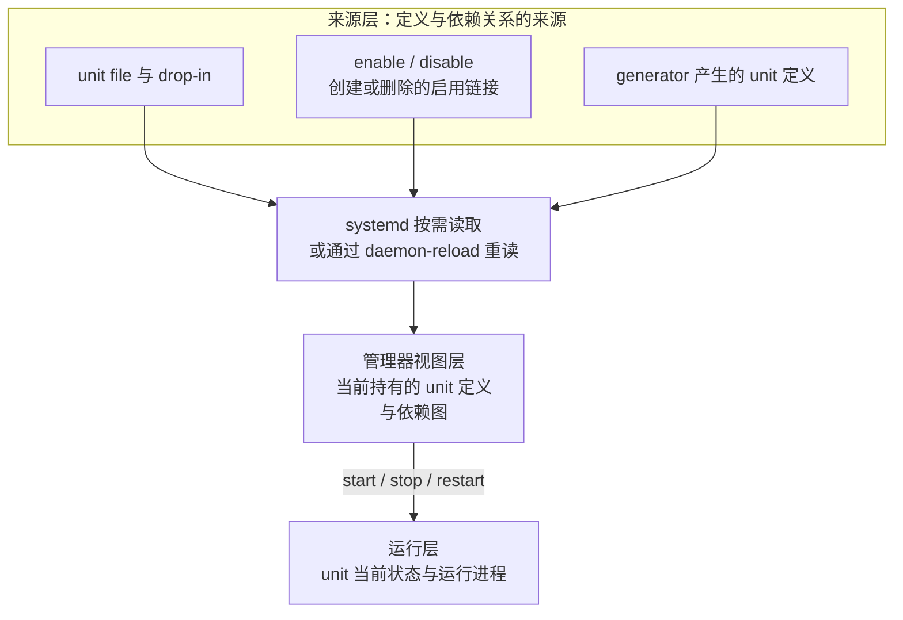

本文介绍 systemd、unit、service、运行状态和 journal 日志的基础使用。目标是能回答“服务是否运行、为什么失败、是否建立了自动激活关系、配置从哪里加载”，并形成“先观察、再变更、最后验证”的处理顺序，而不是遇到问题就反复 `restart`。

> [!info] 核对日期与适用范围
> 本文于 **2026-08-02** 核对 systemd 官方手册与 Ubuntu 24.04 发布说明；关于 `LoadState`、`LoadError` 和 `NeedDaemonReload` 的边界于 **2026-08-09** 依据 systemd v255 D-Bus API 补充核对；`NeedDaemonReload` 的检测机制、`daemon-reload` 的作用范围、`enable` 与 `disable` 形成启用关系的过程、当前实际启用状态 `UnitFileState` 与默认启用策略 `UnitFilePreset` 的边界，以及日志优先级、颜色提示和结构化输出于 **2026-08-17** 依据 systemd v255 源码与手册补充核对。示例面向使用 systemd 的 Ubuntu Server；不同发行版、Ubuntu 版本和软件包可能使用不同 unit 名称或激活方式，应先按第一节确认运行模型和版本基线，并结合本机手册和实际 unit 状态判断。

> [!abstract] 本篇掌握目标
> - **必须熟练**：区分加载状态、当前运行状态和 unit 文件启用状态；按后文介绍的方法读取 unit 状态和日志证据；先检查再变更。
> - **理解会查**：按需使用 start、stop、restart、reload、enable、disable 和 `daemon-reload`，找到 unit 主文件、drop-in 与 systemd 当前持有的关键属性，并保留远程恢复通道。
> - **认识即可**：其他 unit 类型、复杂依赖关系和更高级的 journal 筛选；遇到服务编排或深入排障时再继续学习。
>
> 通用命令结构与帮助检索见 [[Linux 命令行学习路线与命令地图]] 和 [[Shell 命令结构、类型与帮助系统]]；本文较长的变量和判断代码块可配合 [[Shell 脚本阅读基础]] 阅读。程序、进程与服务的边界见 [[Linux 进程与系统资源常用命令]]。

## 1. 建立 systemd 的对象模型并确认运行环境

Linux 内核完成早期初始化后，会启动第一个用户空间进程，其进程编号为 PID 1。在常见 Ubuntu Server 安装中，systemd 作为 PID 1 运行，承担系统和服务管理器的职责，负责系统启动、unit 生命周期和依赖关系。

systemd 以 unit 作为基本管理对象。unit 是由名称标识、可被 systemd 查询和操作的逻辑对象，例如 `ssh.service` 或 `ssh.socket`。systemd 会为 unit 加载定义、解析它与其他 unit 之间的依赖关系、跟踪当前状态，并处理针对它发起的启动、停止等操作。

多数 unit 的定义来自以下两类磁盘配置文件：

- **unit file**：保存 unit 主体定义的配置文件，可以声明显式依赖关系和通用管理规则；对于 service unit，还可以包含启动命令、重启策略等设置。
- **drop-in**：附加配置片段，用来补充或覆盖主体定义中的部分设置。

systemd 读取并合并这些配置后，按照 unit 名称管理相应对象。下面用一个假设存在的 `app.service` 表示定义来源、管理对象与运行实例之间的关系：

```text
定义来源
unit file（主体定义）+ 可选的 drop-in（补充或覆盖定义）
                         ↓ systemd 读取并合并定义
管理对象
app.service unit（systemd 管理的逻辑对象）
                         ↓ unit 被启动
运行实例
一个或多个应用进程（每个进程都有自己的 PID）
```

这里的 `.service` 表示 service unit。systemd 通过这种 unit 描述并管理一项服务的生命周期；进程则是程序的一次运行实例。以 `app.service` 为例：

1. **启动前**：systemd 可以已经加载 `app.service` 的定义，但该 unit 仍处于 inactive（未激活）状态，此时不一定存在应用进程。
2. **启动后**：systemd 按照 unit 配置创建并监督一个或多个进程，每个进程都有自己的 PID。
3. **进程退出后**：根据 unit 类型、进程退出结果和重启策略，该 unit 可能回到 inactive、进入 failed（失败）状态，或者创建新进程。新进程会获得新的 PID，但 systemd 仍通过 `app.service` 这个 unit 名称管理这项服务。

因此，unit file、service unit、进程和 PID 分别属于定义来源、管理对象、运行实例和进程标识，不能视为同一个对象。

并非所有 unit 都对应一个持久保存的主体配置文件；少数 unit 可以由系统动态生成或临时创建。初学阶段先掌握 unit file 与 drop-in 这条常见路径，遇到来源不明确的 unit 时，再按第四节的方法检查实际配置来源和 systemd 当前持有的属性。

**systemd-journald** 也遵循上述层次：systemd 通过 `systemd-journald.service` 管理 systemd-journald 日志守护进程（daemon，长期在后台运行的程序），该进程收集日志并维护称为 **journal** 的结构化日志集合。journal 是日志数据，不是 unit 或进程。

systemd 管理的不只有 service：

| unit 类型 | 典型用途 |
| --- | --- |
| `.service` | 启动和监督服务进程 |
| `.socket` | 监听 socket，并在连接到来时激活关联服务 |
| `.timer` | 按时间激活其他 unit |
| `.mount` | 管理挂载点 |
| `.path` | 监视路径变化并触发其他 unit |
| `.target` | 聚合一组 unit，形成启动或同步目标 |

本文主要学习 `.service`，遇到 socket、timer 或其他 unit 时仍使用相同的“确认名称 → 读取状态 → 查看日志 → 理解激活关系”思路。

### 1.1 三种观察工具分别回答什么

| 工具 | 直接观察的对象 | 主要回答的问题 | 边界 |
| --- | --- | --- | --- |
| `ps` | 进程快照 | 实际运行的是哪个进程 | 不显示 systemd 持有的 unit 状态 |
| `systemctl` | systemd 管理器及 unit | 管理器如何加载和管理 unit | unit 状态不能替代真实业务功能验证 |
| `journalctl` | journal | 已经记录了什么事件 | 不控制 unit；没有匹配记录也不等于事件从未发生 |

进程、unit 状态和日志是三类互有关联但不能相互替代的证据。排障时应根据问题组合使用，并通过服务自身的功能检查得出最终结论。

### 1.2 确认运行模型与版本基线

继续查询 unit 状态前，先完成两项性质不同的检查：确认当前 PID 1 是否为 systemd，用于判断本文的系统级管理模型是否直接适用；记录本机 systemd 工具版本，用于核对不同发行版和版本的行为差异。

**执行位置：Ubuntu 主机（任意目录，只读检查）**

```bash
ps -p 1 -o pid=,comm=,args=
systemctl --version
```

- `ps` 显示 PID 1 的命令名和启动参数，用于识别当前初始化系统；命令字段和进程快照的完整读法见 [[Linux 进程与系统资源常用命令#4.1 按名称找到候选进程，再按 PID 核对|按 PID 核对进程]]。
- `systemctl --version` 输出本机 systemd 工具的版本信息后退出，只记录版本基线，不用于判断 PID 1 或服务健康状态。

如果 PID 1 不是 systemd，应先确认当前使用的初始化系统或隔离环境，不要机械套用后续系统级命令。确认 systemd 正作为 PID 1 运行后，下一步不是立即启动或重启服务，而是先理解 systemd 如何描述一个 unit：它会分别记录定义是否成功加载、unit 当前处于哪个生命周期阶段，以及系统是否已经安排在后续某个启动流程中一并激活这个 unit。第二节先建立这套状态模型；需要追踪状态变化的过程和失败上下文时，再使用第三节的 journal 方法。

## 2. 一个 unit 为什么会同时有多种状态

第一节已经把 unit 确定为 systemd 管理的逻辑对象。为了管理这个对象，systemd 不能只记录一个笼统的“开”或“关”，而要分别回答三个问题：

1. systemd 是否找到并成功读取了这个 unit 的定义？
2. 这个 unit 此刻处于运行、停止还是失败等哪种阶段？
3. 这个 unit 是否已经被安排在某个后续启动流程中一并激活？

第三个问题不关心 unit 现在是否运行，而是关心系统是否已经为它设置了后续启动安排。第一节已经介绍，target 可以聚合一组 unit；当某个 target 被激活时，纳入其中的 unit 可以被一并激活。systemd 把“是否已经为当前 unit 设置这类安排”称为 **unit 文件启用状态**。

最常见的两个结果是：

- `enabled`：已经为当前 unit 设置了相应的后续启动安排。当相关启动流程发生时，它可以因此被一并激活；这不表示它现在正在运行，也不保证后续一定启动成功。
- `disabled`：当前没有为这个 unit 设置上述安排。这不表示它被禁止运行；它仍然可以被手工启动，也可能通过其他 unit 的依赖关系、socket 或 timer 等路径被激活。

这里的 `enabled` 和 `disabled` 只描述当前 unit 的这种启用安排，不能穷尽它所有可能的激活路径。还要区分两个常见边界：`static` 通常表示 unit 没有可供直接设置这类安排的安装信息，但仍可被其他 unit 依赖或触发；`masked` 表示后续激活会被明确拒绝，比 `disabled` 更强，也不等于已经停止当前运行实例。

本节只解释启用状态表达什么；启用关系怎样保存在磁盘上、又怎样进入 systemd 管理器当前持有的依赖图，将在第六节说明。

继续使用第一节中假设存在的 `app.service`。如果 systemd 已经成功加载它的定义，管理员又手工启动了它，但没有设置上述后续启动安排，那么同一时刻可以得到：

```text
定义是否成功加载：loaded
unit 当前是否激活：active
unit 文件启用状态：disabled
```

`loaded + active + disabled` 并不矛盾：定义已经加载，unit 当前由手工操作启动，但它没有被设置为随某个后续启动流程一并激活。

反过来，如果已经设置后续启动安排，却没有在当前时刻启动 `app.service`，则可以同时看到：

```text
定义是否成功加载：loaded
unit 当前是否激活：inactive
unit 文件启用状态：enabled
```

这可能发生在只设置启用安排而没有立即启动 unit，或者 unit 后来又被停止等场景。因此，`enabled` 只表示安排已经存在，不能固定解释成“正在等待触发条件满足”。

把上述概念汇总后，排查时至少要区分以下三个维度：

| 观察层面 | 对应属性 | 常见值 | 回答的问题 | 不能单独证明什么 |
| --- | --- | --- | --- | --- |
| 定义加载 | `LoadState` | `loaded`、`not-found`、`bad-setting`、`error` | systemd 是否找到并成功加载 unit 定义 | unit 当前正在运行 |
| 当前生命周期 | `ActiveState` 和更细的 `SubState` | `ActiveState`：`active`、`inactive`、`failed`；`SubState`：`running`、`exited` 等 | unit 此刻处于什么生命周期状态 | 后续启动安排已经设置，或者业务功能正常 |
| unit 文件启用状态 | `UnitFileState` | `enabled`、`disabled`、`static`、`masked` 等 | 当前 unit 的后续启动安排处于什么状态，或是否受到启用限制 | unit 此刻正在运行 |

以 service unit 常见的 `active (running)` 为例，`active` 是较粗粒度的 `ActiveState`，括号中的 `running` 是更具体的 `SubState`。不同 unit 类型具有不同的 SubState；`active (exited)` 表示 unit 仍被 systemd 视为 active，但不保证存在常驻进程，还要结合 unit 类型、`MainPID` 和实际职责判断。

以上三个维度是并列的观察结果，不是“只有先得到 `loaded`，`ActiveState` 和 `UnitFileState` 才有意义”的前后关系。`loaded` 表示 systemd 管理器当前已经成功加载该 unit 的定义，通常是 systemd 按当前定义再次激活这个 unit 的前提；但它不是另外两个维度具有诊断意义的前提。

一个少见但重要的边界是：unit 已经处于 `active` 后，其磁盘定义被删除或改坏，管理员又让 systemd 重新读取 unit 定义（对应第 4.1 节介绍的 `daemon-reload`）。管理器重新读取时，`LoadState` 可能变为 `not-found`、`bad-setting` 或 `error`，原有运行实例却仍暂时保持 `active`，磁盘上原有的启用安排也可能尚未消失。

因此，`LoadState` 不是 `loaded` 时，应优先修复定义，但仍要读取 `ActiveState` 确认是否存在活动实例，并检查 `UnitFileState` 是否还能识别原有启用安排；这些结果不能反过来证明 unit 能按当前定义再次启动。查询结果与磁盘最新内容之间的关系见第四节。

### 2.1 使用 systemctl 读取这些状态

常用只读命令骨架如下。`UNIT_NAME` 表示包含后缀的完整 unit 名称，这段语法骨架不直接执行：

```text
systemctl status UNIT_NAME --no-pager
systemctl is-active UNIT_NAME
systemctl is-enabled UNIT_NAME
```

- `systemctl status` 面向人工阅读，在一份摘要中显示加载状态、当前运行状态、主进程和部分近期日志等信息。
- `systemctl is-active` 只快速查询当前运行状态。
- `systemctl is-enabled` 只快速查询 unit 文件启用状态；输出 disabled 不表示这个 unit 无法启动。

> [!note] 如何区分当前启用状态与 PRESET
> `systemctl status` 的 `Loaded:` 行可能同时显示当前 unit 文件启用状态和 `PRESET`（默认启用策略），例如：`Loaded: loaded (...; enabled; preset: disabled)`。
>
> 其中，`preset:` 前的 `enabled` 对应 `UnitFileState`，表示当前已经建立启用关系；`preset: disabled` 对应 `UnitFilePreset`，表示发行版或管理员提供的有效默认启用策略给出的结果是 `disabled`。`systemctl list-unit-files` 输出中的 `STATE` 和 `PRESET` 两列也表达这一区别。
>
> `PRESET` 不是第四种当前状态，也不表示 unit 此刻是否运行。`UnitFileState=enabled` 与 `UnitFilePreset=disabled` 同时出现，只说明当前启用状态偏离默认策略，并不矛盾；`UnitFileState=disabled` 与 `UnitFilePreset=enabled` 也同样允许。实际运行状态仍应查看 `ActiveState` 和 `SubState`。
>
> 查询时只需读取上述字段，不要执行 `systemctl preset UNIT_NAME`。对于具有可用安装信息的 unit，这个命令会依据默认策略选择 `enable`、`disable`，或者保持现有配置不变，因此可能改变当前启用状态；相关影响应结合第六节介绍的 `enable` 与 `disable` 边界判断。

读懂这些字段后，还要注意 `status` 查询本身可能触发按需加载。systemd 不会预先加载所有 unit；如果目标 unit 尚未加载，systemd 会先查找并尝试加载它的定义，再返回查询结果。因此，这个结果只反映查询完成时的状态，不能用来判断查询前管理器是否已经持有该 unit 的定义。

如果查找不到对应的定义，结果会显示 `LoadState=not-found`。它表示“systemd 已经查找，但没有找到可加载的 unit 定义”，与“定义存在，只是查询前尚未加载”不是一回事。

如果管理器已经持有 unit 定义，重复执行 `status` 或 `show` 只是读取管理器当前属性，不会强制 systemd 每次都重新读取磁盘文件。

前面的 `status` 适合查看状态摘要；若要直接读取 `LoadState`、`ActiveState`、`SubState`、`UnitFileState`、`UnitFilePreset` 等具体属性，或者继续检查 `LoadError` 和 `NeedDaemonReload`，则可使用第四节介绍的 `systemctl show`。无论使用哪种查询方式，unit 状态都不能替代进程、监听端口或服务自身的功能验证。

`status`、`is-active` 和 `is-enabled` 在 unit 处于 inactive、disabled、failed 或不存在等结果时可能返回非零。这不等于命令没有提供诊断价值；在普通交互式 Shell 中，非零状态默认不会自动退出当前会话，放入脚本时则必须显式处理。

列出当前已经加载并处于 failed 状态的 unit：

**执行位置：Ubuntu 主机（任意目录，只读检查）**

```bash
systemctl --failed --no-pager
```

`systemctl --failed` 只回答“当前有哪些已加载 unit 处于 failed 状态”。空列表不能证明所有服务、端口和业务功能都符合预期。

### 2.2 应用到 Ubuntu OpenSSH：检查完整激活链

查询某个 unit 的 `enabled`、`disabled`、`active` 或 `inactive`，只能说明这个 unit 自己的状态。若一项功能由 socket、service、timer 等多个 unit 共同提供，就必须检查整条激活链，不能只根据其中一个 unit 判断功能是否可用。Ubuntu 22.10 起，`openssh-server` 软件包默认配置为使用 systemd socket activation；Ubuntu 24.04 又调整了 `ssh.socket` 的生成方式。因此，`ssh.service` 显示 inactive 或 disabled 时，不能直接断言 SSH 入口不可用：`ssh.socket` 可能正在监听，并通过另一条激活路径在连接到来时启动 `ssh.service`。

此时仍然使用前面的状态模型，但要分别查询激活链上的 socket unit 和 service unit，再结合真实监听和新客户端连接判断。具体机制见 [[OpenSSH 密钥登录、服务端配置与排查#2. 在服务端准备 sshd]]。

**执行位置：Ubuntu Server（任意目录，只读检查）**

```bash
systemctl status ssh.socket ssh.service --no-pager
systemctl is-active ssh.socket
systemctl is-enabled ssh.socket
```

## 3. 使用 journalctl 建立只读诊断闭环

`systemctl status` 只附带部分近期日志。需要确认失败过程、重复频率或本次启动中的上下文时，应继续使用 `journalctl`。

### 3.1 先理解筛选维度

`journalctl` 的选项可以组合使用；不同维度之间共同缩小日志范围。

| 维度 | 常用选项 | 回答的问题 |
| --- | --- | --- |
| unit | `-u UNIT_NAME` | 哪些日志由该 unit 产生，或由 systemd 记录为与它有关 |
| 启动范围 | `-b`、`-b -1` | 当前启动或上一次启动发生了什么 |
| 时间范围 | `--since`、`--until` | 指定时间区间内发生了什么 |
| 数量 | `-n 100` | 最近多少条匹配记录 |
| 优先级 | `-p warning` | warning 及更严重的消息有哪些 |
| 持续跟踪 | `-f` | 新日志写入时持续显示 |
| 输出方式 | `--no-pager` | 直接输出，不进入交互式分页器 |

下面以 `ssh.service` 为只读示例。检查其他服务时，先把赋值改成前面确认过的完整 unit 名称。

**执行位置：Ubuntu Server（任意目录，只读检查）**

```bash
UNIT_NAME='ssh.service'

systemctl status "$UNIT_NAME" --no-pager
sudo journalctl -u "$UNIT_NAME" -b -n 100 --no-pager
```

推荐先按以下顺序阅读：

1. 用 `status` 确认加载状态、运行状态、主进程和最近事件。
2. 用 `journalctl -u ... -b` 查看该 unit 在本次启动中的上下文。
3. 如果失败发生在上一次启动，再明确使用 `-b -1`，不要把多个启动周期混在一起。
4. 结合服务自己的配置校验、unit 来源、依赖、监听和真实功能验证下结论。

### 3.2 最近日志与跨启动边界

下面的命令没有 `-b`，因此会从当前用户有权读取且尚未被轮转清理的 journal 中选择最近 100 条匹配记录，可能跨越多次启动：

**执行位置：Ubuntu Server（任意目录，只读检查）**

```bash
UNIT_NAME='ssh.service'
sudo journalctl -u "$UNIT_NAME" -n 100 --no-pager
```

journal 能保留多长时间取决于存储模式、磁盘限制、日志轮转和读取权限。没有查询到旧日志，只能说明当前可访问的 journal 中没有匹配记录，不能证明过去从未发生过事件。

### 3.3 持续跟踪与系统级警告

持续跟踪适合在另一个终端触发一次可控操作时观察新日志，按 `Ctrl-C` 退出：

**执行位置：Ubuntu Server（交互式终端，任意目录；只读观察）**

```bash
UNIT_NAME='ssh.service'
sudo journalctl -u "$UNIT_NAME" -f
```

查看本次启动中的 warning 及更严重消息：

**执行位置：Ubuntu Server（任意目录，只读检查）**

```bash
sudo journalctl -b -p warning --no-pager
```

`-p warning` 使用单个优先级时，会同时显示数值更低、严重程度更高的 `emerg`、`alert`、`crit` 和 `err`。journal 使用八个优先级，数值越小，表示日志来源赋予消息的严重程度越高：

| 数值 | 名称 | 含义 |
| ---: | --- | --- |
| 0 | `emerg` | 系统不可用 |
| 1 | `alert` | 必须立即处理 |
| 2 | `crit` | 严重情况 |
| 3 | `err` | 错误 |
| 4 | `warning` | 警告 |
| 5 | `notice` | 值得注意的正常事件 |
| 6 | `info` | 一般信息 |
| 7 | `debug` | 调试信息 |

#### 不依赖颜色核对单条日志的优先级

默认的 `short` 输出方式不会在每一行中写出优先级名称。直接输出到 [[终端、TTY、PTY 与 Shell 的关系\|TTY（终端设备）]] 时，`journalctl` 会根据优先级提供颜色或高亮提示：`err` 及更严重的消息显示为红色，`warning` 显示为黄色，`notice` 使用高亮，`info` 正常显示，`debug` 显示为灰色。颜色只是根据优先级生成的显示效果；输出被复制、重定向或通过管道传递，或者终端未启用颜色时，这些提示可能消失。

需要确认每条记录的实际优先级时，应读取它的结构化 `PRIORITY` 字段，而不是根据颜色或消息正文猜测：

**执行位置：Ubuntu Server（任意目录，只读检查）**

```bash
sudo journalctl -b -p warning -o verbose --no-pager
```

`-o verbose` 会展开每条记录的结构化字段。其中 `PRIORITY=4` 表示 `warning`，`PRIORITY=3` 表示 `err`。如果只需要查看一个精确等级，可以把相同等级写在范围的两端：

```bash
# 只查看 warning
sudo journalctl -b -p warning..warning --no-pager

# 只查看 err
sudo journalctl -b -p err..err --no-pager
```

范围的起点和终点都会包含在结果中。`journalctl` 按记录中的 `PRIORITY` 筛选，不会因为 `MESSAGE` 正文出现 `ERROR`、`failed` 等文字就自行推断等级。这个字段说明日志来源或接入链路如何为消息分级，不等于已经确认发生故障；仍应继续核对来源 unit、发生时间、重复频率和实际影响。

> [!warning] 分享日志前必须脱敏
> journal 可能包含用户名、主机名、路径、地址、请求参数、环境信息或令牌片段。只提取支撑当前问题的必要内容；未经审查，不要把完整 journal 提交到 Git 或直接发送给他人。

## 4. 查找 unit 来源与 systemd 当前属性

排查“配置从哪里加载”时，应区分定义与依赖关系的来源、systemd 管理器当前持有的视图，以及 unit 当前的运行状态。三者之间的关系可以简化为：



- **来源层**说明磁盘配置或动态生成结果声明了什么。unit file 和 drop-in 可以直接声明依赖；第六节还会说明启用链接怎样提供另一种依赖关系来源。
- **管理器视图层**是 systemd 当前已经读取并解析出的 unit 定义与依赖图。磁盘来源变化后，这一层不保证自动同步。
- **运行层**表示 systemd 按当前管理器视图执行激活、停止等操作后，unit 和进程此刻处于什么状态。

下面先用 `systemctl cat` 和 `systemctl show` 检查目标 unit 的主体定义来源与管理器属性；启用链接及其形成的依赖关系留到第六节展开。`systemctl show` 不会因此重新加载 unit 定义；读取 `NeedDaemonReload` 时，只会对定义来源做轻量级的过期检查。

**执行位置：Ubuntu Server（任意目录，只读检查）**

```bash
UNIT_NAME='ssh.service'

systemctl cat "$UNIT_NAME"
systemctl show "$UNIT_NAME" \
  -p FragmentPath \
  -p DropInPaths \
  -p LoadState \
  -p LoadError \
  -p NeedDaemonReload \
  -p ActiveState \
  -p SubState \
  -p UnitFileState \
  -p UnitFilePreset \
  -p User \
  -p Group \
  -p ExecStart \
  -p Restart
```

- `systemctl cat` 展示磁盘上用于组成该 unit 的主文件和 drop-in，帮助定位来源与覆盖顺序。
- `systemctl show` 展示 systemd 管理器当前持有的属性；本文只选择排障常用字段，不代表输出了所有属性。
- `LoadState` 是管理器当前持有的定义加载结果；加载失败时，`LoadError` 提供相应的错误信息。
- `NeedDaemonReload=yes` 表示 systemd 检测到该 unit 的定义来源自上次读取后出现了变化迹象，建议重新加载管理器配置；它不检查应用自身配置，也不能证明服务功能正常。
- `UnitFileState` 和 `UnitFilePreset` 分别表示当前实际启用状态和默认启用策略；两者可以不同，也都不能替代 `ActiveState` 判断当前运行状态。

这个判断可以概括为“加载时记录，查询时比较”。systemd 读取 unit 时，会记住主文件以及适用的 `SourcePath`、drop-in 的路径与修改时间；查询 `NeedDaemonReload` 时，再与磁盘当前的文件元数据和 drop-in 清单比较。文件消失或修改时间变新，或当前应生效的 drop-in 清单发生变化时，就会返回 `yes`。这不是内容哈希或完整差异比较，所以 `yes` 只表示管理器当前持有的定义可能已过期。

因此，如果磁盘上的 unit 文件刚被修改但尚未执行 `daemon-reload`，`cat` 可能已经看到新内容，而管理器仍按此前加载的定义工作。

不要直接修改 `/usr/lib/systemd/system` 或 `/lib/systemd/system` 中由软件包管理的文件。管理员持久覆盖一般通过 drop-in 完成，并放在：

```text
/etc/systemd/system/UNIT_NAME.d/*.conf
```

这里的 `UNIT_NAME` 是说明性路径片段，不是可直接执行的 Shell 占位符。创建或修改 drop-in 前，应先阅读具体服务和发行版的官方说明，并记录原配置或恢复方法。

### 4.1 使用 daemon-reload 让 systemd 重新读取 unit 定义

前面的三层模型解释了为什么修改磁盘文件后还可能需要另一个动作：手工创建、修改或删除 unit file、drop-in 或启用链接，只改变来源层，不保证 systemd 管理器当前持有的视图立即更新。完成文件路径、权限和内容检查后，可以执行下面的命令，让系统级 systemd 管理器重新读取配置。

**执行位置：Ubuntu Server（确认 unit 定义的变更范围并完成文件检查后，任意目录）**

```bash
sudo systemctl daemon-reload
```

`daemon-reload` 不接收 `UNIT_NAME`，因为它作用于当前选中的 systemd 管理器，而不是某一个 unit。这里的命令以系统级管理器为目标：它会重新运行 generator（生成器，用于动态生成 unit 定义的辅助程序）、重读全部 unit 文件，并重建整个依赖关系树。用户级 unit 属于另一套管理器，需要使用 `systemctl --user daemon-reload`。关于它为何无须指定 unit 或文件路径，以及 systemd 如何确定搜索范围，见第 10.2 节。

这里的“重建”是根据当前来源重新计算管理器视图，不是创建新的启用链接，也不是激活依赖图中的 unit。如果 unit 文件、drop-in、启用链接和生成结果都没有变化，单独执行 `daemon-reload` 不会把 disabled 变成 enabled，也不会凭空增加一项后续启动安排。

> [!important] 三类动作作用于不同层次
> - `enable` 和 `disable` 修改来源层中的启用链接。
> - `daemon-reload` 根据来源更新管理器视图。
> - `start`、`stop` 和 `restart` 根据管理器当前视图改变运行层。

常见变更与这个命令的关系如下：

| 发生的变更 | 是否需要主动执行 `daemon-reload` | 原因 |
| --- | --- | --- |
| 手工创建、修改或删除 unit 主文件、drop-in 或相关依赖链接 | 需要 | systemd 管理器需要重新读取定义并重建依赖关系 |
| 只修改应用自身配置 | 通常不需要 | unit 定义没有变化，应按应用支持情况使用 reload 或 restart |

`systemctl enable` 和 `systemctl disable` 比较特殊：它们先修改启用链接，默认再执行一次等效的管理器配置重载，因此通常不需要额外执行 `daemon-reload`。第六节会用一个连续例子拆开这两个阶段；使用 `--no-reload` 时则不能依赖这个自动步骤。

`NeedDaemonReload=yes` 是管理器视图可能已经过期的诊断提示，不是执行 `daemon-reload` 的唯一前提。已经确认手工改变了 unit 定义时，应按变更流程主动重新加载，不能只用一次 `NeedDaemonReload=no` 反推磁盘内容与管理器视图一定一致。

`daemon-reload` 不会重启任何 unit，不会请求应用重读自身配置，也不会让现有进程立即采用新的 `ExecStart=`、环境变量、权限或沙箱设置。它同样不是 unit 文件校验命令：错误定义可能在重新加载后表现为加载失败，而原有运行实例仍暂时继续运行。因此，应先检查定义，再执行 `daemon-reload`，随后复核 `LoadState`、`LoadError` 和 `NeedDaemonReload`，最后根据变更内容决定是否需要 restart。完整的验证与恢复顺序见第 7.2 节。

## 5. start、stop、restart 与 reload

第四节解决“systemd 管理器当前知道什么”，本节继续回答“是否根据这些定义改变当前运行状态”。这里的命令都以一个或多个具体 unit 为对象，用于激活、停止、重新启动，或请求服务重读应用自身配置；它们不能替代前面的只读诊断。

| 操作 | 含义 | 主要风险或限制 |
| --- | --- | --- |
| `start` | 激活尚未运行的 unit | 可能占用端口、访问数据或启动依赖 |
| `stop` | 停止 unit | 会中断请求；触发它的 socket、timer 等 unit 仍可能再次拉起它 |
| `restart` | 停止后重新启动；未运行时也会启动 | 可能中断连接，且不等于清除了 unit 的全部资源 |
| `reload` | 请求支持该能力的服务重读应用自身配置 | 并非所有服务都实现；不会让 systemd 重读 unit 文件 |

`start`、`stop` 和 `restart` 会使用管理器当前持有的定义与依赖图处理运行状态，但不会创建或删除启用链接，也不会因此改变 `UnitFileState`。磁盘上的 unit 定义已经变化、管理器却尚未重新读取时，直接 start 或 restart 不能替代 `daemon-reload`。

名称相近的 `reload` 与上一节介绍的 `daemon-reload` 作用层级不同：

- `systemctl reload UNIT_NAME` 面向服务自身的配置，例如 Web 服务器配置。
- `systemctl daemon-reload` 面向 systemd 管理器持有的 unit 定义和依赖关系，不接收 `UNIT_NAME`，也不会自动重启任何服务。

针对具体 unit 的通用命令骨架如下；其中 `ACTION` 表示 start、stop、restart 或 reload，不包含 `daemon-reload`。先根据目标服务的官方说明确认是否支持对应动作：

```text
sudo systemctl ACTION UNIT_NAME
systemctl status UNIT_NAME --no-pager
sudo journalctl -u UNIT_NAME -b -n 100 --no-pager
```

如果服务提供自己的配置校验命令，应在 reload 或 restart 前执行。例如 OpenSSH 使用 `sshd -t`，Nginx 使用 `nginx -t`。systemd 的启动失败信息不能替代服务自身语法校验。

> [!warning] 远程服务先保留恢复通道
> 操作 `ssh.service`、`ssh.socket`、防火墙、网络或远程代理前，必须保留控制台或另一个已验证会话。不要在唯一 SSH 会话中直接停止或禁用远程入口。

## 6. enable、disable 如何建立或移除后续激活关系

第二节先解释了 enabled 和 disabled 表达什么，本节再回到第四节三层模型的来源层，说明后续启动安排怎样建立、怎样进入管理器视图，以及为什么它仍不等于当前正在运行。

许多可直接启用的 unit 会在 unit file 的 `[Install]` 段中提供安装信息。这些安装信息不由 systemd 管理器在正常运行时直接解释，而是供 `systemctl enable` 和 `systemctl disable` 创建或删除启用链接（用于持久表达启用关系的符号链接）时使用。

继续使用前面的 `app.service`。它可以通过下面的安装信息说明：启用时把自己加入 `multi-user.target` 的启动集合。

```ini
[Install]
WantedBy=multi-user.target
```

对这个 unit 执行 `systemctl enable app.service` 时，完整过程可以简化为：

```text
app.service 中的安装信息
[Install]
WantedBy=multi-user.target
        │ systemctl enable app.service 读取安装信息
        ▼
磁盘上的启用链接
/etc/systemd/system/multi-user.target.wants/app.service
    → app.service 的实际 unit file
        │ systemctl 自动执行等效的 daemon-reload
        ▼
systemd 管理器当前持有的依赖图
multi-user.target ── Wants ──> app.service
        │ 将来激活 multi-user.target
        ▼
systemd 尝试激活 app.service
```

这个过程包含两个性质不同的变化：第一步根据 `[Install]` 在磁盘上创建启用链接，改变持久保存的来源；第二步自动执行等效的 `daemon-reload`，让管理器重建依赖图并读取这条链接。可以把它记成下面的概念关系，这不是可执行的 Shell：

```text
enable  = 创建启用链接 + 自动刷新管理器视图
disable = 删除启用链接 + 自动刷新管理器视图
```

对这个例子来说，上述链接存在时，`app.service` 的 unit 文件启用状态为 enabled；`[Install]` 安装信息仍然存在、但上述链接不存在时，状态为 disabled。默认的系统级 enable 会把链接保存在 `/etc/systemd/system/` 下，因此重启后仍然存在；这就是第二节所说的“已经设置后续启动安排”。

执行 `systemctl disable app.service` 时，systemctl 会删除指向该 unit 文件的匹配启用链接，并自动刷新管理器视图。由上述链接提供的这项 `Wants` 关系会随之失效；如果没有其他来源建立同一关系，管理器依赖图中将不再包含这项依赖，但已经运行的 `app.service` 不会因此停止。

还要注意，这只是依赖关系的一种来源。`disable` 不会删除其他 unit 在 `[Unit]` 段中显式声明的 `Wants=` 或 `Requires=`，也不会关闭 socket、timer 等其他激活路径。因此，disabled 只表示当前没有这项启用安排，不表示该 unit 不能再被激活。

| 操作 | 对后续启动安排的影响 | 是否同时改变当前运行状态 |
| --- | --- | --- |
| `enable` | 按 `[Install]` 安装信息创建相应链接 | 不会因此立即启动 |
| `disable` | 移除指向该 unit file 的相应启用链接 | 不会因此立即停止；其他路径仍可能再次激活它 |
| `enable --now` | 先创建相应链接 | 同时尝试立即启动 |
| `disable --now` | 先移除相应链接 | 同时尝试立即停止 |

只有显式添加 `--now` 时，systemctl 才会把启用关系变更与当前运行状态操作组合起来：`enable` 同时尝试 `start`，`disable` 同时尝试 `stop`。使用 `--no-reload`，或者绕过 systemctl 手工修改相关链接时，则需要按第 4.1 节主动执行 `daemon-reload`。

变更前应先用第四节的 `systemctl cat` 核对实际 `[Install]` 内容，再用 `systemctl is-enabled` 查询当前状态。不要把 `enabled` 简写为“当前已运行”，也不要批量 enable 不理解的 unit。`static` 等状态通常表示 unit 没有可供 `enable` 直接使用的安装信息，但仍可能被其他 unit 依赖或触发；应结合 unit 内容和实际依赖关系判断。

### 6.1 受控执行一次状态变更

下面的代码块集中处理本文涉及的常见状态变更。它先显示变更前状态，要求再次输入 `yes`，执行一个动作后再收集启用状态、运行状态和本次启动日志。执行前仍必须理解目标 unit、依赖、端口、数据和恢复方式。代码块有意不提供 `daemon-reload` 选项，因为它不是针对单个 unit 的状态变更，只应在第 4.1 节和第 7.2 节所述的 unit 定义变更流程中执行。

**执行位置：Ubuntu Server（具有 sudo 权限且已保留恢复通道的交互式 Bash，任意目录）**

```bash
(
printf '请输入完整 unit 名称，例如 example.service：'
IFS= read -r unit_name
printf '请输入动作 start、stop、restart、reload、enable、disable、enable-now 或 disable-now：'
IFS= read -r unit_action

case "$unit_name" in
  ''|-*|*[!A-Za-z0-9@_.:-]*)
    printf '%s\n' '停止：unit 名称格式不符合本文的输入约束。' >&2
    exit 1
    ;;
esac

case "$unit_action" in
  start|stop|restart|reload|enable|disable|enable-now|disable-now)
    ;;
  *)
    printf '%s\n' '停止：不支持的动作。' >&2
    exit 1
    ;;
esac

printf '%s\n' '--- 变更前状态 ---'
systemctl is-enabled "$unit_name" || true
systemctl status "$unit_name" --no-pager || true

printf '确认对 %s 执行 %s，请输入 yes：' "$unit_name" "$unit_action"
IFS= read -r confirmation
if test "$confirmation" != 'yes'; then
  printf '%s\n' '已取消，未执行状态变更。'
  exit 1
fi

case "$unit_action" in
  enable-now)
    sudo systemctl enable --now "$unit_name"
    ;;
  disable-now)
    sudo systemctl disable --now "$unit_name"
    ;;
  *)
    sudo systemctl "$unit_action" "$unit_name"
    ;;
esac
operation_status=$?

printf '%s\n' '--- 变更后证据 ---'
systemctl is-enabled "$unit_name" || true
systemctl status "$unit_name" --no-pager || true
sudo journalctl -u "$unit_name" -b -n 100 --no-pager || true

exit "$operation_status"
)
```

最外层圆括号创建子 Shell；校验失败时的 `exit` 不会退出登录 Shell。收集证据处的 `|| true` 只用于让后续查询继续执行，不表示状态正常；代码块最终仍返回所选 systemctl 操作的退出状态。对远程入口，还必须从新的客户端路径验证，不能只看本机命令退出码。

## 7. 配置变更的两条路径

“修改了配置”必须先说明修改的是应用配置，还是 systemd unit 定义。两者需要的重读动作不同；`daemon-reload` 的作用范围和边界已经在第 4.1 节说明，本节继续把来源层、管理器视图和运行层放入完整的变更、验证与恢复流程。

| 变更对象 | 典型内容 | systemd 是否需要 `daemon-reload` | 运行中服务如何采用变更 |
| --- | --- | --- | --- |
| 应用自身配置 | `sshd_config`、`nginx.conf`、应用 YAML 等 | 通常不需要 | 先运行应用自身校验，再按支持情况 reload 或 restart |
| unit 主文件或 drop-in | `ExecStart=`、`Environment=`、`Restart=`、依赖和沙箱设置等 | 需要 | `daemon-reload` 后，按变更性质决定是否 restart；已有进程不会因 daemon-reload 自动重启 |

### 7.1 修改应用自身配置

1. 保存原配置或记录可执行的恢复方式。
2. 确认目标文件、权限和变更范围。
3. 运行应用自身的配置校验。
4. 如果服务明确支持无中断重读，执行 reload；否则评估影响后 restart。
5. 检查 `status` 和当前启动日志。
6. 从真实客户端或业务路径验证功能。
7. 失败时恢复原配置，再按同样流程重新校验并加载。

这条路径通常不需要 `daemon-reload`，因为 systemd unit 定义没有变化。

### 7.2 修改 unit 主文件或 drop-in

这条路径依次跨越三层：先修改或恢复定义来源，再通过 `daemon-reload` 更新管理器视图，最后根据变更内容决定是否用 restart 更新运行实例。

1. 记录主文件和全部 drop-in 来源，并保存恢复方法。
2. 检查新文件的路径、权限和内容。
3. 在适用时对实际 unit 主文件路径使用 `systemd-analyze verify`，辅助发现 unit 文件错误；它不能替代应用配置校验或真实功能验证。
4. 执行 `sudo systemctl daemon-reload`，让 systemd 重新读取 unit 定义和依赖关系。
5. 重新读取 `LoadState`、`LoadError` 和 `NeedDaemonReload`；目标 unit 的定义没有按预期加载时先停止，不继续执行 `restart`。
6. 确认定义加载结果符合预期后，如果 `ExecStart=`、环境、权限、沙箱或其他进程属性需要作用于当前服务，再评估影响后执行 `restart`。
7. 检查 `status`、`systemctl show` 和当前启动日志，再从新的客户端路径验证。
8. 失败时还原原 unit/drop-in，再次 `daemon-reload` 并复核定义；需要恢复运行实例时，再评估并执行 `restart` 后复测。

下面是顺序骨架，不是可直接执行的 Shell；`UNIT_FILE_PATH` 表示已经核对的实际 unit 主文件路径，`UNIT_NAME` 表示完整 unit 名称：

```text
systemd-analyze verify UNIT_FILE_PATH
sudo systemctl daemon-reload
systemctl show UNIT_NAME -p LoadState -p LoadError -p NeedDaemonReload
确认上述属性符合预期
按变更影响决定是否执行 sudo systemctl restart UNIT_NAME
systemctl status UNIT_NAME --no-pager
sudo journalctl -u UNIT_NAME -b -n 100 --no-pager
```

`daemon-reload` 成功只表示 systemd 完成了管理器配置重载，不能代替目标 unit 的加载结果检查。目标 unit 的 `LoadState` 不符合预期、`LoadError` 显示错误，或者 `NeedDaemonReload` 仍为 `yes` 时，应先查明原因。

即使这些属性符合预期，也不表示服务已重启、配置符合业务预期或外部客户端已经可用。

## 8. 常见排查顺序

| 现象 | 优先检查 |
| --- | --- |
| `Unit ... not found` | 完整 unit 名称、软件包是否安装、加载路径、`systemctl list-unit-files` |
| 状态为 `failed` | `systemctl status`、本次启动的 `journalctl -u`、应用自身校验 |
| 应用配置改了没生效 | 是否改对文件、应用自身校验、服务是否支持 reload、是否需要 restart |
| unit/drop-in 改了没生效 | `systemctl cat` 与 `show` 的差异、`daemon-reload`、是否需要 restart |
| 开机或触发后未运行 | `is-enabled`、unit 类型、依赖或触发 unit、本次启动日志 |
| 服务 active 但端口不通 | `MainPID`、监听地址与端口、socket activation、路由、防火墙和客户端路径 |
| unit 立即反复重启 | `Restart=`、退出码、启动频率限制、配置和依赖 |
| `active (exited)` 但找不到常驻进程 | unit 类型、`Type=`、`RemainAfterExit=`、`MainPID` 与实际职责 |
| 用户服务找不到 | 是否应使用 `systemctl --user`、用户会话是否存在、是否启用了 linger |

固定排查顺序可以概括为：

1. 确认完整 unit 名称和类型。
2. 读取加载、运行和启用三个维度。
3. 查看当前启动中的 unit 日志。
4. 区分应用配置与 unit 定义，核对磁盘来源和当前属性。
5. 再检查依赖、监听、网络、防火墙和真实客户端路径。
6. 只有原因和影响明确后，才执行 reload、restart、enable、disable 或恢复操作。

## 9. 综合检查：失败状态、启用关系与本次启动日志

在系统初始化、软件升级、关键服务安装或配置变更后，可以用三个互不替代的视图做一次只读检查。这里的目标不是让输出全部为空，也不是把所有 warning 都当作故障，而是发现异常、解释证据，并确定是否需要进一步处理。

| 视图 | 命令回答的问题 | 不能单独证明什么 |
| --- | --- | --- |
| 当前失败状态 | 哪些已加载 unit 处于 `failed` 状态 | 其他 unit 和业务功能都符合预期 |
| unit 文件启用状态 | 哪些已安装 unit 文件处于 `enabled` 状态 | 它们当前正在运行或一定会立即启动 |
| 当前启动日志 | 本次启动中有哪些 warning 及更严重消息 | 每条消息都造成了实际故障 |

`systemctl list-unit-files` 查看安装在系统中的 unit 文件及其启用状态；默认不只包含 `.service`，还可能包含 `.socket`、`.timer`、`.path` 等类型。其中 `STATE` 是当前实际启用状态，`PRESET` 是默认启用策略；`--state=enabled` 筛选的是 `STATE`，不是 `PRESET`，因此结果中可以出现 `STATE=enabled`、`PRESET=disabled` 的 unit。两列的完整边界见第 2.1 节。

**执行位置：Ubuntu Server（控制台或已验证的 SSH 会话，任意目录；只读检查）**

```bash
systemctl --failed --no-pager
systemctl list-unit-files --state=enabled --no-pager
sudo journalctl -b -p warning --no-pager
```

按以下顺序判断：

1. 如果存在 failed unit，先记录完整名称，不要立刻执行 `reset-failed`、`restart` 或 `disable`。
2. 用目标 unit 的 `status` 查看加载和运行状态，再用 `journalctl -u` 查看本次启动中的上下文。
3. 对不认识的 enabled unit，先确认 unit 类型、配置来源和激活关系；名称陌生不是停用依据。
4. 对 warning 核对来源 unit、出现时间、是否重复以及是否影响实际功能；已解释的环境提示可以保留在检查结果中。

下面以 `ssh.service` 演示如何深入检查一个完整 unit 名称。检查前面输出中的其他 unit 时，只修改变量赋值。

**执行位置：Ubuntu Server（控制台或已验证的 SSH 会话，任意目录；只读检查）**

```bash
UNIT_NAME='ssh.service'

systemctl status "$UNIT_NAME" --no-pager
sudo journalctl -u "$UNIT_NAME" -b -n 100 --no-pager
```

`status` 在 unit 处于 failed 或 inactive 等状态时可能返回非零；这本身也是证据。在未启用 `set -e` 的普通交互式 Shell 中，下一条 `journalctl` 仍会继续执行。不要只看代码块最后的退出状态，应分别阅读两条命令的输出。

完成这轮检查应达到：

- 没有未解释的 failed unit；若存在已知失败，已经记录原因、影响和后续处理。
- 能区分重要 unit 的加载、运行与启用状态，没有仅因名称陌生而修改系统。
- 重要 warning 已结合来源和实际影响审查，不以“日志为空”作为完成条件。

需要把系统、网络、OpenSSH、UFW 与上述 systemd 摘要保存为受保护的本地文件时，继续使用 [[Ubuntu Server 状态基线的采集与比较]]。完整 journal 默认不进入状态基线，因为日志可能包含请求参数、地址、路径或凭据片段。

## 10. 常见问题

### 10.1 systemd-journald 由 systemd 启动，会漏掉 systemd 的启动早期日志吗？

systemd-journald 进程尚未启动时，确实不能立即处理日志，但这不等于启动早期日志必然丢失。默认设计会通过中间缓冲来跨越这段启动时序：

- systemd 自身默认优先把日志发送到 journal 接收通道；该通道尚不可用时，可退回到 `kmsg`（内核日志缓冲区接口）。
- `systemd-journald.socket` 等 socket unit 会在启动早期建立日志接收入口。在队列容量内，内核可以暂存已经送达 socket、但尚未被 systemd-journald 读取的消息。
- systemd-journald 启动后会读取 `kmsg` 和相关 socket，再把收到的记录写入 journal。启动早期收到的日志通常先写入 `/run/log/journal`；已配置持久存储时，待 `/var` 可用后再刷新到 `/var/log/journal`。

因此，要区分“当时还没有 systemd-journald 进程处理”和“日志已经永久丢失”。这套机制能承接多数启动早期日志，但不是完整性保证：缓冲区容量、日志级别和限流、本机配置、initrd 交接或只写入控制台等情况仍可能造成缺失。`journalctl -b` 只能显示当前启动中实际进入 journal 的记录，空结果不能证明事件从未发生。

### 10.2 daemon-reload 没有指定 unit 或文件路径，systemd 如何知道该重读什么？

它并不先判断“哪个文件发生了变化”，也不是只重读某一个 unit。`systemctl daemon-reload` 会向当前 systemd 管理器发送一个不带 unit 名称和文件路径的管理器级 `Reload()` 请求；重载范围从一开始就是整个管理器视图，而不是某个文件。

管理器不需要临时猜测文件位置，因为它本来就维护着一组有顺序的 unit 搜索路径。系统级管理器常见的搜索位置包括 `/etc/systemd/system/`、`/run/systemd/system/`、`/usr/local/lib/systemd/system/` 和 `/usr/lib/systemd/system/`，实际清单还可能包含 generator 输出、临时 unit 和控制目录。它只在这些已知位置中查找定义，不会递归扫描整个磁盘。

unit 名称和目录约定又把分散在这些搜索路径中的来源关联起来。以 `app.service` 为例，systemd 可以在各个搜索目录中找到以下来源：

```text
app.service                 主文件
app.service.d/*.conf        drop-in
app.service.wants/*         Wants 依赖链接
app.service.requires/*      Requires 依赖链接
```

执行过程可以概括为：

```text
systemctl daemon-reload
        │
        ▼
向当前 systemd 管理器发送 Reload() 请求
        │
        ▼
保存当前管理器状态，重新初始化 unit 搜索路径并运行 generators
        │
        ▼
清理旧的 unit 名称与路径缓存，按当前磁盘来源重建已加载 unit 的定义和依赖关系
        │
        ▼
恢复原有运行状态；其他 unit 以后仍可在查询或激活时按需加载
```

因此，`daemon-reload` 无须知道这次具体修改了哪个文件：它会根据当前搜索路径中的实际内容重建管理器视图，所以新增、删除、重命名或覆盖关系变化都能在这次重建或后续按需加载时被发现。反过来，如果文件放在这些搜索路径之外，并且没有通过符号链接等方式进入搜索范围，`daemon-reload` 就不会自动发现它。

这次操作保存并恢复的是 systemd 的管理状态，不会重启现有服务进程，也不会让进程立即采用新的 `ExecStart=`、环境变量或权限设置。定义重读后的检查与是否需要 `restart` 的判断，仍应按照第 7.2 节完成。

## 完成标准

- [ ] 能解释 systemd、unit、unit file、service、进程、systemd-journald 与 journal 的职责边界。
- [ ] 能区分加载状态、当前运行状态和 unit 文件启用状态，说明它们不是前后置关系，并区分当前 `UnitFileState` 与默认 `UnitFilePreset`。
- [ ] 能组合 unit、启动范围、数量、优先级和持续跟踪等 journal 筛选维度。
- [ ] 能区分磁盘上的 unit 主文件和 drop-in 与 systemd 管理器当前持有的属性，并使用 `LoadError` 和 `NeedDaemonReload` 辅助判断。
- [ ] 能解释 start、stop、restart、reload、enable、disable 和 `daemon-reload` 的不同影响，并说明 `daemon-reload` 为什么不接收 unit 名称或文件路径。
- [ ] 能解释 `enable`、`disable` 修改磁盘上的启用关系，`daemon-reload` 更新管理器中的依赖图，`start`、`stop`、`restart` 改变当前运行状态，并说明三者不能相互替代。
- [ ] 能区分应用配置变更与 unit/drop-in 变更的验证和恢复流程。
- [ ] 能从失败状态、unit 文件启用状态和当前启动日志三个视图完成一次综合检查。
- [ ] 不通过无脑重启、清除 failed 状态或忽略日志来掩盖配置错误。

## 相关笔记

- [[Ubuntu Server 初始化与基础安全]]
- [[Ubuntu Server 状态基线的采集与比较]]
- [[Linux 进程与系统资源常用命令]]
- [[OpenSSH 密钥登录、服务端配置与排查]]
- [[EventHub 工程化交付路线图]]

## 官方参考资料

除特别标注外，以下资料于 **2026-08-02** 核对：

- [systemd：systemctl](https://www.freedesktop.org/software/systemd/man/latest/systemctl.html)
- [systemd v255：systemctl](https://github.com/systemd/systemd/blob/v255/man/systemctl.xml)（2026-08-17 核对）
- [systemd v255：systemd.preset](https://github.com/systemd/systemd/blob/v255/man/systemd.preset.xml)（2026-08-17 核对）
- [systemd：journalctl](https://www.freedesktop.org/software/systemd/man/latest/journalctl.html)
- [systemd v255：journalctl](https://github.com/systemd/systemd/blob/v255/man/journalctl.xml)（2026-08-17 核对）
- [systemd v255：journal 字段](https://github.com/systemd/systemd/blob/v255/man/systemd.journal-fields.xml)（2026-08-17 核对）
- [systemd：systemd-journald.service](https://www.freedesktop.org/software/systemd/man/latest/systemd-journald.service.html)
- [systemd：journald.conf](https://www.freedesktop.org/software/systemd/man/latest/journald.conf.html)
- [systemd：systemd.unit](https://www.freedesktop.org/software/systemd/man/latest/systemd.unit.html)
- [systemd v255：systemd.unit](https://github.com/systemd/systemd/blob/v255/man/systemd.unit.xml)（2026-08-17 核对）
- [systemd v255：D-Bus Unit 属性](https://github.com/systemd/systemd/blob/v255/man/org.freedesktop.systemd1.xml)（2026-08-09 核对）
- [systemd v255：unit 来源加载](https://github.com/systemd/systemd/blob/v255/src/core/load-fragment.c#L6170-L6219)（2026-08-17 核对）
- [systemd v255：drop-in 与依赖目录加载](https://github.com/systemd/systemd/blob/v255/src/core/load-dropin.c#L14-L129)（2026-08-17 核对）
- [systemd v255：`NeedDaemonReload` 判断](https://github.com/systemd/systemd/blob/v255/src/core/unit.c#L3884-L3937)（2026-08-17 核对）
- [systemd v255：`daemon-reload` 客户端请求](https://github.com/systemd/systemd/blob/v255/src/systemctl/systemctl-daemon-reload.c#L9-L57)（2026-08-17 核对）
- [systemd v255：管理器重载过程](https://github.com/systemd/systemd/blob/v255/src/core/manager.c#L3532-L3622)（2026-08-17 核对）
- [systemd v255：系统级 unit 搜索路径](https://github.com/systemd/systemd/blob/v255/src/basic/path-lookup.c#L603-L626)（2026-08-17 核对）
- [systemd：systemd-analyze](https://www.freedesktop.org/software/systemd/man/latest/systemd-analyze.html)
- [Ubuntu 24.04 LTS 发布说明：OpenSSH socket activation](https://documentation.ubuntu.com/release-notes/24.04/#openssh)
