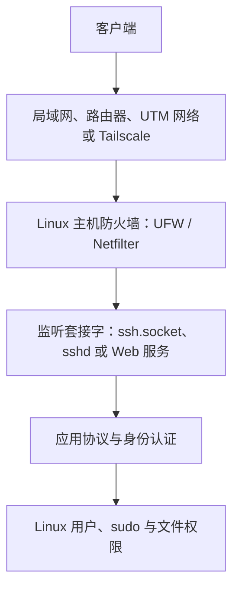

本文从一台 Linux 主机的视角解释防火墙解决什么问题，并以 Ubuntu 默认提供的 UFW 建立第一套可观察、可验证、可恢复的入站规则。目标不是背诵命令或直接学习复杂的 nftables 语法，而是能够根据“连接从哪里来、使用什么协议和端口、应允许到哪里”设计并验证规则。

网络接口、地址、路由和 DNS 见 [[Linux 网络接口、IP 地址、路由与 DNS 基础]]；端口、监听套接字与 `ss` 输出见 [[Linux 端口、监听套接字与 ss 命令基础]]；SSH 的主机身份和用户认证见 [[OpenSSH 连接、密钥与主机指纹]]；命令组合与退出状态见 [[Shell 标准流、管道、重定向与退出状态]] 和 [[Shell 脚本阅读基础]]。

> [!abstract] 本篇掌握目标
> - **必须熟练**：区分 UFW 软件包、已保存规则、当前运行状态和开机启用状态；核对真实监听端口；按“观察 → 预演 → 修改 → 验证 → 恢复”安全启用 UFW。
> - **理解会查**：理解默认策略、规则方向与顺序、application profile、IPv4/IPv6、来源与接口限制，并能按连接现象选择排查层次。
> - **认识即可**：Netfilter、iptables、nftables、转发流量和复杂自定义规则；出现网关、容器或生产网络需求时再深入。

> [!info] 核对日期与适用范围
> 本文于 **2026-07-20** 核对 Ubuntu Server 和 UFW 官方资料。本文面向使用 UFW 管理主机防火墙的 Ubuntu Server；现有主机可能已经由 UFW、nftables、容器运行时或其他系统管理工具配置规则，修改前必须先识别实际管理边界。

## 完成标准

- 能解释“网络可达、端口监听、防火墙允许、SSH 认证、Linux 权限”是不同层次。
- 能从来源、目标、方向、协议和端口描述一条访问需求。
- 能区分 `ufw status`、`ufw show added`、`ufw show listening` 和 `ss` 的用途。
- 能确认 UFW application profile 与真实监听端口是否一致。
- 能在启用前保留控制台和基准会话，在启用后建立全新的验证会话。
- 能区分 `disable`、`delete` 与 `reset`，并知道何时应停止而不是盲目清空规则。

## 1. 主机防火墙位于连接路径的哪一层

一次 SSH 或 HTTP 连接通常依次经过以下层次：



各层回答的问题不同：

| 层次 | 要回答的问题 | 常用观察位置 |
| --- | --- | --- |
| 地址与路由 | 数据包能否到达目标主机 | `ip -brief address`、`ip route` |
| 主机防火墙 | 到达主机的数据包是否允许继续进入 | `ufw status`、UFW 规则 |
| 监听套接字 | 是否真的有程序接收该协议和端口 | `ss -lntup`、`systemctl status` |
| 应用认证 | 客户端能否证明主机与用户身份 | SSH 主机指纹、密钥、密码 |
| Linux 权限 | 登录后能读取、修改和执行什么 | 用户、组、文件模式、sudoers |

因此：

- 开放端口不会自动启动服务。
- 服务正在监听，不代表防火墙允许外部连接。
- 防火墙允许 SSH，不代表用户名或密钥一定正确。
- SSH 登录成功，不代表登录用户拥有 root 权限。

UFW 是 Ubuntu 提供的主机防火墙管理工具。它把较易读的规则转换为 Linux 内核能够执行的网络过滤配置；学习 UFW 时应先掌握访问控制模型，不必一开始就直接维护底层规则。

## 2. 一条规则需要描述什么

“打开 SSH”省略了多个条件。设计规则前至少回答：

| 要素 | 问题 | SSH 常见情况 |
| --- | --- | --- |
| 方向 | 流量进入、离开还是经过本机 | 客户端到服务端属于入站 |
| 协议 | 使用 TCP、UDP 还是其他协议 | SSH 使用 TCP |
| 目标端口 | 数据包准备交给哪个服务入口 | 默认通常是 22，但应实测 |
| 来源 | 任意来源、单个地址还是可信网段 | 取决于实际访问路径 |
| 目标 | 本机任意地址还是指定接口或地址 | 简单主机规则通常是本机 |
| 动作 | 匹配后允许、丢弃还是明确拒绝 | `allow`、`deny`、`reject` |

UFW 是有状态防火墙。默认允许主机主动建立的出站连接时，相应的返回流量能够按连接状态被识别；不能把所有“方向上进入主机的数据包”都理解为陌生的新入站连接。

规则顺序也有意义：数据包按顺序匹配规则，先匹配到的决定性规则会影响结果。更具体的来源、接口或端口规则通常应位于更一般的规则之前。

## 3. UFW 有四类容易混淆的状态

```text
软件包状态：ufw 命令是否已经安装
        ↓
配置状态：默认策略和允许、拒绝规则保存了什么
        ↓
运行状态：规则当前是否已经加载并生效
        ↓
启动状态：系统重启后是否会重新启用
```

| 操作 | 改变什么 | 不代表什么 |
| --- | --- | --- |
| `apt install ufw` | 安装 UFW 软件包和相关文件 | 不等于防火墙已经启用 |
| `ufw allow ...` | 添加一条允许规则 | 不等于目标服务正在监听 |
| `ufw enable` | 加载规则，并设置为启动时启用 | 不证明客户端一定能够连接 |
| `ufw disable` | 卸载 UFW 规则，并取消启动时启用 | 不会自动删除已保存规则 |
| `ufw delete ...` | 删除指定规则 | 不会删除其他规则 |
| `ufw reset` | 禁用并恢复安装默认配置 | 会清除既有规则，不是普通排障步骤 |

新安装的 UFW 通常处于禁用状态，安装默认策略通常为拒绝入站、拒绝转发、允许出站。现有主机不能只凭这个默认值做决定：应先读取当前状态和已有规则，确认它们是否属于其他用途或管理工具。

## 4. 先学会观察，不要立即启用

### 4.1 查看 UFW 是否安装

**执行位置：Ubuntu Server（控制台或 SSH 会话，任意目录）**

```bash
command -V ufw || true
dpkg-query -W -f='${Status} ${Version}\n' ufw 2>/dev/null || true
```

`command -V` 检查当前 Shell 能否找到命令；`dpkg-query` 检查 Debian 软件包数据库。这里的 `|| true` 只让“尚未安装”作为可观察结果继续输出，不会安装或启用 UFW。

如果确认 UFW 尚未安装，暂时跳过下面以 `ufw` 开头的查询，先执行 [[Linux 主机防火墙与 UFW 基础#7.1 安装 UFW|7.1 安装 UFW]]，再返回本节观察现状。安装软件包不会自动启用防火墙，不需要因此把观察和启用合并为一步。

### 4.2 查看运行状态和规则

**执行位置：Ubuntu Server（控制台或 SSH 会话，任意目录）**

```bash
sudo ufw status verbose
sudo ufw status numbered
sudo ufw show added
```

三个命令回答的问题不同：

- `status verbose`：UFW 当前是否启用；启用时还会显示默认策略和规则摘要。
- `status numbered`：按编号显示当前规则，便于定位。
- `show added`：显示通过 UFW 命令添加的规则；UFW 尚未启用时也可用于检查准备加载的配置。

命令退出状态为 `0` 只表示查询正常完成，不代表输出一定是 `active`、策略一定正确或规则一定匹配真实服务。必须阅读输出内容。

> [!warning] 发现既有规则时先停止
> 如果 UFW 已启用，或 `show added` 中存在无法解释的规则，不要为了得到“干净结果”运行 `ufw reset`。先确认规则来源、用途、IPv4/IPv6 范围以及是否由自动化工具维护。

### 4.3 查看真实监听端口

**执行位置：Ubuntu Server（控制台或 SSH 会话，任意目录）**

```bash
sudo ss -lntup
sudo ufw show listening
```

`ss` 读取当前监听套接字；`ufw show listening` 将监听端口与可能影响它们的规则放在一起报告。二者是本机观察，仍不能替代从实际客户端发起的新连接测试。

`-lntup` 分别选择监听套接字、数字地址与端口、TCP、UDP 和进程信息。监听地址范围、输出字段以及 `sudo` 的作用见 [[Linux 端口、监听套接字与 ss 命令基础]]。

## 5. application profile 不是服务状态

软件包可以在 `/etc/ufw/applications.d/` 提供 application profile，用名称描述需要的端口与协议。查看已知 profile：

**执行位置：Ubuntu Server（控制台或 SSH 会话，任意目录）**

```bash
sudo ufw app list
sudo ufw app info OpenSSH
```

`OpenSSH` 在这里是 UFW profile 名称，不是 `ssh.service` 或 `ssh.socket`：

- `app info OpenSSH` 只显示 profile 声明的端口和协议。
- 它不会检查 OpenSSH 服务是否安装、运行或监听。
- 它不会证明 profile 与自定义后的 SSH 端口一致。
- `ufw allow OpenSSH` 表示允许该 profile 中描述的端口和协议。

默认 OpenSSH profile 通常描述 `22/tcp`，但应以当前机器输出为准。修改过 SSH 端口时，应先确认真实监听状态，再决定使用显式端口规则还是维护应用 profile。

## 6. 先比较 SSH 配置、监听状态与 UFW profile

执行首次 SSH 放行前比较三个事实：

**执行位置：Ubuntu Server（保留控制台，任意目录）**

```bash
sudo sshd -T | grep '^port '
sudo ss -lntp
sudo ufw app info OpenSSH
```

判断顺序：

1. `sshd -T` 显示 OpenSSH 有效配置中的端口。
2. `ss` 显示系统当前实际监听的地址、协议和端口。
3. `app info OpenSSH` 显示 UFW profile 将要放行的端口。
4. 三者一致时，才使用 `OpenSSH` profile 走下文主线。
5. 不一致时停止，不要靠猜测添加规则；按 [[OpenSSH 连接、密钥与主机指纹#3. 在服务端准备 sshd]] 先确认实际激活路径和监听端口。

Ubuntu 可能使用 `ssh.socket` 承担监听，因此不能只读取某一个配置文件，也不能只看到 `ssh.service` 状态就下结论。

如果 `sshd -T` 因运行时目录或服务状态返回错误，不要为了继续防火墙步骤手工制造目录；先按 [[OpenSSH 连接、密钥与主机指纹#sshd -t 提示缺少 /run/sshd]] 恢复并验证 OpenSSH 激活路径。

## 7. 在新主机上安全启用 UFW

本节只适用于以下条件全部满足时：

- 控制台仍然可用。
- 一条在启用 UFW 前已经验证的 **基准会话** 保持打开。
- 已经从另一个客户端终端成功建立过 **启用前复测会话**，证明当前仍能接受新的 SSH 连接。
- UFW 没有需要保留但无法解释的现有规则。
- OpenSSH profile 与实际监听端口一致。

基准会话用于在变更期间保留恢复入口；启用前复测会话用于确认防火墙变更前的新连接本来正常；UFW 启用后还要重新发起第三类连接——启用后验证会话。已经存在的 TCP 连接不能代替启用后的新连接验证。

### 7.1 安装 UFW

**风险：系统变化；安装软件包，但不会自动启用 UFW。**

```bash
sudo apt install ufw
```

APT 的索引、软件包状态和安装验证见 [[APT 软件包管理基础]]。安装完成后重新运行：

```bash
sudo ufw status verbose
sudo ufw show added
```

如果此时发现既有配置，转为审查现有系统，不继续套用“新主机”流程。

### 7.2 明确默认策略

仅在确认这是新主机且没有需要保留的既有策略后执行：

**风险：系统变化；修改未匹配流量的默认处理方式。**

```bash
sudo ufw default deny incoming
sudo ufw default allow outgoing
```

含义是：没有命中显式允许规则的新入站连接默认拒绝；主机主动访问 DNS、APT 和 HTTPS 等出站连接默认允许。这里没有修改 routed/forwarded 流量；作为路由器、网关或容器宿主时需要单独设计。

### 7.3 预演 OpenSSH 规则

**风险：只读预演；输出拟生成的规则，不应用变更。**

```bash
sudo ufw --dry-run allow OpenSSH
```

重点核对输出中的协议和端口。`--dry-run` 只能预演规则变更，不能证明启用后真实客户端一定能够连接。

### 7.4 添加规则并检查保存结果

**风险：系统变化；保存允许规则，但 UFW 尚未启用时不会因此开始过滤。**

```bash
sudo ufw allow OpenSSH
sudo ufw show added
```

确认输出中的允许规则与预演一致。简单的 `allow OpenSSH` 不限制来源接口或来源地址；如果需求是“只允许某个可信网段或 `tailscale0`”，必须先确认客户端真实来源和恢复路径，再单独设计规则，不能猜测地址范围。

### 7.5 启用并读取实际状态

**风险：系统变化；开始应用防火墙规则，可能影响当前远程连接。**

```bash
sudo ufw enable
sudo ufw status verbose
sudo ufw status numbered
sudo ufw show listening
```

第一次远程启用时不要使用 `ufw --force enable` 跳过警告。预期结果是：

- `Status` 为 `active`。
- 默认入站策略符合预期。
- OpenSSH 允许规则与实际端口一致。
- 如果系统启用 IPv6，还能看到对应的 IPv6 规则范围。

### 7.6 建立启用后验证会话

保留控制台和基准会话，不复用启用前已经存在的连接。从客户端重新发起一条全新的 SSH 连接，作为 **启用后验证会话**。登录后执行只读检查：

```bash
hostnamectl --static
id
sudo ufw status verbose
```

只有启用后验证会话稳定成功后，才能认为“地址、路由、监听、防火墙和认证”这条实际路径成立。不要只因为基准会话或启用前复测会话仍然存在就关闭控制台。

## 8. 自定义 SSH 端口时如何判断

如果 OpenSSH 实际监听端口不是 profile 中显示的端口，不运行 `ufw allow OpenSSH`。正确思路是：

1. 从可信配置和 `ss` 输出确认实际 TCP 端口。
2. 保留控制台与基准会话。
3. 使用该实际端口构造显式的 `端口/tcp` 规则。
4. 先使用 `--dry-run`，再添加规则。
5. 启用或重载后，从客户端使用同一个端口新建连接。

命令骨架是：

```text
sudo ufw --dry-run allow 实际端口/tcp
sudo ufw allow 实际端口/tcp
```

这里故意不提供一个可直接复制的虚构端口。端口必须来自当前主机的有效配置和真实监听结果。

## 9. UFW 规则动作与范围限制

| 动作 | 基本含义 | 适用判断 |
| --- | --- | --- |
| `allow` | 允许匹配流量 | 明确需要提供的服务入口 |
| `deny` | 丢弃匹配流量 | 不希望向来源明确回应时 |
| `reject` | 拒绝并向来源返回错误 | 希望客户端快速得到拒绝结果时 |

规则还可以按来源、目标和接口缩小范围。设计顺序应是：

```text
先确认真实访问路径
  → 确认客户端来源地址或入口接口
  → 确认服务协议与端口
  → 预演规则
  → 添加并从真实客户端测试
```

不要因为“限制来源更安全”就填入未经验证的网段；错误的来源条件同样会把管理入口锁死。

## 10. 删除、禁用与重置不是同一操作

查看规则后，可以按原始规则删除：

```bash
sudo ufw status numbered
sudo ufw delete allow OpenSSH
```

优先按原始规则删除，意图比编号更清楚。系统启用 IPv6 时，一条通用规则可能对应 IPv4 与 IPv6 项；按编号删除通常只删除选中的那一项，删除后应重新读取完整列表。

| 操作 | 结果 | 风险提示 |
| --- | --- | --- |
| `ufw disable` | 暂停 UFW 并取消启动时启用，保留规则 | 可能扩大暴露面，只用于受控恢复 |
| `ufw delete ...` | 删除指定规则 | 删除管理入口前必须保留控制台 |
| `ufw reset` | 禁用并清除全部规则，恢复安装默认值 | 破坏性高，不作为普通排障起点 |

## 11. 启用后无法连接时如何恢复

### 11.1 先从控制台恢复入口

**执行位置：Ubuntu Server 本地或虚拟机控制台**

```bash
sudo ufw disable
sudo ufw status verbose
```

`disable` 只暂停应用 UFW 规则，不会自动删除已保存规则。恢复连接后仍需查清端口、来源、接口或规则顺序问题；不要把长期关闭防火墙当作修复完成。

### 11.2 按层次定位

| 现象 | 优先检查 | 常用命令 |
| --- | --- | --- |
| 地址不可达 | 地址、路由、虚拟网络 | `ip -brief address`、`ip route` |
| 连接超时 | 路由、上游策略、主机防火墙 | `ufw status verbose`、`ufw show listening` |
| 立即拒绝 | 服务是否监听、监听地址是否正确 | `ss -lntp`、`systemctl status` |
| SSH 认证失败 | 用户、密钥和认证配置 | `sshd -T`、SSH 服务日志 |
| 基准会话可用，启用后验证会话失败 | 新连接规则、当前监听与认证 | UFW、`ss`、`journalctl` |
| IPv4 正常、IPv6 失败 | IPv6 地址、路由和规则 | `ip -6 address`、UFW `(v6)` 项 |

这些现象只给出优先排查方向，不是绝对诊断。例如超时也可能来自上游路由器、虚拟化网络或 Tailscale 策略。

### 11.3 按需启用低级别日志

需要观察被阻断流量时，可以临时启用低级别日志：

```bash
sudo ufw logging low
sudo journalctl -k --grep='UFW' --no-pager -n 100
```

高日志级别可能快速产生大量记录，不应为了“看得更多”长期盲目开启。排查完成后根据需要关闭：

```bash
sudo ufw logging off
```

## 12. 与 Tailscale、Docker 和上游防火墙的边界

### 12.1 Tailscale

Tailscale ACL 或 grants 决定 tailnet 中哪些身份可以访问哪些节点和端口；UFW 决定到达 Linux 主机的数据包是否允许进入；OpenSSH 再完成主机身份和 Linux 用户认证。三层不能互相替代，详见 [[使用 Tailscale 访问 Linux 主机#10. ACL、grants 与防火墙的边界]]。

### 12.2 Docker

Docker 发布容器端口时会管理自己的网络和过滤规则，发布的端口可能不按直觉经过 UFW 规则。不能只凭 `ufw status` 判断容器服务没有对外暴露，详见 [[Ubuntu 安装 Docker#发布端口后 UFW 规则没有生效]]。

### 12.3 路由器、NAT 与云安全组

上游没有端口转发，不代表主机防火墙可以忽略；云安全组允许端口，也不代表 UFW 一定允许。每一层都应按它负责的边界单独验证。

## 13. 为什么首次启用不写成一段自动化脚本

类似下面的结构只能组合退出状态：

```bash
if command_a && command_b && command_c; then
  command_d
fi
```

它能表达“前面的命令都成功才运行下一步”，但不能自动证明：

- 状态输出是 `active` 还是 `inactive`。
- application profile 与真实端口一致。
- 规则来源范围符合实际网络。
- 新客户端确实能够建立连接。

退出状态检查是必要的失败保护，不是配置语义验证。防火墙首次启用属于低频、高影响操作，应先逐步读懂输出并完成真实连接测试。以后需要自动化重复配置时，再把已经明确的状态断言、环境前提和恢复策略写进配置管理工具或脚本。

## 练习与自测

1. 用自己的话解释为什么“允许出站”不等于所有返回流量都会被默认入站策略阻断。
2. 比较 `sshd -T`、`ss -lntp` 与 `ufw app info OpenSSH`，说明三者分别读取什么。
3. 从“只允许某个可信来源访问一个 TCP 服务”的需求中标出方向、来源、目标、协议和端口。
4. 解释为什么基准会话仍可用不能代替启用后验证会话。
5. 解释 `disable`、`delete` 和 `reset` 的差异及最坏结果。
6. 遇到 `Connection refused`、超时和 `Permission denied` 时，分别说出优先检查的层次。

## 后续阅读

- 网络地址、路由与 DNS：[[Linux 网络接口、IP 地址、路由与 DNS 基础]]
- 端口、监听套接字与 `ss`：[[Linux 端口、监听套接字与 ss 命令基础]]
- SSH 监听、密钥与认证：[[OpenSSH 连接、密钥与主机指纹]]
- Ubuntu 首次初始化主线：[[Ubuntu Server 初始化与基础安全]]
- Tailscale 访问控制边界：[[使用 Tailscale 访问 Linux 主机]]
- Docker 发布端口与 UFW：[[Ubuntu 安装 Docker#发布端口后 UFW 规则没有生效]]

## 官方参考资料

- [Ubuntu Server：UFW 防火墙](https://ubuntu.com/server/docs/how-to/security/firewalls/)
- [Ubuntu 安全文档：Linux 防火墙与 UFW](https://documentation.ubuntu.com/security/security-features/network/firewall/)
- [Ubuntu `ufw(8)` 手册](https://manpages.ubuntu.com/manpages/resolute/man8/ufw.8.html)
