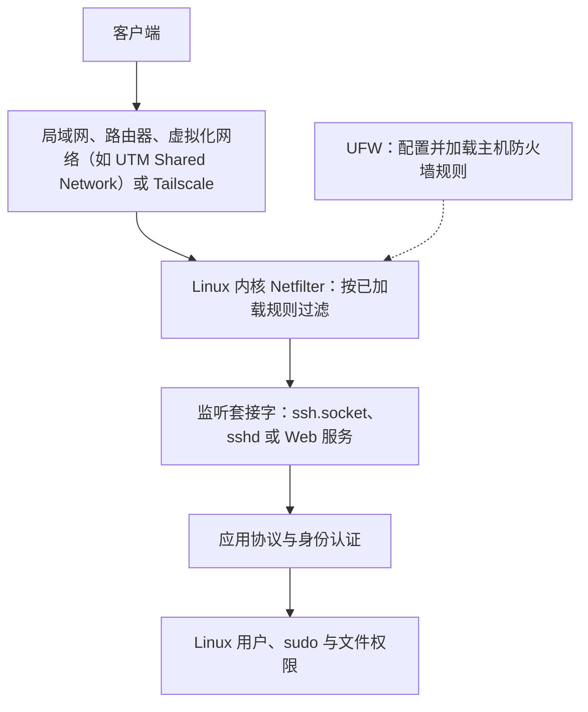

本文从一台 Linux 主机的视角解释防火墙解决什么问题，并以 UFW（Uncomplicated Firewall，Ubuntu 常用的主机防火墙管理前端）建立第一套可观察、可验证、可恢复的入站规则。目标不是背诵命令或直接学习 nftables 等底层规则语法，而是能够根据“连接从哪里来、使用什么协议和端口、应允许到哪里”设计并验证规则。

网络接口、地址、路由和 DNS 见 [[Linux 网络接口、IP 地址、路由与 DNS 基础]]；端口、监听套接字与 `ss` 输出见 [[Linux 端口、监听套接字与 ss 命令基础]]；SSH 的连接边界、主机身份与用户认证见 [[OpenSSH 密钥登录、服务端配置与排查]]；命令组合与退出状态见 [[Shell 标准流、管道、重定向与退出状态]] 和 [[Shell 脚本阅读基础]]。

本文先建立通用的规则模型和只读观察方法，再说明如何把访问需求写成、预演并检查 UFW 规则；最后以“通过 SSH 远程管理一台新 Ubuntu Server”为实践场景，演示如何在保留管理入口的前提下首次启用 UFW。SSH 在这里是安全实践案例，不是 UFW 只支持的服务。

> [!abstract] 本篇掌握目标
> - **必须熟练**：区分 UFW 软件包、已保存规则、当前运行状态和开机启用状态；把访问需求写成规则；按“观察 → 预演 → 修改 → 验证 → 恢复”安全启用 UFW。
> - **理解会查**：理解默认策略、规则方向与顺序、显式端口规则与命名的端口和协议说明（application profile）、IPv4/IPv6、来源与接口限制，并能按连接现象选择排查层次。
> - **认识即可**：Netfilter 内核数据包过滤基础设施、iptables 与 nftables 等底层规则工具、转发流量和复杂自定义规则；出现网关、容器或生产网络需求时再深入。

> [!info] 核对日期与适用范围
> 本文于 **2026-08-01** 核对 Ubuntu Server 和 UFW 官方资料。当前主机的实际 UFW 版本应以第 4.1 节的 `dpkg-query` 输出为准。本文面向使用 UFW 管理主机防火墙的 Ubuntu Server；现有主机可能已经由 UFW、nftables、容器运行时或其他系统管理工具配置规则，修改前必须先识别实际管理边界。

## 完成标准

- 能解释“网络可达、端口监听、防火墙允许、SSH 认证、Linux 权限”是不同层次。
- 能从来源、目标、方向、协议和端口描述一条访问需求。
- 能解释显式规则与默认策略的职责区别，并区分入站、出站和转发三个方向。
- 能把访问需求写成显式端口规则，知道省略来源或接口限制会扩大匹配范围。
- 能区分 `ufw status`、`ufw show added`、`ufw show listening` 和 `ss` 的用途。
- 能解释 application profile 的作用，并确认它声明的端口与真实监听端口是否一致。
- 能在启用前保留控制台和基准会话，在启用后建立全新的验证会话。
- 能区分 `disable`、`delete` 与 `reset`，并知道何时应停止而不是盲目清空规则。

## 1. 主机防火墙位于连接路径的哪一层

一次 SSH 或 HTTP 连接通常依次经过以下层次：


```mermaid
flowchart TD
    A["客户端"] --> B["局域网、路由器、虚拟化网络（如 UTM Shared Network）或 Tailscale"]
    B --> C["Linux 内核 Netfilter：按已加载规则过滤"]
    U["UFW：配置并加载主机防火墙规则"] -.-> C
    C --> D["监听套接字：ssh.socket、sshd 或 Web 服务"]
    D --> E["应用协议与身份认证"]
    E --> F["Linux 用户、sudo 与文件权限"]
```

各层回答的问题不同：

| 层次 | 要回答的问题 | 常用观察位置 |
| --- | --- | --- |
| 地址与路由 | 数据包能否到达目标主机 | `ip -brief address`、`ip route` |
| 主机防火墙 | 到达主机的数据包是否允许继续进入 | `ufw status`、UFW 规则 |
| 监听套接字 | 是否真的有程序接收该协议和端口 | `ss -lntup`、`systemctl status` |
| 应用认证 | 客户端能否证明主机与用户身份 | SSH 主机指纹、密钥、密码 |
| Linux 权限 | 登录后能读取、修改和执行什么 | 用户、组、文件模式、sudoers |

因此：

- 开放端口不会自动启动服务。
- 服务正在监听，不代表防火墙允许外部连接。
- 防火墙允许 SSH，不代表用户名或密钥一定正确。
- SSH 登录成功，不代表登录用户拥有 root 权限。

Netfilter 是 Linux 内核中的数据包过滤和连接跟踪基础设施，真正按已加载规则处理流量。UFW 是管理这些主机防火墙规则的前端：它把较易读的配置转换并加载为内核能够执行的规则。iptables、nftables 则属于更底层的规则体系和管理工具；学习 UFW 时应先掌握访问控制模型，不必一开始就直接维护底层规则。

## 2. 规则如何描述并匹配流量

### 2.1 从访问需求拆解规则要素

“打开一个服务端口”省略了多个条件。设计规则前至少回答：

| 要素 | 问题 | 常见主机服务情况 |
| --- | --- | --- |
| 方向 | 流量进入、离开还是经过本机 | 客户端访问本机服务属于入站 |
| 协议 | 使用 TCP、UDP 还是其他协议 | 取决于应用协议和真实套接字 |
| 目标端口 | 数据包准备交给哪个服务入口 | 来自真实监听状态，不能靠猜测 |
| 来源 | 任意来源、单个地址还是可信网段 | 取决于实际访问路径 |
| 目标 | 本机任意地址还是指定接口或地址 | 简单主机规则通常是本机 |
| 动作 | 匹配后允许、丢弃还是明确拒绝 | `allow`、`deny`、`reject` |

规则语法不一定把每个要素都写出来，但省略来源、接口或目标地址通常会扩大匹配范围。使用简写前仍要逐项回答这些问题，确认哪些条件可以有意保持为“任意”，第 5 节再把它们写成 UFW 规则。

### 2.2 有状态防火墙如何识别返回流量

UFW 生成并加载的是有状态防火墙规则，它们使用 Linux 内核 Netfilter 的连接跟踪。主机向外发起连接时，内核会记录连接状态；对方随后传回本机的数据会被识别为这条连接的响应，而不是从外部发起的新连接。

因此，不能只因为返回数据进入本机，就把它视为从外部发起的新连接。连接状态、显式规则和规则未命中时的默认处理方式需要放在一起判断；第 2.4 节继续说明三者的关系。

### 2.3 规则顺序为什么会影响结果

数据包按顺序匹配规则，先匹配到的决定性规则会影响结果。如果需求是“允许一个可信来源访问某端口，拒绝其他来源访问同一端口”，判断顺序应是：

```text
先：允许可信来源访问目标端口
后：拒绝其他来源访问同一端口
```

如果更一般的拒绝规则先匹配，后面更具体的允许规则就可能无法产生预期结果。添加存在交叉范围的规则前，应先读取现有顺序并明确冲突时的预期结果；第 5.5 节说明修改前后分别读取哪类状态。

### 2.4 规则未命中时如何决定结果

防火墙规则通常只描述需要明确处理的流量，不可能为每一种情况分别编写一条规则。当一段流量没有因已有连接状态或适用规则得到处理结果时，防火墙仍需要知道应该怎样处理。这个按流量方向预先确定的兜底决定，称为默认策略。

三类判断依据的职责不同：

| 判断依据 | 负责回答的问题 |
| --- | --- |
| 连接状态 | 这是不是某条已有连接的后续流量 |
| 显式规则 | 这段流量是否满足一组具体条件，匹配后应怎样处理 |
| 默认策略 | 前两类判断没有给出处理结果时，这个方向的流量最终怎样处理 |

默认策略不是一条抢在所有规则之前、覆盖全部流量的普通规则。更具体的显式规则可以声明例外；只有没有得到其他处理结果的流量，才落到相应方向的默认策略。

进入本机、由本机发出和经过本机转发是三个不同方向，它们不必采用相同的默认处理方式。通用设计顺序是先明确每个方向的兜底边界，再用显式规则声明确实需要的例外；UFW 如何表达默认策略见第 5.4 节，如何与显式规则一起预演、设置和检查见第 5.5 节。

## 3. UFW 有四类容易混淆的状态

```text
软件包状态：ufw 命令是否已经安装
        ↓
配置状态：默认策略和允许、拒绝规则保存了什么
        ↓
运行状态：规则当前是否已经加载并生效
        ↓
启动状态：系统重启后是否会重新启用
```

| 操作 | 改变什么 | 不代表什么 |
| --- | --- | --- |
| `apt install ufw` | 安装 UFW 软件包和相关文件 | 不等于防火墙已经启用 |
| `ufw allow ...` | 添加一条允许规则 | 不等于目标服务正在监听 |
| `ufw enable` | 加载规则，并设置为启动时启用 | 不证明客户端一定能够连接 |
| `ufw disable` | 卸载 UFW 规则，并取消启动时启用 | 不会自动删除已保存规则 |
| `ufw delete ...` | 删除指定规则 | 不会删除其他规则 |
| `ufw reset` | 禁用并恢复安装默认配置 | 会清除既有规则，不是普通排障步骤 |

新安装的 UFW 通常处于禁用状态，安装默认策略通常为拒绝入站、拒绝转发、允许出站。这些值属于已保存配置，不代表规则已经加载。现有主机不能只凭安装默认值做决定：应先读取当前状态和已有规则，确认它们是否属于其他用途或管理工具。

## 4. 修改前先确认工具与现状

### 4.1 查看并按需安装 UFW

**执行位置：Ubuntu Server（控制台或 SSH 会话，任意目录）**

```bash
command -V ufw || true
dpkg-query -W -f='${Status} ${Version}\n' ufw 2>/dev/null || true
```

`command -V` 检查当前 Shell 能否找到命令；`dpkg-query` 检查 Debian 软件包数据库，软件包已安装状态的查询方法见 [[APT 软件包管理基础#5.1 搜索、查看并确认软件包]]。这里的 `|| true` 只让“尚未安装”作为可观察结果继续输出，不会安装或启用 UFW。

如果确认 UFW 尚未安装，再执行安装：

**风险：系统变化；安装软件包，但不会自动启用 UFW。**

```bash
sudo apt install ufw
```

安装完成后重新运行本节的 `command -V` 和 `dpkg-query`，确认命令路径与软件包版本。APT 的索引、软件包状态和安装验证见 [[APT 软件包管理基础]]。安装只是补齐管理工具，不要把“安装”和“启用防火墙”合并为一步。

### 4.2 查看运行状态和规则

**执行位置：Ubuntu Server（控制台或 SSH 会话，任意目录）**

```bash
sudo ufw status verbose
sudo ufw status numbered
sudo grep -E '^DEFAULT_.*_POLICY' /etc/default/ufw
sudo ufw show added
```

四个命令回答的问题不同：

- `status verbose`：UFW 当前是否启用；启用时还会显示默认策略和规则摘要。
- `status numbered`：UFW 启用时按编号显示当前用户规则，便于定位；尚未启用时通常只显示 `Status: inactive`。
- `grep -E '^DEFAULT_.*_POLICY' /etc/default/ufw`：从 UFW 配置文件读取已保存的策略变量；UFW 尚未启用时也能读取，但不能证明这些策略已经加载。
- `show added`：显示通过 UFW 命令添加并保存的用户规则；UFW 尚未启用时也可用于检查准备加载的规则，但它不显示默认策略，也不能证明规则正在生效。

这里的 `status` 展示 UFW 管理的状态和用户规则，不等于枚举容器运行时或其他工具加载的全部底层防火墙规则。

命令退出状态为 `0` 只表示查询正常完成，不代表输出一定是 `active`、策略一定正确或规则一定匹配真实服务。必须阅读输出内容。

> [!warning] 发现既有规则时先停止
> 如果 UFW 已启用，或 `show added` 中存在无法解释的规则，不要为了得到“干净结果”运行 `ufw reset`。先确认规则来源、用途、IPv4/IPv6 范围以及是否由自动化工具维护。

### 4.3 核对真实监听端口

**执行位置：Ubuntu Server（控制台或 SSH 会话，任意目录）**

```bash
sudo ss -lntup
```

`ss` 直接读取内核中的套接字状态，是核对真实监听情况的主视图。`ss -lntup` 中的选项分别表示监听套接字、数字地址与端口、TCP、UDP 和进程信息。监听地址范围、UDP 的 `UNCONN` 状态、输出字段以及 `sudo` 的作用见 [[Linux 端口、监听套接字与 ss 命令基础]]。

需要从 UFW 视角辅助关联监听项与用户规则时，再按需执行：

```bash
sudo ufw show listening
```

`ufw show listening` 会读取并简化套接字信息，再关联可能影响监听项的 UFW 用户规则。它不是 `ss` 的另一种输出格式，也不是 UFW 运行状态查询；缺少某个条目时应回到 `ss` 核对，详细报告边界见附录 A。

此时只需区分三类彼此独立的事实：服务是否创建了预期套接字、UFW 保存了哪些用户规则、UFW 当前是否启用。服务正在监听不代表防火墙允许连接；没有已保存规则也不代表主机没有监听服务。发现无法解释的监听端口或规则时先停止，确认其来源和用途后再进入规则设计。

## 5. 从一条完整规则理解 UFW 语法与操作

第 2 节已经说明一条规则需要描述哪些要素，以及规则未命中时默认策略如何兜底。本节先给出一条结构较完整的主机入站规则，再按命令中的实际位置依次解释动作、匹配条件和默认策略，最后把两类配置放入同一条操作流程。显式规则始终使用同一组教学值，操作阶段再为它配套一项入站默认策略；只有说明实际存在的 OpenSSH profile 时作局部对照。

### 5.1 先看一条结构完整的入站规则

下面是一条不可直接执行的教学规则：`enp1s0` 是示例接口，`198.51.100.0/24` 是示例来源网段，`192.0.2.10` 是示例主机地址，`8080` 是示例服务端口。实际值必须来自目标主机和真实访问需求。

```text
sudo ufw allow in on enp1s0 proto tcp from 198.51.100.0/24 to 192.0.2.10 port 8080
```

整条命令的含义是：允许来自 `198.51.100.0/24` 的 TCP 流量，经 `enp1s0` 接口进入本机，访问本机地址 `192.0.2.10` 的 `8080` 端口。

先把整条命令划分成三部分：

| 命令片段 | 角色 | 本例中的含义 |
| --- | --- | --- |
| `sudo ufw` | 命令入口 | 以管理员权限运行 UFW |
| `allow` | 规则动作 | 流量匹配后允许通过 |
| `in on enp1s0 proto tcp from 198.51.100.0/24 to 192.0.2.10 port 8080` | 匹配条件 | 限定哪些流量能够命中这条规则 |

去掉命令入口 `sudo ufw` 后，剩余内容称为规则表达式：

```text
allow in on enp1s0 proto tcp from 198.51.100.0/24 to 192.0.2.10 port 8080
```

UFW 把动作写在规则表达式前面，把匹配条件写在后面。阅读时可以还原为“如果后面的条件全部匹配，就执行前面的动作”。

### 5.2 动作决定匹配后如何处理

教学规则中的 `allow` 是动作。它不负责说明哪些流量会命中，只说明流量命中后怎样处理。UFW 常见规则动作如下：

| 动作 | 匹配后的处理 | 适用边界 |
| --- | --- | --- |
| `allow` | 允许流量通过 | 明确需要提供的服务入口 |
| `deny` | 丢弃流量，不主动向来源说明原因 | 不希望向来源明确回应时 |
| `reject` | 拒绝流量，并向来源返回错误 | 希望客户端快速得知连接被拒绝时 |
| `limit` | 允许正常连接，但限制同一来源频繁建立新连接 | 常用于降低 TCP 登录服务遭受暴力尝试的风险，不是带宽限速工具 |

`log` 和 `log-all` 用于记录匹配流量，属于日志修饰，不替代上述处理动作；日志的启停与查看见第 7.4 节。选择动作前仍要先确认业务需求和第 2.4 节所述的默认处理边界，不能因为动作名称看起来更严格就直接添加规则。

### 5.3 匹配条件决定哪些流量命中规则

教学规则中 `allow` 后面的内容都是匹配条件。只有这些条件同时满足，UFW 才执行 `allow`：

| 规则片段 | 匹配条件 | 本例中的作用 | 省略后的范围 |
| --- | --- | --- | --- |
| `in` | 方向 | 只匹配进入本机的流量 | 普通 UFW 规则未写方向时默认按入站处理 |
| `on enp1s0` | 接口 | 只匹配经 `enp1s0` 进入的流量 | 匹配所有可用接口 |
| `proto tcp` | 协议 | 只按 TCP 解释后面的端口 | 数字端口规则通常同时覆盖 TCP 和 UDP |
| `from 198.51.100.0/24` | 来源地址 | 只匹配来自该网段的流量 | 来源为任意地址 |
| `to 192.0.2.10` | 目标地址 | 只匹配发往本机该地址的流量 | 目标为本机任意地址 |
| `port 8080` | 目标端口 | 只匹配发往本机 `8080` 端口的流量 | 可能扩大为该协议下的全部目标端口 |

表中的 `in` 是本例选择的方向值，不是唯一可选值。普通主机规则可以写 `in` 或 `out`：`in` 匹配进入本机的流量，`out` 匹配由本机发出的流量；与 `on enp1s0` 连用时，接口条件分别表示流量进入或离开本机所经过的接口。

省略方向时，普通规则默认按 `in` 处理，因此出站规则必须显式写 `out`。第 5.4 节的 `incoming`、`outgoing` 和 `routed` 是默认策略方向，不能与普通规则中的 `in`、`out` 混用。

`port` 修饰它前面的地址：`from 来源地址 port 端口` 表示来源端口，`to 目标地址 port 端口` 表示目标端口。客户端通常使用临时源端口，因此本例只限制服务端目标端口；为了让规则看起来更长而强行限制来源端口，反而可能阻断正常客户端。

匹配条件必须来自真实访问路径和第 4 节的观察结果。不要因为“限制来源更安全”就填入未经验证的网段或接口；错误条件同样会阻断合法入口。反过来，省略条件会扩大匹配范围，也必须是有意做出的决定。

#### 用 profile 引用协议和目标端口

有些应用需要一组固定的端口和协议。软件包可以在 `/etc/ufw/applications.d/` 中提供 application profile（应用配置档案，后文简称 profile），让规则通过名称引用这组端口和协议。

假设 `OpenSSH` profile 声明的是 `22/tcp`，显式写法与 profile 写法可以对照为：

```text
显式端口规则：allow in on enp1s0 proto tcp from 198.51.100.0/24 to 192.0.2.10 port 22
profile 规则：allow in on enp1s0 from 198.51.100.0/24 to 192.0.2.10 app OpenSSH
```

profile 替代的是显式协议和目标端口，动作、方向、接口、来源和目标地址仍然保留。使用 `app OpenSSH` 时不再同时写 `proto tcp`，实际端口和协议以当前主机上的 profile 内容为准。

使用前先读取当前主机实际存在的 profile：

**执行位置：Ubuntu Server（控制台或 SSH 会话，任意目录）；以下命令只读。**

```bash
sudo ufw app list
sudo ufw app info OpenSSH
```

`app list` 列出当前已知的 profile 名称；`app info OpenSSH` 读取 `OpenSSH` 声明的端口和协议。它不会检查 OpenSSH 是否安装、运行或监听，也不能证明 profile 与自定义后的 SSH 端口一致。第 6.1 节会把 profile 与有效配置和真实监听状态放在一起比较。

#### 简写意味着有意省略匹配条件

确认确实不需要限制来源、目标地址或接口时，可以把完整规则缩短。例如：

```text
显式端口简写：allow 8080/tcp
profile 简写：allow OpenSSH
```

这两行都是规则表达式，不是完整 Shell 命令。它们没有写出方向时默认按入站处理，并允许任意来源通过任意接口访问相应端口。简写只是省略了条件，不代表 UFW 已经替管理员核实访问范围、服务状态或真实监听端口。

无论使用完整写法、profile 还是简写，上述内容都属于显式规则：它们只说明哪些流量会命中以及命中后怎样处理，尚未回答没有命中这些规则的流量怎么办。

### 5.4 默认策略命令如何表达兜底处理

默认策略负责处理未命中规则的流量。第 2.4 节已经建立了“按方向兜底”的概念；在 UFW 中，应使用 `default` 子命令设置这种处理方式，而不是再添加一条带来源、接口、协议或端口条件的普通规则。命令结构是：

```text
sudo ufw default 动作 方向
```

`动作` 可以是 `allow`、`deny` 或 `reject`；`方向` 使用以下三个名称：

| 方向 | 兜底范围 |
| --- | --- |
| `incoming` | 进入主机并以本机为通信终点的流量 |
| `outgoing` | 由本机发出并以其他主机为通信终点的流量 |
| `routed` | 经过本机转发、本机只作为中间节点的流量 |

默认策略中的 `incoming`、`outgoing` 和 `routed` 是方向名称；普通规则中的 `in`、`out` 则用于限定具体规则的方向。默认策略没有端口、来源或接口条件，显式规则才负责声明这些具体例外。

到这里，显式规则命令回答“哪些流量作为例外以及怎样处理”，默认策略命令回答“其余流量怎样处理”。两者都会改变 UFW 配置，下一节把它们放入同一条预演、设置和检查路径。

### 5.5 预演、设置并检查默认策略与显式规则

本节继续使用第 5.1 节的教学规则，并为它配套“未命中的入站流量默认拒绝”这一教学策略。两者组合后的含义是：只允许示例可信网段访问示例主机的 `8080/tcp`，其他没有得到处理结果的入站流量采用拒绝这一兜底动作。

这套组合只演示一个入站方向，不代表真实主机已经完成出站和转发策略设计。接口、地址、端口和策略取值都必须来自实际需求，不能直接执行下面的教学命令。

```text
默认策略：
default deny incoming

显式规则：
allow in on enp1s0 proto tcp from 198.51.100.0/24 to 192.0.2.10 port 8080
```

#### 先预演两类变更

先分别预演默认策略和显式规则，确认 UFW 准备修改的方向、动作和匹配范围：

```text
默认策略预演：
sudo ufw --dry-run default deny incoming

显式规则预演：
sudo ufw --dry-run allow in on enp1s0 proto tcp from 198.51.100.0/24 to 192.0.2.10 port 8080
```

`--dry-run` 只显示拟进行的变更，不修改配置。策略预演重点核对方向和兜底动作，规则预演重点核对接口、来源、目标、协议、端口和动作；两者都不能证明服务正在监听、UFW 已经启用或真实客户端能够连接。

显式规则预演还会输出 UFW 拟生成的底层规则。不必把整段输出都当成新的访问条件，只需在 `### RULES ###` 区域找到本次生成的用户规则，并把以下常见标记映射回第 5.1 节的访问需求：

| 访问需求 | 预演输出中的常见标记 | 本例应确认的内容 |
| --- | --- | --- |
| 入站方向和规则位置 | `-A ufw-user-input` | 把规则追加到 UFW 用户入站规则链 |
| 入口接口 | `-i` | `enp1s0` |
| 协议 | `-p` | `tcp` |
| 来源地址 | `-s` | `198.51.100.0/24` |
| 目标地址 | `-d` | `192.0.2.10`；没有 `-d` 表示未限定具体目标地址 |
| 目标端口 | `--dport` | `8080` |
| 匹配后的动作 | `-j` | `ACCEPT`，对应 UFW 的 `allow` |

使用 profile 时，还要把它展开后的协议和目标端口与前面通过 `ufw app info` 读取的 profile 内容对照。`### LOGGING ###`、`### RATE LIMITING ###` 和规则注释属于 UFW 的辅助规则或元数据，不应被误读为本次规则额外开放的协议、地址或端口。

如果命令没有报错，且这些字段与访问需求一致，只能判断“UFW 成功解析并生成了符合意图的预演规则”。即使预演末尾出现 `Rules updated`，也不表示规则已经保存或加载；保存状态、运行状态和真实可达性仍分别由后续的 `show added`、`status` 和真实客户端新连接确认。

#### 再设置策略并添加规则

下面的顺序只适用于第 4 节已经确认 UFW 尚未启用、没有需要保留但无法解释的既有配置，并且所有教学值都已替换为实际值的情况。

**风险：系统变化；修改已保存的默认策略并添加用户规则。UFW 尚未启用时，这些配置还没有开始过滤流量。**

```text
设置默认策略：
sudo ufw default deny incoming

添加显式规则：
sudo ufw allow in on enp1s0 proto tcp from 198.51.100.0/24 to 192.0.2.10 port 8080
```

如果 UFW 已经启用，不要套用上述顺序。收紧默认策略前，应保留恢复入口，先准备并确认必要的显式允许规则，再修改默认策略；UFW 官方手册也提醒，改变默认策略后需要人工重新核对和迁移既有规则，不能假定 UFW 会替管理员补齐新的例外。

如果策略的方向或动作错误，应使用正确的 `default` 命令改回预期值；如果显式规则错误，应按原始规则表达式删除。不要使用 `ufw reset` 清空其他配置，具体恢复方法见第 7.1 节。

#### 分别检查保存状态与运行状态

默认策略和显式规则属于不同配置对象，检查位置也不同。UFW 尚未启用时，先分别读取已保存的默认策略和用户规则：

**执行位置：Ubuntu Server（控制台或 SSH 会话，任意目录）；以下命令只读。**

```bash
sudo grep -E '^DEFAULT_.*_POLICY' /etc/default/ufw
sudo ufw show added
```

配置文件查询用于核对默认策略是否已经按预期保存。`show added` 只显示通过 UFW 命令添加的用户规则，不显示默认策略。确认保存的默认策略和显式规则都与预演一致后，远程管理主机还必须按第 6 节保留恢复入口并安全启用；不要从本节的教学值直接跳到 `ufw enable`。

只有 UFW 已经启用，或按第 6 节安全启用后，才使用以下命令检查运行状态：

```bash
sudo ufw status verbose
sudo ufw status numbered
```

- `status verbose` 检查 UFW 运行状态、当前默认策略和规则摘要。
- `status numbered` 在 UFW 启用时按显示顺序列出当前用户规则，可用来识别交叉或冲突范围。
- 它们都不能代替从实际客户端发起的新连接测试。UFW 尚未启用时，不要把 `Status: inactive` 误解为“没有已保存规则”，也不要绕过管理入口检查直接启用。

到这里，两类配置的完整路径是：

```text
访问需求
  → 明确各方向的默认策略
  → 设计必要的显式例外
  → 分别使用 --dry-run 预演
  → 设置默认策略并添加显式规则
  → /etc/default/ufw 检查已保存的默认策略
  → show added 检查已保存的用户规则
  → 安全启用 UFW
  → status verbose 检查运行状态与默认策略
  → status numbered 检查用户规则及顺序
  → 从真实客户端建立新连接
```

下一节把这条通用路径应用到一个可恢复的 SSH 场景，并用真实管理入口替换本节的教学值。

## 6. 实践：在保留 SSH 管理入口的前提下首次启用 UFW

前面已经建立通用规则模型，并在第 5.5 节把默认策略与显式规则放入同一条操作路径。本节选择 SSH 作为首次启用场景，是因为远程管理主机时，错误的默认策略、端口或来源条件可能立即切断唯一的管理入口；这不是因为 UFW 只用于 SSH。

本节用三类 SSH 会话区分变更前后的证据：

- **基准会话**：在 UFW 变更期间保持打开，用于保留恢复入口。
- **启用前复测会话**：从另一个客户端终端新建，证明变更前本来能够建立新连接。
- **启用后验证会话**：启用 UFW 后再次新建，证明新的防火墙状态仍允许真实管理路径。

如果从 Ubuntu Server 初始化主线进入，应先完成 [[Ubuntu Server 初始化与基础安全#8. 建立并验证 OpenSSH 会话]] 的返回检查点。无论从哪条路径进入，本节都只适用于以下条件全部满足的新主机：

- Ubuntu Server 控制台仍然可用。
- 已按 [[OpenSSH 密钥登录、服务端配置与排查#2. 在服务端准备 sshd]] 核对 OpenSSH 激活路径、有效配置和监听端口。
- 已按 [[OpenSSH 密钥登录、服务端配置与排查#7. 用新会话验证密钥]] 完成真实客户端登录，并将一条已验证会话作为基准会话保持打开。
- 已经从另一个客户端终端成功建立启用前复测会话。
- `ufw status verbose` 显示 UFW 当前为 `inactive`；已经启用的主机不套用“首次启用”流程。
- 没有需要保留但无法解释的既有 UFW 配置。

若任一条件不满足，应停止本节，而不是套用新主机流程。

> [!note] 首次启用为什么逐步执行
> 复合脚本可以根据命令退出状态决定是否继续，却不能自动证明 profile 与真实端口一致、来源范围正确或新客户端能够连接。首次启用属于低频、高影响操作，应逐步阅读输出并保留恢复入口；重复配置只有在状态断言和恢复策略都明确后再自动化。

### 6.1 确认 SSH 管理入口并选择规则写法

添加 SSH 规则前比较三个事实：

**执行位置：Ubuntu Server（保留控制台，任意目录）**

```bash
sudo sshd -T | grep '^port '
sudo ss -lntp
sudo ufw app info OpenSSH
```

判断顺序：

1. `sshd -T` 显示 OpenSSH 有效配置中的端口。
2. `ss` 显示系统当前实际监听的地址、协议和端口。
3. `app info OpenSSH` 显示 `OpenSSH` profile 声明的端口和协议。
4. 有效配置、真实监听和 profile 一致时，可以选择规则表达式 `allow OpenSSH`。
5. profile 不存在或与真实端口不一致时，不使用 `allow OpenSSH`；应根据已核实的实际端口选择显式的 `allow 实际端口/tcp`。

两条分支可以概括为：

```text
profile 与有效配置、真实监听一致 → allow OpenSSH
profile 不存在或内容不一致       → allow 实际端口/tcp
```

这里的 `实际端口` 必须来自当前主机的有效配置和真实监听结果，不能替换成未经核对的示例值。如果还要限制来源网段或入口接口，应按第 5.1 节的完整结构构造规则，并用第 5.3 节逐项核对匹配条件，不能直接使用允许任意来源的简单写法。

Ubuntu 可能使用 `ssh.socket` 承担监听，因此不能只读取某一个配置文件，也不能只看到 `ssh.service` 状态就下结论。

如果 `sshd -T` 因运行时目录或服务状态返回错误，不要为了继续防火墙步骤手工制造目录；先按 [[OpenSSH 常用命令基础#5.4 sshd -t 提示缺少 /run/sshd]] 恢复并验证 OpenSSH 激活路径。

### 6.2 为当前主机选择并设置默认策略

第 6.1 节已经确认必须保留的 SSH 管理入口。本节面对的是普通 Ubuntu Server：它需要接受明确允许的 SSH 管理连接，也需要主动访问 DNS、APT 和 HTTPS，但不作为路由器或网关转发其他主机的流量。因此本次选择是：

| 方向 | 当前需求 | 本次决定 |
| --- | --- | --- |
| 入站 | 只接受后续显式允许的新连接 | 默认拒绝未命中的新入站连接 |
| 出站 | 允许主机主动访问外部服务 | 默认允许 |
| 转发 | 本流程不把主机配置为路由器或网关 | 不修改 |

**执行位置：Ubuntu Server（保留控制台和基准会话，任意目录）**

仅在本节开头的前置条件全部满足，并确认没有需要保留但无法解释的既有 UFW 配置后，先预演准备设置的入站和出站策略：

**风险：只读预演；输出拟进行的策略更改，不修改配置。**

```bash
sudo ufw --dry-run default deny incoming
sudo ufw --dry-run default allow outgoing
```

确认方向与动作符合上表后，再执行实际设置：

**风险：系统变化；修改已保存的默认策略。当前 UFW 仍为 `inactive`，因此尚未开始过滤流量。**

```bash
sudo ufw default deny incoming
sudo ufw default allow outgoing
```

设置后立即执行只读查询，确认默认策略已经按预期保存：

```bash
sudo grep -E '^DEFAULT_.*_POLICY' /etc/default/ufw
```

本流程至少应确认 `DEFAULT_INPUT_POLICY="DROP"` 和 `DEFAULT_OUTPUT_POLICY="ACCEPT"`；其他策略变量不属于前面两条命令的修改目标。

如果任一设置命令或查询结果与预期不符，停止后续步骤，重新核对方向与动作并改回预期值；不要在策略尚未确认时继续启用 UFW。

入站策略只拒绝没有得到其他处理结果的新连接；主机主动出站后的返回流量仍按第 2.2 节说明的连接状态处理。这里没有执行 `default ... routed`，不是假定转发流量已经安全，而是因为本流程不负责路由器、网关或容器宿主的转发策略；出现这些角色时必须单独设计。

### 6.3 预演并添加 SSH 规则

**风险：只读预演；输出拟生成的规则，不应用变更。**

如果第 6.1 节确认可以使用 `OpenSSH` profile，先预演：

```bash
sudo ufw --dry-run allow OpenSSH
```

按第 5.5 节的最小判读方法读取预演输出，重点确认 profile 展开后的协议和端口与第 6.1 节核对的有效配置和真实监听一致。使用显式端口分支时，则按已核实的实际端口构造预演命令：

```text
sudo ufw --dry-run allow 实际端口/tcp
```

`--dry-run` 只能预演规则变更，不能证明启用后真实客户端一定能够连接。预演结果正确后，再执行与所选分支完全一致的添加命令。

**风险：系统变化；保存允许规则，但 UFW 尚未启用时不会因此开始过滤。**

使用 `OpenSSH` profile 的主线是：

```bash
sudo ufw allow OpenSSH
sudo ufw show added
```

显式端口分支的命令骨架是：

```text
sudo ufw allow 实际端口/tcp
sudo ufw show added
```

确认保存的允许规则与预演一致。简单的 `allow OpenSSH` 和 `allow 实际端口/tcp` 都不限制来源接口或来源地址；如果需求是“只允许某个可信网段或入口接口”，必须按第 5.1 节的完整结构补全规则，并用第 5.3 节逐项核对匹配条件，不能在此处猜测范围。

### 6.4 启用并读取实际状态

**风险：系统变化；开始应用防火墙规则，可能影响当前远程连接。**

```bash
sudo ufw enable
sudo ufw status verbose
sudo ufw status numbered
sudo ss -lntp
```

第一次远程启用时不要使用 `ufw --force enable` 跳过警告。这几个命令分别提供不同证据：

- `ufw enable` 执行状态变更，但成功退出本身不能证明规则语义正确。
- `status verbose` 确认运行状态、默认策略和规则摘要。
- `status numbered` 确认当前 UFW 用户规则及显示顺序，编号也可用于后续精确定位。
- `ss -lntp` 重新确认内核中实际存在的 TCP 监听套接字。

需要关联非回环监听项与 UFW 用户规则时，可再执行可选的 `sudo ufw show listening`。它不是完整套接字清单，也不显示默认策略。

预期结果是：

- `Status` 为 `active`。
- 默认入站和出站策略符合预期。
- 编号用户规则中存在与实际 SSH 端口一致的允许规则。
- 如果系统启用 IPv6，还能看到对应的 IPv6 规则范围。
- `ss` 中仍存在预期的 SSH 监听；如果按需执行的 `show listening` 没有列出某个端口，应回到 `ss` 核对，不能据此断言服务已经停止。

### 6.5 建立启用后验证会话

保留控制台和基准会话，不复用启用前已经存在的连接。从客户端重新发起一条全新的 SSH 连接，作为 **启用后验证会话**。登录后执行只读检查：

```bash
hostnamectl --static
id
sudo ufw status verbose
```

只有启用后验证会话稳定成功后，才能认为“地址、路由、监听、防火墙和认证”这条实际路径成立。启用前已经存在的 TCP 连接不能代替这次新连接验证；不要只因为基准会话或启用前复测会话仍然存在就关闭控制台。

## 7. 调整规则、停用 UFW 与故障恢复

### 7.1 删除规则、停用 UFW 与重置

删除前先只读查看当前规则，确认目标及恢复入口：

```bash
sudo ufw status numbered
```

下面的删除命令只适用于第 6 节使用 `OpenSSH` profile 添加的规则；显式端口或带来源限制的规则应使用原始规则表达式删除。

**风险：系统变化；删除允许规则可能立即中断新的管理连接。**

```bash
sudo ufw delete allow OpenSSH
```

优先按原始规则删除，意图比编号更清楚。系统启用 IPv6 时，一条通用规则可能对应 IPv4 与 IPv6 项；按编号删除通常只删除选中的那一项，删除后应重新读取完整列表。

| 操作 | 结果 | 风险提示 |
| --- | --- | --- |
| `ufw disable` | 卸载当前 UFW 规则并取消启动时启用，保留已保存规则 | 可能扩大暴露面，只用于受控恢复 |
| `ufw delete ...` | 删除指定规则 | 删除管理入口前必须保留控制台 |
| `ufw reset` | 禁用并清除全部规则，恢复安装默认值 | 破坏性高，不作为普通排障起点 |

### 7.2 启用后无法连接时先恢复入口

**执行位置：Ubuntu Server 本地或虚拟机控制台**

```bash
sudo ufw disable
sudo ufw status verbose
```

`disable` 会卸载当前 UFW 规则并取消开机启用，但不会自动删除已保存规则。恢复连接后仍需查清端口、来源、接口或规则顺序问题；不要把长期关闭防火墙当作修复完成。

### 7.3 按层次定位

| 现象 | 优先检查 | 常用命令 |
| --- | --- | --- |
| 地址不可达 | 地址、路由、虚拟网络 | `ip -brief address`、`ip route` |
| 连接超时 | 地址、路由、上游策略、主机防火墙和真实监听 | `ip -brief address`、`ip route`、`ss -lntp`、`ufw status verbose` |
| 立即拒绝 | 服务未监听、监听地址错误，或防火墙显式 `reject` | `ss -lntp`、`systemctl status`、`ufw status numbered` |
| SSH 认证失败 | 用户、密钥和认证配置 | `sshd -T`、SSH 服务日志 |
| 基准会话可用，启用后验证会话失败 | 新连接规则、当前监听与认证 | UFW、`ss`、`journalctl` |
| IPv4 正常、IPv6 失败 | IPv6 地址、路由和规则 | `ip -6 address`、UFW `(v6)` 项 |

这些现象只给出优先排查方向，不是绝对诊断。例如超时也可能来自上游路由器、虚拟化网络或 Tailscale 策略。`ufw show listening` 可以辅助关联端口与规则，但它会省略部分套接字，不能替代 `ss` 作为监听事实来源。

### 7.4 按需启用日志

需要观察被阻断流量时，可以临时启用低级别日志：

```bash
sudo ufw logging low
sudo journalctl -k --grep='UFW' --no-pager -n 100
```

高日志级别可能快速产生大量记录，不应为了“看得更多”长期盲目开启。排查完成后根据需要关闭：

```bash
sudo ufw logging off
```

## 8. 与 Tailscale、Docker 和上游防火墙的边界

### 8.1 Tailscale

Tailscale ACL（Access Control List，访问控制列表）或 grants（授权规则）决定 tailnet（由 Tailscale 连接的私有网络）中哪些身份可以访问哪些节点和端口；UFW 决定到达 Linux 主机的数据包是否允许进入；OpenSSH 再完成主机身份和 Linux 用户认证。三层不能互相替代，详见 [[使用 Tailscale 访问 Linux 主机#10. ACL、grants 与防火墙的边界]]。

### 8.2 Docker

Docker 发布容器端口时会管理自己的网络和过滤规则，发布的端口可能不按直觉经过 UFW 规则。不能只凭 `ufw status` 判断容器服务没有对外暴露，详见 [[Ubuntu 安装 Docker#发布端口后 UFW 规则没有生效]]。

### 8.3 路由器、网络地址转换（NAT）与云安全组

上游没有端口转发，不代表主机防火墙可以忽略；云安全组允许端口，也不代表 UFW 一定允许。每一层都应按它负责的边界单独验证。

## 练习与自测

1. 用自己的话解释为什么“允许出站”不等于所有返回流量都会被默认入站策略阻断。
2. 解释显式规则与默认策略分别在什么条件下决定结果，以及为什么默认拒绝入站不会覆盖明确允许的服务入口。
3. 从“只允许某个可信来源访问一个 TCP 服务”的需求中标出方向、来源、目标、协议、端口和动作，并写出对应的规则语法骨架。
4. 解释显式端口规则与 application profile 的区别，以及为什么 profile 不能证明服务正在监听。
5. 说明 `ufw status`、`ufw show added`、`ufw show listening` 与 `ss -lntup` 分别读取哪类事实，以及为什么它们不能相互替代。
6. 比较 `sshd -T`、`ss -lntp` 与 `ufw app info OpenSSH`，说明三者分别读取什么，并判断何时使用 `allow OpenSSH`、何时使用显式端口规则。
7. 解释为什么基准会话仍可用不能代替启用后验证会话。
8. 解释 `disable`、`delete` 和 `reset` 的差异及最坏结果。
9. 遇到 `Connection refused`、超时和 `Permission denied` 时，分别说出优先检查的层次。

## 附录 A：深入理解 `ufw show listening`

第 4.3 节已经把 `ss` 作为真实套接字的主视图，把 `ufw show listening` 作为辅助报告。本附录只在需要解释二者差异或排查报告缺项时深入，不属于首次添加规则的必经步骤。

> [!info] 实现核对范围
> 本附录以 Ubuntu 24.04 的 UFW 0.36.2-6 源码为基准，并与 Ubuntu 26.04 的 UFW 0.36.2-9build1 手册交叉核对。当前主机行为仍应以第 4.1 节查到的实际版本为准。

**执行位置：Ubuntu Server（控制台或 SSH 会话，任意目录）；以下命令只读。**

```bash
sudo ss -lntup
sudo ufw show listening
```

`ufw show listening` 读取当前套接字信息，按自己的规则筛选和简化，再把监听项与可能影响它的 UFW 用户规则放在一起。二者的职责和报告边界如下：

| 观察维度 | `ss -lntup` | `ufw show listening` |
| --- | --- | --- |
| 主要目的 | 查看当前内核套接字及其进程 | 从 UFW 视角关联监听端口与可能影响它的用户规则 |
| TCP | 列出所选网络命名空间中的 TCP 监听套接字 | 按 `tcp`、`tcp6` 汇总非回环监听项 |
| UDP | 列出符合筛选条件的 UDP 套接字，常见状态为 `UNCONN` | 按 `udp`、`udp6` 汇总非回环绑定项；出现条目只说明某个套接字绑定了本地地址和端口，不能据此判断程序是在对外提供服务、作为客户端收发数据，还是同时承担两种角色 |
| 地址 | 显示具体本地地址、作用域、接口和通配地址，包括回环地址 | 当前核对的 UFW 0.36.2 实现排除仅绑定到 `127.*` 或 `::1` 的项目，把 `0.0.0.0`、`::` 简写为 `*`，并省略 `ss` 中的 `%接口名` 作用域标记 |
| 进程 | 使用 `sudo` 时可显示 PID、文件描述符和多个持有者 | 通常只显示可执行文件名 |
| 防火墙信息 | 不显示 UFW 规则 | 可能在监听项后追加匹配的 UFW 用户规则，但不显示默认策略 |

`ufw show listening` 的单项结构可以抽象为：

```text
协议族:
  本地端口 本地地址 (进程名)
  可能影响该监听项的 UFW 用户规则
```

- `tcp`、`udp` 表示 IPv4，`tcp6`、`udp6` 表示 IPv6；只有 UFW 配置启用了 IPv6 检查时，报告才会处理 IPv6 项。
- 数字是本地端口；地址位置的 `*` 表示该地址族的通配绑定，而不是“UFW 已允许所有来源”。
- 括号中的名称是占用套接字的可执行程序；它不是 systemd 单元状态，也不证明应用协议正常。
- 如果存在可能影响该监听项的 UFW 用户规则，报告还可能在该项后继续列出规则；默认策略仍需通过 `ufw status verbose` 查看。

`ufw show listening` 查询套接字事实并关联已保存的 UFW 用户规则，不以 UFW 当前启用为前提。因此，UFW 未启用时仍可能生成监听报告；没有已保存的用户规则，也不表示主机没有监听套接字。

通用判读顺序是：先用 `ss` 确认真实监听事实；再分别用 `ufw status verbose` 查看运行状态及启用时的默认策略、用 `ufw status numbered` 查看当前用户规则、用 `ufw show added` 查看已保存的用户规则；最后把 `ufw show listening` 作为套接字与规则的关联报告。真实可达性仍需从实际客户端发起新连接测试。

## 后续阅读

- 网络地址、路由与 DNS：[[Linux 网络接口、IP 地址、路由与 DNS 基础]]
- 端口、监听套接字与 `ss`：[[Linux 端口、监听套接字与 ss 命令基础]]
- OpenSSH 连接、监听、密钥登录与排查：[[OpenSSH 密钥登录、服务端配置与排查]]
- Ubuntu 首次初始化主线：[[Ubuntu Server 初始化与基础安全]]
- Tailscale 访问控制边界：[[使用 Tailscale 访问 Linux 主机]]
- Docker 发布端口与 UFW：[[Ubuntu 安装 Docker#发布端口后 UFW 规则没有生效]]

## 官方参考资料

- [Ubuntu Server：UFW 防火墙](https://ubuntu.com/server/docs/how-to/security/firewalls/)
- [Ubuntu 安全文档：Linux 防火墙与 UFW](https://documentation.ubuntu.com/security/security-features/network/firewall/)
- [Ubuntu 24.04 `ufw(8)` 手册（UFW 0.36.2-6）](https://manpages.ubuntu.com/manpages/noble/man8/ufw.8.html)
- [Ubuntu 26.04 `ufw(8)` 手册（UFW 0.36.2-9build1）](https://manpages.ubuntu.com/manpages/resolute/man8/ufw.8.html)
- [Ubuntu 24.04 UFW 0.36.2-6 源码：`show listening` 报告实现](https://git.launchpad.net/ufw/tree/src/frontend.py?h=debian%2F0.36.2-6#n286)
- [Ubuntu 24.04 UFW 0.36.2-6 源码：读取内核套接字表](https://git.launchpad.net/ufw/tree/src/util.py?h=debian%2F0.36.2-6#n961)
