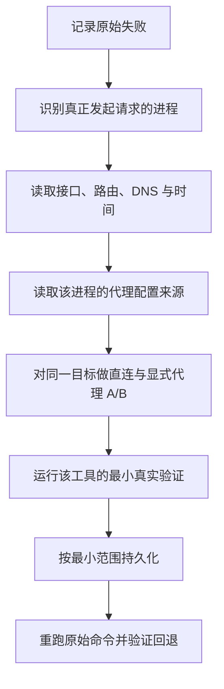

本文解释 Linux 开发机主动访问软件仓库、代码托管平台和镜像仓库时，如何判断是否需要出站代理，如何把代理配置交给真正发起请求的进程，以及如何验证和安全撤销配置。

这里的“出站”是指 Linux 主机上的程序主动连接外部服务。例如：APT（Advanced Package Tool，高级软件包工具）是 Ubuntu/Debian 的软件包管理工具；Git 是版本控制客户端；Go、Maven 和 npm 可能在构建时下载依赖或工具；Docker 的后台服务可能拉取容器镜像。本文不讨论用 Nginx（常用 Web 服务器与反向代理软件）接收外部请求的反向代理部署。

开始前应能读取接口、地址、路由和 DNS 的当前状态；这些基础概念见 [[Linux 网络接口、IP 地址、路由与 DNS 基础]]。本文会先建立代理所需的最小模型，再逐步进入命令和工具专属配置。

> [!abstract] 本篇掌握目标
> - **必须熟练**：先识别谁发起请求，再检查它读取的代理配置；能对同一目标比较直连和显式代理，并安全撤销当前会话配置。
> - **理解会查**：区分当前命令的子进程、管理员命令、后台服务、镜像构建步骤和容器应用的配置边界。
> - **认识即可**：企业代理认证、加密流量检查、自动代理发现和复杂的按目标分流；遇到真实需求时遵循组织方案。

> [!info] 资料核对日期
> 本文于 **2026-08-23** 核对 curl（命令行 URL 传输工具）、APT、Git、Go module（Go 依赖模块）、Maven、npm 和 Docker 官方资料。不同工具支持的变量大小写、例外规则和配置优先级可能变化，实际使用前应结合本机版本重新查看文末官方资料与本机帮助。
> 其中 Git 的代理来源、配置作用域与选择顺序于 **2026-08-28** 再次核对。

## 1. 先理解一次直接访问

Linux 中的命令不是抽象地“使用网络”，而是由一个正在运行的程序进程创建网络连接。Shell 是读取并解释命令行的程序；`curl` 是向 URL（统一资源定位符）发起传输请求的命令行工具。例如执行：

```bash
curl -I https://example.com/
```

Shell 先解析这一行，再启动 `curl` 进程。`curl` 解析目标 URL，通过 DNS（域名系统）获得目标地址，根据路由选择出口，然后与目标服务建立 TCP（传输控制协议）和 TLS（传输层安全协议）连接。

示例 URL 中的 `https` 表示在 HTTP（超文本传输协议）应用请求外使用 TLS 保护传输。这里只用它验证一条常见的安全 Web 访问路径。

可以把直接访问简化为：

```text
Shell
  -> 启动 curl 进程
  -> curl 解析目标域名
  -> Linux 按路由把连接发往目标服务
  -> 目标服务返回响应
```

这里有三个不同角色：

| 角色 | 含义 | 示例 |
| --- | --- | --- |
| 客户端进程 | 主动发起当前网络请求的程序 | `curl`、`git`、`go`、Maven 使用的 Java 进程、`npm` |
| 目标服务 | 客户端最终希望访问的服务 | Ubuntu 软件源、GitHub、公共 Maven 仓库、容器镜像仓库 |
| Linux 网络栈 | 为进程提供 DNS、路由、TCP、TLS 等基础能力 | 接口、地址、默认路由和名称解析 |

“接口有地址”和“DNS 能解析”只证明前置层次具备部分条件，不等于目标 HTTPS 一定可用。反过来，一条 `curl` 成功也不一定证明是直接访问，因为 `curl` 可能读取了代理配置。

## 2. 出站代理改变了哪一步

出站代理也常称为正向代理。配置后，客户端进程不再直接连接目标服务，而是先连接一个已知的代理服务，再由代理代表客户端访问目标。

```text
客户端进程
  -> 代理服务
  -> 目标服务
```

本文主线使用 HTTP 出站代理。代理服务地址通常由三部分组成：

```text
协议://主机名或地址:端口
```

例如 `http://proxy.example.com:3128` 表示客户端使用 HTTP 代理协议连接示例代理主机的 `3128` 端口。这里的 `http://` 描述“客户端怎样连接代理”，不代表最终目标只能是 HTTP；HTTP 代理通常可以通过 `CONNECT` 方法为 HTTPS 目标建立隧道。

代理不能替代 Linux 的全部基础网络。客户端仍然需要：

1. 能解析代理主机名，或已经知道它的地址。
2. 有到代理服务的路由。
3. 能连接代理监听端口。
4. 满足代理的认证、访问策略与 TLS 信任要求。

因此，“直接连接目标失败、经过代理成功”只能证明代理提供了另一条可用应用访问路径，不能证明原来的 DNS、路由或目标服务问题已经消失。

## 3. 先区分几种名称相近的机制

“代理”一词在开发环境里可能指不同机制。先区分职责，后面才不会把配置写到错误位置。

| 名称 | 请求首先到哪里 | 主要解决什么问题 | 是否属于本文主线 |
| --- | --- | --- | --- |
| HTTP 或 SOCKS（一种通用代理协议）出站代理 | 客户端先连接代理服务 | 让当前客户端经另一条路径访问外部服务 | 是 |
| 反向代理 | 外部客户端先连接 Nginx 等入口 | 为服务端统一接收请求、转发、终止 TLS，或在多个后端间分配流量 | 否 |
| Go module proxy | `go` 命令访问实现 `GOPROXY` 协议的模块服务 | 缓存、治理或分发 Go module | 只解释边界 |
| Maven 仓库管理器或镜像 | Maven 访问团队或组织维护的制品仓库服务 | 聚合、缓存和治理 Java 依赖 | 只解释边界 |
| 虚拟机 Shared 或 NAT（网络地址转换）网络 | 客户机流量先经过虚拟化网络 | 让虚拟机接入宿主或外部网络 | 否 |
| SSH（安全外壳协议）跳板机 | SSH 客户端先建立到跳板机的加密连接 | 到达不能直接访问的 SSH 目标 | 否 |

Go module proxy 和 Maven 仓库管理器本身也是网络服务，但它们决定“依赖从哪个仓库取得”；HTTP 或 SOCKS 出站代理决定“客户端怎样到达那个网络服务”。两层可以同时存在，也可以只使用其中一层。

反向代理的方向与本文相反。EventHub 后续使用 Nginx 接收应用流量时，应在部署阶段单独设计域名、监听端口、TLS 和上游服务，不能复用本文的客户端代理配置。

## 4. 核心判断：究竟是谁发起请求

代理配置只有被发起请求的进程读取，才会生效。浏览器、Shell、包管理器和后台服务不是同一个进程，也不必读取同一份配置。

### 4.1 Shell 环境只会被后续子进程继承

环境变量是进程携带的一组名称和值。Shell 使用 `export` 标记变量后，之后由这个 Shell 启动的子进程才有机会继承它；详细的变量与继承模型见 [[Shell 路径、变量、引用与展开]]。

```text
当前 Shell
  ├── 启动 curl       -> 可能继承代理变量
  ├── 启动 git        -> 可能继承代理变量
  └── 启动另一个 Shell -> 可能继承代理变量
```

已经运行的其他终端、IDE（集成开发环境）、浏览器和后台服务不会因为当前 Shell 执行了一次 `export` 就自动改变。

### 4.2 `sudo` 会改变用户和执行环境

`sudo` 用于按授权以另一个身份运行命令，常见目标身份是系统管理账号 `root`。它通常会过滤当前用户的部分环境变量。因此：

- 当前用户执行 `curl` 能经过代理，不代表 `sudo apt update` 会读取同一组变量。
- 不应为了传递代理而无条件使用 `sudo -E`；这会扩大被保留的环境范围。
- APT 等系统工具应优先使用自己的受控配置或一次性命令选项。

用户、`sudo` 与进程身份的基础边界见 [[Linux 用户、用户组、sudo 与文件权限]]。

### 4.3 systemd 服务由服务管理器启动

systemd 是常见的 Linux 服务管理器。Docker daemon 等后台服务通常由 systemd 启动，而不是由当前登录 Shell 启动，因此不会自然继承 `.bashrc`、`.zshrc` 这类 Shell 启动配置，也不会继承当前终端刚刚导出的变量。

服务需要代理时，应使用该程序自己的配置或受控的 systemd drop-in（附加配置片段）。修改后还要让 systemd 重新读取配置，并按影响评估是否重启服务。服务 unit（服务单元）和 drop-in 的完整概念见 [[systemd 服务与日志基础]]。

### 4.4 虚拟机拥有独立的网络与回环地址

宿主机和虚拟机是两个独立操作系统环境。宿主机的系统代理、浏览器代理或 Shell 变量不会自动写入客户机。

`127.0.0.1` 是“当前操作系统自身”的回环地址：

- 在 macOS 上，它指向 macOS。
- 在 Ubuntu 虚拟机中，它指向 Ubuntu 虚拟机，不是 macOS 宿主机。

如果代理程序运行在宿主机，Ubuntu 客户机必须使用一个从客户机实际可达的宿主地址，并且宿主代理确实监听该地址、允许来自客户机的连接。扩大监听范围可能把代理暴露给更多设备，必须同时检查宿主防火墙和代理访问控制。Shared、NAT 与桥接网络的可达性边界见 [[虚拟机网络模式与可达性]]。

### 4.5 Docker 还包含多个独立边界

一次 Docker 操作同时包含“谁向谁发送控制命令”和“谁真正访问外部网络”两个问题，不能把它们当成同一条链路。

Docker CLI（命令行界面）是用户输入 `docker` 命令时由当前 Shell 启动的客户端。它通常通过本机 socket（进程间通信端点）向 Docker daemon（后台守护进程，常见进程名为 `dockerd`）发送控制命令；真正管理镜像、构建和容器的是 daemon。构建镜像时，daemon 还会使用构建器执行 Dockerfile（描述镜像构建步骤的文件）中的步骤。

```text
控制链路：
当前 Shell -> Docker CLI -> Docker daemon

可能真正访问外部网络的路径：
Docker daemon 或构建器 -> 镜像仓库
镜像构建步骤中的进程 -> 软件源或依赖仓库
运行容器中的应用进程 -> 外部 API（应用程序编程接口）或其他服务
```

把常见现象对应到这些边界，才能判断应该检查哪一层：

| 现象 | 当前涉及的边界 | 首先检查什么 |
| --- | --- | --- |
| `docker version` 能显示 Client（CLI），但无法连接 Server（daemon） | Docker CLI 到 daemon 的控制链路 | daemon 是否运行、socket 权限和当前连接目标；不要先归因于出站代理 |
| `docker pull` 或构建时拉取 Dockerfile 的 `FROM` 基础镜像失败 | daemon 或构建器到镜像仓库 | 这一层的代理、DNS、CA（证书颁发机构）信任和仓库访问策略 |
| 基础镜像已拉取，但 Dockerfile 的 `RUN apt-get`、`RUN curl` 等步骤失败 | 镜像构建步骤中的进程到外部服务 | 构建期代理、DNS 和 CA 信任；daemon 能拉取镜像不能代替这项验证 |
| 容器已启动，但其中的应用无法访问外部 API | 运行容器中的应用进程到外部服务 | 运行期环境变量、容器网络、DNS 和 `NO_PROXY` 例外；不要假设构建期配置会自动保留 |

因此，当前 Shell 中的 `curl` 成功只证明当前 `curl` 进程的路径可用。Shell 代理变量不会因为 Docker CLI 继承了它们，就自动变成 systemd 管理的 daemon 配置、构建步骤配置或运行容器配置；只有通过 Docker 支持的对应机制明确传入或持久化后，相关层次才可能使用它们。

日常排查时，先用 `docker version` 区分控制链路，再用 `docker pull` 验证镜像仓库路径，随后分别验证项目的真实构建步骤和容器应用请求。具体的读取、配置与撤销方法见 [[Linux 开发环境出站代理配置与分层排查#13. Docker：分别验证 daemon、构建步骤和运行容器|第 13 节]]。

## 5. 在修改前读取当前状态

不要看到下载超时就立即写入全局代理。先确认失败发生在哪个进程，并收集不会改变系统的当前事实。

### 5.1 确认接口、路由、DNS 和时间

**执行位置：Linux 主机（任意目录，只读）**

```bash
ip -brief address
ip route
getent ahosts example.com
date --iso-8601=seconds
```

这组命令依次确认接口地址、路由、系统名称解析和当前时间。TLS 证书校验依赖正确时间；DNS 成功仍不能代替后续的端口和 HTTPS 验证。

### 5.2 只报告代理变量是否存在

代理 URL 可能包含内部地址或凭据。下面的检查只报告变量是否已设置，不打印真实值。

**执行位置：当前用户 Shell（只读）**

```bash
for variable_name in \
  http_proxy https_proxy all_proxy no_proxy \
  HTTP_PROXY HTTPS_PROXY ALL_PROXY NO_PROXY; do
  if printenv "$variable_name" >/dev/null; then
    printf '%-12s set\n' "$variable_name"
  else
    printf '%-12s unset\n' "$variable_name"
  fi
done
```

同时设置大小写变量不一定错误，因为不同客户端的兼容规则不同。但出现意外变量时，必须继续查明它来自当前命令、Shell 启动文件、IDE、终端应用还是系统服务，不能只在当前窗口 `unset` 后就认为持久配置已经消失。

### 5.3 识别各工具自己的配置来源

下表先给出地图，后续章节再解释每一项。

| 客户端或服务 | 常见配置来源 | 首要验证 |
| --- | --- | --- |
| curl 与部分 CLI | 当前进程环境、curl 用户配置文件、命令行 `--proxy` | 对同一 URL 比较直连和显式代理 |
| APT | `Acquire::...::Proxy`、部分代理环境变量 | 用当前软件源执行一次受控索引刷新 |
| Git HTTPS | 代理环境变量、`http.proxy`、remote 配置 | `git ls-remote` 读取真实远程引用 |
| Go | HTTP 代理环境、`GOPROXY`、Git 等版本控制客户端 | `go mod download` 与真实项目构建 |
| Maven | Maven 用户配置文件中的 `<proxy>` | 查看合并后的 Maven 配置并执行真实构建 |
| npm / npx | 代理环境变量、npm 命令配置、npm 用户或项目配置文件 | 查询实际软件包服务并运行真实门禁 |
| Docker daemon | daemon 自身的配置文件或 systemd 环境 | `docker pull` 或 `docker run` |
| Docker 构建与容器 | Docker client 配置、构建参数、容器环境 | 在对应构建步骤或容器内验证 |

## 6. 先做直连与显式代理 A/B

A/B 验证是指保持目标 URL 不变，只改变“是否显式使用代理”。这样比同时改 DNS、软件源、代理和证书更容易判断差异来自哪一层。

### 6.1 建立不读取代理环境变量的直连结果

**执行位置：Linux 主机（任意目录；只发起 HTTPS 请求）**

```bash
env \
  -u http_proxy -u https_proxy -u all_proxy -u no_proxy \
  -u HTTP_PROXY -u HTTPS_PROXY -u ALL_PROXY -u NO_PROXY \
  curl --disable --noproxy '*' \
  -I --max-time 15 https://example.com/
```

`env -u NAME` 只为本次 `curl` 移除指定环境变量，不修改当前 Shell 的持久配置。位于 `curl` 第一个参数位置的 `--disable` 阻止它读取用户配置文件，`--noproxy '*'` 让所有目标对本次请求绕过代理。收到 HTTP 响应说明这一次直连已完成 DNS、路由、TCP 和 TLS 的主要步骤；响应状态不一定必须是 `200`。

### 6.2 用命令行参数显式测试代理

先从组织管理员、可信代理服务或本人维护的宿主代理中取得不含凭据的代理 URL。不要把真实账号和密码输入命令行或保存在历史中。

**执行位置：Linux 主机（任意目录；只改变当前子 Shell 变量并发起请求）**

```bash
(
printf '请输入不含用户名和密码的代理 URL：'
IFS= read -r PROXY_URL

case "$PROXY_URL" in
  *@*)
    printf '%s\n' '停止：代理 URL 不应包含嵌入式凭据。' >&2
    exit 1
    ;;
  http://*|https://*|socks5://*|socks5h://*) ;;
  *)
    printf '%s\n' '停止：代理 URL 缺少受支持的协议前缀。' >&2
    exit 1
    ;;
esac

curl --disable --noproxy '' --proxy "$PROXY_URL" \
  -I --max-time 15 https://example.com/
)
```

`--proxy` 只对本次 curl 请求生效，空的 `--noproxy ''` 避免现有例外列表让本次显式代理测试意外改为直连。`socks5h://` 中的 `h` 表示让 SOCKS5 代理解析目标域名；`socks5://` 通常由客户端先解析。只有代理服务明确支持 SOCKS 时才使用对应协议。

### 6.3 解释四种常见结果

| 直连 | 显式代理 | 当前能说明什么 | 下一步 |
| --- | --- | --- | --- |
| 成功 | 成功 | 两条路径当前都可用 | 默认保持直连，除非组织策略要求代理 |
| 失败 | 成功 | 代理路径可用，直连路径存在限制或故障 | 再为真实工具做一次性代理验证 |
| 成功 | 失败 | 代理地址、监听、认证或策略有问题 | 不应把代理持久化 |
| 失败 | 失败 | 基础网络、代理可达性、TLS 或目标服务仍未定位 | 回到接口、路由、DNS、端口和时间分层检查 |

一次 curl A/B 只能证明 curl 到当前测试 URL 的结果，不能代替 APT、Maven 或 Docker daemon 的工具级验证。

## 7. 当前 Shell 中的一次性环境变量

多个命令行客户端会读取以下约定变量：

| 变量 | 常见用途 |
| --- | --- |
| `http_proxy` / `HTTP_PROXY` | 访问 HTTP URL 时使用的代理 |
| `https_proxy` / `HTTPS_PROXY` | 访问 HTTPS URL 时使用的代理 |
| `all_proxy` / `ALL_PROXY` | 没有更具体设置时使用的通用代理，常用于 SOCKS |
| `no_proxy` / `NO_PROXY` | 对指定主机、域或地址绕过代理 |

curl 出于安全兼容原因只接受小写 `http_proxy`，而其他变量常同时支持大小写。为了兼容常见 CLI，可以在当前受控会话中同时设置对应大小写，但仍要以目标工具文档和实际验证为准。

### 7.1 只为当前 Shell 会话启用

下面先交互取得代理 URL，再导出给当前 Shell 后续启动的子进程。它不会修改 Shell 启动文件；关闭当前会话后通常失效。

**执行位置：需要代理的当前用户 Shell（改变当前会话环境）**

```bash
printf '请输入不含用户名和密码的 HTTP 代理 URL：'
IFS= read -r PROXY_URL

case "$PROXY_URL" in
  *@*)
    printf '%s\n' '停止：代理 URL 不应包含嵌入式凭据。' >&2
    unset PROXY_URL
    ;;
  http://*|https://*)
    export http_proxy="$PROXY_URL"
    export https_proxy="$PROXY_URL"
    export HTTP_PROXY="$PROXY_URL"
    export HTTPS_PROXY="$PROXY_URL"

    NO_PROXY_VALUE='localhost,127.0.0.1,::1'
    export no_proxy="$NO_PROXY_VALUE"
    export NO_PROXY="$NO_PROXY_VALUE"
    ;;
  *)
    printf '%s\n' '停止：本例只接受 HTTP 或 HTTPS 代理 URL。' >&2
    unset PROXY_URL
    ;;
esac
```

只有代码块没有输出“停止”时，本代码块才会更新这组环境变量；如果输入无效，此前已有的代理变量保持不变。本例只让本机回环目标绕过代理。需要增加内部域名时，应先按第 14 节核对当前工具的语法并验证；不要未经验证就把全部私有地址段加入例外列表，过宽的 `NO_PROXY` 可能绕过组织要求的出口控制。

### 7.2 验证当前子进程是否能使用

```bash
if test -n "${https_proxy:-}"; then
  curl -I --max-time 15 https://example.com/
else
  printf '%s\n' '停止：当前 Shell 没有非空的 https_proxy。' >&2
fi
```

需要确认实际连接细节时，可以临时使用 `curl -v`，但详细输出可能包含代理地址、内部域名、请求头或认证信息，分享前必须脱敏。

### 7.3 从当前 Shell 撤销

```bash
unset http_proxy https_proxy all_proxy no_proxy
unset HTTP_PROXY HTTPS_PROXY ALL_PROXY NO_PROXY
unset PROXY_URL NO_PROXY_VALUE
```

撤销后应新运行一次变量状态检查和直连验证。`unset` 只改变当前 Shell；如果变量来自启动文件，新建会话后仍可能重新出现。

### 7.4 不要默认写入所有 Shell 的启动入口

这里要区分两件事：**启动时定义函数**，只是让当前 Shell 多几个可用命令；**启动时直接 `export` 代理变量或调用 `proxy_on`**，才会让每个新 Shell 默认进入显式代理状态。日常开发通常只需要前者。

Zsh 不同启动文件的影响范围不同：

| 写入方式 | 影响范围 | 日常建议 |
| --- | --- | --- |
| 在 `~/.zshenv` 中直接导出代理变量 | 每次启动 Zsh，包括脚本、IDE 后端和非交互 SSH | 避免；这一层的影响面过大 |
| 在 `.zshrc` 或它加载的文件中自动调用 `proxy_on` | 每个新交互式 Zsh 都默认开启 | 通常避免；代理停止或地址变更时，新终端会集中出现超时 |
| 在 `.zshrc` 或不跟踪的 `local.zsh` 中只定义开、关、查函数 | 启动时只加载函数，调用 `proxy_on` 后才影响当前 Shell 及其后续子进程 | 推荐 |

如果系统的 VPN（虚拟专用网络）或 TUN（虚拟网络接口）已经透明处理出站流量，CLI 进程可能根本不需要额外的代理环境变量。只有第 6 节的 A/B 结果或真实工具验证表明“显式代理路径确实必要”时，再手动开启。

下面是一组足够日常使用的 Zsh 辅助函数。机器专属代理地址应放入不跟踪的 `local.zsh`，不能进入共享 dotfiles（个人配置文件仓库）；代理 URL 也不应包含用户名或密码。

```zsh
# $ZDOTDIR/local.zsh；由交互式 .zshrc 加载，不进入 Git。
typeset -g LOCAL_PROXY_URL='http://proxy.example.com:3128'
typeset -g LOCAL_NO_PROXY='localhost,127.0.0.1,::1'

proxy_on() {
  case "$LOCAL_PROXY_URL" in
    *@*)
      print -u2 '停止：LOCAL_PROXY_URL 不应包含嵌入式凭据。'
      return 1
      ;;
    http://*|https://*) ;;
    *)
      print -u2 '停止：请先设置有效的 HTTP 或 HTTPS 代理 URL。'
      return 1
      ;;
  esac

  export http_proxy="$LOCAL_PROXY_URL"
  export https_proxy="$LOCAL_PROXY_URL"
  export HTTP_PROXY="$LOCAL_PROXY_URL"
  export HTTPS_PROXY="$LOCAL_PROXY_URL"
  export no_proxy="$LOCAL_NO_PROXY"
  export NO_PROXY="$LOCAL_NO_PROXY"
  print '当前 Shell 已启用显式 HTTP/HTTPS 代理。'
}

proxy_off() {
  unset http_proxy https_proxy all_proxy no_proxy
  unset HTTP_PROXY HTTPS_PROXY ALL_PROXY NO_PROXY
  print '当前 Shell 已撤销显式代理变量。'
}

proxy_status() {
  local variable_name
  for variable_name in \
    http_proxy https_proxy all_proxy no_proxy \
    HTTP_PROXY HTTPS_PROXY ALL_PROXY NO_PROXY; do
    if printenv "$variable_name" >/dev/null 2>&1; then
      printf '%-12s set\n' "$variable_name"
    else
      printf '%-12s unset\n' "$variable_name"
    fi
  done
}
```

把示例地址替换为已验证的本机地址后，新建一个交互式 Zsh，按以下顺序使用：

```zsh
proxy_status
proxy_on
curl -I --max-time 15 https://example.com/
proxy_off
proxy_status
```

`proxy_status` 只报告变量是否已导出，不打印代理地址或凭据。`proxy_off` 也只撤销当前 Shell 的显式代理；它不会停止 VPN、TUN 或独立的代理程序。如果只有一条命令需要代理，优先使用本文后续章节中的工具级一次性选项，用完无需再撤销整个会话。

Zsh 配置文件的加载时机、`ZDOTDIR` 和 `local.zsh` 边界见 [[Zsh 与 Antidote 跨机器配置管理]]。Bash 也遵循“只加载函数、按需启用”的原则，但应根据实际的登录和交互启动链确认应放入哪个文件，不要直接照搬 Zsh 路径。

## 8. APT：系统软件包下载是独立消费者

APT 是 Ubuntu/Debian 的软件包管理体系。`apt update` 或 `apt-get update` 会读取已配置软件源并更新本地索引，通常通过 `sudo` 以 root 权限运行。因此当前用户的 Shell 代理不能被视为可靠的持久配置。

软件源、索引和已安装状态的区别见 [[APT 软件包管理基础]]。本节只负责代理边界。

### 8.1 先读取生效配置

**执行位置：Ubuntu 主机（任意目录，只读）**

```bash
apt-config dump | grep -iE 'Acquire::(http|https)::Proxy' || true
```

输出可能包含内部地址或凭据，只能在可信终端查看，分享前必须脱敏。没有输出表示未发现这两类 APT 专属配置，不等于环境变量或自动发现机制一定不存在。

### 8.2 先做一次性 APT 验证

下面的 `-o` 只为本次 APT 进程设置选项，不写配置文件。`update` 会写入本机软件包索引，但不会升级已安装软件。

**执行位置：Ubuntu 主机（需要 sudo；更新 APT 索引）**

```bash
(
printf '请输入不含用户名和密码的 APT 代理 URL：'
IFS= read -r PROXY_URL

case "$PROXY_URL" in
  *@*)
    printf '%s\n' '停止：代理 URL 不应包含嵌入式凭据。' >&2
    exit 1
    ;;
  http://*|https://*|socks5h://*) ;;
  *)
    printf '%s\n' '停止：代理 URL 格式不符合本例。' >&2
    exit 1
    ;;
esac

sudo apt-get \
  -o Acquire::http::Proxy="$PROXY_URL" \
  -o Acquire::https::Proxy="$PROXY_URL" \
  update
)
```

Shell 会在启动 `sudo` 前展开 `"$PROXY_URL"`，所以本例不依赖 `sudo` 保留当前用户环境。APT 官方手册中的 `socks5h` 表示由 SOCKS5 代理解析目标域名。不要把含账号密码的代理 URL 放进命令行；企业认证应使用组织批准的 APT 凭据方案。

### 8.3 只有验证成功后才持久化

APT 持久配置通常放在 `/etc/apt/apt.conf.d/`。先列出目录、确认没有同职责文件，再使用 `sudoedit`（以管理员权限安全调用当前文本编辑器）创建一个名称明确的独立文件：

```bash
ls -la /etc/apt/apt.conf.d
sudoedit /etc/apt/apt.conf.d/80proxy
```

下面只是结构示例，`proxy.example.com` 不能原样当作真实配置：

```text
Acquire::http::Proxy "http://proxy.example.com:3128/";
Acquire::https::Proxy "http://proxy.example.com:3128/";
Acquire::http::Proxy::packages.example.internal "DIRECT";
Acquire::https::Proxy::packages.example.internal "DIRECT";
```

`DIRECT` 表示对明确目标绕过代理。保存后先用 `apt-config dump` 确认 APT 已读取预期选项，再运行 `sudo apt-get update`。如果代理无效，应恢复或移除本次创建的单个文件，而不是删除整个 `apt.conf.d` 目录或替换软件源来掩盖问题。

## 9. Git：先区分 HTTPS 远程和 SSH 远程

Git 远程 URL 决定访问协议：

- `https://...` 远程可以读取代理环境变量或 Git 的 HTTP proxy 配置。
- `git@...`、`ssh://...` 远程使用 SSH；HTTP proxy 配置不会自动改变 SSH 路径。

凭据、SSH 密钥和远程认证见 [[Git 凭据、SSH 与常见问题排查]]。代理只解决网络路径，不授予仓库权限。

### 9.1 先读取远程和现有配置

**执行位置：Git 仓库根目录（只读）**

```bash
git remote -v
git config --show-origin --get-regexp \
  '^(http\..*proxy|remote\..*\.proxy)$' || true
```

输出可能包含代理地址或凭据，分享前必须脱敏。`--show-origin` 用来指出配置来自哪个文件，便于区分系统、用户和当前仓库配置。这组命令只列出 Git 配置；Git 进程继承到的代理环境变量应按第 5.2 节另行检查。

### 9.2 Git 如何确定实际使用的代理

Git 准备通过 HTTP 或 HTTPS 访问远程时，会先按当前远程和目标 URL 查找适用的代理配置。针对范围越具体的配置越优先；只有没有适用的 Git 代理配置时，才继续查找进程继承的代理环境变量。

以名为 `origin` 的 HTTPS 远程为例，可以按以下顺序理解：

1. `remote.origin.proxy` 只针对名为 `origin` 的远程。将它设为空字符串，表示对该远程明确禁用代理。
2. 按目标 URL 匹配的 `http.<url>.proxy` 只影响匹配的 HTTP 或 HTTPS 地址。
3. 通用的 `http.proxy` 是 Git 的 HTTP 代理配置键，可以出现在不同配置作用域中。
4. 如果没有上述适用的 Git 代理配置，Git 才会继续使用当前进程继承的代理环境变量。HTTPS 远程优先查找 `https_proxy`，HTTP 远程使用小写 `http_proxy`；没有对应协议的设置时，再查找 `all_proxy`。大小写变体的兼容规则应结合第 7 节与当前 Git/libcurl 版本确认。

完整选择顺序可概括为：

```text
remote.origin.proxy
  > 匹配的 http.<url>.proxy
  > http.proxy
  > 代理环境变量
```

配置键和配置作用域是两个层次。`http.proxy` 和 `remote.origin.proxy` 都可以来自不同作用域；只有同一个配置键在多个作用域中出现时，才按作用域决定最终值。作用域从高到低是：命令级 `git -c`、`worktree`（工作树专属配置，仅启用相应扩展时存在）、`local`（当前仓库）、`global`（当前用户）、`system`（系统）。Git 配置作用域的通用概念见 [[Git 常用配置与本地验证#1. 先理解配置范围与优先级|Git 配置范围与优先级]]。

`no_proxy` 或 `NO_PROXY` 是选中代理后的绕过条件，不是另一个代理来源。如果远程主机命中例外规则，该请求仍可能改为直连；具体匹配边界见 [[Linux 开发环境出站代理配置与分层排查#14. NO_PROXY 不是所有工具通用的一种语法|第 14 节]]。

为一次命令调整某个已命名远程的代理时，在命令作用域设置对应的 `remote.<name>.proxy`，可以在不写入配置文件的前提下保持按远程限定的范围。下一节将同时限定 `origin` 的代理和绕过列表，对这条路径做一次性验证。

### 9.3 对 HTTPS 远程做一次性验证

`git -c` 只为本次 Git 进程增加配置，不写入文件。下面直接设置更具体的 `remote.origin.proxy`，并只为本次 Git 进程清空代理绕过列表，避免已有配置让本次显式代理验证意外改为直连。

**执行位置：使用 HTTPS `origin` 的 Git 仓库根目录（只读远程引用）**

```bash
(
printf '请输入不含用户名和密码的 HTTP 代理 URL：'
IFS= read -r PROXY_URL

case "$PROXY_URL" in
  *@*)
    printf '%s\n' '停止：代理 URL 不应包含嵌入式凭据。' >&2
    exit 1
    ;;
  http://*|https://*) ;;
  *)
    printf '%s\n' '停止：代理 URL 格式不符合本例。' >&2
    exit 1
    ;;
esac

NO_PROXY= no_proxy= \
  git -c remote.origin.proxy="$PROXY_URL" \
  ls-remote origin HEAD
)
```

`NO_PROXY= no_proxy=` 只向本次 Git 进程传入空值，不修改当前 Shell 原有变量。`git ls-remote` 读取远程引用，不修改工作区。成功只能证明当前凭据和经过指定代理的网络路径足以读取该远程；推送权限仍需单独验证。

### 9.4 确需持久化时缩小范围

只有上述一次性验证成功，并且只有当前仓库的 `origin` 长期需要代理时，才把同一个 `remote.origin.proxy` 从命令作用域移到 `local`（当前仓库）作用域。它会写入 `.git/config`，不会进入普通项目提交，比无条件写入全局 `http.proxy` 更窄。下面的代码块会先重新读取代理 URL，并确认 `origin` 是 HTTPS 远程，然后才修改当前仓库：

```bash
(
printf '请输入不含用户名和密码的 HTTP 代理 URL：'
IFS= read -r PROXY_URL

case "$PROXY_URL" in
  *@*)
    printf '%s\n' '停止：代理 URL 不应包含嵌入式凭据。' >&2
    exit 1
    ;;
  http://*|https://*) ;;
  *)
    printf '%s\n' '停止：代理 URL 格式不符合本例。' >&2
    exit 1
    ;;
esac

ORIGIN_URL="$(git remote get-url origin)" || exit 1
case "$ORIGIN_URL" in
  https://*) ;;
  *)
    printf '%s\n' '停止：origin 不是 HTTPS 远程。' >&2
    exit 1
    ;;
esac

git config --local remote.origin.proxy "$PROXY_URL" &&
  git config --show-origin --get remote.origin.proxy &&
  git ls-remote origin HEAD
)
```

如果最后的远程验证失败，当前仓库已经写入该键，应保留错误后立即执行下方精确撤销，而不是改成全局配置。撤销时只删除本次键：

```bash
git config --local --unset-all remote.origin.proxy
git config --show-origin --get-regexp \
  '^(http\..*proxy|remote\..*\.proxy)$' || true
```

不要使用 `http.sslVerify=false` 绕过证书错误。代理进行 HTTPS 检查时，应由组织提供可信 CA 和标准安装流程。

## 10. Go：HTTP 出站代理与 `GOPROXY` 不是一回事

`go mod download` 可能访问 Go module proxy、校验数据库或版本控制仓库。这里有两层不同配置：

1. `HTTP_PROXY`、`HTTPS_PROXY` 等决定 Go 进程怎样经过网络代理到达 HTTP 服务。
2. `GOPROXY` 决定 Go 命令优先向哪些 module 服务请求依赖，或何时改为 `direct` 直接访问版本控制仓库。

先读取当前值：

```bash
go env GOPROXY GOSUMDB GOPRIVATE GONOPROXY GONOSUMDB GOINSECURE
```

`GOSUMDB` 选择校验模块内容的校验数据库。`GOPRIVATE` 用于标识不应发送到公共 module proxy 或公共校验数据库的私有模块前缀；`GONOPROXY` 和 `GONOSUMDB` 分别对模块代理和校验数据库补充例外。`GOINSECURE` 会放宽特定模块的安全传输要求，不应被当作网络失败的普通修复。

如果 curl 的显式代理 A/B 已证明代理路径可用，可以先只为一次下载提供 HTTP 代理环境：

```bash
if test -n "${PROXY_URL:-}"; then
  HTTP_PROXY="$PROXY_URL" HTTPS_PROXY="$PROXY_URL" \
    http_proxy="$PROXY_URL" https_proxy="$PROXY_URL" \
    go mod download
else
  printf '%s\n' '停止：请先按第 7.1 节设置当前 Shell 的 PROXY_URL。' >&2
fi
```

这不会改变 `GOPROXY`。如果 `GOPROXY` 最终进入 `direct`，Go 还可能启动 Git 等版本控制客户端；此时仍要满足 Git 的网络和认证边界。

只有组织明确提供内部 module proxy 或私有模块策略时，才调整 `GOPROXY`、`GOPRIVATE` 等值。不要仅因网络慢就写入来源不明的公共镜像，也不要关闭校验数据库来掩盖代理或证书问题。Go 安装、最小 module 和项目验证见 [[Ubuntu 安装 Go]]。

## 11. Maven：Wrapper 下载与依赖解析是两条连续路径

Maven 是运行在 Java 虚拟机（JVM）中的构建工具。Maven Wrapper 是项目提交的一组启动脚本，它可以先下载项目固定的 Maven 发行包，再启动 Maven。于是首次运行 `./mvnw` 时至少可能发生：

```text
Wrapper 脚本下载 Maven 发行包
  -> Maven JVM 启动
  -> Maven 下载项目依赖和插件
```

第一步使用哪个下载程序和代理路径取决于当前 Wrapper 实现；第二步的官方代理配置位于用户 `settings.xml` 的 `<proxies>` 中。浏览器或 curl 成功不能证明两步都成功。

先检查实际入口和 Maven 生效配置：

```bash
git ls-files mvnw .mvn/wrapper/maven-wrapper.properties
if test -x ./mvnw; then
  ./mvnw --version &&
    ./mvnw help:effective-settings
elif test -f ./mvnw; then
  printf '%s\n' '停止：当前项目有 mvnw，但它不可执行。' >&2
elif command -v mvn >/dev/null; then
  mvn --version &&
    mvn help:effective-settings
else
  printf '%s\n' '停止：既没有可执行的 Maven Wrapper，也找不到全局 mvn。' >&2
fi
```

`help:effective-settings` 展示 Maven 合并后的配置，可能暴露内部仓库、代理地址和账号名称；不要直接发布完整输出。如果 Maven Help Plugin 尚未缓存，这条命令自身也可能下载插件，因而不能把它当作完全离线的只读检查。代理 XML 结构、`nonProxyHosts` 的竖线分隔规则以及凭据边界见 [[Maven 常用配置与仓库管理#5. 配置 HTTP 代理]]。

项目 `pom.xml`（Project Object Model，Maven 项目模型文件）应保存所有开发者共同需要的构建契约，不应写入个人代理地址和凭据。最终验证必须使用项目真实入口，例如 `./mvnw test` 或仓库 Makefile 声明的质量门禁，而不是只运行 `curl`。

## 12. npm 与 npx：先确认 registry，再验证真实门禁

npm 是 Node.js（JavaScript 运行时）常用的包管理客户端；registry 是它查询和下载软件包的服务地址。npx 会根据参数执行本地或临时取得的 npm 包，因此首次运行某个固定版本工具时也可能访问 registry。

npm 可以读取 `HTTP_PROXY`、`HTTPS_PROXY` 等环境变量，也可以从命令行、环境变量和 npm 配置文件 `.npmrc` 读取自己的 `proxy`、`https-proxy` 与 `noproxy` 配置。

先读取当前配置：

```bash
npm config get registry
npm config get proxy
npm config get https-proxy
npm config get noproxy
```

输出可能包含内部地址，不要直接复制到公开记录。若当前 Shell 的一次性环境代理已经验证，可先运行：

```bash
npm ping
```

`npm ping` 验证 npm 到当前 registry 的访问，但不能证明项目使用的确切工具和版本能够执行。最终还要运行项目真实的 `npx` 或 Makefile 门禁，并记录固定版本、退出码和错误阶段。

持久配置可能来自用户或项目 `.npmrc`。个人代理不应写入项目 `.npmrc`；撤销前先用 `npm config list` 确认来源，不能只删除一个用户键后就声称所有层次已清理。

## 13. Docker：分别验证 daemon、构建步骤和运行容器

### 13.1 Docker daemon 拉取镜像

`docker pull` 由 Docker CLI 发出请求，但真正连接镜像仓库的是 Docker daemon。独立 Ubuntu 上的 Docker Engine（Docker 引擎）应通过 `daemon.json` 或 daemon 的 systemd 环境配置代理，完整步骤见 [[Ubuntu 安装 Docker#代理与守护进程配置]]。

修改前先读取：

```bash
docker info
sudo systemctl cat docker.service
sudo systemctl show --property=Environment docker.service
sudo test -r /etc/docker/daemon.json && \
  sudo sed -n '1,240p' /etc/docker/daemon.json
```

这些输出可能包含内部代理地址或凭据，只能在可信终端查看。修改 daemon 配置前应备份自己将要编辑的文件、验证配置语法，并明确重启 Docker 可能中断容器。

配置后至少验证：

```bash
docker info
docker pull hello-world
```

`docker pull` 成功证明 daemon 能取得该镜像，不证明 Dockerfile 中的联网步骤或运行容器已经获得代理。

### 13.2 Docker 构建步骤

Dockerfile 是描述容器镜像构建步骤的文件，其中的 `RUN` 命令在构建环境中执行。如果它需要下载依赖，应使用 Docker 支持的构建代理参数或 Docker client 配置注入，而不是在 Dockerfile 中使用永久 `ENV` 固化个人代理。

代理 URL 可能包含敏感信息，也可能只在当前网络可达。把它写入镜像层会造成泄露或让镜像迁移后失效。项目构建应分别验证基础镜像拉取和真正需要联网的构建步骤。

### 13.3 运行中的容器

容器内的应用是另一个进程环境。只有应用确实需要出站访问时，才按部署配置向该容器注入代理变量，并为数据库、缓存服务、同一 Docker Compose（多容器编排工具）网络内服务和健康检查设计正确例外。

宿主机的 `localhost`、容器自己的 `localhost` 和另一个容器的服务名是不同目标。不要通过过宽的 `NO_PROXY` 或把宿主代理写进镜像来跳过网络设计。

## 14. `NO_PROXY` 不是所有工具通用的一种语法

`NO_PROXY` 的目的，是让匹配的目标绕过代理。但不同工具对大小写、域名后缀、通配符、CIDR（无类别域间路由）前缀、端口和 IPv6（互联网协议第 6 版）地址的支持并不完全一致。

常见差异包括：

- curl 和许多 CLI 使用逗号分隔主机或域。
- Maven 的 `nonProxyHosts` 使用竖线分隔，并遵循 Java 风格匹配。
- APT 可以为特定主机设置 `DIRECT`。
- Docker daemon 有自己的 `no-proxy` 解析规则。

因此不要维护一串未经验证的“万能例外列表”。更可靠的做法是：

1. 列出确实应该直连的目标及原因。
2. 按当前工具的官方语法写入。
3. 分别验证命中例外和未命中例外的目标。
4. 记录配置来源，但不记录秘密。

## 15. TLS、证书与代理认证

### 15.1 HTTPS 隧道与 HTTPS 解密不是一回事

普通 HTTP 代理可以通过 `CONNECT` 建立到 HTTPS 目标的隧道。此时客户端仍与目标服务完成 TLS 校验。

某些企业代理会终止并重新建立 TLS，以检查加密流量。此时客户端看到的是由企业 CA（证书颁发机构）签发的证书，需要按组织流程把可信 CA 安装到正确的系统或运行时信任库。系统 curl、Git、JDK（Java 开发工具包）/Maven、Node.js（JavaScript 运行时）和容器镜像可能使用不同信任来源，必须分别验证。

### 15.2 常见错误不能混为一类

| 现象 | 优先含义 | 不应立即做什么 |
| --- | --- | --- |
| 连接代理端口超时 | 代理地址、监听、路由或防火墙问题 | 更换软件源或关闭 TLS 校验 |
| HTTP 407 | 代理要求认证 | 把密码直接写入公开命令或项目配置 |
| 证书链不可信 | 客户端信任库不接受目标或代理证书 | 使用 `--insecure`、`sslVerify=false` 等长期绕过 |
| curl 成功、Maven 失败 | Maven 配置、JDK 信任库或仓库认证不同 | 认定整台机器网络正常而停止分层检查 |
| Docker pull 失败、curl 成功 | daemon 没有同样的代理、DNS 或 CA 环境 | 只修改当前 Shell 变量 |

### 15.3 凭据不应进入公开配置

带用户名和密码的代理 URL 可能出现在：

- Shell 历史和环境。
- `ps`、调试输出或服务环境查询。
- Git、Maven、npm、APT 或 Docker 配置。
- CI（持续集成）日志、截图和执行记录。

优先使用组织提供的凭据存储、认证代理或敏感值注入方式。公开笔记只保存变量名、配置来源、脱敏摘要和验证结论。

## 16. 何时持久化，写到哪一层

一次性验证成功后，再根据使用者和持续时间选择最小范围。

| 需求 | 建议位置 | 原因 |
| --- | --- | --- |
| 只验证一条命令 | 命令行显式选项或一次性环境 | 影响最小，退出后自然消失 |
| 当前终端连续使用多个 CLI | 当前 Shell 环境 | 便于统一启用和撤销 |
| 单个 Git 远程长期需要 | 当前仓库 `.git/config` | 不影响其他仓库，也不进入提交 |
| APT 长期需要 | 独立 `/etc/apt/apt.conf.d/` 文件 | 适用于 root 启动的 APT，可单文件回退 |
| Maven 长期需要 | 用户 `~/.m2/settings.xml` | 与项目 POM 分离 |
| npm 长期需要 | 用户配置或受控环境 | 避免个人代理进入项目 `.npmrc` |
| Docker daemon 长期需要 | daemon 配置或 systemd drop-in | daemon 不依赖登录 Shell |
| systemd 管理的其他服务 | 该服务的 drop-in 或应用配置 | 服务有独立启动环境 |

持久化前必须回答：

1. 这台机器在所有网络中都需要该代理吗？
2. 代理不可用时，哪些命令或服务会被一起阻断？
3. 配置是否包含凭据或内部地址？
4. 哪个文件由本次操作创建或修改？
5. 如何验证生效，又如何只撤销本次配置？

## 17. 分层排查顺序

遇到下载或连接失败时，按以下顺序缩小范围：

1. **记录原始失败**：命令、目标、时间、退出码和关键错误，不先清缓存或换镜像。
2. **识别发起者**：是当前 CLI、`sudo` 下的 APT、Maven JVM、npm、Docker daemon、构建步骤还是容器应用。
3. **读取基础网络**：接口、路由、DNS 和时间。
4. **读取配置来源**：当前环境、工具配置、用户配置、systemd 环境和容器环境。
5. **对同一目标做 A/B**：先禁用代理环境直连，再使用明确代理做一次性验证。
6. **运行工具级最小验证**：APT update、Git `ls-remote`、Go module 下载、Maven effective settings 与构建、npm registry、Docker pull。
7. **只持久化已证明有效的层**：不要一次修改 Shell、APT、Git、Maven 和 Docker。
8. **重新运行原始命令**：证明真正的问题已解决，而不是只让替代测试成功。
9. **记录回退并复查残留**：撤销后检查环境和工具配置是否恢复预期。



## 18. 安全回退

不同层次必须分别回退：

| 配置层 | 回退原则 | 回退后验证 |
| --- | --- | --- |
| 当前 Shell | `unset` 本次代理变量 | 变量状态检查、直连 curl |
| Shell 启动文件 | 恢复本次修改的单个文件或函数 | 新开登录、交互与非交互会话 |
| APT | 恢复或移除本次创建的单个配置文件 | `apt-config dump`、`apt-get update` |
| Git | 删除准确的 local/global/remote 键 | `--show-origin`、`ls-remote` |
| Maven | 恢复用户 settings 中本次代理节点 | effective settings、真实构建 |
| npm | 按配置来源删除对应用户键或环境变量 | `npm config get`、真实门禁 |
| Docker daemon | 恢复 daemon 配置或 drop-in，重新加载并评估重启 | systemd 状态、`docker info`、`docker pull` |
| 容器 | 移除部署配置中的代理注入并重建/重启目标容器 | 容器内应用真实访问 |

不要删除整个配置目录、重装工具或清空依赖缓存来代替精确回退。缓存清理可能暂时改变症状，却不能证明代理、DNS、证书或认证根因已经修复。

## 19. 完成标准

- [ ] 能解释出站代理与反向代理的方向差异。
- [ ] 能指出当前失败请求由哪个进程发起。
- [ ] 能解释 Shell 环境、`sudo`、systemd、虚拟机和容器之间为何不会自动共享配置。
- [ ] 已对同一目标完成直连与显式代理 A/B，并能解释结果边界。
- [ ] 能区分 HTTP 出站代理、Go `GOPROXY` 和 Maven 仓库镜像。
- [ ] 能分别验证 APT、Git、Go、Maven、npm 和 Docker daemon 的真实路径。
- [ ] 知道 `NO_PROXY` 需要按工具验证，不能假设一种语法通用。
- [ ] 没有通过关闭 TLS 校验、写入不明镜像或公开凭据绕过问题。
- [ ] 持久配置范围最小，配置来源、验证和回退方法清楚。

## 相关笔记

- [[Linux 网络接口、IP 地址、路由与 DNS 基础]]
- [[虚拟机网络模式与可达性]]
- [[Shell 路径、变量、引用与展开]]
- [[Linux 用户、用户组、sudo 与文件权限]]
- [[APT 软件包管理基础]]
- [[Git 凭据、SSH 与常见问题排查]]
- [[Ubuntu 安装 Go]]
- [[Maven 常用配置与仓库管理]]
- [[Java 与 Maven 环境排障与维护]]
- [[Ubuntu 安装 Docker]]
- [[systemd 服务与日志基础]]
- [[Zsh 与 Antidote 跨机器配置管理]]

## 官方参考资料

以下资料于 **2026-08-23** 核对：

- [curl：代理教程与环境变量](https://curl.se/docs/tutorial.html#proxy)
- [curl：命令行与代理环境变量手册](https://curl.se/docs/manpage.html)
- [Debian：APT HTTP transport 与代理配置](https://manpages.debian.org/bookworm/apt/apt-transport-http.1.en.html)
- [Git：`http.proxy` 与按 remote 配置](https://git-scm.com/docs/git-config)
- [Go Modules Reference：`GOPROXY`、私有模块与校验数据库](https://go.dev/ref/mod)
- [Apache Maven：配置代理](https://maven.apache.org/guides/mini/guide-proxies.html)
- [Apache Maven Help Plugin：查看 effective settings](https://maven.apache.org/plugins/maven-help-plugin/effective-settings-mojo.html)
- [npm：配置来源、proxy、https-proxy 与 noproxy](https://docs.npmjs.com/using-npm/config/)
- [Docker：配置 daemon 代理](https://docs.docker.com/engine/daemon/proxy/)
- [Docker：为构建和容器配置代理](https://docs.docker.com/engine/cli/proxy/)
