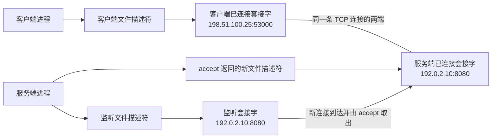

本文从一次客户端连接服务端的过程出发，解释端口、套接字、文件描述符、监听与已建立连接之间的关系，再使用 `ss` 读取 Linux 内核当前保存的套接字状态。目标不是背诵一组命令选项，而是能够根据连接所处阶段预测 `ss` 应该显示什么，并在结果与预期不一致时知道下一步检查哪一层。

本文所说的网络套接字主要指 IP（Internet Protocol，网际协议）套接字，以 TCP（Transmission Control Protocol，传输控制协议）为主线，以 UDP（User Datagram Protocol，用户数据报协议）作必要对照。Unix domain socket（Unix 域套接字，用于同一主机的进程间通信）、raw socket（原始套接字，用于直接访问较低层协议）、完整 TCP 状态机、队列调优、非阻塞输入/输出（input/output，I/O）和事件循环不属于本文主线。

接口、地址和路由见 [[Linux 网络接口、IP 地址、路由与 DNS 基础]]；从实际客户端测试 TCP 路径见 [[TCP 端口连通性测试与 nc 命令基础]]；主机入站规则见 [[Linux 主机防火墙与 UFW 基础]]；SSH（Secure Shell，安全远程访问协议）场景见 [[OpenSSH 密钥登录、服务端配置与排查]]。命令结构和帮助系统见 [[Shell 命令结构、类型与帮助系统]]。

> [!abstract] 本篇掌握目标
> - **必须熟练**：区分端口、监听套接字、已连接套接字、文件描述符、进程与防火墙；能够拆解并阅读 `sudo ss -lntp` 的基础输出。
> - **理解会查**：能够用本地端点与对端端点解释一条 TCP 连接，根据监听或已连接状态选择 `ss` 查询，并使用 `ss --help` 与 `man ss` 核对选项。
> - **认识即可**：UDP 的 `UNCONN`、TCP 关闭阶段、队列数值、systemd 套接字激活和隔离网络视图造成的观察边界；遇到对应问题时再深入。

> [!info] 核对日期与适用范围
> 本文于 **2026-07-28** 核对 Linux man-pages 中的 socket、bind、listen、connect、accept、IP、TCP 与 UDP 接口说明，iproute2 的 `ss(8)` 手册、RFC（Request for Comments，互联网标准文档）9293，以及 systemd 的套接字激活文档。不同内核、iproute2 版本、终端宽度、隔离网络视图和当前用户权限可能改变输出布局或可见信息，应以目标 Linux 主机上的 `man ss` 与实际输出为准。

## 1. 先看一条连接中有哪些对象

假设客户端从 `198.51.100.25:53000` 连接服务端的 `192.0.2.10:8080`。这两个 IP 地址属于文档示例地址，不代表某台真实主机。

在服务端开始监听后、客户端连接成功时，至少存在三类不同对象：

1. 服务端原有的监听套接字，继续等待发往 `192.0.2.10:8080` 的新连接。
2. 服务端为当前客户端保留的已连接套接字，其对端是 `198.51.100.25:53000`。
3. 客户端自己的已连接套接字，其对端是 `192.0.2.10:8080`。



这张图先建立三个核心关系：

- **进程不直接等于套接字**：进程通过文件描述符使用内核中的套接字。
- **监听套接字不等于某条客户端连接**：它负责等待新连接，不负责代表所有已连接客户端。
- **同一个服务端端口可以出现在多条连接中**：每条连接还由不同的客户端地址和端口区分。

`ss` 的工作，就是把当前 Linux 网络视图中这些由内核维护的套接字及其状态读取出来。先理解对象之间的关系，再看 `ss` 输出，字段才不会只是需要背诵的名称。

## 2. 端口、端点与一条 TCP 连接

### 2.1 端口只是协议使用的数字编号

TCP 与 UDP 的报文头都使用 16 位端口号，因此端口号范围是 0 到 65535。端口号需要与协议和地址一起理解，不能把它单独当成一个程序或防火墙上的洞。

端口 0 通常用于请求内核自动选择一个可用端口，不作为客户端事先约定的普通服务端口。在 Linux 中，绑定小于 1024 的端口通常还要求进程具备 `CAP_NET_BIND_SERVICE` 能力；这是本机权限边界，不表示这些端口在网络上天然更开放。本文实验选择大于 1024 的端口，是为了不依赖管理员权限。

同一个数字在不同上下文中可以同时存在：

- TCP 53 与 UDP 53 属于不同传输协议。
- `127.0.0.1:8080` 与 `192.0.2.10:8080` 使用不同本地地址。
- 多条已经建立的 TCP 连接可以共享服务端的 `192.0.2.10:8080`，只要它们的对端不同。

在没有特殊套接字选项时，两个 TCP 监听套接字通常不能同时占用完全相同的本地地址和端口。`SO_REUSEADDR`、`SO_REUSEPORT`、继承和文件描述符传递会改变部分绑定规则，但这些属于后续专题；本文只要求不要把规则简化成“一个端口永远只属于一个进程”。

### 2.2 地址加端口形成 IP 套接字地址

在 IPv4（Internet Protocol version 4，网际协议第 4 版）中，IP 套接字地址由 IPv4 地址和 16 位端口组成。例如：

```text
192.0.2.10:8080
```

它表达“主机本地 IPv4 地址 `192.0.2.10` 上的 TCP 或 UDP 端口 `8080`”，协议仍需由上下文补充。IPv6（Internet Protocol version 6，网际协议第 6 版）也组合地址和端口；为避免把 IPv6 地址中的冒号误认成端口分隔符，常写成 `[IPv6 地址]:端口`。这里的“端点”是对通信一侧的概括，不是一个独立于套接字存在的新程序。

从当前 Linux 主机观察套接字时，`ss` 将两侧写成：

| 名称 | 回答的问题 | 服务端示例 |
| --- | --- | --- |
| 本地端点 | 当前主机这一侧使用什么地址和端口 | `192.0.2.10:8080` |
| 对端端点 | 通信另一侧使用什么地址和端口 | `198.51.100.25:53000` |

“本地”和“对端”取决于在哪里观察。同一条连接如果在客户端运行 `ss`，两列会交换：客户端把 `198.51.100.25:53000` 看成本地端点，把 `192.0.2.10:8080` 看成对端端点。

### 2.3 一条 TCP 连接如何与其他连接区分

一条 TCP 连接通常可以用下面四项区分，称为四元组：

```text
本地 IP、本地端口、对端 IP、对端端口
```

如果还需要与 UDP 等其他传输协议一起比较，可以再加上传输协议，形成常说的五元组。

例如两个客户端同时连接同一个服务端：

| 本地端点 | 对端端点 | 是否为同一条连接 |
| --- | --- | --- |
| `192.0.2.10:8080` | `198.51.100.25:53000` | 第一条连接 |
| `192.0.2.10:8080` | `203.0.113.40:49160` | 第二条连接 |

两行的服务端端口相同，但对端不同，因此内核能够把到达的数据交给正确的连接套接字。

### 2.4 客户端为什么也有端口

客户端调用 `connect()` 时，如果尚未显式绑定本地地址和端口，Linux 通常会根据路由选择本地地址，并从临时端口范围中选择一个可用端口。这个客户端端口让返回数据能够被交回正确的本地套接字。

因此“访问服务端 8080 端口”并不表示数据只有一个端口。一次 TCP 连接同时包含客户端端口和服务端端口，只是服务端端口通常稳定、便于客户端事先知道，而客户端临时端口通常由内核动态选择。

## 3. 套接字、文件描述符与进程

### 3.1 套接字是内核通信对象

程序调用 `socket()` 后，Linux 内核创建一个套接字，并向调用进程返回一个文件描述符（file descriptor，FD）。文件描述符是进程内部使用的非负整数，进程通过它继续执行 `bind()`、`listen()`、`connect()`、`accept()`、读取、写入和关闭等操作。

```text
进程中的文件描述符 3
  -> 引用内核中的某个套接字
  -> 套接字保存协议、地址、状态、队列等运行时信息
```

文件描述符不是端口号：

- 文件描述符只在进程及其文件描述符表的上下文中有意义。
- 端口号属于 TCP、UDP 等传输协议的地址信息。
- 不同进程中的文件描述符 `3` 可以引用完全不同的对象。
- 同一个套接字也可能因为进程继承、复制或传递文件描述符而被多个文件描述符引用。

当相关文件描述符全部关闭后，应用不再持有该套接字；内核仍可能为了完成 TCP 关闭流程短暂保留协议状态，例如 `TIME-WAIT`。所以“进程已经退出”和“所有相关 TCP 状态立即消失”也不是同一个事实。

### 3.2 `ss -p` 展示的是套接字与进程的关联

`ss -p` 的 `Process` 信息可能形如：

```text
users:(("sshd",pid=1234,fd=3))
```

其中：

- `sshd` 是进程名。
- `pid` 是进程标识符（process identifier，PID）。
- `fd` 是该进程中引用当前套接字的文件描述符。

它能帮助定位“哪个进程当前能够使用这个套接字”，但不能单凭进程名推断完整服务配置。普通用户还可能无权读取其他用户进程的完整关联信息，因此没有 `Process` 内容不等于没有套接字。

### 3.3 systemd 为什么可能显示为监听进程

socket activation（套接字激活）是 systemd 服务管理器可以先创建监听套接字、等待连接，再启动服务并向服务传递文件描述符的机制。此时监听入口已经存在，但最终处理应用数据的服务进程可能尚未启动。

这仍符合“进程通过文件描述符使用内核套接字”的模型，只是创建和最初持有监听文件描述符的是 systemd，而不是最终服务。Ubuntu 的 `ssh.socket` 场景中，`ss -p` 因而可能显示 `systemd`；不能只搜索 `sshd` 来判断 SSH 是否监听。

## 4. TCP 服务如何从创建套接字走到连接成立

### 4.1 服务端主线：`socket → bind → listen → accept`

一个典型 TCP 服务端依次完成：

```text
socket()
  -> 创建 TCP 套接字并取得文件描述符
bind()
  -> 为套接字指定本地地址和端口
listen()
  -> 将它标记为被动等待连接的监听套接字
accept()
  -> 从等待队列取得一条连接，返回新的已连接套接字文件描述符
read()/write()
  -> 在新的已连接套接字上收发应用数据
close()
  -> 关闭不再需要的文件描述符
```

`listen()` 还接收等待队列上限（backlog）参数。它与连接拥塞和服务容量有关，但本文只要求知道：已经完成连接建立、尚待应用 `accept()` 取走的连接可以在内核中排队；监听套接字本身仍继续等待新的连接。

### 4.2 客户端主线：`socket → connect`

典型 TCP 客户端依次完成：

```text
socket()
  -> 创建客户端套接字
connect()
  -> 指定服务端地址和端口，尝试建立 TCP 连接
read()/write()
  -> 连接成功后收发应用数据
close()
  -> 关闭文件描述符
```

如果客户端没有提前调用 `bind()`，内核会为它选择适合当前路由的本地地址和临时端口。`connect()` 成功表示 TCP 连接已经建立，不表示对端一定运行预期应用，也不表示后续身份认证一定成功。

### 4.3 `accept()` 不会把监听套接字变成连接套接字

这是理解 `ss` 输出的关键：

- `accept()` 从监听套接字的等待队列取出一条连接。
- 内核创建一个新的已连接套接字。
- `accept()` 返回引用新套接字的新文件描述符。
- 原监听套接字不受影响，继续接受下一条连接。

因此一个服务进程可能同时持有：

```text
一个监听文件描述符
  -> 一个 LISTEN 套接字

多个连接文件描述符
  -> 多个 ESTAB 套接字
```

这也解释了为什么同一个服务端端口既能出现在一条 `LISTEN` 行中，又能出现在多条 `ESTAB` 行中。

### 4.4 初次阅读只需识别少量 TCP 状态

TCP 状态描述的是某个 TCP 套接字或连接当前所处阶段，不是服务整体的健康等级。

| `ss` 常见显示 | 基础含义 | 本阶段如何处理 |
| --- | --- | --- |
| `LISTEN` | 被动等待新的 TCP 连接 | 判断服务是否形成监听入口 |
| `SYN-SENT` | 本地正在主动尝试建立连接 | 短暂状态，持续存在时再排查网络 |
| `SYN-RECV` | 已收到连接请求，握手尚未完全结束 | 认识即可 |
| `ESTAB` | TCP 连接已经建立 | 继续判断应用协议和数据处理 |
| `CLOSE-WAIT` | 对端已关闭，本地应用尚未完全关闭 | 大量长期存在时再检查应用关闭逻辑 |
| `TIME-WAIT` | 连接关闭后由内核暂时保留状态 | 不是监听入口，也不等于服务仍在运行 |

`FIN-WAIT-1`、`FIN-WAIT-2`、`LAST-ACK`、`CLOSING` 等状态属于更完整的 TCP 关闭过程。日常查看时先判断当前问题是“是否监听”“是否正在连接”“是否已经建立”还是“是否正在关闭”，无需一开始背完状态机。

## 5. 绑定地址决定本机哪些入口能够接收连接

同一个端口绑定到不同本地地址，可接收连接的本机入口不同：

| `Local Address:Port` 形态 | 基础含义 |
| --- | --- |
| `127.0.0.1:8080` | 只绑定 IPv4 回环地址；其他主机不能直接连接这个入口 |
| `[::1]:8080` | 只绑定 IPv6 回环地址 |
| `0.0.0.0:22` | 绑定所有本地 IPv4 地址；`0.0.0.0` 不是客户端应连接的目标地址 |
| `[::]:22` | 绑定所有本地 IPv6 地址；是否同时接收 IPv4 取决于系统和套接字设置 |
| `192.0.2.10:22` | 通常只绑定示例中的这个本地地址；实际值应来自当前主机 |
| `*:22` | `ss` 的通配显示形式，需要结合协议族和选项判断具体范围 |

“所有本地地址”只描述套接字的绑定范围，不表示所有外部主机都能到达。一次远程连接至少还依赖：

```text
服务期望配置
  -> 当前监听套接字及绑定地址
  -> 主机防火墙与上游访问控制
  -> 客户端到目标地址和端口的实际网络路径
  -> 应用协议与身份认证
```

因此：

- 配置文件写了端口，不代表服务已经运行。
- 存在监听套接字，不代表 UFW（Uncomplicated Firewall，Ubuntu 常用的主机防火墙前端）或上游网络允许连接。
- 防火墙允许端口，不代表真的有服务监听。
- TCP 连接成功，不代表 SSH 密钥、TLS（Transport Layer Security，传输层安全协议）证书、数据库账号或应用认证成功。

“端口已打开”会把这些层次混在一起。排查时应改成可验证的具体表述，例如“TCP 22 正在 `0.0.0.0` 上监听”“UFW 允许某个来源访问 TCP 22”或“当前客户端已与目标 TCP 22 建立连接”。

## 6. 把概念模型映射到 `ss`

### 6.1 `ss` 读取什么，不改变什么

`ss` 是 Linux 网络工具集 iproute2 提供的套接字调查工具。network namespace（网络命名空间）是一套相对独立的网络接口、路由和套接字视图；`ss` 从当前进程所在的网络命名空间读取套接字信息，能够回答协议、状态、本地端点、对端端点以及可见的进程关联，但不会：

- 启动或停止服务。
- 修改服务期望配置。
- 添加或删除防火墙规则。
- 从远程客户端证明网络路径可达。
- 验证 SSH、Web 或数据库等应用协议。

不带选项的 `ss` 默认显示已打开的非监听套接字；监听套接字默认被省略。因此应先明确问题，再选择选项，而不是把某条长命令当成唯一写法。

> [!warning] `ss` 命令族并非全部只读
> 本文使用的查询选项只读取状态。低频的 `ss -K` 会尝试强制关闭匹配套接字，不属于观察操作；排障时不要把未理解的选项直接加入命令。

### 6.2 按五个维度组成查询

| 维度 | 常用选项或语法 | 回答的问题 |
| --- | --- | --- |
| 状态范围 | `-l`、`-a`、`state established` | 只看监听、查看全部，还是只看某种 TCP 状态 |
| 传输协议 | `-t`、`-u` | 查看 TCP 还是 UDP |
| 地址族 | `-4`、`-6` | 只看 IPv4 还是 IPv6 |
| 显示方式 | `-n`、`-p` | 保留数字地址和端口，是否显示进程关联 |
| 端点过滤 | `sport`、`dport`、地址表达式 | 只保留与已确认端口或地址相关的套接字 |

`-a` 表示同时显示监听和非监听套接字。`-n` 避免把数字端口显示为 `ssh` 等服务名，便于与有效配置逐字比较。`-p` 请求显示使用套接字的进程信息，但结果仍受权限限制。

### 6.3 拆解 `sudo ss -lntp`

```bash
sudo ss -lntp
```

组合短选项也可以写成 `sudo ss -l -n -t -p`：

| 部分 | 含义 | 在这条命令中的作用 |
| --- | --- | --- |
| `sudo` | 以管理员权限运行后面的命令 | 尽量完整读取其他用户进程与套接字的关联；不是 `ss` 选项 |
| `ss` | 查看套接字统计和状态 | 从当前 Linux 网络命名空间读取套接字信息 |
| `-l` | `--listening` | 只显示监听套接字 |
| `-n` | `--numeric` | 保留数字形式，避免端口服务名转换 |
| `-t` | `--tcp` | 只查看 TCP 套接字 |
| `-p` | `--processes` | 请求显示使用套接字的进程信息 |

如果当前只需确认地址、端口和状态，可以先使用不带管理员权限和进程信息的最小查询：

```bash
ss -lnt
```

### 6.4 先区分监听行和连接行

下面是字段形态示例，不是某台主机的实际输出：

```text
State  Recv-Q Send-Q Local Address:Port      Peer Address:Port Process
LISTEN 0      4096   192.0.2.10:8080         0.0.0.0:*       users:(("server",pid=1200,fd=3))
ESTAB  0      0      192.0.2.10:8080         198.51.100.25:53000 users:(("server",pid=1200,fd=4))
```

两行不能混为一条：

- 第一行是监听套接字，没有固定客户端，因此 `Peer Address:Port` 是通配值。
- 第二行是服务端为某个客户端保留的已连接套接字，本地端口仍是 `8080`，但已经有具体对端。
- 两行的文件描述符不同，分别引用监听套接字和连接套接字。

阅读字段时先问：

| 字段 | 先回答什么 |
| --- | --- |
| `State` | 当前是监听、已连接、正在连接还是正在关闭 |
| `Local Address:Port` | 当前主机这一侧使用什么地址和端口 |
| `Peer Address:Port` | 是否已经关联具体对端；监听行通常是通配值 |
| `Process` | 哪个可见进程通过哪个文件描述符引用套接字 |
| `Recv-Q`、`Send-Q` | 当前状态下的接收和发送队列信息；不能脱离状态解释 |

在现代 Linux 的 TCP 监听行中，`Recv-Q` 通常表示已经建立、等待应用 `accept()` 的连接数量，`Send-Q` 通常表示等待队列上限。对已连接套接字，这两列则与尚待应用读取的数据和尚待确认的发送数据有关。它们不是判断“是否监听”的首要字段，也不能把监听行与连接行的数字直接比较。

### 6.5 根据问题选择常用骨架

#### 查看 TCP 监听套接字

```bash
ss -lnt
```

#### 同时查看持有 TCP 监听套接字的进程

```bash
sudo ss -lntp
```

#### 查看所有 TCP 监听与非监听套接字

```bash
ss -ant
```

#### 查看已经建立的 TCP 连接

```bash
ss -tn state established
```

`ss` 输出通常将 established 缩写为 `ESTAB`，而状态过滤语法使用完整关键字 `established`。

#### 只查看本地端口为 22 的 TCP 监听套接字

```bash
sudo ss -lntp 'sport = :22'
```

在 `ss` 过滤表达式中，`sport` 匹配套接字记录的本地端口，`dport` 匹配对端端口。这里的 source 和 destination 是查询记录的两侧，不表示每一个双向 TCP 数据包都永远从本地流向对端。

如果想同时查找某个服务端口在本机出现的监听行、服务端连接行和客户端连接行，可以匹配两侧：

```bash
ss -antp '( sport = :8080 or dport = :8080 )'
```

目标服务使用其他端口时，应先从可信配置取得真实值，而不是为了得到输出就猜端口。复杂过滤表达式用到时再查 `man ss`。

### 6.6 用回环连接观察监听套接字与连接套接字

下面的实验只绑定 IPv4 回环地址 `127.0.0.1`，不会向其他主机开放入口，也不会修改防火墙。它会临时创建一个空目录、启动一个 Python HTTP（Hypertext Transfer Protocol，超文本传输协议）服务，并建立一条本机 TCP 连接。

> [!warning] 实验边界
> 在个人 Linux 学习主机上执行，不要在用途未知的生产主机照抄。开始前确认三个命令都存在，并确认示例端口未被占用；缺少工具时先停止，不在本篇中自动安装软件包。

先在任意终端做只读检查：

```bash
command -V ss
command -V python3
command -V nc
ss -H -lnt 'sport = :18080'
```

`-H` 隐藏标题行。最后一条命令应没有输出；如果已经出现监听行，说明端口 `18080` 被占用，应选择另一个大于 1024 的未占用端口，并在本实验所有命令中一致替换。

在终端 A 启动临时服务：

```bash
(
if ! DEMO_DIR="$(mktemp -d)"; then
  printf '%s\n' '无法创建临时目录，停止实验。' >&2
  exit 1
fi
trap 'cd / && rmdir -- "$DEMO_DIR"' EXIT
cd "$DEMO_DIR" || exit 1
python3 -m http.server 18080 --bind 127.0.0.1
)
```

圆括号创建子 Shell，避免 `cd` 改变原登录 Shell 的目录。临时 HTTP 服务只读取新建的空目录；在终端 A 按 `Ctrl-C` 后，子 Shell 退出，`trap` 先离开临时目录，再使用 `rmdir` 删除这个空目录。`rmdir` 不会递归删除非空目录，若目录中意外出现文件，它会保留现场并报告失败。

保持终端 A 运行，在终端 B 观察监听套接字：

```bash
ss -lntp 'sport = :18080'
```

此时应关注而不是逐字匹配：

- 状态为 `LISTEN`。
- 本地端点为 `127.0.0.1:18080`。
- 对端是通配值，因为监听套接字尚未固定某个客户端。
- 当前用户通常能看到 `python3` 的 PID 和监听文件描述符。

在终端 C 建立连接，执行后不要输入内容，也暂时不要退出：

```bash
nc 127.0.0.1 18080
```

这会建立真实 TCP 连接，但尚未发送完整 HTTP 请求。`nc` 的实现差异与使用边界见 [[TCP 端口连通性测试与 nc 命令基础]]。

回到终端 B，同时查看端口两侧：

```bash
ss -antp '( sport = :18080 or dport = :18080 )'
```

因为客户端和服务端都位于同一个网络命名空间，通常可以同时看到：

1. 一条 `LISTEN` 行，对应 Python 的监听套接字。
2. 一条服务端 `ESTAB` 行，本地端口是 `18080`，对端是客户端临时端口。
3. 一条客户端 `ESTAB` 行，本地端口是临时端口，对端端口是 `18080`。

后两行的本地端点和对端端点互相交换，但它们描述的是同一条 TCP 连接的两端。这一步把“四元组”“观察位置”和“一个监听套接字对应多条连接”落到了实际输出中。

完成观察后，先在终端 C 按 `Ctrl-C` 结束客户端，再在终端 A 按 `Ctrl-C` 结束服务端。最后在终端 B 验证：

```bash
ss -H -lnt 'sport = :18080'
ss -H -ant '( sport = :18080 or dport = :18080 )'
```

第一条命令应不再显示监听套接字。第二条命令可能已经没有输出，也可能暂时出现 `TIME-WAIT` 等关闭阶段；这不表示服务仍在监听。本文不把示例形态写成固定实测结果，应以执行时的 Linux 输出为准。

## 7. 在 SSH 排查中怎样使用

SSH（Secure Shell，安全远程访问协议）场景可以把前面的通用模型落到三个不同事实：

```bash
sudo sshd -T | grep '^port '
sudo ss -lntp
sudo ufw app info OpenSSH
```

1. `sshd -T` 读取 OpenSSH 当前解析后的有效配置，回答“服务期望使用什么端口”。
2. `ss` 读取 Linux 内核当前存在的 TCP 监听套接字，回答“现在实际上在哪里监听”。
3. `ufw app info OpenSSH` 读取 UFW application profile（应用配置描述）声明的协议和端口，回答“该描述包含什么规则目标”。

三者的端口一致，仍只完成了服务端检查。最终还需要从真实客户端连接实际地址和端口，并继续完成 SSH 主机身份和用户身份验证，详见 [[OpenSSH 密钥登录、服务端配置与排查#2. 在服务端准备 sshd]] 与 [[Linux 主机防火墙与 UFW 基础#6. 先比较 SSH 配置、监听状态与 UFW profile]]。

> [!warning] 不要只用 `grep sshd` 判断 SSH 是否监听
> Ubuntu 可以由 `ssh.socket` 先持有监听套接字，进程信息可能显示为 `systemd`。先用有效配置确认端口，再比较 `Local Address:Port` 与 `systemctl status ssh.socket ssh.service`，比只执行 `ss -lntp | grep sshd` 更可靠。

可按以下顺序解释结果：

| 观察结果 | 当前能确认什么 | 下一步 |
| --- | --- | --- |
| 有效配置有端口，`ss` 没有对应监听 | 期望配置尚未形成内核监听入口 | 检查 systemd unit（管理单元）状态、配置校验与日志 |
| `ss` 只显示 `127.0.0.1:22` | SSH 只接受本机 IPv4 回环入口 | 核对 `ListenAddress` 或 socket unit（套接字单元），而不是先改防火墙 |
| `ss` 显示正确监听，客户端仍超时 | 服务端入口存在，但路径仍未证实 | 检查目标地址、路由、虚拟化网络和访问控制 |
| 客户端 TCP 连接成功，SSH 认证失败 | TCP 层已经通过 | 转向主机身份、用户名、密钥和权限 |

## 8. TCP 主线之外需要认识的边界

### 8.1 UDP 套接字没有 TCP 式的监听与接收连接过程

UDP 提供无连接的数据报服务。UDP 服务仍可创建套接字并 `bind()` 到本地地址和端口，但不会通过 TCP 式的 `listen()`、连接握手和 `accept()` 为每个客户端创建连接套接字。

查看 UDP 套接字及进程时可以使用：

```bash
sudo ss -anup
```

UDP 行可能显示 `UNCONN`，表示没有固定的对端关联，不能把它解释为“服务未启动”。UDP 也允许应用调用 `connect()` 设置默认对端并限制接收来源，但这不会执行 TCP 式握手，也不能证明网络可达。

### 8.2 当前观察位置限制了 `ss` 能看见什么

前文提到的 network namespace（网络命名空间）为一组进程提供相对独立的网络接口、路由和套接字视图。`ss` 默认读取当前进程所在网络命名空间中的套接字，因此：

- 宿主机上的 `ss` 不保证列出容器网络命名空间内部的全部套接字。
- 容器内监听、宿主机端口发布和宿主机防火墙是不同事实。
- 在一个命名空间中没有结果，不足以证明其他命名空间也没有套接字。

容器排障需要分别确定“命令在哪里执行”“服务在哪里监听”“端口怎样发布”，本文只建立观察边界，不展开容器网络实现。

### 8.3 队列和完整 TCP 状态机不是初次判断的前置条件

队列持续堆积、大量 `SYN-RECV`、长期 `CLOSE-WAIT` 或异常数量的 `TIME-WAIT` 都可能值得进一步调查，但需要结合服务负载、应用读取与关闭逻辑、内核参数和一段时间内的变化判断。不要仅凭一行瞬时输出修改 backlog、超时或其他内核参数。

初次排障先完成更基础的判断：协议是否正确、是否存在监听、绑定地址是否符合预期、是否关联具体对端、客户端路径是否真实可达。

## 9. 按现象推导下一步，而不是猜“端口是否打开”

| 现象 | 先用本文模型解释 | 下一层检查 |
| --- | --- | --- |
| 配置写了端口但没有 `LISTEN` | 期望配置没有形成监听套接字 | 服务状态、配置校验、日志、端口冲突 |
| 有 `LISTEN`，但绑定在回环地址 | 服务只接受本机入口 | 服务绑定配置 |
| 有正确监听，客户端立即拒绝 | 仍需确认客户端实际目标、地址族和中间设备；不能只凭一句错误定责 | 客户端目标、`nc`、防火墙拒绝策略 |
| 有正确监听，客户端超时 | 监听存在，但包可能没有到达或返回 | 地址、路由、虚拟化网络、防火墙与上游策略 |
| TCP 已连接，应用仍失败 | 已越过监听和 TCP 建连层 | 应用协议、TLS、SSH 主机身份或用户认证 |
| 同一服务端口出现多条 `ESTAB` | 不同对端形成了不同四元组 | 对照每行的对端，不按端口号合并判断 |
| 没有 `Process` 内容 | 可能是权限不足或关联方式不同 | 使用 `sudo` 复查，再结合服务管理器 |
| 服务停止后仍有 `TIME-WAIT` | 关闭阶段由内核暂时保留，不是监听入口 | 确认 `LISTEN` 已消失，通常无需立即干预 |

### 常见误判

#### 有监听行，所以远程一定能连接

不成立。监听只证明当前网络命名空间存在本地接收入口；还要检查客户端使用的目标地址、路由、虚拟化网络、UFW 和上游访问控制。

#### 一个端口只能对应一个套接字

不成立。一个 TCP 监听套接字可以对应多条已连接套接字，它们共享服务端本地端口，但由不同对端区分。TCP 与 UDP 的同号端口也不属于同一个协议入口。

#### `0.0.0.0:8080` 是客户端应连接的地址

不成立。`0.0.0.0` 在监听输出中表示 IPv4 通配绑定；客户端必须选择服务端某个实际可达的地址。

#### `Connection refused` 一定是防火墙拒绝

不一定。没有监听套接字、监听地址或地址族不匹配，以及主机或中间设备主动拒绝，都可能产生明确拒绝。应把客户端现象与服务端监听、绑定地址和规则结合判断。

#### 没有进程信息，所以没有程序使用套接字

不一定。先看协议、状态、本地端点和对端端点；普通用户可能无权读取其他进程关联，systemd 套接字激活也可能让持有者不是预期服务名。

## 10. 查询帮助与完成检查

忘记选项、状态名或过滤语法时，在目标 Linux 主机查询：

```bash
ss --help
man ss
```

完成本文后，应能够自行解释：

- [ ] 端口号为什么不是进程、套接字或防火墙规则。
- [ ] 进程怎样通过文件描述符引用内核套接字。
- [ ] `bind()`、`listen()`、`connect()` 与 `accept()` 分别改变了什么。
- [ ] 为什么监听套接字和已连接套接字必须分开存在。
- [ ] 为什么多个客户端连接可以共享同一个服务端本地端口。
- [ ] `Local Address:Port` 与 `Peer Address:Port` 为什么会随观察主机交换。
- [ ] 客户端临时端口解决什么问题。
- [ ] `127.0.0.1`、`0.0.0.0`、具体地址与 `[::]` 的基础绑定差异。
- [ ] `sudo ss -lntp` 中每一部分的作用，以及为什么没有 `Process` 不等于没有监听。
- [ ] 为什么监听、主机防火墙允许、客户端 TCP 可达和应用认证是不同证据层级。
- [ ] 为什么 systemd 套接字激活和容器网络命名空间不会推翻基础套接字模型。

## 相关笔记

- 网络接口、地址、路由与 DNS：[[Linux 网络接口、IP 地址、路由与 DNS 基础]]
- 客户端 TCP 端口测试：[[TCP 端口连通性测试与 nc 命令基础]]
- 主机防火墙与端口规则：[[Linux 主机防火墙与 UFW 基础]]
- OpenSSH 连接、监听、密钥登录与排查：[[OpenSSH 密钥登录、服务端配置与排查]]
- systemd 服务、socket unit 与日志：[[systemd 服务与日志基础]]
- Tailscale 与传统 SSH：[[使用 Tailscale 访问 Linux 主机]]
- 命令学习路线：[[Linux 命令行学习路线与命令地图]]

## 官方参考资料

以下资料于 **2026-07-28** 核对：

- [Linux man-pages：`socket(2)`](https://man7.org/linux/man-pages/man2/socket.2.html)
- [Linux man-pages：`socket(7)`](https://man7.org/linux/man-pages/man7/socket.7.html)
- [Linux man-pages：`bind(2)`](https://man7.org/linux/man-pages/man2/bind.2.html)
- [Linux man-pages：`listen(2)`](https://man7.org/linux/man-pages/man2/listen.2.html)
- [Linux man-pages：`connect(2)`](https://man7.org/linux/man-pages/man2/connect.2.html)
- [Linux man-pages：`accept(2)`](https://man7.org/linux/man-pages/man2/accept.2.html)
- [Linux man-pages：`ip(7)`](https://man7.org/linux/man-pages/man7/ip.7.html)
- [Linux man-pages：`ipv6(7)`](https://man7.org/linux/man-pages/man7/ipv6.7.html)
- [Linux man-pages：`tcp(7)`](https://man7.org/linux/man-pages/man7/tcp.7.html)
- [Linux man-pages：`udp(7)`](https://man7.org/linux/man-pages/man7/udp.7.html)
- [Linux man-pages：`network_namespaces(7)`](https://man7.org/linux/man-pages/man7/network_namespaces.7.html)
- [iproute2：`ss(8)` 手册](https://man7.org/linux/man-pages/man8/ss.8.html)
- [iproute2 上游源码仓库](https://git.kernel.org/pub/scm/network/iproute2/iproute2.git/)
- [RFC 9293：Transmission Control Protocol](https://www.rfc-editor.org/rfc/rfc9293.html)
- [systemd：`systemd.socket(5)`](https://www.freedesktop.org/software/systemd/man/latest/systemd.socket.html)
