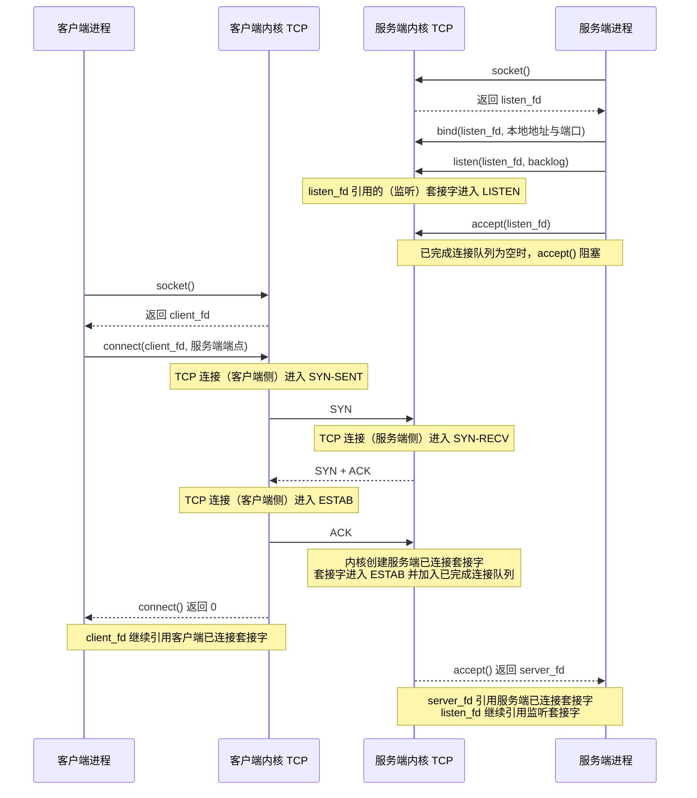
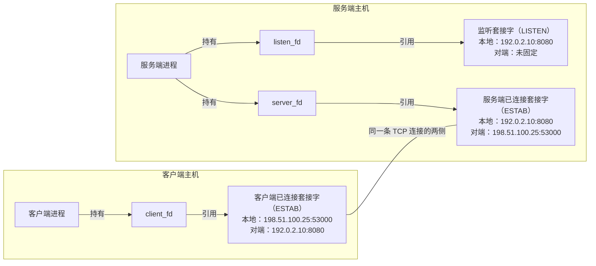

本文说明 Linux 中端口、通信端点、套接字、文件描述符、监听状态与已建立连接之间的关系，并使用 `ss` 读取内核当前保存的套接字状态。内容按端口与通信端点、进程使用套接字的方式、TCP 建连过程、`ss` 输出和回环实验依次展开。

本文以 TCP（Transmission Control Protocol，传输控制协议）为主线，并在最后对照 UDP（User Datagram Protocol，用户数据报协议）的关键差异。Unix domain socket（Unix 域套接字，用于同一主机的进程间通信）、raw socket（原始套接字，用于直接访问较低层协议）、完整 TCP 状态机、队列调优、非阻塞输入/输出（input/output，I/O）和事件循环不属于本文主线。

接口、地址和路由见 [[Linux 网络接口、IP 地址、路由与 DNS 基础]]；从实际客户端测试 TCP 路径见 [[TCP 端口连通性测试与 nc 命令基础]]；主机入站规则见 [[Linux 主机防火墙与 UFW 基础]]；SSH（Secure Shell，安全远程访问协议）场景见 [[OpenSSH 密钥登录、服务端配置与排查]]。命令结构和帮助系统见 [[Shell 命令结构、类型与帮助系统]]。

> [!abstract] 本篇掌握目标
> - **必须熟练**：区分端口、通信端点、监听套接字、已连接套接字、文件描述符、进程与防火墙；能够拆解并阅读 `sudo ss -lntp` 的基础输出。
> - **理解会查**：能够用本地端点与对端端点解释一条 TCP 连接，根据监听或已连接状态选择 `ss` 查询，并使用 `ss --help` 与 `man ss` 核对选项。
> - **认识即可**：UDP 与 TCP 的关键差异、TCP 关闭阶段、队列数值、服务管理器代持监听套接字和隔离网络视图造成的观察边界；遇到对应问题时再深入。

> [!info] 核对日期与适用范围
> 本文于 **2026-07-28** 核对 Linux man-pages 中的 socket、bind、listen、connect、accept、IP、TCP 与 UDP 接口说明，iproute2 的 `ss(8)` 手册、RFC（Request for Comments，互联网标准文档）9293，以及 systemd 的套接字激活文档。不同内核、iproute2 版本、终端宽度、隔离网络视图和当前用户权限可能改变输出布局或可见信息，应以目标 Linux 主机上的 `man ss` 与实际输出为准。

## 1. 地址、端口与通信端点

### 1.1 传输协议端口

IP（Internet Protocol，网际协议）地址表示通信一侧使用的网络地址；TCP 或 UDP 端口则是传输协议头中的 16 位数字编号。两者解决的问题不同：

| 信息 | 基础作用 | 示例 |
| --- | --- | --- |
| 传输协议 | 说明按 TCP 还是 UDP 解释端口和数据 | `TCP` |
| IP 地址 | 表示通信一侧使用的网络地址 | `192.0.2.10` |
| 端口 | 在相应传输协议中区分不同通信入口 | `8080` |

端口号的数值范围是 0 到 65535，但端口号不能脱离协议和地址单独解释。它不是进程编号，也不是防火墙上的实体洞口。

同一个数字可以同时出现在不同上下文中：

- TCP 53 与 UDP 53 属于不同传输协议。
- `127.0.0.1:8080` 与 `192.0.2.10:8080` 使用不同 IP 地址。

端口 0、低端口权限和端口复用属于特殊规则，第 8 节再统一说明。

### 1.2 IP 地址与通信端点

地址与端口组合后，可以描述一次 IP 通信的一侧，本文称之为通信端点。例如：

```text
192.0.2.10:8080
```

这表示“IPv4（Internet Protocol version 4，网际协议第 4 版）地址 `192.0.2.10` 上的端口 `8080`”。它仍需结合 TCP 或 UDP 才能形成完整语义。

IPv6（Internet Protocol version 6，网际协议第 6 版）地址本身包含冒号。为了避免把地址中的冒号误认成端口分隔符，地址和端口通常写成：

```text
[2001:db8::10]:8080
```

这两个地址都属于文档示例地址，不代表某台真实主机。

### 1.3 本地端点与对端端点

一条 TCP 连接有两个通信端点。从某台主机观察时，把当前主机这一侧称为本地端点，把通信另一侧称为对端端点。

| 观察位置 | 本地端点 | 对端端点 |
| --- | --- | --- |
| 服务端 | `192.0.2.10:8080` | `198.51.100.25:53000` |
| 客户端 | `198.51.100.25:53000` | `192.0.2.10:8080` |

两行描述的是同一条连接，只是观察位置相反。因此“本地端口”不永远等于服务端口，“对端端口”也不永远等于客户端端口。

### 1.4 TCP 连接四元组

一条 TCP 连接通常可以用以下四项区分，称为四元组：

```text
本地 IP、本地端口、对端 IP、对端端口
```

如果还要与 UDP 等其他传输协议一起比较，可以再加上传输协议，形成常说的五元组。

例如，两个客户端同时连接同一个服务端：

| 服务端这一侧的本地端点 | 对端端点 | 连接 |
| --- | --- | --- |
| `192.0.2.10:8080` | `198.51.100.25:53000` | 第一条连接 |
| `192.0.2.10:8080` | `203.0.113.40:49160` | 第二条连接 |

两行的服务端端点相同，但对端不同，因此 Linux 仍能区分它们。只看端口 `8080`，不足以唯一标识一条 TCP 连接。

### 1.5 客户端临时端口

客户端发起 TCP 连接时，如果没有提前指定本地地址和端口，Linux 通常会根据路由选择本地地址，并从临时端口范围中选择一个可用端口。这种由内核临时选择的客户端端口称为临时端口（ephemeral port）。

客户端端口让返回数据能够被交回正确的本地连接。因此“访问服务端 8080 端口”不表示一次连接只有一个端口：服务端端口通常稳定，便于客户端事先知道；客户端端口通常由内核动态选择。

一条 TCP 连接包含两个端点；端口只是端点的一部分，四元组才能区分具体连接。

## 2. 进程、文件描述符与套接字

### 2.1 内核套接字

程序运行后形成进程。进程需要进行网络通信时，会通过 `socket()` 系统调用请求 Linux 内核创建套接字。

系统调用（system call）是进程请求内核执行受控操作的接口。套接字创建后位于内核中，用来保存当前通信所需的运行时信息，例如：

- 使用 TCP、UDP 还是其他协议。
- 本地地址和端口。
- 是否关联对端地址和端口。
- 当前连接状态。
- 等待发送或接收的数据。

套接字不是端口号。端口只是套接字可能保存的一项地址信息；套接字本身还包含协议、状态、对端和队列等信息。

### 2.2 文件描述符与套接字引用

`socket()` 创建套接字后，会向调用进程返回一个文件描述符（file descriptor，FD）。文件描述符是该进程文件描述符表中的非负整数，进程以后通过这个数字引用相应套接字。

```text
进程中的文件描述符 3
  -> 引用内核中的某个套接字
  -> 套接字保存协议、端点、状态和等待处理的数据
```

例如，文件描述符 `3` 只表示“当前进程文件描述符表中的第 3 项”，不表示端口 3。另一个进程也可以拥有文件描述符 `3`，但它可能引用完全不同的文件、管道或套接字。

### 2.3 核心对象边界

| 对象 | 位于哪里 | 主要作用 |
| --- | --- | --- |
| 进程 | 用户空间中的运行实例 | 执行业务逻辑并发起系统调用 |
| 文件描述符 | 某个进程的文件描述符表 | 让进程引用一个已经打开的内核对象 |
| 套接字 | Linux 内核 | 保存网络通信的协议、端点、状态和等待处理的数据 |
| 端口 | TCP、UDP 等协议的地址信息 | 与协议和 IP 地址一起描述通信端点 |

基础关系是：

```text
进程 -> 文件描述符 -> 内核套接字
```

这条关系只说明“进程怎样找到套接字”。监听套接字和已连接套接字为什么会同时存在，需要继续看 TCP 服务端与客户端的运行过程。

## 3. TCP 监听与连接建立

### 3.1 TCP 三次握手与两端系统调用时序

下面的时序图使用常见的阻塞式 TCP 客户端与服务端：服务端先完成监听并调用 `accept()`，客户端随后调用 `connect()`。如果此时已完成连接队列为空，`accept()` 会阻塞到连接就绪。

图中进程与本机内核之间的箭头表示系统调用，两个内核之间的箭头表示 TCP 报文；系统调用不会跨主机直接调用对方进程。`SYN-SENT`、`SYN-RECV` 与 `ESTAB` 沿用 `ss` 的状态显示形式，描述当前这条连接所处的阶段；服务端监听套接字在整个建连过程中仍保持 `LISTEN`。客户端文件描述符记为 `client_fd`，服务端监听文件描述符记为 `listen_fd`，`accept()` 返回的服务端连接文件描述符记为 `server_fd`。

`SYN`（synchronize，同步序列号）和 `ACK`（acknowledgment，确认）是 TCP 控制标志；`backlog` 是传给 `listen()` 的等待队列上限参数。图中只展示普通建连主线，不展开同时打开、报文丢失或重传。



图中把 `connect()` 画在 `accept()` 之前返回，只表示一种可能的进程调度结果；两者谁先在用户空间返回，不是跨主机可依赖的顺序保证。需要保留的因果关系是：TCP 握手由两端内核完成；服务端连接完成并进入队列后，阻塞中的 `accept()` 才具备成功返回的条件。

### 3.2 `socket()`、`bind()` 与 `listen()`

客户端和服务端分别调用 `socket()`，在各自主机内核中创建本地套接字并取得文件描述符。这个调用本身不会发送 TCP 报文，也不会形成两端连接。

服务端随后完成：

1. `bind(listen_fd, 本地地址与端口)` 为服务端套接字指定本地地址和端口。
2. `listen(listen_fd, backlog)` 将该套接字标记为被动等待连接的监听套接字。

`listen()` 成功后，`listen_fd` 仍引用同一个套接字，只是该套接字已经进入 `LISTEN`。它建立监听入口和等待队列，不会与某个客户端直接建立连接；队列细节与调优第 8 节再说明。

客户端通常不需要显式调用 `bind()`。它调用 `connect()` 时，内核可以根据路由选择本地地址和临时端口。

### 3.3 `connect()`

`connect(client_fd, 服务端端点)` 在客户端已有套接字上发起主动建连，目标是服务端地址和端口所表示的监听入口。SYN、SYN + ACK 和 ACK 由两端内核交换；`connect()` 不会跨网络调用服务端的 `accept()`。

本文主线使用阻塞式套接字。连接成功建立后，`client_fd` 引用的套接字进入 `ESTAB`，`connect()` 返回 0；它不会返回新的文件描述符，客户端继续使用 `client_fd` 读写数据。

非阻塞套接字的 `connect()` 可能先返回 `EINPROGRESS`，应用随后再查询完成结果。这不会改变 TCP 握手本身，但不属于本文主线。

### 3.4 `accept()`

`listen_fd` 所引用的监听套接字维护等待应用接收的连接队列。`accept(listen_fd)` 只作用于这个监听套接字：

1. 如果没有等待处理的已完成连接，阻塞式 `accept()` 会等待。
2. 连接就绪后，`accept()` 从队列中取出一个连接，返回新的文件描述符 `server_fd`；它引用本次连接对应的服务端已连接套接字。
3. 原监听套接字不受影响，仍保持 `LISTEN` 并继续接收后续连接。

TCP 三次握手可以在服务端进程尚未调用 `accept()` 时由内核完成。`accept()` 不参与握手；它成功返回后，服务端使用 `listen_fd` 接收新连接，使用 `server_fd` 与当前对端读写。后续每成功接收一条连接，都会得到另一个连接文件描述符。

### 3.5 TCP 连接对象图

时序图说明对象在什么时候发生变化；下面的对象图说明连接成立且 `accept()` 返回后，各文件描述符分别引用什么。假设客户端从 `198.51.100.25:53000` 连接服务端的 `192.0.2.10:8080`：



一个服务进程可以同时持有一个监听文件描述符和多个连接文件描述符。监听套接字没有固定对端；多个已连接套接字可以共享相同的服务端本地端点，但它们的对端不同，四元组也就不同。

### 3.6 常见 TCP 状态

TCP 状态描述某个 TCP 套接字或连接当前所处的阶段，不是服务整体的健康等级。

| `ss` 常见显示 | 基础含义 | 初次阅读时怎样使用 |
| --- | --- | --- |
| `LISTEN` | 监听套接字正在被动等待新的 TCP 连接 | 判断服务是否形成监听入口 |
| `SYN-SENT` | 某条本地连接正在主动尝试建立 | 持续存在时再排查网络路径 |
| `SYN-RECV` | 某条入站连接已收到 SYN，握手尚未完成 | 认识即可 |
| `ESTAB` | 某条 TCP 连接已经建立 | 继续判断应用协议和数据处理 |
| `CLOSE-WAIT` | 对端已关闭，本地应用尚未完全关闭 | 大量长期存在时再检查应用关闭逻辑 |
| `TIME-WAIT` | 连接关闭后由内核暂时保留状态 | 不是监听入口，也不等于服务仍在运行 |

`FIN-WAIT-1`、`FIN-WAIT-2`、`LAST-ACK`、`CLOSING` 等属于更完整的 TCP 关闭过程。初次排障先判断当前问题是“是否监听”“是否正在连接”“是否已经建立”还是“是否正在关闭”，无需一开始背完整状态机。

## 4. 绑定地址与本机接收范围

服务端调用 `bind()` 时，不只选择端口，还选择本地地址。同一个端口绑定到不同本地地址，可接收连接的本机入口也不同：

| 本地端点形态 | 基础含义 |
| --- | --- |
| `127.0.0.1:8080` | 只绑定 IPv4 回环地址；其他主机不能直接连接这个入口 |
| `[::1]:8080` | 只绑定 IPv6 回环地址 |
| `0.0.0.0:22` | 绑定所有本地 IPv4 地址；`0.0.0.0` 不是客户端应连接的目标地址 |
| `[::]:22` | 绑定所有本地 IPv6 地址；是否同时接收 IPv4 取决于系统和套接字设置 |
| `192.0.2.10:22` | 通常只绑定示例中的这个本地地址；实际值应来自当前主机 |
| `*:22` | 工具可能使用的通配显示形式，需要结合协议族和选项判断具体范围 |

“绑定所有本地地址”只描述套接字的本机接收范围，不表示所有外部主机都能到达。一次远程连接至少依赖：

```text
服务期望配置
  -> 当前监听套接字及绑定地址
  -> 主机防火墙与上游访问控制
  -> 客户端到目标地址和端口的实际网络路径
  -> 应用协议与身份认证
```

因此：

- 配置文件写了端口，不代表服务已经运行。
- 存在监听套接字，不代表 UFW（Uncomplicated Firewall，Ubuntu 常用的主机防火墙前端）或上游网络允许连接。
- 防火墙允许端口，不代表真的有服务监听。
- TCP 连接成功，不代表 SSH 密钥、TLS（Transport Layer Security，传输层安全协议）证书、数据库账号或应用认证成功。

“端口已打开”会把这些层次混在一起。排查时应改成可验证的具体表述，例如“TCP 22 正在 `0.0.0.0` 上监听”“UFW 允许某个来源访问 TCP 22”或“当前客户端已与目标 TCP 22 建立连接”。

## 5. `ss` 输出与套接字模型

### 5.1 `ss` 的观察范围

`ss` 是 Linux 网络工具集 iproute2 提供的套接字查看工具。它读取当前 Linux 网络视图中的套接字信息，能够回答协议、状态、本地端点、对端端点以及可见的进程关联，但不会：

- 启动或停止服务。
- 修改服务期望配置。
- 添加或删除防火墙规则。
- 从远程客户端证明网络路径可达。
- 验证 SSH、Web 或数据库等应用协议。

不带选项的 `ss` 默认不显示监听套接字。因此使用前应先明确要回答“是否监听”还是“是否已经连接”，再选择查询。

### 5.2 TCP 监听查询：`ss -lnt`

初次检查 TCP 监听入口，先使用不需要管理员权限的最小命令：

```bash
ss -lnt
```

| 选项 | 含义 | 在本命令中的作用 |
| --- | --- | --- |
| `-l` | `--listening` | 只显示监听套接字 |
| `-n` | `--numeric` | 保留数字地址和端口，避免转换为服务名 |
| `-t` | `--tcp` | 只查看 TCP 套接字 |

下面是一条字段形态示例，不是某台主机的实际输出：

```text
State  Recv-Q Send-Q Local Address:Port  Peer Address:Port
LISTEN 0      4096   192.0.2.10:8080     0.0.0.0:*
```

先只阅读三个核心字段：

- `State` 是 `LISTEN`，说明这是监听套接字。
- `Local Address:Port` 是本地绑定端点。
- `Peer Address:Port` 是通配值，因为监听套接字尚未固定某个客户端。

`Recv-Q` 与 `Send-Q` 的含义会随监听和已连接状态变化，不是初次判断“是否监听”的首要字段，第 8 节再解释。

### 5.3 TCP 已建立连接查询

要同时查看 TCP 监听与非监听套接字，可以使用：

```bash
ss -ant
```

其中 `-a` 表示显示监听和非监听套接字。只查看已经建立的 TCP 连接，可以使用：

```bash
ss -tn state established
```

`ss` 输出通常把 established 缩写为 `ESTAB`，状态过滤语法则使用完整关键字 `established`。

下面是一条服务端已连接套接字的字段示例：

```text
State Recv-Q Send-Q Local Address:Port  Peer Address:Port
ESTAB 0      0      192.0.2.10:8080     198.51.100.25:53000
```

它与上一节的监听行不是同一个套接字：

- `ESTAB` 表示 TCP 连接已经建立。
- 本地端点仍使用服务端端口 `8080`。
- 对端已经是某个具体客户端。
- 另一位客户端会形成另一行，并由不同四元组区分。

### 5.4 进程与文件描述符信息

已经确认监听存在后，如果还要查找哪个可见进程持有套接字，可以增加 `-p`：

```bash
sudo ss -lntp
```

完整拆解如下：

| 部分 | 含义 | 在这条命令中的作用 |
| --- | --- | --- |
| `sudo` | 以管理员权限运行后面的命令 | 尽量完整读取其他用户进程与套接字的关联；不是 `ss` 选项 |
| `ss` | 查看套接字状态 | 读取当前 Linux 网络视图中的套接字信息 |
| `-l` | `--listening` | 只显示监听套接字 |
| `-n` | `--numeric` | 保留数字形式 |
| `-t` | `--tcp` | 只查看 TCP |
| `-p` | `--processes` | 请求显示使用套接字的进程信息 |

`Process` 信息可能形如：

```text
users:(("sshd",pid=1234,fd=3))
```

其中：

- `sshd` 是进程名。
- `pid` 是进程标识符（process identifier，PID）。
- `fd` 是该进程中引用当前套接字的文件描述符。

这正是第 2 节“进程 → 文件描述符 → 套接字”关系在 `ss` 输出中的映射。普通用户可能无权读取其他用户进程的完整关联，因此没有 `Process` 内容不等于没有套接字。

### 5.5 端点过滤表达式

只查看本地端口为 22 的 TCP 监听套接字：

```bash
sudo ss -lntp 'sport = :22'
```

在 `ss` 过滤表达式中：

- `sport` 匹配套接字记录的本地端口。
- `dport` 匹配套接字记录的对端端口。

这里的 source（源）和 destination（目的）是当前套接字记录的两侧，不表示每一个双向 TCP 数据包永远从本地流向对端。

如果要查找某个服务端口在本机出现的监听行、服务端连接行和客户端连接行，可以同时匹配两侧：

```bash
ss -antp '( sport = :8080 or dport = :8080 )'
```

目标服务使用其他端口时，应先从可信配置取得真实值，而不是为了得到输出就猜端口。复杂过滤表达式用到时再查 `man ss`。

### 5.6 `ss` 查询维度

在已经看过具体命令和输出后，可以把 `ss` 查询归纳为：

| 维度 | 常用选项或语法 | 回答的问题 |
| --- | --- | --- |
| 状态范围 | `-l`、`-a`、`state established` | 只看监听、查看全部，还是只看某种 TCP 状态 |
| 传输协议 | `-t`、`-u` | 查看 TCP 还是 UDP |
| 地址族 | `-4`、`-6` | 只看 IPv4 还是 IPv6 |
| 显示方式 | `-n`、`-p` | 是否保留数字形式，是否请求进程关联 |
| 端点过滤 | `sport`、`dport`、地址表达式 | 只保留与已确认端口或地址相关的记录 |

这张表是对查询方法的总结，不需要把所有选项一次加入同一条命令。先使用能回答当前问题的最小查询，再逐步增加范围或信息。

## 6. 回环实验与分层排障

### 6.1 实验预期

下面的实验只绑定 IPv4 回环地址 `127.0.0.1`，不会向其他主机开放入口，也不会修改防火墙。它会临时创建一个空目录、启动 Python HTTP（Hypertext Transfer Protocol，超文本传输协议）服务，并建立一条本机 TCP 连接。

执行命令前，先根据前文模型预测：

| 阶段 | 应关注的结果 |
| --- | --- |
| 服务尚未启动 | 端口 `18080` 没有 `LISTEN` |
| 服务已经启动 | 出现一条绑定 `127.0.0.1:18080` 的 `LISTEN` |
| 客户端保持连接 | 一条 `LISTEN`，以及连接两侧各一条 `ESTAB` |
| 客户端和服务端退出 | `LISTEN` 消失；关闭阶段可能暂时保留 `TIME-WAIT` |

> [!warning] 实验边界
> 在个人 Linux 学习主机上执行，不要在用途未知的生产主机照抄。开始前确认三个命令都存在，并确认示例端口未被占用；缺少工具时先停止，不在本篇中自动安装软件包。

### 6.2 工具与端口检查

在任意终端执行只读检查：

```bash
command -V ss
command -V python3
command -V nc
ss -H -lnt 'sport = :18080'
```

`-H` 隐藏标题行。最后一条命令应没有输出；如果已经出现监听行，说明端口 `18080` 被占用，应选择另一个大于 1024 的未占用端口，并在本实验所有命令中一致替换。

### 6.3 监听套接字观察

在终端 A 启动临时服务：

```bash
(
if ! DEMO_DIR="$(mktemp -d)"; then
  printf '%s\n' '无法创建临时目录，停止实验。' >&2
  exit 1
fi
trap 'cd / && rmdir -- "$DEMO_DIR"' EXIT
cd "$DEMO_DIR" || exit 1
python3 -m http.server 18080 --bind 127.0.0.1
)
```

圆括号创建子 Shell，避免 `cd` 改变原登录 Shell 的目录。临时 HTTP 服务只读取新建的空目录；在终端 A 按 `Ctrl-C` 后，`trap` 会先离开临时目录，再使用 `rmdir` 删除它。`rmdir` 不会递归删除非空目录；若目录中意外出现文件，它会保留现场并报告失败。

保持终端 A 运行，在终端 B 查询：

```bash
ss -lntp 'sport = :18080'
```

此时应关注而不是逐字匹配：

- 状态是 `LISTEN`。
- 本地端点是 `127.0.0.1:18080`。
- 对端是通配值，因为监听套接字没有固定客户端。
- 当前用户通常能看到 `python3` 的 PID 和监听文件描述符。

### 6.4 已连接套接字观察

在终端 C 建立连接，执行后不要输入内容，也暂时不要退出：

```bash
nc 127.0.0.1 18080
```

这会建立真实 TCP 连接，但尚未发送完整 HTTP 请求。`nc` 的实现差异与使用边界见 [[TCP 端口连通性测试与 nc 命令基础]]。

回到终端 B，同时查看端口两侧：

```bash
ss -antp '( sport = :18080 or dport = :18080 )'
```

由于客户端和服务端都运行在同一台 Linux 主机的同一网络环境中，通常可以同时看到：

1. 一条 `LISTEN`，对应 Python 的监听套接字。
2. 一条服务端 `ESTAB`，本地端口是 `18080`，对端是客户端临时端口。
3. 一条客户端 `ESTAB`，本地端口是临时端口，对端端口是 `18080`。

后两行的本地端点和对端端点互相交换，但它们描述的是同一条 TCP 连接的两侧。这一步把四元组、观察位置和“监听套接字不会被已连接套接字替换”落到了实际输出中。

### 6.5 实验清理与关闭状态

完成观察后，先在终端 C 按 `Ctrl-C` 结束客户端，再在终端 A 按 `Ctrl-C` 结束服务端。最后在终端 B 验证：

```bash
ss -H -lnt 'sport = :18080'
ss -H -ant '( sport = :18080 or dport = :18080 )'
```

第一条命令应不再显示监听套接字。第二条命令可能已经没有输出，也可能暂时出现 `TIME-WAIT` 等关闭阶段；这不表示服务仍在监听。本文给出的是预期观察方法，不是已经替读者执行的实测记录，应以实际 Linux 输出为准。

### 6.6 现象与排查方向

| 现象 | 先用本文模型解释 | 下一层检查 |
| --- | --- | --- |
| 配置写了端口但没有 `LISTEN` | 期望配置没有形成监听套接字 | 服务状态、配置校验、日志、端口冲突 |
| 有 `LISTEN`，但绑定在回环地址 | 服务只接受本机入口 | 服务绑定配置 |
| 有正确监听，客户端立即收到明确拒绝 | 仍需确认客户端实际目标、地址族和中间设备，不能只凭一句错误定责 | 客户端目标、`nc`、防火墙拒绝策略 |
| 有正确监听，客户端超时 | 监听存在，但数据包可能没有到达或返回 | 地址、路由、虚拟化网络、防火墙与上游策略 |
| TCP 已连接，应用仍失败 | 已越过监听和 TCP 建连层 | 应用协议、TLS、SSH 主机身份或用户认证 |
| 同一服务端口出现多条 `ESTAB` | 不同对端形成了不同四元组 | 对照每行的对端，不按端口号合并判断 |
| 没有 `Process` 内容 | 可能是权限不足或关联方式不同 | 使用 `sudo` 复查，再结合服务管理器 |
| 服务停止后仍有 `TIME-WAIT` | 关闭阶段由内核暂时保留，不是监听入口 | 确认 `LISTEN` 已消失，通常无需立即干预 |

### 6.7 常见误判

#### 监听与远程可达

不成立。监听只证明命令所在网络视图中存在本地接收入口；还要检查客户端使用的目标地址、路由、虚拟化网络、UFW 和上游访问控制。

#### 端口与套接字数量

不成立。一个 TCP 监听套接字可以对应多条已连接套接字，它们共享服务端本地端口，但由不同对端区分。TCP 与 UDP 的同号端口也不属于同一个协议入口。

#### IPv4 通配绑定地址 `0.0.0.0`

不成立。`0.0.0.0` 在监听输出中表示 IPv4 通配绑定；客户端必须选择服务端某个实际可达的地址。

#### 明确拒绝与防火墙

不一定。没有监听套接字、监听地址或地址族不匹配，以及主机或中间设备主动拒绝，都可能产生明确拒绝。应把客户端现象与服务端监听、绑定地址和规则结合判断。

#### 套接字进程信息缺失

不一定。先看协议、状态、本地端点和对端端点；普通用户可能无权读取其他进程关联，服务管理器也可能先于应用持有监听套接字。

## 7. SSH 监听排查

### 7.1 SSH 配置、监听与防火墙

SSH 场景可以把前面的通用模型落到三个不同事实：

```bash
sudo sshd -T | grep '^port '
sudo ss -lntp
sudo ufw app info OpenSSH
```

1. `sshd -T` 读取 OpenSSH 当前解析后的有效配置，回答“服务期望使用什么端口”。
2. `ss` 读取 Linux 内核当前存在的 TCP 监听套接字，回答“现在实际上在哪里监听”。
3. `ufw app info OpenSSH` 读取 UFW application profile（应用配置描述）声明的协议和端口，回答“该描述包含什么规则目标”。

三者的端口一致，仍只完成了服务端检查。最终还需要从真实客户端连接实际地址和端口，并继续完成 SSH 主机身份和用户身份验证，详见 [[OpenSSH 密钥登录、服务端配置与排查#2. 在服务端准备 sshd]] 与 [[Linux 主机防火墙与 UFW 基础#6. 先比较 SSH 配置、监听状态与 UFW profile]]。

### 7.2 systemd 套接字激活

套接字激活（socket activation）是 systemd 服务管理器可以先创建监听套接字、等待连接，再启动服务并向服务传递文件描述符的机制。此时监听入口已经存在，但最终处理应用数据的服务进程可能尚未启动。

这没有推翻基础模型：仍然是某个进程通过文件描述符引用内核套接字，只是创建和最初持有监听文件描述符的进程可能是 systemd，而不是最终的 `sshd`。Ubuntu 的 `ssh.socket` 场景中，`ss -p` 因而可能显示 `systemd`。

> [!warning] 不要只用 `grep sshd` 判断 SSH 是否监听
> 先从有效配置确认期望端口，再比较 `Local Address:Port` 与 `systemctl status ssh.socket ssh.service`。这比只执行 `ss -lntp | grep sshd` 更可靠。

### 7.3 差异判断与后续检查

| 观察结果 | 当前能确认什么 | 下一步 |
| --- | --- | --- |
| 有效配置有端口，`ss` 没有对应监听 | 期望配置尚未形成内核监听入口 | 检查 systemd unit（管理单元）状态、配置校验与日志 |
| `ss` 只显示 `127.0.0.1:22` | SSH 只接受本机 IPv4 回环入口 | 核对 `ListenAddress` 或 socket unit（套接字单元），而不是先改防火墙 |
| `ss` 显示正确监听，客户端仍超时 | 服务端入口存在，但路径仍未证实 | 检查目标地址、路由、虚拟化网络和访问控制 |
| 客户端 TCP 连接成功，SSH 认证失败 | TCP 层已经通过 | 转向主机身份、用户名、密钥和权限 |

## 8. TCP 主线之外的边界与例外

### 8.1 UDP 套接字

UDP 提供无连接的数据报服务。UDP 服务仍可创建套接字并 `bind()` 到本地地址和端口，但不会通过 TCP 式的 `listen()`、连接握手和 `accept()` 为每个客户端创建连接套接字。

查看 UDP 套接字及进程时可以使用：

```bash
sudo ss -anup
```

UDP 行可能显示 `UNCONN`，表示没有固定的对端关联，不能把它解释为“服务未启动”。UDP 也允许应用调用 `connect()` 设置默认对端并限制接收来源，但这不会执行 TCP 式握手，也不能证明网络可达。

### 8.2 网络命名空间与观察范围

网络命名空间（network namespace）为一组进程提供相对独立的网络接口、路由和套接字视图。`ss` 默认读取当前进程所在网络命名空间中的套接字，因此：

- 宿主机上的 `ss` 不保证列出容器网络命名空间内部的全部套接字。
- 容器内监听、宿主机端口发布和宿主机防火墙是不同事实。
- 在一个网络命名空间中没有结果，不足以证明其他网络命名空间也没有套接字。

容器排障需要分别确定“命令在哪里执行”“服务在哪里监听”“端口怎样发布”，本文只建立观察边界，不展开容器网络实现。

### 8.3 套接字队列

在现代 Linux 的 TCP 监听行中，`Recv-Q` 通常表示已经建立、等待应用 `accept()` 的连接数量，`Send-Q` 通常表示等待队列上限。`listen()` 的 `backlog` 参数与这个等待范围有关。

对已连接 TCP 套接字，`Recv-Q` 与 `Send-Q` 则分别关联尚待应用读取的数据和尚待确认的发送数据。因此：

- 不能把监听行和连接行的队列数字直接比较。
- 队列持续堆积需要结合服务负载、应用读取行为和一段时间内的变化判断。
- 不应只凭一行瞬时输出修改 `backlog`、超时或其他内核参数。

大量 `SYN-RECV`、长期 `CLOSE-WAIT` 或异常数量的 `TIME-WAIT` 也需要结合完整 TCP 状态机和应用行为继续调查，不是初次判断监听入口的前置条件。

### 8.4 端口与文件描述符的特殊规则

理解基础模型后，再认识这些不会改变主线的例外：

- 端口 0 通常用于请求内核自动选择可用端口，不作为客户端事先约定的普通服务端口。
- 在 Linux 中，绑定小于 1024 的端口通常要求进程具备 `CAP_NET_BIND_SERVICE` 能力；这是本机权限边界，不表示这些端口在网络上天然更开放。
- 在没有特殊套接字选项时，两个 TCP 监听套接字通常不能同时占用完全相同的本地地址和端口。
- `SO_REUSEADDR`、`SO_REUSEPORT`、继承和文件描述符传递会改变部分绑定或持有关系，不能把规则简化成“一个端口永远只属于一个进程”。
- 同一个套接字可能因复制、继承或传递而被多个文件描述符引用；相关引用全部关闭后，应用才不再持有它。
- 应用关闭后，内核仍可能为完成 TCP 关闭流程暂时保留 `TIME-WAIT`，所以“进程已经退出”和“所有 TCP 状态立即消失”不是同一事实。

本文实验选择大于 1024 的端口，就是为了避开低端口权限要求。

### 8.5 `ss -K` 的副作用

本文使用的 `ss` 命令只读取状态。低频的 `ss -K` 会尝试强制关闭匹配套接字，具有实际副作用，不属于排障观察操作。不要把未理解的选项直接加入查询命令。

## 9. 帮助查询与完成检查

忘记选项、状态名或过滤语法时，在目标 Linux 主机查询：

```bash
ss --help
man ss
```

完成本文后，应能够按以下顺序自行解释：

- [ ] IP 地址、端口、端点和四元组分别解决什么问题。
- [ ] 客户端为什么通常还需要一个临时端口。
- [ ] 套接字为什么不是端口号。
- [ ] 进程怎样通过文件描述符引用内核套接字。
- [ ] `bind()`、`listen()`、`connect()` 与 `accept()` 分别改变了什么。
- [ ] 为什么监听套接字和已连接套接字必须分开存在。
- [ ] 为什么多个客户端连接可以共享同一个服务端本地端口。
- [ ] `127.0.0.1`、`0.0.0.0`、具体地址与 `[::]` 的基础绑定差异。
- [ ] 怎样分别阅读 `LISTEN` 和 `ESTAB` 行的本地端点与对端端点。
- [ ] `sudo ss -lntp` 中每一部分的作用，以及为什么没有 `Process` 不等于没有监听。
- [ ] 为什么监听、主机防火墙允许、客户端 TCP 可达和应用认证是不同证据层级。
- [ ] 为什么 systemd 套接字激活、UDP 和网络命名空间不会推翻基础 TCP 套接字模型。

## 相关笔记

- 网络接口、地址、路由与 DNS：[[Linux 网络接口、IP 地址、路由与 DNS 基础]]
- 客户端 TCP 端口测试：[[TCP 端口连通性测试与 nc 命令基础]]
- 主机防火墙与端口规则：[[Linux 主机防火墙与 UFW 基础]]
- OpenSSH 连接、监听、密钥登录与排查：[[OpenSSH 密钥登录、服务端配置与排查]]
- systemd 服务、socket unit 与日志：[[systemd 服务与日志基础]]
- Tailscale 与传统 SSH：[[使用 Tailscale 访问 Linux 主机]]
- 命令学习路线：[[Linux 命令行学习路线与命令地图]]

## 官方参考资料

以下资料于 **2026-07-28** 核对：

- [Linux man-pages：`socket(2)`](https://man7.org/linux/man-pages/man2/socket.2.html)
- [Linux man-pages：`socket(7)`](https://man7.org/linux/man-pages/man7/socket.7.html)
- [Linux man-pages：`bind(2)`](https://man7.org/linux/man-pages/man2/bind.2.html)
- [Linux man-pages：`listen(2)`](https://man7.org/linux/man-pages/man2/listen.2.html)
- [Linux man-pages：`connect(2)`](https://man7.org/linux/man-pages/man2/connect.2.html)
- [Linux man-pages：`accept(2)`](https://man7.org/linux/man-pages/man2/accept.2.html)
- [Linux man-pages：`ip(7)`](https://man7.org/linux/man-pages/man7/ip.7.html)
- [Linux man-pages：`ipv6(7)`](https://man7.org/linux/man-pages/man7/ipv6.7.html)
- [Linux man-pages：`tcp(7)`](https://man7.org/linux/man-pages/man7/tcp.7.html)
- [Linux man-pages：`udp(7)`](https://man7.org/linux/man-pages/man7/udp.7.html)
- [Linux man-pages：`network_namespaces(7)`](https://man7.org/linux/man-pages/man7/network_namespaces.7.html)
- [iproute2：`ss(8)` 手册](https://man7.org/linux/man-pages/man8/ss.8.html)
- [iproute2 上游源码仓库](https://git.kernel.org/pub/scm/network/iproute2/iproute2.git/)
- [RFC 9293：Transmission Control Protocol](https://www.rfc-editor.org/rfc/rfc9293.html)
- [systemd：`systemd.socket(5)`](https://www.freedesktop.org/software/systemd/man/latest/systemd.socket.html)
