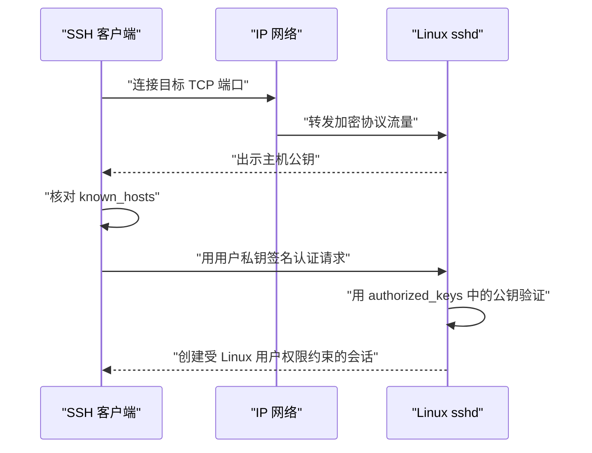

SSH 是一套加密的远程访问协议。OpenSSH 通常由客户端 `ssh` 和服务端 `sshd` 配合工作：客户端验证主机身份，再证明自己有权以某个 Linux 用户登录，最后获得受该用户权限约束的远程 Shell。

本篇以传统 OpenSSH 公钥登录为主线，适用于局域网、虚拟机、Tailscale 覆盖网络和互联网主机。网络路径可以不同，但客户端、`sshd`、主机密钥、用户密钥和 Linux 权限的核心关系不变。

> [!info] 核对日期
> 本文于 **2026-07-17** 核对 Ubuntu Server 与 OpenBSD OpenSSH 手册。修改认证策略前，应以目标主机上的 `man sshd_config` 和 `sshd -T` 为最终依据。

## 1. 一次 SSH 登录发生了什么



网络层只负责让双方可达，不替代 SSH 身份验证。即使客户端和虚拟机运行在同一台物理宿主机内，这仍是完整的客户端—服务端流程。

## 2. 分清主机身份与用户身份

| 身份 | 证明什么 | 私密材料保存位置 | 公共材料或信任记录 |
| --- | --- | --- | --- |
| SSH 主机身份 | 服务端确实是预期主机 | 服务端 `/etc/ssh/ssh_host_*_key` | 主机公钥、客户端 `~/.ssh/known_hosts` |
| SSH 用户身份 | 客户端有权以某个 Linux 用户登录 | 客户端用户私钥 | 客户端 `.pub` 公钥、服务端 `~/.ssh/authorized_keys` |

`fingerprint` 是公钥的短摘要，用于人工比较。主机指纹证明“连到谁”，用户密钥证明“谁在登录”，两者不能互相替代。

> [!danger] 私钥不离开其客户端
> 只向服务端传输 `.pub` 公钥。不要把私钥放进 Git、笔记、聊天、共享目录或服务端家目录，也不要使用 `sudo ssh-keygen` 为普通客户端用户创建密钥。

## 3. 在服务端准备 sshd

**执行位置：Ubuntu Server（控制台，任意目录）**

```bash
sudo apt update
sudo apt install openssh-server
sudo sshd -t
sudo systemctl enable --now ssh.service
systemctl status ssh.service --no-pager
sudo ss -lntp | grep sshd
```

预期 `sshd -t` 无输出且退出码为 0，`ssh.service` 为 `active`，并存在监听端口。若尚未建立远程入口，不要在只有 SSH 会话时停止该服务。

服务端查看当前有效配置：

**执行位置：Ubuntu Server（控制台，任意目录）**

```bash
sudo sshd -T | grep -E '^(port|listenaddress|pubkeyauthentication|passwordauthentication|kbdinteractiveauthentication|permitrootlogin) '
```

`sshd -T` 比只阅读某一个配置文件可靠，因为 Ubuntu 可能通过 `Include` 加载 `/etc/ssh/sshd_config.d/*.conf`。

## 4. 取得地址并验证端口

在服务端读取当前地址，不把一次 DHCP 地址当作永久事实。网络接口、地址前缀和默认路由的读取方法见 [[Linux 网络接口、IP 地址、路由与 DNS 基础]]。

**执行位置：Linux 服务端（控制台，任意目录）**

```bash
hostnamectl --static
ip -brief address
ip route
```

从客户端输入目标地址并测试：

**执行位置：SSH 客户端（任意目录）**

```bash
printf '请输入 Linux 主机当前可达的地址或名称：'
IFS= read -r SSH_HOST
nc -vz "$SSH_HOST" 22
```

如果服务端不是 22 端口，应从可信配置中取得实际端口，并在 `nc` 与 `ssh -p` 中显式指定。超时通常指向网络、路由或防火墙；立即拒绝通常表示地址可达但该端口没有进程监听。

## 5. 首次连接前独立核对主机指纹

从服务端控制台读取 Ed25519 主机公钥指纹：

**执行位置：Linux 服务端（控制台，任意目录）**

```bash
sudo ssh-keygen -lf /etc/ssh/ssh_host_ed25519_key.pub
```

再从客户端发起首次连接：

**执行位置：SSH 客户端（任意目录）**

```bash
printf '请输入 Linux 登录用户名：'
IFS= read -r SSH_USER
printf '请输入 Linux 主机当前可达的地址或名称：'
IFS= read -r SSH_HOST
ssh "$SSH_USER@$SSH_HOST"
```

客户端显示的指纹必须与控制台结果一致，核对后才接受。接受的主机公钥会写入客户端 `~/.ssh/known_hosts`。

`ssh-keyscan` 只能收集网络响应者提供的公钥，不能独立证明响应者身份，因此不能代替通过控制台或其他可信通道比较指纹。

## 6. 创建独立的用户密钥

先选择用途明确的路径并避免覆盖：

**执行位置：SSH 客户端（任意目录）**

```bash
KEY_PATH="$HOME/.ssh/id_ed25519_linux_host"
mkdir -p "$HOME/.ssh"
chmod 700 "$HOME/.ssh"

if test -e "$KEY_PATH" || test -e "$KEY_PATH.pub"; then
  printf '停止：密钥路径已存在，请先确认用途并选择新文件名：%s\n' "$KEY_PATH" >&2
  exit 1
fi

ssh-keygen -t ed25519 -a 64 -f "$KEY_PATH" -C 'linux-host-access'
chmod 600 "$KEY_PATH"
chmod 644 "$KEY_PATH.pub"
ssh-keygen -lf "$KEY_PATH.pub"
```

建议为私钥设置口令。`-a 64` 增加私钥口令派生轮次；服务端仍只接收公钥。

## 7. 将公钥加入 authorized_keys

下面只通过标准输入发送公钥，并让远端以严格权限创建目录：

**执行位置：SSH 客户端（任意目录）**

```bash
KEY_PATH="$HOME/.ssh/id_ed25519_linux_host"
printf '请输入 Linux 登录用户名：'
IFS= read -r SSH_USER
printf '请输入 Linux 主机当前可达的地址或名称：'
IFS= read -r SSH_HOST

cat "$KEY_PATH.pub" | ssh "$SSH_USER@$SSH_HOST" \
  'umask 077; mkdir -p "$HOME/.ssh"; cat >> "$HOME/.ssh/authorized_keys"'
```

这一步需要密码或其他已经可用的认证方式。随后在服务端核对：

**执行位置：Linux 服务端（当前登录用户家目录）**

```bash
chmod 700 "$HOME/.ssh"
chmod 600 "$HOME/.ssh/authorized_keys"
stat -c 'mode=%A owner=%U group=%G path=%n' \
  "$HOME/.ssh" "$HOME/.ssh/authorized_keys"
```

如果误追加重复公钥，先备份 `authorized_keys`，再只删除能确认重复的完整行。不要删除用途未知、可能仍被其他客户端使用的公钥。

## 8. 用新会话验证密钥

保留当前可用会话，另开客户端终端：

**执行位置：SSH 客户端（新终端，任意目录）**

```bash
KEY_PATH="$HOME/.ssh/id_ed25519_linux_host"
printf '请输入 Linux 登录用户名：'
IFS= read -r SSH_USER
printf '请输入 Linux 主机当前可达的地址或名称：'
IFS= read -r SSH_HOST

ssh -o IdentitiesOnly=yes -i "$KEY_PATH" "$SSH_USER@$SSH_HOST"
```

登录后验证身份和连接：

**执行位置：Linux 服务端（新 SSH 会话）**

```bash
whoami
id
hostnamectl --static
printf 'SSH_CONNECTION=%s\n' "$SSH_CONNECTION"
pwd
```

只有新的独立会话成功，才能认为密钥登录可用。

## 9. 使用客户端 ~/.ssh/config

客户端配置把动态地址、用户名和密钥路径集中在一个别名下。以下是结构示例，`HostName` 和 `User` 必须替换为实际值：

```sshconfig
Host linux-host
    HostName linux-host.example.internal
    User linux-user
    IdentityFile ~/.ssh/id_ed25519_linux_host
    IdentitiesOnly yes
    ServerAliveInterval 30
    ServerAliveCountMax 3
```

保存到客户端 `~/.ssh/config` 后：

**执行位置：SSH 客户端（任意目录）**

```bash
chmod 700 "$HOME/.ssh"
chmod 600 "$HOME/.ssh/config"
ssh -G linux-host | grep -E '^(hostname|user|identityfile|identitiesonly) '
ssh linux-host
```

`ssh -G` 显示合并后的客户端配置，适合排查多个 `Host` 块、通配符和 `Include` 的优先级。别名稳定而地址可变时，只需更新 `HostName`。

## 10. Fail-closed 收紧服务端认证

只有满足以下条件后，才考虑关闭密码登录：

- 控制台仍可用。
- 至少两个独立的新密钥会话已经成功。
- 已确认正确 Linux 用户拥有可用公钥。
- 当前旧会话保持打开。

以下脚本使用独立配置片段，先备份，再校验语法与有效值；任一步失败都会恢复原状态：

**执行位置：Linux 服务端（已验证的 SSH 会话）**

```bash
config_file=/etc/ssh/sshd_config.d/00-local-hardening.conf
backup_file="${config_file}.before-hardening"
candidate_file="$(mktemp)"
had_original=no
change_ok=no

cleanup() {
  rm -f -- "$candidate_file"
}
trap cleanup EXIT

if sudo test -e "$backup_file"; then
  printf '停止：固定备份已存在，请先核对：%s\n' "$backup_file" >&2
  exit 1
fi

if sudo test -e "$config_file"; then
  sudo cp -a -- "$config_file" "$backup_file"
  had_original=yes
fi

cat >"$candidate_file" <<'EOF'
PubkeyAuthentication yes
PasswordAuthentication no
KbdInteractiveAuthentication no
PermitRootLogin no
EOF

restore_original() {
  if test "$had_original" = yes; then
    sudo cp -a -- "$backup_file" "$config_file"
  else
    sudo rm -f -- "$config_file"
  fi
}

if sudo install -o root -g root -m 0644 "$candidate_file" "$config_file" &&
   sudo sshd -t &&
   sudo sshd -T | grep -qxF 'pubkeyauthentication yes' &&
   sudo sshd -T | grep -qxF 'passwordauthentication no' &&
   sudo sshd -T | grep -qxF 'kbdinteractiveauthentication no' &&
   sudo sshd -T | grep -qxF 'permitrootlogin no' &&
   sudo systemctl reload ssh.service; then
  change_ok=yes
else
  printf '%s\n' '变更失败，正在恢复原配置。' >&2
  restore_original
  sudo sshd -t
  sudo systemctl reload ssh.service
fi

unset -f restore_original
test "$change_ok" = yes
```

脚本成功只说明配置与 reload 通过，不能证明客户端仍能登录。保持旧会话，从新终端用别名再次连接。

需要回滚时，通过控制台或仍可用的旧会话执行：

**执行位置：Linux 服务端（控制台或仍可用会话）**

```bash
config_file=/etc/ssh/sshd_config.d/00-local-hardening.conf
backup_file="${config_file}.before-hardening"
rollback_copy="${config_file}.rollback-$(date +%Y%m%d%H%M%S)"

sudo cp -a -- "$config_file" "$rollback_copy"

if sudo test -e "$backup_file"; then
  sudo cp -a -- "$backup_file" "$config_file"
else
  sudo rm -- "$config_file"
fi

sudo sshd -t
sudo systemctl reload ssh.service
```

再次从新会话验证。不要用通配符批量删除 `/etc/ssh/sshd_config.d/` 中的文件。

## 11. 主机指纹变化

主机重装、主机密钥重新生成或地址被另一台机器复用时，SSH 会警告主机身份变化。不要设置 `StrictHostKeyChecking no` 绕过。

先通过控制台重新读取服务端指纹，确认变化合理，再只移除对应旧记录：

**执行位置：SSH 客户端（任意目录）**

```bash
printf '请输入已经通过可信通道核对的主机地址或名称：'
IFS= read -r SSH_HOST
cp "$HOME/.ssh/known_hosts" \
  "$HOME/.ssh/known_hosts.backup.$(date +%Y%m%d%H%M%S)"
ssh-keygen -F "$SSH_HOST"
ssh-keygen -R "$SSH_HOST"
```

下次连接时重新比较新指纹。不要删除整个 `known_hosts`。

## 12. 登录 Linux 与 Git SSH 的区别

| 场景 | SSH 服务端 | 公钥授权对象 | 成功结果 |
| --- | --- | --- | --- |
| 登录 Linux | 目标主机的 `sshd` | Linux 用户账号 | 远程 Shell 和该用户权限 |
| 访问 Git 远程 | GitHub、GitLab 等代码平台 | 平台账号与仓库权限 | Git 协议操作，通常没有通用 Shell |

两者使用相同协议族，但服务端、授权对象和密钥生命周期不同。建议按用途使用独立密钥。Git 场景继续阅读 [[Git 凭据、SSH 与常见问题排查]]。

## 13. 排查顺序

| 现象 | 优先检查 | 典型命令 |
| --- | --- | --- |
| 连接超时 | 地址、路由、防火墙 | `ip route`、`ufw status` |
| `Connection refused` | `sshd` 是否监听 | `systemctl status ssh`、`ss -lntp` |
| `Permission denied (publickey)` | 用户名、客户端密钥、目录权限 | `ssh -vvv`、`stat ~/.ssh` |
| 主机密钥警告 | 是否重装或地址复用 | 控制台 `ssh-keygen -lf` |
| 登录后断开 | 用户 Shell、HOME 权限、服务日志 | `getent passwd`、`journalctl -u ssh` |
| 终端与 IDE 行为不同 | 是否使用相同别名和配置 | `ssh -G linux-host` |

客户端详细调试：

**执行位置：SSH 客户端（任意目录）**

```bash
ssh -vvv linux-host
```

输出可能包含用户名、地址和公钥指纹，分享前应脱敏。服务端检查：

**执行位置：Linux 服务端（控制台）**

```bash
sudo sshd -t
sudo sshd -T | grep -E '^(port|pubkeyauthentication|passwordauthentication|permitrootlogin) '
sudo journalctl -u ssh.service -n 100 --no-pager
```

## 完成检查

- [ ] 服务端配置语法通过，`sshd` 正常监听。
- [ ] 首次连接前通过独立可信通道核对了主机指纹。
- [ ] 私钥只保存在客户端，公钥位于正确用户的 `authorized_keys`。
- [ ] 新开终端可以独立使用密钥登录。
- [ ] 能解释 `known_hosts` 与 `authorized_keys` 的区别。
- [ ] `~/.ssh/config` 的别名可通过 `ssh -G` 核对。
- [ ] 收紧认证时保留了控制台、旧会话、备份和回滚路径。
- [ ] 知道 Linux 登录与 Git SSH 认证不是同一个授权场景。

## 官方参考资料

- [Ubuntu Server：OpenSSH Server](https://documentation.ubuntu.com/server/how-to/security/openssh-server/)
- [OpenBSD：ssh 客户端手册](https://man.openbsd.org/ssh.1)
- [OpenBSD：sshd 服务端手册](https://man.openbsd.org/sshd.8)
- [OpenBSD：ssh-keygen 手册](https://man.openbsd.org/ssh-keygen.1)
- [OpenBSD：ssh_config 手册](https://man.openbsd.org/ssh_config)
- [OpenBSD：sshd_config 手册](https://man.openbsd.org/sshd_config)
