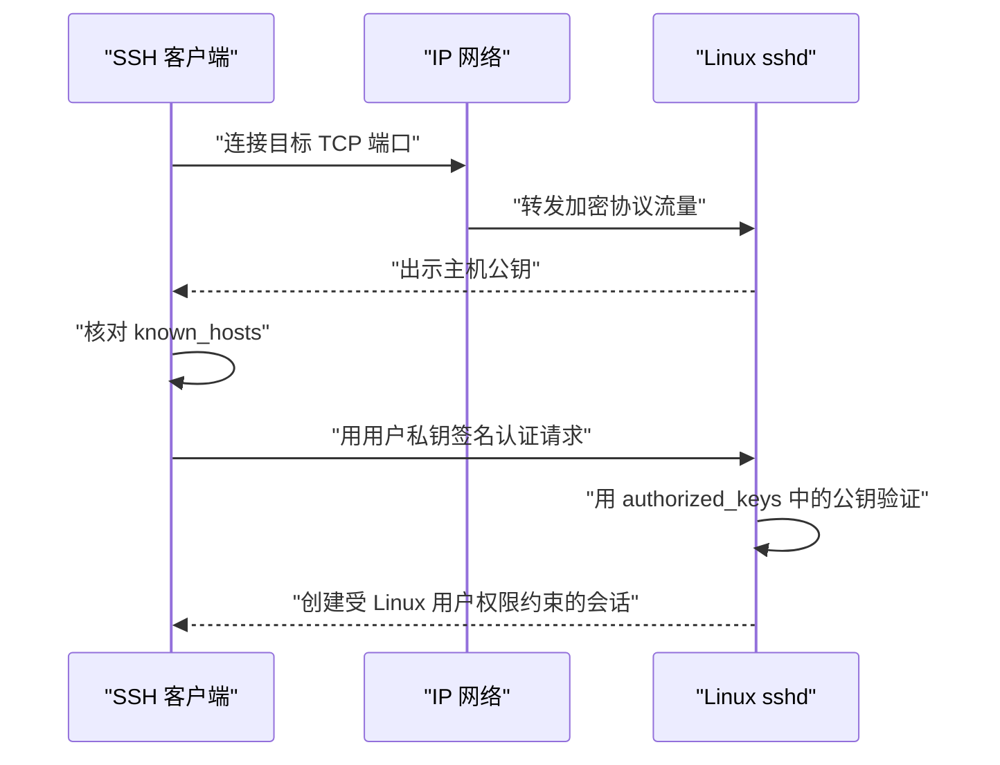

SSH 是一套加密的远程访问协议。OpenSSH 通常由客户端 `ssh` 和服务端 `sshd` 配合工作：客户端验证主机身份，再证明自己有权以某个 Linux 用户登录，最后获得受该用户权限约束的远程 Shell。

本篇以传统 OpenSSH 公钥登录为主线，适用于局域网、虚拟机、Tailscale 覆盖网络和互联网主机。网络路径可以不同，但客户端、`sshd`、主机密钥、用户密钥和 Linux 权限的核心关系不变。

如果尚不熟悉命令、选项、变量、管道和条件分支，先阅读 [[Linux 命令行学习路线与命令地图]] 与 [[Shell 脚本阅读基础]]。软件包、服务、网络和权限分别由 [[APT 软件包管理基础]]、[[systemd 服务与日志基础]]、[[Linux 网络接口、IP 地址、路由与 DNS 基础]] 与 [[Linux 用户、用户组、sudo 与文件权限]] 负责，本篇只解释它们如何在 SSH 登录中配合。

> [!info] 核对日期
> 本文于 **2026-07-19** 核对 Ubuntu Server 与 OpenBSD OpenSSH 手册。修改认证策略前，应以目标主机上的 `man sshd_config` 和由 systemd 管理的实际服务状态为最终依据。

## 本篇掌握目标

- **必须熟练**：能区分 SSH 客户端与服务端、主机身份与用户身份、`known_hosts` 与 `authorized_keys`，并在改认证策略前保留恢复入口。
- **理解会查**：知道 `ssh`、`ssh-keygen`、`sshd`、`systemctl`、`journalctl` 和 `ss` 在连接链路中各自负责什么，低频选项以本机手册和有效配置输出为准。
- **认识即可**：能看出收紧认证脚本的“备份→写入候选配置→校验→重载→失败回滚”顺序，不要在尚未理解时拆分执行其中片段。

## 1. 一次 SSH 登录发生了什么



网络层只负责让双方可达，不替代 SSH 身份验证。即使客户端和虚拟机运行在同一台物理宿主机内，这仍是完整的客户端—服务端流程。

## 2. 分清主机身份与用户身份

| 身份 | 证明什么 | 私密材料保存位置 | 公共材料或信任记录 |
| --- | --- | --- | --- |
| SSH 主机身份 | 服务端确实是预期主机 | 服务端 `/etc/ssh/ssh_host_*_key` | 主机公钥、客户端 `~/.ssh/known_hosts` |
| SSH 用户身份 | 客户端有权以某个 Linux 用户登录 | 客户端用户私钥 | 客户端 `.pub` 公钥、服务端 `~/.ssh/authorized_keys` |

`fingerprint` 是公钥的短摘要，用于人工比较。主机指纹证明“连到谁”，用户密钥证明“谁在登录”，两者不能互相替代。

> [!danger] 私钥不离开其客户端
> 只向服务端传输 `.pub` 公钥。不要把私钥放进 Git、笔记、聊天、共享目录或服务端家目录，也不要使用 `sudo ssh-keygen` 为普通客户端用户创建密钥。

## 3. 在服务端准备 sshd

Ubuntu 22.10 及更新版本默认使用 systemd socket activation。`ssh.socket` 先监听 SSH 端口，收到连接时再激活 `ssh.service`。因此，在尚未收到连接时看到 `ssh.socket` 为 `active`、`ssh.service` 为 `inactive` 可能是正常状态，不应为了让服务常驻而直接改变软件包的默认激活方式。

**执行位置：Ubuntu Server（控制台，任意目录）**

```bash
(
if ! sudo apt update || ! sudo apt install openssh-server; then
  printf '%s\n' '停止：软件包索引刷新或 openssh-server 安装失败。' >&2
  exit 1
fi
# 服务已运行时可直接检查当前配置；否则由 systemd 先准备运行时目录，再执行启动前配置检查。
if systemctl is-active --quiet ssh.service; then
  if ! sudo sshd -t; then
    printf '%s\n' '停止：SSH 配置检查失败。' >&2
    exit 1
  fi
else
  if ! sudo systemctl start ssh.service; then
    printf '%s\n' '停止：ssh.service 启动失败。' >&2
    exit 1
  fi
fi
if ! systemctl status ssh.socket ssh.service --no-pager; then
  printf '%s\n' '停止：SSH socket 或 service 状态不符合预期。' >&2
  exit 1
fi
if ! effective_config="$(sudo sshd -T)"; then
  printf '%s\n' '停止：无法读取 SSH 有效配置。' >&2
  exit 1
fi
if ! grep '^port ' <<<"$effective_config"; then
  printf '%s\n' '停止：有效配置中没有找到监听端口。' >&2
  exit 1
fi
sudo ss -lntp
)
```

本文核对的 Ubuntu 24.04 `ssh.service` 会通过 `RuntimeDirectory=sshd` 让 systemd 在启动时创建 `/run/sshd`，再由 `ExecStartPre=/usr/sbin/sshd -t` 检查配置。服务未运行时，`systemctl start` 成功就表明启动前配置检查已经通过；服务已运行时，它的运行时目录已经存在，可直接使用 `sshd -t` 检查当前配置。`systemctl start` 只改变当前运行状态，不会将 `ssh.service` 设为开机启用；下次启动仍可由已启用的 `ssh.socket` 按需激活。

预期 `ssh.socket` 处于 `active (listening)`，执行上述检查后 `ssh.service` 处于 `active (running)`。先从 `sshd -T` 确认有效端口，再在 `ss` 输出中查找对应监听套接字；新安装的默认值通常是 22，但不要把它当成所有主机的固定事实。若尚未建立远程入口，不要在只有 SSH 会话时停止该服务。

服务端查看当前有效配置：

**执行位置：Ubuntu Server（控制台，任意目录）**

```bash
sudo sshd -T | grep -E '^(port|listenaddress|pubkeyauthentication|passwordauthentication|kbdinteractiveauthentication|permitrootlogin) '
```

`sshd -T` 比只阅读某一个配置文件可靠，因为 Ubuntu 可能通过 `Include` 加载 `/etc/ssh/sshd_config.d/*.conf`。

## 4. 取得地址并验证端口

在服务端读取当前地址，不把一次 DHCP 地址当作永久事实。网络接口、地址前缀和默认路由的读取方法见 [[Linux 网络接口、IP 地址、路由与 DNS 基础]]。

**执行位置：Linux 服务端（控制台，任意目录）**

```bash
hostnamectl --static
ip -brief address
ip route
```

从客户端输入目标地址并测试：

**执行位置：SSH 客户端（任意目录）**

```bash
(
printf '请输入 Linux 主机当前可达的地址或名称：'
IFS= read -r SSH_HOST
case "$SSH_HOST" in
  ''|-*)
    printf '%s\n' '停止：主机地址或名称为空，或以连字符开头。' >&2
    exit 1
    ;;
esac
nc -vz "$SSH_HOST" 22
)
```

如果服务端不是 22 端口，应从可信配置中取得实际端口，并在 `nc` 与 `ssh -p` 中显式指定。超时通常指向网络、路由或防火墙；立即拒绝通常表示地址可达但该端口没有进程监听。

## 5. 首次连接前独立核对主机指纹

从服务端控制台读取 Ed25519 主机公钥指纹：

**执行位置：Linux 服务端（控制台，任意目录）**

```bash
sudo ssh-keygen -lf /etc/ssh/ssh_host_ed25519_key.pub
```

再从客户端发起首次连接：

**执行位置：SSH 客户端（任意目录）**

```bash
(
printf '请输入 Linux 登录用户名：'
IFS= read -r SSH_USER
printf '请输入 Linux 主机当前可达的地址或名称：'
IFS= read -r SSH_HOST
case "$SSH_USER" in
  ''|-*|*[!A-Za-z0-9_-]*)
    printf '%s\n' '停止：Linux 用户名格式不符合本文保护规则。' >&2
    exit 1
    ;;
esac
case "$SSH_HOST" in
  ''|-*)
    printf '%s\n' '停止：主机地址或名称为空，或以连字符开头。' >&2
    exit 1
    ;;
esac
ssh "$SSH_USER@$SSH_HOST"
)
```

客户端显示的指纹必须与控制台结果一致，核对后才接受。接受的主机公钥会写入客户端 `~/.ssh/known_hosts`。

`ssh-keyscan` 只能收集网络响应者提供的公钥，不能独立证明响应者身份，因此不能代替通过控制台或其他可信通道比较指纹。

## 6. 创建独立的用户密钥

先选择用途明确的路径并避免覆盖：

**执行位置：SSH 客户端（任意目录）**

```bash
(
KEY_PATH="$HOME/.ssh/id_ed25519_linux_host"
if ! mkdir -p "$HOME/.ssh" || ! chmod 700 "$HOME/.ssh"; then
  printf '%s\n' '停止：无法准备客户端 .ssh 目录。' >&2
  exit 1
fi

if test -e "$KEY_PATH" || test -L "$KEY_PATH" ||
   test -e "$KEY_PATH.pub" || test -L "$KEY_PATH.pub"; then
  printf '停止：密钥路径已存在，请先确认用途并选择新文件名：%s\n' "$KEY_PATH" >&2
  exit 1
fi

if ssh-keygen -t ed25519 -a 64 -f "$KEY_PATH" -C 'linux-host-access' &&
   chmod 600 "$KEY_PATH" &&
   chmod 644 "$KEY_PATH.pub"; then
  ssh-keygen -lf "$KEY_PATH.pub"
else
  printf '%s\n' '密钥创建或权限设置失败，请检查上述两个目标路径后再重试。' >&2
  exit 1
fi
)
```

最外层圆括号让路径冲突时的 `exit` 只停止这个代码块，不会结束当前客户端登录 Shell。

建议为私钥设置口令。`-a 64` 增加私钥口令派生轮次；服务端仍只接收公钥。

## 7. 将公钥加入 authorized_keys

下面只通过标准输入发送公钥，并让远端以严格权限创建目录：

**执行位置：SSH 客户端（任意目录）**

```bash
(
KEY_PATH="$HOME/.ssh/id_ed25519_linux_host"
printf '请输入 Linux 登录用户名：'
IFS= read -r SSH_USER
printf '请输入 Linux 主机当前可达的地址或名称：'
IFS= read -r SSH_HOST

if ! test -f "$KEY_PATH.pub" || test -L "$KEY_PATH.pub"; then
  printf '停止：公钥不是预期的普通文件：%s\n' "$KEY_PATH.pub" >&2
  exit 1
fi
case "$SSH_USER" in
  ''|-*|*[!A-Za-z0-9_-]*)
    printf '%s\n' '停止：Linux 用户名格式不符合本文保护规则。' >&2
    exit 1
    ;;
esac
case "$SSH_HOST" in
  ''|-*)
    printf '%s\n' '停止：主机地址或名称为空，或以连字符开头。' >&2
    exit 1
    ;;
esac

ssh "$SSH_USER@$SSH_HOST" \
  'umask 077; mkdir -p "$HOME/.ssh" && cat >> "$HOME/.ssh/authorized_keys"' \
  < "$KEY_PATH.pub"
)
```

这一步需要密码或其他已经可用的认证方式。随后在服务端核对：

**执行位置：Linux 服务端（当前登录用户家目录）**

```bash
chmod 700 "$HOME/.ssh"
chmod 600 "$HOME/.ssh/authorized_keys"
stat -c 'mode=%A owner=%U group=%G path=%n' \
  "$HOME/.ssh" "$HOME/.ssh/authorized_keys"
```

如果误追加重复公钥，先备份 `authorized_keys`，再只删除能确认重复的完整行。不要删除用途未知、可能仍被其他客户端使用的公钥。

## 8. 用新会话验证密钥

保留当前可用会话，另开客户端终端：

**执行位置：SSH 客户端（新终端，任意目录）**

```bash
(
KEY_PATH="$HOME/.ssh/id_ed25519_linux_host"
printf '请输入 Linux 登录用户名：'
IFS= read -r SSH_USER
printf '请输入 Linux 主机当前可达的地址或名称：'
IFS= read -r SSH_HOST

if ! test -f "$KEY_PATH" || test -L "$KEY_PATH"; then
  printf '停止：私钥不是预期的普通文件：%s\n' "$KEY_PATH" >&2
  exit 1
fi
case "$SSH_USER" in
  ''|-*|*[!A-Za-z0-9_-]*)
    printf '%s\n' '停止：Linux 用户名格式不符合本文保护规则。' >&2
    exit 1
    ;;
esac
case "$SSH_HOST" in
  ''|-*)
    printf '%s\n' '停止：主机地址或名称为空，或以连字符开头。' >&2
    exit 1
    ;;
esac

ssh -o IdentitiesOnly=yes -i "$KEY_PATH" "$SSH_USER@$SSH_HOST"
)
```

登录后验证身份和连接：

**执行位置：Linux 服务端（新 SSH 会话）**

```bash
whoami
id
hostnamectl --static
printf 'SSH_CONNECTION=%s\n' "$SSH_CONNECTION"
pwd
```

只有新的独立会话成功，才能认为密钥登录可用。

## 9. 使用客户端 ~/.ssh/config

客户端配置把动态地址、用户名和密钥路径集中在一个别名下。以下是结构示例，`HostName` 和 `User` 必须替换为实际值：

```sshconfig
Host linux-host
    HostName linux-host.example.internal
    User linux-user
    IdentityFile ~/.ssh/id_ed25519_linux_host
    IdentitiesOnly yes
    ServerAliveInterval 30
    ServerAliveCountMax 3
```

保存到客户端 `~/.ssh/config` 后：

**执行位置：SSH 客户端（任意目录）**

```bash
chmod 700 "$HOME/.ssh"
chmod 600 "$HOME/.ssh/config"
ssh -G linux-host | grep -E '^(hostname|user|identityfile|identitiesonly) '
ssh linux-host
```

`ssh -G` 显示合并后的客户端配置，适合排查多个 `Host` 块、通配符和 `Include` 的优先级。别名稳定而地址可变时，只需更新 `HostName`。

## 10. Fail-closed 收紧服务端认证

本节使用的 `if`、函数、`trap`、重定向和退出状态见 [[Shell 脚本阅读基础]] 与 [[Shell 标准流、管道、重定向与退出状态]]。这里应把整段当作一个有前置条件和回滚的完整操作，不要抽出中间命令单独执行。

只有满足以下条件后，才考虑关闭密码登录：

- 控制台仍可用。
- 至少两个独立的新密钥会话已经成功。
- 已确认正确 Linux 用户拥有可用公钥。
- 当前旧会话保持打开。

以下脚本使用独立配置片段，先备份，再校验语法与有效值；任一步失败都会尝试恢复原状态。整段由最外层圆括号放进一个子 Shell，所以其中的 `trap` 和 `exit` 不会残留或结束当前登录 Shell：

此时至少一个 SSH 会话已经通过验证，`ssh.service` 正在运行且它的运行时目录已经存在，因此脚本可以直接使用 `sshd -t` 和 `sshd -T`。

**执行位置：Linux 服务端（已验证的 SSH 会话）**

```bash
(
  config_file=/etc/ssh/sshd_config.d/00-local-hardening.conf
  backup_file="${config_file}.before-hardening"
  absence_marker="${config_file}.absent-before-hardening"
  had_original=no

  if ! candidate_file="$(mktemp /tmp/ssh-hardening.XXXXXX)"; then
    printf '%s\n' '停止：无法创建候选配置文件。' >&2
    exit 1
  fi
  readonly candidate_file

  cleanup() {
    rm -f -- "$candidate_file"
  }
  trap cleanup EXIT

  if ! sudo -v; then
    printf '%s\n' '停止：无法取得 sudo 授权。' >&2
    exit 1
  fi

  if sudo test -e "$backup_file" || sudo test -e "$absence_marker"; then
    printf '%s\n' '停止：变更前状态记录已存在，请先核对后再操作。' >&2
    printf '备份路径：%s\n缺失标记：%s\n' \
      "$backup_file" "$absence_marker" >&2
    exit 1
  elif ! sudo test ! -e "$backup_file" ||
       ! sudo test ! -e "$absence_marker"; then
    printf '%s\n' '停止：无法确认变更前状态记录。' >&2
    exit 1
  fi

  if sudo test -e "$config_file"; then
    if ! sudo cp -a -- "$config_file" "$backup_file"; then
      printf '%s\n' '停止：无法备份原配置。' >&2
      exit 1
    fi
    had_original=yes
  elif ! sudo test ! -e "$config_file"; then
    printf '停止：无法确认配置路径状态：%s\n' "$config_file" >&2
    exit 1
  elif ! sudo install -o root -g root -m 0600 /dev/null "$absence_marker"; then
    printf '%s\n' '停止：无法记录原配置不存在。' >&2
    exit 1
  fi

  if ! sudo sshd -t; then
    printf '%s\n' '停止：变更前的 SSH 配置检查未通过。' >&2
    exit 1
  fi

  if ! cat >"$candidate_file" <<'EOF'
PubkeyAuthentication yes
PasswordAuthentication no
KbdInteractiveAuthentication no
PermitRootLogin no
EOF
  then
    printf '%s\n' '停止：无法写入候选配置。' >&2
    exit 1
  fi

  restore_original() {
    if test "$had_original" = yes; then
      sudo cp -a -- "$backup_file" "$config_file"
    else
      sudo rm -f -- "$config_file"
    fi
  }

  effective_config=''
  if sudo install -o root -g root -m 0644 "$candidate_file" "$config_file" &&
     sudo sshd -t &&
     effective_config="$(sudo sshd -T)" &&
     grep -qxF 'pubkeyauthentication yes' <<<"$effective_config" &&
     grep -qxF 'passwordauthentication no' <<<"$effective_config" &&
     grep -qxF 'kbdinteractiveauthentication no' <<<"$effective_config" &&
     grep -qxF 'permitrootlogin no' <<<"$effective_config" &&
     sudo systemctl reload ssh.service; then
    printf '%s\n' '配置已应用；请保持旧会话并从新终端验证登录。'
  else
    printf '%s\n' '变更失败，正在恢复原配置。' >&2
    if ! restore_original; then
      printf '%s\n' '紧急：自动恢复写入失败，请保持当前会话并使用控制台处理。' >&2
      exit 1
    fi
    if ! sudo sshd -t; then
      printf '%s\n' '紧急：恢复后的配置检查失败，请保持当前会话并使用控制台处理。' >&2
      exit 1
    fi
    if ! sudo systemctl reload ssh.service; then
      printf '%s\n' '紧急：原配置已写回，但 reload 失败，请保持当前会话并使用控制台处理。' >&2
      exit 1
    fi
    printf '%s\n' '原配置已恢复，收紧操作未生效。' >&2
    exit 1
  fi
)
```

原片段存在时，脚本把它复制到固定备份；原片段不存在时，则创建一个独立的“原本不存在”标记。后续再次收紧或回滚时，只要这两种状态记录缺失、同时存在或彼此矛盾，脚本就会停止，不会猜测原状态。

脚本成功只说明配置与 reload 通过，不能证明客户端仍能登录。保持旧会话，从新终端用别名再次连接。

需要回滚时，通过控制台或仍可用的旧会话执行：

**执行位置：Linux 服务端（控制台或仍可用会话）**

```bash
(
  config_file=/etc/ssh/sshd_config.d/00-local-hardening.conf
  backup_file="${config_file}.before-hardening"
  absence_marker="${config_file}.absent-before-hardening"
  rollback_copy="${config_file}.rollback-$(date +%Y%m%d%H%M%S)-$$"

  if ! sudo -v; then
    printf '%s\n' '停止：无法取得 sudo 授权。' >&2
    exit 1
  fi
  if ! sudo test -e "$config_file"; then
    printf '停止：当前配置不存在：%s\n' "$config_file" >&2
    exit 1
  fi

  if sudo test -e "$backup_file" && sudo test ! -e "$absence_marker"; then
    rollback_mode=restore
  elif sudo test ! -e "$backup_file" && sudo test -e "$absence_marker"; then
    rollback_mode=remove
  else
    printf '%s\n' '停止：备份与缺失标记不符合预期，无法判断原状态。' >&2
    exit 1
  fi

  if sudo test -e "$rollback_copy" ||
     ! sudo cp -a -- "$config_file" "$rollback_copy"; then
    printf '%s\n' '停止：无法创建回滚前副本。' >&2
    exit 1
  fi

  restore_pre_rollback() {
    sudo cp -a -- "$rollback_copy" "$config_file" &&
      sudo sshd -t &&
      sudo systemctl reload ssh.service
  }

  apply_ok=no
  case "$rollback_mode" in
    restore)
      if sudo cp -a -- "$backup_file" "$config_file"; then
        apply_ok=yes
      fi
      ;;
    remove)
      if sudo rm -- "$config_file"; then
        apply_ok=yes
      fi
      ;;
  esac

  if test "$apply_ok" = yes &&
     sudo sshd -t &&
     sudo systemctl reload ssh.service; then
    printf '回滚完成；回滚前副本保留在：%s\n' "$rollback_copy"
  else
    printf '%s\n' '回滚失败，正在恢复回滚前配置。' >&2
    if ! restore_pre_rollback; then
      printf '紧急：自动恢复失败，请保持当前会话并通过控制台处理；副本：%s\n' \
        "$rollback_copy" >&2
    fi
    exit 1
  fi
)
```

再次从新会话验证。回滚前副本和变更前状态记录会继续保留，确认系统稳定后再逐个核对；不要用通配符批量删除 `/etc/ssh/sshd_config.d/` 中的文件。

## 11. 主机指纹变化

主机重装、主机密钥重新生成或地址被另一台机器复用时，SSH 会警告主机身份变化。不要设置 `StrictHostKeyChecking no` 绕过。

先通过控制台重新读取服务端指纹，确认变化合理，再只移除对应旧记录：

**执行位置：SSH 客户端（任意目录）**

```bash
(
printf '请输入已经通过可信通道核对的主机地址或名称：'
IFS= read -r SSH_HOST
case "$SSH_HOST" in
  ''|-*)
    printf '%s\n' '停止：主机地址或名称为空，或以连字符开头。' >&2
    exit 1
    ;;
esac
if ! test -f "$HOME/.ssh/known_hosts"; then
  printf '%s\n' '停止：known_hosts 不存在或不是普通文件。' >&2
  exit 1
fi
if ! known_hosts_backup="$(mktemp "$HOME/.ssh/known_hosts.backup.XXXXXX")"; then
  printf '%s\n' '停止：无法创建 known_hosts 备份路径。' >&2
  exit 1
fi
if ! cp -- "$HOME/.ssh/known_hosts" "$known_hosts_backup"; then
  rm -f -- "$known_hosts_backup"
  printf '%s\n' '停止：known_hosts 备份失败，未移除任何记录。' >&2
  exit 1
fi
printf 'known_hosts_backup=%s\n' "$known_hosts_backup"
ssh-keygen -F "$SSH_HOST"
ssh-keygen -R "$SSH_HOST"
)
```

下次连接时重新比较新指纹。不要删除整个 `known_hosts`。

## 12. 登录 Linux 与 Git SSH 的区别

| 场景 | SSH 服务端 | 公钥授权对象 | 成功结果 |
| --- | --- | --- | --- |
| 登录 Linux | 目标主机的 `sshd` | Linux 用户账号 | 远程 Shell 和该用户权限 |
| 访问 Git 远程 | GitHub、GitLab 等代码平台 | 平台账号与仓库权限 | Git 协议操作，通常没有通用 Shell |

两者使用相同协议族，但服务端、授权对象和密钥生命周期不同。建议按用途使用独立密钥。Git 场景继续阅读 [[Git 凭据、SSH 与常见问题排查]]。

## 13. 排查顺序

| 现象 | 优先检查 | 典型命令 |
| --- | --- | --- |
| 连接超时 | 地址、路由、防火墙 | `ip route`、`ufw status` |
| `Connection refused` | SSH socket 或服务是否监听 | `systemctl status ssh.socket ssh.service`、`ss -lntp` |
| `Permission denied (publickey)` | 用户名、客户端密钥、目录权限 | `ssh -vvv`、`stat ~/.ssh` |
| 主机密钥警告 | 是否重装或地址复用 | 控制台 `ssh-keygen -lf` |
| 登录后断开 | 用户 Shell、HOME 权限、服务日志 | `getent passwd`、`journalctl -u ssh` |
| 终端与 IDE 行为不同 | 是否使用相同别名和配置 | `ssh -G linux-host` |

客户端详细调试：

**执行位置：SSH 客户端（任意目录）**

```bash
ssh -vvv linux-host
```

输出可能包含用户名、地址和公钥指纹，分享前应脱敏。

### 服务端配置与启动检查

服务端先检查激活单元，再按服务的当前状态检查配置或通过 systemd 启动：

**执行位置：Linux 服务端（控制台）**

```bash
systemctl show ssh.service \
  --property=RuntimeDirectory \
  --property=RuntimeDirectoryMode \
  --property=ExecStartPre
systemctl status ssh.socket ssh.service --no-pager || true
if systemctl is-active --quiet ssh.service; then
  sudo sshd -t
else
  sudo systemctl start ssh.service
fi
sudo journalctl -u ssh.service -b -n 100 --no-pager
```

若上述检查分支成功完成，配置检查已经通过，再读取当前有效配置：

```bash
sudo sshd -T | grep -E '^(port|pubkeyauthentication|passwordauthentication|permitrootlogin) '
```

### `sshd -t` 提示缺少 `/run/sshd`

如果在 `ssh.service` 尚未启动时直接执行 `sudo sshd -t`，可能看到 `Missing privilege separation directory: /run/sshd`。这表示手工命令绕过了负责创建 `RuntimeDirectory` 的 systemd 单元，不足以证明 `sshd_config` 存在语法错误。应先按上述顺序启动服务并查看日志，不要在未核对软件包机制前自行添加 tmpfiles 规则或将手工建目录当作持久修复。

## 完成检查

- [ ] 服务端启动前配置检查通过，SSH socket 或服务正常监听。
- [ ] 首次连接前通过独立可信通道核对了主机指纹。
- [ ] 私钥只保存在客户端，公钥位于正确用户的 `authorized_keys`。
- [ ] 新开终端可以独立使用密钥登录。
- [ ] 能解释 `known_hosts` 与 `authorized_keys` 的区别。
- [ ] `~/.ssh/config` 的别名可通过 `ssh -G` 核对。
- [ ] 收紧认证时保留了控制台、旧会话、备份和回滚路径。
- [ ] 知道 Linux 登录与 Git SSH 认证不是同一个授权场景。

## 官方参考资料

- [Ubuntu Server：OpenSSH Server](https://documentation.ubuntu.com/server/how-to/security/openssh-server/)
- [Ubuntu 24.04 LTS 发布说明：OpenSSH 的 systemd socket activation](https://documentation.ubuntu.com/release-notes/24.04/#openssh)
- [OpenBSD：ssh 客户端手册](https://man.openbsd.org/ssh.1)
- [OpenBSD：sshd 服务端手册](https://man.openbsd.org/sshd.8)
- [OpenBSD：ssh-keygen 手册](https://man.openbsd.org/ssh-keygen.1)
- [OpenBSD：ssh_config 手册](https://man.openbsd.org/ssh_config)
- [OpenBSD：sshd_config 手册](https://man.openbsd.org/sshd_config)
