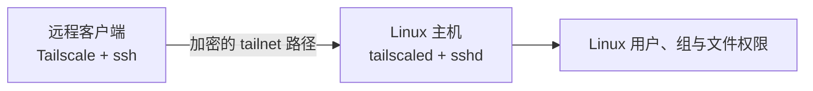

Tailscale 基于 WireGuard 建立受身份和访问策略控制的覆盖网络，使不同局域网或 NAT 后的设备可以互相到达。本篇采用清晰主线：**Tailscale 只解决网络可达性，登录仍使用传统 OpenSSH**。

Tailscale 是远程访问扩展，不替代同一局域网内的 SSH，也不替代 `sshd`、主机防火墙、Linux 用户权限、主机指纹和用户密钥。应先独立完成 [[OpenSSH 连接、密钥与主机指纹]]，并理解 [[Linux 主机防火墙与 UFW 基础]]，再引入 Tailscale。

> [!info] 核对日期
> 本文于 **2026-07-17** 核对 Tailscale 官方文档。客户端安装界面、访问控制语法和产品能力可能变化，启用前应重新查看当前官方文档与所在 tailnet 的策略。

## 1. 网络路径与职责



一次连接仍分为三层：

1. Tailscale 判断两个节点能否在 tailnet 中互相到达。
2. 防火墙判断目标端口是否允许进入。
3. OpenSSH 验证主机身份和 Linux 用户身份。

因此 `tailscale ping` 成功不代表 SSH 一定成功，SSH 成功也不表示任意 tailnet 节点都应拥有访问权。

## 2. 适用边界

适合：

- 不希望直接把 SSH 端口暴露到公网。
- 两端经常处于不同 NAT 或不同网络。
- 希望使用设备身份、MagicDNS 和集中访问策略。
- 需要为远程客户端提供一条独立于局域网地址的路径。

不解决：

- 目标主机已经关机、休眠或网络中断。
- 虚拟机或容器没有启动。
- `sshd` 停止、Linux 用户或密钥配置错误。
- 源码、数据库和系统备份。
- 云安全组、应用层认证和生产发布流程。

## 3. 传统 OpenSSH over Tailscale 与 Tailscale SSH

| 方式 | Tailscale 负责 | SSH 用户认证 | 适用判断 |
| --- | --- | --- | --- |
| 传统 OpenSSH over Tailscale | 节点互通与网络访问控制 | `sshd`、客户端私钥、`authorized_keys` | 本篇主线；保留标准 SSH 学习与迁移能力 |
| Tailscale SSH | 网络层，并接管 tailnet 入站 SSH 的认证授权 | tailnet 身份、ACL 或 grants、check 模式 | 需要单独设计身份和策略时评估 |

不要在没有理解差异时执行 `tailscale set --ssh`。Tailscale SSH 不等于“给传统 SSH 再加一层网络”，它会改变来自 tailnet 的 SSH 认证模型。

## 4. 前置检查

先确认目标 Linux 主机本地 SSH 正常：

**执行位置：Linux 主机（控制台或已验证的本地 SSH 会话）**

```bash
systemctl is-active ssh.service
sudo sshd -t
sudo ss -lntp
ip -brief address
```

远程客户端确认具备 SSH：

**执行位置：远程客户端（任意目录）**

```bash
command -v ssh
command -v tailscale || true
```

如果传统 SSH 本身失败，应先修复 [[OpenSSH 连接、密钥与主机指纹]] 中对应层次，不要用 Tailscale 掩盖服务端问题。应从 OpenSSH 有效配置确认端口，再在 `ss` 输出中匹配对应的 `Local Address:Port`；使用 `ssh.socket` 时，监听进程可能显示为 `systemd`，因此不要只执行 `grep sshd`，详见 [[Linux 端口、监听套接字与 ss 命令基础#7. 在 SSH 排查中怎样使用]]。

## 5. 在 Linux 主机安装 Tailscale

安装方式会随发行版更新。优先从 [Tailscale 官方安装页](https://tailscale.com/docs/install) 进入目标系统说明。

Tailscale 官方为 Linux 提供安装脚本。若采用脚本方式，先下载和阅读，再执行：

**执行位置：Linux 主机（任意目录）**

```bash
install_script=/tmp/tailscale-install.sh
curl -fsSL https://tailscale.com/install.sh -o "$install_script"
less "$install_script"
sudo sh "$install_script"
rm -f -- "$install_script"
```

如果不接受安装脚本，应按官方 Linux 文档手工配置对应发行版的软件包仓库；不要改用来源不明的第三方脚本或镜像。

安装后：

**执行位置：Linux 主机（任意目录）**

```bash
sudo systemctl enable --now tailscaled.service
systemctl status tailscaled.service --no-pager
sudo tailscale up
```

`tailscale up` 通常会给出认证 URL。只在可信浏览器完成认证，不把登录 URL、auth key 或一次性凭据写入笔记、Git 或 Shell 历史。

验证节点状态：

**执行位置：Linux 主机（任意目录）**

```bash
tailscale status
tailscale ip -4
ip -brief address show tailscale0
tailscale netcheck
```

预期 `tailscaled` 正常，节点已登录目标 tailnet，并出现 `tailscale0`。不要把某次 Tailscale IP 当作所有环境的固定值；客户端可优先使用 MagicDNS 名称。

## 6. 在远程客户端加入同一 tailnet

按照 [Tailscale 官方安装页](https://tailscale.com/docs/install) 为客户端系统安装应用，并使用组织允许的身份加入正确 tailnet。完成后：

**执行位置：远程客户端（任意目录）**

```bash
tailscale status
tailscale netcheck
```

在管理控制台核对：

- 设备所有者和设备名称正确。
- 需要审批的设备已经按策略审批。
- 标签、用户组和设备属性符合授权设计。
- 没有为了省事长期关闭所有设备的密钥过期或审批控制。
- 丢失和不再使用的设备能够及时撤销。

## 7. 先验证 Tailscale，再验证 TCP 和 SSH

从管理面或目标主机取得 MagicDNS 名称或 Tailscale 地址：

**执行位置：远程客户端（任意目录）**

```bash
(
printf '请输入目标 Linux 主机的 MagicDNS 名称或 Tailscale 地址：'
IFS= read -r TS_HOST
case "$TS_HOST" in
  ''|-*)
    printf '%s\n' '停止：目标名称或地址为空，或以连字符开头。' >&2
    exit 1
    ;;
esac
tailscale ping "$TS_HOST"
nc -vz -w 5 "$TS_HOST" 22
)
```

判断：

1. `tailscale ping` 成功：节点身份、基础可达性和策略大体正常。
2. TCP 22 成功：从当前客户端到本次解析地址的 TCP 连接已经建立；它不证明对端一定是 OpenSSH，也不证明主机指纹或用户密钥正确，详见 [[TCP 端口连通性测试与 nc 命令基础]]。
3. 之后的 `Permission denied`：优先检查 Linux 用户和 SSH 密钥。

使用传统 OpenSSH 登录：

**执行位置：远程客户端（任意目录）**

```bash
printf '请输入 Linux 登录用户名：'
IFS= read -r SSH_USER
printf '请输入目标 Linux 主机的 MagicDNS 名称或 Tailscale 地址：'
IFS= read -r TS_HOST
ssh "$SSH_USER@$TS_HOST"
```

首次连接仍必须通过可信通道核对主机指纹。Tailscale 提供加密网络，不会取消传统 OpenSSH 的 `known_hosts` 保护。

## 8. 为每台客户端使用独立 SSH 密钥

不要在多台客户端之间通过聊天、邮件、Git 或公共共享目录复制同一私钥。更容易审计和撤销的方式是：

1. 每台客户端独立生成用户密钥。
2. 只把各自公钥加入 Linux 用户的 `authorized_keys`。
3. 使用注释标识来源。
4. 某客户端丢失时，只撤销该节点和对应公钥。

具体生成、登记和验证步骤见 [[OpenSSH 连接、密钥与主机指纹]]。

## 9. 使用独立 SSH 别名

Tailscale 路径可以使用单独别名，避免与局域网地址混淆：

```sshconfig
Host linux-host-tailnet
    HostName linux-host.tailnet-name.ts.net
    User linux-user
    IdentityFile ~/.ssh/id_ed25519_linux_host
    IdentitiesOnly yes
    ServerAliveInterval 30
    ServerAliveCountMax 3
```

`HostName`、`User` 和密钥路径必须改为实际值。验证合并后的配置：

**执行位置：远程客户端（任意目录）**

```bash
chmod 600 "$HOME/.ssh/config"
ssh -G linux-host-tailnet | grep -E '^(hostname|user|identityfile) '
ssh linux-host-tailnet
```

## 10. ACL、grants 与防火墙的边界

Tailscale 访问至少受以下控制：

| 层次 | 负责什么 | 验证位置 |
| --- | --- | --- |
| tailnet ACL 或 grants | 哪些身份、设备或标签可连接哪些目标和端口 | 管理控制台、策略测试 |
| Linux 主机防火墙 | 到达主机的包是否允许进入 | `ufw status`、nftables |
| OpenSSH | 主机身份与 Linux 用户认证 | `known_hosts`、`authorized_keys`、`sshd -T` |
| Linux 权限 | 登录后能读取、修改和执行什么 | 用户、组、文件模式、sudoers |

ACL 是较早的访问控制模型，grants 是更通用的新模型；已有 tailnet 应先确认正在使用哪种策略语言。不要为了快速连通复制“允许所有来源访问所有目标”的规则。

策略应从实际身份和端口出发，遵循最小权限，并使用官方策略测试验证。对标签节点还要理解 tag owner、设备所有权和用户身份的变化。

若要让 UFW 只允许 `tailscale0` 上的 SSH，必须先设计并验证本地控制台或其他救援路径。不要在唯一远程会话中直接删除原有 SSH 放行规则。

UFW 的默认策略、application profile、来源与接口范围、启用和恢复流程见 [[Linux 主机防火墙与 UFW 基础]]。本篇只说明 tailnet 策略与主机防火墙的分层关系，不复制另一套 UFW 初始化流程。

## 11. 常见问题

### 看不到 Linux 节点

**执行位置：Linux 主机（控制台）**

```bash
systemctl is-active tailscaled.service
sudo journalctl -u tailscaled.service -n 100 --no-pager
tailscale status
tailscale netcheck
timedatectl status
```

检查主机是否联网、系统时间是否正确、认证是否过期，以及节点是否加入预期 tailnet。

### `tailscale ping` 成功但 SSH 拒绝

**执行位置：Linux 主机（控制台）**

```bash
systemctl is-active ssh.service
sudo ss -lntp
sudo ufw status verbose
sudo journalctl -u ssh.service -n 100 --no-pager
```

`Connection refused` 优先检查监听；超时优先检查策略和防火墙；`Permission denied` 优先检查用户名、密钥和 `authorized_keys` 权限。

### 连接经过 DERP 中继

中继仍可提供连接，只是延迟和吞吐可能不同。先记录 `tailscale ping` 和 `tailscale netcheck` 结果，再按官方连接排障文档分层检查。不要为了强求直连就盲目开放公网端口或关闭安全策略。

### 目标主机显示离线

确认目标主机是否开机、未休眠、网络可用，`tailscaled` 是否运行。Tailscale 不能唤醒一台没有供电或其操作系统没有运行的主机。

## 12. 暂停、退出与撤销

临时断开该节点：

**执行位置：Linux 主机（任意目录）**

```bash
sudo tailscale down
```

重新加入网络可运行 `sudo tailscale up`。退出当前 tailnet：

**执行位置：Linux 主机（任意目录）**

```bash
sudo tailscale logout
```

撤销远程能力时还应：

1. 在管理控制台禁用或删除不再信任的节点。
2. 从 `authorized_keys` 中只删除对应客户端的公钥。
3. 删除不再需要的 SSH 别名。
4. 检查 ACL 或 grants 中是否遗留过宽授权。

卸载前查看当前官方说明和实际软件包。不要直接删除 `/var/lib/tailscale`；其中包含节点状态，手工清理是不可逆操作。

## 完成检查

- [ ] 本地或局域网 OpenSSH 已先独立验证。
- [ ] 两端节点加入正确 tailnet，所有者与审批状态正确。
- [ ] `tailscale ping`、目标 TCP 端口和传统 SSH 按层验证。
- [ ] 首次 SSH 连接仍核对主机指纹。
- [ ] 每台远程客户端使用可独立撤销的密钥。
- [ ] ACL 或 grants 没有使用无边界的全放行策略。
- [ ] 知道 Tailscale 不会启动关机主机，也不替代备份和 Linux 权限。
- [ ] 知道如何 `down`、`logout`、撤销节点和删除对应公钥。

## 官方参考资料

- [Tailscale：安装入口](https://tailscale.com/docs/install)
- [Tailscale：在 Linux 安装](https://tailscale.com/docs/install/linux)
- [Tailscale：MagicDNS](https://tailscale.com/docs/features/magicdns)
- [Tailscale：连接类型](https://tailscale.com/docs/reference/connection-types)
- [Tailscale：访问控制](https://tailscale.com/docs/features/access-control)
- [Tailscale：grants 语法](https://tailscale.com/docs/features/access-control/grants)
- [Tailscale：Tailscale SSH](https://tailscale.com/docs/features/tailscale-ssh)
- [Tailscale：安全最佳实践](https://tailscale.com/docs/reference/best-practices/security)
- [Ubuntu Server：OpenSSH Server](https://documentation.ubuntu.com/server/how-to/security/openssh-server/)
