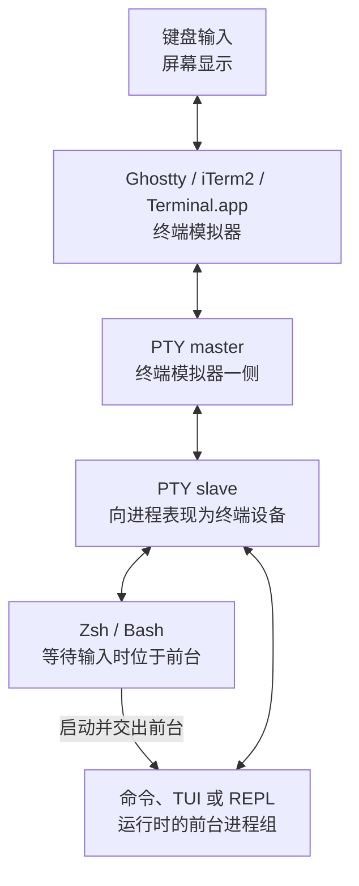
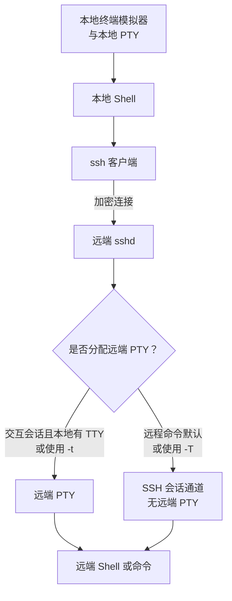

当我们说“打开终端”“分配一个 TTY”“SSH 没有 PTY”或“切换 Shell”时，句子里的“终端”并不总是同一个对象。TTY 的名称源自 teletypewriter（电传打字机），现在主要表示 Unix-like 系统的终端设备接口与语义；PTY 是 pseudo-terminal（伪终端）；Shell 是命令解释器。最容易记住的边界是：**Ghostty、iTerm2 和 Terminal.app 是终端模拟器应用；PTY 是它们与命令行进程之间常用的内核通道；Zsh、Bash 是运行在通道另一侧的 Shell 进程。**

本文面向 macOS 与 Linux 的日常命令行、SSH（Secure Shell，安全远程登录协议）和容器场景，负责建立这些概念的统一模型。Shell 语法见 [[Shell 命令结构、类型与帮助系统]]，标准输入输出见 [[Shell 标准流、管道、重定向与退出状态]]，Ghostty 配置与 terminfo（终端能力数据库）排障见 [[Ghostty 常用配置与 Shell 集成]]。

> [!note] 资料与验证边界
> 本文于 **2026-09-02** 核对 POSIX（Portable Operating System Interface，可移植操作系统接口）终端接口与命令、Linux man-pages、OpenSSH、Ghostty、iTerm2 与 Docker 官方资料。文中的只读命令可用于观察实际机器，但示例输出不是某台机器的已验证状态；设备名、Shell 启动方式和程序行为应以当前会话为准。

## 1. 先把五个角色分开

| 名称 | 在本文中指什么 | 负责什么 | 不等于什么 |
| --- | --- | --- | --- |
| 终端（terminal） | 一个有历史包袱的总称；可能指终端设备、终端会话或用户看到的终端窗口 | 具体含义必须结合上下文判断 | 不能看到“终端”二字就断定是某个图形界面（graphical user interface，GUI）应用 |
| 终端模拟器（terminal emulator） | Ghostty、iTerm2、Terminal.app、GNOME Terminal，以及多数集成开发环境（integrated development environment，IDE）的内置终端前端 | 接收键盘和鼠标输入，绘制字符、颜色与光标，解释终端控制序列，并在 macOS/Linux 上通常管理 PTY 的 master（控制端） | 不是 Zsh、Bash，也不负责解析 Shell 命令语法 |
| TTY | 名称源自 teletypewriter（电传打字机）；现代 Unix-like 系统中主要表示终端设备接口、终端语义或进程所关联的终端 | 为进程提供终端输入输出、行规程、特殊控制字符和作业控制等能力 | 不专指物理设备，也不专指一个窗口 |
| PTY（pseudo-terminal，伪终端） | 一对在软件中实现的虚拟字符设备，分为 master（控制端）与 slave（终端端） | 让终端模拟器、SSH、`tmux` 等终端复用器驱动一个看起来像传统终端的接口 | 不是终端模拟器的同义词，也不是 Shell |
| Shell | Zsh、Bash、Dash 等命令解释器进程 | 解析命令语言、展开参数、建立重定向与管道，并启动其他程序 | 不负责创建窗口、选择字体或绘制字符 |

Ghostty 与 iTerm2 位于同一层：它们是不同产品，但都可以启动 Zsh、Bash 或其他命令。Shell Integration（Shell 集成）只是终端模拟器与 Shell 之间额外交换工作目录、提示符边界等信息的协作机制，并不会把两个程序合并成一个程序。

## 2. 本地终端会话怎样连接起来

在常见的 macOS/Linux 图形终端会话中，可以先用下面的模型理解各层。图中的 TUI 是 text-based user interface（文本用户界面），REPL 是 read-eval-print loop（读取—求值—输出循环）：



输入方向大致是：

1. 终端模拟器收到按键，把相应字节写入 PTY master。
2. 内核终端驱动按当前设置处理这些字节，再让连接 PTY slave 的前台进程读取。
3. Shell 正在等待命令时由 Shell 读取；`vim`、`less`、`top` 等交互程序运行时，通常由它们所在的前台进程组读取。

输出方向相反：Shell 或程序把普通文本和终端控制序列写到 slave，终端模拟器从 master 读取，然后按照字体、颜色和窗口设置绘制结果。由此可以得到几个重要结论：

- Shell 解析 `echo "$HOME"` 这样的命令，但不是它把字符画到屏幕上。
- 终端模拟器可以先截获自己的快捷键；没有被截获的输入才会继续进入 PTY。
- 在常见终端设置下，`Ctrl-C` 对应的中断字符由终端驱动转换为中断信号 `SIGINT`，发送给前台进程组；不是 Ghostty 直接“杀死当前程序”。程序仍可以捕获或忽略这个信号。
- Shell 启动前台程序后通常等待，并暂时把终端前台交给该程序所在的进程组；程序退出后再取回控制权并显示下一次提示符。

这张图是职责模型，不表示所有程序必须经过 Shell。终端模拟器也可以配置为直接启动某个 TUI 程序；Shell 同样可以在脚本、CI（continuous integration，持续集成）或 systemd 服务中运行而完全没有终端。

## 3. TTY 与 PTY 到底是什么关系

不要把 TTY 与 PTY 记成两个并列应用。更准确的关系是：**TTY 是进程所看到的终端接口与语义，PTY 是在软件中提供这种接口的一种常见机制。**

PTY 两端使用官方手册中的传统名称：

| PTY 端点 | 通常由谁使用 | 看见的数据 |
| --- | --- | --- |
| master | 终端模拟器、SSH 服务端、tmux 等控制程序 | 从 slave 发出的输出，也可以向 slave 注入输入 |
| slave | Shell、命令、TUI、REPL 等被驱动的进程 | 表现得像传统终端，可以成为标准输入、标准输出、标准错误和控制终端 |

Linux 的现代 PTY slave 常见于 `/dev/pts/数字`，macOS 常见于 `/dev/ttys数字`。这些只是可能的设备名，不应写进脚本作为固定路径。`tty` 命令会查询**标准输入**连接的终端并打印实际设备名；没有连接终端时通常显示 `not a tty` 并返回非零退出状态。

还要区分两个容易混在一起的表达：

- “文件描述符连接 TTY”是在问标准输入、标准输出或其他已打开描述符指向什么；每个描述符要分别判断。
- “进程有控制终端”是在问整个会话的作业控制关系。Linux 中的 `/dev/tty` 是进程控制终端的别名；没有控制终端的守护进程打开它会失败。

systemd 服务、cron 任务和多数 CI 作业通常没有控制终端。它们仍然可以运行 Shell 和命令，只是交互提示、颜色、分页器、作业控制及信号行为不能照搬终端窗口中的经验。

## 4. 登录、交互和 TTY 是三个判断维度

下面三项经常同时出现，但不是同一个开关：

| 判断维度 | 真正的问题 | 影响示例 |
| --- | --- | --- |
| 登录 Shell（login shell） | Shell 是否以登录模式启动 | 决定 Bash、Zsh 读取哪组登录启动文件 |
| 交互式 Shell（interactive shell） | Shell 是否持续读取用户命令并显示交互环境 | 决定是否加载交互配置、行编辑、提示符和别名 |
| 文件描述符连接 TTY | 例如文件描述符（file descriptor，fd）0、1、2 是否各自指向终端 | 程序据此决定是否提示输入、启用颜色、启动分页器或改变缓冲方式 |

例如，在终端窗口里执行 `zsh -c 'printf "hello\n"'`，这个子 Shell 是非交互式 Shell，但它的标准输出仍可能继承当前 TTY。反过来，Shell 可以被强制进入交互模式，却从管道或文件取得输入。因此，“交互式”与“连接 TTY”高度相关，但不能互相替代。

几个常见环境变量也只能回答各自的问题：

| 变量 | 可以作为哪类线索 | 不能证明什么 |
| --- | --- | --- |
| `$SHELL` | 账户偏好的登录 Shell 路径，通常由父进程传入 | 不能可靠证明当前正在运行的 Shell；进入子 Shell 后它可能仍保留旧值 |
| `$TERM` | 供 terminfo 等机制选择终端能力描述的终端类型名 | 不是 Shell 名，也不能单独证明终端模拟器品牌或远端已经安装该 GUI 应用 |
| `$TERM_PROGRAM` 等 | 某些终端模拟器提供的非标准识别线索 | 可能不存在、被覆盖，或没有通过 sudo/SSH 传递，不能作为通用契约 |

Ghostty 中常见的 `TERM=xterm-ghostty` 表示程序应使用对应终端能力描述，不表示远端服务器正在运行 Ghostty。通过 SSH 时，Ghostty 仍然在本地绘制字符；远端只需要正确理解相应的 terminfo 能力。

## 5. 用只读命令观察当前会话

以下命令适用于已经打开的 macOS 或 Linux Bash/Zsh 终端，任意目录均可执行。它们只读取当前进程和终端状态，不修改配置：

```bash
printf 'SHELL=%s\n' "${SHELL:-not-set}"
printf 'TERM=%s\n' "${TERM:-not-set}"

tty
ps -p "$$" -o pid=,ppid=,tty=,stat=,comm=

for fd_number in 0 1 2; do
  if test -t "$fd_number"; then
    printf 'fd %s -> tty\n' "$fd_number"
  else
    printf 'fd %s -> not-tty\n' "$fd_number"
  fi
done

stty -a
```

逐项阅读结果：

- `tty` 只回答标准输入连接哪个终端，设备名因系统和会话而异。
- `ps` 读取 `$$` 对应的当前 Shell 进程；这比只看继承而来的 `$SHELL` 更接近“当前运行什么”。`TTY` 列为 `?` 或同类标记时，通常表示该进程没有控制终端。
- `test -t 0`、`test -t 1`、`test -t 2` 分别检查标准输入、标准输出和标准错误，不能检查一次就推断三者相同。
- `stty -a` 读取标准输入所连终端的行规程、特殊字符和窗口信息；标准输入不是终端时会失败。不同系统的字段不必完全一致。

下面两个子 Shell 都是非交互式，但第二条命令把标准输出接入管道，因此结果通常不同：

```bash
sh -c 'if test -t 1; then printf "stdout=tty\n"; else printf "stdout=not-tty\n"; fi'
sh -c 'if test -t 1; then printf "stdout=tty\n"; else printf "stdout=not-tty\n"; fi' | cat
```

这说明程序改变颜色或缓冲方式时，可能是在检查某个标准流是否连接 TTY，而不是在识别“现在是不是交互式 Shell”。

## 6. SSH 为什么会再出现一个远端 PTY

SSH 不会把本地 Ghostty 窗口搬到服务器。它建立加密通道，并根据会话类型决定是否让远端 `sshd` 再分配一个 PTY：



OpenSSH 的常见边界是：

| 调用方式 | 远端 PTY | 适合场景 |
| --- | --- | --- |
| `ssh linux-host` | 本地客户端有 TTY 时，交互式会话默认请求 | 登录远端并交互操作 |
| `ssh linux-host command` | 远程命令默认不分配 | 脚本、结构化输出和数据传输 |
| `ssh -t linux-host command` | 强制分配；重复 `-t` 可在本地没有 TTY 时继续强制请求 | 远端命令确实要求终端，例如某些全屏或交互程序 |
| `ssh -T linux-host command` | 明确禁止分配 | 自动化或要求透明数据通道的任务 |

表中描述的是 OpenSSH 的通常行为；客户端配置中的 `RequestTTY` 也可能改变请求策略。实际结果与预期不同时，先在本地用 `ssh -G linux-host | grep '^requesttty '` 查看解析后的配置，不要只根据命令表面猜测。

如果已经有一个完成主机身份核对、可以正常登录的 `linux-host` 别名，可以从本地终端逐条观察：

```bash
ssh linux-host tty
ssh -t linux-host tty
ssh -T linux-host tty
```

第一、第三条通常输出 `not a tty`，而且远端 `tty` 会返回非零状态；第二条通常打印远端设备名。命令本身只读取远端终端状态，但会建立真实 SSH 会话、产生认证日志；首次连接还可能写入 `known_hosts`，所以不要拿身份未知的主机做实验。连接与主机身份边界见 [[OpenSSH 常用命令基础]]。

远端 PTY 解决的是终端语义，不是终端能力数据库。即使已经分配 PTY，远端缺少 `$TERM` 对应的 terminfo 时，`vim`、`less`、`tmux` 仍可能报错；这属于 [[Ghostty 常用配置与 Shell 集成#6. 处理 SSH 与远端 terminfo|Ghostty 与远端 terminfo]] 的职责。

## 7. Docker、sudo、日志与 tmux 中的同一模型

| 场景 | PTY/TTY 在这里做什么 | 使用时的边界 |
| --- | --- | --- |
| Docker Compose `exec` | 默认分配 TTY，`-T` / `--no-tty` 禁用 | 备份、重定向和自动化输出常需禁用；具体案例见 [[MySQL 容器备份恢复与版本升级]] |
| `docker exec` | `-i` 保持标准输入打开，`-t` 分配伪终端 | 两个选项职责不同，不要把 `-it` 当成不可拆分的固定单词 |
| sudo `use_pty` | sudo 在自己连接终端时，用新的 PTY 运行目标命令 | 这是 sudo 的运行方式设置，不会扩大允许执行的命令范围；见 [[Linux 用户、用户组、sudo 与文件权限]] |
| `journalctl` 等命令 | 程序可能根据标准输出是否为 TTY 决定颜色、分页器或展示方式 | 输出进入管道或文件后应依赖结构化字段和显式选项，不依赖屏幕颜色；见 [[systemd 服务与日志基础]] |
| tmux、screen | 终端复用器在客户端断开时保留自己的会话，并为窗格提供额外 PTY | 会话能否继续取决于复用器服务仍在运行，不是所有终端子进程都会自动持久化 |
| IDE 内置终端 | IDE 充当终端前端，通常也通过 PTY 连接 Shell | IDE 启动环境和外部终端可能不同，应分别检查当前进程、变量和启动文件 |

选项只属于各自命令：OpenSSH 的 `-t`、Docker 的 `-t` 都与分配终端有关，但这不是 Shell 的通用选项语法；Compose 的大写 `-T` 和 OpenSSH 的 `-T` 也必须分别查各自帮助。

## 8. 按症状判断应该检查哪一层

| 现象 | 先问什么 | 第一轮只读检查 |
| --- | --- | --- |
| 颜色、分页器或进度条在管道中变化 | 目标程序的标准输出（stdout）/标准错误（stderr）是否仍连接 TTY | `test -t 1`、`test -t 2`，再查该程序的颜色与分页选项 |
| `Ctrl-C` 没有中断预期程序 | 按键是否被终端应用截获；哪个进程组在前台；程序是否处理 SIGINT | 终端快捷键、`stty -a`、`ps` 与程序文档 |
| SSH 中出现 `unknown terminal` | 远端是否有 PTY；`$TERM` 对应的 terminfo 是否存在 | 远端运行 `tty`、`printf '%s\n' "$TERM"`、`infocmp "$TERM"` |
| 外部终端和 IDE 内置终端配置不同 | 两边启动的是否为同一 Shell、同一登录/交互模式 | 分别检查 `ps`、`$SHELL`、`$TERM` 与启动文件 |
| 重定向文件中出现控制字符或布局错乱 | 命令是否误以为输出仍面向终端，或是否被强制分配 PTY | 检查 `-t` / `-T`、颜色选项和 stdout 是否为 TTY |
| 关闭窗口后进程退出 | 进程是否仍依赖该控制终端，是否收到挂断或输入输出结束 | 判断任务应留在前台、交给 tmux，还是交给 [[systemd 服务与日志基础|systemd 服务]] |

排障时先定位层次，再改配置。不要因为提示符异常就先改 Ghostty 字体，也不要因为远端 TUI 异常就先改 Zsh；同一个屏幕现象可能来自终端模拟器、PTY/TTY、Shell、前台程序、SSH 或 terminfo 的不同边界。

## 9. 常见误解

### “Ghostty 或 iTerm2 就是 Shell”

它们是终端模拟器，可以启动 Shell，也可以直接启动其他程序。更换 Ghostty 主题不会改变 Zsh 语法；更换登录 Shell 也不会自动改变终端字体。

### “PTY 是比 TTY 更新的另一个终端应用”

PTY 是由 master/slave 构成的软件通道。slave 端向进程提供 TTY 语义，终端模拟器等控制程序使用 master 端驱动它。

### “`$SHELL` 显示 zsh，所以当前进程一定是 Zsh”

`$SHELL` 往往是继承的登录 Shell 线索。进入 Bash 子 Shell 后它仍可能显示 Zsh；应结合当前进程和调用方式判断。

### “`$TERM=xterm-ghostty` 表示服务器安装了 Ghostty”

`$TERM` 是能力描述键。SSH 场景中的字符仍由本地 Ghostty 绘制，远端只需用相应 terminfo 理解控制序列。

### “有 TTY 就一定是交互式 Shell”

终端可以连接非交互式 Shell 或直接连接其他程序；是否交互、是否登录、文件描述符是否连接 TTY 必须分别判断。

### “标准输入是 TTY，所以标准输出和错误也一定是”

三个标准文件描述符可以分别被管道或重定向连接到不同对象，应使用 `test -t 0`、`test -t 1`、`test -t 2` 分别检查。

## 完成标准

- [ ] 能指出 Ghostty/iTerm2、PTY 和 Zsh/Bash 分别位于哪一层。
- [ ] 能解释 TTY 是终端接口与语义，而 PTY 是提供这种接口的一种软件机制。
- [ ] 能说明本地终端模拟器不会因为 SSH 而运行到远端，并判断远端是否另行分配 PTY。
- [ ] 能区分登录 Shell、交互式 Shell 与文件描述符连接 TTY。
- [ ] 能解释 `$SHELL`、`$TERM`、`tty` 和 `test -t` 各自能证明什么。
- [ ] 遇到颜色、信号、重定向或远端 TUI 问题时，能先定位终端模拟器、PTY/TTY、Shell、程序、SSH 或 terminfo 层次。

## 相关笔记

- [[现代终端环境搭建概览]]
- [[Ghostty 常用配置与 Shell 集成]]
- [[Shell 命令结构、类型与帮助系统]]
- [[Shell 标准流、管道、重定向与退出状态]]
- [[Linux 进程与系统资源常用命令]]
- [[OpenSSH 常用命令基础]]
- [[Linux 用户、用户组、sudo 与文件权限]]
- [[systemd 服务与日志基础]]

## 官方参考资料

以下资料于 **2026-09-02** 核对：

- [The Open Group：General Terminal Interface](https://pubs.opengroup.org/onlinepubs/9799919799/basedefs/V1_chap11.html)
- [Linux man-pages：pty(7)](https://man7.org/linux/man-pages/man7/pty.7.html)
- [Linux man-pages：tty(4)](https://man7.org/linux/man-pages/man4/tty.4.html)
- [Linux man-pages：isatty(3)](https://man7.org/linux/man-pages/man3/isatty.3.html)
- [The Open Group：tty](https://pubs.opengroup.org/onlinepubs/9799919799/utilities/tty.html)
- [The Open Group：stty](https://pubs.opengroup.org/onlinepubs/9799919799/utilities/stty.html)
- [OpenBSD：ssh(1)](https://man.openbsd.org/ssh.1)
- [OpenBSD：tmux(1)](https://man.openbsd.org/tmux.1)
- [Ghostty：Shell Integration](https://ghostty.org/docs/features/shell-integration)
- [Ghostty：Terminfo](https://ghostty.org/docs/help/terminfo)
- [iTerm2：Shell Integration](https://iterm2.com/documentation-shell-integration.html)
- [Docker：docker compose exec](https://docs.docker.com/reference/cli/docker/compose/exec/)
- [Docker：docker container exec](https://docs.docker.com/reference/cli/docker/container/exec/)
