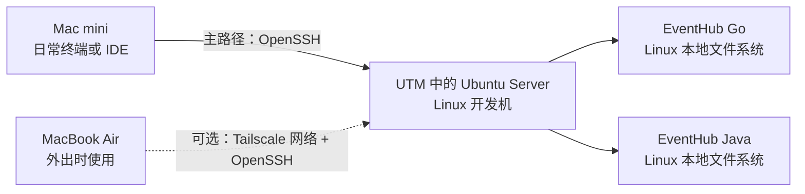

本文是 [[EventHub 六阶段工程化实践路线图]] 的第 1 阶段入口。目标是在完整 Linux 开发机中复现两个 EventHub 仓库的工程入口，并为后续部署阶段建立可信、可恢复的环境基线。

第 1 阶段交付的是**开发环境与首次质量门禁证据**，不是云服务器、发布平台或生产运行环境。笔记里的命令和“预期结果”需要在实际虚拟机中亲自验证；动态版本、设备资源、Git SHA 和真实执行结果分别记录在 [[EventHub 第 1 阶段环境与版本基线]] 与执行记录中。

## 1. 阶段目标

完成本阶段后，应能亲手完成并解释：

1. 宿主机、虚拟机、客户机、Hypervisor 和 CPU 架构的关系。
2. 在 Apple Silicon macOS 宿主机上用 UTM 创建 Ubuntu Server ARM64 虚拟机。
3. 初始化 Linux 用户、主机名、时间、软件包、目录、权限和基础安全设置。
4. 从 macOS 通过 OpenSSH 密钥登录 Ubuntu 虚拟机。
5. 在 Linux 本地文件系统中安装并验证项目需要的工具链。
6. 根据源仓库状态选择 clone、bundle、patch 或受控复制。
7. 在 Linux 中完成 EventHub Go 与 Java 的首次构建、测试和质量门禁。
8. 为验证通过的开发机建立快照、冷备、源码备份和恢复基线。
9. 明确何时停止扩张第 1 阶段，并进入后续部署阶段。

## 2. 本阶段采用的访问路径



日常主路径是：

```text
Mac mini 上的终端或 IDE
    -> SSH
    -> Mac mini 内部运行的 Linux 虚拟机
```

外出时的可选路径是：

```text
MacBook Air
    -> Tailscale 覆盖网络
    -> Linux 虚拟机上的 sshd
```

> [!important] 宿主机连接内部虚拟机也是真实 SSH
> Mac mini 上的 `ssh` 是客户端，Ubuntu 虚拟机内的 `sshd` 是服务端。连接仍会经过主机身份确认、密钥认证、加密协商、远程 Shell 创建和 Linux 用户权限检查，因此能完整练习 SSH 的核心机制。
>
> MacBook Air 经 Tailscale 连接时，OpenSSH 核心流程不变；变化的是网络如何把客户端数据送到服务端。本机到内部虚拟机暂时不会覆盖公网路由、跨地域延迟、运营商 NAT、家庭端口映射和云安全组等问题。

Tailscale 是扩展能力，不是第 1 阶段的必要条件。先让 Mac mini 到虚拟机的本地 SSH 主路径稳定，再按需阅读 [[使用 Tailscale 访问 Linux 主机]]。

## 3. 内容分层与使用方法

这组笔记故意把“通用知识”和“EventHub 本次选择”分开：

| 层级 | 负责回答 | 示例 |
| --- | --- | --- |
| 工程路线图 | 六个阶段为什么这样排序、阶段边界是什么 | [[EventHub 六阶段工程化实践路线图]] |
| 阶段手册 | EventHub 第 1 阶段选择什么、按什么顺序验收 | 本文、环境基线、迁移与门禁、验收清单 |
| 通用知识 | 换项目、换机器后仍成立的原理和操作方法 | UTM、Linux、SSH、Git、Go、Docker、Java 专题 |
| 执行记录 | 某日某台机器实际看到的动态事实与结果 | `执行记录/` 下的日期化笔记 |

因此：

- 通用笔记不会把某台机器的资源、某个动态 IP 或某个项目版本写成普遍答案。
- 阶段基线可以记录 EventHub 当前选择，但必须标注来源、核对日期、适用范围和重新核对方法。
- 执行记录可以保存真实版本、SHA、退出码和失败原因，但不保存密码、令牌、私钥或不应公开的地址。

## 4. 推荐阅读与执行顺序

| 顺序 | 笔记 | 完成标志 |
| --- | --- | --- |
| 0 | [[EventHub 六阶段工程化实践路线图]] | 理解第 1 阶段在六阶段中的位置 |
| 1 | [[虚拟机、客户机与 CPU 架构]] | 能解释 ARM64、AMD64、虚拟化与模拟 |
| 2 | [[UTM 虚拟机资源规划]] | 根据宿主资源选择 vCPU、内存和磁盘 |
| 3 | [[虚拟机网络模式与可达性]] | 根据访问方向选择 Shared、Bridged 或其他网络路径 |
| 4 | [[EventHub 第 1 阶段环境与版本基线]] | 记录本阶段候选配置和项目约束 |
| 5 | [[使用 UTM 创建 Ubuntu Server 虚拟机]] | Ubuntu Server 能从虚拟磁盘启动并联网 |
| 6 | [[Ubuntu Server 初始化与基础安全]] | 用户、时间、更新、服务、防火墙和目录符合预期 |
| 7 | [[OpenSSH 连接、密钥与主机指纹]] | Mac mini 能用密钥登录，新会话仍正常 |
| 8 | [[Linux 开发工作区与本地文件系统规划]] | 项目长期位于 Ubuntu 本地 `$HOME/src` |
| 9 | Git、Go、Java、Docker 专题 | 工具版本满足项目约束，daemon 与 CLI 可验证 |
| 10 | [[Git 仓库跨机器迁移与工作区保留]] | 能按源仓库状态选择安全迁移方式 |
| 11 | [[EventHub 仓库迁移与首次质量门禁]] | 两个项目在 Linux 完成当前 revision 的门禁 |
| 12 | [[UTM 虚拟机快照、备份与恢复]] | 已建立环境与源码的分层恢复基线 |
| 13 | [[EventHub 第 1 阶段验收清单]] | 证据齐全，可以停止本阶段 |

已有工具专题继续作为安装与排障事实源：

- Git：[[Git 安装与初始配置概览]]、[[Ubuntu 从零安装 Git]]、[[Git 常用配置与本地验证]]、[[Git 凭据、SSH 与常见问题排查]]。
- Go：[[Ubuntu 安装 Go]]。
- Java：[[Java 与 Maven 环境搭建概览]]、[[Ubuntu 安装 Java 与 Maven]]、[[Java 版本管理与环境变量配置]]、[[Maven 常用配置与仓库管理]]、[[Java 与 Maven 环境排障与维护]]。
- Docker：[[Docker 安装概览]]、[[Ubuntu 安装 Docker]]。

## 5. 实施主线

### 5.1 记录执行前事实

先读取 [[2026-07-16 第 1 阶段准备检查记录]] 的记录方式，再在新的日期化执行记录中重新检查：

- 宿主机架构、内存和当前可用磁盘。
- UTM 是否已安装及其版本。
- 两个项目当前分支、远程、SHA、ahead/behind 和工作区状态。
- README、Makefile、CI、`go.mod`、`pom.xml` 与 Maven Wrapper 当前声明。

历史记录只能说明当时看到什么，不能替代开始操作前的重新检查。

### 5.2 规划而不是照抄虚拟机资源

本阶段会在环境基线中保存一个可执行案例，但资源选择遵循：

- 客户机架构优先匹配宿主机，Apple Silicon 主线选择 ARM64。
- 给 macOS、IDE 和浏览器保留稳定余量。
- 内存应覆盖 JDK、Maven、Go 测试、Docker daemon 和开发数据库的并发峰值。
- 稀疏磁盘只是“按需增长”，不是“不占空间”；还要预留 VM 冷备空间。
- 网络主线使用 UTM Shared Network，只有明确需求时才改桥接或增加覆盖网络。

资源判断方法见 [[UTM 虚拟机资源规划]]；网络接入与可达性判断见 [[虚拟机网络模式与可达性]]。

### 5.3 创建并初始化 Ubuntu

创建流程由 [[使用 UTM 创建 Ubuntu Server 虚拟机]] 负责，系统初始化由 [[Ubuntu Server 初始化与基础安全]] 负责。两步之间保留清晰边界：

- UTM 笔记负责虚拟硬件、ISO、安装介质和首次从虚拟磁盘启动。
- Ubuntu 笔记负责客户机内的用户、时间、更新、网络检查、服务与基础安全。

不要在还不能稳定从虚拟磁盘启动时，急着安装完整开发工具链。

### 5.4 先打通本地 SSH

按照 [[OpenSSH 连接、密钥与主机指纹]] 完成：

1. 从控制台确认 `sshd` 正常监听。
2. 在 macOS 核对服务端主机指纹。
3. 创建用途明确的客户端密钥。
4. 安装公钥并验证密钥登录。
5. 保持控制台或已登录会话，修改认证策略。
6. 新开第二个 SSH 会话验证成功后，才关闭恢复通道。

Git 托管平台的 SSH 认证与“登录 Linux 开发机”使用相似概念，但服务端、授权位置和用途不同；不要复用含义不清的密钥，也不要混淆 `known_hosts` 记录。

### 5.5 建立 Linux 本地工作区和工具链

项目最终目录采用：

```text
$HOME/src/
├── eventhub-go/
└── eventhub/
```

这是 Ubuntu 用户的本地主目录，不是 macOS 的 `/Users/...`，也不是 UTM 共享挂载。共享目录只用于受控交换，不承载长期活跃仓库、数据库目录或容器卷。

安装顺序建议为：

1. Git 与基础命令行工具。
2. Go 工具链。
3. JDK 与项目实际需要的 Maven 路线。
4. Docker Engine、Docker CLI、Compose plugin。
5. 当前 revision 额外声明的工具，例如 Node.js 或静态分析器。

精确版本以 [[EventHub 第 1 阶段环境与版本基线]] 的项目事实源为准，不盲目追求最新版。

### 5.6 迁移两个仓库

先在源机器检查 Git 状态，再按 [[Git 仓库跨机器迁移与工作区保留]] 选择路线：

- 已提交并推送：fresh clone。
- 有未推送提交：优先整理并推送；不能推送时使用 bundle。
- 有未提交、未跟踪或仅本地工程文件：先分类，再使用 commit、patch 或受控 `rsync`。

不要在未检查状态时直接覆盖目标目录，也不要把“源机器能构建”误认为“远端仓库可复现”。

### 5.7 运行 EventHub 当前门禁

按照 [[EventHub 仓库迁移与首次质量门禁]]：

- 核对两个仓库的远程、分支、HEAD 和工作区。
- 再次从项目声明确认 Go、JDK、Maven、Node 和 Docker 要求。
- 先做原生构建与测试，再做生成物、静态分析、容器构建与 Compose 验证。
- 区分真实通过、测试跳过和因为缺少依赖而未执行。
- 对会写入源码或生成文件的命令，保存执行前后 `git status --short`。

### 5.8 建立恢复基线

质量门禁通过后，按 [[UTM 虚拟机快照、备份与恢复]] 建立：

- UTM 提供的快照或等价恢复点。
- 关机状态的 VM 冷备。
- 独立的 Git 远端、bundle 或其他源码备份。
- 若已有数据库或 Docker 卷，独立的数据备份策略。
- 至少一次恢复步骤核对或隔离恢复演练。

虚拟机快照不等于源码备份，更不等于数据库逻辑备份。

## 6. 第 1 阶段的退出标准

最终以 [[EventHub 第 1 阶段验收清单]] 为唯一详细清单。至少应证明：

- Ubuntu 能启动、联网、解析 DNS 并同步时间。
- Mac mini 能通过 SSH 密钥稳定登录。
- Linux 用户、`sudo`、目录和权限符合预期。
- Git、Go、Java、Maven、Docker 和 Compose 满足当前项目约束。
- 两个仓库位于 Linux 本地文件系统，身份和工作区状态已核对。
- Go 与 Java 项目都完成当前 revision 要求的构建、测试和质量门禁。
- Docker daemon 与 Compose 静态配置已验证。
- 环境、源码和数据恢复方法已分层记录。

“工具已安装”不是完成；“某条命令退出码为 0”也不一定代表所有测试真实执行。验收记录必须保留版本、提交、命令、退出码、PASS/SKIP 和恢复动作。

## 7. 本阶段明确不做

| 本阶段完成 | 留给后续阶段 |
| --- | --- |
| 本地完整 Linux 开发机 | 购买与加固云主机 |
| 本地 SSH 与可选 Tailscale | 公网、云安全组和跨地域网络 |
| 原生构建、测试和本地容器验证 | 正式部署、域名、TLS 与生产数据 |
| 开发 VM 的恢复基线 | 发布回滚、生产备份与灾难恢复 |
| 手工可重复的质量门禁 | GitHub Actions、镜像仓库和自动发布 |

当验收清单完成后，应停止继续把 Nginx、域名、云主机、CI/CD、监控或 Kubernetes 塞入本阶段，转入路线图中的下一阶段。

## 官方资料入口

- [UTM 官方文档](https://docs.getutm.app/)
- [Ubuntu Server 官方文档](https://documentation.ubuntu.com/server/)
- [OpenBSD OpenSSH 手册](https://man.openbsd.org/ssh)
- [Tailscale 官方文档](https://tailscale.com/docs/)
- [Go 官方文档](https://go.dev/doc/)
- [Docker Engine 官方文档](https://docs.docker.com/engine/)
- [Apache Maven 官方文档](https://maven.apache.org/guides/)
