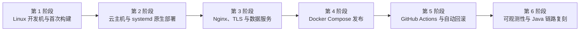

本文是 EventHub 从本地 Linux 开发环境逐步演进到可部署、可发布、可回滚、可观测系统的总入口。它负责维护阶段依赖、架构演进和完成状态，不复制每个技术主题的完整教程。

技术原理分别沉淀在 Linux、虚拟化、Git、Go、Java、Docker、MySQL 等主题目录；本目录只说明这些能力如何在 EventHub 项目中组合、验证和演进。

## 内容分层规则

本系列使用四层内容模型：

| 层次 | 保存内容 | 不应保存 |
| --- | --- | --- |
| 工程路线图 | 六阶段依赖、演进顺序、统一安全规则和阶段入口 | 单个阶段的完整命令与动态执行结果 |
| 技术知识笔记 | 可跨项目复用的原理、命令、选择依据、验证和排障 | EventHub 当前 SHA、单次执行结果、某台机器的临时状态 |
| 项目阶段笔记 | 阶段目标、技术组合、执行顺序、精确项目约束和验收标准 | 密码、令牌、私钥、动态 IP 等秘密或短期地址 |
| 执行记录 | 某次实际版本、资源配置、提交、命令结果和恢复点 | 未经验证的“已完成”结论和不必要的敏感文件名 |

精确版本和资源配置可以写入项目阶段或执行记录，但必须注明核对日期、事实来源、适用范围和重新核对方法。路线图负责解释“为什么这样演进”，通用知识笔记负责解释“如何选择”，阶段笔记负责记录“本阶段选择了什么”，执行记录负责证明“实际执行结果是什么”。

## 六阶段落地节奏

| 阶段 | 核心目标 | 主要交付物 | 明确不提前做 |
| --- | --- | --- | --- |
| 第 1 阶段 | 建立 UTM Linux 开发机，两个仓库通过完整质量门禁 | 可恢复的开发虚拟机、Linux 工具链、两仓库首次构建证据 | 云部署、正式发布流水线、生产监控 |
| 第 2 阶段 | 购买云主机，用 systemd 完成 Go 原生部署 | 独立服务用户、systemd unit、日志与手工发布/回滚流程 | Nginx、正式 TLS、容器化发布 |
| 第 3 阶段 | 接入 Nginx、域名、TLS、MySQL/Redis 和备份 | 反向代理、HTTPS、数据服务、备份和恢复基线 | 自动化镜像发布 |
| 第 4 阶段 | 改为 Docker Compose 发布 | 应用与依赖的 Compose 编排、镜像与卷边界 | 完整 CI/CD 自动回滚 |
| 第 5 阶段 | 接入 GitHub Actions、GHCR 和自动健康检查/回滚 | 构建推送流水线、制品仓库、健康检查和失败回滚 | 完整指标与告警平台 |
| 第 6 阶段 | 接入 Prometheus/Grafana，并复刻 Java 发布链路 | 指标、仪表盘、告警基础和 Java 同链路交付 | Kubernetes 等新的平台化扩张 |

## 阶段依赖原则

后一阶段建立在前一阶段已经验证的能力上，但不会简单删除旧知识：

- 第 4 阶段用 Compose 替换应用的主要发布方式，不代表 systemd、服务用户、journal 和 Linux 权限知识失效。
- 第 5 阶段自动化第 4 阶段已经能够手工完成的发布与回滚，不应让流水线成为第一条可用发布路径。
- 第 6 阶段增加观测能力，不应在没有稳定健康检查、日志和回滚边界时先堆仪表盘。
- Java 链路复刻以已经跑通的 Go 链路为参照，但版本、构建工具、运行时和资源限制仍以 Java 项目自身约束为准。

## 当前阶段入口

当前只建立第 1 阶段目录：

- [[EventHub 第 1 阶段实施概览]]
- [[EventHub 第 1 阶段环境与版本基线]]
- [[EventHub 仓库迁移与首次质量门禁]]
- [[EventHub 第 1 阶段验收清单]]
- [[2026-07-16 第 1 阶段准备检查记录]]

后续阶段在真正开始设计和执行时再创建目录与笔记，避免空目录、占位文件和指向不存在内容的 wikilink。

## 阶段完成状态

| 阶段 | 当前状态 | 判定依据 |
| --- | --- | --- |
| 第 1 阶段 | 笔记和准备检查已建立，实际环境验收待执行 | 当前动态事实见 [[2026-07-16 第 1 阶段准备检查记录]] |
| 第 2 阶段 | 未开始 | 需要第 1 阶段真实通过后再设计 |
| 第 3 阶段 | 未开始 | 依赖第 2 阶段稳定部署 |
| 第 4 阶段 | 未开始 | 依赖第 3 阶段明确数据与代理边界 |
| 第 5 阶段 | 未开始 | 依赖第 4 阶段已有可重复的手工发布/回滚 |
| 第 6 阶段 | 未开始 | 依赖发布链路和健康检查稳定 |

## 每阶段统一交付结构

每个阶段至少回答：

1. 阶段解决什么问题，输入和输出是什么。
2. 采用哪条主线，替代方案为何不作为当前主线。
3. 项目精确约束来自哪些文件，如何重新核对。
4. 哪些操作有状态或不可逆，恢复点在哪里。
5. 需要运行哪些构建、测试、健康检查和失败场景验证。
6. 完成后保存什么证据。
7. 哪些事项明确留到下一阶段。

执行结果写入独立的 `执行记录/`，不通过修改教程正文来伪装阶段进度。

## 全系列共同安全约束

- 不在公开笔记中保存真实用户名、IP、密钥、令牌或密码。
- 动态地址通过变量、主机别名或可解析名称表达，不写成永久事实。
- runnable Shell 使用 `$HOME`、`$USER` 和有意义的变量，不使用裸尖括号占位符。
- 版本选择以项目声明为先，不以“最新版”替代兼容性判断。
- UTM、Ubuntu、OpenSSH、Tailscale、Go、Docker 等易变化内容注明核对日期并引用官方资料。
- 中国大陆网络环境只在下载或仓库访问确有需要时补充，不进入文件名、标题和主要标签。
- 不推荐来源不明的镜像、安装脚本或加速地址。
- 替代方案可以介绍，但每个阶段必须保留一条清晰、可验收的主线。
