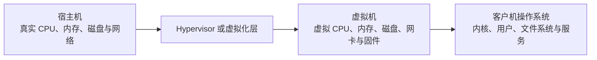

本文解释宿主机、Hypervisor、虚拟机、客户机操作系统、CPU 架构、虚拟化、模拟和容器之间的关系。理解这些概念后，才能正确选择系统镜像、工具链和容器镜像，而不是把所有“隔离环境”都当成同一种技术。

## 四个基本角色



| 概念 | 职责 | 常见误解 |
| --- | --- | --- |
| 宿主机（host） | 提供真实硬件资源并运行虚拟化软件 | 宿主机终端不是客户机终端 |
| Hypervisor | 隔离并调度虚拟机使用的硬件资源 | 它不是客户机内的 Linux 服务 |
| 虚拟机（VM） | 一组软件定义的虚拟硬件 | VM 不等于某个终端窗口 |
| 客户机（guest） | 安装在 VM 内的完整操作系统 | 客户机有自己的内核、用户、IP 和文件系统 |

同一宿主机可以运行多个虚拟机。每台客户机都应像独立计算机一样管理用户、更新、服务、网络和备份。

## ARM64 与 AMD64

ARM64 和 AMD64 是两套不同的 64 位指令集架构：

| 常见名称 | Linux 常见输出 | Go/Docker 常见名称 | 典型平台 |
| --- | --- | --- | --- |
| ARM64 / AArch64 | `aarch64`、Debian `arm64` | `arm64`、`linux/arm64` | Apple Silicon、ARM 服务器 |
| AMD64 / x86_64 | `x86_64`、Debian `amd64` | `amd64`、`linux/amd64` | Intel、AMD 64 位计算机 |

**执行位置：Linux 或 macOS（任意目录，只读）**

```bash
uname -m
```

**执行位置：Debian/Ubuntu 客户机（任意目录，只读）**

```bash
dpkg --print-architecture
getconf LONG_BIT
```

选择 ISO、Go/JDK 二进制包和原生依赖时，必须同时匹配操作系统和 CPU 架构。`darwin-arm64`、`linux-arm64` 和 `linux-amd64` 不是可互换文件。

## 虚拟化与模拟

### 虚拟化

宿主与客户机使用相同 CPU 架构时，客户机大部分指令可以借助硬件虚拟化执行。特点：

- 性能和能效通常更适合日常开发。
- 仍然拥有独立客户机内核。
- 客户机故障通常不会直接变成宿主机进程故障。
- 不能直接运行另一套架构的原生二进制。

### 模拟

宿主和客户机架构不同时，需要翻译指令。例如在 ARM64 宿主上模拟 AMD64 客户机。特点：

- 能扩大兼容范围。
- 性能损耗和排障变量更多。
- 适合必须验证特定架构的场景，不应成为无理由默认路线。

选择原则：

1. 有同架构系统和依赖时，优先虚拟化。
2. 只有依赖明确不支持宿主架构时，再评估模拟。
3. 先确认问题来自应用、工具链还是架构，不要用模拟掩盖未核对的二进制来源。

## 虚拟机与容器

| 项目 | 虚拟机 | 容器 |
| --- | --- | --- |
| 内核 | 客户机拥有独立内核 | 与容器宿主共享内核 |
| 隔离对象 | 完整操作系统 | 进程、文件系统、网络和资源边界 |
| 启动速度 | 通常较慢 | 通常较快 |
| systemd 学习 | 可以直接运行完整 init/service 模型 | 单容器通常不以完整 systemd 为中心 |
| 典型用途 | 完整 Linux 开发机、跨系统实验 | 应用及依赖的可重复运行环境 |

在 macOS 上运行 Linux 容器时，底层仍需要 Linux VM 或等价虚拟化能力，因为 macOS 内核不能直接提供 Linux 容器所需的内核接口。

## 架构对容器镜像的影响

多架构镜像可以同时发布 `linux/amd64` 和 `linux/arm64` 变体，Docker 会按当前平台选择匹配版本。只有 AMD64 变体的镜像在 ARM64 环境中可能：

- 借助模拟运行，性能较低；
- 在构建或启动时失败；
- 运行到原生库加载阶段才暴露问题。

**执行位置：Docker 可用的 Linux 主机（任意目录）**

```bash
printf '请输入本地已存在的镜像名：'
IFS= read -r IMAGE_NAME

docker info --format '{{.Architecture}}'
docker image inspect "$IMAGE_NAME" --format '{{.Os}}/{{.Architecture}}'
```

不要把架构错误误判成应用业务错误。

## 网络与存储仍属于客户机

虚拟机通常拥有：

- 独立的虚拟网卡和 IP。
- 独立虚拟磁盘和文件系统。
- 自己的用户、权限和服务端口。
- 从宿主机看来需要经过虚拟网络才能到达的服务。

宿主机 SSH 到内部虚拟机仍是真实的客户端—服务端连接；物理距离短不会跳过 SSH 协议、主机身份和 Linux 用户认证。

## 完成标准

- [ ] 能区分宿主机、Hypervisor、VM 和客户机。
- [ ] 能根据 `uname -m` 判断架构。
- [ ] 知道同架构优先虚拟化、跨架构才考虑模拟。
- [ ] 能解释虚拟机和容器是否共享内核。
- [ ] 知道工具链、ISO 和容器镜像都需要核对架构。

## 相关笔记

- [[UTM 虚拟机网络与资源规划]]
- [[使用 UTM 创建 Ubuntu Server 虚拟机]]
- [[EventHub 第 1 阶段环境与版本基线]]

## 官方参考资料

以下资料于 **2026-07-16** 核对，产品能力和支持范围可能变化：

- [UTM：Linux guest support](https://docs.getutm.app/guest-support/linux/)
- [Ubuntu：ARM Server 下载](https://ubuntu.com/download/server/arm)
- [Docker：Docker overview](https://docs.docker.com/get-started/docker-overview/)
- [Go：Download and install](https://go.dev/doc/install)
