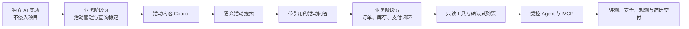
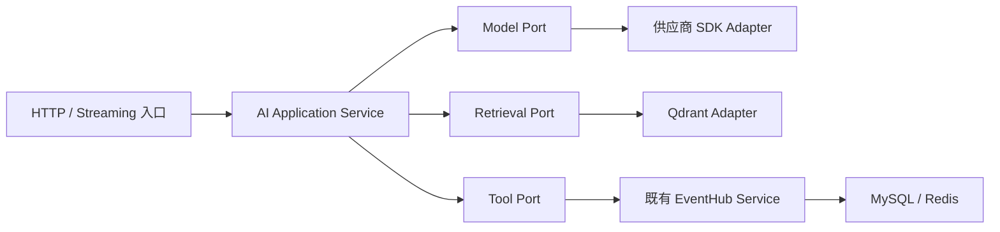
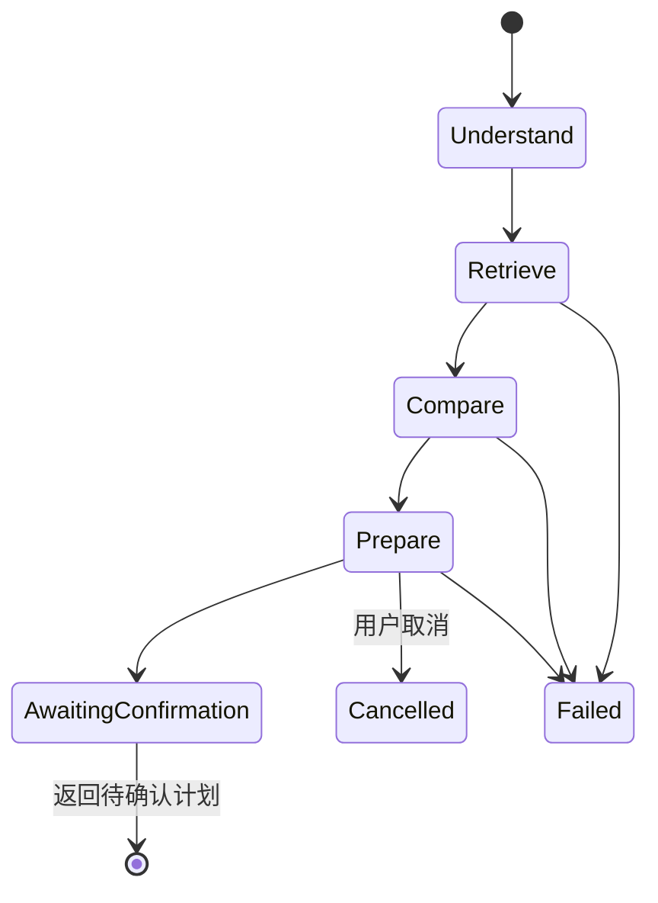

本文是 [[EventHub 项目实践总览]] 下的 AI 应用开发维度入口，负责把 [[AI 应用开发学习路线图]] 映射到 EventHub Java 与 Go 两个后端项目，是活动票务场景、双仓库业务门槛和最终交付物的唯一项目路线图。

模型 API、RAG、Tool Calling、MCP、评测与安全的通用原理不在这里重复，源码学习使用 [[GitHub AI 项目源码研读方法与清单]]，每次实验与阶段证据使用 [[AI 学习与实验记录模板]]。本文只记录 EventHub 特有的业务对象、接入顺序、交易红线和 Java / Go 实现差异。

本路线描述未来演进，不代表当前代码已经实现相应 AI 功能。

## 本路线在项目中的位置

EventHub 的业务开发、工程化交付和 AI 应用开发是三条相关但不同的实践路线，完整关系与统一称谓由 [[EventHub 项目实践总览]] 维护。本文只引用以下阶段与工程依赖：

- “业务阶段 3”或“业务阶段 5”指 Java 仓库 `docs/roadmap/event-booking-roadmap.md` 定义的传统后端业务里程碑；Go 项目复刻相同产品语义，不套用其他文档的内部阶段编号。
- “AI 阶段”指 [[AI 应用开发学习路线图]] 的八阶段能力顺序，不是业务阶段或工程化阶段。
- AI 功能需要部署、发布、回滚和服务可观测性时，统一复用 [[EventHub 工程化交付路线图]]。

AI 应用开发不是工程化第 7 阶段；通用 AI 实验可以与业务和工程化学习并行，但正式接入必须满足本文定义的业务门槛。

## 当前项目基线

以下判断来自 2026-07-26 对两个仓库的代码与质量门禁快照。真正接入某项能力前，必须重新核对构建清单、迁移、接口契约和测试，不能把本节永久视为最新状态。

### Java eventhub

- Java 21、Spring Boot、Spring MVC、Spring Security、MyBatis、MySQL、Redis Client / 配置、Compose 与 Flyway 的工程底座已经建立。
- Redis 尚未实际承载业务缓存、幂等或限流，不能据此宣称已经具备 AI 会话、缓存或限流能力。
- 认证、JWT / refresh token 轮换、MySQL session、RBAC、统一错误处理和相应测试已有较完整基础；当前 logout 尚未接入 session 吊销，登录会话闭环不能描述为全部完成。
- 活动、场次、票种、订单、库存和支付等核心票务领域尚未形成可供 AI 依赖的完整闭环。

### Go eventhub-go

- Go、chi、OpenAPI 严格服务端契约、MySQL / sqlc、数据库迁移、Redis 和 Testcontainers 等工程基础已经建立。
- 认证、refresh session、RBAC、错误契约和质量门禁已有较完整基础。
- 活动、订单、库存和支付等领域同样尚未达到 AI 工具可以依赖的程度。
- “Java 先确定产品语义、Go 再等价复刻”的方式可以延续到 AI 能力，但 Go 实现必须遵循 `context.Context`、显式依赖和 Go 错误处理习惯。

### 当前结论

```text
现在
  ├─ 继续完成 Java / Go 传统票务业务
  └─ 在独立实验中学习模型 API、结构化输出和评测

业务门槛满足后
  └─ 把已经通过实验评测的 AI 能力逐项接入 EventHub
```

现阶段不在两个仓库中预埋空接口、AI 包或框架依赖，也不建立与真实业务无关的聊天页面。

## 产品主线与业务门槛

最终简历主线统一为“活动发现与购票助手”：



正式接入必须满足对应门槛：

1. 活动内容 Copilot：管理员活动创建、编辑、字段校验、草稿和发布边界稳定。
2. 语义搜索：活动、场次、票种拥有稳定标识、公开状态、更新时间和可导出的检索内容。
3. RAG：FAQ、平台规则和活动资料拥有来源 ID、版本、更新时间和可见范围。
4. 只读工具：对应业务 Service 可独立工作，并完成鉴权、错误处理和集成测试。
5. 购票写操作：订单、库存、支付、状态机、事务和幂等闭环稳定。
6. Agent 与 MCP：工具白名单、取消、超时、审计和人工审批已经验证。

没有稳定业务数据，不进入语义搜索；没有可评测检索，不进入 RAG；没有确定性业务 Service，不向模型开放工具；没有稳定工具和人工确认，不进入 Agent。

## 通用八阶段到 EventHub 的映射

| AI 阶段 | EventHub 实践产物 | Java 进入条件与先行动作 | Go 复刻条件与动作 |
| --- | --- | --- | --- |
| AI 阶段 1：应用基础 | EventHub 风格活动数据、固定检查规则、失败分类 | 不接项目；用 Notebook 观察概率性输出 | 共享 JSON / JSONL 数据，不做项目集成 |
| AI 阶段 2：原生模型 API | 活动摘要 CLI 或最小服务，覆盖同步、流式、Schema 与故障注入 | 用 OpenAI Java 建立供应商适配边界 | Java 退出标准通过后，用 OpenAI Go 复刻相同产品契约 |
| AI 阶段 3：框架与结构化内容生成 | 管理员可预览、可修改、不可自动发布的内容草稿 | 业务阶段 3 完成后，对照原生 SDK 与 Spring AI | 对应活动管理完成后，对照原生 SDK 与 Eino |
| AI 阶段 4：Embedding 与语义检索 | Qdrant 派生索引，比较关键词、向量与混合检索 | 活动、场次和票种标识与更新语义稳定 | 复用同一集合语义、数据与查询评测集 |
| AI 阶段 5：带引用 RAG | 活动、FAQ、平台规则问答及拒答 | 来源、版本、更新时间和权限稳定后先确定引用契约 | 使用相同语料版本、引用规则与无答案用例 |
| AI 阶段 6：Tool Calling 与业务工作流 | 活动、场次、库存、本人订单只读工具；确认式购票计划 | 业务阶段 5 完成后，先只读再实验写操作 | Java 工具契约和安全评测通过后复刻 |
| AI 阶段 7：受控 Agent 与 MCP | 有步骤和预算上限的活动发现助手；只读 MCP 适配面 | 已验证工具、审计、取消、超时和审批 | 复刻停止与审批语义，验证协议互操作 |
| AI 阶段 8：工程交付 | 端到端评测、威胁测试、Trace、成本与简历材料 | 建立完整 Java 基线与降级演示 | 用同一数据完成 Go 对比与最终报告 |

Java 未达到当前 AI 阶段退出标准前，不开始同阶段的 Go 项目实现；独立阅读和通用实验可以并行。

## 未来实现边界

本节只固定职责，不提前冻结 Controller 路径、OpenAPI operation、Go package、Java class、数据库表名或方法签名。



- 供应商 SDK 类型只存在于 Model Adapter，不进入 EventHub Service 或共享产品契约。
- Retrieval Adapter 只维护可重建派生索引；MySQL 继续保存活动、票务和交易权威事实。
- Tool Adapter 只能调用既有 EventHub Service，不直接访问数据库或绕过权限、事务和幂等边界。
- AI Application Service 负责 Prompt、检索编排、工具循环、确认和响应组装，不重新实现订单与库存规则。
- HTTP 或流式入口只处理认证上下文、协议映射、取消传播和错误结束，不承担模型供应商逻辑。

### Java 先行

- 先通过项目自有接口隔离 OpenAI Java，再以固定评测比较是否引入 Spring AI。
- 引入 Spring AI 前，必须按届时 EventHub 的 Spring Boot 基线核对官方兼容矩阵；不能为了跟随示例直接升级项目。
- 保持 Spring Security 用户上下文和已有 Service 权限边界，不从模型参数接收可信 user ID。
- 外部模型调用不得无边界占用数据库事务；结构化输出依次通过 Schema、Bean Validation 与业务校验。
- 流式接口必须定义客户端取消、应用超时、上游错误和部分输出状态。
- SSE、异步回调或线程池任务不能假设 request ID、MDC 与 SecurityContext 自动传播；应显式传递主体和请求元数据，通过统一 executor、`TaskDecorator` 或等价机制传播，并在 `finally` 中清理。

### Go 语义复刻

- 从 OpenAPI 或 HTTP handler 将 `context.Context` 传播到应用、模型、检索和工具层。
- 先用小接口隔离 OpenAI Go，再以同一评测判断 Eino 的适用范围。
- 不照搬 Spring 的 Bean 或异常体系；错误值、超时、并发和资源释放遵循 Go idiom。
- 工具调用和写操作继续经过已有 Service、sqlc / transaction 与鉴权边界。
- 流式 goroutine 必须随客户端取消或服务超时退出，不能泄漏后台任务。

Java / Go 必须对齐产品语义、输入输出、引用规则、工具与确认契约、错误类别、演示数据和评测用例；框架、包结构、依赖注入和 Prompt 拼装可以不同。验收比较语义等价与安全结果，不比较自然语言答案是否逐字相同。

## EventHub 共享资产

两个仓库共同维护一份逻辑上的权威资产。物理位置等首项能力真正开始时通过 ADR 决定，避免现在制造跨仓同步负担。

### 演示数据

使用稳定测试标识和脱敏数据，至少覆盖：

- 正常活动、多场次活动和多票种活动。
- 已下架、已结束或信息不完整的活动。
- 无库存、低库存、价格变化和限购场景。
- 内容相似但城市、时间或可见范围不同的活动。
- 相互冲突或存在新旧版本的平台规则与 FAQ。
- 无权查看的用户、他人订单和敏感字段。

### 共享契约、评测与证据

- 每项能力固定产品目标、输入输出、引用与工具结构、错误类别、取消语义、确认要求和模型不得决定的字段。
- 共享评测集至少标注数据版本、模拟身份、期望资料或活动、期望与禁止工具、必须与禁止事实，以及是否拒答、降级或要求确认。
- Java 与 Go 使用同一份机器可读数据；普通测试使用 fake 或审查过的 fixture，真实模型评测单独运行并记录时间、模型版本和成本。
- 每阶段保存一条成功链路、一条失败或降级链路、评测结果、Java / Go 差异、已知限制和重新评估条件。
- 具体实验记录继续使用 [[AI 学习与实验记录模板]]，不在本项目路线中复制通用字段说明。

## 确定性票务交易边界

AI 可以帮助理解、检索、解释和编排，但不能成为票务事实与交易结果的权威来源。

| AI 可以负责 | EventHub 确定性后端必须负责 |
| --- | --- |
| 生成活动文案、FAQ 和标签草稿 | 校验字段并决定保存、发布和上下架 |
| 理解自然语言搜索意图 | 按发布状态、城市、时间与权限执行硬过滤 |
| 检索资料并生成带引用回答 | 提供资料版本、可见范围与真实来源 |
| 提议调用活动、库存或订单工具 | 从认证上下文确定用户身份与权限 |
| 解释订单当前状态 | 从数据库读取订单和状态机结果 |
| 生成购票参数与待确认计划 | 重读价格、库存与限购规则，执行幂等事务 |
| 提示用户可执行的下一步 | 决定支付、关单、退款和库存释放是否合法 |

全路线遵守以下红线：

1. 模型不能提供或覆盖当前用户身份、角色和数据访问范围。
2. 模型不能执行 SQL，也不能绕过 Service、事务、幂等和领域规则。
3. 价格、库存、订单和支付状态必须在工具执行时重新读取。
4. 改变用户可见状态或产生交易副作用的操作，必须经过显式确认、参数重校验和幂等控制。
5. 模型生成的工具参数与检索文档内容都按不可信输入处理。
6. 模型不可自动支付、退款、修改库存、上下架活动或改变订单状态。
7. Prompt、日志和评测数据不得包含密码、Token、密钥或无必要的个人信息。

## EventHub 各项能力的项目增量

通用学习目标、实验方法和评测原则以 [[AI 应用开发学习路线图]] 为准。这里仅固定 EventHub 接入时增加的业务约束。

| 能力 | EventHub 进入条件 | 项目实现与验收重点 | 必测项目失败 |
| --- | --- | --- | --- |
| 活动内容 Copilot | 业务阶段 3；活动事实字段、宣传字段、草稿与发布动作分离 | 管理员提交活动事实，模型只返回结构化草稿；后端校验后供预览和修改，原 Service 决定保存或发布 | 模型改变日期、票价、场馆、嘉宾或规则；恶意输入；格式错误或超时造成原活动被覆盖 |
| 活动语义搜索 | 活动、场次、票种标识、发布状态和更新语义稳定 | Qdrant 作为派生索引；强约束尽量前置过滤，召回后再以 MySQL 权威事实校验；可全量重建并回退关键词搜索 | 下架或更新后的旧向量残留；索引部分更新；时间、城市、状态或权限被相似度覆盖 |
| 带引用的活动问答 | 活动资料、FAQ 与规则具有来源、版本、更新时间和可见范围 | 后端把实际检索片段映射为引用；证据不足、冲突或过期时拒答；实时价格、库存、订单和支付状态改走工具 | 引用不支持结论；越权资料泄漏；恶意检索内容改变系统规则；用常识补写票务事实 |
| 只读业务工具 | 活动、场次、实时库存和本人订单查询 Service 稳定 | 服务器从认证上下文注入身份；先开放搜索、详情、库存和本人订单查询，并记录工具选择与审计 | 选错或越权工具；读取他人订单；参数缺失；工具失败后模型编造或声称不存在的执行结果 |
| 确认式购票 | 业务阶段 5；订单、库存、支付、状态机、事务与幂等闭环完成 | 模型只生成待确认计划；确认后重做鉴权、校验、幂等检查并读取最新价格和库存，再由原 Service 执行 | 确认前后状态变化；重复提交；失败后无限重试；模型声称支付、扣库存或下单已经成功 |
| 受控 Agent 与 MCP | RAG、工具、审计、取消、超时与审批分别通过评测 | Agent 只组合已批准能力并停在确认边界；MCP 只暴露审核过的只读适配面，不替换内部 Service 或 HTTP API | 循环或超预算；扩大工具权限；取消后继续执行；不可信 MCP Server 返回恶意或不合 Schema 的结果 |

## 受控 Agent 状态机

EventHub 的首个 Agent 场景只负责根据时间、城市和兴趣寻找活动，比较候选场次，生成购票准备摘要，并停在人工确认边界。确认后的交易只能进入已经由 Tool Calling 阶段验证的确定性工作流。



每个状态都要定义输入、输出、允许工具、步骤上限、时间上限、Token / 成本预算和失败去向。Agent 不得创建新目标，也不得通过 Prompt 扩大权限。

## 工程与简历交付

AI 功能沿用 [[EventHub 工程化交付路线图]] 的部署、健康检查、发布、回滚和服务可观测性，不建立第二套孤立生产链路。在通用观测字段之外，项目材料至少包括：

1. 传统票务业务、AI 应用层、模型、检索和工具边界架构图。
2. 可重复初始化的脱敏活动、场次、票种、规则、用户和订单数据。
3. Java / Go 共享评测集、产品语义对比和实现取舍报告。
4. 活动内容草稿的人工确认演示。
5. 关键词、纯向量和混合检索的效果对比。
6. 一条带真实引用的回答和一条证据不足的拒答。
7. 一次只读工具调用、一次确认式操作和一次权限拒绝。
8. 一个有步骤、预算、取消和人工确认边界的 Agent 场景。
9. Java / Go MCP 只读工具的互操作或契约验证。
10. 模型、检索和工具不可用时的失败与降级演示。
11. EventHub 特有 ADR、失败案例、已知限制、启动说明和可复现演示脚本。

简历只写已经由演示数据、评测结果和 Trace 支撑的事实与数字，不能预先编造提升比例或成功率。

## 最终退出标准

只有同时满足以下条件，才能把“EventHub 活动发现与购票助手”标记为完成：

- Java 与 Go 两个项目的传统活动票务业务闭环完整，关键交易规则已有确定性测试。
- Java AI 实现通过固定数据、正常场景、失败场景和攻击场景评测。
- Go 使用相同产品契约和评测集完成语义复刻，并记录实现差异。
- 内容、检索、RAG、工具、确认和 Agent 均有可重放证据，而不是只成功演示一次。
- 模型无法绕过价格、库存、订单、支付、权限、事务、幂等和人工确认边界。
- 任意开发者可按说明启动依赖、加载演示数据并重放主要 Java / Go 场景。

## 当前下一步

1. 继续完成 Java 与 Go 的传统活动、场次和票种业务主线。
2. 在独立实验中开始 [[AI 应用开发学习路线图]] 的 AI 阶段 1，不修改 EventHub 两个仓库。
3. 使用 [[AI 学习与实验记录模板]] 保存第一组 EventHub 风格活动数据、固定检查规则和失败分类。
4. AI 阶段 1 达到退出标准后，再建立 Java 原生模型 API 的独立最小实验。
5. 等活动管理闭环真实稳定时，重新核对两个仓库，再设计活动内容 Copilot 的具体接口和阶段文档。

首轮不预建未来阶段目录、空接口和占位笔记；真正进入某项能力时，再创建主题笔记、项目阶段文档和 `执行记录/`。
